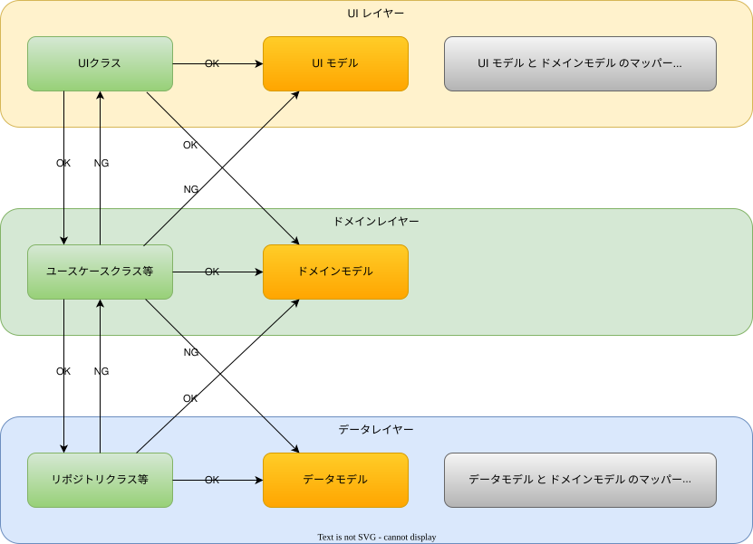

- [モデルと各レイヤーの依存関係](#モデルと各レイヤーの依存関係)
  - [図解](#図解)
  - [公式アーキテクチャでは説明されていない部分](#公式アーキテクチャでは説明されていない部分)

# モデルと各レイヤーの依存関係

最新の Android アプリ開発では、 UI レイヤー / ドメインレイヤー / データレイヤーの 3 層アーキテクチャが推奨されています。

各レイヤーの依存関係は、公式ドキュメント ( [アプリアーキテクチャについて](./1.アプリアーキテクチャについて.md) ) を見る限りでは、 `UI レイヤー -> ドメインレイヤー -> データレイヤー` の関係にあることが示されています。確かにこれは正しい依存関係なのですが、モデルを含めて考えた場合、一部、依存関係が逆転する場合もあるため、その点について解説します。

## 図解

まずは、結論を図で表現すると以下のようになります。

## 公式アーキテクチャでは説明されていない部分

公式アーキテクチャで説明されていない部分は以下です。

- `データレイヤーのクラス -> ドメインモデル` の依存は OK
- `ドメインレイヤーのクラス -> データモデル` の依存は NG

これは、クリーンアーキテクチャに基づく考え方です。クリーンアーキテクチャでは、ドメインモデルを円の一番内側に来るものと考えています。つまり、ドメインモデルは、データレイヤーや UI レイヤーから依存されるものと考えられています。これは、ビジネスの中核をなすビジネスロジックは、一度決まってしまえば、あまり修正されるものではないと考えられているためです。一方で、 UI の修正頻度や外部データのデータ構造の修正頻度は、それよりも高いと考えられています。

