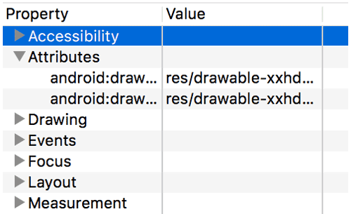

- [デバイスの開発者向けオプションを設定する](#デバイスの開発者向けオプションを設定する)
  - [デバッグ](#デバッグ)

# デバイスの開発者向けオプションを設定する

## デバッグ

デバッグ オプションを使用すると、オンデバイス デバッグを設定したり、デバイスと開発コンピュータ間の通信を確立したりすることができます。

上記の図に示すように、USB デバッグを有効にして、Android デバイスが [Android Debug Bridge（adb）](https://developer.android.com/studio/command-line/adb?hl=ja&_gl=1*11q8el9*_up*MQ..*_ga*MTk5MTYxMTA4Ni4xNzI3NDI1ODc0*_ga_6HH9YJMN9M*MTcyNzQ0NzM1MC40LjAuMTcyNzQ0NzM1MC4wLjAuMTI2MDE2NDg2Mw..) を介して開発マシンと通信できるようにします。[デバッガを待機] オプションは、[デバッグアプリを選択] を使用してデバッグ対象アプリを選択するまでは無効になっています。[デバッガを待機] を有効にすると、選択したアプリはデバッガがアタッチされるのを待ってから起動するようになります。

他のデバッグ オプションは以下のとおりです。

- ログデータをデバイス上に永続的に保存: デバイス上に永続的に保存するログメッセージの種類を選択できます。オプションには、オフ、すべて、無線情報以外すべて、カーネルのみ、があります。

- 仮の現在地情報アプリを選択: このオプションを使用してデバイスの GPS 位置情報を仮のものに偽装することで、他の場所でもアプリが同じように機能するかどうかをテストできます。 このオプションを使用するには、GPS 位置情報を仮のものに偽装できるアプリをダウンロードしてインストールしておく必要があります。

- 表示属性検査を有効にする: View インスタンスの mAttributes メンバー変数に表示属性情報を保存して、それをデバッグに利用できます。この属性情報は、以下の図のように、Layout Inspector ユーザー インターフェースからアクセスできます。有効にしていない場合、**Attributes** 項目は利用できません。

- GPU デバッグレイヤの有効化: Android 9（API レベル 28）以降を搭載しているデバイスで利用可能です。このオプションを有効にすると、ローカル デバイス ストレージから Vulkan 検証レイヤを読み込むことができます。詳しくは、Android の Vulkan 検証レイヤをご覧ください。

