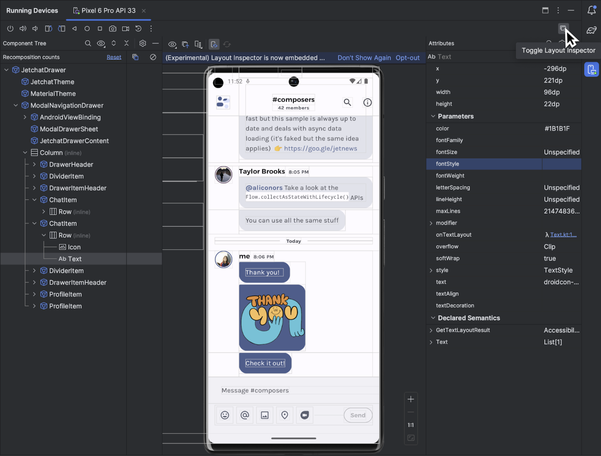
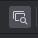
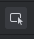
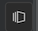
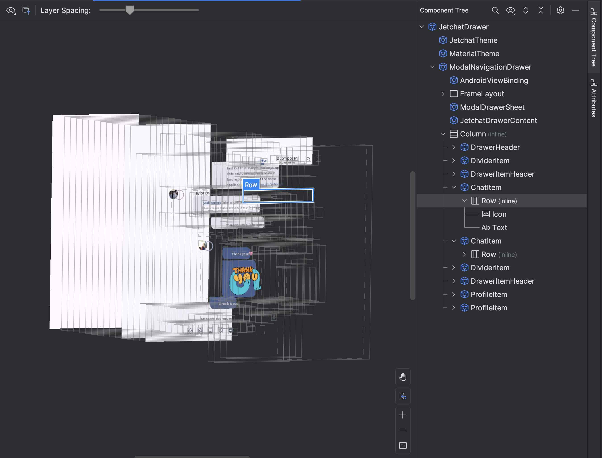
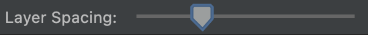
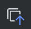
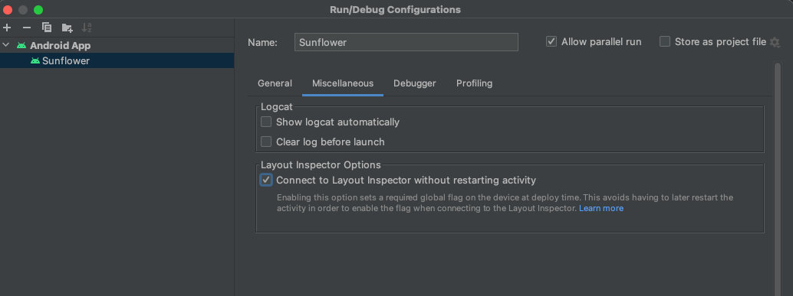

- [Layout Inspector を使用してレイアウトをデバッグする](#layout-inspector-を使用してレイアウトをデバッグする)
  - [始める](#始める)
  - [ビューを選択または分離する](#ビューを選択または分離する)
  - [レイアウト境界とビューラベルを非表示にする](#レイアウト境界とビューラベルを非表示にする)
  - [レイアウト階層のスナップショットをキャプチャする](#レイアウト階層のスナップショットをキャプチャする)
  - [3D モード](#3d-モード)
    - [アプリ レイアウトと参照イメージ オーバーレイを比較する](#アプリ-レイアウトと参照イメージ-オーバーレイを比較する)
  - [Compose を確認する](#compose-を確認する)
  - [アクティビティの再起動を避ける](#アクティビティの再起動を避ける)
  - [スタンドアロン Layout Inspector](#スタンドアロン-layout-inspector)
  - [注意点](#注意点)
    - [Layout Inspector 上では、 padding が margin に見える](#layout-inspector-上では-padding-が-margin-に見える)


# Layout Inspector を使用してレイアウトをデバッグする

Android Studio の Layout Inspector を使用すると、各ビューのプロパティを検査できるビュー階層を表示して、アプリのレイアウトをデバッグできます。Layout Inspector を使用すると、アプリ レイアウトとデザイン モックアップを比較したり、アプリの拡大表示や 3D ビューを表示したり、実行時にレイアウトの詳細を確認したりできます。これは、レイアウトを全体的に XML でビルドするのではなく、実行時にレイアウトがビルドされ、レイアウトが予期しない動作をする場合に特に便利です。




## 始める

Layout Inspector を起動するには、アプリを実行し、[Running Devices] ウィンドウに移動して、[Toggle Layout Inspector] (※ 1 ) をクリックします。

(※ 1 )  


複数のデバイスやプロジェクトを切り替えると、Layout Inspector は、接続されたデバイスのフォアグラウンドで実行されているデバッグ可能なプロセスに自動的に接続します。

一般的なタスクの実行方法は次のとおりです。

- 階層を表示して各ビューのプロパティを検査するには、[Component Tree] と [Attributes] ツール ウィンドウを使用します。Layout Inspector が属性にアクセスするために、アクティビティの再起動が必要になることがあります。詳しくは、 [アクティビティの再起動を避ける](#アクティビティの再起動を避ける) をご覧ください。

- ビューを直接 1 回クリックしてビューを選択するか、ビューをダブルクリックしてコードに移動するには、[Toggle Deep Inspect] (※ 2 ) を有効にします。

- アプリを操作するには、[Toggle Deep Inspect] (※ 2 ) を無効にします。

(※ 2 )  


- 実機を検査するには、 [デバイスのミラーリング](../4.ローカルデバイスでアプリを実行する/1.始める.md/#デバイスのミラーリング) を有効にします。

- アプリの UI を更新するときにライブ アップデートを有効にするには、[ライブ編集](../../../開発/主要分野/UI/ガイド/15.ツール/3.開発/1.コードを反復開発する.md/#ライブ編集) が有効になっていることを確認します。

- 3D モードを使用するには、Layout Inspector のスナップショット (※ 3 ) を撮り、[3D モード] (※ 4 ) をクリックします。

(※ 3 )  


(※ 4 )  



## ビューを選択または分離する

ビューは通常、ユーザーが閲覧でき、操作できるものを表示します。コンポーネント ツリーには、アプリの階層と各ビューのコンポーネントがリアルタイムで表示されます。アプリ内の要素とそれに関連する値を可視化できるため、アプリのレイアウトをデバッグする際に便利です。

ビューを選択するには、[Component Tree] または [Layout Display] でそのビューをクリックします。選択したビューのすべてのレイアウト属性が [Attributes] パネルに表示されます。

レイアウトに重複するビューが含まれている場合、[Deep Inspect] モード (※ 1 ) で右クリックすると、リージョン内のすべてのビューを表示できます。前面にないビューを選択するには、[Component Tree] 内でそのビューをクリックするか、 [レイアウトを回転](#3d-モード) します。

(※ 1 )  


複雑なレイアウトを操作するには、個々のビューを分離すると、レイアウトのサブセットのみがコンポーネント ツリーに表示され、レイアウト表示にレンダリングされます。

ビューを分離するには、スナップショット (※ 2 ) を作成し、[Component Tree] のビューを右クリックして、[Show Only Subtree] または [Show Only Parents] を選択します。フルビューに戻るには、ビューを右クリックして [Show All] を選択します。ビューを分離する前に、スナップショットを取得する必要があります。

(※ 2 )  


注: ビューを分離する機能は、 [一時的に利用できません。](https://developer.android.com/studio/known-issues?hl=ja&_gl=1*a5wj3i*_up*MQ..*_ga*MTk5MTYxMTA4Ni4xNzI3NDI1ODc0*_ga_6HH9YJMN9M*MTcyNzQ0NDMwNy4zLjAuMTcyNzQ0NDQwMi4wLjAuMjAzMDcxMjg4OQ..#layout-inspector-isolate-view) Google はこの問題の解決に取り組んでいます。


## レイアウト境界とビューラベルを非表示にする

レイアウト要素の境界ボックスとビューラベルを非表示にするには、[Layout Display] の上にある [View Options] アイコン (※ 1 ) をクリックし、[Show Borders] または [Show View Label] を切り替えます。

(※ 1 )  


## レイアウト階層のスナップショットをキャプチャする

Layout Inspector では、実行中のアプリのレイアウト階層のスナップショットを保存できるため、他のユーザーと共有したり、後で参照したりできます。

スナップショットには、Layout Inspector の使用時に通常表示されるデータがキャプチャされます。たとえば、レイアウトの詳細な 3D レンダリングや、View レイアウト、Compose レイアウト、ハイブリッド レイアウトのコンポーネント ツリー、UI の各コンポーネントの詳細な属性などです。スナップショットを保存するには、[スナップショットのエクスポート/インポート] (※ 1 ) をクリックし、[スナップショットをエクスポート] をクリックします。

(※ 1 )  


[Import Snapshot] をクリックして、以前に保存した Layout Inspector のスナップショットを読み込みます。


## 3D モード

レイアウト表示には、実行時にアプリのビュー階層を高度な 3D で可視化する機能があります。この機能を使用するには、スナップショット (※ 1 ) を撮り、スナップショット インスペクタ ウィンドウの [3D モード] ボタン (※ 2 ) をクリックし、マウスをドラッグして回転させます。

(※ 1 )  


(※ 2 )  


次の画像は、レイアウトを 3D 回転させた例です。



レイヤーの傾きを変えるには、以下のスライダを動かします。




### アプリ レイアウトと参照イメージ オーバーレイを比較する

アプリ レイアウトと UI モックアップなどの参照イメージを比較するには、Layout Inspector でビットマップ イメージ オーバーレイを読み込みます。

- オーバーレイを読み込むには、[Layout Inspector] ツールバーで [Load Overlay] (※ 1 ) オプションを選択します。オーバーレイはレイアウトに合わせて拡大縮小されます。

- オーバーレイの透明度を調整するには、[Overlay Alpha] スライダーを使用します。

- オーバーレイを削除するには、[Clear Overlay] (※ 2 ) をクリックします。

(※ 1 )  


(※ 2 )  


## Compose を確認する

Layout Inspector を使用すると、エミュレータまたは物理デバイスで実行中のアプリ内の Compose レイアウトを検査できます。Layout Inspector では、コンポーザブルが再コンポーズまたはスキップされる頻度を確認できるため、アプリに関する問題の特定に役立ちます。

たとえば、コーディング エラーによって UI が過度に再コンポーズされ、結果としてパフォーマンスの低下につながる場合があります。また、コーディング エラーによって UI が再コンポーズできなくなり、UI の変更が画面に表示されないことがあります。

Layout Inspector の Compose 対応の詳細は、 [こちら](../../../開発/主要分野/UI/ガイド/15.ツール/4.デバッグ/1.レイアウトの検査.md) をご覧ください。


## アクティビティの再起動を避ける

Layout Inspector が適切に機能するには、次のどちらかの全般設定が必要です。全般設定を指定しなかった場合は、Layout Inspector で自動的に設定されます。

1. adb shell settings put global debug_view_attributes_application_package <processname>

このオプションでは、指定されたプロセスを検査するための追加情報が生成されます。

2. adb shell settings put global debug_view_attributes 1

このオプションでは、デバイス上のすべてのプロセスを検査するための追加情報が生成されます。

全般設定を変更すると、アクティビティが再起動することがあります。アクティビティが再起動しないようにするには、Android Studio で設定を変更するか、デバイスの設定で開発者向けオプションを変更します。

Android Studio で自動更新を有効にするには、メニューから [Run] > [Edit Configurations] を選択し、[Run/Debug Configurations] を開きます。次に [Miscellaneous] タブに移動し、[Layout Inspector Options] の下の [Connect to Layout Inspector without restarting activity] チェックボックスをオンにします。



または、デバイスの開発者向けオプションを有効にして、デバイスのデベロッパー向けの設定から [表示属性検査を有効にする](./2.開発者向けオプションを設定する.md/#デバッグ) をオンにします。


## スタンドアロン Layout Inspector

最適なパフォーマンスを得るには、Layout Inspector はデフォルトの埋め込みモードで使用することをおすすめします。

もし Layout Inspector の埋め込みを解除するには、[File]（macOS では Android Studio）> [Settings] > [Tools] > [Layout Inspector] に移動し、[Enableembedded Layout Inspector] チェックボックスをオフにします。

スタンドアロン モードでは、[Layout Inspector] ツールバーで [Live Updates] (※ 1 ) オプションをクリックして、ライブ更新を有効にします。

(※ 1 )


## 注意点

### Layout Inspector 上では、 padding が margin に見える

Layout Inspector 上では、 padding が margin に見える点に注意しましょう。

例えば、以下のようなレイアウトがあったとします。

```kotlin
Box(
    modifier = Modifier
        .background(Color.Cyan)
        .padding(12.dp)
) {
    Column(
        modifier = Modifier
            .background(Color.Yellow)
            .padding(24.dp)
    ) {
        Text(text = "Sample", modifier = Modifier.background(Color.LightGray))
    }
}
```

Padding は、内側の余白を指すため、水色の領域が Box の正しい領域であるはずです。しかし、このレイアウトを Layout Inspector で確認した場合、 Box の領域は、黄色い部分を示します。


ここからわかることは、 Layouto Inspector では、 padding を適用した後の領域を、その UI 要素の領域として指し示すということです。そのため、 UI 要素に padding を指定した場合は、 **「 Layout Inspector 上では、 padding が margin に見える」** ということをお覚えておきましょう。これを覚えておくことで、デバッグ時に混乱するのを避けることができます。


