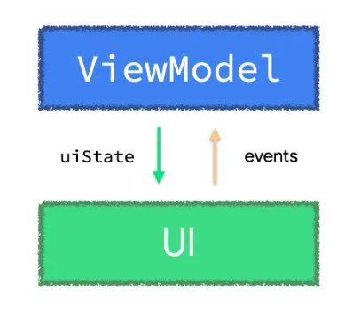

- [1 回限りの ViewModel イベントのアンチパターン](#1-回限りの-viewmodel-イベントのアンチパターン)
  - [ケーススタディ](#ケーススタディ)
  - [アンチパターン 1 : 支払い完了に関する状態が失われる可能性がある](#アンチパターン-1--支払い完了に関する状態が失われる可能性がある)
  - [アンチパターン 2 : UI にアクションを実行するように指示する](#アンチパターン-2--ui-にアクションを実行するように指示する)
  - [アンチパターン 3 : 1 回限りのイベントをすぐに処理していない](#アンチパターン-3--1-回限りのイベントをすぐに処理していない)
  - [ケーススタディの改善](#ケーススタディの改善)


# 1 回限りの ViewModel イベントのアンチパターン

ViewModel イベントは、 ViewModel から発生し、 UI が実行する必要があるアクションです。たとえば、ユーザーに情報メッセージを表示したり、アプリケーションの状態が変わったときに別の画面に移動したりします。

ViewModel イベントに関するガイダンスは、 2 つの異なる方法で意見が述べられています。

1. ViewModel で 1 回限りのイベントが発生するたびに、 ViewModel はそのイベントをすぐに処理して状態を更新する必要があります。 ViewModel はアプリケーションの状態のみを公開する必要があります。 ViewModel から状態に縮小されていないイベントを公開することは、 ViewModel がそれらのイベントから派生した状態の単一の信頼できる情報源ではないことを意味します。単方向データフロー ( UDF ) では、プロデューサーよりも長く存続するコンシューマーにのみイベントを送信する利点について説明しています。
2. 状態は、監視可能なデータホルダー型を使用して公開する必要があります。



アプリでは、 Kotlin Channels や SharedFlow などの他のリアクティブストリームを使用して ViewModel イベントを UI に公開しているかもしれません。あるいは、これは他のプロジェクトで見たことがあるパターンかもしれません。プロデューサー ( ViewModel ) がコンシューマー ( UI - Compose または Views ) より長く存続する場合 ( ViewModel イベントの場合に当てはまります) 、これらの API はそれらのイベントの配信と処理を保証しません。これにより、バグや開発者にとっての将来の問題が発生する可能性があります。また、ほとんどのアプリではユーザーエクスペリエンスが受け入れられません。

ViewModel イベントはすぐに処理して、 UI 状態の更新を行う必要があります。 Channel や SharedFlow などの他のリアクティブソリューションを使用してイベントをオブジェクトとして公開しようとしても、イベントの配信と処理は保証されません。


## ケーススタディ

アプリの一般的な支払いフローでの ViewModel の実装例を次に示します。次のコードスニペットでは、 MakePaymentViewModel が、支払いリクエストの結果が返されたときに支払い結果画面に移動するように UI に直接指示しています。この例を使用して、このような 1 回限りの ViewModel イベントを処理するとなぜ問題が発生し、エンジニアリングコストが高くなるかについて説明します。

```kotlin
class MakePaymentViewModel(...) : ViewModel() {

    val uiState: StateFlow<MakePaymentUiState> = /* ... */

    // ⚠️⚠️ DO NOT DO THIS!! ⚠️⚠️
    // この一回限りの ViewModel イベントは、処理もされていないし、状態への反映もされていない
    // Boolean 値は、支払が成功したかどうかを示します。
    private val _navigateToPaymentResultScreen = Channel<Boolean>()

    // `receiveAsFlow` は、バックスタックのエントリが複数回発生するのを避けるために、
    // 各ナビゲーションイベントを 1 つのコレクターだけが処理するようにします。
    val navigateToPaymentResultScreen = _navigateToPaymentResultScreen.receiveAsFlow()

    // makePayment が複数で呼ばれて同時実行されるのを防ぎます。
    // 決済が進行中の場合は、再度トリガーすることはしません。
    private var makePaymentJob: Job? = null

    fun makePayment() {
        if (makePaymentJob != null) return
        
        makePaymentJob = viewModelScope.launch {
            try {
                // ローディングインジケーターを表示
                _uiState.update { it.copy(isLoading = true) }
                val isPaymentSuccessful = paymentsRepository.makePayment(...)
                _navigateToPaymentResultScreen.send(isPaymentSuccessful)
            } catch (ioe: IOException) { ... }
            finally { makePaymentJob = null }
        }
    }
}
```

UI はこのイベントを消費し、それに応じてナビゲートします。

```kotlin
@Composable
fun MakePaymentScreen(
    onPaymentMade: (Boolean) -> Unit,
    viewModel: MakePaymentViewModel = viewModel()
) {
    val currentOnPaymentMade by rememberUpdatedState(onPaymentMade)
    val lifecycle = LocalLifecycleOwner.current.lifecycle

    // いつ navigateToPaymentResultScreen が新しい値を発行しようとも、
    // 呼び出し元のコンポーザブルに支払いが行われたことを通知します。
    LaunchedEffect(viewModel, lifecycle)  {
        lifecycle.repeatOnLifecycle(state = STARTED) {
            viewModel.navigateToPaymentResultScreen.collect { isPaymentSuccessful ->
                currentOnPaymentMade(isPaymentSuccessful)
            }
        }
    }

    // ここで MakePaymentScreen の UI を構築する
}

class MakePaymentActivity : AppCompatActivity() {
    private val viewModel: MakePaymentViewModel by viewModels()

    override fun onCreate(savedInstanceState: Bundle?) {
        /* ... */
        lifecycleScope.launch {
            repeatOnLifecycle(Lifecycle.State.STARTED) {
                viewModel.navigateToPaymentResultScreen.collect { isPaymentSuccessful ->
                    val intent = Intent(this, PaymentResultActivity::class.java)
                    intent.putExtra("PAYMENT_RESULT", isPaymentSuccessful)
                    startActivity(intent)
                    finish()
                }
            }
        }
    }
}
```

上記の navigationToPaymentResultScreen 実装には、複数の設計上の欠陥があります。


## アンチパターン 1 : 支払い完了に関する状態が失われる可能性がある

Channel は、イベントの配信と処理を保証しません。そのため、イベントが失われ、 UI が不整合な状態になることがあります。この例としては、 ViewModel (プロデューサー) がイベントを送信した直後に UI (コンシューマー) がバックグラウンドに移行して Channel コレクションを停止する場合が挙げられます。同じことは、 SharedFlow などの監視可能なデータホルダータイプではない他の API にも言えます。 SharedFlow は、イベントをリッスンしているコンシューマーがいなくてもイベントを発行する可能性があります。

これは、 ACID トランザクションの観点から考えると、 UI レイヤーでモデル化された支払い結果の状態が永続的でもアトミックでもないため、アンチパターンです。リポジトリに関する限り支払いは成功したかもしれませんが、適切な次の画面に移動することはありませんでした。

注: このアンチパターンは、イベントの送受信時に Dispatchers.Main.immediate を使用することで軽減できます。ただし、それが lint チェックによって強制されない場合、開発者が簡単に忘れてしまう可能性があるため、このソリューションはエラーが発生しやすい可能性があります。


## アンチパターン 2 : UI にアクションを実行するように指示する

複数の画面サイズをサポートするアプリの場合、 ViewModel イベントで実行される UI アクションは画面サイズによって異なる場合があります。たとえば、ケーススタディアプリは、モバイルフォンで実行されているときは支払い結果画面に移動する必要がありますが、アプリがタブレットで実行されている場合は、アクションによって同じ画面の別の部分に結果が表示される可能性があります。

ViewModel は UI にアプリの状態を伝え、 UI はそれを反映する方法を決定する必要があります。 ViewModel は UI に実行すべきアクションを伝えてはなりません。


## アンチパターン 3 : 1 回限りのイベントをすぐに処理していない

イベントを、実行中に実行して忘れるものとしてモデル化すると、問題が発生します。 ACID プロパティに準拠することが難しくなるため、可能な限り最高のデータの信頼性と整合性を確保できません。状態とは、イベントが発生することです。イベントが処理されない時間が長くなるほど、問題は難しくなります。 ViewModel イベントの場合は、できるだけ早くイベントを処理し、そこから新しい UI 状態を生成します。

ケーススタディでは、イベントのオブジェクト (ブール値として表される) を作成し、チャネルを使用して公開しました。

```kotlin
// Boolean 型のイベントでチャネルを作成する
val _navigateToPaymentResultScreen = Channel<Boolean>()
// イベントをトリガーする
_navigateToPaymentResultScreen.send(isPaymentSuccessful)
```

これを実行すると、 1 回限りの配信や処理などを確実に行う責任を負ったことになります。何らかの理由でイベントをオブジェクトとしてモデル化する必要がある場合は、イベントの存続期間をできるだけ短くして、イベントが失われないようにします。

ViewModel で 1 回限りのイベントを処理するには、通常、メソッド呼び出し ( UI 状態の更新など) が必要になります。そのメソッドを呼び出すと、イベントが正常に完了したか例外がスローされたかがわかり、イベントが 1 回だけ発生したことがわかります。


## ケーススタディの改善

このような状況に陥った場合は、 1 回限りの ViewModel イベントが UI にとって実際に何を意味するかを再検討してください。イベントをすぐに処理し、 StateFlow や mutableStateOf などの監視可能なデータホルダーを使用して公開される UI 状態に縮小します。

UI 状態は、特定の時点での UI をより適切に表し、配信と処理の保証が強化され、通常はテストが容易になり、アプリの残りの部分と一貫して統合されます。

1 回限りの ViewModel イベントを状態に縮小する方法が見つからない場合は、そのイベントが UI にとって実際に何を意味するのかを再検討してください。

上記の例では、 ViewModel は UI に実行するアクションを指示するのではなく、実際のアプリケーションデータ (この場合は支払いデータ) を公開する必要があります。以下は、処理されて状態に縮小され、監視可能なデータホルダー型を使用して公開された ViewModel イベントのより適切な表現です。

```kotlin
data class MakePaymentUiState(
    val paymentInformation: PaymentModel,
    val isLoading: Boolean = false,
    // PaymentResult モデルは、特定の支払いの試みのアプリ状態です。
    // null は、支払いがまだ完了していないことを表します。
    val paymentResult: PaymentResult? = null
)

class MakePaymentViewModel(...) : ViewModel() {

    private val _uiState = MutableStateFlow<MakePaymentUiState>(...)
    val uiState: StateFlow<MakePaymentUiState> = _uiState.asStateFlow()

    private var makePaymentJob: Job? = null

    fun makePayment() {
        if (makePaymentJob != null) return

        makePaymentJob = viewModelScope.launch {
            try {
                _uiState.update { it.copy(isLoading = true) }
                val isPaymentSuccessful = paymentsRepository.makePayment(...)

                // 支払のレスポンスが来た時に何をするかというイベントは、ここで即座に消費されます。
                // つまり、 UI 状態を更新します。
                _uiState.update {
                    it.copy(
                        isLoading = false,
                        paymentResult = PaymentResult(it.paymentInfo, isPaymentSuccessful)
                    )
                }
            } catch (ioe: IOException) { ... }
            finally { makePaymentJob = null }
        }
    }
}
```

**【補足】 ViewModel の役割は、イベントを UI 状態に変換することだと思われる。**

上記のコードでは、新しい paymentResult データ ( #L31 ) を使用して _uiState.update ( #L28 ) を呼び出すことでイベントがすぐに処理されます。これで、このイベントが失われることはありません。イベントは状態に縮小され、 MakePaymentUiState の paymentResult フィールドに支払い結果のアプリケーションデータが反映されます。

これにより、 UI は paymentResult の変更に反応し、それに応じて動作します。

```kotlin
@Composable
fun MakePaymentScreen(
    onPaymentMade: (PaymentModel, Boolean) -> Unit,
    viewModel: MakePaymentViewModel = viewModel()
) {
    val uiState by viewModel.uiState.collectAsState()

    uiState.paymentResult?.let {
        val currentOnPaymentMade by rememberUpdatedState(onPaymentMade)
        LaunchedEffect(uiState) {
            // Tell the caller composable that the payment was made.
            // the parent composable will act accordingly.
            currentOnPaymentMade(
                uiState.paymentResult.paymentModel, 
                uiState.paymentResult.isPaymentSuccessful
            )
        }
    }

    // Rest of the UI for the login screen.
}

class MakePaymentActivity : AppCompatActivity() {
    private val viewModel: MakePaymentViewModel by viewModels()

    override fun onCreate(savedInstanceState: Bundle?) {
        /* ... */
        lifecycleScope.launch {
            repeatOnLifecycle(Lifecycle.State.STARTED) {
                viewModel.uiState.collect { uiState ->
                    if (uiState.paymentResult != null) {
                        val intent = Intent(this, PaymentResultActivity::class.java)
                        intent.putExtra(
                            "PAYMENT_RESULT", 
                            uiState.paymentResult.isPaymentSuccessful
                        )
                        startActivity(intent)
                        finish()
                    }
                }
            }
        }
    }
}
```

注: ユースケースで Activity が終了せず、バックスタックに保持されている場合、 ViewModel は、 Activity が別の Activity を開始した後に呼び出される UiState から paymentResult をクリアする (つまり、フィールドを null に設定する) 関数を公開する必要があります。この例は、ドキュメントの [イベントの使用によって状態の更新がトリガーされる可能性がある](https://developer.android.com/topic/architecture/ui-layer/events?hl=ja#consuming-trigger-updates) セクションにあります。

UI レイヤーの [追加の考慮事項](https://developer.android.com/topic/architecture/ui-layer?hl=ja#additional-considerations) セクションで述べたように、ユースケースで必要な場合は、画面の UI 状態を複数のストリームで公開できます。重要なのは、これらのストリームが監視可能なデータホルダータイプであることです。上記の例では、 isLoading フラグと paymentResult プロパティが密接に絡み合っているため、一意の UI 状態ストリームが公開されています。これらを分離すると、 UI に不整合が発生する可能性があります (たとえば、 isLoading が true で paymentResult が null でない場合) 。これらを同じ UiState クラスにまとめることで、画面の UI 状態を構成するさまざまなフィールドをより意識できるようになり、バグが少なくなります。

このブログ投稿が、 1) 1 回限りの ViewModel イベントをすぐに処理して状態に縮小すること、および 2) 監視可能なデータホルダー型を使用して状態を公開することを推奨する理由を理解する一助になれば幸いです。このアプローチにより、配信と処理の保証が高まり、通常はテストが容易になり、アプリの他の部分と一貫して統合されると考えています。

免責事項: アーキテクチャガイダンスの残りの部分と同様に、これをガイドラインとして扱い、必要に応じて要件に合わせて調整してください。

このトピックの詳細については、 UI イベントのドキュメントをご覧ください。


