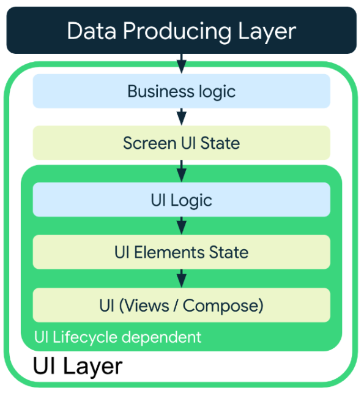
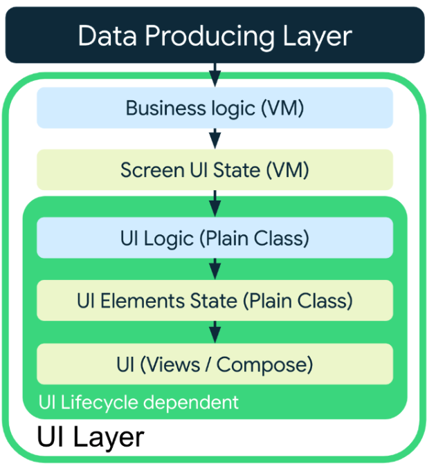
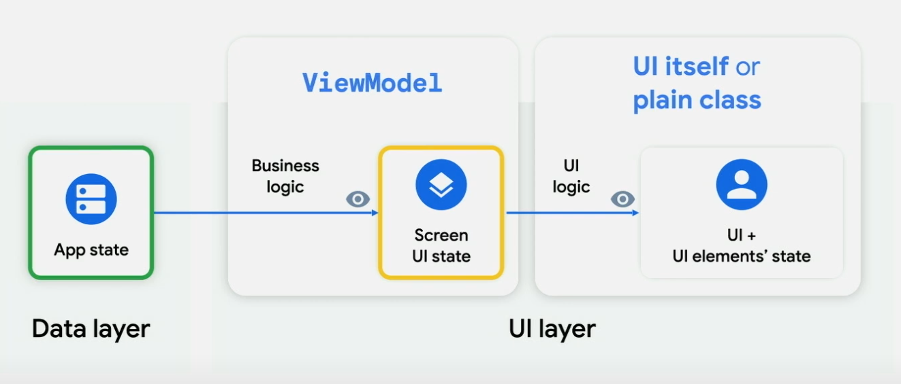
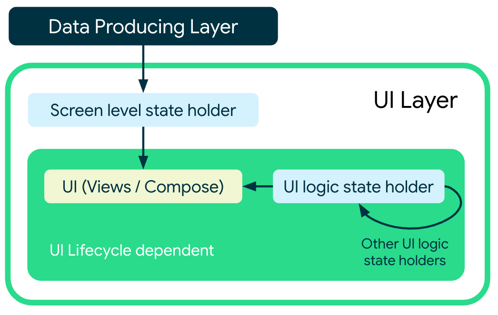

- [状態ホルダーと UI の状態](#状態ホルダーと-ui-の状態)
  - [UI 状態生成パイプラインの要素](#ui-状態生成パイプラインの要素)
    - [UI 状態](#ui-状態)
    - [ロジック](#ロジック)
  - [Android ライフサイクル、 UI 状態とロジックの種類](#android-ライフサイクル-ui-状態とロジックの種類)
    - [UI 状態生成パイプライン](#ui-状態生成パイプライン)
  - [状態ホルダーとその役割](#状態ホルダーとその役割)
    - [状態ホルダーの種類](#状態ホルダーの種類)
  - [ビジネスロジックとその状態ホルダー](#ビジネスロジックとその状態ホルダー)
    - [ビジネスロジック状態ホルダーとしての ViewModel](#ビジネスロジック状態ホルダーとしての-viewmodel)
  - [UI ロジックとその状態ホルダー](#ui-ロジックとその状態ホルダー)
  - [状態ホルダーに ViewModel とプレーンなクラスのどちらを選ぶか](#状態ホルダーに-viewmodel-とプレーンなクラスのどちらを選ぶか)
  - [状態ホルダーは複合 (合成) 可能](#状態ホルダーは複合-合成-可能)
    - [依存の方向](#依存の方向)
    - [存続期間が長い状態ホルダーが短い状態ホルダーを参照する例](#存続期間が長い状態ホルダーが短い状態ホルダーを参照する例)
    - [依存関係？データフロー？の図](#依存関係データフローの図)


# 状態ホルダーと UI の状態


単方向データフロー ( UDF ) では、 ViewModel やプレーンなクラスを使用して、 UDF 管理をデリゲートすることができます。つまり、 ViewModel やプレーンなクラスが、状態ホルダーとなります。このドキュメントでは、状態ホルダーと、それらが UI レイヤで果たす役割について詳しく説明します。

このドキュメントを最後まで読むと、UI レイヤでアプリの状態を管理する方法 ( UI 状態生成パイプライン) について理解できます。内容は次のとおりです。

- UI レイヤに存在する UI 状態の種類を理解する。
- UI レイヤの UI 状態を操作するロジックの種類を理解する。
- ViewModel や単純なクラスなど、状態ホルダーの適切な実装を選択する方法を把握する。


## UI 状態生成パイプラインの要素

UI 状態と、それを生成するロジックが UI レイヤを定義します。


### UI 状態

UI 状態には次の 2 種類があります。

- 画面 UI 状態
  - データ層から取得し、画面に表示するデータです。
  - ユーザーが意図的にアプリを終了した後に状態を復元する必要があるものです。
- UI 要素状態
  - データ層から取得するのではなく、ユーザーの操作状況やデバイスの特徴やデバイスの設定状況によって変化する状態です。
  - 例えば、以下のものがあります。
    - パディングやスクロール状況やフォントサイズなど、 UI の見た目にかかわる部分。または、ウィジェットの表示 / 非表示そのものの状態。
    - リストのスクロール状況、ボトムタブの選択状況 (ユーザーの操作状況)
    - フォントサイズ、ダークテーマの ON / OFF (デバイスの設定状況)
    - デバイスの画面サイズ、画面の向き (デバイスの特徴)
  - ユーザーが意図的にアプリを終了した後に状態を復元する必要がないものです。


二種類の UI 状態は、完全に分離できるものではなく、両者が繋がっているものもあります。例えば、ユーザーの属性を判定して、ボタンの表示 / 非表示を切り替える画面があるとします。これは、不揮発領域からデータを取得するという点では、画面 UI 状態に分類されますが、 UI 要素の表示 / 非表示を切り替えること自体は、 UI ロジックに分類されます。 UI ロジックにて保持される状態は UI 要素状態に分類されます。


### ロジック

アプリ内のロジックは、ビジネスロジックまたは UI ロジックのいずれかです。

- ビジネスロジック
  - 定義
    - アプリの機能要件に関するロジック
    - 画面 UI 状態を生成するのに必要なロジック
  - 例
    - タップしたニュースをブックマークする
    - たいていの場合、ドメインレイヤーやデータレイヤーに処理を委譲します。
  - 実装場所
    - 画面レベルの状態ホルダー、つまり、 ViewModel
- UI ロジック
  - 定義
    - 画面に UI 状態を表示する方法
    - UI 要素状態を生成するのに必要なロジック
  - 例
    - 画面遷移
    - カスタムアニメーションの実行
      - リストを特定の位置までスクロール
    - 特定の条件下での UI 要素の表示・非表示の切り替え
  - 実装場所
    - UI 自身、または、別の状態ホルダー


## Android ライフサイクル、 UI 状態とロジックの種類

UI レイヤーは、 「 UI ライフサイクルに依存する部分」 と 「依存しない部分」 の 2 つによって構成することが可能です。

UI レイヤー ( UI 状態生成パイプライン) を構築する際は、これらの部分を使用することも使用しないことも自由に選択可能です。つまり、次の 4 パターンが考えられます。

|パターン|UI ライフサイクルに依存しない部分|UI ライフサイクルに依存する部分|
|-|-|-|
|パターン 1|使用しない|使用しない|
|パターン 2|使用しない|使用する|
|パターン 3|使用する|使用しない|
|パターン 4|使用する|使用する|


### UI 状態生成パイプライン

両方の種類のロジックを UI 状態生成パイプラインに適用する場合、 **必ずビジネス ロジックを UI ロジックより前に適用する必要があります。** ビジネス ロジックを UI ロジックより後に適用しようとした場合の問題点については、 [ビジネスロジックを UI ロジックよりも先に実行すべき理由](#ビジネスロジックを-UI-ロジックよりも先に実行すべき理由) セクションを参照してください。以降のセクションでは、種々のロジックとその状態ホルダーについて詳しく説明します。




#### 【パターン 1】

UI ロジックもビジネスロジックも使用しないパターン

`++count` の部分は、 UI ロジックのように思えますが、これは、単に状態を更新しているだけで、 UI を更新するコードを開発者が明示的に記述しているわけではないため、 「単なる状態更新」 とみなされるらしいです。

```kotlin
@Composable
fun Counter() {
    // The UI state is managed by the UI itself
    var count by remember { mutableStateOf(0) }
    Row {
        Button(onClick = { ++count }) {
            Text(text = "Increment")
        }
        Button(onClick = { --count }) {
            Text(text = "Decrement")
        }
    }
}
```


#### 【パターン 2】

UI ロジックは使用して、ビジネスロジックは使用しないパターン

```kotlin
@Composable
fun ContactsList(contacts: List<Contact>) {
    val listState = rememberLazyListState()
    val isAtTopOfList by remember {
        derivedStateOf {
            listState.firstVisibleItemIndex < 3
        }
    }

    // Create the LazyColumn with the lazyListState
    ...

    // Show or hide the button (UI logic) based on the list scroll position
    AnimatedVisibility(visible = !isAtTopOfList) {
        ScrollToTopButton()
    }
}
```

#### 【パターン 3】

UI ロジックは使用せず、ビジネスロジックは使用するパターン

```kotlin
@Composable
fun UserProfileScreen(viewModel: UserProfileViewModel = hiltViewModel()) {
    // Read screen UI state from the business logic state holder
    val uiState by viewModel.uiState.collectAsStateWithLifecycle()

    // Call on the UserAvatar Composable to display the photo
    UserAvatar(picture = uiState.profilePicture)
}
```

#### 【パターン 4】

UI ロジックも使用して、ビジネスロジックも使用するパターン

```kotlin
@Composable
fun ContactsList(viewModel: ContactsViewModel = hiltViewModel()) {
    // Read screen UI state from the business logic state holder
    val uiState by viewModel.uiState.collectAsStateWithLifecycle()
    val contacts = uiState.contacts
    val deepLinkedContact = uiState.deepLinkedContact

    val listState = rememberLazyListState()

    // Create the LazyColumn with the lazyListState
    ...

    // Perform UI logic that depends on information from business logic
    if (deepLinkedContact != null && contacts.isNotEmpty()) {
        LaunchedEffect(listState, deepLinkedContact, contacts) {
            val deepLinkedContactIndex = contacts.indexOf(deepLinkedContact)
            if (deepLinkedContactIndex >= 0) {
              // Scroll to deep linked item
              listState.animateScrollToItem(deepLinkedContactIndex)
            }
        }
    }
}
```


## 状態ホルダーとその役割


### 状態ホルダーの種類

UI ライフサイクルとの関係で定義される 2 種類の状態ホルダーがあります。

- ビジネスロジック状態ホルダー
- UI ロジック状態ホルダー


## ビジネスロジックとその状態ホルダー

ビジネスロジックと画面レベルの状態は、一般的に、 ViewModel で実装します。ただし、画面が複雑で ViewModel が巨大化してしまう場合は、プレーンなクラスで実装することも可能です。ただし、そのプレーンなクラスを VeiwModel で保有することをお勧めします。そうすることで、 ViewModel の機能を損なうことなく、 ViewModel の巨大化を防ぐことが可能です。


### ビジネスロジック状態ホルダーとしての ViewModel

ビジネスロジック状態ホルダーとして ViewModel を使用すると以下のメリットがあります。

- ViewModel で実行される処理は、構成変更後も存続します。
  - 例えば、ネットワークリクエストは、構成変更後もキャンセルされずに継続します。
- Navigation との親和性
  - ある画面の上に別の画面が表示されても、 ViewModle は保持されます。つまり、前の画面に戻るとすぐに状態を復元できます。
  - 画面がバックスタックからポップされた際に、 ViewModel がクリアされます。これにより、クリアの忘れを防ぐことができます。
- Hilt との親和性
  - ドメイン層やデータ層から簡単に依存関係を注入できます。

ViewModel を使用するうえで注意すること 4 点

**1. 画面レベルで使用してください。**

**2. UI 実装の詳細を知るべきではありません。**

ViewModel は、 UI 実装の詳細について知るべきではありません。 ViewModel が UI の詳細を知っていると、 UI を独立して変更することができなくなり、 UI の汎用性が失われます。

ViewModel は、デバイスがタブレットであろうが、スマートフォンであろうが、それを気にする必要がないように実装されるべきです。

**3. ライフサイクル関連の API を参照しないでください。**

ViewModel はライフサイクル関連の API を参照しないでください。例えば、 Context や Resources を参照しないでください。 ViewModel の存在期間は、それらよりも長い傾向になるため、メモリリークが発生する可能性があります。

**4. ViewModel への参照は特定のオブジェクトからのみに限定してください。**

ViewModel を参照してもよいオブジェクトは、 Activity , Fragment, 画面レベルのコンポーザブル関数だけです。それ以外のオブジェクトに渡さないでください。


## UI ロジックとその状態ホルダー

UI ロジックのプレーンな状態ホルダーを使用する上で、以下の 2 点を覚えておいてください。

1. プレーンクラスで状態をホイスティングすることができますが、再利用可能な UI コンポーネントでホイスティングすることが推奨されます。

2. ライフサイクル関連の API を参照することが可能です。

UI 要素状態は、 UI のライフサイクルに連動します。そのため、 Activity の再生成時には、新しい Activity への参照を取得できるため、 Context や Resources を参照しても、問題ありません。


## 状態ホルダーに ViewModel とプレーンなクラスのどちらを選ぶか



UI 要素状態と UI ロジックの実装はプレーンクラスでなくても、 UI 自体で実装しても問題ありません。

上記の図ではわかりにくいですが、 「ビジネスロジック」 と 「画面 UI 状態」 は、一つのセットで、 ViewModel で実装されるべきものです。また、 「 UI ロジック」 と 「 UI 要素状態」 は、一つのセットで、プレーンクラス、または、 UI 自身で実装されるべきものです。図にすると以下のようになります。関連するロジックと状態は同じクラスで実装されるべきものであることがよくわかる図になっています。



最終的には、消費される場所に最も近い状態ホルダーを使用して UI 状態を生成する必要があります。

ただし、これは絶対的なルールではなく、 UI 要素状態を更新する処理を VeiwModel に実装したほうが良い場合も時にはあるでしょう。


## 状態ホルダーは複合 (合成) 可能

ある状態ホルダーが別の状態ホルダーを参照 (保有) することは可能です。その際は、メモリリークが発生しないように存在期間に注意してください。存在期間が短いものが長いものを参照することは問題ありませんが、長いものが短いものを参照するとメモリリークが発生する可能性があるため、これは避けてください。


### 依存の方向

存続期間が短い状態ホルダー ( UI 要素状態ホルダー等) が、存続期間が長い状態ホルダー ( 画面 UI 状態ホルダー等) に依存してしまうと、以下のデメリットが生じます。

- 存続期間が短い状態ホルダーの再利用性が低下する。
- 必要以上のロジックと状態へのアクセス権を状態ホルダーに付与してしまう。

もし、存続期間の短い状態ホルダーが、存続期間の長い状態ホルダーの特定の情報を必要とする場合は、状態ホルダーのインスタンスを渡すのではなく、必要な情報だけをパラメータとして渡します。

次のコード スニペットでは、UI ロジック状態ホルダークラスに、ViewModel インスタンス全体を依存関係として渡すのではなく、ViewModel から必要な情報だけをパラメータとして渡しています。

```kotlin
class MyScreenViewModel(/* ... */) {
    // 画面 UI 状態
    val uiState: StateFlow<MyScreenUiState> = /* ... */
    fun doSomething() { /* ... */ }
    fun doAnotherThing() { /* ... */ }
    // ...
}

// UI 要素状態や UI ロジックを保持するプレーンな状態クラス
@Stable
class MyScreenState(
    // プレーンな状態クラスに ViewModel を渡さないでください。
    // private val viewModel: MyScreenViewModel,

    // 代わりに必要な情報のみを渡します。
    private val someState: StateFlow<SomeState>,
    private val doSomething: () -> Unit,

    // Other UI-scoped types
    private val scaffoldState: ScaffoldState
) {
  /* ... */
}

@Composable
fun rememberMyScreenState(
    someState: StateFlow<SomeState>,
    doSomething: () -> Unit,
    scaffoldState: ScaffoldState = rememberScaffoldState()
): MyScreenState = remember(someState, doSomething, scaffoldState) {
    MyScreenState(someState, doSomething, scaffoldState)
}

@Composable
fun MyScreen(
    modifier: Modifier = Modifier,
    viewModel: MyScreenViewModel = viewModel(),
    state: MyScreenState = rememberMyScreenState(
        someState = viewModel.uiState.map { it.toSomeState() },
        doSomething = viewModel::doSomething
    ),
    // ...
) {
    /* ... */
}
```


### 存続期間が長い状態ホルダーが短い状態ホルダーを参照する例

次の例では、存続期間が長い状態ホルダー ( CounterViewModel ) が短い状態ホルダー ( CounterState ) を参照していますが、メモリリークは起きません。

そのトリックは、 CounterState が単なるデータクラスになっており、　State オブジェクトを保持していないため、実際には、そのライフサイクルが ViewModel のライフサイクルに一致しているためです。

```kotlin
data class CounterState(
    val count: Int = 0
)

class CounterViewModel : ViewModel() {
    // MutableStateFlowで状態を保持
    private val _uiState = MutableStateFlow(CounterState())
    val uiState: StateFlow<CounterState> = _uiState

    // カウントを増やす関数
    fun incrementCount() {
        _uiState.value = _uiState.value.copy(
            count = _uiState.value.count + 1
        )
    }
}

@Composable
fun CounterScreen(viewModel: CounterViewModel = viewModel()) {
    // ViewModelの状態を観察する
    val uiState by viewModel.uiState.collectAsState()

    // UIを表示する
    Column {
        Text(text = "Count: ${uiState.count}")
        Button(onClick = { viewModel.incrementCount() }) {
            Text(text = "Increment")
        }
    }
}
```


### 依存関係？データフロー？の図

以下は、様々な状態ホルダーに依存している UI を図式化したものです。



上の図で、矢印は依存関係らしいが、だとしたら向きが逆では？


## ビジネスロジックを UI ロジックよりも先に実行すべき理由

ビジネスロジックが UI ロジックよりも後に実行されると、以下のような問題が生じる可能性があります：

### 1. テストの難易度が上がる

- ビジネスロジックが UI ロジックに依存している場合、ビジネスロジックを単体でテストすることが難しくなります。
- たとえば、UI コンポーネント（アクティビティやフラグメントなど）に直接依存していると、UI の状態をモックしたり、テスト環境で再現する必要があり、ユニットテストではなく UI テストや統合テストに頼ることになります。
- UI テストはセットアップが複雑で実行時間が長く、コストが高くなりがちです。


### 2. 再利用性が低下する

- UI に依存するビジネスロジックは、他の画面やプロジェクトで再利用するのが難しくなります。
- たとえば、ビジネスロジックが特定のアクティビティやフラグメントに依存している場合、異なる UI を持つアプリケーションでそのロジックを使い回すことができません。


### 3. 保守性の低下

- UI の変更がビジネスロジックに影響を与え、逆にビジネスロジックの変更が UI ロジックに影響を与える可能性があります。
- この相互依存性のために、コードの修正や拡張が難しくなり、新しい機能追加やバグ修正の際にリスクが増大します。


### 4. 責務の分離が曖昧になる

- ビジネスロジックと UI ロジックの責務が混在すると、どこで何を処理すべきかが不明確になります。
- この結果、コードが読みにくくなり、開発者が意図を把握するのに時間がかかるようになります。


### 5. コードの複雑化

- UI ロジックとビジネスロジックが密結合になると、コードが複雑化し、変更やデバッグが難しくなります。
- 例えば、UI の状態を変更するコードとデータの処理を行うコードが混在している場合、どこに問題があるのかを特定するのが困難になります。


### 解決策

これらの問題を回避するためには、アーキテクチャパターン（例: MVVM、MVP、Clean Architecture）を採用し、ビジネスロジックを UI ロジックから分離するのが一般的です。これにより、以下のようなメリットがあります：

- テスト可能なコードを書くことができる。
- 再利用性が向上する。
- 保守性が向上する。
- コードの責務が明確になる。

具体的には、ビジネスロジックを ViewModel や UseCase に配置し、UI ロジックは画面の描画やユーザー入力の処理に限定することで、これらの問題を回避できます。

