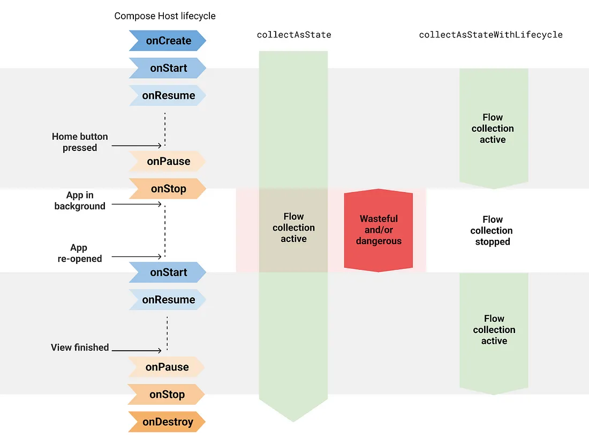
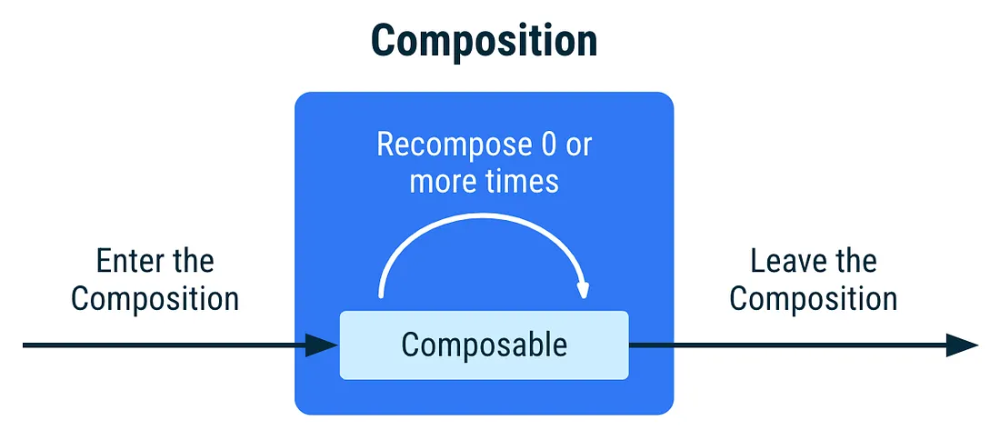

- [Jetpack Compose から安全に flow を収集する](#jetpack-compose-から安全に-flow-を収集する)
  - [collectAsStateWithLifecycle](#collectasstatewithlifecycle)
  - [仕組み](#仕組み)
  - [アーキテクチャ内のフローコレクション](#アーキテクチャ内のフローコレクション)
    - [Flow.stateIn 関数](#flowstatein-関数)
      - [stateIn 関数のシグネチャ](#statein-関数のシグネチャ)
      - [stateIn 関数のパラメータ](#statein-関数のパラメータ)
      - [stateIn 関数の概要](#statein-関数の概要)
      - [stateIn の started パラメータの種類](#statein-の-started-パラメータの種類)
      - [stateIn 関数の使いどころ](#statein-関数の使いどころ)
      - [stateIn 関数のアップストリームの完了とエラー処理](#statein-関数のアップストリームの完了とエラー処理)
      - [stateIn 関数の演算子の融合](#statein-関数の演算子の融合)
      - [引用元](#引用元)
    - [Flow.shareIn 関数](#flowsharein-関数)
      - [shareIn 関数のシグネチャ](#sharein-関数のシグネチャ)
      - [shareIn 関数のパラメータ](#sharein-関数のパラメータ)
      - [shareIn 関数の概要](#sharein-関数の概要)
      - [shareIn の started パラメータの種類](#sharein-の-started-パラメータの種類)
        - [WhileSubscribed 関数のパラメータ](#whilesubscribed-関数のパラメータ)
      - [shareIn 関数の使いどころ](#sharein-関数の使いどころ)
        - [【注意】 shareIn 関数を複数回呼び出さないようにしてください](#注意-sharein-関数を複数回呼び出さないようにしてください)
      - [shareIn 関数のアップストリームの完了とエラー処理](#sharein-関数のアップストリームの完了とエラー処理)
      - [shareIn 関数の初期値](#sharein-関数の初期値)
      - [バッファリングとコンフレーション](#バッファリングとコンフレーション)
      - [shareIn 関数の演算子の融合](#sharein-関数の演算子の融合)
      - [shareIn 関数で発生する例外](#sharein-関数で発生する例外)
      - [引用元](#引用元-1)
  - [バックグラウンドでリソースをアクティブに保つ](#バックグラウンドでリソースをアクティブに保つ)
  - [collectAsState の比較](#collectasstate-の比較)
  - [引用元資料](#引用元資料)


# Jetpack Compose から安全に flow を収集する

Android でフローを収集するには、ライフサイクルを意識した方法でフローを収集することが推奨されます。 Jetpack Compose を使用して Android アプリを作成している場合は、 collectAsStateWithLifecycle API を使用して、 UI からライフサイクルを意識した方法でフローを収集します。

collectAsStateWithLifecycle を使用すると、アプリがバックグラウンドにあるときなど、必要のないときにアプリのリソース消費を節約できます。リソースを不必要に有効にしておくと、ユーザーのデバイスの健全性に影響する可能性があります。このようなリソースには、 Firebase クエリ、位置情報やネットワークの更新、データベース接続などが含まれます。

この API の詳細、ライフサイクルを意識した方法で収集する必要がある理由、 collectAsState API との比較について説明していきます。


## collectAsStateWithLifecycle

collectAsStateWithLifecycle は、ライフサイクルを意識しながら、 **StateFlow から値を収集し、 State オブジェクトとして返します。** collectAsStateWithLifecycle 関数は、コンポーズ可能な関数です。フローから新しい値が発行されるたびに、この State オブジェクトの値が更新されます。これにより、 Composition 内のすべての State.value の使用箇所が再コンポーズされます。

デフォルトでは、 collectAsStateWithLifecycle は Lifecycle.State.STARTED と Lifecycle.State.STOPPED を使用して、フローからの値の収集を開始、および、停止します。これは、ライフサイクルがターゲット状態 ( STARTED や STOPPED ) に出入りするときに発生します。このライフサイクル状態は、 minActiveState パラメータで変更できます。 (例えば、 minActiveState に RESUMED を設定した場合、値の収集の停止タイミングは、それと対になる PAUSED が自動的に設定されると思われます。)



次のスニペットは、 collectAsStateWithLifecycle を使用して、コンポーザブル関数から、 ViewModel が公開している uiState フィールド ( StateFlow ) を収集する方法を示しています。

```kotlin
@OptIn(ExperimentalLifecycleComposeApi::class)
@Composable
fun AuthorRoute(
    onBackClick: () -> Unit,
    modifier: Modifier = Modifier,
    viewModel: AuthorViewModel = hiltViewModel()
) {
    val uiState: AuthorScreenUiState by viewModel.uiState.collectAsStateWithLifecycle()

    AuthorScreen(
        authorState = uiState.authorState,
        newsState = uiState.newsState,
        modifier = modifier,
        onBackClick = onBackClick,
        onFollowClick = viewModel::followAuthorToggle,
    )
}

data class AuthorScreenUiState(
    val authorState: String = "",
    // 以下略
)
```

AuthorViewModel の uiState が新しい AuthorScreenUiState 値を発行するたびに、 AuthorRoute が再コンポーズされます。 collectAsStateWithLifecycle のその他の使用方法については、 [Now in Android アプリ](https://github.com/search?q=repo%3Aandroid%2Fnowinandroid+collectAsStateWithLifecycle&type=code) をご覧ください。

プロジェクトで collectAsStateWithLifecycle API の使用を開始するには、 androidx.lifecycle.lifecycle-runtime-compose アーティファクトをプロジェクトに追加します。

```kotlin
// app/build.gradle file
dependencies {
    implementation "androidx.lifecycle:lifecycle-runtime-compose:2.6.0"
}
```


## 仕組み

collectAsStateWithLifecycle の実装は repeatOnLifecycle API を使用します。これは、 View システムを使用して Android でフローを収集するための推奨方法です。

collectAsStateWithLifecycle を使用すると、以下に示す定型コードを入力する必要がなくなります。この定型コードは、コンポーズ可能な関数からライフサイクルを意識した方法でフローを収集します。

```kotlin
@Composable
fun AuthorRoute(...) {
    // Activity or Fragment のライフサイクル。
    // どちらのライフサイクルかは、コンポーズが配置されている場所に依存します。
    val lifecycle = LocalLifecycleOwner.current.lifecycle

    // produceState は、副作用 API の一つ。
    // ラムダブロック内で、 value に代入された値が
    // State オブジェクトでラップされて返されます。
    val uiState by produceState<AuthorScreenUiState>(
        // 初期値 ( State オブジェクトでラップされて、初期値として返されます。)
        initialValue = viewModel.uiState.value
        key1 = lifecycle
        key2 = viewModel
    ) {
        // value に値が設定される度に、 State オブジェクトの中身が
        // その value で更新されます。

        // 指定した状態以上になると、新しいコルーチンを開始し、
        // ラムダブロックを実行する。
        lifecycle.repeatOnLifecycle(state = STARTED) {
            viewModel.uiState.collect { value = it }
        }
    }

    AuthorScreen(...)
}
```

produceState についての詳細は、 [produceState : Compose 以外の状態を Compose の状態に変換する](../../../../主要分野/UI/ガイド/2.UIアーキテクチャ/2.副作用.md/#producestate--compose-以外の状態を-compose-の状態に変換する) セクションを参照してください。

`LocalLifecycleOwner.current.lifecycle` は、コンポーズが、 Activity 内に直接配置されていれば、 Activity のライフサイクルを返し、 Fragment 内に配置されていれば、 Fragment のライフサイクルを返します。 ViewModel は LifecycleOwner を実装していないため、 ViewModel のライフサイクルが返されることはありません。

`repeatOnLifecycle` 関数は、引数で指定したライフサイクルの状態以上の場合に、新しいコルーチンを生成して、ラムダブロックを開始します。それ未満の状態になると、そのコルーチンをキャンセルします。


## アーキテクチャ内のフローコレクション

アプリアーキテクチャ内の型は、他の型の実装の詳細について知る必要はありません。 UI は、 ViewModel が UI 状態を生成する方法を知る必要はありません。 UI が画面に表示されていない場合 (アプリがバックグラウンドにいる場合) は、フローの収集を停止して、必要に応じてアプリリソースを解放する必要があります。

UI は、 collectAsStateWithLifecycle を使用して UI 状態を収集することで、リソースを解放できます。 ViewModel でも、同様のことを行うことができます。 UI が画面に表示されていない場合など、コレクターがない場合は、上流フロー (データレイヤーからのフロー) を停止できます。 UI 状態を生成するときに、 `.stateIn(WhileSubscribed)` フロー API を使用してこれを行うことができます。詳しくは、次のセクション [Flow.stateIn 関数の使用方法](#flowstatein-関数の使用方法) を参照してください。

この方法で UI 状態を生成する ViewModel をテストするには、 [テストガイド](https://developer.android.com/kotlin/flow/test?hl=ja#statein) を確認してください。


フローの消費者とプロデューサーは、お互いがどのように実装されているかを知る必要はありません。複数の環境、バリアント、ライブラリ、機能を持つ大規模なアプリで実装の詳細を把握するのは、非常に時間がかかります。さらに悪いことに、実装の詳細に依存するコードを維持するのは困難です。


### Flow.stateIn 関数

StateFlow は、 SharedFlow を継承しているため、 SharedFlow の多くの機能や特性を持っています。例えば、複数のサブスクライバにデータを共有する機能を StateFlow も持っています。 StateFlow の独自の機能は、最新の値のみを返し、過去の値を返さないことです。 StateFlow は、その名の通り、状態を返すフローです。過去の値は、状態としては使用しないのが一般的であるため、最新の値のみを返すのでしょう。

#### stateIn 関数のシグネチャ

```kotlin
fun <T> Flow<T>.stateIn(
    scope: CoroutineScope, 
    started: SharingStarted, 
    initialValue: T
): StateFlow<T>
```


#### stateIn 関数のパラメータ

- scope
  - 元の Flow からの収集が継続されるスコープ。
- started
  - 共有の開始と停止を制御する方法。
- initialValue
  - StateFlow の初期値。
  - この値は、 replayExpirationMillis パラメータを指定した SharingStarted.WhileSubscribed で、 StateFlow をリセットするときにも使用されます。


#### stateIn 関数の概要

コールド フローを、指定されたコルーチン スコープで開始されるホット StateFlow に変換し、上流フローの単一の実行中のインスタンスから、最後に発行された値を複数の下流サブスクライバーと共有します。 StateFlow の一般的な概念については、 [StateFlow のドキュメント](https://kotlinlang.org/api/kotlinx.coroutines/kotlinx-coroutines-core/kotlinx.coroutines.flow/-state-flow/) を参照してください。


#### stateIn の started パラメータの種類

sharedIn の started パラメータと同じであるため、 sharedIn の [started パラメータの種類](#sharein-の-started-パラメータの種類) を参照してください。


#### stateIn 関数の使いどころ

stateIn 関数の使いどころは、基本的に [shareIn 関数の使いどころ](#sharein-関数の使いどころ) と同じです。


#### stateIn 関数のアップストリームの完了とエラー処理

stateIn 関数のアップストリームの完了とエラー処理は、基本的に [shareIn 関数のそれ](#sharein-関数のアップストリームの完了とエラー処理) と同じです。


#### stateIn 関数の演算子の融合

[flowOn](https://kotlinlang.org/api/kotlinx.coroutines/kotlinx-coroutines-core/kotlinx.coroutines.flow/flow-on.html) 、 [conflate](https://kotlinlang.org/api/kotlinx.coroutines/kotlinx-coroutines-core/kotlinx.coroutines.flow/conflate.html) 、 [CONFLATED](https://kotlinlang.org/api/kotlinx.coroutines/kotlinx-coroutines-core/kotlinx.coroutines.channels/-channel/-factory/-c-o-n-f-l-a-t-e-d.html) または [RENDEZVOUS](https://kotlinlang.org/api/kotlinx.coroutines/kotlinx-coroutines-core/kotlinx.coroutines.channels/-channel/-factory/-r-e-n-d-e-z-v-o-u-s.html) 容量を持つ [buffer](https://kotlinlang.org/api/kotlinx.coroutines/kotlinx-coroutines-core/kotlinx.coroutines.flow/buffer.html) 、 [distinctUntilChanged](https://kotlinlang.org/api/kotlinx.coroutines/kotlinx-coroutines-core/kotlinx.coroutines.flow/distinct-until-changed.html) 、または、 [cancellable](https://kotlinlang.org/api/kotlinx.coroutines/kotlinx-coroutines-core/kotlinx.coroutines.flow/cancellable.html) 演算子を StateFlow に適用しても効果はありません。


#### 引用元

- [stateIn - 公式ドキュメント](https://kotlinlang.org/api/kotlinx.coroutines/kotlinx-coroutines-core/kotlinx.coroutines.flow/state-in.html)


### Flow.shareIn 関数

#### shareIn 関数のシグネチャ

```kotlin
fun <T> Flow<T>.shareIn(
    scope: CoroutineScope, 
    started: SharingStarted, 
    replay: Int = 0
): SharedFlow<T>
```

#### shareIn 関数のパラメータ

- scope
  - 元の Flow からの収集が継続されるスコープ。
- started
  - 共有の開始と停止を制御する方法。
- replay
  - 新しいサブスクライバーに対して、さかのぼって放出される要素の数 (負の値にはならず、デフォルトは 0)。


#### shareIn 関数の概要

- Flow を SharedFlow に変換します。
- shareIn 関数は、第一引数の CoroutineScope で、新しいコルーチンを起動し、レシーバーである Flow から要素を収集します。
- 第一引数の CoroutineScope には、一般的に viewModelScope が使用されます。
- 第一引数の CoroutineScope が破棄されれば、 Flow からの収集が停止します。
- SharedFlow は、その名の通り、複数のサブスクライバで、元の Flow を共有します。
  - つまり、個々のサブスクライバ ( SharedFlow ) が、 Flow の collect 処理を共有する方式です。
  - replay パラメータで指定した数だけ遡ることで、他のサブスクライバが取得済みの要素を再取得することが可能です。


#### shareIn の started パラメータの種類

共有コルーチンの開始は、 started パラメータによって制御されます。次のオプションがサポートされています。

- Eagerly (熱心に)
  - 最初のサブスクライバーが現れる前でも、アップストリーム フローから値の収集が開始されます。
  - アップストリームから値が放出された際に、 replay パラメータで指定された値を超える場合は、古い値が、ただちに破棄されます。
- Lazily (なまけて)
  - 最初のサブスクライバーが現れた (収集を開始した) 後、アップストリーム フローから値の収集が開始されます。
  - 最初のサブスクライバーは、エミットしたすべての値を取得することが保証されます。
  - 2 番目以降のサブスクライバーは、最新のリプレイ値のみを取得することが保証されます。
  - すべてのサブスクライバーが消えても、アップストリーム フローは引き続きアクティブですが、サブスクライバーなしで最新のリプレイ値のみがキャッシュされます。
  - リプレイキャッシュ (リプレイバッファ) については、 [複数のサブスクライバによるデータの収集](../../../../../../バックグラウンド処理/Kotlin%20Flow%20公式ドキュメント/Flow%20のコールドとホットの違い.md/#複数のサブスクライバによるデータの収集) セクションを参照してください。
- WhileSubscribed()
  - 最初のサブスクライバーが現れたときに、アップストリーム フローから値の収集が開始されます。
  - 最後のサブスクライバーが消えたときに、直ちに、アップストリーム フローから値の収集を停止します。 (デフォルト)
  - リプレイ キャッシュを永久に保持します。 (デフォルト)
  - デフォルトの動作を変更したい場合は、次のセクション [WhileSubscribed 関数のパラメータ](#whilesubscribed-関数のパラメータ) を参照してください。
- SharingStarted インターフェイスを実装することで、独自の動作を実装することも可能です。


##### WhileSubscribed 関数のパラメータ

WhileSubscribed 関数のシグネチャは以下の通りです。

```kotlin
fun WhileSubscribed(
    stopTimeoutMillis: Long = 0, 
    replayExpirationMillis: Long = Long.MAX_VALUE
): SharingStarted
```

共有は最初のサブスクライバーが現れたときに開始され、最後のサブスクライバーが消えたときにすぐに停止し (デフォルト)、リプレイ キャッシュは永久に保持されます (デフォルト)。

次のオプション パラメータがあります:

- stopTimeoutMillis
  - 最後のサブスクライバーが消えてから、データの収集が停止するまでの遅延 (単位 : ミリ秒) を設定します。
  - デフォルトは 0 (すぐに停止) です。

- replayExpirationMillis
  - データの収集が停止してから、リプレイ キャッシュがリセットされるまでの遅延 (ミリ秒単位) を設定します。
  - shareIn 演算子の場合は、キャッシュが空になります。
  - stateIn 演算子の場合は、キャッシュが元の initialValue にリセットされます。
  - デフォルトは Long.MAX_VALUE (リプレイ キャッシュを永久に保持し、バッファーをリセットしない) です。
  - キャッシュを直ちに期限切れにするには、 0 を指定します。

この関数は、 stopTimeoutMillis または replayExpirationMillis のいずれかが負の場合、 IllegalArgumentException をスローします。

Kotlin フローの実践に関する講演の [この部分](https://www.youtube.com/watch?v=fSB6_KE95bU&t=1009s) (※ 1 ) も参考になります。

(※ 1 ) stateIn 関数の started パラメータについて  
この Youtube 動画では、 stateIn 関数の started パラメータについて説明しています。このパラメータは、 stateIn の上流にある Flow が `stated = WhileSubscribed(5000)` で指定した秒数だけ待機した後に Flow のプロデューサーが破棄されることを意味します。これを指定する意味は、画面の回転と、アプリがバックグラウンドになったことを区別するためです。アプリがバックグラウンドになった場合、たいていの場合は、 5 秒以内にフォアグラウンドになることはないでしょう。一方で、画面の回転では、 5 秒以内に画面は再表示されます。これにより、ユーザーが短期間の間にアプリに戻ってきた場合は、 Flow のプロデューサーを破棄しないことで、デバイスリソースを節約しています。


#### shareIn 関数の使いどころ

shareIn 演算子は、作成や維持にコストがかかるコールド フローがあるが、その値を収集する必要があるサブスクライバーが、複数いる場合に便利です。たとえば、確立に長い時間がかかる高価なネットワーク接続を介して、バックエンドから送信されるメッセージのフローがあるとします。概念的には、次のように実装できます。

```kotlin
val backendMessages: Flow<Message> = flow {
    connectToBackend() // takes a lot of time
    try {
        while (true) {
            emit(receiveMessageFromBackend())
        }
    } finally {
        disconnectFromBackend()
    }
}
```

このフローをアプリケーションで直接使用すると、フローが収集されるたびに新しい接続が確立され、メッセージが流れ始めるまでにしばらく時間がかかります。しかし、次のように SharedFlow を構築すれば、複数のサブスクライバ間で、 1 つの接続を共有することができます。さらに、サブスクライバがデータを収集する時には、すでに接続が確立されている可能性もあります。

```kotlin
val messages: SharedFlow<Message> = backendMessages.shareIn(scope, SharingStarted.Eagerly)

// 上記の SharedFlow が、複数個所から collect されても (複数のサブスクライバがいても) 、
// Flow ( backendMessages ) からの collect は、 1 回だけ実施されます。

// サブスクライバ 1
messages.collect { /* do something. */ }

// サブスクライバ 2
messages.collect { /* do something. */ }
```


##### 【注意】 shareIn 関数を複数回呼び出さないようにしてください

Flow.shareIn 関数が呼び出されるたびに、元の Flow からの collect を実施します。そのため、複数回 shareIn 関数を呼び出すと、元の Flow が共有されないため、 SharedFlow を使用する効果があまりありません。

次のように shareIn 関数を複数回呼び出している場合は、間違った shareIn 関数の使い方をしている可能性があります。

```kotlin
val messages1: SharedFlow<Message> = backendMessages.shareIn(scope, SharingStarted.Eagerly)
val messages2: SharedFlow<Message> = backendMessages.shareIn(scope, SharingStarted.Eagerly)

// サブスクライバ 1
messages1.collect { /* do something. */ }

// サブスクライバ 2
messages2.collect { /* do something. */ }
```


#### shareIn 関数のアップストリームの完了とエラー処理

**アップストリーム フローの正常終了は、サブスクライバーに影響を与えず** 、共有コルーチンは引き続き実行されます。

アップストリームを再起動したい場合は、 started パラメータに SharingStarted.WhileSubscribed を使用すると、サブスクライバがいなくなった場合に再起動が可能です。

アップストリームの完了時に、何らかのアクションが必要な場合は、次のように、 shareIn 演算子の前に onCompletion 演算子を使用して、特別な値を発行できます。

```kotlin
backendMessages
    .onCompletion { cause -> if (cause == null) emit(UpstreamHasCompletedMessage) }
    .shareIn(scope, SharingStarted.Eagerly)
```

アップストリーム フローで例外が発生すると、サブスクライバーに影響を与えることなく共有コルーチンが終了し、共有コルーチンが起動されたスコープによって処理されます。

カスタム例外処理は、 shareIn 演算子の前に [catch](https://kotlinlang.org/api/kotlinx.coroutines/kotlinx-coroutines-core/kotlinx.coroutines.flow/catch.html) 演算子、または、 [retry](https://kotlinlang.org/api/kotlinx.coroutines/kotlinx-coroutines-core/kotlinx.coroutines.flow/retry.html) 演算子を使用して構成できます。たとえば、試行間に 1 秒の遅延を設けて IOException で接続を再試行するには、次のようにします。

```kotlin
val messages = backendMessages
    .retry { e ->
        val shallRetry = e is IOException // other exception are bugs - handle them
        if (shallRetry) delay(1000)
        shallRetry
    }
    .shareIn(scope, SharingStarted.Eagerly)
```


#### shareIn 関数の初期値

アップストリームが、まだデータを読み込んでいることを、サブスクライバーに通知するために、特別な初期値が必要な場合は、アップストリーム フローで [onStart](https://kotlinlang.org/api/kotlinx.coroutines/kotlinx-coroutines-core/kotlinx.coroutines.flow/on-start.html) 演算子を使用します。

```koltin
backendMessages
    .onStart { emit(UpstreamIsStartingMessage) }
    // 1 はリプレイカウント
    .shareIn(scope, SharingStarted.Eagerly, 1)
```


#### バッファリングとコンフレーション

shareIn 演算子は、アップストリーム フローを別のコルーチンで実行し、 [buffer](https://kotlinlang.org/api/kotlinx.coroutines/kotlinx-coroutines-core/kotlinx.coroutines.flow/buffer.html) 演算子の説明で説明されているように、リプレイ サイズ、または、デフォルトのバッファ (大きい方) を使用して、アップストリームからのエミッションをバッファリングします。このデフォルトのバッファリングは、shareIn 呼び出しの前に [buffer](https://kotlinlang.org/api/kotlinx.coroutines/kotlinx-coroutines-core/kotlinx.coroutines.flow/buffer.html) 、または、 [conflate](https://kotlinlang.org/api/kotlinx.coroutines/kotlinx-coroutines-core/kotlinx.coroutines.flow/conflate.html) を置くことで、明示的なバッファ構成でオーバーライドできます。

- `buffer(0).shareIn(scope, started, 0)`
  - デフォルトのバッファ サイズをオーバーライドし、バッファのない SharedFlow を作成します。実質的には、アップストリーム エミッターとサブスクライバーの間で順次処理を構成します。エミッターは、すべてのサブスクライバーが値を処理するまで一時停止されます。サブスクライバーがいない場合は、値がすぐに破棄されることに注意してください。

- `buffer(b).shareIn(scope, started, r)`
  - `replay = r` および `extraBufferCapacity = b` で SharedFlow を作成します。

- `conflate().shareIn(scope, started, r)` ( conflate は 「融合する」 の意味)
  - `replay = r` 、 `onBufferOverflow = DROP_OLDEST` 、 および `replay == 0` のときに `extraBufferCapacity = 1` の SharedFlow を作成し、この戦略をサポートします。


#### shareIn 関数の演算子の融合

[flowOn](https://kotlinlang.org/api/kotlinx.coroutines/kotlinx-coroutines-core/kotlinx.coroutines.flow/flow-on.html) 、 [RENDEZVOUS](https://kotlinlang.org/api/kotlinx.coroutines/kotlinx-coroutines-core/kotlinx.coroutines.channels/-channel/-factory/-r-e-n-d-e-z-v-o-u-s.html) 容量の [buffer](https://kotlinlang.org/api/kotlinx.coroutines/kotlinx-coroutines-core/kotlinx.coroutines.flow/buffer.html) 、または、 [cancellable](https://kotlinlang.org/api/kotlinx.coroutines/kotlinx-coroutines-core/kotlinx.coroutines.flow/cancellable.html) 演算子を SharedFlow に適用しても効果はありません。


#### shareIn 関数で発生する例外

この関数は、サポートされていないパラメータ値、または、その組み合わせに対して IllegalArgumentException をスローします。

詳しくは、 [shareIn 関数のパラメータ](#sharein-関数のパラメータ) セクションを参照してください。


#### 引用元

- [shareIn - 公式ドキュメント](https://kotlinlang.org/api/kotlinx.coroutines/kotlinx-coroutines-core/kotlinx.coroutines.flow/share-in.html)


## バックグラウンドでリソースをアクティブに保つ

Android アプリは、さまざまな Android デバイスで実行できます。残念ながら、すべてのデバイスやすべてのユーザーが無限のリソースを持っているわけではありません。アプリは通常、制約のある環境で実行されます。 Android アプリの実行中は、ユーザーエクスペリエンスとデバイスシステムの健全性に影響を与える重要な要素があります。

- CPU 使用量
  - CPU は、すべてのデバイスコンポーネントの中で最もバッテリー消費量が多いです。バッテリー寿命は、ユーザーにとって常に懸念事項です。乱用されると、ユーザーはアプリをアンインストールする可能性があります。
- データ使用量
  - Wi-Fi に接続していないときにアプリのネットワークトラフィックを減らすと、ユーザーはコストを節約できます。
- メモリ使用量
  - アプリがメモリを使用する方法は、デバイスの全体的な安定性とパフォーマンスに非常に大きな影響を与える可能性があります。

ユーザーやデバイスシステムの健全性を尊重したい、あるいは数十億人を対象に開発したい Android 開発者は、ターゲットとする市場、デバイス、国に応じて、これらのさまざまな要素を最適化する必要があります。不要なリソースを存続させると、デバイスの種類やデバイスで実行されている Android のバージョンによっては悪影響が出る可能性があります。 UI レイヤーで collectAsStateWithLifecycle を使用すると、階層の残りの部分でリソースを解放できます。


## collectAsState の比較

開発者はよく、 collectAsStateWithLifecycle が Android のコンポーザブル関数からフローを収集する最も安全な方法であるなら、なぜ今 collectAsState API が必要なのか、または新しい API を作成する代わりに、ライフサイクル対応機能を collectAsState に追加しないのはなぜなのか、と疑問に思うでしょう。

コンポーザブル関数のライフサイクルは、 Compose が実行されているプラ​​ットフォームに依存しません。コンポーザブルのライフサイクルページに記載されているように、コンポーザブル関数のインスタンスはコンポジションに入り、 0 回以上再コンポーズして、コンポジションを離れます。



collectAsState API は、コンポジションのライフサイクルに従います。コンポーザブルがコンポジションに入るとフロー収集を開始し、コンポジションから出ると収集を停止します。 collectAsState は、フロー収集に使用できるプラットフォームに依存しない API です。

ただし、 Android アプリで Compose を使用する場合、 Android ライフサイクルもリソースの管理方法に重要な役割を果たします。 Android アプリがバックグラウンドにあるときに Compose が再コンポジションを停止しても、 collectAsState は Flow をアクティブのままにします。これにより、階層の残りの部分でリソースを解放できなくなります。

collectAsState と collectAsStateWithLifecycle はどちらも目的があります。後者は Android アプリを開発する場合、前者は他のプラットフォーム向けに開発する場合です。

collectAsState から collectAsStateWithLifecycle への移行は簡単です。 collectAsState() 関数を collectAsStateWithLifecycle() 関数に置き換えるだけで済みます。

```kotlin
@Composable
fun AuthorRoute(
    onBackClick: () -> Unit,
    modifier: Modifier = Modifier,
    viewModel: AuthorViewModel = hiltViewModel()
) {

// val uiState: AuthorScreenUiState by viewModel.uiState.collectAsState()
val uiState: AuthorScreenUiState by viewModel.uiState.collectAsStateWithLifecycle()

    AuthorScreen(
        authorState = uiState.authorState,
        newsState = uiState.newsState,
        modifier = modifier,
        onBackClick = onBackClick,
        onFollowClick = viewModel::followAuthorToggle,
    )
}
```

Android でフローを収集するには、ライフサイクルを意識した方法でフローを収集することが推奨されます。これにより、必要に応じてアプリの他の部分でリソースを解放できるようになります。

Jetpack Compose を使用して Android アプリを構築する場合は、 collectAsStateWithLifecycle コンポーザブル関数を使用してこれを実行します。


## 引用元資料

- [Consuming flows safely in Jetpack Compose](https://medium.com/androiddevelopers/consuming-flows-safely-in-jetpack-compose-cde014d0d5a3)


