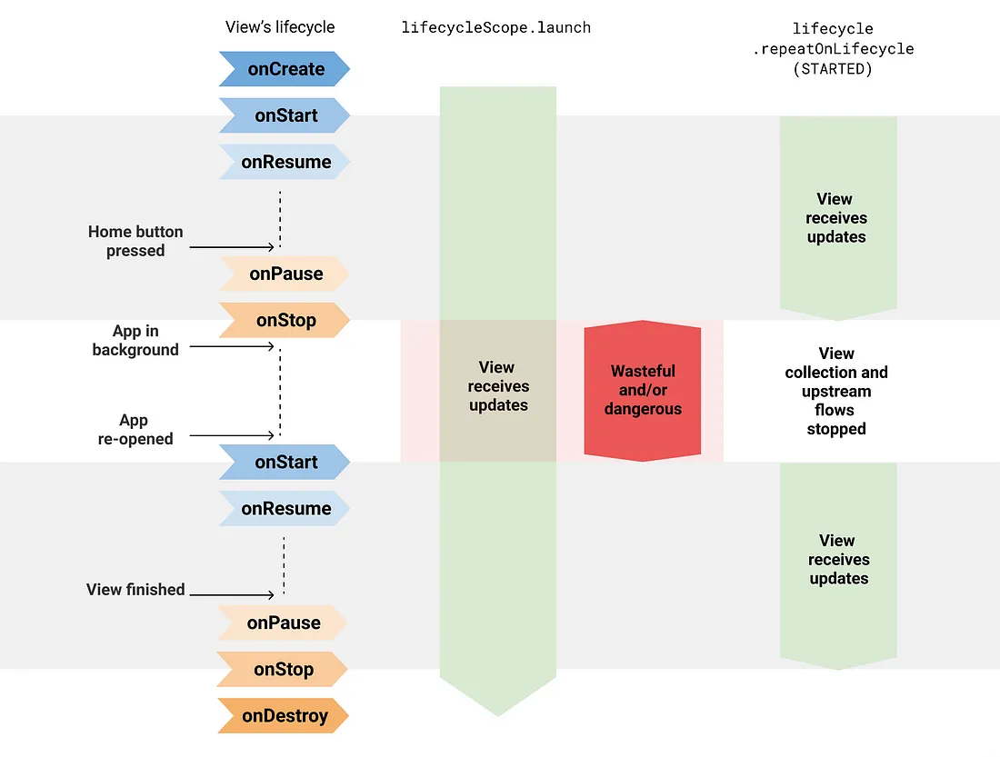

- [UI から Flow を収集する安全な方法](#ui-から-flow-を収集する安全な方法)
  - [リソースの浪費](#リソースの浪費)
  - [Lifecycle.repeatOnLifecycle](#lifecyclerepeatonlifecycle)
  - [仕組み](#仕組み)
  - [視覚的な図](#視覚的な図)
  - [Flow.flowWithLifecycle](#flowflowwithlifecycle)
  - [基盤となるプロデューサーの構成](#基盤となるプロデューサーの構成)
  - [Jetpack Compose での安全なフロー収集](#jetpack-compose-での安全なフロー収集)
  - [LiveData との比較](#livedata-との比較)
  - [データバインディングでの StateFlow サポート](#データバインディングでの-stateflow-サポート)


# UI から Flow を収集する安全な方法

Android アプリでは、 [Kotlin flows](https://developer.android.com/kotlin/flow?hl=ja) は通常、画面にデータの更新を表示するために UI レイヤーで要素を収集します。ただし、必要以上の作業を行ったり、リソース ( CPU とメモリの両方) を浪費したり、ビューがバックグラウンドになったときにデータを漏洩したりしないように注意する必要があります。

この記事では、 Lifecycle.repeatOnLifecycle および Flow.flowWithLifecycle API がリソースの浪費を防ぐ方法と、 UI レイヤーでのフロー収集にこれらの API がデフォルトとして適している理由について説明します。

## リソースの浪費

フロープロデューサーの実装の詳細に関係なく、アプリ階層の下位レイヤーから `Flow<T>` API を公開することをお勧めします。ただし、安全に収集するように注意してください。

コルーチンのチャネルによってバックアップされたコールドフロー、または buffer , conflate , flowOn , shareIn などのバッファーを持つ演算子を使用したコールドフローは、アクティビティがバックグラウンドになったときにコルーチンを開始したジョブを手動でキャンセルしない限り、 CoroutineScope.launch , `Flow<T>.launchIn` , LifecycleCoroutineScope.launchWhenX などの既存の API の一部を使用して安全に収集することはできません。これらの API は、バックグラウンドでバッファーにアイテムを放出している間、基礎となるフロープロデューサーをアクティブにしたままにするため、リソースが無駄になります。

参考：コールドフローとホットフローの違いについては、 [Flow のコールドとホットの違い](../../../../../../バックグラウンド処理/Kotlin%20Flow%20公式ドキュメント/Flow%20のコールドとホットの違い.md) を参照してください。

たとえば、 [callbackFlow](https://kotlinlang.org/api/kotlinx.coroutines/kotlinx-coroutines-core/kotlinx.coroutines.flow/callback-flow.html) を使用してロケーション更新を放出する次のフローを検討してください。

```kotlin
// 位置情報の更新を送信するチャネルによってバックアップされたコールドフローの実装
fun FusedLocationProviderClient.locationFlow() = callbackFlow<Location> {
    val callback = object : LocationCallback() {
        override fun onLocationResult(result: LocationResult?) {
            result ?: return
            try { offer(result.lastLocation) } catch(e: Exception) {}
        }
    }
    requestLocationUpdates(createLocationRequest(), callback, Looper.getMainLooper())
        .addOnFailureListener { e ->
            // 例外が発生した場合、 Flow を閉じます
            close(e)
        }
    // Flow の収集が完了したらクリーンアップします。
    awaitClose {
        removeLocationUpdates(callback)
    }
}
```

注: 内部的には、 callbackFlow はチャネルを使用します。これは概念的にはブロッキングキューに非常に似ており、デフォルトの容量は 64 要素です。

前述の API のいずれかを使用して UI レイヤーでフローを収集すると、ビューが UI に表示していなくても、フローの発信場所が保持されます。以下の例を参照してください。

```kotlin
class LocationActivity : AppCompatActivity() {
    override fun onCreate(savedInstanceState: Bundle?) {
        super.onCreate(savedInstanceState)

        // View が STARTED 以上の状態になっている場合に、 flow から要素が収集されます。
        // STOPPED になった場合に、収集を一時停止します。
        // DESTROYED になった場合に、 flow チャネルを破棄します。
        lifecycleScope.launchWhenStarted {
            locationProvider.locationFlow().collect {
                // 新しい位置情報を取得しました。地図を更新してください。
            } 
        }
        // 以下の場合にも同じ問題が起きます。
        // - lifecycleScope.launch { /* Collect from locationFlow() here */ }
        // - locationProvider.locationFlow().onEach { /* ... */ }.launchIn(lifecycleScope)
    }
}
```

lifecycleScope.launchWhenStarted はコルーチンの実行を一時停止します。新しい場所は処理されませんが、 callbackFlow プロデューサーは場所を送信し続けます。 lifecycleScope.launch または launchIn API を使用すると、ビューがバックグラウンドであっても場所を消費し続けるため、さらに危険です。これにより、アプリがクラッシュする可能性があります。

これらの API でこの問題を解決するには、ビューがバックグラウンドになったときに手動でコレクションをキャンセルして callbackFlow をキャンセルし、場所プロバイダーがアイテムを発行してリソースを無駄にしないようにする必要があります。たとえば、次のようにすることができます。

```kotlin
class LocationActivity : AppCompatActivity() {

    // 位置情報の更新を受け取るコルーチン
    private var locationUpdatesJob: Job? = null

    override fun onStart() {
        super.onStart()
        locationUpdatesJob = lifecycleScope.launch {
            locationProvider.locationFlow().collect {
                // 新しい位置情報を取得しました。地図を更新してください。
            } 
        }
    }

    override fun onStop() {
        // View がバックグラウンドになった場合に、収集を停止します。
        locationUpdatesJob?.cancel()
        super.onStop()
    }
}
```

これは良い解決策ですが、これは定型コードです。 Android 開発者に共通する真実があるとすれば、それは定型コードを書くのが大嫌いだということです。定型コードを書かなくてもよいことの最大のメリットの 1 つは、コードが少なくなるため、ミスをする可能性が低くなることです。


## Lifecycle.repeatOnLifecycle

これで全員が同じ認識を持ち、問題がどこにあるかがわかったので、解決策を考え出すときです。解決策は以下を満たすものが良いです。

1. シンプルであること
2. 親しみやすく覚えやすい / 理解しやすいこと
3. 安全であることが必要です

フロー実装の詳細に関係なく、すべてのユースケースで機能する必要があります。

さっそく、使用すべき API は lifecycle-runtime-ktx ライブラリで利用できる Lifecycle.repeatOnLifecycle です。

注: これらの API は、 androidx.lifecycle:lifecycle-runtime-ktx:2.4.0 ライブラリ以降で利用できます。

次のコードをご覧ください。

```kotlin
class LocationActivity : AppCompatActivity() {
    override fun onCreate(savedInstanceState: Bundle?) {
        super.onCreate(savedInstanceState)

        // repeatOnLifecycle 関数は suspend 関数であるため、新しいコルーチンを生成します。
        lifecycleScope.launch {
            // repeatOnLifecycle に渡されたブロックは、ライフサイクルが STARTED 以上の場合に実行され、
            // STOPPED の場合にキャンセルされます。
            // ライフサイクルが再び STARTED になる度に、ブロックが自動的に再開されます。
            repeatOnLifecycle(Lifecycle.State.STARTED) {
                // ライフサイクルが STARTED になった場合に、 locationFlow から安全に収集され、
                // ライフサイクルが STOPPED になった場合に、収集が停止します。
                locationProvider.locationFlow().collect {
                    // 新しい位置情報を取得しました。地図を更新してください。
                }
            }
        }
    }
}
```

repeatOnLifecycle は、 Lifecycle.State をパラメーターとして受け取る suspend 関数です。この関数は、ライフサイクルがその状態に達したときに、渡されたブロックを使用して新しいコルーチンを自動的に作成して起動し、ライフサイクルがその状態を下回ったときに、ブロックを実行している進行中のコルーチンをキャンセルするために使用されます。

これにより、不要になったコルーチンをキャンセルするための関連コードが repeatOnLifecycle によって自動的に実行されるため、定型コードが回避されます。ご想像のとおり、予期しない動作を回避するには、アクティビティの onCreate メソッドまたはフラグメントの onViewCreated メソッドでこの API を呼び出すことをお勧めします。フラグメントを使用した以下の例を参照してください。

```kotlin
class LocationFragment: Fragment() {
    override fun onViewCreated(view: View, savedInstanceState: Bundle?) {
        // このコルーチンは、 Fragment の onDestroryView に連動してキャンセルされます。
        viewLifecycleOwner.lifecycleScope.launch {
            viewLifecycleOwner.repeatOnLifecycle(Lifecycle.State.STARTED) {
                locationProvider.locationFlow().collect {
                    // 新しい位置情報を取得しました。地図を更新してください。
                }
            }
        }
    }
}
```

重要: フラグメントは、 UI 更新をトリガーするために常に viewLifecycleOwner を使用する必要があります。ただし、 DialogFragments の場合は View がない場合があり、この限りではありません。 DialogFragments の場合は lifecycleOwner を使用できます。

注: これらの API は、 androidx.lifecycle:lifecycle-runtime-ktx:2.4.0 ライブラリ以降で使用できます。


## 仕組み

repeatOnLifecycle は、呼び出し元のコルーチンを一時停止し、ライフサイクルが新しいコルーチンでターゲット状態に出入りするときにブロックを再起動し、ライフサイクルが破棄されたときに呼び出し元のコルーチンを再開します。この最後の点は非常に重要です。 repeatOnLifecycle を呼び出すコルーチンは、ライフサイクルが破棄されるまで実行を再開しません。

```kotlin
class LocationActivity : AppCompatActivity() {
    override fun onCreate(savedInstanceState: Bundle?) {
        super.onCreate(savedInstanceState)

        // Create a coroutine
        lifecycleScope.launch {
            repeatOnLifecycle(Lifecycle.State.RESUMED) {
                // ライフサイクルが RESUMED になったら繰り返し実行され、
                // PAUSED になったらキャンセルされます。
            }

            // ライフサイクルが、 PAUSED になると、 repeatOnLifecycle のブロックが破棄され、
            repeatOnLifecycle ブロックの後続処理が再開されます。
        }
    }
}
```

## 視覚的な図

最初に戻って、 lifecycleScope.launch で開始されたコルーチンから直接 locationFlow を収集することは、 View がバックグラウンドにあるときでも収集が継続されるため危険でした。

repeatOnLifecycle は、ライフサイクルがターゲット状態に出入りするときにフロー収集を停止して再開するため、リソースの浪費やアプリのクラッシュを防ぎます。




## Flow.flowWithLifecycle

収集するフローが 1 つしかない場合は、 Flow.flowWithLifecycle 演算子を使用することもできます。この API は、内部で repeatOnLifecycle API を使用し、ライフサイクルがターゲット状態に出入りするときにアイテムを発行し、基礎となるプロデューサーをキャンセルします。

```kotlin
class LocationActivity : AppCompatActivity() {
    override fun onCreate(savedInstanceState: Bundle?) {
        super.onCreate(savedInstanceState)

        // flowWithLifecycle を使用して、ライフサイクルに連動する方法で、一つの flow から収集します。
        lifecycleScope.launch {
            locationProvider.locationFlow()
                .flowWithLifecycle(lifecycle, Lifecycle.State.STARTED)
                .collect {
                    // 新しい位置情報を取得しました。地図を更新してください。
                }
        }
        
        // 複数の flow から収集します。
        lifecycleScope.launch {
            repeatOnLifecycle(Lifecycle.State.STARTED) {
                // collect は suspend 関数なので、
                // もし、複数の flow から並列で収集したい場合は、
                // 異なるコルーチンから flow を収集する必要があります。

                launch {
                    flow1.collect { /* Do something */ }   
                }
                
                launch {
                    flow2.collect { /* Do something */ }
                }
            }
        }
    }
}
```

注: この API 名は、 Flow.flowOn(CoroutineContext) 演算子を前例として使用します。 Flow.flowWithLifecycle は、上流フローを収集するために使用される CoroutineContext を変更しますが、下流フローには影響しません。また、 flowOn と同様に、 Flow.flowWithLifecycle は、コンシューマーがプロデューサーに追いつかない場合に備えてバッファーを追加します。これは、実装で callbackFlow が使用されるためです。


## 基盤となるプロデューサーの構成

これらの API を使用する場合でも、だれにも収集されなくてもリソースを浪費する可能性のあるホットフローに注意してください。ホットフローの有効なユースケースはいくつかあるため、利用する場合は、ドキュメント化して、ホットフローの有効性を説明してください。

基盤となるフロープロデューサーをバックグラウンドでアクティブにしておくと、リソースを浪費する場合でも、一部のユースケースでメリットがあります。追いついて一時的に古いデータを表示するのではなく、最新のデータを即座に利用できるようになります。

**大切なことは、ユースケースに応じて、プロデューサーを常にアクティブにする必要があるかどうかを決定することです。**

MutableStateFlow および MutableSharedFlow API は、 subscriptionCount がゼロのときに基になるプロデューサーを停止するために使用できる subscriptionCount フィールドを公開します。 **デフォルトでは、フローインスタンスを保持するオブジェクトがメモリ内にある限り、プロデューサーはアクティブのままになります。** ただし、これには有効なユースケースがいくつかあります。たとえば、 StateFlow を使用して ViewModel から UI に公開される UiState などです。このユースケースでは、 ViewModel が常に最新の UI 状態を View に提供する必要があるため、問題ありません。

同様に、 Flow.stateIn および Flow.shareIn 演算子は、共有開始ポリシーを使用してこれを構成できます。アクティブなオブザーバーがない場合、 WhileSubscribed() は基になるプロデューサーを停止します。逆に、 Eagerly または Lazily は、使用する CoroutineScope がアクティブである限り、基になるプロデューサーをアクティブのままにします。

注: この記事で紹介する API は、 UI からフローを収集するための適切なデフォルトであり、フロー実装の詳細に関係なく使用する必要があります。これらの API は、必要なことを実行します。つまり、 UI が画面に表示されていない場合は収集を停止します。フローを常にアクティブにするかどうかは、フロー実装次第です。


## Jetpack Compose での安全なフロー収集

Jetpack Compose を使用して Android アプリをビルドしている場合は、 collectAsStateWithLifecycle API を使用して、 UI からライフサイクルに対応した方法でフローを収集します。

collectAsStateWithLifecycle は、フローから値を収集し、ライフサイクルに対応した方法で最新の値を Compose State として表す、コンポーズ可能な関数です。新しいフローの発行が発生するたびに、この State オブジェクトの値が更新されます。これにより、 Composition 内のすべての State.value の使用が再コンポーズされます。

デフォルトでは、 collectAsStateWithLifecycle は、フローからの値の収集を開始および停止するために Lifecycle.State.STARTED を使用します。これは、 Lifecycle がターゲット状態に出入りするときに発生します。このライフサイクル状態は、 minActiveState パラメータで構成できます。

次のコードスニペットは、この API の動作を示しています。

```kotlin
@Composable
fun LocationUI(locationFlow: Flow<Location>) {

    val location by locationFlow.collectAsStateWithLifecycle()

    // 現在の位置情報を使用して、何らかの処理を実施します。
}
```

詳細については、 [Jetpack Compose でのフローの安全な使用に関するブログ投稿](./Jetpack%20Compose%20から安全に%20flow%20を収集する.md) ( [引用元資料はこちら](https://medium.com/androiddevelopers/consuming-flows-safely-in-jetpack-compose-cde014d0d5a3) ) をご覧ください。


## LiveData との比較

この API の動作が LiveData と似ていることにお気づきかもしれません。これは事実です。 LiveData はライフサイクルを認識しており、その再起動動作により、 UI からのデータストリームの監視に最適です。これは、 Lifecycle.repeatOnLifecycle および Flow.flowWithLifecycle API にも当てはまります。

これらの API を使用してフローを収集することは、 Kotlin のみのアプリで LiveData の自然な代替手段です。これらの API をフロー収集に使用する場合、 LiveData はコルーチンやフローに比べて何の利点もありません。さらに、フローはどの Dispatcher からでも収集でき、すべての演算子で動作させることができるため、より柔軟です。これは、使用できる演算子が限られており、値は常に UI スレッドから監視される LiveData とは対照的です。


## データバインディングでの StateFlow サポート

別の話ですが、 LiveData を使用する理由の 1 つは、データバインディングでサポートされているためです。そうです、 StateFlow もサポートされています。データバインディングでの StateFlow サポートの詳細については、公式ドキュメント ( [監視可能なデータオブジェクトを操作する](https://developer.android.com/topic/libraries/data-binding/observability?hl=ja#stateflow) ) をご覧ください。

Lifecycle.repeatOnLifecycle または Flow.flowWithLifecycle API を使用して、 Android の UI レイヤーからフローを安全に収集します。


