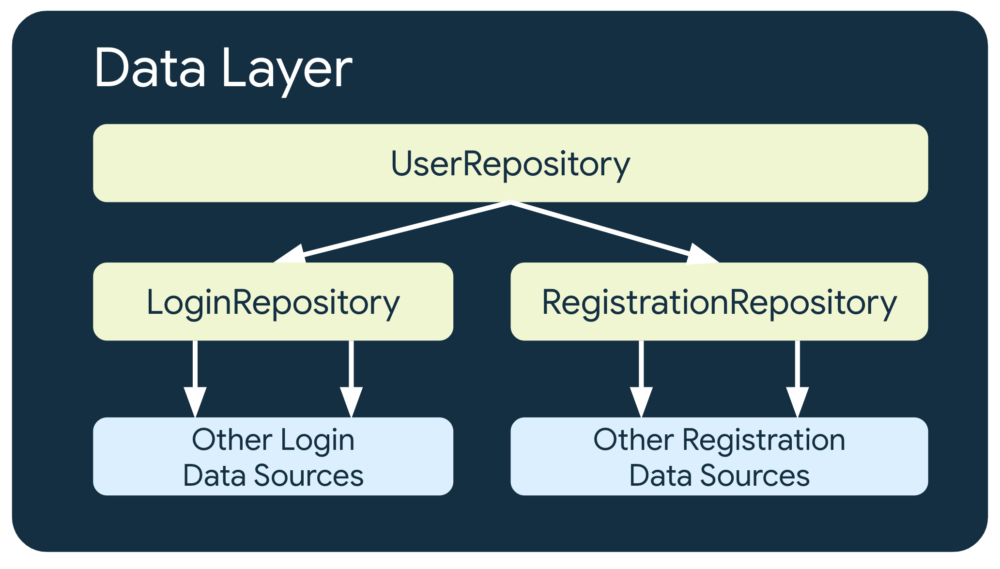

- [データレイヤ](#データレイヤ)
  - [データレイヤのアーキテクチャ](#データレイヤのアーキテクチャ)
  - [API を公開する](#api-を公開する)
  - [このガイドにおける命名規則](#このガイドにおける命名規則)
    - [リポジトリの命名規則](#リポジトリの命名規則)
    - [データソースの命名規則](#データソースの命名規則)
      - [注意点](#注意点)
  - [複数レベルのリポジトリ](#複数レベルのリポジトリ)
  - [信頼できる情報源](#信頼できる情報源)
  - [スレッド化](#スレッド化)
  - [ライフサイクル](#ライフサイクル)
  - [ビジネスモデルを表現する](#ビジネスモデルを表現する)
  - [データオペレーションの種類](#データオペレーションの種類)
    - [UI 指向のオペレーション](#ui-指向のオペレーション)
    - [アプリ指向のオペレーション](#アプリ指向のオペレーション)
    - [ビジネス指向のオペレーション](#ビジネス指向のオペレーション)
  - [エラーを公開する](#エラーを公開する)
  - [一般的なタスク](#一般的なタスク)
    - [ネットワークリクエストを行う](#ネットワークリクエストを行う)
      - [データソースを作成する](#データソースを作成する)
      - [リポジトリを作成する](#リポジトリを作成する)
    - [データのメモリ内キャッシュ保存を実装する](#データのメモリ内キャッシュ保存を実装する)
      - [キャッシュ](#キャッシュ)
      - [ネットワークリクエストの結果をキャッシュに保存する](#ネットワークリクエストの結果をキャッシュに保存する)
      - [オペレーションを画面より長く存続させる](#オペレーションを画面より長く存続させる)
    - [データのディスクへの保存と取得](#データのディスクへの保存と取得)
      - [データソースとしての Room](#データソースとしての-room)
      - [データソースとしての DataStore](#データソースとしての-datastore)
      - [データソースとしてのファイル](#データソースとしてのファイル)
    - [WorkManager を使用してタスクのスケジュールを設定する](#workmanager-を使用してタスクのスケジュールを設定する)
  - [テスト](#テスト)
    - [単体テスト](#単体テスト)
    - [統合テスト](#統合テスト)
  - [引用元資料](#引用元資料)


# データレイヤ

UI レイヤには、次の二つが含まれています。

- UI 関連の状態
- UI ロジック

一方で、データレイヤには、次の二つが含まれています。

- アプリデータ
- ビジネス ロジック

ビジネス ロジックは、アプリデータの作成、保存、変更方法を決定する実際のビジネスルールで構成されており、アプリに価値を提供するものです。

データレイヤでこのように関心の分離を行うことで、複数画面での使用、アプリの各要素間での情報共有ができるほか、単体テスト用に UI の外部でビジネス ロジックを再現することも可能になります。データレイヤのメリットについて詳しくは、 [アーキテクチャの概要](../1.アプリアーキテクチャについて.md) ページをご覧ください。


## データレイヤのアーキテクチャ

データレイヤは、 0 個以上のデータソースへのアクセスが可能なリポジトリで構成されています。リポジトリは一つではなく、 **アプリで処理するデータの種類ごとにリポジトリクラスを作成する必要があります。** たとえば、映画に関するデータであれば MoviesRepository クラス、支払いに関するデータであれば PaymentsRepository クラスを作成します。


リポジトリクラスは、以下の役割を担います。

- アプリの他の部分にデータを公開する。
- データの変更を一元管理する。
- 複数のデータソース間の競合を解決する。
- アプリの他の部分からデータソースを抽象化する。
- ビジネスロジックを格納する。

**各データソースクラスは、 1 つのデータソース (ファイル or ネットワークソース or ローカルデータベース or ... ) のみにアクセスするように実装してください。**

データソースクラスは、データ操作に関して、アプリとシステムの橋渡し役を担います。

**必ずリポジトリクラスをデータレイヤのエントリポイントとして使用し、 UI レイヤやドメインレイヤがデータソースに直接アクセスしないようにしてください。** リポジトリラスをエントリポイントとして使用すると、アーキテクチャのさまざまなレイヤを個別にスケーリングできます。

**このレイヤで公開されるデータは不変である必要があります。** これにより、他のクラスによってデータが変更され、値に不整合が発生するリスク (データソースの更新漏れのリスクなど) をなくすことができます。また、データを不変にすることで、複数のスレッドによって安全にアクセスすることもできます。詳しくは、 [スレッド化](#スレッド化) のセクションをご覧ください。

依存関係注入のベストプラクティスに従い、リポジトリはコンストラクタで依存関係を注入すると良いです。

```kotlin
class ExampleRepository(
    private val exampleRemoteDataSource: ExampleRemoteDataSource, // network
    private val exampleLocalDataSource: ExampleLocalDataSource // database
) { /* ... */ }
```

リポジトリに 1 つのデータソースしか含まれておらず、他のリポジトリには依存していない場合、リポジトリとデータソースの役割をリポジトリクラスに統合することができます。ただし、別のデータソースを追加することが必要になった場合は、必ず機能を分割してください。


## API を公開する

通常、データレイヤのクラスは、ワンショットの作成、読み取り、更新、削除 ( CRUD ) 呼び出しを実行する関数や、時間の経過に伴うデータの変更について通知を受け取る関数を公開します。具体的には以下のような API を公開します。

- ワンショットオペレーション
  - Kotlin の場合
    - データレイヤは suspend 関数を公開する必要があります。
  - Java プログラミング言語の場合
    - データレイヤはオペレーションの結果を通知するコールバックを提供する関数か、RxJava の Single 型、Maybe 型、Completable 型のいずれかを公開する必要があります。
- 時間の経過に伴うデータ変更について通知を受け取る
  - Kotlin の場合
    - データレイヤは flow を公開する必要があります。
  - Java プログラミング言語の場合
    - データレイヤは新しいデータを出力するコールバックか、RxJava の Observable 型または Flowable 型を公開する必要があります。

```kotlin
class ExampleRepository(
    private val exampleRemoteDataSource: ExampleRemoteDataSource, // network
    private val exampleLocalDataSource: ExampleLocalDataSource // database
) {

    // 時間の経過に伴うデータの変更について通知を受け取る例
    val data: Flow<Example> = ...

    // ワンショットオペレーションの例
    suspend fun modifyData(example: Example) { ... }
}
```


## このガイドにおける命名規則

### リポジトリの命名規則

このガイドでは、リポジトリクラスは担当するデータに基づいて命名されます。規則は次のとおりです。

- データの種類 + Repository

たとえば、NewsRepository、MoviesRepository、PaymentsRepository などです。


### データソースの命名規則

データソース クラスには、担当するデータと使用するソースに基づいて名前が付けられます。規則は次のとおりです。

- データの種類 + ソースの種類 + DataSource

#### 注意点

ソースの種類については、実装が変わる可能性があるため、Remote や Local を使用すると汎用性が高くなります。たとえば、NewsRemoteDataSource や NewsLocalDataSource などです。ソースが重要な場合、より具体的な名前になるようにソースの種類を使用します。たとえば、NewsNetworkDataSource や NewsDiskDataSource などです。

データソースを使用するリポジトリはデータの保存方法を認識しないため、実装の詳細に基づく名前は付けないでください（例: UserSharedPreferencesDataSource）。このルールに従うと、そのソースを呼び出すレイヤに影響を与えることなくデータソースの実装を変更できます（例: SharedPreferences から DataStore への移行）。

注: データソースの新しい実装に移行する際に、データソースのインターフェースを作成して、データソースの 2 つの実装（1 つは古いバッキング技術用、もう 1 つは新しいバッキング技術用）を用意することもできます。その場合、リポジトリはデータソース クラス自体ではなく、インターフェース クラスのみを認識するため、データソース クラス名に技術の名前を使用しても（実装の詳細であっても）問題ありません。移行が完了したら、実装の詳細を名前に含めないように新しいクラスの名前を変更できます。


## 複数レベルのリポジトリ

より複雑なビジネス要件が含まれる場合は、リポジトリが他のリポジトリに依存しなければならないことがあります。具体的には、関連データが複数のデータソースから集約されたものである場合や、役割を別のリポジトリ クラスにカプセル化する必要がある場合などです。

たとえば、ユーザー認証データを処理するリポジトリ UserRepository は、その要件を満たすために LoginRepository や RegistrationRepository などの他のリポジトリに依存することがあります。



注: これまで一部のデベロッパーは、他のリポジトリ クラスに依存するリポジトリ クラスを「マネージャー」と呼んできました（例: UserRepository ではなく UserManager）。この命名規則を使用することもできます。


## 信頼できる情報源

各リポジトリで、信頼できる唯一の情報源を定義することが重要です。信頼できる情報源には、常に正確で一貫性のある最新データが含まれています。実際、リポジトリから公開されるデータは、常に信頼できる情報源から、直接取得されたデータでなければなりません。

信頼できる情報源は、データソース（データベースなど）の場合もあれば、リポジトリに含まれるメモリ内キャッシュの場合もあります。リポジトリはさまざまなデータソースを組み合わせて、データソース間の潜在的な競合を解決し、定期的に、またはユーザー入力イベントによって信頼できる唯一の情報源を更新します。

アプリのリポジトリによって、信頼できる情報源が異なる場合があります。たとえば、LoginRepository クラスは、キャッシュを信頼できる情報源とし、 PaymentsRepository クラスは、ネットワーク データソースを信頼できる情報源として使用する場合などがあります。

オフラインファーストのサポートを提供するため、 **信頼できる情報源としてローカルデータソース (データベースなど) を使用することをおすすめします。**


## スレッド化

データソースとリポジトリの呼び出しは、メインセーフ（メインスレッドから安全に呼び出せること）である必要があります。これらのクラスは、長時間実行ブロック オペレーションを実行する際に、ロジックの実行を適切なスレッドに移動する役割を担います。たとえば、データソースがファイルから読み取る場合、または、リポジトリが大きなリストになっており、高コストなフィルタリングを実行する場合に、メインセーフである必要があります。

ほとんどのデータソースには、 [Room](https://developer.android.com/training/data-storage/room?hl=ja&_gl=1*3i64qn*_up*MQ..*_ga*NTc1MDc4MDM2LjE3MjA1MDM5NTc.*_ga_6HH9YJMN9M*MTcyMTExODU5OS41LjAuMTcyMTExODU5OS4wLjAuMA..) , [Retrofit](https://square.github.io/retrofit/) , [Ktor](https://ktor.io/) が提供する suspend メソッド呼び出しなどのメインセーフな API がすでに用意されています。これらの API が利用可能な場合は、リポジトリで活用できます。

スレッド化について詳しくは、 [バックグラウンド処理ガイド](https://developer.android.com/develop/background-work/background-tasks?hl=ja&_gl=1%2Af5qlu6%2A_up%2AMQ..%2A_ga%2ANTc1MDc4MDM2LjE3MjA1MDM5NTc.%2A_ga_6HH9YJMN9M%2AMTcyMTExODU5OS41LjAuMTcyMTExODU5OS4wLjAuMA..) をご覧ください。Kotlin では [コルーチン](https://developer.android.com/kotlin/coroutines?hl=ja&_gl=1*hc1cxx*_up*MQ..*_ga*NTc1MDc4MDM2LjE3MjA1MDM5NTc.*_ga_6HH9YJMN9M*MTcyMTExODU5OS41LjAuMTcyMTExODU5OS4wLjAuMA..) を使用することをおすすめします。Java プログラミング言語で推奨されるオプションについては、 [バックグラウンドスレッドでの Android タスクの実行](https://developer.android.com/develop/background-work/background-tasks/asynchronous/java-threads?hl=ja&_gl=1*hc1cxx*_up*MQ..*_ga*NTc1MDc4MDM2LjE3MjA1MDM5NTc.*_ga_6HH9YJMN9M*MTcyMTExODU5OS41LjAuMTcyMTExODU5OS4wLjAuMA..) をご覧ください。


## ライフサイクル

データレイヤ内のクラスのインスタンスは、ガベージコレクションルートから到達可能である限り、メモリ内に保持されます (通常は、常にアプリの他のオブジェクトから参照されているためアプリのプロセスの生存期間に一致します) 。

クラスにメモリ内データ（キャッシュなど）が含まれている場合、そのクラスの同じインスタンスを一定期間再利用することをおすすめします。これは、クラス インスタンスのライフサイクルとも呼ばれます。

クラスの役割がアプリ全体で重要な場合は、そのクラスのインスタンスのスコープを Application クラスに設定できます。これにより、インスタンスがアプリのライフサイクルに従うようになります。一方、アプリの特定のフロー（登録フローやログインフローなど）で同じインスタンスを再利用するだけであれば、そのフローのライフサイクルを持つクラスにインスタンスのスコープを設定する必要があります。たとえば、メモリ内データを含む RegistrationRepository のスコープを、登録フローの RegistrationActivity または [ナビゲーショングラフ](https://developer.android.com/guide/navigation?hl=ja&_gl=1*n1tegq*_up*MQ..*_ga*NTc1MDc4MDM2LjE3MjA1MDM5NTc.*_ga_6HH9YJMN9M*MTcyMTExODU5OS41LjAuMTcyMTExODU5OS4wLjAuMA..#create-nav-graph) に設定します。

各インスタンスのライフサイクルは、アプリ内で依存関係を提供する方法を決定するための重要な要素です。依存関係を管理し、スコープを依存関係コンテナに設定できる依存関係注入のベスト プラクティスに従うことをおすすめします。Android でのスコープ設定について詳しくは、 [Android と Hilt でのスコープ設定](https://medium.com/androiddevelopers/scoping-in-android-and-hilt-c2e5222317c0) に関するブログ投稿をご覧ください。


## ビジネスモデルを表現する

データレイヤから公開するデータモデルは、さまざまなデータソースから取得した情報のサブセットである場合があります。ネットワーク データソースもローカル データソースも、アプリが必要とする情報のみを返すのが理想的ですが、実際そうなるとは限りません。

たとえば、記事情報だけでなく、編集履歴、ユーザー コメント、一部のメタデータも返す News API サーバーがあるとします。

```kotlin
data class ArticleApiModel(
    val id: Long,
    val title: String,
    val content: String,
    val publicationDate: Date,
    val modifications: Array<ArticleApiModel>,
    val comments: Array<CommentApiModel>,
    val lastModificationDate: Date,
    val authorId: Long,
    val authorName: String,
    val authorDateOfBirth: Date,
    val readTimeMin: Int
)
```

アプリの画面には、記事のコンテンツと執筆者の基本情報しか表示されないため、記事に関する情報はそれほど必要ありません。そのため、モデルクラスを分離し、リポジトリは、他のレイヤに必要なデータのみを公開することをおすすめします。たとえば、 ArticleApiModel から必要なプロパティだけを取り出した Article モデルクラスをドメインレイヤと UI レイヤに公開します。

```kotlin
data class Article(
    val id: Long,
    val title: String,
    val content: String,
    val publicationDate: Date,
    val authorName: String,
    val readTimeMin: Int
)
```

モデルクラスを分離すると、次のようなメリットがあります。

- データを必要最小限まで削減することで、アプリのメモリを節約できます。
- 外部のデータ型をアプリで使用されているデータ型に適応させることができます。たとえば、アプリで日付を表すために別のデータ型が使用されている場合があります。
- 関心の分離を適切に行うことができます。たとえば、モデルクラスが事前に定義されている場合、大規模なチーム開発では、各メンバーは、ネットワーク レイヤと UI レイヤに個別に取り組むことができます。

この手法を拡張し、アプリアーキテクチャの他の部分 (データソース クラス、 ViewModel など) で個別のモデルクラスを定義することもできます。ただし、この場合は、ドキュメント作成とテストを適切に行えるように、追加のクラスとロジックを定義する必要があります。 **少なくとも、アプリの他の部分で想定されているデータとは異なるデータをデータソースが受信する場合は、新しいモデルを作成することをおすすめします。**


## データオペレーションの種類

データレイヤは、必要な生存期間 (いつ操作がキャンセルされ、いつデータが破棄されるか) によって、オペレーションを分類できます。オペレーションの種類には、 UI 指向、アプリ指向、ビジネス指向の三種類があります。


### UI 指向のオペレーション

UI 指向のオペレーションは、ユーザーが特定の画面にいる場合にのみ必要であり、ユーザーがその画面から移動するとキャンセルされます。たとえば、データベースから取得したデータを表示する場合です。

UI 指向のオペレーションは、通常、 UI レイヤによってトリガーされ、呼び出し元のライフサイクル ( ViewModel のライフサイクルなど) に従います。 UI 指向のオペレーションの例については、 [ネットワークリクエストを行う](#ネットワークリクエストを行う) のセクションをご覧ください。


### アプリ指向のオペレーション

アプリ指向のオペレーションは、アプリが開いている間だけ必要となります。アプリが終了されるか、プロセスが強制終了されると、これらのオペレーションはキャンセルされます。たとえば、ネットワーク リクエストの結果をキャッシュに保存し、後で必要に応じて使用できるようにする場合です。詳細については、 [メモリ内データのキャッシュ保存の実装](#データのメモリ内キャッシュ保存を実装する) のセクションをご覧ください。

通常、これらのオペレーションは Application クラス、または、データレイヤのライフサイクル (通常はプロセスのライフサイクルと同じ) に従います。例については、 [オペレーションを画面より長く存続させる](#オペレーションを画面より長く存続させる) セクションをご覧ください。


### ビジネス指向のオペレーション

ビジネス指向のオペレーションは、キャンセルできません。これらは、プロセス終了後も存続する必要があります。たとえば、ユーザーがプロフィールに表示する写真をアップロードする場合です。

ビジネス指向のオペレーションでは、WorkManager を使用することをおすすめします。詳しくは、 [WorkManager を使用したタスクのスケジュール設定](#workmanager-を使用してタスクのスケジュールを設定する) セクションをご覧ください。


## エラーを公開する

リポジトリとデータソースとのインタラクションは、成功するか、失敗したときに例外をスローします。コルーチンと Flow の場合は、Kotlin の組み込みのエラー処理メカニズムを使用してください。suspend 関数によってトリガーされる可能性のあるエラーの場合は、必要に応じて try / catch ブロックを使用します。 Flow の場合は、 catch 演算子を使用します。このアプローチでは、一般的に、 UI レイヤがデータレイヤを呼び出した際に例外が発生し、 UI レイヤがそれを処理することが想定されます。

データレイヤでは、さまざまな種類のエラーを理解して処理し、カスタム例外 ( UserNotAuthenticatedException など) を使用して公開できます。

注: データレイヤのインタラクションの結果をモデル化するもう 1 つの方法は、 Result クラスを使用することです。このパターンは、結果の処理中に発生する可能性のあるエラーや、その他のシグナルをモデル化します。このパターンでは、データレイヤが T 型ではなく `Result<T>` 型を返すため、特定のシナリオで発生する可能性のある既知のエラーを UI が認識できます。これは、 LiveData など、適切な例外処理がないリアクティブプログラミング API で必要です。 (これは、 sealed クラスの話のような気もするけど、違う気もする。この説明だけではわからないので、あまり気にしないでおこう。)

コルーチンのエラーについて、詳しくは [コルーチンの例外](../../../../../../../Kotlin/非同期処理/コルーチン/【ブログ】3.コルーチンの例外.md) に関するブログ投稿 ( [原本はこちら](https://medium.com/androiddevelopers/exceptions-in-coroutines-ce8da1ec060c) ) をご覧ください。


## 一般的なタスク

ここでは、データレイヤの一般的な使用例を説明していきます。


### ネットワークリクエストを行う

ネットワークリクエストは、 Android アプリでよく行われるタスクの 1 つです。ニュースアプリは、ネットワークから取得した最新ニュースを、ユーザーに表示する必要があります。そのため、このアプリには、データソースクラス NewsRemoteDataSource と、リポジトリ NewsRepository が作成されます。

要件としては、ユーザーが画面を開いたときに、常に最新ニュースが更新されるようにする必要があります。したがって、これは UI 指向のオペレーションになります。


#### データソースを作成する

データソースの要件は以下です。

- 最新ニュース ( ArticleHeadline インスタンスのリスト) を返す関数を公開する
- ネットワークから最新ニュースを取得するメインセーフな方法を提供する。

そのためには、 CoroutineDispatcher または Executor に依存して、タスクを実行する必要があります。

ネットワークリクエストの実行は、 fetchLatestNews() メソッドの結果を受け取るワンショットリクエストです。

```kotlin
class NewsRemoteDataSource(
    private val newsApi: NewsApi,
    private val ioDispatcher: CoroutineDispatcher
) {
    /**
     * ネットワークから最新のニュースを取得して返します。
     * この処理は IO に最適化されたスレッドプールで実行されます。
     * そのため、メインスレッドから呼び出し可能 (メインセーフ) です。
     */
    suspend fun fetchLatestNews(): List<ArticleHeadline> =
        // IO に最適化されたスレッドで実行します。
        // なぜなら、 API はコルーチンをサポートしておらず、
        // 同期リクエストを生成するためです。
        withContext(ioDispatcher) {
            // インターフェースで実装の詳細 (どのクラスに依存しているのか) を隠蔽する。
            newsApi.fetchLatestNews()
        }
    }

// ニュース関連のネットワーク同期リクエストを作成
interface NewsApi {
    fun fetchLatestNews(): List<ArticleHeadline>
}
```

NewsApi インターフェースは、ネットワークリクエスト API の実装を隠蔽します。例えば、ネットワークリクエストを実行するのが Retrofit と HttpURLConnection のどちらであっても、アプリ内で実装を切り替えられるようになります。

キーポイント: インターフェースに依存することで、アプリで API の実装を切り替えられるようになります。これにより、拡張性が高まり、依存関係を簡単に置き換えられるだけでなく、テストに疑似データソースの実装を組み込むことができるため、テストを容易に行えるようになります。


#### リポジトリを作成する

このタスクのリポジトリクラスに追加のロジックは不要であるため、NewsRepository はネットワークデータソースのプロキシ (代理人) として機能します。この抽象化レイヤを追加するメリットについては、次のセクション ( [メモリ内キャッシュ保存](#データのメモリ内キャッシュ保存を実装する) ) をご覧ください。

```kotlin
// NewsRepository は他のレイヤーで消費されます。
class NewsRepository(
    private val newsRemoteDataSource: NewsRemoteDataSource
) {
    suspend fun fetchLatestNews(): List<ArticleHeadline> =
        newsRemoteDataSource.fetchLatestNews()
}
```

UI レイヤからリポジトリクラスを直接使用する方法については、 [UI レイヤのガイド](../2.UIレイヤ/1.UI%20レイヤについて.md) ( [元記事はこちら](https://developer.android.com/topic/architecture/ui-layer?hl=ja&_gl=1*bpgfwc*_up*MQ..*_ga*MTUxNDg1MjM5My4xNzMwOTg2NTQ2*_ga_6HH9YJMN9M*MTczMDk4NjU0Ni4xLjAuMTczMDk4NjU0Ni4wLjAuNjQzNzgyNDM.) ) をご覧ください。


### データのメモリ内キャッシュ保存を実装する

ニュースアプリに新しい要件が導入されたとします。この要件は、前にリクエストが行われていた場合、ユーザーが画面を開いたときにキャッシュに保存されたニュースを表示するというものです。それ以外の場合、アプリは、ネットワークリクエストを行って、最新ニュースを取得します。

新しい要件に基づき、ユーザーがアプリを開いている間、最新ニュースをメモリに保持する必要があります。したがって、これはアプリ指向のオペレーションになります。


#### キャッシュ

データのメモリ内キャッシュ保存を追加すると、ユーザーがアプリを開いている間、データを保持できます。キャッシュは、一定の期間（ここではユーザーがアプリを開いている間）メモリに情報を保存することを目的としています。キャッシュの実装にはさまざまな形式があり、単純な可変変数から、高度なクラス（複数のスレッドでの読み取り / 書き込みオペレーションから保護するためのクラス）に至るまで、多岐にわたります。ユースケースに応じて、リポジトリクラス、または、データソースクラスにキャッシュ保存を実装できます。


#### ネットワークリクエストの結果をキャッシュに保存する

シンプルにするために、NewsRepository では、可変変数を使用して最新ニュースをキャッシュに保存します。別のスレッドからの読み取りと書き込みから保護するために、 Mutex を使用します。

Mutex について、詳しくは、 [Mutual exclusion（相互排他 / 排他制御）](../../../../../../../Kotlin/非同期処理/コルーチン/09.共有可変状態と同時実行.md/#mutual-exclusion相互排他--排他制御) をご覧ください。

次の実装では、 Mutex で書き込み保護されたリポジトリ内の変数に、最新ニュースの情報をキャッシュします。ネットワークリクエストが成功した場合、データは latestNews 変数に割り当てられます。

```kotlin
class NewsRepository(
    private val newsRemoteDataSource: NewsRemoteDataSource
) {
    // Mutex は、スレッドセーフな値の書き込みを可能にします。
    private val latestNewsMutex = Mutex()

    // ネットワークから取得した最新のニュースのキャッシュ
    private var latestNews: List<ArticleHeadline> = emptyList()

    suspend fun getLatestNews(refresh: Boolean = false): List<ArticleHeadline> {
        if (refresh || latestNews.isEmpty()) {
            val networkResult = newsRemoteDataSource.fetchLatestNews()
            latestNewsMutex.withLock {
                this.latestNews = networkResult
            }
        }

        return latestNewsMutex.withLock { this.latestNews }
    }
}
```


#### オペレーションを画面より長く存続させる

上記の例では、ネットワークリクエストの処理中にユーザーが画面から移動した場合、リクエストはキャンセルされ、結果はキャッシュに保存されません。しかし、本来なら、 **最新ニュースの取得は、アプリ指向のオペレーションにする必要があります。**

依存関係注入のベスト プラクティスに従うために、NewsRepository は独自の CoroutineScope を作成する代わりに、コンストラクタのパラメータとして、スコープを受け取ります。リポジトリは、その作業のほとんどをバックグラウンド スレッドで行うため、CoroutineScope は Dispatchers.Default 、または、独自のスレッドプールで構成する必要があります。

```kotlin
class NewsRepository(
    ...,
    // このコルーチンスコープは、上位のジョブのスコープ内で定義され、
    // Dispatchers.Default ディスパッチャーとするべきです。
    private val externalScope: CoroutineScope
) { ... }
```

NewsRepository は外部 CoroutineScope を使用してアプリ指向のオペレーションを実行する準備ができました。そのため、データソースの呼び出しを実行して、そのスコープによって開始された新規コルーチンで、その結果を保存します。

```kotlin
class NewsRepository(
    private val newsRemoteDataSource: NewsRemoteDataSource,
    private val externalScope: CoroutineScope
) {
    private var latestNews: List<ArticleHeadline> = emptyList()

    suspend fun getLatestNews(refresh: Boolean = false): List<ArticleHeadline> {
        return if (refresh) {
            externalScope.async {
                newsRemoteDataSource.fetchLatestNews().also { networkResult ->
                    // スレッドセーフな書き込み
                    latestNewsMutex.withLock {
                        // 結果をキャッシュの保存
                        latestNews = networkResult
                    }
                }
            }.await()
        } else {
            return latestNewsMutex.withLock { this.latestNews }
        } 
    }
}
```

async は、外部スコープでコルーチンを開始するために使用されます。ネットワーク リクエストが戻り、結果がキャッシュに保存されるまで、一時停止するための新しいコルーチンで await が呼び出されます。その時点でユーザーがまだ画面にいた場合は、最新ニュースが表示されます。ユーザーが画面から離れた場合は、await はキャンセルされますが、async 内のロジックは引き続き実行されます。

CoroutineScope のパターンについて詳しくは、 [こちらのブログ投稿](../../../../../../../Kotlin/非同期処理/コルーチン/【ブログ】4.キャンセルすべきではないワークのコルーチン実装パターン.md) ( [元記事はこちら](https://medium.com/androiddevelopers/coroutines-patterns-for-work-that-shouldnt-be-cancelled-e26c40f142ad) ) をご覧ください。


### データのディスクへの保存と取得

ブックマークしたニュースやユーザー設定などのデータを保存するとします。 このタイプのデータは、プロセスが終了しても存続し、ユーザーがネットワークに接続されていなくてもアクセスできるようにする必要があります。

データをディスクに保存する方法は、次のいずれかの方法があります。

- Room データベース
  - クエリの実行、参照整合性、部分更新が必要な大規模なデータセットの場合に適しています。
  - ニュースアプリの例では、ニュース記事や執筆者をデータベースに保存できます。
- Datastore
  - 取得と設定のみが必要（クエリの実行や部分更新は不要）な、小さなデータセットの場合に適しています。
  - ニュースアプリの例では、ユーザーの好みの日付形式やその他の表示設定を DataStore に保存できます。
- ファイル
  - JSON オブジェクトのようなデータチャンク (データのかたまり) の場合に適しています。

信頼できる情報源のセクションで説明したように、**各データソースは 1 つのソースのみを処理し** 、特定のデータ型 ( News , Authors , NewsAndAuthors , UserPreferences など) に対応しています。 **データソースを使用するクラス (リポジトリ) は、データの保存方法 (データベースやファイルなど) に依存しないようにします。**


#### データソースとしての Room

各データソースが、特定の種類のデータに関して、 1 つのソースのみを処理する役割を担う必要があります。そのため、 Room データソースは、データアクセス オブジェクト ( DAO ) 、または、データベース自体をパラメータとして受け取ります。たとえば、 NewsLocalDataSource は NewsDao のインスタンスを、 AuthorsLocalDataSource は AuthorsDao のインスタンスを、それぞれパラメータとして受け取ります。

追加のロジックが不要な場合は、DAO をリポジトリに直接挿入できることがあります。これは、DAO がテストで簡単に置換できるインターフェースであるためです。

Room API の操作について詳しくは、 [Room ガイド](https://developer.android.com/training/data-storage/room?hl=ja&_gl=1*y8f3gc*_up*MQ..*_ga*MTU4OTA5NDE4My4xNzIxNDQzMzAy*_ga_6HH9YJMN9M*MTcyMTQ0MzMwMS4xLjAuMTcyMTQ0MzMwMS4wLjAuMA..) をご覧ください。


#### データソースとしての DataStore

[DataStore](https://developer.android.com/topic/libraries/architecture/datastore?hl=ja&_gl=1*llqbog*_up*MQ..*_ga*MTU4OTA5NDE4My4xNzIxNDQzMzAy*_ga_6HH9YJMN9M*MTcyMTQ0MzMwMS4xLjAuMTcyMTQ0MzMwMS4wLjAuMA..) は、ユーザー設定などの Key-Value ペアを格納するのに最適です。たとえば、時刻の表示形式、通知設定、既読のニュース記事を表示するかどうかなどを設定できます。DataStore では、 [プロトコルバッファ](https://protobuf.dev/) を使用して型付きオブジェクトを保存することもできます。

他のオブジェクトと同様に、DataStore でサポートされるデータソースには、特定の型やアプリの特定の部分に対応するデータを含める必要があります。DataStore の読み取りは、値が更新されるたびに出力される Flow として公開されます。これは DataStore では特に重要です。このため、関連する設定は同じ DataStore に保存する必要があります。

たとえば、NotificationsDataStore では、通知関連の設定のみを処理し、NewsPreferencesDataStore では、ニュース画面の設定のみを処理するようにします。これにより、 newsScreenPreferencesDataStore.data フローは、その画面に関連する設定が変更された場合にのみ出力されるため、更新のスコープを適切に設定できます。また、オブジェクトのライフサイクルは、ニュース画面が表示されている間だけ存続するため、オブジェクトのライフサイクルを短くすることもできます。

DataStore API の操作について詳しくは、 [DataStore ガイド](../../3.アーキテクチャコンポーネント/2.データレイヤライブラリ/1.DataStore.md) ( [元資料はこちら](https://developer.android.com/topic/libraries/architecture/datastore?hl=ja&_gl=1*llqbog*_up*MQ..*_ga*MTU4OTA5NDE4My4xNzIxNDQzMzAy*_ga_6HH9YJMN9M*MTcyMTQ0MzMwMS4xLjAuMTcyMTQ0MzMwMS4wLjAuMA..) ) をご覧ください。


#### データソースとしてのファイル

JSON オブジェクトやビットマップなどの大きなオブジェクトを処理する場合は、File オブジェクトを操作して、スレッドの切り替えを処理する必要があります。

ファイル ストレージの操作の詳細については、 [ストレージの概要](https://developer.android.com/training/data-storage?hl=ja&_gl=1*j5istn*_up*MQ..*_ga*MTU4OTA5NDE4My4xNzIxNDQzMzAy*_ga_6HH9YJMN9M*MTcyMTQ0MzMwMS4xLjAuMTcyMTQ0MzMwMS4wLjAuMA..) のページをご覧ください。


### WorkManager を使用してタスクのスケジュールを設定する

ニュースアプリに別の新しい要件が導入されたとします。この要件は、デバイスが充電中で定額制ネットワークに接続されている場合にのみ、最新ニュースを定期的、かつ、自動的に取得するオプションをユーザーに提供するというものです。そのため、これは、 **ビジネス指向のオペレーション** になります。この要件により、ユーザーがアプリを開いたときにデバイスが接続されていない場合でも、最新ニュースを表示できるようになります。

WorkManager を使用すると、信頼性の高い非同期処理を簡単にスケジュールできるほか、制約の管理を行うことも可能です。このライブラリは永続的な処理に向いています。上記で定義されたタスクを実行するために、Worker クラス（ RefreshLatestNewsWorker ）が作成されます。このクラスは、最新ニュースを取得してディスクにキャッシュするために、依存関係として NewsRepository を使用します。

```kotlin
class RefreshLatestNewsWorker(
    private val newsRepository: NewsRepository,
    context: Context,
    params: WorkerParameters
) : CoroutineWorker(context, params) {

    override suspend fun doWork(): Result = try {
        newsRepository.refreshLatestNews()
        Result.success()
    } catch (error: Throwable) {
        Result.failure()
    }
}
```

このタイプのタスクのビジネス ロジックは、独自のクラスにカプセル化し、別のデータソースとして扱う必要があります。これにより、WorkManager は、すべての制約が満たされたときに、バックグラウンド スレッドで処理が実行されるようにする役割のみを担うようになります。このパターンに従うことで、必要に応じてさまざまな環境で実装をすばやく入れ替えることができます。

この例では、このニュース関連のタスクを NewsRepository から呼び出す必要があり、新しいデータソース ( NewsTasksDataSource ) を依存関係として使用します。実装は次のようになります。

```kotlin
private const val REFRESH_RATE_HOURS = 4L
private const val FETCH_LATEST_NEWS_TASK = "FetchLatestNewsTask"
private const val TAG_FETCH_LATEST_NEWS = "FetchLatestNewsTaskTag"

class NewsTasksDataSource(
    private val workManager: WorkManager
) {
    fun fetchNewsPeriodically() {
        val fetchNewsRequest = PeriodicWorkRequestBuilder<RefreshLatestNewsWorker>(
            REFRESH_RATE_HOURS, TimeUnit.HOURS
        ).setConstraints(
            Constraints.Builder()
                .setRequiredNetworkType(NetworkType.TEMPORARILY_UNMETERED)
                .setRequiresCharging(true)
                .build()
        )
            .addTag(TAG_FETCH_LATEST_NEWS)

        workManager.enqueueUniquePeriodicWork(
            FETCH_LATEST_NEWS_TASK,
            ExistingPeriodicWorkPolicy.KEEP,
            fetchNewsRequest.build()
        )
    }

    fun cancelFetchingNewsPeriodically() {
        workManager.cancelAllWorkByTag(TAG_FETCH_LATEST_NEWS)
    }
}
```

**これらの種類のクラスには、担当するデータ ( NewsTasksDataSource、PaymentsTasksDataSource など) に基づく名前が付けられます。特定のデータ型に関連するすべてのタスクは、同じクラスにカプセル化する必要があります。**

アプリの起動時にタスクをトリガーする必要がある場合は、 [Initializer](https://developer.android.com/reference/kotlin/androidx/startup/Initializer?_gl=1*rfffif*_up*MQ..*_ga*MTU4OTA5NDE4My4xNzIxNDQzMzAy*_ga_6HH9YJMN9M*MTcyMTQ0MzMwMS4xLjAuMTcyMTQ0MzMwMS4wLjAuMA..) からリポジトリを呼び出す [App Startup](https://developer.android.com/topic/libraries/app-startup?hl=ja&_gl=1*onhy5y*_up*MQ..*_ga*MTU4OTA5NDE4My4xNzIxNDQzMzAy*_ga_6HH9YJMN9M*MTcyMTQ0MzMwMS4xLjAuMTcyMTQ0MzMwMS4wLjAuMA..) ライブラリを使用して WorkManager リクエストをトリガーすることをおすすめします。

WorkManager API の操作の詳細については、 [WorkManager ガイド](https://developer.android.com/topic/libraries/architecture/workmanager?hl=ja&_gl=1*teuwlo*_up*MQ..*_ga*MTU4OTA5NDE4My4xNzIxNDQzMzAy*_ga_6HH9YJMN9M*MTcyMTQ0MzMwMS4xLjAuMTcyMTQ0MzMwMS4wLjAuMA..) をご覧ください。


## テスト

依存関係注入のベスト プラクティスは、アプリをテストする際に役立ちます。また、外部リソースと通信するクラスに、インターフェースを利用することも有用です。単体テストの際に、その依存関係の疑似バージョンを注入して、テストの確定性と信頼性を確保できます。


### 単体テスト

データレイヤをテストする際は、一般的なテスト ガイダンスが適用されます。単体テストでは、必要に応じて実際のオブジェクトを使用し、ファイルからの読み取りやネットワークからの読み取りなど、外部ソースにアクセスする依存関係を模倣します。


### 統合テスト

外部ソースにアクセスする統合テストは、実際のデバイスで実施する必要があるため、確定性が低くなりがちです。統合テストの信頼性を高めるため、これらのテストは管理された環境で実施することをおすすめします。

データベースの場合、Room を使用することで、テストで完全に制御できるインメモリ データベースを作成できます。詳細については、 [データベースのテストとデバッグ](https://developer.android.com/training/data-storage/room/testing-db?hl=ja&_gl=1*8cpndm*_up*MQ..*_ga*OTY4ODczNDA1LjE3MzEwMjg2MTM.*_ga_6HH9YJMN9M*MTczMTAyODYxMi4xLjAuMTczMTAyODYxMi4wLjAuNzgyMDQ3MzM1#android) をご覧ください。

ネットワーキング用に、 [WireMock](https://wiremock.org/) や [MockWebServer](https://github.com/square/okhttp/tree/master/mockwebserver) などの一般的なライブラリを使用して、 HTTP / HTTPS 呼び出しを疑似的に実行し、リクエストが想定どおりに行われたことを確認できます。


## 引用元資料

- [データレイヤ - Android Developer](https://developer.android.com/topic/architecture/data-layer?hl=ja)


