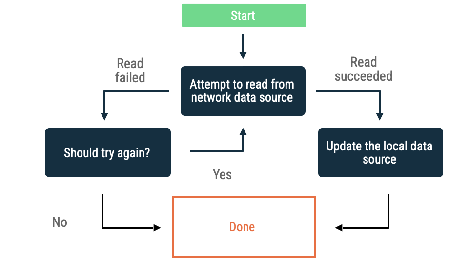
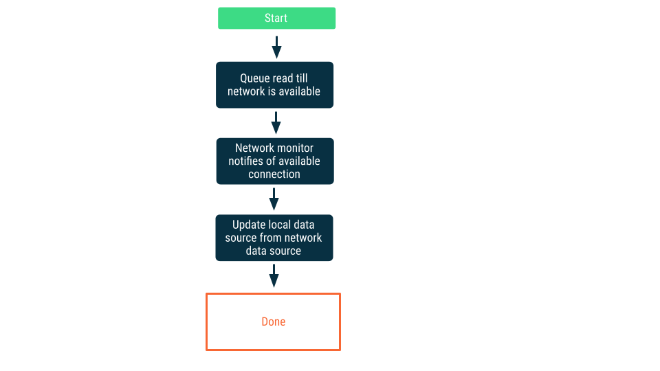
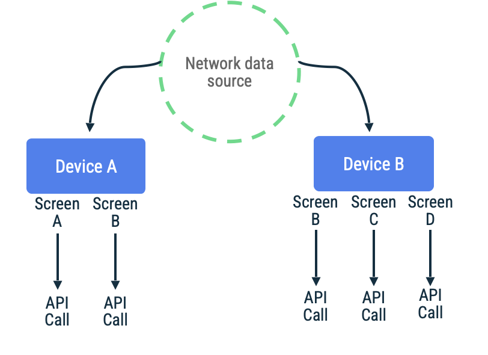

- [オフラインファーストアプリの作成](#オフラインファーストアプリの作成)
  - [オフラインファーストアプリの設計](#オフラインファーストアプリの設計)
  - [オフラインファーストアプリでのモデルデータ](#オフラインファーストアプリでのモデルデータ)
    - [ローカルデータソース](#ローカルデータソース)
    - [ネットワークデータソース](#ネットワークデータソース)
    - [リソースの公開](#リソースの公開)
  - [読み取り](#読み取り)
    - [エラー処理の手段](#エラー処理の手段)
      - [ローカルデータソース](#ローカルデータソース-1)
      - [ネットワークデータソース](#ネットワークデータソース-1)
        - [指数バックオフ](#指数バックオフ)
        - [ネットワーク接続のモニタリング](#ネットワーク接続のモニタリング)
  - [書き込み](#書き込み)
    - [書き込み手段](#書き込み手段)
      - [オンラインのみの書き込み](#オンラインのみの書き込み)
      - [書き込みのキューへの追加](#書き込みのキューへの追加)
      - [遅延書き込み](#遅延書き込み)
  - [同期と競合の解決](#同期と競合の解決)
    - [pull ベースの同期](#pull-ベースの同期)
    - [push ベースの同期](#push-ベースの同期)
    - [ハイブリッド同期](#ハイブリッド同期)
  - [競合解決](#競合解決)
    - [最後の書き込み優先](#最後の書き込み優先)
  - [オフラインファーストアプリの WorkManager](#オフラインファーストアプリの-workmanager)


# オフラインファーストアプリの作成

オフラインファースト アプリとは、インターネットにアクセスしなくても、コア機能の一部または全部を実行できるアプリのことです。つまり、こうしたアプリはビジネス ロジックの一部またはすべてをオフラインで実行できます。

オフラインファースト アプリを作成するにあたり、まずアプリデータとビジネス ロジックへのアクセスを提供するデータレイヤについて検討する必要があります。場合によっては、アプリがこのデータをデバイスの外部にあるソースから随時更新する必要が生じます。その際、最新の状態を維持するために、ネットワーク リソースへの呼び出しが必要になることもあります。

ネットワークの可用性は常に保証されているわけではありません。デバイスの接続が不安定である場合や、ネットワークの接続速度が遅い場合がよくあります。ユーザーは次のような問題に遭遇する可能性があります。

- インターネット帯域幅が制限を受ける。
- エレベーターやトンネルの中にいるときなど、接続が一時的に切断される。
- データアクセスが途切れる（Wi-Fi 専用タブレットなどの場合）。

理由はどうであれ、こうした状況でもアプリが適切に機能することはよくあります。オフラインでもアプリを適切に機能させるには、次のことが可能である必要があります。

- 安定したネットワーク接続がない状態で引き続き使用可能である。
- 最初のネットワーク呼び出しの完了や失敗を待たずに、すぐにローカルデータをユーザーに表示する。
- バッテリーとデータの状態を考慮した方法でデータを取得する。たとえば、最適な状況（充電中や Wi-Fi 接続時など）でのみデータ取得をリクエストする。

上記の条件を満たすアプリは多くの場合、オフラインファースト アプリと呼ばれます。

オフラインファーストアプリに関する動画をチェックしたい場合は [こちら](https://www.youtube.com/watch?v=jaZ2gLMGUsM) から確認してください。


## オフラインファーストアプリの設計

オフラインファースト アプリを設計する際は、データレイヤ、そしてアプリデータに対して実行できる次の 2 つの主要な操作から始める必要があります。

- **読み取り** : アプリの他の部分（ユーザーへの情報の表示など）で使用するデータを取得します。
- **書き込み** : 後で取得できるようにユーザー入力を永続化します。

データレイヤのリポジトリは、データソースを組み合わせてアプリデータを提供する役割を担います。オフラインファースト アプリでは、最も重要なタスクを実行するために、ネットワーク アクセスを必要としないデータソースが少なくとも 1 つ必要です。こうした重要なタスクのひとつは、データの読み取りです。

注: 少なくとも、オフラインファースト アプリは、ネットワークにアクセスせずに読み取りを実行できる必要があります。


## オフラインファーストアプリでのモデルデータ

オフラインファースト アプリには、ネットワーク リソースを利用するリポジトリごとに少なくとも次の 2 つのデータソースがあります。

- ローカルデータソース
- ネットワークデータソース


### ローカルデータソース

ローカルデータソースは、アプリの正規の信頼できるソースです。アプリの上位レイヤによって読み取られるすべてのデータの中で唯一のソースである必要があります。これにより、オンライン時とオフライン時のデータの一貫性が確保されます。多くの場合、ローカルデータソースは、ディスクに永続化されたストレージを基盤としています。データをディスクに永続化するための一般的な方法には、次のようなものがあります。

- 構造化データソース（Room のようなリレーショナル データベースなど）
- 非構造化データソース（Datastore を使用したプロトコル バッファなど）
- シンプルなファイル


### ネットワークデータソース

ネットワークデータソースは、アプリの実際の状態です。ローカルデータソースは、ネットワークデータソースと同期させることをおすすめします。ローカルデータソースがネットワークデータソースより遅延することもあります。その場合は、オンラインに戻ったときにアプリを更新する必要があります。反対に、接続が回復してアプリがデータソースを更新できるようになるまで、ネットワークデータソースがローカルデータソースより遅延することもあります。アプリのドメインレイヤと UI レイヤがネットワークレイヤと直接通信しないようにする必要があります。ネットワークレイヤと通信し、それを使用してローカル データソースを更新する役割は、ホストする repository が担います。


### リソースの公開

アプリがローカル データソースとネットワーク データソースに対して読み取り操作と書き込み操作を実行する方法に関して、両データソースには根本的な違いがあります。SQL クエリを使用する場合など、ローカル データソースのクエリは高速かつ柔軟に行うことができます。反対に、ID によって RESTful リソースに段階的にアクセスする場合など、ネットワーク データソースは低速になり、制約を受けることがあります。その結果、データソースごとに、提供するデータの独自の表現が必要になることがよくあり、ローカル データソースとネットワーク データソースがそれぞれ独自のモデルを持っている場合があります。

以下のディレクトリ構造は、このコンセプトを視覚化したものです。AuthorEntity はアプリのローカル データベースから読み取られた作成者を表し、NetworkAuthor はネットワーク上にシリアル化された作成者を表します。

```
data/
├─ local/
│ ├─ entities/
│ │ ├─ AuthorEntity
│ ├─ dao/
│ ├─ NiADatabase
├─ network/
│ ├─ NiANetwork
│ ├─ models/
│ │ ├─ NetworkAuthor
├─ model/
│ ├─ Author
├─ repository/
```

AuthorEntity と NetworkAuthor の詳細は次のとおりです。

```kotlin
/**
 * Network representation of [Author]
 */
@Serializable
data class NetworkAuthor(
    val id: String,
    val name: String,
    val imageUrl: String,
    val twitter: String,
    val mediumPage: String,
    val bio: String,
)

/**
 * Defines an author for either an [EpisodeEntity] or [NewsResourceEntity].
 * It has a many-to-many relationship with both entities
 */
@Entity(tableName = "authors")
data class AuthorEntity(
    @PrimaryKey
    val id: String,
    val name: String,
    @ColumnInfo(name = "image_url")
    val imageUrl: String,
    @ColumnInfo(defaultValue = "")
    val twitter: String,
    @ColumnInfo(name = "medium_page", defaultValue = "")
    val mediumPage: String,
    @ColumnInfo(defaultValue = "")
    val bio: String,
)
```

AuthorEntity と NetworkAuthor の両方をデータレイヤの内部に保持し、外部レイヤで使用するための第 3 のタイプを公開することをおすすめします。これにより、アプリの動作を根本的に変更しないローカル データソースとネットワーク データソースの軽微な変更から外部レイヤが保護されます。これは、以下のスニペットに示すように行われます。

```kotlin
/**
 * External data layer representation of a "Now in Android" Author
 */
data class Author(
    val id: String,
    val name: String,
    val imageUrl: String,
    val twitter: String,
    val mediumPage: String,
    val bio: String,
)
```

次に、ネットワーク モデルは、それ自体をローカルモデルに変換するための拡張メソッドを定義できます。同様に、ローカルモデルにも、それ自体を外部表現に変換するための拡張メソッドがあります。以下のようになります。

```kotlin
// ネットワークモデルをローカルデータソースで永続化するためのローカルモデルに変換します。
fun NetworkAuthor.asEntity() = AuthorEntity(
    id = id,
    name = name,
    imageUrl = imageUrl,
    twitter = twitter,
    mediumPage = mediumPage,
    bio = bio,
)

// ローカルモデルをデータレイヤーの外部レイヤーで使用するための外部モデルに変換します。
fun AuthorEntity.asExternalModel() = Author(
    id = id,
    name = name,
    imageUrl = imageUrl,
    twitter = twitter,
    mediumPage = mediumPage,
    bio = bio,
)
```

注: 上記のマッパーは多くの場合、異なるモジュールで定義されているモデル間でマッピングされています。結果として、これらのマッパーを使用するモジュールでこれらのマッパーを定義して、モジュールが密結合にならないようにすることが有益となる場合がよくあります。詳しくは、モジュール化のガイドをご覧ください。


## 読み取り

読み取りは、オフラインファースト アプリのアプリデータに対する基本的な操作です。したがって、アプリがデータを読み取ることができること、および新しいデータが利用可能になったらすぐに、アプリがこれらのデータを表示できることが必要とされます。こうした操作が可能なアプリは、リアクティブ アプリです。これらは、オブザーバブルな型で読み取り API を公開するためです。

以下のスニペットでは、OfflineFirstTopicRepository はそのすべての読み取り API に対して Flows を返します。これにより、このクラスは、ネットワーク データソースから最新情報を受け取ったときにそのリーダーを更新できます。つまり、ローカル データソースが無効な場合に OfflineFirstTopicRepository が変更を push できるようにします。したがって、OfflineFirstTopicRepository の各リーダーは、アプリへのネットワーク接続が回復したときに、トリガーされる可能性のあるデータ変更に対処できるよう準備する必要があります。さらに、OfflineFirstTopicRepository はローカルデータソースからデータを直接読み取ります。ローカルデータソースを更新すれば、データの変更がリーダーに通知されるようにします。

```kotlin
class OfflineFirstTopicsRepository(
    private val topicDao: TopicDao,
    private val network: NiaNetworkDataSource,
) : TopicsRepository {

    override fun getTopicsStream(): Flow<List<Topic>> =
        topicDao.getTopicEntitiesStream()
            .map { it.map(TopicEntity::asExternalModel) }
}
```

注: オフラインファースト アプリでリポジトリから読み取るオペレーションは、ローカル データソースから直接読み取る必要があります。更新はすべて、最初にローカル データソースに書き込む必要があります。ローカル データソースは、オブザーバブルになるとそのコンシューマを更新します。


### エラー処理の手段

オフラインファースト アプリでエラーを処理する方法は、発生する可能性のあるデータソースに応じてそれぞれ異なります。以降のサブセクションでは、これらの手段の概要を説明します。


#### ローカルデータソース

ローカル データソースからの読み取り中のエラーはまれです。エラーからリーダーを保護するには、リーダーがデータを収集する Flows に対して catch 演算子を使用します。

ViewModel で catch 演算子を使用する例は、次のとおりです。

```kotlin
class AuthorViewModel(
    authorsRepository: AuthorsRepository,
    ...
) : ViewModel() {
    private val authorId: String = ...

    private val authorStream: Flow<Author> =
        authorsRepository.getAuthorStream(
            id = authorId
        )
        .catch { emit(Author.empty()) }
}
```

注: catch 演算子は例外によるアプリのクラッシュを防ぐだけで、バッキング Flow は終了します。例外の後、フローからの収集を再開するには、 [retry](https://kotlinlang.org/api/kotlinx.coroutines/kotlinx-coroutines-core/kotlinx.coroutines.flow/retry.html) メソッドの使用を検討してください。


#### ネットワークデータソース

ネットワーク データソースからデータを読み取る際にエラーが発生した場合、アプリでヒューリスティック (いつも正解するとは限らないが、おおむね正解するという直感的な思考方法) を使用してデータの取得を再試行する必要があります。一般的なヒューリスティックは、次のとおりです。


##### 指数バックオフ

指数バックオフでは、アプリはネットワーク データソースからの読み取りを試行し続けます。読み取りが成功するか、他の条件によって読み取りを停止する必要があると判断されるまで続行され、各試行が実行される時間間隔は、指数的に増加し続けます。



アプリで引き続きバックオフすべきかどうかを評価する基準には、次のようなものがあります。

- ネットワークデータソースが示したエラーの種類が何か
  - たとえば、接続がないことを示すエラーが返された場合、ネットワーク呼び出しを再試行する必要があります。
  - 反対に、 HTTP リクエストが承認されていない場合は、適切な認証情報が利用できるまでリクエストを再試行してはなりません。
- 最大許容再試行回数に達したかどうか


##### ネットワーク接続のモニタリング

この方法では、アプリがネットワーク データソースに接続できると確認されるまで、読み取りリクエストはキューに追加されます。接続が確立されると、読み取りリクエストはキューから除外され、ネットワークデータを読み取り、ローカルデータソースを更新します。 Android では、この実装方法は、 WorkManager を使用して実現することが可能です。上記の 「キュー」 とは、 WorkManager の Work を格納するキューだと思って大丈夫です。




## 書き込み

オフラインファースト アプリでデータを読み取るには、オブザーバブルな型を使用することが推奨されますが、これらの読み取り方法に対応する書き込み API は、suspend 関数などの非同期 API です。オフラインファースト アプリでの書き込みはネットワーク境界を越えるときに失敗する可能性があるため、非同期 API を使用すると、UI スレッドはブロックされず、エラー処理に役立ちます。

```kotlin
interface UserDataRepository {
    /**
     * Updates the bookmarked status for a news resource
     */
    suspend fun updateNewsResourceBookmark(newsResourceId: String, bookmarked: Boolean)
}
```

上記のスニペットでは、上記のメソッドが一時停止するため、非同期 API としてコルーチンが選択されています。


### 書き込み手段

オフラインファースト アプリにデータを書き込む際に検討すべき手段が 3 つあります。選択する手段は、書き込まれるデータの種類とアプリの要件によって異なります。


#### オンラインのみの書き込み

ネットワーク境界を越えてデータを書き込もうとします。成功した場合は、ローカルデータソースを更新します。それ以外の場合は、例外をスローし、呼び出し元に適切な応答を任せます。


この手段は多くの場合、ほぼリアルタイムでオンラインで実行する必要がある書き込みトランザクションに使用されます（銀行振込など）。

書き込みが失敗する可能性があるため、書き込みが失敗した場合は、それをユーザーに伝えます。

また、ネットワーク接続がなく、最初から失敗することが分かっている場合は、ユーザーがデータを書き込めないようにします。例えば、次のような対応が考えられます。

- データの書き込みにインターネットアクセスを必要とするアプリでは、データの書き込みを許可する UI をユーザーに表示しないようにするか、少なくともその UI を無効にすることができます。
- ユーザーが閉じられないポップアップメッセージまたは一時的なプロンプトを使用して、オフラインであることをユーザーに通知できます。


#### 書き込みのキューへの追加

書き込むオブジェクトがある場合は、それをキューに追加します。アプリがオンラインに戻ったら、指数バックオフを使用してキューのネットワークへ書き込みます。 Android では、多くの場合 WorkManager を使用してこれを実装できます。


この方法の使用例としては、分析イベントやログの送信があります。

この方法が適しているのは、次のような条件を満たす場合です。

- データをネットワークに書き込む必要がない。
- トランザクションに時間的制約がない。
- 操作に失敗した場合、ユーザーに通知する必要がない。


#### 遅延書き込み

ローカル データソースに書き込みを行ってから、その書き込みをキューに追加し、できるだけ早くネットワークに通知します。アプリがオンラインに戻ったとき、ネットワークとローカル データソースの間に競合が生じる可能性があるため、これは簡単な作業ではありません。競合の解決について詳しくは、次のセクションをご覧ください。


この方法は、データがアプリにとって不可欠な場合に適しています。たとえば、オフラインファーストの ToDo リストアプリでは、ユーザーがオフラインで追加したタスクはすべて、ローカルに保存してデータ損失のリスクを回避する必要があります。

注: 競合が発生する可能性があるため、オフラインファーストアプリにデータを書き込む場合は、データを読み取る場合よりも多くの要素の検討が必要になることがよくあります。ユーザーに 「オフラインファーストである」 とみなされたいがためだけに、アプリがオフライン中にデータを書き込めるようにすることは必須ではありません。


## 同期と競合の解決

オフラインファースト アプリが接続を回復するとき、ローカル データソースのデータをネットワーク データソースのデータと一致させる必要があります。このプロセスは同期と呼ばれます。アプリがそのネットワークデータソースと同期するには、主に次の 2 つの方法があります。 **これらは、同期するタイミグの定義であり、 「ネットワークデータとローカルデータのどちらを信頼できる情報源とするか」 の定義ではありません。** この問題の解決方法については、 [競合解決](#競合解決) のセクションを参照してください。

- pull ベースの同期
- push ベースの同期


### pull ベースの同期

pull ベースの同期では、アプリがネットワークにアクセスして、最新のアプリデータをオンデマンドで読み取ります。この方法の一般的なヒューリスティック (いつも正解するとは限らないが、おおむね正解するという直感的な思考方法) は、画面遷移ベースです。つまり、 **アプリはユーザーにデータを表示する直前にのみサーバーからデータを取得します。**

この方法は、アプリがネットワークに接続できない期間が短期間から中程度の期間であると予想される場合に最適です。データの更新は日和見的 (形勢をうかがって、自分の有利なほうにつくこと) であり、接続できない期間が長い場合、ユーザーが古いキャッシュや空のキャッシュを使用して画面を表氏する可能性が高くなるためです。



アプリでページトークン (ページ番号などのページ情報) を使用して、特定の画面の無限スクロールリスト内のアイテムを取得する場合について考えてみましょう。この実装では、ネットワークへの接続を遅延させ、データをローカルデータソースに永続化してから、ローカルデータソースからデータを読み取ってユーザーに情報を表示できます。ネットワーク接続がない場合、リポジトリは、ローカルデータソースのみからデータをリクエストできます。以下は、 Jetpack ページングライブラリとその RemoteMediator API で使用されるパターンです。

```kotlin
class FeedRepository(...) {
    fun feedPagingSource(): PagingSource<FeedItem> { ... }
}

class FeedViewModel(
    private val repository: FeedRepository
) : ViewModel() {
    private val pager = Pager(
        config = PagingConfig(
            pageSize = NETWORK_PAGE_SIZE,
            enablePlaceholders = false
        ),
        remoteMediator = FeedRemoteMediator(...),
        pagingSourceFactory = feedRepository::feedPagingSource
    )

    val feedPagingData = pager.flow
}
```

pull ベースの同期のメリットとデメリットは次の通りです。

**メリット**

- 比較的簡単に実装可能
- 不要なデータは取得されなくなる。

**デメリット**

- データ使用量が多くなる傾向があります。
  - 画面を行き来すると、変更されていない情報を再取得するための不要な操作がトリガーされるためです。
  - この問題は、適切なキャッシュの使用で軽減できます。
    - UI レイヤで cachedIn 演算子を使用する。
    - ネットワーク レイヤで HTTP キャッシュを使用する。
- pull されたモデルではそれ自体で十分である必要があるため、リレーショナルデータでの使用には適していません。同期対象のモデルがそれ自体を取り込むために取得される他のモデルに依存している場合、前述の大量のデータを使用する問題はさらに深刻化します。親モデルのリポジトリとネストされたモデルのリポジトリの間に依存関係が生じる可能性もあります。


### push ベースの同期

push ベースの同期では、ローカルデータソースがネットワークデータソースのレプリカセット (複製品) を可能な限り模倣しようとします。初回起動時に適切な量のデータを事前に取得してベースラインを設定し、その後、サーバー上のデータが変更されると、サーバーがアプリに通知し、それに応じてアプリは変更されたデータを取得します。


サーバーから通知を受信すると、アプリはネットワークに接続し、古くなったとマークされたデータのみを取得します。この処理は Repository に委任されます。委任されると、ネットワークデータソースに接続し、ローカルデータソースに取得されたデータを永続化します。

```kotlin
class UserDataRepository(...) {

    suspend fun synchronize() {
        val userData = networkDataSource.fetchUserData()
        localDataSource.saveUserData(userData)
    }
}
```

この方法では、アプリは、ネットワークデータソースへの依存度が大幅に低下し、ネットワークデータソースがなくても長期間動作できます。この場合、ネットワークデータソースからの最新情報がローカルに存在すると想定されているため、オフライン時には **読み取りと書き込みの両方のアクセスが提供** 可能です。

push ベースの同期のメリットとデメリットは、次の通りです。

**メリット**

- (最新のデータが取得できていれば) アプリはオフラインで使用できます。
- 変更されたデータのみを取得するため、データ使用量を最小限に抑えることができます。
- リレーショナルデータに適しています。各リポジトリは、サポートするモデルのデータの取得のみを行います。

**デメリット**

- 競合を解決するためのデータのバージョニングは容易ではありません。
- 同期中にローカルデータを更新すると不整合が起こる問題を解決する必要があります。
- サーバーに同期のための追加の機能が必要となります。


### ハイブリッド同期

アプリによっては、データに応じて pull または push ベースのハイブリッドな方法が使用されます。たとえば、ソーシャル メディア アプリは、フィードの更新頻度が高いため、pull ベースの同期を使用して、ユーザーのフォロー フィードをオンデマンドで取得する場合があります。同じアプリで push ベースの同期を使用して、ログインしているユーザーに関するデータ（ユーザー名、プロフィール写真など）を処理することもできます。

最終的には、オフラインファーストの同期に関する選択は、プロダクトの要件と利用可能な技術インフラストラクチャに応じて行うことになります。

注: アプリの同期方法は、アプリのニーズと、ローカル データソースとネットワーク データソースをサポートするインフラストラクチャの制約によって決まります。


## 競合解決

アプリがオフラインのときにローカルに書き込んだデータがネットワーク データソース内のデータと一致しない場合は、競合が発生しているということであり、同期の前に解決する必要があります。

競合を解決するには、バージョニングが必要になる場合がよくあります。アプリでは、変更が発生した時間を追跡するために、ブックキーピングを行う必要があります。これにより、メタデータをネットワーク データソースに渡すことができます。ネットワーク データソースには、絶対的な信頼できるソースを提供する責任があります。アプリのニーズに応じて、競合の解決のために検討すべきさまざまな手段があります。モバイルアプリの場合、一般的な方法は「最後の書き込み優先」です。


### 最後の書き込み優先

この方法では、デバイスは、ネットワークに書き込むデータにタイムスタンプ メタデータを追加します。これらのデータを受信すると、ネットワーク データソースは、現在の状態より古いデータをすべて破棄し、より新しいデータを受け入れます。


上記の例では、両方のデバイスがオフラインであり、最初はネットワーク データソースと同期しています。オフライン時は、どちらもデータをローカルに書き込み、データを書き込んだ時刻を追跡します。両方ともオンラインに戻ってネットワーク データソースと同期すると、ネットワークがデバイス B のデータを永続化することで競合を解決します。デバイス B が後からデータを書き込んだためです。


## オフラインファーストアプリの WorkManager

上記の読み取り手段と書き込み手段のどちらにも、次の 2 つの一般的なユーティリティがありました。

- キュー
  - 読み取り: ネットワーク接続が利用可能になるまで読み取りを延期するために使用されます。
  - 書き込み: ネットワーク接続が利用可能になるまで書き込みを延期し、再試行のために書き込みを再度キューに追加するために使用します。
- ネットワーク接続モニター
  - 読み取り: アプリが接続されているときに読み取りキューを抽出するための信号として使用され、同期にも使用されます。
  - 書き込み: アプリが接続されているときに書き込みキューを抽出するための信号として使用され、同期にも使用されます。

WorkManager を使用して同期処理をキューに登録する ( Work を WorkMaanager に登録する) には、 ExistingWorkPolicy.KEEP を使用して同期処理を一意の処理として指定します。

```kotlin
// Initializer はアプリ起動時に初期化する仕組みだった気がする。
class SyncInitializer : Initializer<Sync> {
    override fun create(context: Context): Sync {
        WorkManager.getInstance(context).apply {
            // アプリの起動時に Sync をキューに入れ、常に 1 つの同期ワーカーのみが実行されるようにします
            enqueueUniqueWork(
                SyncWorkName,
                ExistingWorkPolicy.KEEP,
                SyncWorker.startUpSyncWork()
            )
        }
        return Sync
    }
}
```

注: 「Now in Android」の読み取りキューは単純で、enqueueUniqueWork API だけで表すことができます。キューがドレインされる順序をより確実に保証するためには、Room や Datastore のようなデータ永続 API を使用して、より堅牢なキューを実装する必要があります。このキューを順次ドレインするように Worker をセットアップできます。
ここで、SyncWorker.startupSyncWork() は次のように定義されます。

```kotlin
// DelegatingWorker を使用して、 SyncWorker を呼び出す WorkRequest を生成します。
// これにより、カスタム WorkManager 構成を作成しなくても、アプリ モジュールとは異なるモジュールの SyncWorker への依存性注入が可能になります。
fun startUpSyncWork() = OneTimeWorkRequestBuilder<DelegatingWorker>()
    // アプリが可能な場合は、高速作業として Sync を実行します。
    // もしできなければ、通常の work として実行します。
   .setExpedited(OutOfQuotaPolicy.RUN_AS_NON_EXPEDITED_WORK_REQUEST)
   .setConstraints(SyncConstraints)
    // SyncWorker へ委譲します。
   .setInputData(SyncWorker::class.delegatedData())
   .build()

val SyncConstraints
   get() = Constraints.Builder()
       .setRequiredNetworkType(NetworkType.CONNECTED)
       .build()
```

具体的には、SyncConstraints で定義された Constraints では、NetworkType が NetworkType.CONNECTED である必要があります。つまり、ネットワークが使用可能になるまで待機してから実行されます。

ネットワークが使用可能になると、ワーカーは SyncWorkName で指定された一意の作業キューを適切な Repository インスタンスに委任してドレインします。同期が失敗した場合、doWork() メソッドは Result.retry() を返します。WorkManager は、指数バックオフを使用して同期を自動的に再試行します。同期が成功した場合は、Result.success() を返して同期を完了します。

```kotlin
class SyncWorker(...) : CoroutineWorker(appContext, workerParams), Synchronizer {

    override suspend fun doWork(): Result = withContext(ioDispatcher) {
        // First sync the repositories in parallel
        val syncedSuccessfully = awaitAll(
            async { topicRepository.sync() },
            async { authorsRepository.sync() },
            async { newsRepository.sync() },
        ).all { it }

        if (syncedSuccessfully) Result.success()
        else Result.retry()
    }
}
```


