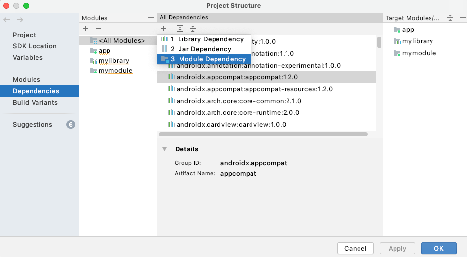
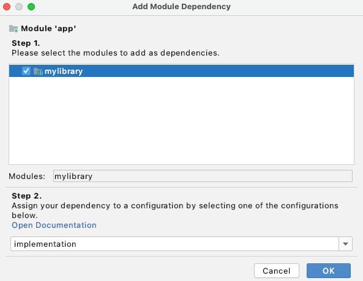
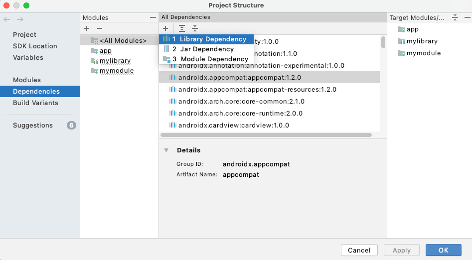
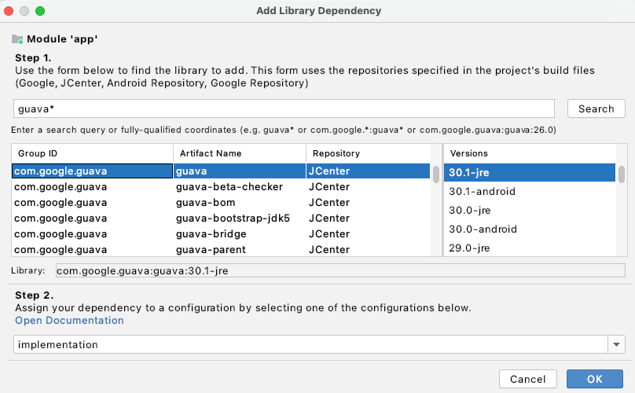
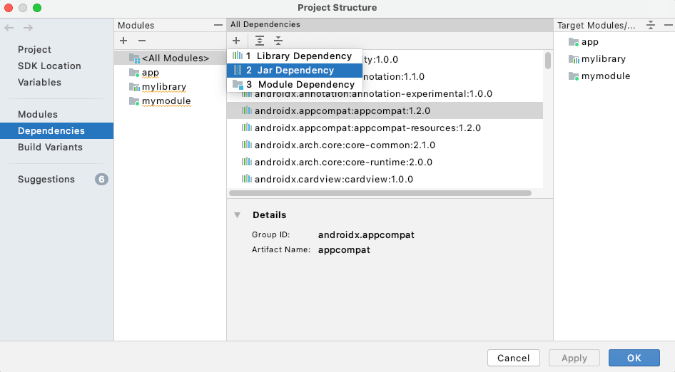
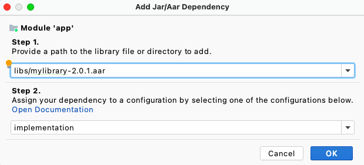

- [Android ライブラリモジュールを作成する](#android-ライブラリモジュールを作成する)
  - [ライブラリモジュールの作成](#ライブラリモジュールの作成)
    - [ライブラリモジュールを新規に作成する](#ライブラリモジュールを新規に作成する)
    - [既存のアプリモジュールをライブラリモジュールに変換する](#既存のアプリモジュールをライブラリモジュールに変換する)
  - [\[Project Structure\] ダイアログで依存関係を追加する](#project-structure-ダイアログで依存関係を追加する)
    - [同じプロジェクト内からライブラリを使用する](#同じプロジェクト内からライブラリを使用する)
    - [他のプロジェクトでライブラリを使用する](#他のプロジェクトでライブラリを使用する)
      - [ライブラリがセントラルリポジトリに公開されている場合](#ライブラリがセントラルリポジトリに公開されている場合)
      - [ライブラリがセントラルリポジトリに公開されていない場合](#ライブラリがセントラルリポジトリに公開されていない場合)
      - [(※ 1 ) libs ディレクトリの場所](#-1--libs-ディレクトリの場所)
        - [具体的には：](#具体的には)
        - [例：構成](#例構成)
      - [fileTree() のオプション](#filetree-のオプション)
        - [その他のディレクトリを指定したい場合](#その他のディレクトリを指定したい場合)
        - [特定のファイルのみを含めたい場合](#特定のファイルのみを含めたい場合)
        - [特定のファイルのみを除外したい場合](#特定のファイルのみを除外したい場合)
        - [サブディレクトリを含めたい場合](#サブディレクトリを含めたい場合)
  - [パブリックリソースを宣言する](#パブリックリソースを宣言する)
  - [ライブラリモジュールの開発に関する考慮事項](#ライブラリモジュールの開発に関する考慮事項)
    - [ライブラリは優先度の順にマージされる。](#ライブラリは優先度の順にマージされる)
    - [ライブラリモジュールごとに独自の R クラスが作成される。](#ライブラリモジュールごとに独自の-r-クラスが作成される)
    - [リソースのマージの競合を避ける。](#リソースのマージの競合を避ける)
    - [マルチモジュールビルドでは、 JAR 依存関係は推移的依存関係として扱われる。](#マルチモジュールビルドでは-jar-依存関係は推移的依存関係として扱われる)
    - [ライブラリモジュールは外部 JAR ライブラリに依存できる。](#ライブラリモジュールは外部-jar-ライブラリに依存できる)
    - [アプリモジュールの minSdkVersion には、ライブラリで定義されているバージョン以上の値を指定する必要がある。](#アプリモジュールの-minsdkversion-にはライブラリで定義されているバージョン以上の値を指定する必要がある)
    - [ライブラリモジュールには独自の ProGuard 構成ファイルを含めることができる。](#ライブラリモジュールには独自の-proguard-構成ファイルを含めることができる)
    - [ライブラリモジュールのテストは、アプリのテストとほぼ同じです。](#ライブラリモジュールのテストはアプリのテストとほぼ同じです)
  - [AAR ファイルの仕組み](#aar-ファイルの仕組み)
  - [引用元資料](#引用元資料)


# Android ライブラリモジュールを作成する

Android ライブラリモジュール (※ 1 ) の構造は、 Android アプリモジュールと同じです。ソースコード、リソースファイル、 Android マニフェストなど、アプリのビルドに必要なものがすべて含まれています。

(※ 1 ) 「モジュール」の意味については、 [モジュールとアーティファクトとライブラリの違い](./モジュールとライブラリ.md/#モジュールとアーティファクトとライブラリの違い) を参照してください。

ただし、Android ライブラリモジュールをコンパイルすると、デバイス上で実行される APK ではなく、Android アプリ モジュールの依存関係として使用できる Android ARchive（AAR）ファイルが作成されます。JAR ファイルと異なり、AAR ファイルは Android アプリに次の機能を提供します。

- AAR ファイルには、 Android のリソースとマニフェストファイルを含めることができるため、 Kotlin 、または、 Java のクラスとメソッドに加え、レイアウトやドローアブルなどの共有リソースをバンドル (一つのパッケージなどにまとめること) できます。
- AAR ファイルには、アプリモジュールの C/C++ コードで使用する C/C++ ライブラリを含めることができます。

ライブラリモジュールは、次のような場合に役立ちます。

- 複数のアプリで同じコンポーネント (アクティビティ、サービス、UI レイアウトなど) を使用する場合
- 複数の APK バリアント（無償版と有償版など）で、コアコンポーネントを共有する場合

どちらの場合も、再利用したいファイルをライブラリモジュールに移動し、アプリモジュールの依存関係としてライブラリモジュールを追加します。

このページでは、Android ライブラリモジュールを作成して使用する方法について説明します。ライブラリを公開する方法については、 [ライブラリを公開する](https://developer.android.com/build/publish-library?hl=ja&_gl=1*1g5j3wg*_up*MQ..*_ga*MTE1ODIzNDI5Ny4xNzIxNzE2Njk2*_ga_6HH9YJMN9M*MTcyMTc4ODI5Mi4yLjAuMTcyMTc4ODI5Mi4wLjAuMA..) をご覧ください。


## ライブラリモジュールの作成

### ライブラリモジュールを新規に作成する

プロジェクトで新しいライブラリモジュールを作成するには、次の手順を行います。

1. **[File] > [New] > [New Module]** をクリックします。
2. 表示された **[Create New Module]** ダイアログで、 **[Android Library]** 、 **[Next]** の順にクリックします。
   - 従来の JAR ファイルをビルドする Kotlin 、または、 Java ライブラリを作成するオプションもありますが、このガイドでは、Android ライブラリ ( AAR ) の作成に焦点を絞って説明します。
3. ライブラリの名前を指定し、ライブラリの最小 SDK バージョンを選択して、 **[Finish]** をクリックします。

**重要** : モジュールのパッケージ名は、グローバルに一意である必要があります。同じプロジェクトで、同じパッケージ名のモジュールを 2 つ使用することはできません。

Gradle プロジェクトの同期が完了すると、 **[Project]** ペインにライブラリモジュールが表示されます。新しいモジュールフォルダが表示されない場合は、ペインに **[Android]** ビューが表示されていることを確認してください。


### 既存のアプリモジュールをライブラリモジュールに変換する

既存のアプリモジュールの中に、再利用したいコードが含まれている場合は、次の手順でアプリモジュールをライブラリモジュールに変換できます。この方法では、モジュール全体をまるごとライブラリモジュールに変換します。アプリモジュール内の特定のコードのみをライブラリモジュールに移行したい場合には、別途、ライブラリモジュールを作成する必要があります。

1. Groovy を使用している場合は、モジュールレベルの build.gradle ファイルを開きます。 Kotlin スクリプトを使用している場合は、 build.gradle.kts ファイルを開きます。
2. applicationId の行を削除します。これを定義できるのは Android アプリモジュールだけです。
3. ファイルの先頭で、次のような plugins ブロックを探します。

```kotlin
plugins {
    id("com.android.application")
}
```

このブロックを次のように変更します。

```kotlin
plugins {
    id("com.android.library")
}
```

4. ファイルを保存し、 **[File] > [Sync Project with Gradle Files]** をクリックします。

モジュールの構造は同じままですが、モジュールが Android ライブラリとして機能するようになりました。 **ビルドすると、 APK ではなく AAR ファイルが作成されます。**

AAR ファイルをビルドする場合は、 **[Project]** ウィンドウで、ライブラリモジュールを選択し、 **[Build] > [Build APK]** をクリックします。 (ただし、アプリモジュールの build.gradle に、ライブラリモジュールへの依存関係を追加しないと APK を作成しても AAR は生成されないと思われます。)


## [Project Structure] ダイアログで依存関係を追加する

**[Project Structure]** ダイアログを使用して、プロジェクトにライブラリへの依存関係を追加できます (ライブラリを配置しただけでは、プロジェクトに取り込めていません) 。以降のセクションでは、このダイアログを使用して、ライブラリへの依存関係を追加する方法について説明します。


### 同じプロジェクト内からライブラリを使用する

このセクションでは、ライブラリを作成したプロジェクトと同じプロジェクト内で、そのライブラリを取り込む方法について説明します。ライブラリの作成と利用が同じプロジェクト内で完結するということは、すなわち、そのプロジェクト上で、ライブラリのソースコードが編集可能な状態であることを意味します。このセクションでは、その編集可能な状態のライブラリ (これをモジュールと呼ぶ) を取り込む方法について説明します。

同じプロジェクト内で作成したライブラリモジュールを使用するには、プロジェクトレベルの依存関係を追加します。この場合、事前にライブラリモジュールをコンパイルして AAR ファイルを作成することはしません。この方法では、 AAR ファイルになる前のコードそのものに対する依存関係を構築します。

1. **[File] > [Project Structure] > [Dependencies]** に移動します。
2. ライブラリを追加するモジュールを選択します。
   - Modules タブ内から選択します。
3. **[Declared Dependencies]** タブで `+` をクリックし、メニューから `[Module Dependency]` を選択します。
   - この時、 `[Library Dependency]` を選択すると、オンラインリポジトリからライブラリを検索して取り込みます。
   - そのため、ローカルモジュールを取り込むには、 Library Dependency ではなく、 Module Dependency を選択してください。



4. **[Add Module Dependency]** ダイアログで、ライブラリモジュールを選択します。



5. この依存関係を必要とする構成を選択します。すべてのビルドフレーバーに適用する場合は、 **[implementation]** を選択して **[OK]** をクリックします。

個別のビルドフレーバーにのみ依存関係を適用したい場合は、 `testImplementation` など、適用したいフレーバーを選択してください。

Android Studio は、モジュールの build.gradle 、または、 build.gradle.kts ファイルを編集して、次の形式で依存関係を追加します。

```kotlin
implementation(project(":example-library"))
```


### 他のプロジェクトでライブラリを使用する

他のプロジェクトでライブラリを使用する場合、通常、ソースコードはコンパイル済みで、他のプロジェクト上で変更されないことが望まれます。そのため、ライブラリは、コンパイルして生成される JAR ファイルや AAR ファイルの形式で、他のプロジェクトに渡されます。

JAR 、もしくは、 AAR を共有するには、 Maven Central などのサービスでホストされている Maven リポジトリか、ローカルディスク上のディレクトリ構造を使用することをおすすめします。 


#### ライブラリがセントラルリポジトリに公開されている場合

Android ライブラリが Maven リポジトリに公開されると、ライブラリの推移的依存関係にあるライブラリが重複する場合は、自動的に重複を排除してくれます。

注: ライブラリを Maven リポジトリに公開できない場合は、 [ライブラリがセントラルリポジトリに公開されていない場合](#ライブラリがセントラルリポジトリに公開されていない場合) に記載されている手順を使用して、 JAR ファイル、または、 AAR ファイルを直接配置して利用できます。この場合は、その AAR のすべての推移的依存関係を手動で管理する必要があります。

異なるプロジェクトの別のアプリモジュールで Android ライブラリのコードを使用するには、次の手順を行います。

1. **[File] > [Project Structure] > [Dependencies]** に移動します。
2. ライブラリを追加するモジュールを選択します。
   - Modules タブ内から選択します。
3. **[Provided Dependencies]** タブで `+` をクリックし、メニューで **[Library Dependency]** を選択します。



4. **[Add Library Dependency]** ダイアログで検索ボックスを使用して、追加するライブラリを探します。このフォームは、 settings.gradle または settings.gradle.kts ファイルの `dependencyResolutionManagement { repositories {...}}` ブロック内で指定されているリポジトリを検索します。



5. この依存関係を必要とする構成を選択します。すべての構成に適用する場合は、[implementation] を選択して [OK] をクリックします。

アプリの build.gradle または build.gradle.kts ファイルをチェックして、次のような宣言 (選択したビルド構成によって異なります) が表示されていることを確認します。

```kotlin
  implementation("com.example:examplelibrary:1.0.0")
```


#### ライブラリがセントラルリポジトリに公開されていない場合

ライブラリがセントラルリポジトリに公開されていない場合は、 AAR ファイル、または、 JAR ファイルを、プロジェクト内に直接配置して、ライブラリを取り込みます。

他のプロジェクトで作成されたコードは、 AAR や JAR にパッケージングしないと取り込めないため、そのような場合にこの方法を使用します。

または、 Maven リポジトリなど、ネットワーク上のリポジトリに公開されている場合は、そこから取り込むことができますが、公開されていないようなコードは、 AAR や JAR として取り込みます。

1. **[File] > [Project Structure] > [Dependencies]** に移動します。
2. Modules タブ内から、ライブラリを追加したいモジュールを選択します。
3. **[Provided Dependencies]** タブで `+` をクリックし、メニューで **[Jar Dependency]** を選択します。 (※ 1 )

(※ 1 )  
現在は、 **[Jar Dependency]** ではなく、 **[JAR/AAR Dependency]** となっています。



4. **[Add Jar/Aar Dependency]** ダイアログで、 AAR または JAR ファイルへのパスを入力し (通常は libs フォルダに配置っぽい) 、依存関係を適用する構成を選択します。すべての構成でライブラリを使用可能にする場合は、 implementation 構成を選択します。



アプリの build.gradle または build.gradle.kts ファイルをチェックして、次のような宣言（選択したビルド構成によって異なります）が表示されていることを確認します。

```kotlin
implementation(files("my_path/my_lib.aar"))
```

Android Studio の外部で実行される Gradle ビルドの依存関係をインポートするには、アプリの build.gradle 、または、 build.gradle.kts ファイルに依存関係へのパスを追加します。次に例を示します。

```kotlin
dependencies {
    implementation(fileTree(mapOf("dir" to "libs", "include" to listOf("*.jar", "*.aar"))))
}
```

上記の記述は、 libs ディレクトリに存在する、全ての .jar ファイルと .aar ファイルをプロジェクトの依存関係として追加することを意味します。

- fileTree() メソッド
  - 複数のファイル (モジュール) を取り込むためのメソッドです。
  - `"dir" to "libs"`
    - libs フォルダ (※ 1 ) を対象とする。
  - `"include"`
    - 対象とするファイルの拡張子。ここでは .jar と .aar を含める。


#### (※ 1 ) libs ディレクトリの場所

fileTree(mapOf("dir" to "libs")) の "libs" は、その build.gradle.kts ファイルがあるモジュールのディレクトリを基準に見た相対パスの libs ディレクトリを意味します。

##### 具体的には：

- `app/build.gradle.kts` に書かれている場合
  - `app/libs` ディレクトリを指します。
- `library/build.gradle.kts` に書かれている場合
  - `library/libs` ディレクトリを指します。


##### 例：構成

```bash
MyProject/
├── build.gradle.kts             ← プロジェクト全体のビルドスクリプト（ここには通常書かない）
├── settings.gradle.kts
├── app/
│   ├── build.gradle.kts         ← ここに書かれていれば、対象は「app/libs」
│   └── libs/
│       ├── mylib.jar
│       └── mylib.aar
```

この場合：

```kotlin
// app/build.gradle.kts
dependencies {
    implementation(fileTree(mapOf("dir" to "libs")))
}
```

は app/libs/ 配下の .jar / .aar ファイルを依存に追加します。


#### fileTree() のオプション

##### その他のディレクトリを指定したい場合

絶対パスにしたい場合や他のモジュールの libs を参照したい場合は、次のように rootDir を使うこともできます：

```kotlin
fileTree(mapOf("dir" to "${rootDir}/someModule/libs"))
```

必要に応じて、rootDir や projectDir を使って基準ディレクトリを明示的に指定できます。


##### 特定のファイルのみを含めたい場合

include は、「このパターンにマッチするファイルだけを対象にする」オプションです。

```kotlin
fileTree(mapOf(
    "dir" to "libs",
    "include" to listOf("*.jar")
))
```

この例では、 libs フォルダ内の .jar ファイルのみが対象になります。 .aar は無視されます。


##### 特定のファイルのみを除外したい場合

exclude は、「このパターンにマッチするファイルを除外する」オプションです。

```kotlin
fileTree(mapOf(
    "dir" to "libs",
    "include" to listOf("*.jar", "*.aar"),
    "exclude" to listOf("*-debug.aar")
))
```

この例では：

- .jar と .aar を対象にしつつ、
- *-debug.aar のようなファイル名のものは除外します。


##### サブディレクトリを含めたい場合

`**/*.jar` のように指定することで、サブディレクトリ内も含めて、全ての .jar ファイルが対象になります。

`**/*.jar` は、対象ディレクトリ（例：libs）、および、その中のすべてのサブディレクトリ以下にある .jar ファイルをすべて含めます。

📁 例：ディレクトリ構成

```css
libs/
├── a.jar                      ← 対象になる
├── sub/
│   └── b.jar                  ← 対象になる
└── sub/deeper/
    └── c.jar                  ← 対象になる
```

```kotlin
fileTree(mapOf(
    "dir" to "libs",
    "include" to listOf("**/*.jar")
))
```

この設定では、 a.jar, b.jar, c.jar のすべてが対象になります。


## パブリックリソースを宣言する

リソースには、プロジェクトの res/ ディレクトリにあるすべてのファイル（画像など）が含まれます。 **ライブラリ内のリソースは、デフォルトではすべてパブリックです。** すべてのリソースをデフォルトでプライベートにする方法は 2 つあります。

- 少なくとも 1 つの属性をパブリックとして定義する。
- 空のパブリック属性を 1 つ定義する。

パブリックリソースを宣言するには、ライブラリの res/values/public.xml に `<public>` 宣言を一つ以上追加します。

次のサンプルコードでは、 mylib_app_name と mylib_public_string という名前の 2 つの公開文字列リソースを作成します。

```xml
<resources>
    <public name="mylib_app_name" type="string"/>
    <public name="mylib_public_string" type="string"/>
</resources>
```

空のパブリックリソースを定義する場合は、以下のようにします。

```xml
<resources>
    <public />
</resources>
```

プライベートリソースをライブラリの外部から参照することはできません。もし、参照しようとすると lint ツールによって警告が表示されます。

ライブラリのビルド時、 Gradle はパブリックリソース定義を取得して public.txt ファイルに抽出します。その後、 AAR ファイル内にパッケージ化されます。


## ライブラリモジュールの開発に関する考慮事項

ライブラリモジュールとそれに依存するアプリを開発するときは、次の動作と制限に注意してください。

### ライブラリは優先度の順にマージされる。

ライブラリモジュールへの参照を Android アプリモジュールに追加すると、各参照の相対的な優先度を設定できます。ビルド時に、ライブラリは **優先度の低いものから順に 1 つずつアプリにマージされます。**


### ライブラリモジュールごとに独自の R クラスが作成される。

依存元のアプリモジュールをビルドすると、ライブラリモジュールは AAR ファイルにコンパイルされた後、アプリモジュールに追加されます。そのため、ライブラリごとに独自の R クラスが生成され、ライブラリのパッケージ名に基づいた名前が付けられます。

メインモジュールとライブラリモジュールから生成される R クラスは、メインモジュールのパッケージとライブラリのパッケージを含むすべての必要なパッケージ内に作成されます。

例えば、普段、 message という String リソースにアクセスする場合は、以下のように実装します。

```
R.string.message
```

実は、これは、パッケージ名を省略した形でアクセスしていました。自分自身のモジュールのリソースにアクセスする場合は、パッケージ名を省略できるためです。パッケージ名は接頭辞として使用されます。

構文

```
[<package_name>.]R.<resource_type>.<resource_name>
```

記述例

```
com.example.mylibrary.R.string.message
```

パッケージ名は長いため、記述が面倒であったり、コードが複雑に見える原因になります。パッケージ名のエイリアスを設定することで、それを軽減することが可能です。ただし、この機能が使用できるのは Kotlin のみとなります。

```kotlin
// エイリアスを使用しなかった場合
val bg = com.github.maxfie1d.common.resources.R.drawable.background

// エイリアスを使用した場合
import com.github.maxfie1d.common.resources.R as CommonR
val bg = CommonR.drawable.background
```


### リソースのマージの競合を避ける。

ライブラリモジュールとアプリモジュールのリソース ID が競合する場合は、 **アプリモジュールのリソースが優先されます。**

複数のライブラリモジュール ( AAR ) 間でリソース ID が競合する場合は、 **dependencies ブロックの先頭に近い方にあるライブラリモジュールのリソースが優先されます。**

リソースの競合を避けるには、[非推移的な R クラス](https://developer.android.com/build/optimize-your-build?hl=ja&_gl=1*rxqx8n*_up*MQ..*_ga*MTE1ODIzNDI5Ny4xNzIxNzE2Njk2*_ga_6HH9YJMN9M*MTcyMTc4ODI5Mi4yLjAuMTcyMTc4ODI5Mi4wLjAuMA..#use-non-transitive-r-classes) (※ 1 ) を使用します。それができない場合は、モジュールに固有の (つまり、すべてのプロジェクトモジュール間で一意の) 接頭辞、または、それ以外の一貫性のある命名方式の使用を検討してください。

(※ 1 )  
非推移的な R クラスは、 Android Gradle プラグイン 8.0.0 以降では、デフォルトで ON になっています。非推移的な R クラスとは、 R クラスがモジュール単位で R クラスが生成される仕組みです。それまでは、全てのモジュールのリソースがマージされた R クラスが一つだけ生成されていました。


### マルチモジュールビルドでは、 JAR 依存関係は推移的依存関係として扱われる。

以下の依存関係になっているプロジェクトでは、 JAR は AAR モジュールの依存関係として存在しています。

```
アプリモジュール
└── ライブラリモジュール ( AAR )
    └── Kotlin / Java モジュール ( JAR )
```

これは、 Gradle によって、以下のような依存関係になります。

```
アプリモジュール
├── ライブラリモジュール ( AAR )
└── Kotlin / Java モジュール ( JAR )
```

つまり、 JAR がアプリモジュールの依存関係として定義されます。これにより、ビルドが高速化されます。


### ライブラリモジュールは外部 JAR ライブラリに依存できる。

ライブラリモジュールで、外部 JAR を使うことが可能です。その場合、当然ですが、そのライブラリモジュールを使うアプリや他のモジュールも、その外部 JAR ライブラリを含んでビルドしなければいけません。

さらに、ライブラリモジュールと、それを利用するアプリモジュールの両方が、マニフェストファイル内で `<uses-library>` 要素を使って、外部ライブラリを宣言する必要があります。例えば、以下のように記述します。

```xml
<uses-library android:name="external.lib.name" android:required="true" />
```


### アプリモジュールの minSdkVersion には、ライブラリで定義されているバージョン以上の値を指定する必要がある。

ライブラリは、それに依存するアプリモジュールの一部としてコンパイルされるため、ライブラリモジュールで使用される API は、アプリモジュールがサポートするプラットフォームバージョンと互換性がなければなりません。

`アプリモジュールの minSdkVersion > ライブラリモジュールの minSdkVersion` である必要があります。


### ライブラリモジュールには独自の ProGuard 構成ファイルを含めることができる。

AAR をビルドして公開するために使用するライブラリプロジェクトの場合は、ライブラリのビルド構成に ProGuard 構成ファイルを追加できます。追加すると、指定した ProGuard ルールが Android Gradle プラグインによって適用されます。このファイルは、ビルドツールにより、ライブラリモジュールごとに生成される AAR ファイルに埋め込まれます。ライブラリをアプリモジュールに追加すると、 **ライブラリの ProGuard ファイルがアプリモジュールの ProGuard 構成ファイル ( proguard.txt ) の末尾に追加されます。**

ライブラリモジュールに ProGuard ファイルを埋め込むと、ライブラリに依存するアプリモジュールで、ライブラリを使用するために ProGuard ファイルを手動で更新する必要がなくなります。 Android Studio のビルドシステムでアプリをビルドする際には、アプリモジュールとライブラリの両方のディレクティブ (ビルド時にコンパイラに伝える必要がある情報) が使用されます。したがって、 **ライブラリで別途コード圧縮ツールを実行する必要はありません。**

ProGuard ルールをライブラリプロジェクトに追加するには、ライブラリの build.gradle 、または、 build.gradle.kts ファイルの defaultConfig ブロック内にある consumerProguardFiles プロパティでファイルの名前を指定します。

たとえば、次のスニペットでは、 lib-proguard-rules.txt をライブラリの ProGuard 構成ファイルとして設定しています。

```kotlin
android {
    defaultConfig {
        consumerProguardFiles("lib-proguard-rules.txt")
    }
    ...
}
```

ただし、 APK にコンパイルされ AAR を生成しないライブラリモジュールを含む場合は、ライブラリを使用するアプリモジュールでのみコード圧縮を実行してください。 ProGuard ルールとその使用方法について詳しくは、 [アプリの圧縮、難読化、最適化](https://developer.android.com/build/shrink-code?hl=ja&_gl=1*134ajb6*_up*MQ..*_ga*MTE1ODIzNDI5Ny4xNzIxNzE2Njk2*_ga_6HH9YJMN9M*MTcyMTc4ODI5Mi4yLjAuMTcyMTc4ODI5Mi4wLjAuMA..) をご覧ください。


### ライブラリモジュールのテストは、アプリのテストとほぼ同じです。

主な違いは、ライブラリとその依存関係がテスト APK の依存関係として自動的に含まれることです。つまり、テスト APK には独自のコードだけでなく、ライブラリの AAR とそのすべての依存関係も含まれます。テスト対象のアプリが単独で存在することはないため、 androidTest タスクはテスト APK のみをインストール（およびアンインストール）します。

複数のマニフェストファイルをマージする場合、 Gradle はデフォルトの優先順位に従って、ライブラリのマニフェストをテスト APK のメインマニフェストに統合します。


## AAR ファイルの仕組み

AAR ファイルのファイル拡張子は .aar で、Maven アーティファクト タイプも aar です。ファイル自体は ZIP ファイルです。必須エントリは /AndroidManifest.xml だけです。

また、AAR ファイルには、次の省略可能なエントリを 1 つ以上含めることができます。

- /classes.jar
- /res/
- /R.txt
- /public.txt
- /assets/
- /libs/name.jar
- /jni/abi_name/name.so（abi_name は [Android がサポートする ABI](https://developer.android.com/ndk/guides/abis?hl=ja&_gl=1*zlrk14*_up*MQ..*_ga*MTE1ODIzNDI5Ny4xNzIxNzE2Njk2*_ga_6HH9YJMN9M*MTcyMTc4ODI5Mi4yLjAuMTcyMTc4ODI5Mi4wLjAuMA..#sa) のいずれか）
- /proguard.txt
- /lint.jar
- /api.jar
- /prefab/（ネイティブ ライブラリのエクスポート用）


## 引用元資料

[Android ライブラリを作成する - Android Developers](https://developer.android.com/studio/projects/android-library?hl=ja&_gl=1*1cdlnpu*_up*MQ..*_ga*MTE1ODIzNDI5Ny4xNzIxNzE2Njk2*_ga_6HH9YJMN9M*MTcyMTcxNjY5NS4xLjAuMTcyMTcxNjY5NS4wLjAuMA..)

