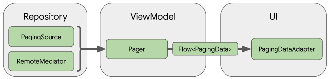

- [ページングについて](#ページングについて)


# ページングについて

ページング ライブラリを使用すれば、大規模なデータセットからデータのページをローカル ストレージやネットワーク経由で読み込んで表示できます。このアプローチにより、アプリはネットワーク帯域幅とシステム リソースの両方をより効率的に使用できます。ページング ライブラリのコンポーネントは、推奨の Android アプリ アーキテクチャに適合し、他の Jetpack コンポーネントと正常に統合され、充実した Kotlin サポートを提供するように設計されています。


## ページング ライブラリを使用する利点

ページング ライブラリには以下の機能があります。

- ページング データに対するメモリ内キャッシュ。アプリがページング データを操作しながら、システム リソースを効率的に使用できるようにします。
- 組み込みのリクエスト重複除去。アプリでネットワーク帯域幅とシステム リソースを効率的に使用できるようにします。
- 読み込まれたデータの一番下までスクロールすると、データが自動的にリクエストされる構成可能な RecyclerView アダプター。
- Kotlin のコルーチンとフロー、LiveData、RxJava に関するサポート。
- 更新機能や再試行機能など、エラー処理の組み込みサポート。


## セットアップ

Paging コンポーネントを Android アプリにインポートするには、次の依存関係をアプリの build.gradle ファイルに追加します。

```kotlin
dependencies {
    val paging_version = "3.3.0"

    implementation("androidx. paging:paging-runtime:$paging_version")

    // alternatively - without Android dependencies for tests
    testImplementation("androidx. paging:paging-common:$paging_version")

    // optional - RxJava2 support
    implementation("androidx. paging:paging-rxjava2:$paging_version")

    // optional - RxJava3 support
    implementation("androidx. paging:paging-rxjava3:$paging_version")

    // optional - Guava ListenableFuture support
    implementation("androidx.paging:paging-guava:$paging_version")

    // optional - Jetpack Compose integration
    implementation("androidx.paging:paging-compose:3.3.0")
}
```


## ライブラリのアーキテクチャ

ページング ライブラリ コンポーネントは、アプリの 3 つのレイヤで動作します。

- リポジトリレイヤ
- ViewModel レイヤ
- UI レイヤ



このセクションでは、各レイヤで動作するページング ライブラリ コンポーネントについて、およびそれらがどのように連携してページング データの読み込みと表示を行うかについて説明します。


### リポジトリ レイヤ

リポジトリレイヤのメインのページングライブラリコンポーネントは [PagingSource](https://developer.android.com/reference/kotlin/androidx/paging/PagingSource?_gl=1*ynur7v*_up*MQ..*_ga*MTU4OTA5NDE4My4xNzIxNDQzMzAy*_ga_6HH9YJMN9M*MTcyMTY5OTk5OS4yLjAuMTcyMTY5OTk5OS4wLjAuMA..) です。各 PagingSource オブジェクトは、データのソースと、そのソースからデータを取得する方法を定義します。 PagingSource オブジェクトを使用すると、ネットワークソースやローカルデータベースなど、任意の単一ソースからデータを読み込めます。

他に使用可能なページングライブラリコンポーネントには、 [RemoteMediator](https://developer.android.com/reference/kotlin/androidx/paging/RemoteMediator?_gl=1*ynur7v*_up*MQ..*_ga*MTU4OTA5NDE4My4xNzIxNDQzMzAy*_ga_6HH9YJMN9M*MTcyMTY5OTk5OS4yLjAuMTcyMTY5OTk5OS4wLjAuMA..) があります。 RemoteMediator オブジェクトは、ローカル データベース キャッシュを使用するネットワーク データソースなど、階層化されたデータソースからのページングを処理します。


### ViewModel レイヤ

[Pager](https://developer.android.com/reference/kotlin/androidx/paging/Pager?_gl=1*igokyk*_up*MQ..*_ga*MTU4OTA5NDE4My4xNzIxNDQzMzAy*_ga_6HH9YJMN9M*MTcyMTY5OTk5OS4yLjAuMTcyMTY5OTk5OS4wLjAuMA..) コンポーネントは、 PagingSource オブジェクトと [PagingConfig](https://developer.android.com/reference/kotlin/androidx/paging/PagingConfig?_gl=1*pi037l*_up*MQ..*_ga*MTU4OTA5NDE4My4xNzIxNDQzMzAy*_ga_6HH9YJMN9M*MTcyMTY5OTk5OS4yLjAuMTcyMTY5OTk5OS4wLjAuMA..) 構成オブジェクトに基づき、リアクティブストリームで公開される PagingData のインスタンスを構築するための公開 API を提供します。

ViewModel レイヤを UI に接続するコンポーネントは、 [PagingData](https://developer.android.com/reference/kotlin/androidx/paging/PagingData?_gl=1*pi037l*_up*MQ..*_ga*MTU4OTA5NDE4My4xNzIxNDQzMzAy*_ga_6HH9YJMN9M*MTcyMTY5OTk5OS4yLjAuMTcyMTY5OTk5OS4wLjAuMA..) です。 PagingData オブジェクトは、ページ分けされたデータのスナップショットを格納するコンテナです。 [PagingSource](https://developer.android.com/reference/kotlin/androidx/paging/PagingSource?_gl=1*pi037l*_up*MQ..*_ga*MTU4OTA5NDE4My4xNzIxNDQzMzAy*_ga_6HH9YJMN9M*MTcyMTY5OTk5OS4yLjAuMTcyMTY5OTk5OS4wLjAuMA..) オブジェクトに対してクエリを実行し、結果を保存します。


### UI レイヤ

UI レイヤのメインのページングライブラリコンポーネントは [PagingDataAdapter](https://developer.android.com/reference/kotlin/androidx/paging/PagingDataAdapter?_gl=1*t7apkr*_up*MQ..*_ga*MTU4OTA5NDE4My4xNzIxNDQzMzAy*_ga_6HH9YJMN9M*MTcyMTY5OTk5OS4yLjAuMTcyMTY5OTk5OS4wLjAuMA..) です。これは、ページ分けされたデータを処理する RecyclerView アダプターです。

付属の [AsyncPagingDataDiffer](https://developer.android.com/reference/kotlin/androidx/paging/AsyncPagingDataDiffer?_gl=1*r5tb8w*_up*MQ..*_ga*MTU4OTA5NDE4My4xNzIxNDQzMzAy*_ga_6HH9YJMN9M*MTcyMTY5OTk5OS4yLjAuMTcyMTY5OTk5OS4wLjAuMA..) コンポーネントを使用して、独自のカスタムアダプターを作成することもできます。

注: アプリが UI に Compose を使用している場合、代わりに androidx.paging:paging-compose アーティファクトを使用して Paging を UI レイヤに統合できます。詳細については、 [collectAsLazyPagingItems()](https://developer.android.com/reference/kotlin/androidx/paging/compose/package-summary?_gl=1*r5tb8w*_up*MQ..*_ga*MTU4OTA5NDE4My4xNzIxNDQzMzAy*_ga_6HH9YJMN9M*MTcyMTY5OTk5OS4yLjAuMTcyMTY5OTk5OS4wLjAuMA..#collectaslazypagingitems) の API ドキュメントをご覧ください。


