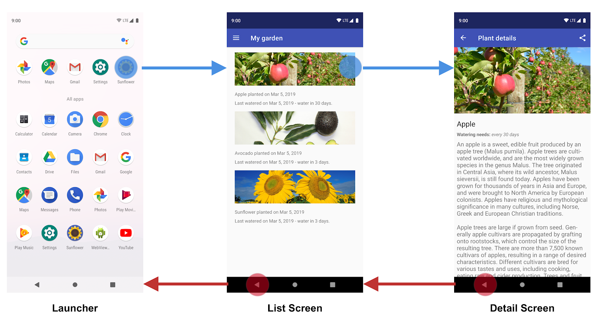

- [ナビゲーションの原則](#ナビゲーションの原則)
  - [固定的な開始デスティネーションを設定する](#固定的な開始デスティネーションを設定する)
  - [ナビゲーション状態はデスティネーションのスタックとして表現される](#ナビゲーション状態はデスティネーションのスタックとして表現される)
  - [\[上へ\] と \[戻る\] はアプリのタスク内では同じ機能を持つ](#上へ-と-戻る-はアプリのタスク内では同じ機能を持つ)
  - [\[上へ\] と \[戻る\] の違い](#上へ-と-戻る-の違い)
    - [1. \[上へ\] ボタンはアプリを終了しない](#1-上へ-ボタンはアプリを終了しない)
    - [2. \[上へ\] ボタンは起動元のアプリには戻らない](#2-上へ-ボタンは起動元のアプリには戻らない)
  - [ディープリンクの場合は、手動ナビゲーションをシミュレーションする](#ディープリンクの場合は手動ナビゲーションをシミュレーションする)

# ナビゲーションの原則

異なる画面やアプリ間のナビゲーションは、ユーザー エクスペリエンスの中核となる要素です。以下の原則は、さまざまなアプリを横断して一貫した直感的ユーザー エクスペリエンスを実現するためのベースラインを示すものです。 [Navigation コンポーネント](https://developer.android.com/topic/libraries/architecture/navigation?hl=ja&_gl=1*7oiblz*_up*MQ..*_ga*MTU0NjM2NDc1Mi4xNzMzNzkyNDc4*_ga_6HH9YJMN9M*MTczMzc5NzA4NS4zLjAuMTczMzc5NzA4NS4wLjAuNTE0MjIyMDQy) は、以下の原則をデフォルトで実装するように設計されており、これにより、ユーザーはアプリ間を移動する際に、同じヒューリスティックとパターンを適用してナビゲーションを行うことができます。

注: プロジェクトで Navigation コンポーネントを使用していない場合でも、アプリは以下の設計原則に従う必要があります。

## 固定的な開始デスティネーションを設定する

アプリを作成する際は必ず、固定的な開始デスティネーションを設定します。開始デスティネーションは、ユーザーがランチャーからアプリを起動したときに最初に表示される画面です。このデスティネーションは、ユーザーが [戻る] ボタンを押してランチャーに戻るときに表示される最後の画面でもあります。 [Sunflower アプリ](https://github.com/android/sunflower/tree/main/app) を例に見てみましょう。

ランチャーから Sunflower アプリを起動すると、ユーザーに表示される最初の画面はリスト画面です。この画面には、ユーザーの庭の植物のリストが表示されます。この画面は、アプリを終了する前に表示される最後の画面でもあります。ユーザーは、リスト画面で [戻る] ボタンを押すと、ランチャーに戻ります。

注: アプリによっては、1 回限りのセットアップ画面やログイン画面が用意されている場合があります。このような [条件付き画面](https://developer.android.com/topic/libraries/architecture/navigation/navigation-conditional?hl=ja&_gl=1*1fql2tu*_up*MQ..*_ga*MTU0NjM2NDc1Mi4xNzMzNzkyNDc4*_ga_6HH9YJMN9M*MTczMzc5NzA4NS4zLjAuMTczMzc5NzA4NS4wLjAuNTE0MjIyMDQy) が表示されるのは特定の状況に限られるため、条件付き画面は開始デスティネーションには指定しません。

## ナビゲーション状態はデスティネーションのスタックとして表現される

アプリを初めて起動した場合、ユーザーを対象とする [新しいタスク](https://developer.android.com/guide/components/activities/tasks-and-back-stack?hl=ja&_gl=1*cf9fss*_up*MQ..*_ga*MTU0NjM2NDc1Mi4xNzMzNzkyNDc4*_ga_6HH9YJMN9M*MTczMzc5NzA4NS4zLjAuMTczMzc5NzA4NS4wLjAuNTE0MjIyMDQy) が作成され、アプリの開始デスティネーションが表示されます。これが、「バックスタック」と呼ばれる基本デスティネーションになり、アプリのナビゲーション状態のベースとなります。スタックの一番上には「現在の画面」が配置されます。スタック内の状態は、ユーザーが訪れた場所の履歴となります。バックスタックの一番下には常に、アプリの開始デスティネーションが配置されます。

バックスタックを変更する処理は常にスタックの最上部で行われ、新しいデスティネーションをスタックの最上部にプッシュするか、スタックの最上部にあるデスティネーションをポップするかのいずれかになります。デスティネーションへのナビゲーションは、そのデスティネーションをスタックの最上部にプッシュすることを意味します。

[Navigation コンポーネント](https://developer.android.com/topic/libraries/architecture/navigation?hl=ja&_gl=1*ks3emj*_up*MQ..*_ga*MTU0NjM2NDc1Mi4xNzMzNzkyNDc4*_ga_6HH9YJMN9M*MTczMzc5NzA4NS4zLjAuMTczMzc5NzA4NS4wLjAuNTE0MjIyMDQy) がすべてのバックスタックの順序を管理しますが、バックスタックをご自分で管理することもできます。

## [上へ] と [戻る] はアプリのタスク内では同じ機能を持つ

次の図は、「上へ」ボタン (左) と「戻る」ボタン (右) です。

[戻る] ボタンは、画面の下部にあるシステム ナビゲーション バーに表示されます。このボタンを使用すると、ユーザーが最近操作した画面の履歴を逆時系列順に移動できます。ユーザーが [戻る] ボタンを押すと、現在のデスティネーションがバックスタックの最上部からポップされ、ユーザーは 1 つ前のデスティネーションに移動します。

[上へ] ボタンは、画面の上部にあるアプリバーに表示されます。アプリのタスク内で、[上へ] ボタンと [戻る] ボタンは同じように機能します。

## [上へ] と [戻る] の違い

### 1. [上へ] ボタンはアプリを終了しない

ユーザーがアプリの開始デスティネーションにいる場合、[上へ] ボタンは表示されません。[上へ] ボタンはアプリを終了しません。他方、[戻る] ボタンは表示され、[戻る] ボタンを押すと、アプリは終了します。

### 2. [上へ] ボタンは起動元のアプリには戻らない

別のアプリのタスク上にある [ディープリンク](https://developer.android.com/training/app-links/deep-linking?hl=ja&_gl=1*yu2oxc*_up*MQ..*_ga*MTU0NjM2NDc1Mi4xNzMzNzkyNDc4*_ga_6HH9YJMN9M*MTczMzc5NzA4NS4zLjAuMTczMzc5NzA4NS4wLjAuNTE0MjIyMDQy) を使用して、対象アプリを起動した場合、[上へ] を押すと、ディープリンクをトリガーしたアプリではなく、 [合成バックスタック](https://developer.android.com/guide/navigation/principles?hl=ja&_gl=1*1ozgy96*_up*MQ..*_ga*MTU0NjM2NDc1Mi4xNzMzNzkyNDc4*_ga_6HH9YJMN9M*MTczMzc5NDczMy4yLjAuMTczMzc5NDczMy4wLjAuNTg5MDkxMTY3#deep-link) を通じて対象アプリのタスクに移動します。他方、[戻る] ボタンを押すと、別アプリの方に戻ります。

## ディープリンクの場合は、手動ナビゲーションをシミュレーションする

特定のデスティネーションに対して、 ディープリンク 経由で移動した場合、または、手動ナビゲーション経由で移動した場合のいずれであっても、 [上へ] ボタンを使用することで、デスティネーション間を移動して最終的に開始デスティネーションに戻ることができます。

アプリのタスク内でデスティネーションにディープリンクすると、そのアプリのタスク用の既存のバックスタックはすべて削除され、ディープリンク後のバックスタックに置き換えられます。次に例を示します。

再び Sunflower アプリを例として使用します。ユーザーが以前にランチャー画面からアプリを起動して、リンゴの詳細情報画面に移動してきたとします。 [Recents] 画面を見ると、一番上の画面が [Apple] の詳細情報画面となっている状態のタスクが存在していることがわかります。

この段階で、ユーザーはホームボタンをタップしてアプリをバックグラウンドに移行できます。ここで、このアプリにディープリンク機能があり、名前を入力すると、その植物の詳細情報画面が直接起動できるとします。このディープリンク経由でアプリを開くと、図 3 に示す現在の Sunflower バックスタックは、図 4 に示す新しいバックスタックに完全に置き換えられます。

Sunflower バックスタックは、最上部にアボカドの詳細情報画面が配置された「合成バックスタック」に置き換えられています。開始デスティネーションである [My Garden] 画面もバックスタックに追加されています。元の Sunflower バックスタックは消去されており、ユーザーが以前に [Apple] の詳細情報画面を表示していたという情報も消去されています。合成バックスタックは現実の操作をシミュレーションしたものであるため、この点は重要です。アプリ内を実際に移動した場合に実現するバックスタックと一致する必要があります。

このニーズを満たすために、作成される合成バックスタックは、NavGraph に基づいて簡略化された合成バックスタックです。ネストされていないシンプルな NavGraph の場合は、開始デスティネーションとディープリンク デスティネーションで構成されます。より複雑な [ネストされたナビゲーション グラフ](https://developer.android.com/guide/navigation/navigation-nested-graphs?hl=ja&_gl=1*1sha9l9*_up*MQ..*_ga*MTU0NjM2NDc1Mi4xNzMzNzkyNDc4*_ga_6HH9YJMN9M*MTczMzc5NzA4NS4zLjAuMTczMzc5NzA4NS4wLjAuNTE0MjIyMDQy) の場合、合成バックスタックには、ディープリンク デスティネーションの祖先であるネストされたグラフの開始デスティネーションも含まれます。

Navigation コンポーネントは、 [ディープリンクをサポート](https://developer.android.com/topic/libraries/architecture/navigation/navigation-deep-link?hl=ja&_gl=1*1sha9l9*_up*MQ..*_ga*MTU0NjM2NDc1Mi4xNzMzNzkyNDc4*_ga_6HH9YJMN9M*MTczMzc5NzA4NS4zLjAuMTczMzc5NzA4NS4wLjAuNTE0MjIyMDQy) しており、ナビゲーション グラフ内の任意のデスティネーションにリンクしたときに、現実的なバックスタックを自動的に再作成します。

