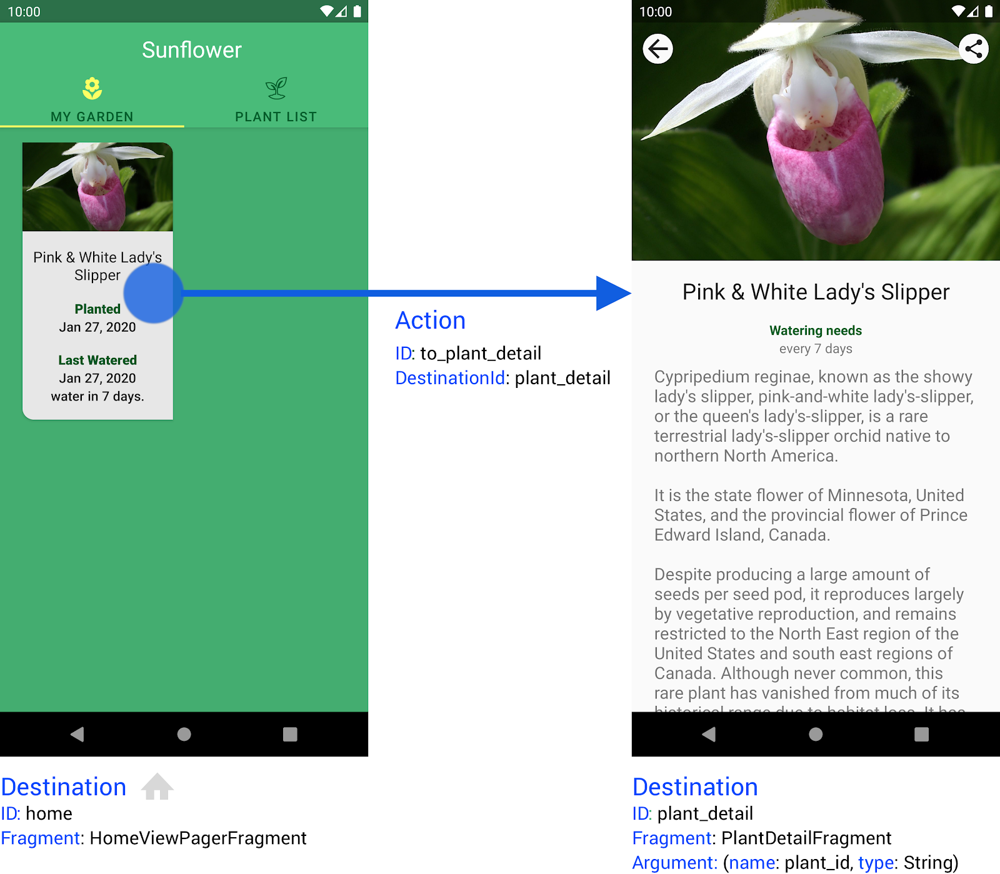

- [Kotlin DSL を使用してプログラムでグラフを作成する](#kotlin-dsl-を使用してプログラムでグラフを作成する)
  - [依存関係](#依存関係)
  - [グラフを作成する](#グラフを作成する)
    - [Kotlin DSL ナビゲーショングラフをホストする](#kotlin-dsl-ナビゲーショングラフをホストする)
    - [グラフの定数を作成する](#グラフの定数を作成する)
    - [NavGraphBuilder DSL でグラフを作成する](#navgraphbuilder-dsl-でグラフを作成する)
    - [Kotlin DSL グラフで移動する](#kotlin-dsl-グラフで移動する)
  - [デスティネーション](#デスティネーション)
    - [Fragment デスティネーション](#fragment-デスティネーション)
    - [Activity デスティネーション](#activity-デスティネーション)
    - [Navigation graph デスティネーション](#navigation-graph-デスティネーション)
    - [カスタムデスティネーションのサポート](#カスタムデスティネーションのサポート)
    - [デスティネーション引数を指定する](#デスティネーション引数を指定する)
      - [カスタム型を指定する](#カスタム型を指定する)
  - [ディープリンク](#ディープリンク)
  - [制限事項](#制限事項)
  - [さらに詳しく](#さらに詳しく)


# Kotlin DSL を使用してプログラムでグラフを作成する

Navigation コンポーネントが提供する Kotlin ベースのドメイン固有言語（DSL）は、Kotlin のタイプセーフ ビルダーを利用しています。この API を使用すると、XML リソース内ではなく、Kotlin コード内で宣言的にグラフを作成できるため、アプリのナビゲーションを動的に作成したい場合に便利です。たとえば、アプリで外部ウェブサービスからナビゲーション設定をダウンロードしてキャッシュし、その設定を使用してアクティビティの onCreate() 関数内でナビゲーション グラフを動的に作成できます。


## 依存関係

Kotlin DSL を使用するには、アプリの build.gradle ファイルに次の依存関係を追加します。

```kotlin
dependencies {
    val nav_version = "2.7.7"

    api("androidx.navigation:navigation-fragment-ktx:$nav_version")
}
```


## グラフを作成する

まずは、Sunflower アプリに基づく基本的な例を見てみましょう。この例では、home と plant_detail の 2 つのデスティネーションがあります。home デスティネーションは、ユーザーがアプリを初めて起動したときに表示され、ユーザーの庭にある植物のリストを示します。ユーザーが植物の 1 つを選択すると、アプリは plant_detail デスティネーションに移動します。

次の図に、これらのディスティネーションと、アプリが home から plant_detail に移動する際に使用するアクション to_plant_detail と、plant_detail デスティネーションで必要となる引数を示します。




### Kotlin DSL ナビゲーショングラフをホストする

アプリのナビゲーション グラフを作成する前に、グラフをホストする場所が必要です。この例ではフラグメントを使用して、グラフを FragmentContainerView 内の NavHostFragment にホストします。

```xml
<!-- activity_garden.xml -->
<FrameLayout
    xmlns:android="http://schemas.android.com/apk/res/android"
    xmlns:app="http://schemas.android.com/apk/res-auto">
    android:layout_width="match_parent"
    android:layout_height="match_parent">

    <androidx.fragment.app.FragmentContainerView
        android:id="@+id/nav_host"
        android:name="androidx.navigation.fragment.NavHostFragment"
        android:layout_width="match_parent"
        android:layout_height="match_parent"
        app:defaultNavHost="true" />

</FrameLayout>
```

この例では app:navGraph 属性が設定されていないことに注意してください。グラフは res/navigation フォルダでリソースとして定義されていないため、アクティビティの onCreate() プロセスの一部として設定する必要があります。

XML では、アクションはデスティネーション ID を 1 つ以上の引数と関連付けます。ただし、Navigation DSL を使用する場合はルートに引数を含められます。つまり、DSL を使用する場合はアクションという概念はありません。

次のステップでは、グラフを定義するときに使用する定数を定義します。


### グラフの定数を作成する

XML ベースのナビゲーション グラフは、Android ビルドプロセスの一環として解析されます。数値定数はグラフで定義された id 属性ごとに作成されます。このビルド時に生成される静的 ID は、実行時にナビゲーション グラフをビルドする場合は利用できないため、Navigation DSL は ID の代わりにルート文字列を使用します。各ルートは一意の文字列で表されます。スペルミスによるバグのリスクを軽減するために、定数として定義することをおすすめします。

引数を処理するときに、これらはルート文字列に組み込まれます。このロジックをルートに組み込むことにより、スペルミスによるバグの発生リスクを軽減できます。

```kotlin
object nav_routes {
    const val home = "home"
    const val plant_detail = "plant_detail"
}

object nav_arguments {
    const val plant_id = "plant_id"
    const val plant_name = "plant_name"
}
```


### NavGraphBuilder DSL でグラフを作成する

定数を定義したら、ナビゲーション グラフを作成できます。

```kotlin
val navController = findNavController(R.id.nav_host_fragment)
navController.graph = navController.createGraph(
    startDestination = nav_routes.home
) {
    fragment<HomeFragment>(nav_routes.home) {
        label = resources.getString(R.string.home_title)
    }

    fragment<PlantDetailFragment>("${nav_routes.plant_detail}/{${nav_arguments.plant_id}}") {
        label = resources.getString(R.string.plant_detail_title)
        argument(nav_arguments.plant_id) {
            type = NavType.StringType
        }
    }
}
```

この例では、fragment() DSL ビルダー関数を使用し、後置ラムダで 2 つのフラグメントのデスティネーションを定義しています。この関数には定数から取得するデスティネーションのルート文字列が必要です。デスティネーションのラベルなど、設定を追加する場合はオプションのラムダに加え、引数とディープリンクの埋め込みビルダー関数も受け取ります。

各デスティネーションの UI を管理する Fragment クラスは、パラメータ化された型として山かっこ（<>）で囲まれて渡されます。これは XML を使用して定義されたフラグメント デスティネーションで android:name 属性を設定するのと同じ役割を果たします。


### Kotlin DSL グラフで移動する

最後に、標準の NavController.nav() 呼び出しを使用して home から plant_detail に移動します。

```kotlin
private fun navigateToPlant(plantId: String) {
    findNavController().navigate("${nav_routes.plant_detail}/$plantId")
}
```

注: Safe Args プラグインは Kotlin DSL と互換性がありません。詳細については、制限事項をご覧ください。

次の例のとおり、PlantDetailFragment で引数の値を取得できます。

```kotlin
val plantId: String? = arguments?.getString(nav_arguments.plant_id)
```

ナビゲーション時に引数を指定する方法については、デスティネーション引数を指定するをご覧ください。

このガイドの残りの部分では、一般的なナビゲーション グラフの要素、デスティネーション、グラフの作成時にそれらを使用する方法について説明します。


## デスティネーション

Kotlin DSL には、Fragment、Activity、NavGraph という 3 つのデスティネーション タイプのサポートが組み込まれています。各デスティネーションには、デスティネーションの作成と構成に使用できる独自のインライン拡張関数があります。


### Fragment デスティネーション

fragment() DSL 関数は、実装するフラグメント クラスにパラメータ化できます。この関数は、このデスティネーションに割り当てる一意のルート文字列に続いて、ラムダを受け取ります。ここでは Kotlin DSL グラフで移動するに記載のとおり、追加の設定ができます。

```kotlin
fragment<FragmentDestination>(nav_routes.route_name) {
   label = getString(R.string.fragment_title)
   // arguments, deepLinks
}
```


### Activity デスティネーション

activity() DSL 関数は、このデスティネーションに割り当てる一意のルート文字列を受け取りますが、実装したアクティビティクラスにパラメータ化されません。代わりに、後置ラムダでオプションの activityClass を設定できます。この柔軟性によって、明示的なアクティビティクラスでは意味を成さない場合に、 **暗黙的インテントを使用して起動しなければならないアクティビティの Activitiy デスティネーションを定義できます。** Fragment デスティネーションと同様に、ラベル、引数、ディープリンクを設定することもできます。

```kotlin
activity(nav_routes.route_name) {
   label = getString(R.string.activity_title)
   // arguments, deepLinks...

   activityClass = ActivityDestination::class
}
```


### Navigation graph デスティネーション

navigation() DSL 関数を使用して、ネストされたナビゲーション グラフをビルドできます。この関数は、グラフに割り当てるルート、グラフの開始デスティネーションのルート、グラフの詳細を構成するラムダという、3 つの引数を受け取ります。有効な要素には、他のデスティネーション、引数、ディープリンク、デスティネーションの説明ラベルなどがあります。このラベルは NavigationUI を使用してナビゲーション グラフを UI コンポーネントにバインドする場合に役立ちます。

```kotlin
navigation("route_to_this_graph", nav_routes.home) {
    // label, other destinations, deep links
}
```


### カスタムデスティネーションのサポート


### デスティネーション引数を指定する
#### カスタム型を指定する
## ディープリンク
## 制限事項
## さらに詳しく
