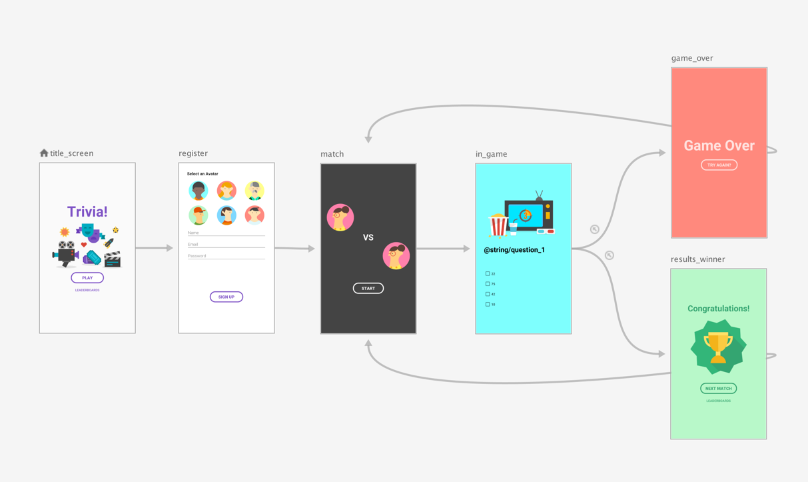
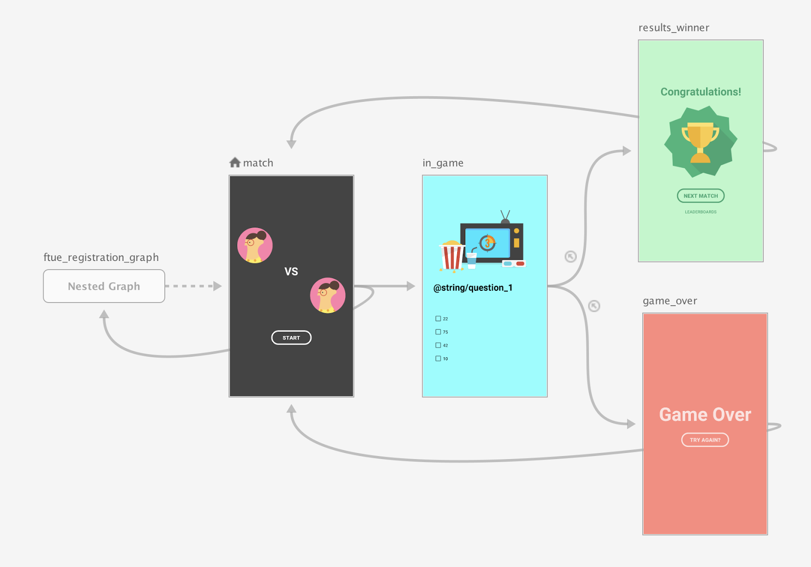

- [ネストされたグラフ](#ネストされたグラフ)
  - [例](#例)
  - [Compose](#compose)
  - [引用元資料](#引用元資料)


# ネストされたグラフ

一般的に、アプリ内のログインフロー、ウィザード、その他のサブフローは、ネストされたナビゲーション グラフとして表現するのが最も適切です。このように自己完結型のサブナビゲーション フローをネストすることにより、アプリの UI のメインフローの把握と管理が容易になります。

また、ネストグラフは **再利用可能** です。さらに、一定レベルの **カプセル化** も実現できます。ネストされたグラフの外部にあるデスティネーションは、ネストされたグラフの内部にあるデスティネーションに直接アクセスすることができません。代わりに、 [NavController.navigate()](https://developer.android.com/reference/androidx/navigation/NavController?hl=ja&_gl=1*1gopugm*_up*MQ..*_ga*MTU0NjM2NDc1Mi4xNzMzNzkyNDc4*_ga_6HH9YJMN9M*MTczMzc5NDczMy4yLjAuMTczMzc5NDczMy4wLjAuNTg5MDkxMTY3#navigate(int)) を使用して、ネストグラフ自体にアクセスする必要があります。ネストグラフの内部ロジックは、グラフの残りの部分に影響を与えることなく変更できます。

ネストされたグラフを使用すると、次のようなメリットがあります。

- 機能ごとの分離
  - 機能ごとにグラフを分離することで、管理がしやすくなります。
- 再利用性の向上
  - 同じ画面フローが存在する場所などで、再利用がしやすくなります。
- 開始デスティネーションを複数設定したい場合
  - 機能ごとやタブごとに開始デスティネーションを設定したい場合に便利です。
- 複雑なナビゲーションの整理
  - 大規模なアプリでナビゲーションが複雑になる場合は、グラフを分けることで、整理することができます。


## 例

アプリのトップレベル ナビゲーション グラフは、ユーザーがアプリを起動したときに最初に表示される開始デスティネーションから始まり、ユーザーがアプリ内を移動する際に表示されるすべてのデスティネーションを含む必要があります。



上記の図で示されるトップレベル ナビゲーション グラフを例に、アプリが初めて起動したときにのみ title_screen 画面と register 画面を表示するようにしたいとします。その後、ユーザー情報が保存され、その後のアプリの起動時には、match 画面に直接移動する必要があります。

おすすめの方法は、以下に示すように、 match 画面をトップレベル ナビゲーション グラフの開始デスティネーションに設定し、タイトル画面と登録画面をネストされたグラフに移動します。



match 画面が起動したら、登録ユーザーがいるかどうかを確認します。ユーザーが登録されていない場合は、登録画面に移動します。

条件付きナビゲーション シナリオの詳細については、 [条件付きナビゲーション](../4.ナビゲーショングラフを使用する/6.条件付きナビゲーション.md) をご覧ください。


## Compose

Compose を使用してネストされたナビゲーション グラフを作成するには、 [NavGraphBuilder.navigation()](https://developer.android.com/reference/kotlin/androidx/navigation/NavGraphBuilder?hl=ja&_gl=1*9wewux*_up*MQ..*_ga*MTU0NjM2NDc1Mi4xNzMzNzkyNDc4*_ga_6HH9YJMN9M*MTczMzc5NDczMy4yLjAuMTczMzc5NDczMy4wLjAuNTg5MDkxMTY3#(androidx.navigation.NavGraphBuilder).navigation(kotlin.Any,kotlin.collections.Map,kotlin.Function1)) 関数を使用します。 navigation() の使い方は、グラフにデスティネーションを追加する際の [NavGraphBuilder.composable()](https://developer.android.com/reference/kotlin/androidx/navigation/NavGraphBuilder?hl=ja&_gl=1*9wewux*_up*MQ..*_ga*MTU0NjM2NDc1Mi4xNzMzNzkyNDc4*_ga_6HH9YJMN9M*MTczMzc5NDczMy4yLjAuMTczMzc5NDczMy4wLjAuNTg5MDkxMTY3#(androidx.navigation.NavGraphBuilder).composable(kotlin.collections.Map,kotlin.collections.List,kotlin.Function1,kotlin.Function1,kotlin.Function1,kotlin.Function1,kotlin.Function1,kotlin.Function2)) 関数や [NavGraphBuilder.dialog()](https://developer.android.com/reference/kotlin/androidx/navigation/NavGraphBuilder?hl=ja&_gl=1*1e8lfg7*_up*MQ..*_ga*MTU0NjM2NDc1Mi4xNzMzNzkyNDc4*_ga_6HH9YJMN9M*MTczMzc5NDczMy4yLjAuMTczMzc5NDczMy4wLjAuNTg5MDkxMTY3#(androidx.navigation.NavGraphBuilder).dialog(kotlin.collections.Map,kotlin.Function1)) 関数の使い方と同様です。

主な違いは、 navigation() 関数は、新しいデスティネーションではなく、ネストされたグラフを作成することです。さらに、 navigation() のラムダ内では、 composable() と dialog() を呼び出して、ネストグラフにデスティネーションを追加します。

次のスニペットでは、 match 画面から results_winner 画面 or game_over 画面までをネストされたグラフとして定義した例です。

```kotlin
// Routes
@Serializable object Title
@Serializable object Register

// Route for nested graph
@Serializable object Game

// Routes inside nested graph
@Serializable object Match
@Serializable object InGame
@Serializable object ResultsWinner
@Serializable object GameOver

NavHost(navController, startDestination = Title) {
    // メインのグラフ

    // メインのグラフ内の各デスティネーション
    composable<Title> {
        TitleScreen(
            onPlayClicked = { navController.navigate(route = Register) },
            onLeaderboardsClicked = { 
                // Navigate to leaderboards
                // リーダーボードとは、何かの大会において、
                // 各プレイヤーのスコアを表示したスコアボードのことです。
            }
        )
    }
    composable<Register> {
        RegisterScreen(
            onSignUpComplete = { navController.navigate(route = Game) }
        )
    }

    // ネストされたグラフ
    // ネストされたグラフ自身も一つのルートを持っています。
    // この例では、 Game がネストされたグラフのルートです。
    navigation<Game>(startDestination = Match) {

        // ネストされたグラフ内の各デスティネーション
        composable<Match> {
            MatchScreen(
                onStartGame = { navController.navigate(route = InGame) }
            )
        }
        composable<InGame> {
            InGameScreen(
                onGameWin = { navController.navigate(route = ResultsWinner) },
                onGameLose = { navController.navigate(route = GameOver) }
            )
        }
        composable<ResultsWinner> {
            ResultsWinnerScreen(
                onNextMatchClicked = {
                    navController.navigate(route = Match) {
                        popUpTo(route = Match) { inclusive = true }
                    }
                },
                onLeaderboardsClicked = { /* Navigate to leaderboards */ }
            )
        }
        composable<GameOver> {
            GameOverScreen(
                onTryAgainClicked = {
                    navController.navigate(route = Match) {
                        popUpTo(route = Match) { inclusive = true }
                    }
                }
            )
        }
    }
}
```

ネストされたデスティネーションに直接移動するには、他のデスティネーションに移動する場合と同様に、ルートクラスのインスタンスを使用します。これは、ルートが、どの画面でも移動できるデスティネーションを識別するために使用されるグローバルなコンセプトであるためです。例えば、 match 画面に遷移する場合は、次のようにします。

```kotlin
navController.navigate(route = Match)
```

注: デスティネーションとナビゲーション イベントの作成は、別々のファイルにカプセル化する必要があります。詳しくは、 [コードをカプセル化する](./8.コードをカプセル化する.md) をご覧ください。


## 引用元資料

- [ネストされたグラフ](https://developer.android.com/guide/navigation/design/nested-graphs?hl=ja)


