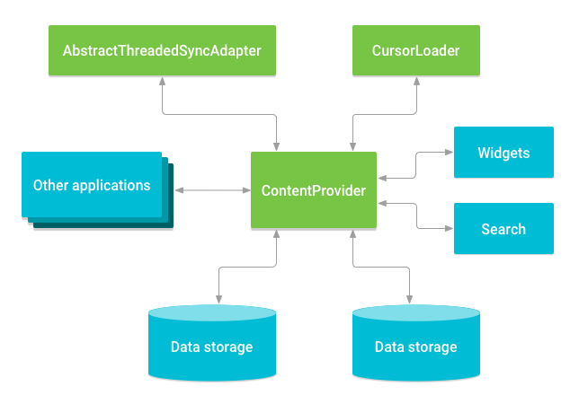
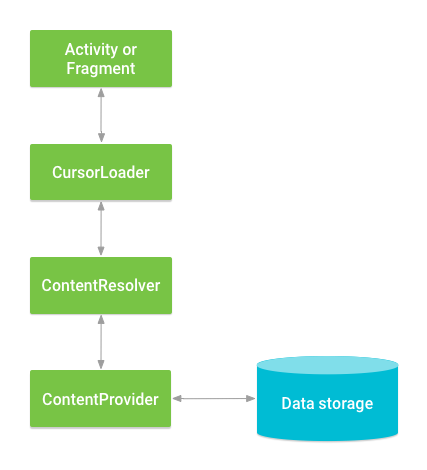

- [コンテンツプロバイダの基本](#コンテンツプロバイダの基本)
  - [概要](#概要)
    - [プロバイダにアクセスする](#プロバイダにアクセスする)
    - [コンテンツ URI](#コンテンツ-uri)
  - [プロバイダからデータを取得する](#プロバイダからデータを取得する)
    - [読み取りアクセス権のリクエスト](#読み取りアクセス権のリクエスト)
    - [クエリを作成する](#クエリを作成する)
      - [悪意のある入力から保護](#悪意のある入力から保護)
    - [クエリ結果を画面に表示する（ Cursor を ListView に設定する）](#クエリ結果を画面に表示する-cursor-を-listview-に設定する)
    - [クエリ結果からデータを取得する（ Cursor の任意の値を取得する）](#クエリ結果からデータを取得する-cursor-の任意の値を取得する)
  - [コンテンツプロバイダの権限](#コンテンツプロバイダの権限)
  - [データの挿入、更新、削除](#データの挿入更新削除)
    - [データの挿入](#データの挿入)
    - [データの更新](#データの更新)
    - [データを削除する](#データを削除する)
  - [プロバイダのデータタイプ](#プロバイダのデータタイプ)
  - [別の形式のプロバイダ アクセス](#別の形式のプロバイダ-アクセス)
    - [バッチアクセス](#バッチアクセス)
    - [インテントを使用したデータアクセス](#インテントを使用したデータアクセス)
      - [一時的な権限でアクセス権を取得する](#一時的な権限でアクセス権を取得する)
      - [別のアプリケーションを使用](#別のアプリケーションを使用)
      - [ヘルパーアプリを使用してデータを表示する](#ヘルパーアプリを使用してデータを表示する)
  - [コントラクトクラス](#コントラクトクラス)
  - [MIME タイプを確認する](#mime-タイプを確認する)
    - [標準的な MIME タイプ](#標準的な-mime-タイプ)
    - [カスタム MIME タイプ](#カスタム-mime-タイプ)
      - [type](#type)
      - [subtype](#subtype)


# コンテンツプロバイダの基本

コンテンツプロバイダは、データのセントラルリポジトリへのアクセスを管理します。プロバイダは Android アプリの一部であり、多くの場合、データを操作する独自の UI を提供します。ただし、コンテンツプロバイダは主に、プロバイダクライアントオブジェクトを使用してプロバイダにアクセスする他のアプリによって使用されます。プロバイダとプロバイダクライアントは、連携してデータに対する一貫した標準インターフェースを提供し、プロセス間通信と安全なデータアクセスも処理します。

通常、コンテンツプロバイダを使用する状況は、以下の 2 通りあります。

1. 別のアプリで既存のコンテンツプロバイダにアクセスするコードを実装する場合
2. アプリで新しいコンテンツプロバイダを作成して、他のアプリとデータを共有する場合

**このページでは、既存のコンテンツプロバイダを使用する際の基本について説明します。** 独自のアプリにコンテンツプロバイダを実装する方法については、 [コンテンツプロバイダを作成する](./3.コンテンツプロバイダの作成.md) をご覧ください。

このトピックでは、次のことについて説明します。

- コンテンツプロバイダの仕組み。
- コンテンツプロバイダからデータを取得する際に使用する API。
- コンテンツプロバイダへのデータの挿入、更新、削除に使用する API。
- プロバイダでの作業に役立つその他の API 機能。


## 概要

コンテンツプロバイダは外部アプリに対し、リレーショナルデータベースのテーブルに似たオブジェクトとしてデータを提供します。一つのコンテンツプロバイダは、一つ以上のテーブルを含むことが可能です。行はプロバイダが収集するなんらかのデータのインスタンスを表し、行の各列はインスタンスに対して収集した個々のデータを表します。

コンテンツプロバイダは、さまざまな API やコンポーネントについて、アプリ内のデータストレージレイヤへのアクセスを調整します。図に示すように、次のようなものがあります。

- アプリデータへのアクセスを他のアプリと共有する
- ウィジェットにデータを送信する
- [SearchRecentSuggestionsProvider](https://developer.android.com/reference/android/content/SearchRecentSuggestionsProvider?hl=ja&_gl=1*1cdr0vx*_up*MQ..*_ga*MTY3MzE5ODE3My4xNzIyMzUyNjI3*_ga_6HH9YJMN9M*MTcyMjM1MjYyNi4xLjAuMTcyMjM1MjYyNi4wLjAuMA..) を使用して、検索フレームワークを介して、アプリのカスタム検索候補を返す
- [AbstractThreadedSyncAdapter](https://developer.android.com/reference/android/content/AbstractThreadedSyncAdapter?hl=ja&_gl=1*1cdr0vx*_up*MQ..*_ga*MTY3MzE5ODE3My4xNzIyMzUyNjI3*_ga_6HH9YJMN9M*MTcyMjM1MjYyNi4xLjAuMTcyMjM1MjYyNi4wLjAuMA..) の実装を使用してアプリデータをサーバーと同期する
- CursorLoader を使用して UI にデータを読み込む (現在は非推奨)
  - データを UI に読み込む方法として、現在は ViewModel と LiveData などを使用した方法が推奨されており、 Loader を使用した方法は、現在、非推奨となっています。




### プロバイダにアクセスする

コンテンツプロバイダのデータにアクセスする場合は、クライアントアプリは、 Context の ContentResolver オブジェクトを使用します。 ContentResolver オブジェクトは、プロバイダオブジェクト ( ContentProvider を実装するクラスのインスタンス) と通信します。

プロバイダオブジェクトは、クライアントからデータリクエストを受け取り、リクエストされたアクションを実施して、結果を返します。

ContentResolver のメソッドは、永続ストレージの基本的な 「 CRUD 」 (作成、取得、更新、削除) 機能を提供します。

~~UI から ContentProvider にアクセスするための一般的なパターンでは、 CursorLoader を使用してバックグラウンドで非同期クエリを実行します。UI の Activity または Fragment がクエリに対して CursorLoader を呼び出し、それが ContentResolver を使用して ContentProvider を取得します。~~ (現在は CursorLoader の使用は非推奨) 

これにより、ユーザーはクエリの実行中も UI を引き続き使用できます。このパターンには、以下の図に示すようにさまざまなオブジェクトとのやり取りと、基となるストレージメカニズムが含まれます。



**注**: **アプリがプロバイダにアクセスするには、通常、マニフェストファイルで特定の権限をリクエストする必要があります。** この開発パターンについて詳しくは、 [コンテンツプロバイダの権限](#コンテンツプロバイダの権限) のセクションをご覧ください。

Android プラットフォームの組み込みプロバイダの 1 つに単語リストプロバイダがあります。このプロバイダには、ユーザーが保存したい非標準的な単語が格納されます。次の表は、このプロバイダのテーブルにデータがどのように格納されるかを示しています。

| word        | app id | frequency | locale | _ID |
| ----------- | ------ | --------- | ------ | --- |
| mapreduce   | user1  | 100       | en_US  | 1   |
| precompiler | user14 | 200       | fr_FR  | 2   |
| applet      | user2  | 225       | fr_CA  | 3   |
| const       | user1  | 255       | pt_BR  | 4   |
| int         | user5  | 100       | en_UK  | 5   |

上記の表の各行は、標準の辞書にない単語の 1 つのインスタンスを表します。各列は、その単語が最初に検出された言語 / 地域など、その単語のデータを表します。列の項目名は、プロバイダに格納される列の名前です。このプロバイダの場合、_ID 列はプロバイダが自動的に管理する主キー列として機能します。

単語リストプロバイダから単語とその言語 / 地域のリストを取得するには、 [ContentResolver.query()](https://developer.android.com/reference/android/content/ContentResolver?_gl=1*17hc2ry*_up*MQ..*_ga*MTY3MzE5ODE3My4xNzIyMzUyNjI3*_ga_6HH9YJMN9M*MTcyMjM1MjYyNi4xLjAuMTcyMjM1MjYyNi4wLjAuMA..#query(android.net.Uri,%20java.lang.String[],%20android.os.Bundle,%20android.os.CancellationSignal)) を呼び出します。この query() メソッドにより、単語リストプロバイダが定義する [ContentProvider.query()](https://developer.android.com/reference/android/content/ContentProvider?_gl=1*1ceaoxg*_up*MQ..*_ga*MTY3MzE5ODE3My4xNzIyMzUyNjI3*_ga_6HH9YJMN9M*MTcyMjM1MjYyNi4xLjAuMTcyMjM1MjYyNi4wLjAuMA..#query(android.net.Uri,%20java.lang.String[],%20android.os.Bundle,%20android.os.CancellationSignal)) メソッドが呼び出されます。 ContentResolver.query() メソッドの呼び出しの例を次に示します。

```kotlin
// UserDictionary のデータを抽出し、その結果を返します。
cursor = contentResolver.query(
        // コンテンツプロバイダーとテーブルを示す URI を指定します。
        // これは、 URI 型のオブジェクトです。
        // これが、実際にどのような URI を表すのかは、
        // 次のセクション「コンテンツURI」を参照してください。
        UserDictionary.Words.CONTENT_URI,
        // データを取得する列を指定します。
        projection,
        // データを取得する行 (抽出条件) を指定します。
        selectionClause,
        // selectionClause でプレースホルダー ( ? ) を指定した際に、そこに代入する値を指定します。
        selectionArgs.toTypedArray(),
        // 返却されるアイテムの並び順を指定します。
        sortOrder
)
```

次の表は、 query() 関数の引数を SQL の SELECT 文と比較した場合の対比を示しています。

| query() 引数  | SELECT キーワード / パラメータ                                                        | Notes                                                                     |
| ------------- | ------------------------------------------------------------------------------------- | ------------------------------------------------------------------------- |
| Uri           | FROM table_name                                                                       | Uri は、 'table_name' という名前のプロバイダのテーブルにマッピングされます。 |
| projection    | col,col,col,...                                                                       | projection は、取得される各行に含まれる列の配列です。                     |
| selection     | WHERE col = value                                                                     | selection は、行を選択する際の基準を指定します。                          |
| selectionArgs | 完全に一致するものはありません。選択引数は、選択句の ? プレースホルダを置き換えます。 |                                                                           |
| sortOrder     | ORDER BY col,col,...                                                                  | sortOrder には、返された [Cursor](https://developer.android.com/reference/android/database/Cursor?_gl=1*1dskpjc*_up*MQ..*_ga*MTY3MzE5ODE3My4xNzIyMzUyNjI3*_ga_6HH9YJMN9M*MTcyMjM1MjYyNi4xLjAuMTcyMjM1MjYyNi4wLjAuMA..) に行が表示される順序を指定します。        |


### コンテンツ URI

上記のセクションの例で、 Words テーブルの完全な URI は次のようになります。

```
content://user_dictionary/words
```

- content:// 文字列
  - これは **スキーム** と呼ばれる部分です。
  - 常に存在し、コンテンツ URI であることを識別します。
- user_dictionary 文字列
  - これは **オーソリティ** と呼ばれる部分です。
  - コンテンツプロバイダを識別するための名前です。
  - これは、 **シンボリック名** と呼ばれることもありますが、シンボリックには広い意味があり (象徴的、代表的という意味) 、文脈によって、何を示すかが曖昧であるため、使用を避けるべきです。
  - 公式ドキュメントでは、 「オーソリティ」 という単語を 「認証局」 と日本語訳している部分がありますが、これは翻訳ミスである可能性が高いため、使用しないようにしてください。
- words 文字列
  - これは **パス** と呼ばれる部分です。
  - テーブルを識別するための名前です。

多くのプロバイダでは、 URI の末尾に ID 値を追加することでテーブル内の 1 行にアクセスできます。たとえば、 _ID が 4 の行を単語リストプロバイダから取得するには、次のコンテンツ URI を使用します。

```kotlin
// singleUri には、 content://user_dictionary/words/4 という URI が格納されます。
val singleUri: Uri = ContentUris.withAppendedId(UserDictionary.Words.CONTENT_URI, 4)
```

[Uri](https://developer.android.com/reference/android/net/Uri?hl=ja&_gl=1*ltcs14*_up*MQ..*_ga*MTY3MzE5ODE3My4xNzIyMzUyNjI3*_ga_6HH9YJMN9M*MTcyMjM1MjYyNi4xLjAuMTcyMjM1MjYyNi4wLjAuMA..) クラスと [Uri.Builder](https://developer.android.com/reference/android/net/Uri.Builder?hl=ja&_gl=1*jhv8yr*_up*MQ..*_ga*MTY3MzE5ODE3My4xNzIyMzUyNjI3*_ga_6HH9YJMN9M*MTcyMjM1MjYyNi4xLjAuMTcyMjM1MjYyNi4wLjAuMA..) クラスには、文字列から適切な形式の URI オブジェクトを作成するための便利なメソッドが用意されています。 [ContentUris](https://developer.android.com/reference/android/content/ContentUris?hl=ja&_gl=1*jhv8yr*_up*MQ..*_ga*MTY3MzE5ODE3My4xNzIyMzUyNjI3*_ga_6HH9YJMN9M*MTcyMjM1MjYyNi4xLjAuMTcyMjM1MjYyNi4wLjAuMA..) クラスには、 URI に ID 値を追加するための便利なメソッドが用意されています。上のスニペットでは、 [withAppendedId()](https://developer.android.com/reference/android/content/ContentUris#withAppendedId(android.net.Uri,%20long)) を使用して、単語リストプロバイダのコンテンツ URI に ID を追加しています。


## プロバイダからデータを取得する

このセクションでは、単語リストプロバイダを例に、プロバイダからデータを取得する方法について説明します。

わかりやすくするために、このセクションのコードスニペットは UI スレッドで ContentResolver.query() を呼び出します。ただし、実際のコードでは、別のスレッドで非同期にクエリを実行してください。 ~~CursorLoader クラスを使用できます。クラスについて詳しくは、ローダのガイドをご覧ください。~~ ( Loader は現在非推奨です。) また、サンプルコードは一部抜粋です。完全なコードではない点に注意してください。

プロバイダからデータを取得するには、次の基本的な手順を行います。

1. プロバイダの読み取りアクセス権をリクエストします。
2. プロバイダにクエリを送信するコードを定義します。


### 読み取りアクセス権のリクエスト

プロバイダからデータを取得するには、クライアントアプリ側でプロバイダに対する読み取りアクセス権限が必要です。この権限は実行時にリクエストできません。代わりに、 `<uses-permission>` 要素と、プロバイダが定義する正確な権限名を使用して、この権限が必要であることを **クライアントアプリのマニフェストで指定する必要があります。**

**マニフェストで `<uses-permission>` を指定すると、アプリについてこの権限をリクエストします。ユーザーがアプリをインストールすると、このリクエストが暗黙的に付与されます。**

使用しているプロバイダの読み取りアクセス権限の正確な名前や、プロバイダによって使用されている他のアクセス権限の名前を確認するには、プロバイダのドキュメントをご覧ください。

プロバイダにアクセスする際の権限の役割については、 [コンテンツプロバイダの権限](#コンテンツプロバイダの権限) で詳しく説明しています。

~~単語リストプロバイダはマニフェストファイルで権限 android.permission.READ_USER_DICTIONARY を定義しているため、プロバイダからの読み取りを行うアプリは、この権限をリクエストする必要があります。~~ (このパーミッションはシステムアプリや特権アプリ向けのもので、通常のアプリでは指定しても効果はありません。Android 6.0（API 23）以降では 通常のアプリは無許可で UserDictionary にアクセスできます。また、近年は、 UserDictionary 自体を使用する機会はほとんどありません。なぜなら、 Gboard などの IME がユーザーの入力履歴を学習し、予測変換を提供できるためです。また、 Gboard などは、クラウドベースで予測変換を提供するのに対して、 UserDictionary はデバイスベースで辞書を保持するため、複数のデバイスをまたがって、シームレスなユーザー体験をできる Bboard などの方が優れているためです。)


### クエリを作成する

プロバイダからデータを取得するためには、クエリを作成する必要があります。次のスニペットでは、単語リストプロバイダにアクセスするための変数を定義しています。

```kotlin
// "projection" は、取得する列を定義します。
private val mProjection: Array<String> = arrayOf(
        // _ID 列のコントラクトクラス定数
        UserDictionary.Words._ID,
        // word 列のコントラクトクラス定数
        UserDictionary.Words.WORD,
        // locale 列のコントラクトクラス定数
        UserDictionary.Words.LOCALE
)

// 抽出条件の文字列を定義
private var selectionClause: String? = null

// 抽出条件のプレースホルダに代入する値を定義
private lateinit var selectionArgs: Array<String>
```

次のスニペットでは、単語リストプロバイダの例を使用して、 ContentResolver.query() の使用方法を示しています。プロバイダクライアントクエリは SQL クエリに似ており、返される列のセット、選択条件、並べ替え順序で構成されます。

このクエリによって返される列のセットは射影 (プロジェクション) と呼ばれ、変数は mProjection です。

抽出条件は、条件式とそのプレースホルダに分割されます。条件式に ? を使用すると、プレースホルダで実際の値をそこに代入できます。プレースホルダは配列型の変数になっていますが、これは、条件式の ? に前から順番に値が代入されていきます。

次のスニペットでは、ユーザーが単語を入力しないと、抽出条件が null に設定され、クエリはプロバイダのすべての単語を返します。ユーザーが単語を入力すると、抽出条件が `"${UserDictionary.Words.WORD} = ?"` に設定されます。

```kotlin
/*
 * 抽出条件のプレースホルダー
 */
private lateinit var selectionArgs: Array<String>

private lateinit var selectionClause: String?

// UI から検索する単語の文字列を取得
searchString = searchWord.text.toString()

// 無効なインプットや悪意のあるインプットをチェックするために、ここにコードを追加する。

// もし UI からの入力がなかった (空文字である) 場合
// 全てのデータを取得する。
selectionArgs = searchString?.takeIf { it.isNotEmpty() }?.let {
    selectionClause = "${UserDictionary.Words.WORD} = ?"
    arrayOf(it)
} ?: run {
    // 入力がなかった場合
    selectionClause = null
    emptyArray<String>()
}

// テーブルに対してクエリを実行すると、 Cursor オブジェクトが返ってきます
mCursor = contentResolver.query(
        // Words テーブルの URI
        UserDictionary.Words.CONTENT_URI,
        // 抽出する列を指定
        projection,
        // null かユーザーの入力した値
        selectionClause,
        // 空かユーザーの入力した値
        selectionArgs,
        // 並び順
        sortOrder
)

// もしエラーが発生した場合は、 null を返すプロバイダーと、
// 例外を投げるプロバイダーが存在します。
when (mCursor?.count) {
    null -> {
        /*
         * エラーを処理するコードをここに記述します。
         * Cursor を使用しないように注意してください。
         * このエラーを記録するために Log.e() を呼ぶと良いかもしれません。
         */
    }
    0 -> {
        /*
         * 検索が成功したことをユーザーに通知するコードをここに記述します。
         * これは必ずしもエラーではありません。
         * ユーザーに以下のオプションを提供する必要があるかもしれません。
         * - 新しいデータを登録する
         * - 検索語句を再入力する
         */
    }
    else -> {
        // 取得結果を利用して何らかの処理を実行します。
    }
}
```

このクエリは、次の SQL ステートメントに似ています。

```sql
SELECT _ID, word, locale
    FROM words
    WHERE word = <userinput>
    ORDER BY word ASC;
```

この SQL ステートメントでは、コントラクトクラス定数の代わりに実際の列名が使用されます。


#### 悪意のある入力から保護

コンテンツプロバイダが管理するデータが SQL データベース内にある場合、信頼できない外部のデータを RAW SQL ステートメントに含めると、 SQL インジェクションが発生する可能性があります。

次の条件式について考えてみましょう。

```kotlin
// 列名にユーザー入力を連結することで抽出条件を構築します。
var selectionClause = "var = $mUserInput"
```

これを行うと、 **ユーザーが悪意のある SQL を SQL ステートメントに連結する可能性があります。** たとえば、mUserInput に対して「nothing; DROP TABLE *;」と入力すると、選択句 var = nothing; DROP TABLE *; になります。

条件式は SQL ステートメントとして扱われるため、プロバイダが SQL インジェクションの試行をキャッチするように設定されていない場合、基盤となる SQLite データベース内のすべてのテーブルがプロバイダによって消去される可能性があります。

**この問題を回避するには、 `?` を置換可能なパラメータとして使用し、そこに配列で定義された値を渡します。** このようにして、ユーザー入力は SQL ステートメントの一部として解釈されるのではなく、クエリのプレースホルダに値が直接バインドされます。 SQL として扱われないため、ユーザー入力によって悪意のある SQL が挿入されることはありません。条件式にユーザー入力を含める場合は、文字列連結を使用するのではなく、 `?` のプレースホルダを使用します。

```kotlin
// 置換可能なパラメータで条件式を構築します。
var selectionClause = "var = ?"
```

プレースホルダへ代入する引数は、次のようにセットアップします。

```kotlin
// 条件式の引数を含む MutableList を定義します。
var selectionArgs: MutableList<String> = mutableListOf()
```

次のように Kotlin の文法を使用して、引数を追加することができます。

```kotlin
// += は、 MutableList の末尾に要素を追加する Kotlin の関数です。
selectionArgs += userInput
```

プロバイダが SQL データベースに基づいていなくても、? を置換可能なパラメータとして使用し、配列で定義した実際の値を渡すことをおすすめします。


### クエリ結果を画面に表示する（ Cursor を ListView に設定する）

ContentResolver.query() クライアントメソッドは、常に Cursor を返します。 Cursor は、 `List<Item>` のようなものです。そのため、 Cursor オブジェクトは、そこに含まれる行と列へのランダム読み取りアクセスを提供します。

Cursor メソッドを使用すると、結果の行の反復処理、各列のデータ型の特定、列からのデータの取得、結果の他のプロパティの確認を行うことができます。

一部の Cursor 実装では、プロバイダのデータが変更されたときにオブジェクトを自動的に更新したり、 Cursor が変更されたときにオブザーバーオブジェクトのメソッドをトリガーしたり、または、その両方を行うことができます。

**注** : プロバイダは、クエリを実行するオブジェクトの性質に基づいて列へのアクセスを制限できます。たとえば、連絡先プロバイダは、一部の列の同期アダプターへのアクセスを制限しているため、アクティビティやサービスに列が返されません。

**選択条件に一致する行がない場合、プロバイダは、Cursor.getCount() が 0 の Cursor オブジェクト（空のカーソル）を返します。**

**内部エラーが発生した場合、クエリの結果はプロバイダによって異なります。null が返されるか、Exception がスローされます。**

Cursor は行のリストであるため、 `List<Item>` のようなものです。そのため、 **Cursor の内容を表示するには、SimpleCursorAdapter を使用して ListView に紐づけることができます。**

```kotlin
// カーソルから収集する列のリストを定義します。
// そして、出力オブジェクトにロードします。
// Defines a list of columns to retrieve from the Cursor and load into an output row
val wordListColumns : Array<String> = arrayOf(
        // word 列のコントラクトクラス定数
        UserDictionary.Words.WORD,
        // locale 列のコントラクトクラス定数
        UserDictionary.Words.LOCALE
)

// カーソルのデータを受信する View ID のリストを定義する。
// 列ごとに View ID を渡す。
val wordListItems = intArrayOf(R.id.dictWord, R.id.locale)

// 新しい SimpleCursorAdapter を生成する
cursorAdapter = SimpleCursorAdapter(
        // アプリケーションコンテキストオブジェクト
        applicationContext,
        // ListView の一行分のレイアウト xml
        R.layout.wordlistrow,
        // query() の結果の Cursor
        mCursor,
        // カーソルに含まれる列の列名の文字列配列
        wordListColumns,
        // 一行分のレイアウトの View ID (列ごとに View ID 有り)
        wordListItems,
        // フラグ (通常は必要ありません)
        0
)

// ListView にアダプターをセットする
wordList.setAdapter(cursorAdapter)
```

**注**: Cursor を使用して ListView を返すには、カーソルに _ID という名前の列を含める必要があります。このため、上記のクエリでは、ListView では表示されませんが、Words テーブルの _ID 列が取得されます。ほとんどのプロバイダで各テーブルに _ID 列があるのは、この制限の理由にも当てはまります。


### クエリ結果からデータを取得する（ Cursor の任意の値を取得する）

クエリ結果を表示するだけでなく、他のタスクにも使用できます。たとえば、単語リスト プロバイダからスペルを取得して、他のプロバイダでそのスペルを検索できます。そのためには、次の例のように Cursor 内の行を反復処理します。

```kotlin
/*
* カーソルが有効な場合のみ実行します。
* User Dictionary は、内部エラーが発生した場合、 null を返します。
* 他のプロバイダでは、 null の代わりに例外を投げる場合もあります。
*/
mCursor?.apply {
    // "word" 列に紐づけられたインデックスを取得します。
    // 0 から始まる配列の要素番号のようなものです。
    val index: Int = getColumnIndex(UserDictionary.Words.WORD)

    /*
     * カーソルの次の行に移動します。
     * カーソル内の最初の移動の前に、ポインターは -1 になっています。
     * もしその場所でデータを収集すると例外が発生します。
     */
    while (moveToNext()) {
        // 列からデータを取得します。
        newWord = getString(index)

        // 取得した word に対する処理をここで実施します。
    }
}
```

Cursor の実装には「get」メソッドがいくつか用意されており、オブジェクトからさまざまなタイプのデータを取得できます。たとえば上記のスニペットでは getString() を使用しています。また、列のデータ型を示す値を返す getType() メソッドもあります。


## コンテンツプロバイダの権限

プロバイダのアプリで、他のアプリがプロバイダのデータにアクセスするために必要な権限を指定できます。これらの権限は、アプリがアクセスしようとしているデータをユーザーに知らせるものです。クライアントアプリは、プロバイダの要件に基づき、プロバイダにアクセスするために必要な権限をリクエストします。エンドユーザーがアプリをインストールするとき、リクエストされた権限が表示されます。

プロバイダ側のアプリで権限が指定されていない場合、または、プロバイダがエクスポートされない限り、他のアプリはプロバイダのデータにアクセスできません。

プロバイダを提供するアプリ自身は、権限の有無に関係なく、常に完全な読み取り / 書き込みアクセス権を持ちます。

例えば、単語リストプロバイダには、以下の権限があります。

- データを取得するには、android.permission.READ_USER_DICTIONARY 権限が必要です。
- データの挿入、更新、削除を行うには android.permission.WRITE_USER_DICTIONARY 権限が必要です。

プロバイダにアクセスするために必要な権限を取得するには、クライアント側のアプリのマニフェストファイルで `<uses-permission>` 要素を使用して権限をリクエストします。 Android Package Manager が **アプリをインストールする際、ユーザーはアプリがリクエストするすべての権限を承認する必要があります。** ユーザーが承認すると、 Package Manager はインストールを続行します。 **ユーザーが一つでも権限を承認しないと、 Package Manager はインストールを停止します。**

次のサンプル `<uses-permission>` 要素は、単語リストプロバイダへの読み取りアクセス権をリクエストしています。

```xml
<uses-permission android:name="android.permission.READ_USER_DICTIONARY">
```

権限がプロバイダアクセスに与える影響については、 [セキュリティに関するヒント](https://developer.android.com/guide/topics/security/security?hl=ja&_gl=1*1sjc5n*_up*MQ..*_ga*MTY3MzE5ODE3My4xNzIyMzUyNjI3*_ga_6HH9YJMN9M*MTcyMjM1MjYyNi4xLjAuMTcyMjM1MjYyNi4wLjAuMA..) で詳しく説明しています。


## データの挿入、更新、削除

プロバイダからデータを取得する場合と同じ方法で、プロバイダクライアントとプロバイダサーバーの ContentProvider の間のやり取りを使用してデータを変更します。対応する ContentProvider のメソッドに渡す引数を使用して ContentResolver のメソッドを呼び出します。プロバイダとプロバイダのクライアントは、セキュリティとプロセス間通信を自動的に処理します。


### データの挿入

プロバイダにデータを挿入するには、ContentResolver.insert() メソッドを呼び出します。このメソッドは、プロバイダに新しい行を挿入し、その行のコンテンツ URI を返します。次のスニペットは、単語リスト プロバイダに新しい単語を挿入する方法を示しています。

```kotlin
// データ挿入の結果を受け取る URI オブジェクトを定義します。
lateinit var newUri: Uri

// 挿入する新しいデータを含むオブジェクトを定義します。
// Defines an object to contain the new values to insert
val newValues = ContentValues().apply {
    /*
     * 各列の値をセットして、 word レコードを挿入します。
     * put メソッドの引数は列名とインサートする値です。
     */
    put(UserDictionary.Words.APP_ID, "example.user")
    put(UserDictionary.Words.LOCALE, "en_US")
    put(UserDictionary.Words.WORD, "insert")
    put(UserDictionary.Words.FREQUENCY, "100")
}

newUri = contentResolver.insert(
        // UserDictionary の URI
        UserDictionary.Words.CONTENT_URI,
        // 挿入するデータ
        newValues
)
```

新しい行のデータは 1 つの ContentValues オブジェクトに格納されます。これは 1 行カーソルの形式に似ています。このオブジェクトの列は同じデータ型である必要はありません。また、値をまったく指定しない場合は、ContentValues.putNull() を使用して列を null に設定できます。

上のスニペットでは _ID 列は追加されていません。この列は自動的に維持されるためです。プロバイダは、追加されるすべての行に _ID の一意の値を割り当てます。プロバイダは通常、この値をテーブルの主キーとして使用します。

newUri で返されるコンテンツ URI は、新しく追加された行を次の形式で識別します。

```
content://user_dictionary/words/<id_value>
```

`<id_value>` は、新しい行の _ID のコンテンツです。ほとんどのプロバイダは、この形式のコンテンツ URI を自動的に検出し、その特定の行に対してリクエストされたオペレーションを実施できます。

返された Uri から _ID の値を取得するには、 [ContentUris.parseId()](https://developer.android.com/reference/android/content/ContentUris#parseId(android.net.Uri)) を呼び出すことで long 型の ID を取得することができます。


### データの更新

行を更新するには、クエリの場合と同様に、挿入および選択基準の場合と同様に、更新された値を含む ContentValues オブジェクトを使用します。使用するクライアント メソッドは ContentResolver.update() です。更新する列の ContentValues オブジェクトに値を追加するだけで済みます。列のコンテンツを消去する場合は、値を null に設定します。

次のスニペットでは、言語 / 地域が "en" であるすべての行のロケールが null に変更されます。戻り値は、更新された行の数です。

```kotlin
// 更新後の値を含むオブジェクトを定義します。
val updateValues = ContentValues().apply {
    /*
     * 更新後の値をセットして、選択した word を更新します。
     */
    putNull(UserDictionary.Words.LOCALE)
}

// 更新したい行を抽出する条件を定義します。
val selectionClause: String = UserDictionary.Words.LOCALE + "LIKE ?"
val selectionArgs: Array<String> = arrayOf("en_%")

// 更新された行数を含む変数を定義します。
var rowsUpdated: Int = 0

rowsUpdated = contentResolver.update(
        // UserDictionary コンテンツの URI
        UserDictionary.Words.CONTENT_URI,
        // 更新する列と更新後の値
        updateValues,
        // 更新するレコードの抽出条件
        selectionClause,
        // プレースホルダに代入する値
        selectionArgs
)
```

ContentResolver.update() の呼び出し時にユーザー入力をサニタイズ (有害なものを無害化) します。詳細については、 [悪意のある入力から保護する](#悪意のある入力から保護) をご覧ください。


### データを削除する

行の削除は、行データの取得と同様です。削除する行の選択条件を指定すると、クライアント メソッドは削除された行の数を返します。次のスニペットは、アプリ ID が "user" と一致する行を削除します。削除した行数がメソッドから返されます。

```kotlin
// 削除したい行の抽出条件
val selectionClause = "${UserDictionary.Words.APP_ID} LIKE ?"
val selectionArgs: Array<String> = arrayOf("user")

// 削除された行数
var rowsDeleted: Int = 0

// 条件に一致する word を削除する
rowsDeleted = contentResolver.delete(
        // URI
        UserDictionary.Words.CONTENT_URI,
        // 抽出条件
        selectionClause,
        // プレースホルダに代入する値
        selectionArgs
)
```

ContentResolver.delete() の呼び出し時にユーザー入力をサニタイズ (有害なものを無害化) します。詳細については、 [悪意のある入力から保護する](#悪意のある入力から保護) をご覧ください。


## プロバイダのデータタイプ

コンテンツプロバイダは、さまざまなデータ型を提供できます。単語リストプロバイダはテキストのみを提供しますが、次の形式も提供できます。

- 整数
- 長整数（long）
- 浮動小数点数
- long 浮動小数点（double）

プロバイダがよく使用するもう 1 つのデータ型は、 64 KB バイト配列として実装されたバイナリ ラージ オブジェクト ( BLOB ) です。使用可能なデータ型は、 Cursor クラスの 「 get 」 メソッドで確認できます。

プロバイダの各列のデータ型は通常、そのドキュメントに記載されています。単語リストプロバイダのデータ型は、そのコントラクトクラス UserDictionary.Words のリファレンスドキュメントに記載されています。コントラクトクラスについては、 [コントラクトクラス](#コントラクトクラス) のセクションをご覧ください。 Cursor.getType() を呼び出すことでもデータ型を判断できます。

プロバイダは、定義する各コンテンツ URI の MIME データ型情報も保持します。 MIME タイプ情報を使用して、プロバイダが提供するデータをアプリが処理できるかどうかを確認したり、 MIME タイプに基づいて処理タイプを選択したりできます。 MIME タイプは通常、複雑なデータ構造やファイルを含むプロバイダを扱う際に必要になります。

たとえば連絡先プロバイダの ContactsContract.Data テーブルでは、 MIME タイプを使用して、各行に格納されている連絡先データのタイプにラベルを付けます。コンテンツ URI に対応する MIME タイプを取得するには、 ContentResolver.getType() を呼び出します。

[MIME タイプのリファレンス](#mime-タイプのリファレンス) セクションでは、標準とカスタムの両方の MIME タイプの構文について説明しています。


## 別の形式のプロバイダ アクセス

アプリ開発では、次の 3 つの代替形式のプロバイダアクセスが重要です。

- **バッチアクセス** : [ContentProviderOperation](https://developer.android.com/reference/android/content/ContentProviderOperation) クラスのメソッドを使用してアクセス呼び出しのバッチを作成し、 [ContentResolver.applyBatch()](https://developer.android.com/reference/android/content/ContentResolver#applyBatch(java.lang.String,%20java.util.ArrayList%3Candroid.content.ContentProviderOperation%3E)) で適用できます。
- **非同期クエリ** : 別のスレッドでクエリを実行します。 CursorLoader オブジェクトを使用できます。 [ローダ](https://developer.android.com/guide/components/loaders?hl=ja&_gl=1*abve5l*_up*MQ..*_ga*MTY3MzE5ODE3My4xNzIyMzUyNjI3*_ga_6HH9YJMN9M*MTcyMjM1MjYyNi4xLjAuMTcyMjM1MjYyNi4wLjAuMA..) のガイドに、この方法の例が記載されています。 (現在、ローダの使用は非推奨となっています。)
- **インテントを使用したデータアクセス** : プロバイダにインテントを直接送信することはできませんが、プロバイダのアプリには、通常はプロバイダのデータを変更するのに最適な機能としてインテントを送信できます。

以下のセクションでは、バッチアクセスとインテントを使用したデータアクセスについて説明します。


### バッチアクセス

プロバイダへのバッチアクセスは、大量の行を挿入する場合や、同じメソッド呼び出しで複数のテーブルに行を挿入する場合に役立ちます。また、一般に、プロセス境界をまたいで一連のオペレーションをトランザクションとして実行する場合に、アトミックオペレーションとして使用されます。

この方法を使用すると、プロセス間をまたぐ処理が一回の接続で実行できるため、処理効率が良くなると思われます。

バッチモードでプロバイダにアクセスするには、 [ContentProviderOperation](https://developer.android.com/reference/android/content/ContentProviderOperation?hl=ja&_gl=1*hwpq8t*_up*MQ..*_ga*MTY3MzE5ODE3My4xNzIyMzUyNjI3*_ga_6HH9YJMN9M*MTcyMjM1MjYyNi4xLjAuMTcyMjM1MjYyNi4wLjAuMA..) オブジェクトの配列を作成し、 [ContentResolver.applyBatch()](https://developer.android.com/reference/android/content/ContentResolver?hl=ja&_gl=1*lvx43*_up*MQ..*_ga*MTY3MzE5ODE3My4xNzIyMzUyNjI3*_ga_6HH9YJMN9M*MTcyMjM1MjYyNi4xLjAuMTcyMjM1MjYyNi4wLjAuMA..#applyBatch(java.lang.String,%20java.util.ArrayList%3Candroid.content.ContentProviderOperation%3E)) を使用してコンテンツ プロバイダにディスパッチします。このメソッドには、特定のコンテンツ URI ではなく、コンテンツ プロバイダの [オーソリティ](https://developer.android.com/guide/topics/manifest/provider-element?hl=ja&_gl=1*k2bufq*_up*MQ..*_ga*MTY3MzE5ODE3My4xNzIyMzUyNjI3*_ga_6HH9YJMN9M*MTcyMjM1MjYyNi4xLjAuMTcyMjM1MjYyNi4wLjAuMA..#auth) (オーソリティは大抵の場合、 ContentProvider を実装するサブクラスの名前です) を渡します。

これにより、配列内の各 ContentProviderOperation オブジェクトが別々のテーブルに対して機能するようになります。 ContentResolver.applyBatch() を呼び出すと、結果の配列が返されます。

サンプルコードを見たい場合は、 [ContactsContract.RawContacts コントラクトクラス](https://developer.android.com/reference/android/provider/ContactsContract.RawContacts?hl=ja&_gl=1*5f2ar9*_up*MQ..*_ga*MTY3MzE5ODE3My4xNzIyMzUyNjI3*_ga_6HH9YJMN9M*MTcyMjM1MjYyNi4xLjAuMTcyMjM1MjYyNi4wLjAuMA..) のドキュメントをご覧ください。


### インテントを使用したデータアクセス

インテントを使用すると、コンテンツプロバイダに間接的にアクセスできます。アプリにアクセス権限がない場合でも、ユーザーがプロバイダ内のデータにアクセスできるようにするには、以下の二つの方法があります。

- 権限を持っているアプリをインテントで起動し、そのアプリから自分のアプリに戻った際に、処理結果を受け取る。 (一時的な権限で操作する)
- 権限を持つアプリを起動して、ユーザーにそのアプリ上で操作を完了してもらう。 (別のアプリを使用してもらう)


#### 一時的な権限でアクセス権を取得する

**処理順序**

1. 永続的なアクセス権限を持っていないアプリから、権限を持っているアプリに対してインテントを送信する。 ( `registerForActivityResult()` で結果を受け取れるようにする)
2. 権限を持っているアプリは、特定のアイテムを選択し、そのアイテムの URI をインテントにセットする。また、読み取り権限 or 書き込み権限のフラグもインテントにセットする。そして、呼び出し元のアプリに結果 (そのインテント) を返す。
   - その際、読み取り権限 ( [FLAG_GRANT_READ_URI_PERMISSION](https://developer.android.com/reference/android/content/Intent?hl=ja&_gl=1*1fkp7qx*_up*MQ..*_ga*MTY3MzE5ODE3My4xNzIyMzUyNjI3*_ga_6HH9YJMN9M*MTcyMjM1MjYyNi4xLjAuMTcyMjM1MjYyNi4wLjAuMA..#FLAG_GRANT_READ_URI_PERMISSION) ) か、書き込み権限 ( [FLAG_GRANT_WRITE_URI_PERMISSION](https://developer.android.com/reference/android/content/Intent?hl=ja&_gl=1*1fkp7qx*_up*MQ..*_ga*MTY3MzE5ODE3My4xNzIyMzUyNjI3*_ga_6HH9YJMN9M*MTcyMjM1MjYyNi4xLjAuMTcyMjM1MjYyNi4wLjAuMA..#FLAG_GRANT_WRITE_URI_PERMISSION) ) かを示すフラグもインテントにセットする。
   - このフラグによって、その URI のアイテムに対する一時的な権限が付与されたことになります。
   - この一時的な権限は、権限を得たアクティビティが終了するまで効力を持ちます。
3. 権限付きの URI を使用することで、永続的な権限を持っていないアプリは、一時的な権限で、プロバイダへのアクセスが可能になっているため、アクセスを行う。


#### 別のアプリケーションを使用

アクセス権限のないデータをユーザーが変更できるようにするもう 1 つの方法は、権限のあるアプリを有効にして、ユーザーがそのアプリで作業できるようにすることです。

たとえば、デフォルトのカレンダーアプリは、データ登録画面を開く ACTION_INSERT インテントを受け付けます。このインテントでデータを渡すと、アプリはこのデータを画面に入力した状態で画面を開きます。定期的な予定は構文が複雑であるため、カレンダープロバイダにイベントを挿入する場合は、ACTION_INSERT でカレンダーアプリを有効にしてからユーザーにイベントを登録してもらうこともおすすめの方法です。


#### ヘルパーアプリを使用してデータを表示する

**アプリにアクセス権限がある場合でも、インテントを使用して別のアプリにデータを表示することがあります。** たとえば、カレンダーアプリは、特定の日付やイベントを表示する ACTION_VIEW インテントを受け付けます。これにより、独自の UI を作成しなくても、カレンダーの情報を表示できます。この機能について詳しくは、カレンダープロバイダの概要をご覧ください。つまり、 **プロバイダへのアクセス権限があるからといって、それに関連するすべての機能を自分のアプリで実装する必要はなく、必要に応じて、他のアプリに処理を委託すればよい** という考え方です。

また、複数のアプリの仲介役としてのヘルパーアプリを作成することも役に立つことがあります。たとえば、連絡先アプリから連絡先を取得して、その連絡先の画像の URI を含む ACTION_VIEW インテントを、画像処理アプリに送信できます。つまり、以下のような流れになります。

```
自分のアプリ (連絡先プロバイダへのアクセス権限なし)
↓
↓  連絡先アプリを起動
↓
連絡先アプリ
↓
↓  連絡先を一つ選択して、その URI を含むインテントを返す
↓
自分のアプリ
↓
↓  連絡先アプリから受け取ったインテントのアクションに ACTION_VIEW を設定し、
↓  暗黙的インテントとして開始する。
↓
画像処理アプリ (連絡先の画像を加工するなどの処理が可能になる)
```


## コントラクトクラス

**コントラクトクラスは、 URI 、列名、インテントアクション、その他の定数を定義します。** コントラクトクラスは、プロバイダに自動的に含まれません。プロバイダのデベロッパーは、これらを定義して他のデベロッパーが利用できるようにする必要があります。 Android プラットフォームに含まれる多くプロバイダでは、対応するコントラクトクラスがパッケージ [android.provider](https://developer.android.com/reference/android/provider/package-summary?hl=ja&_gl=1*1e7edqm*_up*MQ..*_ga*MTY3MzE5ODE3My4xNzIyMzUyNjI3*_ga_6HH9YJMN9M*MTcyMjM1MjYyNi4xLjAuMTcyMjM1MjYyNi4wLjAuMA..) にあります。

たとえば単語リストプロバイダには、コンテンツ URI と列名の定数を含む [UserDictionary](https://developer.android.com/reference/android/provider/UserDictionary?hl=ja&_gl=1*1f50usj*_up*MQ..*_ga*MTY3MzE5ODE3My4xNzIyMzUyNjI3*_ga_6HH9YJMN9M*MTcyMjM1MjYyNi4xLjAuMTcyMjM1MjYyNi4wLjAuMA..) コントラクトクラスがあります。 Words テーブルのコンテンツ URI は、定数 [UserDictionary.Words.CONTENT_URI](https://developer.android.com/reference/android/provider/UserDictionary.Words?hl=ja&_gl=1*1xmqeu5*_up*MQ..*_ga*MTY3MzE5ODE3My4xNzIyMzUyNjI3*_ga_6HH9YJMN9M*MTcyMjM1MjYyNi4xLjAuMTcyMjM1MjYyNi4wLjAuMA..#CONTENT_URI) で定義されます。 [UserDictionary.Words](https://developer.android.com/reference/android/provider/UserDictionary.Words?hl=ja&_gl=1*1xmqeu5*_up*MQ..*_ga*MTY3MzE5ODE3My4xNzIyMzUyNjI3*_ga_6HH9YJMN9M*MTcyMjM1MjYyNi4xLjAuMTcyMjM1MjYyNi4wLjAuMA..) クラスには、このガイドのサンプルスニペットで使用される列名の定数も含まれています。たとえば、クエリの射影 (テーブルから特定の列のみを抽出すること) は、次のように定義できます。

```kotlin
val projection : Array<String> = arrayOf(
        UserDictionary.Words._ID,
        UserDictionary.Words.WORD,
        UserDictionary.Words.LOCALE
)
```

他の例としては、例えば、連絡先プロバイダの [ContactsContract](https://developer.android.com/reference/android/provider/ContactsContract?hl=ja&_gl=1*1f50usj*_up*MQ..*_ga*MTY3MzE5ODE3My4xNzIyMzUyNjI3*_ga_6HH9YJMN9M*MTcyMjM1MjYyNi4xLjAuMTcyMjM1MjYyNi4wLjAuMA..) などがあります。このクラスのリファレンスドキュメントには、コードスニペットの例が記載されています。サブクラスの 1 つである [ContactsContract.Intents.Insert](https://developer.android.com/reference/android/provider/ContactsContract.Intents.Insert?hl=ja&_gl=1*1f50usj*_up*MQ..*_ga*MTY3MzE5ODE3My4xNzIyMzUyNjI3*_ga_6HH9YJMN9M*MTcyMjM1MjYyNi4xLjAuMTcyMjM1MjYyNi4wLjAuMA..) は、インテントとインテントデータの定数を含むコントラクトクラスです。

以下は、コントラクトクラスの例です。

```kotlin
import android.net.Uri
import android.provider.BaseColumns

object UserContract {
    const val AUTHORITY = "com.example.provider"
    val BASE_CONTENT_URI: Uri = Uri.parse("content://$AUTHORITY")
    const val PATH_USERS = "users"

    object UserEntry : BaseColumns {
        val CONTENT_URI: Uri = BASE_CONTENT_URI.buildUpon().appendPath(PATH_USERS).build()

        const val TABLE_NAME = "users"
        const val COLUMN_NAME = "name"
        const val COLUMN_EMAIL = "email"

        const val CONTENT_LIST_TYPE = "vnd.android.cursor.dir/vnd.$AUTHORITY.$PATH_USERS"
        const val CONTENT_ITEM_TYPE = "vnd.android.cursor.item/vnd.$AUTHORITY.$PATH_USERS"
    }
}
```

以下は、コントラクトクラスの使用例です。

```kotlin
val cursor = context.contentResolver.query(
    UserContract.UserEntry.CONTENT_URI,
    arrayOf(UserContract.UserEntry.COLUMN_NAME, UserContract.UserEntry.COLUMN_EMAIL),
    null, null, null
)

cursor?.use {
    while (it.moveToNext()) {
        val name = it.getString(it.getColumnIndexOrThrow(UserContract.UserEntry.COLUMN_NAME))
        val email = it.getString(it.getColumnIndexOrThrow(UserContract.UserEntry.COLUMN_EMAIL))
        println("User: $name, Email: $email")
    }
}
```


## MIME タイプを確認する

コンテンツプロバイダの各テーブルや各行は、 MIME タイプを持っています。これは、データベースのテーブルの各行を示すデータ型のようなものです。 MIME タイプは、アクセスしたコンテンツ ( URI ) のデータの種類 ( MIME タイプ ) を識別するために使用されます。

[contentResolver.getType(uri)](https://developer.android.com/reference/android/content/ContentResolver#getType(android.net.Uri)) メソッドを使用して、コンテンツの MIME タイプを取得することができます。

MIME タイプの形式は次のとおりです。

```
type/subtype
```

**注意** : コンテンツプロバイダの MIME タイプは、テーブルの各列のデータ型を示すものではなく、各行のデータ型を示すものです。

コンテンツプロバイダは、標準の MIME メディアタイプ、カスタムの MIME タイプ文字列、または、その両方を返すことができます。

**参考** : コンテンツをクエリ ( `query()` ) する際に、射影 ( projection ) によって、どの列を抽出したかに関係なく、 MIME タイプは、常に同じ MIME タイプとなります。


### 標準的な MIME タイプ

たとえば、よく利用される MIME タイプ `text/html` には、 text タイプと html サブタイプがあります。プロバイダが URI に対して、このタイプを返した場合、その URI を使用するクエリは HTML タグを含むテキストを返します。

```kotlin
val uri = Uri.parse("content://com.example.provider/items/1")
val contentResolver = contentResolver
val mimeType = contentResolver.getType(uri)
if (mimeType.equals("text/html")) {
    // 戻り値の MIME タイプが text/html であることが保証される。
    contentResolver.query(
        uri,
        /* その他のパラメータは省略 */
    )
}
```


### カスタム MIME タイプ

カスタム MIME タイプ文字列は、より複雑な type と subtype の値を持ちます。


#### type

複数行を示す URI の場合は、 type は常に以下になります。

```
// 最後が dir
vnd.android.cursor.dir
```

単一行を示す URI の場合は、 type は常に以下になります。

```
// 最後が item
vnd.android.cursor.item
```


#### subtype

subtype はプロバイダ独自のものになります。通常、 Android 組み込みプロバイダは単純なサブタイプを使用します。たとえば連絡先アプリで電話番号の行を作成すると、その行に次の MIME タイプが設定されます。

```
// phone_v2 部分がサブタイプです。
vnd.android.cursor.item/phone_v2
```

プロバイダデベロッパーは、プロバイダのテーブルごとに、独自のサブタイプを定義できます。たとえば、列車の時刻表を含むプロバイダについて考えてみます。プロバイダのオーソリティは com.example.trains であり、テーブル Line1 , Line2 , Line3 が含まれています。

テーブル Line1 の MIME タイプを取得するには、次の URI を使用します。

```
// スキーム://オーソリティ/テーブル
content://com.example.trains/Line1
```

Line1 テーブルから MIME タイプを取得すると、例えば次のようになります。

```
vnd.android.cursor.dir/vnd.example.line1
```

次に、テーブル Line2 の行 5 に関する MIME タイプを取得するには、次の URI を使用します。

```
content://com.example.trains/Line2/5
```

Line2 テーブルの行 5 から MIME タイプを取得すると、例えば次のようになります。

```
vnd.android.cursor.item/vnd.example.line2
```

テーブルごとに MIME タイプが定義されていることがわかります。

ほとんどのコンテンツプロバイダは、使用する MIME タイプのコントラクトクラス定数を定義します。たとえば連絡先プロバイダのコントラクトクラス [ContactsContract.RawContacts](https://developer.android.com/reference/android/provider/ContactsContract.RawContacts?hl=ja&_gl=1*107gkyj*_up*MQ..*_ga*MTY3MzE5ODE3My4xNzIyMzUyNjI3*_ga_6HH9YJMN9M*MTcyMjM1MjYyNi4xLjAuMTcyMjM1MjYyNi4wLjAuMA..) は、 1 つの未加工連絡先行の MIME タイプに定数 [CONTENT_ITEM_TYPE](https://developer.android.com/reference/android/provider/ContactsContract.RawContacts?hl=ja&_gl=1*107gkyj*_up*MQ..*_ga*MTY3MzE5ODE3My4xNzIyMzUyNjI3*_ga_6HH9YJMN9M*MTcyMjM1MjYyNi4xLjAuMTcyMjM1MjYyNi4wLjAuMA..#CONTENT_ITEM_TYPE) を定義します。


