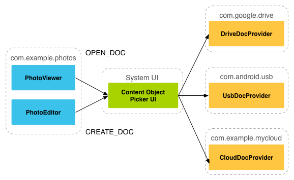

- [ストレージアクセスフレームワークを使用してファイルを開く](#ストレージアクセスフレームワークを使用してファイルを開く)
  - [概要](#概要)
  - [制御フロー](#制御フロー)
  - [クライアントアプリを作成する](#クライアントアプリを作成する)
  - [参考情報](#参考情報)
    - [サンプル](#サンプル)
    - [動画](#動画)

# ストレージアクセスフレームワークを使用してファイルを開く

Android 4.4（API レベル 19）は、ストレージアクセスフレームワーク（SAF）を採用しています。 SAF を使用すると、ユーザーは、任意のドキュメントストレージプロバイダから、ドキュメントや画像などのファイルを参照して開くことができます。標準の使いやすい UI により、ユーザーは、アプリとプロバイダの間で一貫した方法でファイルを閲覧し、最近使用したファイルにアクセスできます。

サービスをカプセル化する [DocumentsProvider](https://developer.android.com/reference/android/provider/DocumentsProvider?hl=ja&_gl=1*1dcw4qj*_up*MQ..*_ga*MTE2NzQ4NjMzNC4xNzIyNTE5MzA5*_ga_6HH9YJMN9M*MTcyMjUxOTMwOC4xLjAuMTcyMjUxOTMwOC4wLjAuMA..) ( [ContentProvider](https://developer.android.com/reference/android/content/ContentProvider) を継承) を実装することで、クラウドやローカルストレージサービスをエコシステムに参加させることができます。つまり、 **DocumentsProvider の役割は、 SAF からアクセス可能なコンテンツプロバイダを提供することです。** プロバイダのドキュメントにアクセスする必要があるクライアントアプリは、数行のコードで SAF と統合できます。

SAF には次の項目が含まれます。

- **ドキュメントプロバイダ**
  - Google ドライブなどのストレージサービスが、管理対象のファイルを公開できるようにするコンテンツプロバイダ。
  - ドキュメントプロバイダは、 DocumentsProvider クラスのサブクラスとして実装されます。 document-provider スキーマ ( `content://.../document/...` ) は、従来のファイル階層に基づくものですが、ドキュメントプロバイダが物理的にどのようにデータを格納するかはその設定次第です。 Android プラットフォームには、ダウンロード、画像、動画などの組み込みのドキュメントプロバイダがいくつか用意されています。
- **クライアントアプリ**
  - [ACTION_CREATE_DOCUMENT](https://developer.android.com/reference/android/content/Intent?hl=ja&_gl=1*1dcw4qj*_up*MQ..*_ga*MTE2NzQ4NjMzNC4xNzIyNTE5MzA5*_ga_6HH9YJMN9M*MTcyMjUxOTMwOC4xLjAuMTcyMjUxOTMwOC4wLjAuMA..#ACTION_CREATE_DOCUMENT) , [ACTION_OPEN_DOCUMENT](https://developer.android.com/reference/android/content/Intent?hl=ja&_gl=1*1fe3os0*_up*MQ..*_ga*MTE2NzQ4NjMzNC4xNzIyNTE5MzA5*_ga_6HH9YJMN9M*MTcyMjUxOTMwOC4xLjAuMTcyMjUxOTMwOC4wLjAuMA..#ACTION_OPEN_DOCUMENT) , [ACTION_OPEN_DOCUMENT_TREE](https://developer.android.com/reference/android/content/Intent?hl=ja&_gl=1*1fe3os0*_up*MQ..*_ga*MTE2NzQ4NjMzNC4xNzIyNTE5MzA5*_ga_6HH9YJMN9M*MTcyMjUxOTMwOC4xLjAuMTcyMjUxOTMwOC4wLjAuMA..#ACTION_OPEN_DOCUMENT_TREE) のインテントのアクションを呼び出し、ドキュメント プロバイダから返されたファイルを受け取るカスタムアプリ。
- **選択ツール**
  - ユーザーがクライアント アプリの検索条件を満たすすべてのドキュメント プロバイダのドキュメントにアクセスできるようにするシステム UI。

SAF には次の機能があります。

- ユーザーは 1 つのアプリだけでなく、すべてのドキュメントプロバイダのコンテンツを参照できます。
- アプリは、ドキュメントプロバイダが所有するドキュメントに長期間永続的にアクセスできるようにします。このアクセス権により、ユーザーはプロバイダでファイルを追加、編集、保存、削除できます。
- 複数のユーザーアカウントと USB ストレージプロバイダなどの一時的なルートをサポートします。一時的なルートはドライブを接続した場合にのみ表示されます。

## 概要

SAF は、 DocumentsProvider クラスのサブクラスであるコンテンツプロバイダを中心に展開します。ドキュメントプロバイダ内では、データは従来のファイル階層として構造化されています。ルートが単一ドキュメントを指し、そこからツリーのファンアウトが開始されます。

次の点にご注意ください。

- 各ドキュメントプロバイダは 1 つ以上のルートを報告します。ルートは、ドキュメントのツリーを調査する際の出発点です。各ルートは一意の [COLUMN_ROOT_ID](https://developer.android.com/reference/android/provider/DocumentsContract.Root?hl=ja&_gl=1*1p6wcw4*_up*MQ..*_ga*MTE2NzQ4NjMzNC4xNzIyNTE5MzA5*_ga_6HH9YJMN9M*MTcyMjUxOTMwOC4xLjAuMTcyMjUxOTMwOC4wLjAuMA..#COLUMN_ROOT_ID) を持ち、そのルートの下のコンテンツを表すドキュメント（ディレクトリ）を参照します。ルートは、複数のアカウント、一時的な USB ストレージデバイス、ユーザーのログインとログアウトなどのユースケースをサポートするために、動的設計となっています。
- 各ルートの下にはドキュメントが 1 つだけあります。そのドキュメントは 1～N 個のドキュメントを指し、さらにそれぞれのドキュメントも 1～N 個のドキュメントを指すことができます。
- 各ストレージバックエンドは、一意の [COLUMN_DOCUMENT_ID](https://developer.android.com/reference/android/provider/DocumentsContract.Document?hl=ja&_gl=1*17w6kai*_up*MQ..*_ga*MTE2NzQ4NjMzNC4xNzIyNTE5MzA5*_ga_6HH9YJMN9M*MTcyMjUxOTMwOC4xLjAuMTcyMjUxOTMwOC4wLjAuMA..#COLUMN_DOCUMENT_ID) を使って参照することにより、個々のファイルやディレクトリを表示します。ドキュメント ID は一意であり、デバイスの再起動後も永続的な URI を付与するために使用されるため、一度発行すると変更されることはありません。
- ドキュメントは、開くことができるファイル、特定の MIME タイプのファイル、または、ディレクトリ ( MIME タイプが [MIME_TYPE_DIR](https://developer.android.com/reference/android/provider/DocumentsContract.Document?hl=ja&_gl=1*17w6kai*_up*MQ..*_ga*MTE2NzQ4NjMzNC4xNzIyNTE5MzA5*_ga_6HH9YJMN9M*MTcyMjUxOTMwOC4xLjAuMTcyMjUxOTMwOC4wLjAuMA..#MIME_TYPE_DIR) のドキュメント) のいずれかです。
- 各ドキュメントは、さまざまな機能を持つことができ、 [COLUMN_FLAGS](https://developer.android.com/reference/android/provider/DocumentsContract.Document?hl=ja&_gl=1*17w6kai*_up*MQ..*_ga*MTE2NzQ4NjMzNC4xNzIyNTE5MzA5*_ga_6HH9YJMN9M*MTcyMjUxOTMwOC4xLjAuMTcyMjUxOTMwOC4wLjAuMA..#COLUMN_FLAGS) を使って記述します。たとえば、 [FLAG_SUPPORTS_WRITE](https://developer.android.com/reference/android/provider/DocumentsContract.Document?hl=ja&_gl=1*15vf5rl*_up*MQ..*_ga*MTE2NzQ4NjMzNC4xNzIyNTE5MzA5*_ga_6HH9YJMN9M*MTcyMjUxOTMwOC4xLjAuMTcyMjUxOTMwOC4wLjAuMA..#FLAG_SUPPORTS_WRITE) , [FLAG_SUPPORTS_DELETE](https://developer.android.com/reference/android/provider/DocumentsContract.Document?hl=ja&_gl=1*15vf5rl*_up*MQ..*_ga*MTE2NzQ4NjMzNC4xNzIyNTE5MzA5*_ga_6HH9YJMN9M*MTcyMjUxOTMwOC4xLjAuMTcyMjUxOTMwOC4wLjAuMA..#FLAG_SUPPORTS_DELETE) , [FLAG_SUPPORTS_THUMBNAIL](https://developer.android.com/reference/android/provider/DocumentsContract.Document?hl=ja&_gl=1*15vf5rl*_up*MQ..*_ga*MTE2NzQ4NjMzNC4xNzIyNTE5MzA5*_ga_6HH9YJMN9M*MTcyMjUxOTMwOC4xLjAuMTcyMjUxOTMwOC4wLjAuMA..#FLAG_SUPPORTS_THUMBNAIL) といった機能です。同じ COLUMN_DOCUMENT_ID を複数のディレクトリに含めることができます。

## 制御フロー

ドキュメントプロバイダのデータモデルは、従来のファイル階層に基づいています。ただし、 DocumentsProvider API を使用してアクセスできる限り、任意の方法でデータを物理的に保存できます。たとえば、データにタグベースのクラウドストレージを使用できます。

次の図は、写真編集アプリが、 SAF を使って、保存された写真データにアクセスする方法を表しています。

次の点にご注意ください。

- SAF では、プロバイダとクライアントは直接やり取りできません。クライアントが、ファイルを操作する権限（ファイルの読み取り、編集、作成、削除）をリクエストします。
- アプリ（この例では写真アプリ）がインテント ACTION_OPEN_DOCUMENT 、または、 ACTION_CREATE_DOCUMENT を起動すると、インタラクションが開始されます。インテントには、 "image/*" MIME タイプのファイルを取得するなど、条件をさらに絞り込むためのフィルタを含めることができます。
- インテントが起動すると、システムの選択ツールが登録済みの各プロバイダに移動し、一致するコンテンツのルートをユーザーに表示します。
- 選択ツールは、基盤となるドキュメントプロバイダが大きく異なる場合でも、ドキュメントにアクセスするための標準インターフェースを提供します。たとえば、上記の図には、 Google ドライブプロバイダ、 USB プロバイダ、クラウドプロバイダが示されています。

次の図では、ユーザーが、画像の検索時に開いた選択ツールから [ダウンロード] フォルダを選択しています。選択ツールには、クライアントアプリで使用できるすべてのルートも表示されます。

ユーザーがダウンロードフォルダを選択すると、以下の図のように、画像が表示されます。これで、ユーザーはプロバイダとクライアントアプリがサポートする方法で画像を操作できるようになります。

## クライアントアプリを作成する
 
Android 4.3 以前では、別のアプリからファイルを取得する場合、アプリは [ACTION_PICK](https://developer.android.com/reference/android/content/Intent?hl=ja&_gl=1*1fgwizw*_up*MQ..*_ga*MTE2NzQ4NjMzNC4xNzIyNTE5MzA5*_ga_6HH9YJMN9M*MTcyMjUxOTMwOC4xLjAuMTcyMjUxOTMwOC4wLjAuMA..#ACTION_PICK) や [ACTION_GET_CONTENT](https://developer.android.com/reference/android/content/Intent?hl=ja&_gl=1*1fgwizw*_up*MQ..*_ga*MTE2NzQ4NjMzNC4xNzIyNTE5MzA5*_ga_6HH9YJMN9M*MTcyMjUxOTMwOC4xLjAuMTcyMjUxOTMwOC4wLjAuMA..#ACTION_GET_CONTENT) などのインテントを呼び出す必要があります。次に、ユーザーはファイルを選択するアプリを 1 つ選択します。選択されたアプリは、ユーザーが使用可能なファイルを参照して選択できるユーザーインターフェースを提供する必要があります。

Android 4.4（API レベル 19）以降では、 [ACTION_OPEN_DOCUMENT](https://developer.android.com/reference/android/content/Intent?hl=ja&_gl=1*1daerqf*_up*MQ..*_ga*MTE2NzQ4NjMzNC4xNzIyNTE5MzA5*_ga_6HH9YJMN9M*MTcyMjUxOTMwOC4xLjAuMTcyMjUxOTMwOC4wLjAuMA..#ACTION_OPEN_DOCUMENT) インテントを使用することもできます。このインテントは、システム制御の選択ツール UI を表示し、ユーザーは他のアプリで利用できるすべてのファイルを参照できます。ユーザーは、この 1 つの UI から、サポートされるすべてのアプリのファイルを選択できます。

Android 5.0（API レベル 21）以降では、 [ACTION_OPEN_DOCUMENT_TREE](https://developer.android.com/reference/android/content/Intent?hl=ja&_gl=1*1daerqf*_up*MQ..*_ga*MTE2NzQ4NjMzNC4xNzIyNTE5MzA5*_ga_6HH9YJMN9M*MTcyMjUxOTMwOC4xLjAuMTcyMjUxOTMwOC4wLjAuMA..#ACTION_OPEN_DOCUMENT_TREE) インテントを使用して、アクセスするクライアントアプリのディレクトリをユーザーが選択することもできます。

**注**: ACTION_OPEN_DOCUMENT は ACTION_GET_CONTENT に代わるものではありません。どちらを使用するかは、アプリのニーズによって異なります。

- アプリでデータの読み取り、または、インポートを行う場合は、 ACTION_GET_CONTENT を使用します。この方法を使用すると、アプリは、画像ファイルなどのデータのコピーをインポートします。 (コンテンツへのアクセス権は **一時的** です。) 
- ACTION_OPEN_DOCUMENT は、クライアントアプリが、ドキュメントプロバイダが所有するドキュメントに、 **長期的** にアクセスしたい場合に使用します。たとえば、ドキュメントプロバイダに保存されている画像を編集できる写真編集アプリがあります。

システムの選択ツール UI を使用したファイルやディレクトリのブラウジングをサポートする方法の詳細については、 [ドキュメントやその他のファイルへのアクセス](https://developer.android.com/training/data-storage/shared/documents-files?hl=ja&_gl=1*1daerqf*_up*MQ..*_ga*MTE2NzQ4NjMzNC4xNzIyNTE5MzA5*_ga_6HH9YJMN9M*MTcyMjUxOTMwOC4xLjAuMTcyMjUxOTMwOC4wLjAuMA..) に関するガイドをご覧ください。

## 参考情報

ドキュメントプロバイダについて詳しくは、以下のリソースをご利用ください。

### サンプル

- [StorageProvider](https://github.com/android/storage-samples/tree/main/StorageProvider)

### 動画

- [DevBytes: Android 4.4 ストレージ アクセス フレームワーク: プロバイダ](http://www.youtube.com/watch?v=zxHVeXbK1P4&hl=ja)
- [ストレージアクセスフレームワークの仮想ファイル](https://www.youtube.com/watch?v=4h7yCZt231Y&hl=ja)

