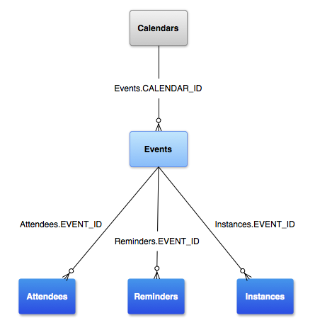

- [カレンダープロバイダの概要](#カレンダープロバイダの概要)
  - [基本情報](#基本情報)
  - [ユーザー権限](#ユーザー権限)
  - [カレンダーの表](#カレンダーの表)
  - [すべてのオペレーションにアカウントの種類を含める](#すべてのオペレーションにアカウントの種類を含める)
  - [カレンダーをクエリする](#カレンダーをクエリする)
  - [カレンダーのインテント](#カレンダーのインテント)
  - [同期アダプター](#同期アダプター)
  - [引用元資料](#引用元資料)


# カレンダープロバイダの概要

カレンダープロバイダは、ユーザーのカレンダーの予定のリポジトリです。 Calendar Provider API を使用すると、カレンダー、予定、参加者、リマインダーなどに対して、クエリ、挿入、更新、削除の各オペレーションを実行できます。

Calendar Provider API は、アプリケーションと同期アダプタで使用できます。ルールは、呼び出しを行うプログラムの種類によって異なります。このドキュメントでは、主にアプリケーションとして Calendar Provider API を使用する場合について説明します。同期アダプターの違いについては、 [同期アダプター](#同期アダプター) をご覧ください。

通常、カレンダーデータを読み書きするには、 [ユーザー権限](#ユーザー権限) で説明されているように、アプリのマニフェストに適切な権限が含まれている必要があります。一般的な操作を簡単に実行できるように、カレンダープロバイダには、 [カレンダーのインテント](#カレンダーのインテント) で説明されているように、一連のインテントが用意されています。これらのインテントは、ユーザーをカレンダーアプリに誘導して、予定の挿入、表示、編集を促します。ユーザーはカレンダーアプリを操作してから、元のアプリケーションに戻ります。これにより、アプリケーションで権限をリクエストしたり、イベントを表示または作成するためのユーザーインターフェースを用意したりする必要がありません。


## 基本情報

[コンテンツプロバイダ](./1.コンテンツプロバイダについて.md) は、データを保存し、アプリからアクセスできるようにします。 Android プラットフォームが提供するコンテンツプロバイダ（カレンダープロバイダを含む）は通常、リレーショナルデータベースモデルに基づく一連のテーブルとしてデータを公開します。この場合、各行はレコード、各列は特定の型と意味のデータです。 Calendar Provider API により、「アプリケーション」と「同期アダプター」は、ユーザーのカレンダーデータが格納されているデータベーステーブルに対する読み取り / 書き込みアクセス権を取得できます。

すべてのコンテンツプロバイダは、データセットを一意に識別する公開 URI（ [Uri](https://developer.android.com/reference/android/net/Uri?hl=ja) オブジェクトでラップ）を公開します。複数のデータセット（複数のテーブル）を制御するコンテンツプロバイダは、データセットごとに個別の URI を公開します。プロバイダの URI はすべて、文字列「 `content://` 」で始まります。これにより、そのデータがコンテンツプロバイダによって管理されていることが識別されます。カレンダープロバイダは、各クラス（テーブル）の URI の定数を定義します。これらの URI の形式は `<class>.CONTENT_URI` です。例: [Events.CONTENT_URI](https://developer.android.com/reference/android/provider/CalendarContract.Events?hl=ja#CONTENT_URI)

以下の図は、カレンダープロバイダのデータモデルを図示したものです。 Calendars , Events , Attendees , Reminders , Instances は、全てテーブルです。鳥の足のような三本線は、 「 1 対 多」 を意味します。



- Calendars
  - カレンダーそのものの情報（例：Googleカレンダー、Workカレンダーなど）
- Events
  - 各カレンダーに登録されたイベントの情報（例：会議、誕生日）
- Attendees
  - イベントに参加する人（参加者）の情報
- Reminders
  - イベントのリマインダー情報（通知の時間など）
- Instances
  - 繰り返しイベントを設定した際の各イベントのインスタンス情報（日時など）

- Events.CALENDAR_ID
  - Events テーブルに含まれる CALENDAR_ID 列を示します。
  - Events テーブルの各レコードが、 Calendars テーブルのどのレコードに紐づくかを示すものです。
  - 一つのカレンダーには、複数のイベントが紐づきます。
- Reminders.EVENT_ID
  - Reminders テーブルに含まれる EVENT_ID 列を示します。
  - Reminders テーブルの各レコードが、 Events テーブルのどのレコードに紐づくかを示すものです。
  - 一つのイベントには、複数のリマインダーが紐づきます。
- Attendees.EVENT_ID
  - Attendees テーブルに含まれる EVENT_ID 列を示します。
  - 同上
- Instances.EVENT_ID
  - Instances テーブルに含まれる EVENT_ID 列を示します。
  - 同上

1 人のユーザーが複数のカレンダーを持つことができ、別々のカレンダーを異なる種類のアカウント（Google カレンダー、Exchange など）に関連付けることができます。

[CalendarContract](https://developer.android.com/reference/android/provider/CalendarContract?hl=ja) は、カレンダーと予定関連の情報のデータモデルを定義します。このデータは、以下に示すいくつかのテーブルに保存されます。

- [CalendarContract.Calendars](https://developer.android.com/reference/android/provider/CalendarContract.Calendars?hl=ja)
  - このテーブルにはカレンダー固有の情報が格納されます。この表の各行には、1 つのカレンダーの詳細（名前、色、同期情報など）が含まれています。
- [CalendarContract.Events](https://developer.android.com/reference/android/provider/CalendarContract.Events?hl=ja)
  - このテーブルにはイベント固有の情報が保持されます。このテーブルの各行には、1 つのイベントの情報（イベントのタイトル、場所、開始時間、終了時間など）が含まれています。
  - イベントは 1 回だけ発生する場合もありますが、複数回繰り返される場合もあります。
  - 参加者、リマインダー、拡張プロパティは別々のテーブルに保存されます。各イベントには、イベント テーブルの [_ID](https://developer.android.com/reference/android/provider/BaseColumns?hl=ja#_ID) を参照する [EVENT_ID](https://developer.android.com/reference/android/provider/CalendarContract.AttendeesColumns?hl=ja#EVENT_ID) があります。
- [CalendarContract.Instances](https://developer.android.com/reference/android/provider/CalendarContract.Instances?hl=ja)
  - このテーブルには、イベントの発生ごとの開始時刻と終了時刻が保持されます。
  - このテーブルの各行は、1 つのイベントの発生を表します。
  - 1 回限りのイベントの場合、インスタンスとイベントが 1 対 1 でマッピングされます。
  - 定期的なイベントの場合は、そのイベントの複数回の発生に対応する複数の行が自動的に生成されます。
- [CalendarContract.Attendees](https://developer.android.com/reference/android/provider/CalendarContract.Attendees?hl=ja)
  - このテーブルには、イベントの参加者（ゲスト）の情報が格納されます。
  - 各行は、イベントの 1 人のゲストを表します。ゲストのタイプと、ゲストのイベントへの出欠の回答を指定します。
- [CalendarContract.Reminders](https://developer.android.com/reference/android/provider/CalendarContract.Reminders?hl=ja)
  - このテーブルには、アラート / 通知データが格納されます。
  - 各行は、イベント 1 件のアラートを表します。
  - 1 つのイベントに複数のリマインダーを設定できます。
  - イベントあたりのリマインダーの最大数は [MAX_REMINDERS](https://developer.android.com/reference/android/provider/CalendarContract.CalendarColumns?hl=ja#MAX_REMINDERS) で指定され、指定されたカレンダーを所有する同期アダプターが設定します。
  - リマインダーは、イベントの分前に指定され、ユーザーへのアラート方法を決定するメソッドがあります。

Calendar Provider API は、高い柔軟性と機能性を兼ね備えた設計になっています。同時に、優れたエンドユーザー エクスペリエンスを提供し、カレンダーとそのデータの整合性を保護することも重要です。そのため、API を使用する場合は、次の点に注意してください。

- **カレンダーの予定を挿入、更新、表示**
  - カレンダープロバイダから予定を直接挿入、変更、読み取るには、適切な [権限](#ユーザー権限) が必要です。ただし、本格的なカレンダーアプリケーションや同期アダプターを作成しない場合は、これらの権限をリクエストする必要はありません。
  - 代わりに、 Android のカレンダーアプリでサポートされているインテントを使用して、読み取り、および、書き込みオペレーションをそのアプリに渡すことができます。
  - インテントを使用すると、アプリからユーザーをカレンダーアプリに誘導して、事前に入力されたフォームに目的の操作を実行させることができます。
  - 処理が完了すると、アプリケーションに戻ります。
  - カレンダーを使用して一般的な操作を行うようにアプリケーションを設計することで、一貫性のある堅牢なユーザーインターフェースをユーザーに提供できます。これはおすすめの方法です。
  - 詳細については、 [カレンダーのインテント](#カレンダーのインテント) をご覧ください。
- **同期アダプター**
  - 同期アダプターは、ユーザーのデバイス上のカレンダーデータを別のサーバー、または、データソースと同期します。
  - [CalendarContract.Calendars](https://developer.android.com/reference/android/provider/CalendarContract.Calendars?hl=ja) テーブルと [CalendarContract.Events](https://developer.android.com/reference/android/provider/CalendarContract.Events?hl=ja) テーブルには、同期アダプター用に予約される列があります。
  - プロバイダとアプリケーションはこれらを変更しないでください。
  - 実際には、同期アダプターとしてアクセスされない限り表示されません。
  - 同期アダプターの詳細については、 [同期アダプター](#同期アダプター) をご覧ください。

Android の「同期アダプター（SyncAdapter）」は、バックグラウンドでサーバーとデバイス間のデータ同期を効率的に行う仕組みです。たとえば、Google アカウントのメールやカレンダー、連絡先が定期的にサーバーと同期されているのも、この SyncAdapter のおかげです。

SyncAdapter を使うには、以下のコンポーネントが必要です。

- SyncAdapter クラス
  - 実際の同期処理を実装するクラス（AbstractThreadedSyncAdapter を継承）
- ContentProvider
  - 同期対象のデータへのアクセスを提供（ローカルDBやファイル）
- Account
  - 同期対象のアカウント情報（例：Google アカウント、独自アカウント）
- SyncAdapter.xml
  - メタデータを記述する XML（認証タイプ、同期可否など）
- AccountAuthenticator
  - アカウントの認証情報を管理する仕組み（必要に応じて）

SyncAdapter は、コンテンツプロバイダ専用の同期メカニズムです。以下の関数は、 SyncAdapter がデータを同期する際に実行する関数です。この関数は、 ContentProviderClient を引数にとっており、これは、 SyncAdapter がコンテンツプロバイダ専用の仕組みであることを示しています。

```kotlin
override fun onPerformSync(account: Account, extras: Bundle, authority: String, provider: ContentProviderClient, syncResult: SyncResult) {
    // ContentProviderClient を通じてコンテンツプロバイダにアクセス
    val cursor = provider.query(uri, projection, selection, selectionArgs, sortOrder)
    // データを更新
    provider.update(uri, values, selection, selectionArgs)
}
```


## ユーザー権限

カレンダー データを読み取るには、アプリのマニフェスト ファイルに [READ_CALENDAR](https://developer.android.com/reference/android/Manifest.permission?hl=ja#READ_CALENDAR) 権限を含める必要があります。カレンダー データを削除、挿入、更新するには、 [WRITE_CALENDAR](https://developer.android.com/reference/android/Manifest.permission?hl=ja#WRITE_CALENDAR) 権限が必要です。

```xml
<?xml version="1.0" encoding="utf-8"?>
<manifest xmlns:android="http://schemas.android.com/apk/res/android"...>
    <uses-sdk android:minSdkVersion="14" />
    <uses-permission android:name="android.permission.READ_CALENDAR" />
    <uses-permission android:name="android.permission.WRITE_CALENDAR" />
    ...
</manifest>
```

minSdkVersion は、 build.gradle で設定することもできるし、マニフェストファイルでも設定することができる。ただし、すべての設定を一か所に集めるために、 build.gradle で設定することが推奨されています。

これらの権限は、 API Level 1 から使用可能ですが、なぜか、サンプルコードでは、 minSdkVersion が指定されています。


## カレンダーの表

[CalendarContract.Calendars](https://developer.android.com/reference/android/provider/CalendarContract.Calendars?hl=ja) テーブルには、個々のカレンダーの詳細が格納されています。以下の Calendars の列は、アプリケーションと [同期アダプター](#同期アダプター) の両方から書き込み可能です。サポートされているフィールドの一覧については、 [CalendarContract.Calendars](https://developer.android.com/reference/android/provider/CalendarContract.Calendars?hl=ja) リファレンスをご覧ください。

- [NAME](https://developer.android.com/reference/android/provider/CalendarContract.Calendars?hl=ja#NAME)
  - カレンダーの名前
- [CALENDAR_DISPLAY_NAME](https://developer.android.com/reference/android/provider/CalendarContract.CalendarColumns?hl=ja#CALENDAR_DISPLAY_NAME)
  - ユーザーに表示されるこのカレンダーの名前
- [VISIBLE](https://developer.android.com/reference/android/provider/CalendarContract.CalendarColumns?hl=ja#VISIBLE)
  - カレンダーが表示対象として選択されているかどうかを示すブール値。
  - 0 は、このカレンダーに関連付けられている予定が表示されないことを示します。
  - 値が 1 の場合、このカレンダーに関連付けられている予定が表示されます。
  - この値は、 [CalendarContract.Instances](https://developer.android.com/reference/android/provider/CalendarContract.Instances?hl=ja) テーブルの行の生成に影響します。
- [SYNC_EVENTS](https://developer.android.com/reference/android/provider/CalendarContract.CalendarColumns?hl=ja#SYNC_EVENTS)
  - カレンダーを同期し、そのイベントをデバイスに保存するかどうかを示すブール値。
  - 0 は、このカレンダーを同期しない、または、予定をデバイスに保存しないことを示します。
  - 値 1 は、このカレンダーの予定を同期してその予定をデバイスに保存することを意味します。


## すべてのオペレーションにアカウントの種類を含める

[Calendars.ACCOUNT_NAME](https://developer.android.com/reference/android/provider/CalendarContract.SyncColumns?hl=ja#ACCOUNT_NAME) に対してクエリを実行する場合は、選択内容に [Calendars.ACCOUNT_TYPE](https://developer.android.com/reference/android/provider/CalendarContract.SyncColumns?hl=ja#ACCOUNT_TYPE) も含める必要があります。これは、特定のアカウントは、その ACCOUNT_NAME と ACCOUNT_TYPE の両方が与えられている場合にのみ一意であると見なされるためです。 ACCOUNT_TYPE は、 [AccountManager](https://developer.android.com/reference/android/accounts/AccountManager?hl=ja) でアカウントを登録したときに使用されたアカウント認証システムに対応する文字列です。デバイスアカウントに関連付けられていないカレンダー用に、 [ACCOUNT_TYPE_LOCAL](https://developer.android.com/reference/android/provider/CalendarContract?hl=ja#ACCOUNT_TYPE_LOCAL) という特別なタイプのアカウントもあります。 ACCOUNT_TYPE_LOCAL のアカウントは同期されません。


## カレンダーをクエリする

次の例は、特定のユーザーが所有するカレンダーを取得する方法を示しています。わかりやすくするために、この例では、クエリオペレーションをユーザーインターフェーススレッド（「メインスレッド」）内で処理しています。実際には、メインスレッドではなく非同期スレッドで実行する必要があります。詳しくは、 [ローダ](https://developer.android.com/guide/components/loaders?hl=ja) (現在は非推奨) をご覧ください。データを読み取るだけでなく変更する場合は、 [AsyncQueryHandler](https://developer.android.com/reference/android/content/AsyncQueryHandler?hl=ja) をご覧ください。

```kotlin
// Projection array. Creating indices for this array instead of doing
// dynamic lookups improves performance.
private val EVENT_PROJECTION: Array<String> = arrayOf(
        CalendarContract.Calendars._ID,                     // 0
        CalendarContract.Calendars.ACCOUNT_NAME,            // 1
        CalendarContract.Calendars.CALENDAR_DISPLAY_NAME,   // 2
        CalendarContract.Calendars.OWNER_ACCOUNT            // 3
)

// The indices for the projection array above.
private const val PROJECTION_ID_INDEX: Int = 0
private const val PROJECTION_ACCOUNT_NAME_INDEX: Int = 1
private const val PROJECTION_DISPLAY_NAME_INDEX: Int = 2
private const val PROJECTION_OWNER_ACCOUNT_INDEX: Int = 3
```


## カレンダーのインテント


## 同期アダプター


## 引用元資料

- [カレンダープロバイダの概要](https://developer.android.com/guide/topics/providers/calendar-provider?hl=ja&_gl=1*co2nbw*_up*MQ..*_ga*MTE2NzQ4NjMzNC4xNzIyNTE5MzA5*_ga_6HH9YJMN9M*MTcyMjUxOTMwOC4xLjAuMTcyMjUxOTMwOC4wLjAuMA..)


