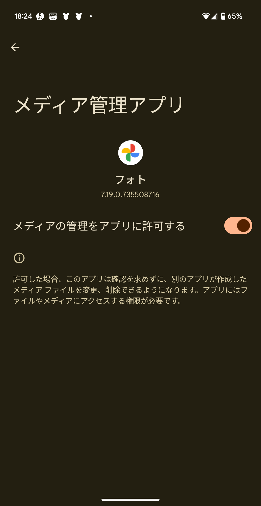

- [共有ストレージからメディアファイルにアクセスする](#共有ストレージからメディアファイルにアクセスする)
  - [MediaStore の役割](#mediastore-の役割)
  - [写真選択ツール](#写真選択ツール)
  - [メディアストア](#メディアストア)
  - [必要な権限をリクエストする](#必要な権限をリクエストする)
    - [ストレージへの権限](#ストレージへの権限)
      - [自分のメディアファイルにアクセスする](#自分のメディアファイルにアクセスする)
      - [他のアプリのメディアファイルにアクセスする](#他のアプリのメディアファイルにアクセスする)
      - [以前のデバイスで実行されているアプリには追加の権限が必要](#以前のデバイスで実行されているアプリには追加の権限が必要)
      - [他のアプリがダウンロードしたファイルを利用するにはストレージアクセスフレームワークを使用する](#他のアプリがダウンロードしたファイルを利用するにはストレージアクセスフレームワークを使用する)
    - [メディアの位置情報に関する権限](#メディアの位置情報に関する権限)
  - [メディアストアのスキーマの更新を検出する](#メディアストアのスキーマの更新を検出する)
  - [メディアコレクションをクエリする](#メディアコレクションをクエリする)
  - [ファイルのサムネイルを読み込む](#ファイルのサムネイルを読み込む)
  - [メディアファイルを開く](#メディアファイルを開く)
    - [ファイル記述子](#ファイル記述子)
    - [ファイルストリーム](#ファイルストリーム)
      - [例１：画像ファイルを開いて Bitmap に変換する](#例１画像ファイルを開いて-bitmap-に変換する)
      - [例２：テキストファイルを開いて内容を文字列に変換](#例２テキストファイルを開いて内容を文字列に変換)
    - [直接ファイルパス](#直接ファイルパス)
  - [メディアコンテンツにアクセスする際の考慮事項](#メディアコンテンツにアクセスする際の考慮事項)
    - [キャッシュデータが最新かどうかを確認する](#キャッシュデータが最新かどうかを確認する)
    - [パフォーマンス](#パフォーマンス)
    - [MediaStore テーブルの DATA 列（実ファイルのパス）](#mediastore-テーブルの-data-列実ファイルのパス)
      - [Android 11 未満では DATA 列を更新できた](#android-11-未満では-data-列を更新できた)
      - [Android 11 以降では DATA 列を更新できなくなった](#android-11-以降では-data-列を更新できなくなった)
    - [ストレージボリューム](#ストレージボリューム)
    - [メディアがキャプチャ（作成）された場所](#メディアがキャプチャ作成された場所)
      - [写真の位置情報にアクセスする](#写真の位置情報にアクセスする)
        - [注意点](#注意点)
          - [1. Android 10（API 29）以降で使用可能](#1-android-10api-29以降で使用可能)
          - [2. 適切な権限が必要](#2-適切な権限が必要)
          - [3. SecurityException の可能性](#3-securityexception-の可能性)
      - [動画の位置情報にアクセスする](#動画の位置情報にアクセスする)
    - [共有](#共有)
      - [写真データを他のアプリに共有する例（引用元：ChatGPT）](#写真データを他のアプリに共有する例引用元chatgpt)
        - [概要](#概要)
          - [実装の流れ](#実装の流れ)
          - [具体的なコード例](#具体的なコード例)
          - [注意点](#注意点-1)
    - [アプリとメディアファイルの紐付け](#アプリとメディアファイルの紐付け)
      - [【考察】ファイルがアプリに紐づけられるのか？アプリがファイルに紐づけられるのか？](#考察ファイルがアプリに紐づけられるのかアプリがファイルに紐づけられるのか)
  - [アイテムを追加する](#アイテムを追加する)
    - [メディアファイルの保留中ステータスを切り替える](#メディアファイルの保留中ステータスを切り替える)
      - [openOutputStream() 関数と openFileDescriptor() 関数の違い](#openoutputstream-関数と-openfiledescriptor-関数の違い)
        - [openOutputStream() 関数を使用したファイル出力](#openoutputstream-関数を使用したファイル出力)
        - [openFileDescriptor() 関数を使用したファイル出力](#openfiledescriptor-関数を使用したファイル出力)
          - [openFileDescriptor() 関数を使用してファイルサイズを取得する](#openfiledescriptor-関数を使用してファイルサイズを取得する)
    - [ファイルの場所に関するヒントを提供する（共有フォルダにサブフォルダを作成して、そこにファイルを保存する）](#ファイルの場所に関するヒントを提供する共有フォルダにサブフォルダを作成してそこにファイルを保存する)
      - [サンプル](#サンプル)
        - [1. FileOutputStream を使ってファイルに保存](#1-fileoutputstream-を使ってファイルに保存)
        - [2. 【参考】ByteArrayOutputStream を使ってメモリ上に保存](#2-参考bytearrayoutputstream-を使ってメモリ上に保存)
        - [3. 【参考】ネットワーク上のサーバーにデータを出力する例](#3-参考ネットワーク上のサーバーにデータを出力する例)
  - [アイテムを更新する](#アイテムを更新する)
    - [実際のファイルシステム上のファイル名を更新する](#実際のファイルシステム上のファイル名を更新する)
    - [ネイティブコードでの更新](#ネイティブコードでの更新)
    - [他のアプリのメディアファイルを更新する](#他のアプリのメディアファイルを更新する)
    - [グループで更新する](#グループで更新する)
  - [アイテムを削除する](#アイテムを削除する)
    - [他のアプリのファイルを削除する](#他のアプリのファイルを削除する)
    - [グループで削除する](#グループで削除する)
  - [メディアストアのメタデータのデータの更新を検出する](#メディアストアのメタデータのデータの更新を検出する)
  - [メディアファイルのグループを管理する（一括操作）](#メディアファイルのグループを管理する一括操作)
    - [メディア管理の権限](#メディア管理の権限)
  - [メディアストアの代替手段が必要なユースケース](#メディアストアの代替手段が必要なユースケース)
    - [他の種類のファイルを処理する](#他の種類のファイルを処理する)
    - [コンパニオンアプリでファイル共有を行う](#コンパニオンアプリでファイル共有を行う)
  - [参考情報](#参考情報)
    - [サンプル](#サンプル-1)
    - [動画](#動画)


# 共有ストレージからメディアファイルにアクセスする

多くのアプリは、充実したユーザーエクスペリエンスを提供するために、外部ストレージボリュームのメディアに、ユーザーがアクセスできる機能を備えています。フレームワークは、「メディアストア」と呼ばれるメディアコレクションに対して、最適化されたインデックスを提供します。これにより、ユーザーは、メディアファイルをより簡単に取得、および、更新できるようになります。アプリがアンインストールされても、この種のファイルはユーザーのデバイスに残ります。

**注**: アプリ内でのみユーザーが利用できるメディアファイルを使用する場合は、それらのファイルを [外部ストレージ内のアプリ専用のディレクトリ](../3.アプリ固有のストレージに保存する.md/#メディアコンテンツ) に保存することをおすすめします。


## MediaStore の役割

MediaStore は、コンテンツプロバイダの一種です。 MediaStore コンテンツプロバイダは、以下の 2 つの役割を担います。

- メディアファイルのメタデータを保持するデータベースを管理する。
- 実際のファイルシステム上のメディアファイルにアクセスする API を提供する。


## 写真選択ツール

メディアストアの代わりとして、Android の写真選択ツールがあります。このツールには、メディアファイルを安全に選択できる機能が組み込まれていて、メディアライブラリ全体へのアクセス権をアプリに付与する必要はありません。この機能は、サポートされているデバイスでのみ使用できます。詳しくは、 [写真選択ツール](./3.写真選択ツール.md) のガイドをご覧ください。

写真選択ツールは、ユーザーが写真 or 動画を選択する UI を提供し、選択された写真 or 動画の URI を返すツールとなっています。 **このドキュメントでは、主に、写真選択ツール等を使用して、既に URI がわかっているファイルを開く** 場合の説明です。


## メディアストア

メディアストアを操作するには、アプリのコンテキストから取得した ContentResolver オブジェクトを使用します。以下は、メディアストア上のファイルのメタデータを取得する例です。

```kotlin
val projection = arrayOf(/* 列名 */)
val selection = /* where 句 */
val selectionArgs = /* where 句のプレースホルダに代入する値 */
val sortOrder = /* ソートオーダー */

applicationContext.contentResolver.query(
    MediaStore.メディアタイプ.Media.EXTERNAL_CONTENT_URI,
    projection,
    selection,
    selectionArgs,
    sortOrder
)?.use { cursor ->
    while (cursor.moveToNext()) {
        // メディアアイテムの URI を取得するために
        // ID 列を使用します。
    }
}
```

システムは、外部ストレージボリューム ( `/storage/emulated/0/` ) を自動的にスキャンします。これにより、ファイルシステム上に実ファイルが作成された際に、そのファイルのメタデータを、以下の定義済みのコレクションに追加します。

- **画像（写真とスクリーンショットを含む）**
  - システムは、 DCIM/ ディレクトリと Pictures/ ディレクトリに保存された画像ファイルを [MediaStore.Images](https://developer.android.com/reference/android/provider/MediaStore.Images?hl=ja&_gl=1*2m7bhy*_up*MQ..*_ga*MjI0NTM2NDk1LjE3MjI3NDg4Mzc.*_ga_6HH9YJMN9M*MTcyMjc0ODgzNy4xLjAuMTcyMjc0ODgzNy4wLjAuMA..) テーブルに追加します。
- **動画**
  - システムは、 DCIM/、Movies/、Pictures/ ディレクトリに保存された動画ファイルを [MediaStore.Video](https://developer.android.com/reference/android/provider/MediaStore.Video?hl=ja&_gl=1*2m7bhy*_up*MQ..*_ga*MjI0NTM2NDk1LjE3MjI3NDg4Mzc.*_ga_6HH9YJMN9M*MTcyMjc0ODgzNy4xLjAuMTcyMjc0ODgzNy4wLjAuMA..) テーブルに追加します。
- **オーディオファイル**
  - システムは、 Alarms/、Audiobooks/、Music/、Notifications/、Podcasts/、Ringtones/ ディレクトリに保存されたファイルと、 Music/、Movies/ に保存されたプレイリストと、 Recordings/ に保存されたボイスレコードデータをを [MediaStore.Audio](https://developer.android.com/reference/android/provider/MediaStore.Audio?hl=ja&_gl=1*2m7bhy*_up*MQ..*_ga*MjI0NTM2NDk1LjE3MjI3NDg4Mzc.*_ga_6HH9YJMN9M*MTcyMjc0ODgzNy4xLjAuMTcyMjc0ODgzNy4wLjAuMA..) テーブルに追加します。
  - Recordings/ ディレクトリは、 Android 11（ API レベル 30 ）以前では使用できません。
- **ダウンロードされたファイル**
  - Android 10（API レベル 29）以上を実行しているデバイスでは、 Download/ ディレクトリに保存されたファイルを [MediaStore.Downloads](https://developer.android.com/reference/android/provider/MediaStore.Downloads?hl=ja&_gl=1*e9p2mf*_up*MQ..*_ga*MjI0NTM2NDk1LjE3MjI3NDg4Mzc.*_ga_6HH9YJMN9M*MTcyMjc0ODgzNy4xLjAuMTcyMjc0ODgzNy4wLjAuMA..) テーブルに追加します。
  - このテーブルは、 Android 9（ API レベル 28 ）以前では使用できません。

メディアストアには、 [MediaStore.Files](https://developer.android.com/reference/android/provider/MediaStore.Files?hl=ja&_gl=1*e9p2mf*_up*MQ..*_ga*MjI0NTM2NDk1LjE3MjI3NDg4Mzc.*_ga_6HH9YJMN9M*MTcyMjc0ODgzNy4xLjAuMTcyMjc0ODgzNy4wLjAuMA..) というコレクションも含まれています。このコレクションのコンテンツは、アプリが対象範囲別ストレージ ( Android 10 以上をターゲットとするアプリで利用可能) を使用しているかどうかによって、異なります。

- **対象範囲別ストレージが有効になっている場合**
  - MediaStore.Files コレクションは、自分のアプリが作成した写真、動画、オーディオファイルのみを表示します。
  - ほとんどのデベロッパーは MediaStore.Files を使用して、他のアプリのメディアファイルを表示する必要はありませんが、必要な場合は、 [READ_EXTERNAL_STORAGE 権限を宣言](#ストレージへの権限) して、表示してください。
  - ただし、他のアプリが作成したメディアファイルを開くには、 MediaStore API を使用して [ファイルを開く](#メディアファイルを開く) ことをおすすめします。
- **対象範囲別ストレージが使用できない場合、または、使用されていない場合**
  - このコレクションは、すべてのタイプのメディアファイルを表示します。


## 必要な権限をリクエストする

メディアファイルに対するオペレーションを実行する前に、自分のアプリが、メディアファイルにアクセスするために必要な権限を宣言していることを確認します。ただし、アプリで不要な権限や使用しない権限を宣言しないように注意してください。


### ストレージへの権限

アプリが、ストレージにアクセスするための権限が必要かどうかは、 「自分のアプリが作成したファイルにのみアクセスする」 か、あるいは、 「他のアプリによって作成されたファイルにもアクセスする」 かによって異なります。


#### 自分のメディアファイルにアクセスする

Android 10 以降を実行しているデバイスでは、自分のアプリが所有するメディアファイル ( MediaStore.Downloads コレクションのファイルも含む) の参照や更新に権限は必要ありません。たとえば、カメラアプリを開発する場合、撮影した写真にアクセスするためのストレージ関連の **権限をリクエストする必要はありません。** メディアストアに保存した画像の所有者は、自分のアプリだからです。


#### 他のアプリのメディアファイルにアクセスする

他のアプリが作成したメディアファイルにアクセスするには、適切なストレージ関連の権限を宣言する必要があります。また、ファイルが次のいずれかのメディアコレクションになければなりません。

- [MediaStore.Images](https://developer.android.com/reference/android/provider/MediaStore.Images?hl=ja&_gl=1*o3mtwz*_up*MQ..*_ga*MjI0NTM2NDk1LjE3MjI3NDg4Mzc.*_ga_6HH9YJMN9M*MTcyMjc0ODgzNy4xLjAuMTcyMjc0ODgzNy4wLjAuMA..)

- [MediaStore.Video](https://developer.android.com/reference/android/provider/MediaStore.Video?hl=ja&_gl=1*o3mtwz*_up*MQ..*_ga*MjI0NTM2NDk1LjE3MjI3NDg4Mzc.*_ga_6HH9YJMN9M*MTcyMjc0ODgzNy4xLjAuMTcyMjc0ODgzNy4wLjAuMA..)

- [MediaStore.Audio](https://developer.android.com/reference/android/provider/MediaStore.Audio?hl=ja&_gl=1*o3mtwz*_up*MQ..*_ga*MjI0NTM2NDk1LjE3MjI3NDg4Mzc.*_ga_6HH9YJMN9M*MTcyMjc0ODgzNy4xLjAuMTcyMjc0ODgzNy4wLjAuMA..)

MediaStore.Images、MediaStore.Video、または、 MediaStore.Audio クエリで表示できるファイルであれば、 [MediaStore.Files](https://developer.android.com/reference/android/provider/MediaStore.Files?hl=ja&_gl=1*o3mtwz*_up*MQ..*_ga*MjI0NTM2NDk1LjE3MjI3NDg4Mzc.*_ga_6HH9YJMN9M*MTcyMjc0ODgzNy4xLjAuMTcyMjc0ODgzNy4wLjAuMA..) クエリでも表示できます。

次のコードスニペットは、適切なストレージ権限の宣言方法を示しています。これらは、デンジャラスパーミッションであるため、実行時に権限をリクエストする必要があります。

```xml
<!-- 他のアプリが作成した画像 or 写真にのみアクセスを要求する場合 -->
<uses-permission android:name="android.permission.READ_MEDIA_IMAGES" />

<!-- 他のアプリが作成した動画にのみアクセスを要求する場合 -->
<uses-permission android:name="android.permission.READ_MEDIA_VIDEO" />

<!-- 他のアプリが作成したオーディオにのみアクセスを要求する場合 -->
<uses-permission android:name="android.permission.READ_MEDIA_AUDIO" />
```

**注**: READ_MEDIA_IMAGES 権限と READ_MEDIA_VIDEO 権限の両方を同時にリクエストすると、両方の権限が記載された実行時の権限ダイアログが 1 つ表示されます。


#### 以前のデバイスで実行されているアプリには追加の権限が必要

Android 9 以前を搭載しているデバイスで、アプリを使用する場合、または、アプリで一時的に対象範囲別ストレージをオプトアウトしている場合は、メディアファイルにアクセスするための [READ_EXTERNAL_STORAGE](https://developer.android.com/reference/android/Manifest.permission?hl=ja&_gl=1*hpjtre*_up*MQ..*_ga*MjI0NTM2NDk1LjE3MjI3NDg4Mzc.*_ga_6HH9YJMN9M*MTcyMjc0ODgzNy4xLjAuMTcyMjc0ODgzNy4wLjAuMA..#READ_EXTERNAL_STORAGE) 権限をリクエストする必要があります。メディアファイルを変更する場合は、 [WRITE_EXTERNAL_STORAGE](https://developer.android.com/reference/android/Manifest.permission?hl=ja&_gl=1*hpjtre*_up*MQ..*_ga*MjI0NTM2NDk1LjE3MjI3NDg4Mzc.*_ga_6HH9YJMN9M*MTcyMjc0ODgzNy4xLjAuMTcyMjc0ODgzNy4wLjAuMA..#WRITE_EXTERNAL_STORAGE) 権限もリクエストする必要があります。

```xml
<uses-permission android:name="android.permission.READ_EXTERNAL_STORAGE"/>

<!-- APIレベル29（Android 10）以下のデバイスでのみで、権限を有効とする方法 -->
<!-- APIレベル30（Android 11）以上のデバイスでは、権限をリクエストしません。 -->
<uses-permission
    android:name="android.permission.WRITE_EXTERNAL_STORAGE"
    android:maxSdkVersion="29" />
```


#### 他のアプリがダウンロードしたファイルを利用するにはストレージアクセスフレームワークを使用する

他のアプリが作成した MediaStore.Downloads コレクション内のファイルにアクセスする場合は、ストレージアクセスフレームワーク ( SAF ) を使用する必要があります。 (おそらく、 MediaStore では、 Downloads コレクションにアクセスするための権限が存在しないため、 SAF を使用する必要があると思われる。) このフレームワークの使用方法については、 [共有ストレージのドキュメントやファイルにアクセスする](./4.ドキュメントおよび他のファイル.md) をご覧ください。


### メディアの位置情報に関する権限

Android 10（API レベル 29）以降をターゲットとするアプリで、写真の無編集の EXIF ( EXchangeable Image File format : エグジフ) メタデータを取得する必要がある場合は、アプリのマニフェストで [ACCESS_MEDIA_LOCATION](https://developer.android.com/reference/android/Manifest.permission?hl=ja&_gl=1*ar1xrr*_up*MQ..*_ga*MjI0NTM2NDk1LjE3MjI3NDg4Mzc.*_ga_6HH9YJMN9M*MTcyMjc0ODgzNy4xLjAuMTcyMjc0ODgzNy4wLjAuMA..#ACCESS_MEDIA_LOCATION) 権限を宣言してから、実行時にこの権限をリクエストする必要があります。

**注意**: ACCESS_MEDIA_LOCATION 権限のリクエストは実行時に行われるため、写真の無編集の EXIF メタデータにアプリがアクセスできる保証はありません。この情報へのアクセス権を取得するには、明示的なユーザーの同意が必要です。


## メディアストアのスキーマの更新を検出する

このセクションは、 `MediaStore.getVersion()` の使用方法に関する説明ですが、公式ドキュメントの説明は非常にわかりずらいため、 [getVersion() で更新を検出するサンプル](./MediaStore%20内のデータの同期.md/#getversion-でスキーマの更新を検出する) を参照してください。


## メディアコレクションをクエリする

特定の条件（「再生時間が 5 分以上」など）を満たすメディアを検索するには、次のコードスニペットに示すように、 SQL に似た選択ステートメントを使用します。

```kotlin
// もし、他のアプリが作成したビデオファイルにアクセスする場合には、
// READ_EXTERNAL_STORAGE 権限が必要です。

// 各ビデオに関する情報のコンテナ
data class Video(
    val uri: Uri,
    val name: String,
    val duration: Int,
    val size: Int
)
val videoList = mutableListOf<Video>()

// 動画が格納されている URI を取得
val collection =
    if (Build.VERSION.SDK_INT >= Build.VERSION_CODES.Q) {
        // Android 10 ( API 29 ) 以上
        MediaStore.Video.Media.getContentUri(
            MediaStore.VOLUME_EXTERNAL
        )
    } else {
        // Android 10 ( API 29 ) 未満
        MediaStore.Video.Media.EXTERNAL_CONTENT_URI
    }

// コンテンツプロバイダから取得したい列を指定
val projection = arrayOf(
    MediaStore.Video.Media._ID,
    MediaStore.Video.Media.DISPLAY_NAME,
    MediaStore.Video.Media.DURATION,
    MediaStore.Video.Media.SIZE
)

// 抽出条件を指定
val selection = "${MediaStore.Video.Media.DURATION} >= ?"
val selectionArgs = arrayOf(
    TimeUnit.MILLISECONDS.convert(5, TimeUnit.MINUTES).toString()
)

// 並び順を指定 (ファイル名の昇順を指定)
val sortOrder = "${MediaStore.Video.Media.DISPLAY_NAME} ASC"

// MediaStore にクエリを発行し、条件に一致するデータを取得
val query = ContentResolver.query(
    collection,
    projection,
    selection,
    selectionArgs,
    sortOrder
)

// クエリ結果をカーソルで処理
query?.use { cursor ->
    // 列のインデックスを取得
    // 
    // コンテンツプロバイダは、内部的に、列を列名で管理しているのではなく、配列のようなインデックスで管理しています。
    // そのため、各列のデータを取得するには、列名ではなく、そのインデックスを指定する必要があります。
    // 
    // 該当する列名の列が存在しない場合には、例外をスローします。
    val idColumn = cursor.getColumnIndexOrThrow(MediaStore.Video.Media._ID)
    val nameColumn =
            cursor.getColumnIndexOrThrow(MediaStore.Video.Media.DISPLAY_NAME)
    val durationColumn =
            cursor.getColumnIndexOrThrow(MediaStore.Video.Media.DURATION)
    val sizeColumn = cursor.getColumnIndexOrThrow(MediaStore.Video.Media.SIZE)

    while (cursor.moveToNext()) {
        // 列の値を取得
        val id = cursor.getLong(idColumn)
        val name = cursor.getString(nameColumn)
        val duration = cursor.getInt(durationColumn)
        val size = cursor.getInt(sizeColumn)

        // テーブルの URI に、アイテムの ID を連結
        val contentUri: Uri = ContentUris.withAppendedId(
            MediaStore.Video.Media.EXTERNAL_CONTENT_URI,
            id
        )

        // データをメモリ上にキャッシュする。
        videoList += Video(contentUri, name, duration, size)
    }
}
```

アプリでこのようなクエリを実行する場合は、次の点に留意してください。

- ワーカースレッドで query() メソッドを呼び出します。
- クエリ結果の行を処理するたびに [getColumnIndexOrThrow()](https://developer.android.com/reference/android/database/Cursor?hl=ja&_gl=1*1albzjg*_up*MQ..*_ga*MjI0NTM2NDk1LjE3MjI3NDg4Mzc.*_ga_6HH9YJMN9M*MTcyMjc0ODgzNy4xLjAuMTcyMjc0ODgzNy4wLjAuMA..#getColumnIndexOrThrow(java.lang.String)) を呼び出す必要をなくすため、列インデックスをキャッシュに保存します。
- 以下の例に示すように、コンテンツ URI の末尾に ID を付加します。
- Android 10 以降を搭載したデバイスでは、MediaStore API で [定義された列名](https://developer.android.com/reference/android/provider/MediaStore.MediaColumns?hl=ja&_gl=1*1albzjg*_up*MQ..*_ga*MjI0NTM2NDk1LjE3MjI3NDg4Mzc.*_ga_6HH9YJMN9M*MTcyMjc0ODgzNy4xLjAuMTcyMjc0ODgzNy4wLjAuMA..) が必要です。アプリ内の依存元ライブラリが想定している列名（"MimeType" など）が API で定義されていない場合は、 [CursorWrapper](https://developer.android.com/reference/android/database/CursorWrapper?hl=ja&_gl=1*1cm7fjb*_up*MQ..*_ga*MjI0NTM2NDk1LjE3MjI3NDg4Mzc.*_ga_6HH9YJMN9M*MTcyMjc0ODgzNy4xLjAuMTcyMjc0ODgzNy4wLjAuMA..) を使用して、アプリのプロセス内で列名を動的に変換します。


## ファイルのサムネイルを読み込む

複数のメディアファイルを表示するギャラリーのようなアプリでは、ファイル自体を読み込むより、ファイルのプレビューバージョン（サムネイル）を読み込むほうが効率的です。

特定のメディアファイルのサムネイルを読み込むには、次のコードスニペットに示すように、読み込むサムネイルのサイズを渡して [loadThumbnail()](https://developer.android.com/reference/android/content/ContentResolver?hl=ja&_gl=1*15edn9y*_up*MQ..*_ga*MjI0NTM2NDk1LjE3MjI3NDg4Mzc.*_ga_6HH9YJMN9M*MTcyMjc0ODgzNy4xLjAuMTcyMjc0ODgzNy4wLjAuMA..#loadThumbnail(android.net.Uri,%2520android.util.Size,%2520android.os.CancellationSignal)) を使用します。

```kotlin
val thumbnail: Bitmap =
        applicationContext.contentResolver.loadThumbnail(
        コンテンツURI, Size(640, 480), null)
```

写真等のサムネイルは、 Android のメディアスキャナーというシステムサービスが自動的に生成しています。


## メディアファイルを開く

メディアファイルを開くために使用する具体的なロジックは、以下の三つの方法があります。

- ファイル記述子 ( `openFileDescriptor()` )
  - ファイルサイズを取得したり、ファイルのメタデータにアクセスしたい場合に使用すると便利。
- ファイルストリーム ( `openInputStream()` )
  - ファイルを読み込むだけならこれで十分。
- 直接ファイルパス

ファイル記述子を使用した方法とファイルストリームを使用した方法の違いについて、さらに詳しく確認したい場合は、 [このあたり](#openoutputstream-関数と-openfiledescriptor-関数の違い) のセクションが参考になるかも。


### ファイル記述子

ファイル記述子 ( ParcelFileDescriptor ) を使用してメディアファイルを開くには、以下のようにします。

```kotlin
// ParcelFileDescriptor を使用して特定のメディアアイテムを開くサンプル

// コンテンツリゾルバの取得
val resolver = applicationContext.contentResolver

// モードを指定する。
//
// モードには一般的に以下があります。ただし、コンテンツプロバイダによって、
// その種類や動作が異なる場合があるため、正確な情報を得るために、
// 各プロバイダのドキュメントを参照することをお勧めします。
// r : 読み取り専用
// w : 書き込み専用 (読み取り不可)
// wt : 
// wa : 書き込み専用 (書き込み時は、既存ファイルに追記)
// rw : 読み取り可。書き込み可。
// rwt : 読み取り可。書き込み可。 (書き込み時は既存ファイルを削除してから書き込み)
val readOnlyMode = "r"

resolver.openFileDescriptor(コンテンツURI, readOnlyMode).use { pfd ->
    // pfd を使用してファイル操作を行う。

    // 例えば、以下はファイルサイズを返します。
    val size = pdf.statSize
}
```

openFileDescriptor メソッドは、指定した URI に対して、ファイル記述子 ( ParcelFileDescriptor ) を取得します。

`use{}` は Kotlin のスコープ関数で、リソースの自動管理を行います。 `use{}` ブロック内で pfd を使用してファイル操作を行い、ブロックが終了すると自動的に ParcelFileDescriptor がクローズされます。


### ファイルストリーム

ファイルストリームを使用してメディアファイルを開くには、以下のようにします。

```kotlin
// InputStream を使用して、特定のメディアアイテムを開くサンプル

// コンテンツリゾルバの取得
val resolver = applicationContext.contentResolver


resolver.openInputStream(コンテンツURI).use { stream ->
    // stream 上での操作を行う。
}
```

- `コンテンツURI`
  - `content://` スキームで始まる URI を指定します。
  - コンテンツ URI は、 MediaStore からクエリしたり、 [写真選択ツール](./3.写真選択ツール.md) から取得したりします。
    - `MediaStore.Video.Media.getContentUri(MediaStore.VOLUME_EXTERNAL)` や
    - `ContentUris.withAppendedId(MediaStore.Images.Media.EXTERNAL_CONTENT_URI, id)` など
- `resolver.openInputStream(コンテンツURI)`
  - 指定した `コンテンツ URI` に対応するデータを `InputStream` として開く。
  - この関数は、 InputStream を返す。
- `.use { stream -> ... }`
  - use 関数を使って InputStream の処理を行う。
  - use を使うことで、処理が終わると自動的に stream が close() されるため、リソースリークを防げる。
- [ContentResolver.openInputStream(Uri)](https://developer.android.com/reference/android/content/ContentResolver#openInputStream(android.net.Uri)) の公式ドキュメントはこちらを参照してください。


#### 例１：画像ファイルを開いて Bitmap に変換する

以下は、メディアストレージから画像を取得し、 Bitmap に変換する例です。

```kotlin
val resolver = applicationContext.contentResolver
val uri: Uri = 取得した画像のURI // 例: content://media/external/images/media/1234

val bitmap = resolver.openInputStream(uri)?.use { stream ->
    BitmapFactory.decodeStream(stream)
}
```

- [BitmapFactory.decodeStream(stream)](https://developer.android.com/reference/android/graphics/BitmapFactory#decodeStream(java.io.InputStream))
  - InputStream を Bitmap に変換し、そのオブジェクトを返します。


#### 例２：テキストファイルを開いて内容を文字列に変換

```kotlin
val resolver = applicationContext.contentResolver
val uri: Uri = 取得したテキストファイルのURI

val text = resolver.openInputStream(uri)?.use { stream ->
    stream.reader().readText()
}
println(text)
```

- `stream.reader().readText()`
  - [stream.reader()](https://kotlinlang.org/api/core/kotlin-stdlib/kotlin.io/reader.html) (この関数は、拡張関数であるため、 InputStream クラス本体には定義されていません) により、InputStreamReader（Reader 型）を取得します。
  - [readText()](https://kotlinlang.org/api/core/kotlin-stdlib/kotlin.io/read-text.html) は Reader の拡張関数で、ストリームからすべての文字を読み取り、一つの String にまとめて返す。
    - つまり、ファイル内の全ての内容が、この関数から返され、 text 変数に格納されます。
    - 言い換えると、一行ずつ読み取るのではなく、全行読み取って、その内容が text 変数に格納されます。


### 直接ファイルパス

Android 11（API レベル 30）以降では、サードパーティのメディアライブラリを使用して、あなたが開発中のアプリをよりスムーズに動作させるために、 [MediaStore](https://developer.android.com/reference/android/provider/MediaStore?hl=ja&_gl=1*1bkhcnj*_up*MQ..*_ga*MjI0NTM2NDk1LjE3MjI3NDg4Mzc.*_ga_6HH9YJMN9M*MTcyMjc0ODgzNy4xLjAuMTcyMjc0ODgzNy4wLjAuMA..) API 以外の API (以下のいずれか) を使用して、共有ストレージ上のメディアファイルにアクセスできます。

- [File](https://developer.android.com/reference/java/io/File?hl=ja&_gl=1*1bkhcnj*_up*MQ..*_ga*MjI0NTM2NDk1LjE3MjI3NDg4Mzc.*_ga_6HH9YJMN9M*MTcyMjc0ODgzNy4xLjAuMTcyMjc0ODgzNy4wLjAuMA..) API
- ネイティブライブラリ（fopen() など）

ストレージ関連の権限がない場合は、 File API を使用して、自分のアプリの [アプリ固有のディレクトリ](../3.アプリ固有のストレージに保存する.md) 内のファイルと、 [自分のアプリに紐付けされたメディアファイル](#アプリとメディアファイルの紐付け) にのみアクセスできます。

アプリが File API を使用してファイルにアクセスしようとした際に、必要な権限がなければ、 FileNotFoundException が発生します。権限については、 [こちら](../権限について.md) を参照してください。

Android 10（API レベル 29）を搭載したデバイスで、共有ストレージ内の他のファイルにアクセスする場合は、アプリのマニフェストファイルで [requestLegacyExternalStorage](https://developer.android.com/reference/kotlin/android/R.attr?hl=ja&_gl=1*d433rp*_up*MQ..*_ga*MjI0NTM2NDk1LjE3MjI3NDg4Mzc.*_ga_6HH9YJMN9M*MTcyMjc0ODgzNy4xLjAuMTcyMjc0ODgzNy4wLjAuMA..#requestLegacyExternalStorage:kotlin.Int) を true に設定して、 [対象範囲別ストレージを一時的にオプトアウトする](../8.ストレージのユースケースとベストプラクティス.md/#対象範囲別ストレージを一時的にオプトアウトする) ことをおすすめします。 Android 10 でネイティブファイルメソッドを使用して、メディアファイルにアクセスするには、 [READ_EXTERNAL_STORAGE](https://developer.android.com/reference/android/Manifest.permission?hl=ja&_gl=1*hguh4z*_up*MQ..*_ga*MjI0NTM2NDk1LjE3MjI3NDg4Mzc.*_ga_6HH9YJMN9M*MTcyMjc0ODgzNy4xLjAuMTcyMjc0ODgzNy4wLjAuMA..#READ_EXTERNAL_STORAGE) 権限もリクエストする必要があります。


## メディアコンテンツにアクセスする際の考慮事項

メディアコンテンツにアクセスする際は、以下のセクションで説明する考慮事項に留意してください。


### キャッシュデータが最新かどうかを確認する

アプリがメディアストアの URI やデータをキャッシュに保存している場合は、定期的に [メディアストアの更新を確認](#メディアストアの更新を確認するデータの再スキャンが必要かどうかを確認する) します。この確認により、 「アプリ側のキャッシュデータ」 と 「システム側のプロバイダデータ」 を同期できます。


### パフォーマンス

[直接ファイルパスを使用](#直接ファイルパス) して、メディアファイルの順次読み取りを行うと、 MediaStore API と同等のパフォーマンスが得られます。

一方、直接ファイルパスを使用してメディアファイルのランダム読み取りと書き込みを行う場合は、処理が最大で 2 倍遅くなることがあります。そのような場合は、代わりに MediaStore API を使用することをおすすめします。


### MediaStore テーブルの DATA 列（実ファイルのパス）

メディアファイルを **参照** する場合は、アプリのロジックで [DATA](https://developer.android.com/reference/android/provider/MediaStore.MediaColumns?hl=ja&_gl=1*bz01yr*_up*MQ..*_ga*MjI0NTM2NDk1LjE3MjI3NDg4Mzc.*_ga_6HH9YJMN9M*MTcyMjc0ODgzNy4xLjAuMTcyMjc0ODgzNy4wLjAuMA..#DATA) 列の値を使用できます。これは、 **Data がファイルの絶対パスを示す String** であるためです。ただし、ファイルが常に使用可能であるとは限りません。ファイルベースの I/O エラーが発生した場合の処理を準備してください。

一方、メディアファイルを **作成** 、または、 **更新** する場合は、 DATA 列の値を使用しないでください。代わりに、 [DISPLAY_NAME](https://developer.android.com/reference/android/provider/MediaStore.MediaColumns#DISPLAY_NAME) 列と [RELATIVE_PATH](https://developer.android.com/reference/android/provider/MediaStore.MediaColumns#RELATIVE_PATH) 列の値を使用します。これは、 DATA 列が読み取り専用となったことにより、 DATA 列を直接更新することができなくなったためです。以下に、具体的なコードを用いて説明します。


#### Android 11 未満では DATA 列を更新できた

Android 11 より前のバージョンでは、MediaStore.MediaColumns.DATA 列にファイルパスを直接書き込むことができました。例えば、ファイルパスを更新するコードは以下のようになります。

```kotlin
// 例: Android 11 未満の場合
val values = ContentValues().apply {
    put(MediaStore.MediaColumns.DATA, "/new/path/to/file.jpg")  // 直接パスを設定
}

// URIに対して更新を行う
val uri = ContentUris.withAppendedId(MediaStore.Images.Media.EXTERNAL_CONTENT_URI, id)
contentResolver.update(uri, values, null, null)
```

このコードでは、MediaStore.MediaColumns.DATA に新しいファイルパスを設定して、指定した URI を更新します。これが Android 11 未満の方法です。


#### Android 11 以降では DATA 列を更新できなくなった

Android 11 以降では、MediaStore.MediaColumns.DATA は読み取り専用となり、直接、ファイルパスを更新することができなくなりました。そのため、ファイルの場所を変更するには、代わりに DISPLAY_NAME と RELATIVE_PATH を使います。

```kotlin
// 例: Android 11 以降の場合
val values = ContentValues().apply {
    put(MediaStore.MediaColumns.DISPLAY_NAME, "file.jpg")  // 新しいファイル名
    put(MediaStore.MediaColumns.RELATIVE_PATH, "Pictures/MyFolder/")  // 新しい保存先のパス
}

// URIに対して更新を行う
val uri = ContentUris.withAppendedId(MediaStore.Images.Media.EXTERNAL_CONTENT_URI, id)
contentResolver.update(uri, values, null, null)
```

このコードでは、 DISPLAY_NAME に新しいファイル名を、 RELATIVE_PATH に新しい保存先のフォルダパスを指定しています。上記のように実装することによって、システムは、実ファイルの場所を自動的に移動し、さらに、 DATA 列の絶対パスも自動的に書き換えます。


### ストレージボリューム

ボリュームとは、ストレージデバイスを理論的に区切った一つの仮想的なストレージのことです。

Android 10 以上をターゲットとするアプリは、システムが、外部ストレージの各ボリュームに割り当てる一意の名前にアクセスできます。この命名システムは、コンテンツを効率的に整理して、インデックスを付け、新しいメディアファイルの保存場所を管理するために役立ちます。

特に、以下のボリュームを覚えておくと便利です。

- [VOLUME_EXTERNAL](https://developer.android.com/reference/android/provider/MediaStore?hl=ja&_gl=1*2arqan*_up*MQ..*_ga*MjI0NTM2NDk1LjE3MjI3NDg4Mzc.*_ga_6HH9YJMN9M*MTcyMjc0ODgzNy4xLjAuMTcyMjc0ODgzNy4wLjAuMA..#VOLUME_EXTERNAL) ボリューム
  - デバイス上のすべての共有ストレージボリュームを表示します。
  - この合成ボリューム内のデータを、 Files API を使用して、参照することはできますが、更新することはできません。
  - 必要な権限を持っていたり、 SAF や MediaStore API を使用すれば、更新も可能です。
- [VOLUME_EXTERNAL_PRIMARY](https://developer.android.com/reference/android/provider/MediaStore?hl=ja&_gl=1*2arqan*_up*MQ..*_ga*MjI0NTM2NDk1LjE3MjI3NDg4Mzc.*_ga_6HH9YJMN9M*MTcyMjc0ODgzNy4xLjAuMTcyMjc0ODgzNy4wLjAuMA..#VOLUME_EXTERNAL_PRIMARY) ボリューム
  - デバイス上のプライマリ共有ストレージボリュームを表します。
  - このボリューム内のデータに対して、 (アプリ固有のディレクトリなら) Files API を使用して、参照と更新を行うことができます。
  - 通常、 `/storage/emulated/0/` ディレクトリに該当します。

その他のボリュームを見つけるには、次のように [MediaStore.getExternalVolumeNames()](https://developer.android.com/reference/android/provider/MediaStore?hl=ja&_gl=1*2arqan*_up*MQ..*_ga*MjI0NTM2NDk1LjE3MjI3NDg4Mzc.*_ga_6HH9YJMN9M*MTcyMjc0ODgzNy4xLjAuMTcyMjc0ODgzNy4wLjAuMA..#getExternalVolumeNames(android.content.Context)) を呼び出します。

```kotlin
val volumeNames: Set<String> = MediaStore.getExternalVolumeNames(context)
val firstVolumeName = volumeNames.iterator().next()
```


### メディアがキャプチャ（作成）された場所

写真や動画によっては、撮影場所や録画場所を示す位置情報がメタデータに含まれていることがあります。

アプリでこの位置情報にアクセスする方法は、その対象が写真なのか、動画なのかによって異なります。


#### 写真の位置情報にアクセスする

対象範囲別ストレージを使用しているアプリの場合、位置情報はデフォルトでは取得しません。この情報にアクセスするには、次の手順を実施します。

1. アプリのマニフェストで [ACCESS_MEDIA_LOCATION](https://developer.android.com/reference/android/Manifest.permission?hl=ja&_gl=1*77nvwp*_up*MQ..*_ga*MjI0NTM2NDk1LjE3MjI3NDg4Mzc.*_ga_6HH9YJMN9M*MTcyMjc0ODgzNy4xLjAuMTcyMjc0ODgzNy4wLjAuMA..#ACCESS_MEDIA_LOCATION) 権限をリクエストします。

2. [MediaStore.setRequireOriginal(Uri uri)](https://developer.android.com/reference/android/provider/MediaStore?hl=ja&_gl=1*77nvwp*_up*MQ..*_ga*MjI0NTM2NDk1LjE3MjI3NDg4Mzc.*_ga_6HH9YJMN9M*MTcyMjc0ODgzNy4xLjAuMTcyMjc0ODgzNy4wLjAuMA..#setRequireOriginal(android.net.Uri)) を呼び出すと別の URI を返します。その URI を使用して、ファイルを取得します。

- 通常、 MediaStore からメディアファイルを取得した際には、システムによって、圧縮やリサイズされたバージョンが提供されます。しかし、 setRequireOriginal で取得した URI を使用すると、オリジナルの非圧縮データを取得することができます。

```kotlin
val photoUri: Uri = Uri.withAppendedPath(
        MediaStore.Images.Media.EXTERNAL_CONTENT_URI,
        // cursor は、コンテンツプロバイダーの取得結果のオブジェクト
        cursor.getString(idColumnIndex)
)

// ExifInterface ライブラリを使用して、位置情報データを取得します。
// ACCESS_MEDIA_LOCATION 権限が付与されていない場合は、例外が発生します。
photoUri = MediaStore.setRequireOriginal(photoUri)
contentResolver.openInputStream(photoUri)?.use { stream ->
    ExifInterface(stream).run {
        // lat と long (緯度と経度) が null の場合、
        // (0, 0) にフォールバックする。
        val latLong = latLong ?: doubleArrayOf(0.0, 0.0)
    }
}
```


##### 注意点

###### 1. Android 10（API 29）以降で使用可能

setRequireOriginal は Android 10 で導入されたメソッドです。それ未満のバージョンでは利用できません。


###### 2. 適切な権限が必要

READ_MEDIA_IMAGES（API 33 以上）、または、 READ_EXTERNAL_STORAGE（API 32 以下）の権限を持っていないと、オリジナルのメディアを取得できないことがあります。


###### 3. SecurityException の可能性

setRequireOriginal で取得した Uri に対して openInputStream などを実行する際、アクセス権が不足している場合は SecurityException がスローされます。


#### 動画の位置情報にアクセスする

動画のメタデータ内の位置情報にアクセスするには、次のコードスニペットに示すように、 [MediaMetadataRetriever](https://developer.android.com/reference/android/media/MediaMetadataRetriever?hl=ja&_gl=1*obmaz6*_up*MQ..*_ga*MjI0NTM2NDk1LjE3MjI3NDg4Mzc.*_ga_6HH9YJMN9M*MTcyMjc0ODgzNy4xLjAuMTcyMjc0ODgzNy4wLjAuMA..) クラスを使用します。このクラスを使用するのに、追加の権限は必要ありません。

```kotlin
val retriever = MediaMetadataRetriever()
val context = applicationContext

// Video コレクションを照会して (※ 1 ) 、
// デバイスに保存されているビデオを見つけます。
val query = ContentResolver.query(
    collection,
    projection,
    selection,
    selectionArgs,
    sortOrder
)
query?.use { cursor ->
    val idColumn = cursor.getColumnIndexOrThrow(MediaStore.Video.Media._ID)
    while (cursor.moveToNext()) {
        val id = cursor.getLong(idColumn)
        val videoUri: Uri = ContentUris.withAppendedId(
            MediaStore.Video.Media.EXTERNAL_CONTENT_URI,
            id
        )
        extractVideoLocationInfo(videoUri)
    }
}

private fun extractVideoLocationInfo(videoUri: Uri) {
    try {
        // URI を MediaMetadataRetriever に設定します。
        retriever.setDataSource(context, videoUri)
    } catch (e: RuntimeException) {
        Log.e(APP_TAG, "Cannot retrieve video file", e)
    }
    // メタデータは標準化されたフォーマットを使用します。 (※ 2 )
    val locationMetadata: String? =
            retriever.extractMetadata(MediaMetadataRetriever.METADATA_KEY_LOCATION)
}
```

(※ 1 ) [メディアコレクションをクエリする](#メディアコレクションをクエリする)

(※ 2 ) [METADATA_KEY_LOCATION](https://developer.android.com/reference/android/media/MediaMetadataRetriever?_gl=1*yfrchh*_up*MQ..*_ga*MjI0NTM2NDk1LjE3MjI3NDg4Mzc.*_ga_6HH9YJMN9M*MTcyMjc0ODgzNy4xLjAuMTcyMjc0ODgzNy4wLjAuMA..#METADATA_KEY_LOCATION)


### 共有

一部のアプリでは、ユーザー同士でメディアファイルを共有できます。たとえば、メールアプリでは、写真や動画を友だちと共有 (添付ファイルとして送信) できます。

メディアファイルを友達に共有するには、まずは、カメラアプリ等で撮影した写真を、共有に使用するアプリ (例えば、メールアプリ) に対して、自分のデバイス内で共有する必要があります。その後、メールアプリでメディアファイルのコピーをメールに添付して、友達に送信します。

このデバイス内の共有 (カメラアプリからメールアプリへの共有) には、 [コンテンツプロバイダを作成する](../12.コンテンツプロバイダ/3.コンテンツプロバイダの作成.md) ガイドで推奨している通り、 `content://` URI を使用してください。

メディアファイルを他のアプリと共有する場合は、コンテンツプロバイダを実装します。以下に例を示します。


#### 写真データを他のアプリに共有する例（引用元：ChatGPT）

##### 概要

写真データを他のアプリに共有するアプリの例を以下に示します。

作成するアプリにコンテンツプロバイダーを実装し、そのアプリが保有する写真データの URI を Intent に付与して、他のアプリを起動することで、起動された他のアプリは、私のアプリのコンテンツプロバイダーから写真データを取得することができます。


###### 実装の流れ

1. コンテンツプロバイダーを作成

- ContentProvider を継承したクラスを作成し、写真データを提供する。
- UriMatcher などを使用して、適切な URI パターンに対応する。
- query(), openFile() などをオーバーライドし、他のアプリがデータを取得できるようにする。

2. マニフェストにプロバイダーを登録

- `<provider>` タグでコンテンツプロバイダーを AndroidManifest.xml に登録する。
- android:grantUriPermissions="true" を設定することで、特定のアプリに URI アクセスを許可できる。

3. Intent に URI を付与して他のアプリを起動 (例では、カメラアプリからメールアプリを起動) 

- Intent.setData() を使って、写真データの URI を渡す。
- Intent.FLAG_GRANT_READ_URI_PERMISSION を付与して、他のアプリが URI にアクセスできるようにする。

4. 起動されたアプリで URI からデータを取得

- getContentResolver().openInputStream(uri) などを使って、コンテンツプロバイダーからデータを取得する。


###### 具体的なコード例

1. コンテンツプロバイダーの実装

```kotlin
class MyPhotoProvider : ContentProvider() {

    private lateinit var fileAuthority: String

    override fun onCreate(): Boolean {
        fileAuthority = context?.packageName + ".provider"
        return true
    }

    override fun query(
        uri: Uri, projection: Array<out String>?, selection: String?, selectionArgs: Array<out String>?, sortOrder: String?
    ): Cursor? {
        // 必要なら Cursor を返す実装（今回は省略）
        return null
    }

    override fun openFile(uri: Uri, mode: String): ParcelFileDescriptor? {
        val file = getFileFromUri(uri) ?: return null
        return ParcelFileDescriptor.open(file, ParcelFileDescriptor.MODE_READ_ONLY)
    }

    override fun getType(uri: Uri): String? {
        return "image/jpeg"
    }

    private fun getFileFromUri(uri: Uri): File? {
        val filePath = uri.lastPathSegment ?: return null
        return File(context?.filesDir, filePath)
    }
}
```

2. AndroidManifest.xml への登録

```kotlin
<provider
    android:name=".MyPhotoProvider"
    android:authorities="${applicationId}.provider"
    android:grantUriPermissions="true"
    android:exported="false">
    <meta-data
        android:name="android.support.FILE_PROVIDER_PATHS"
        android:resource="@xml/provider_paths" />
</provider>
```

3. 他のアプリを起動し、写真を渡す

```kotlin
val file = File(context.filesDir, "photo.jpg")
val uri = FileProvider.getUriForFile(context, "${context.packageName}.provider", file)

val intent = Intent(Intent.ACTION_VIEW).apply {
    setDataAndType(uri, "image/jpeg")
    flags = Intent.FLAG_GRANT_READ_URI_PERMISSION
}

context.startActivity(intent)
```

###### 注意点

- FileProvider を利用すれば、簡単に写真データの共有ができます。
  - FileProvider については、 [ファイルの共有](../10.ファイルの共有/) を参照してください。
- 他のアプリに URI を渡すときは、FLAG_GRANT_READ_URI_PERMISSION を忘れずに付与すること。
- プロバイダアプリに android:exported="false" を設定しておけば、明示的に権限を与えたアプリだけがアクセスできるのでセキュリティ面で安全。


### アプリとメディアファイルの紐付け

Android 10 以降をターゲットとするアプリで、 [対象範囲別ストレージが有効](../対象範囲別ストレージ2.md/#scoped-storage-の有効化) になっている場合、システムは、アプリをメディアファイルに紐付けます。これにより、ストレージ権限 ( READ_EXTERNAL_STORAGE or WRITE_EXTERNAL_STORAGE ) をリクエストしていない場合に、アプリがアクセスできるファイルが制限されます。各ファイルは、 1 つのアプリにのみ紐付けられることができます。したがって、写真、動画、オーディオファイルのいずれかのメディアコレクションに格納されるメディアファイルは、そのファイルを作成したアプリに紐づけられます。紐づけられたアプリは、権限なしで、そのファイルにアクセスできます。

ただし、ユーザーがアプリをアンインストールして再インストールした場合、アンインストール前にアプリが作成したファイルにアクセスするには、 [READ_EXTERNAL_STORAGE](https://developer.android.com/reference/android/Manifest.permission?hl=ja&_gl=1*ug3sh0*_up*MQ..*_ga*MjI0NTM2NDk1LjE3MjI3NDg4Mzc.*_ga_6HH9YJMN9M*MTcyMjc0ODgzNy4xLjAuMTcyMjc0ODgzNy4wLjAuMA..#READ_EXTERNAL_STORAGE) をリクエストする必要があります。なぜなら、ファイルは、新たにインストールされたバージョンではなく、以前インストールされたバージョンに紐付けられていると見なされるためです。


#### 【考察】ファイルがアプリに紐づけられるのか？アプリがファイルに紐づけられるのか？  

公式ドキュメントでは、 「アプリがファイルに紐づけられる」 と記載されており、これを読んだ当初、私は、これに違和感がありました。私の中では、 「ファイルがアプリに紐づけられる」 と考える方が自然だと感じたからです。

それぞれの解釈は、以下のようになると思います。

- **ファイルにアプリが紐づく**
  - ファイル内のメタデータとして、そのファイルに紐づくアプリ情報を保持している状態
- **アプリがファイルに紐づく**
  - アプリ内のメタデータとして、そのアプリに紐づくファイル情報を保持している状態

「アプリをアンインストールして、再インストールした場合、アプリとファイルの紐づきが解除される」 という動作を考慮した場合、 「アプリ内に関連ファイルの情報を保持している」 と考えた方が、自然だと考えることができました。そのような内部構造により、 「アプリがアンインストールされた際に、関連ファイルの情報が削除されている」 と考えると、自然な解釈ができます。


## アイテムを追加する

既存のコレクションにメディアアイテムを追加するには、次のようなコードを使用します。

このコードスニペットは、 Android 10 以降を搭載したデバイスで、 ( [VOLUME_EXTERNAL](https://developer.android.com/reference/android/provider/MediaStore?_gl=1*2arqan*_up*MQ..*_ga*MjI0NTM2NDk1LjE3MjI3NDg4Mzc.*_ga_6HH9YJMN9M*MTcyMjc0ODgzNy4xLjAuMTcyMjc0ODgzNy4wLjAuMA..#VOLUME_EXTERNAL) ではなく) [VOLUME_EXTERNAL_PRIMARY](https://developer.android.com/reference/android/provider/MediaStore?_gl=1*2arqan*_up*MQ..*_ga*MjI0NTM2NDk1LjE3MjI3NDg4Mzc.*_ga_6HH9YJMN9M*MTcyMjc0ODgzNy4xLjAuMTcyMjc0ODgzNy4wLjAuMA..#VOLUME_EXTERNAL_PRIMARY) ボリュームにアクセスします。なぜなら、 Android 10 以降のデバイスでは、 ( [ストレージボリューム](#ストレージボリューム) ) のセクションで説明したように、プライマリボリュームの場合にのみ、ボリュームのコンテンツを変更できるためです。

```kotlin
val resolver = applicationContext.contentResolver

// プライマリ外部ストレージの全てのオーディオファイルを探す。
val audioCollection =
    if (Build.VERSION.SDK_INT >= Build.VERSION_CODES.Q) {
        // Android 10 以降の場合

        MediaStore.Audio.Media.getContentUri(
            // ファイルの更新を行うために、プライマリボリュームにアクセスします。
            MediaStore.VOLUME_EXTERNAL_PRIMARY
        )
    } else {
        // Android 10 未満の場合

        MediaStore.Audio.Media.EXTERNAL_CONTENT_URI
    }

// 新しい歌を発行する
val newSongDetails = ContentValues().apply {
    put(MediaStore.Audio.Media.DISPLAY_NAME, "My Song.mp3")
}

// 後で更新できるようにアイテムの URI を保持しておきます。
val myFavoriteSongUri = resolver.insert(audioCollection, newSongDetails)
```

- ContentResolver.insert() を使って、オーディオファイルのメタデータを MediaStore (コンテンツプロバイダ) に挿入します。
- insert() の戻り値は、追加されたアイテムの URI です。これを保存しておけば、後でファイルを更新・削除できます。
- 上記のサンプルコードでは、オーディオファイルのメタデータをコンテンツプロバイダに登録しているだけで、実際のオーディオファイルはストレージに保存していません。

実際のオーディオファイルを書き込む例を以下に記載します。

```kotlin
myFavoriteSongUri?.let { uri ->
    resolver.openOutputStream(uri)?.use { outputStream ->
        // アセットの mp3 ファイルを読み込む
        val inputStream = assets.open("sample.mp3") 
        // オーディオファイルをストレージに書き込む。
        // ( outputStream にデータを書き込むと、実際のストレージ上のファイルにデータが保存されます。)
        inputStream.copyTo(outputStream)
    }
}
```

- ContentResolver.insert() メソッドを呼び出した時点では、ファイルのメタデータを登録したにすぎず、実際のオーディオファイルの空ファイルすら作成されていません。
- ContentResolver.openOutputStream() メソッドを呼び出すと、その URI に対する物理ファイルが作成されます。


### メディアファイルの保留中ステータスを切り替える

メディアファイルへの書き込みなど、時間がかかるオペレーションを行うアプリでは、ファイルを処理している間、排他的アクセスを行うと便利です。 Android 10 以上を実行しているデバイスでは、アプリで ( MediaStore コンテンツプロバイダーの列の一つである) [IS_PENDING](https://developer.android.com/reference/android/provider/MediaStore.MediaColumns?hl=ja&_gl=1*ue5jzh*_up*MQ..*_ga*MjI0NTM2NDk1LjE3MjI3NDg4Mzc.*_ga_6HH9YJMN9M*MTcyMjc0ODgzNy4xLjAuMTcyMjc0ODgzNy4wLjAuMA..#IS_PENDING) フラグの値を `1` に設定することにより、この排他的アクセス権を取得できます。 IS_PENDING の値を `0` に戻すまで、他のアプリはファイルを表示できなくなります。

次のコードスニペットは、前のコードスニペットを基にしています。このスニペットは、 MediaStore.Audio コレクションに対応するディレクトリに長い曲を保存するときに IS_PENDING フラグを使用する方法を示しています。

```kotlin
// メディアストアへの書き込みが完了するまで、
// 他のアプリがアイテムを参照することができないようにする例

val resolver = applicationContext.contentResolver

val audioCollection =
    if (Build.VERSION.SDK_INT >= Build.VERSION_CODES.Q) {
        MediaStore.Audio.Media.getContentUri(
            MediaStore.VOLUME_EXTERNAL_PRIMARY
        )
    } else {
        MediaStore.Audio.Media.EXTERNAL_CONTENT_URI
    }

val songDetails = ContentValues().apply {
    put(MediaStore.Audio.Media.DISPLAY_NAME, "My Workout Playlist.mp3")
    put(MediaStore.Audio.Media.IS_PENDING, 1)
}

//　オーディオファイルのメタデータをコンテンツプロバイダに書き込む
val songContentUri = resolver.insert(audioCollection, songDetails)

// "w" は書き込みモードを示します。
resolver.openFileDescriptor(songContentUri, "w", null).use { pfd ->
    // 保留ステータスにしている実際のファイルに、データを書き込みます。
}

// 保存が完了したので、 pending ステータスを 0 にして、
// 他のアプリがオーディオを再生できるようにします。
songDetails.clear()
songDetails.put(MediaStore.Audio.Media.IS_PENDING, 0)
resolver.update(songContentUri, songDetails, null, null)
```


#### openOutputStream() 関数と openFileDescriptor() 関数の違い

ContentResolver には、ファイル出力をする関数として、 openOutputStream() 関数と openFileDescriptor() 関数が用意されています。 openOutputStream() 関数は、簡単にファイル出力を実装することができますが、それ以外のことはできません。一方、 openFileDescriptor() 関数は、ファイル出力処理に加え、ファイルのサイズを取得したり、ファイル読み込み処理を行うことができます。 ( openFileDescriptor() 関数は、もっと様々なことができますが、実用的な処理としては、左記に記述したものくらいかと思われます。)

通常のファイルの書き込みだけなら、 openOutputStream() 関数で十分な気がします。


##### openOutputStream() 関数を使用したファイル出力

InputStream.copyTo() 関数を使用したファイル出力のサンプルは、 [アイテムを追加する](#アイテムを追加する) セクションを参照してください。

OutputStream.write() 関数を使用したファイル出力のサンプルを以下に示します。

```kotlin
val resolver = context.contentResolver
val uri: Uri = ... // 書き込み対象の URI
resolver.openOutputStream(uri)?.use { outputStream ->
    outputStream.write("Hello, World!".toByteArray())
}
```


##### openFileDescriptor() 関数を使用したファイル出力

openFileDescriptor() 関数を使用してファイル出力を行うサンプルを以下に示します。

```kotlin
val resolver = context.contentResolver
val uri: Uri = ... // 書き込み対象の URI

// pfd は、 ParcelFileDescriptor (ファイル記述子) の略です。
// ファイル記述子とは、ファイルの詳細情報を保持しているメタデータのことです。
resolver.openFileDescriptor(uri, "w")?.use { pfd ->
    FileOutputStream(pfd.fileDescriptor).use { outputStream ->
        outputStream.write("Hello, World!".toByteArray())
    }
}
```

`FileOutputStream` の部分を `FileInputStream` に変更することで、ファイルの読み込みも可能です。


###### openFileDescriptor() 関数を使用してファイルサイズを取得する

参考までに、 openFileDescriptor() 関数を使用してファイルサイズを取得するサンプルを以下に示します。

ParcelFileDescriptor の statSize を使うことで、ファイルのサイズを取得できます。

```kotlin
val resolver = context.contentResolver
val uri: Uri = ... // 取得したいファイルの URI

resolver.openFileDescriptor(uri, "r")?.use { pfd ->
    val fileSize = pfd.statSize
    Log.d("FileInfo", "File size: $fileSize bytes")
}
```

- statSize は ファイルのバイト単位のサイズ を返す。
- statSize は -1 を返すことがあり、その場合はサイズが不明。


### ファイルの場所に関するヒントを提供する（共有フォルダにサブフォルダを作成して、そこにファイルを保存する）

Android 10 を搭載したデバイスで、アプリがメディアを保存する際、デフォルトでは、メディアはタイプに基づいて整理されます。たとえば、新しい画像ファイルは、デフォルトで [Environment.DIRECTORY_PICTURES](https://developer.android.com/reference/android/os/Environment?hl=ja&_gl=1*9v35ku*_up*MQ..*_ga*MjI0NTM2NDk1LjE3MjI3NDg4Mzc.*_ga_6HH9YJMN9M*MTcyMjc0ODgzNy4xLjAuMTcyMjc0ODgzNy4wLjAuMA..#DIRECTORY_PICTURES) ディレクトリに配置されます。これは [MediaStore.Images](https://developer.android.com/reference/android/provider/MediaStore.Images?hl=ja&_gl=1*9v35ku*_up*MQ..*_ga*MjI0NTM2NDk1LjE3MjI3NDg4Mzc.*_ga_6HH9YJMN9M*MTcyMjc0ODgzNy4xLjAuMTcyMjc0ODgzNy4wLjAuMA..) コレクションに対応しています。

共有フォルダ内にサブフォルダを作成し、そこにファイルを保存したい場合には、 [MediaColumns.RELATIVE_PATH](https://developer.android.com/reference/android/provider/MediaStore.MediaColumns?hl=ja&_gl=1*koaz53*_up*MQ..*_ga*MjI0NTM2NDk1LjE3MjI3NDg4Mzc.*_ga_6HH9YJMN9M*MTcyMjc0ODgzNy4xLjAuMTcyMjc0ODgzNy4wLjAuMA..#RELATIVE_PATH) を使用して、サブフォルダを指定します。

**注**: メディア以外の一般的なファイルは、 Documents/ フォルダ、または、 Download/ フォルダに保存します。このようなユースケースには、ストレージアクセスフレームワーク ( SAF ) を使用することをおすすめします。


#### サンプル

```kotlin
import android.content.ContentValues
import android.content.Context
import android.graphics.Bitmap
import android.graphics.BitmapFactory
import android.os.Build
import android.os.Environment
import android.provider.MediaStore
import java.io.OutputStream

fun saveImageToGallery(context: Context, fileName: String, bitmap: Bitmap) {
    val contentResolver = context.contentResolver

    // 保存先のフォルダ (例: Pictures/CustomFolder)
    val relativePath = "${Environment.DIRECTORY_PICTURES}/CustomFolder"

    val contentValues = ContentValues().apply {
        put(MediaStore.MediaColumns.DISPLAY_NAME, "$fileName.jpg")
        put(MediaStore.MediaColumns.MIME_TYPE, "image/jpeg")
        if (Build.VERSION.SDK_INT >= Build.VERSION_CODES.Q) {
            put(MediaStore.MediaColumns.RELATIVE_PATH, relativePath) // Android 10+
            put(MediaStore.Images.Media.IS_PENDING, 1) // 一時フラグ (Android 10+)
        }
    }

    val uri = contentResolver.insert(MediaStore.Images.Media.EXTERNAL_CONTENT_URI, contentValues)

    uri?.let {
        contentResolver.openOutputStream(it).use { outputStream ->
            bitmap.compress(Bitmap.CompressFormat.JPEG, 100, outputStream!!)
        }

        if (Build.VERSION.SDK_INT >= Build.VERSION_CODES.Q) {
            contentValues.clear()
            contentValues.put(MediaStore.Images.Media.IS_PENDING, 0) // 保存完了フラグ
            contentResolver.update(it, contentValues, null, null)
        }
    }
}
```

- bitmap.compress(Bitmap.CompressFormat.JPEG, 100, outputStream!!)
  - bitmap オブジェクトを JPEG 形式で圧縮し、 outputStream に出力します。
    - Bitmap オブジェクトは、ピクセル単位の画像データであるのに対し、 JPEG は、より少ないデータ量で、同じクオリティの画像を表示できるように、圧縮されたデータ形式です。
    - outputStream が具体的に何の OutputStream なのかによって、データがどこに出力されるのかが決まります。
    - 上記のサンプルコードの場合は、 OutputStream は、 ContentResolver.openOutputStream(uri) によって取得されているため、その URI が指し示すファイルやデータベースにデータを書き込みます。

以下に、上記以外の OutputStream を使用した場合のサンプルを提示します。


##### 1. FileOutputStream を使ってファイルに保存

```kotlin
val file = File(context.getExternalFilesDir(null), "sample.jpg")
val outputStream = FileOutputStream(file)
bitmap.compress(Bitmap.CompressFormat.JPEG, 90, outputStream)
outputStream.close()
```

上記のコードでは、 sample.jpg という名前の JPEG ファイルにデータ (画像) が出力されます。


##### 2. 【参考】ByteArrayOutputStream を使ってメモリ上に保存

```kotlin
val byteArrayOutputStream = ByteArrayOutputStream()
bitmap.compress(Bitmap.CompressFormat.JPEG, 80, byteArrayOutputStream)
val byteArray = byteArrayOutputStream.toByteArray()
```

上記のコードでは、 byteArray ( byte[] 形式のバイト配列) に JPEG 形式のデータが出力します。バイト配列に変換すると、ネットワーク送信や Base64 変換が可能になるそうです。


##### 3. 【参考】ネットワーク上のサーバーにデータを出力する例

```kotlin
import java.io.OutputStream
import java.io.PrintWriter
import java.net.Socket

fun sendDataToServer() {
    val serverAddress = "example.com" // サーバーのアドレス
    val serverPort = 12345 // サーバーのポート番号

    try {
        // サーバーに接続
        val socket = Socket(serverAddress, serverPort)

        // ソケットから出力ストリームを取得
        val outputStream: OutputStream = socket.getOutputStream()

        // PrintWriterを使って、簡単に文字データを書き込む
        val writer = PrintWriter(outputStream, true)

        // サーバーにデータを送信
        val message = "Hello, Server!"
        writer.println(message)

        // ソケットを閉じる
        writer.close()
        socket.close()

        println("データ送信完了")
    } catch (e: Exception) {
        e.printStackTrace()
        println("エラーが発生しました: ${e.message}")
    }
}
```

```kotlin
// 上記の関数を呼び出すサンプルです。
// このサンプルでは、 Drawable から Bitmap を取得し、実際のファイルとして保存します。

// decodeResource() は、 R.drawable.sample_image を Bitmap オブジェクトに変換します。
val bitmap = BitmapFactory.decodeResource(context.resources, R.drawable.sample_image)

saveImageToGallery(context, "sample_image", bitmap)
```

- context.resources
  - context.resources は、現在のアプリのリソース ( `res/` フォルダの内容) にアクセスするための Resources インスタンスです。
  - Resource インスタンスを使用することで、リソース (drawable フォルダのファイルなど) にアクセスできます。
- Bitmap オブジェクト
  - ピクセルごとの色情報 ( RGBA : Red, Green, Blue, Alpha ) を保持しています。
    - ピクセルごとのデータ保持しているため、 JPEG や PNG のような圧縮データではありません。
  - データはバイナリ形式で保持されています。
  - Android アプリでは、プログラム内で画像データを扱う場合、 Bitmap オブジェクトとして扱うのが一般的です。
    - 画像データを加工したり、保存したり、画面に表示する際には、 Bitmap オブジェクトを扱うのが一般的です。
  - Android アプリでは、 Bitmap 以外にも、 BitmapDrawable というオブジェクトがあります。
    - BitmapDrawable は、 Bitmap オブジェクトのラッパークラスです。
    - Bitmap がピクセル形式の画像データそのものであるのに対し、それを簡単に画面に表示できる形式にしたものが BitmapDrawable です。
    - ただし、 ImageView など、一部の Android API は、 Bitmap オブジェクトに対応しており、 Bitmap オブジェクトを BitmapDrawable に変換しなくても、画面に表示することが可能になっています。
    - よって、 Bitmap に対応している API がある場合は、 Bitmap のまま使用しても問題ありませんが、 Drawable オブジェクトにしか対応していない場合には、 BitmapDrawable に変換する必要があります。


## アイテムを更新する

アプリが所有するメディアファイルを更新するには、次のようなコードを使用します。

```kotlin
// MediaStore の ID ( MediaStore.Audio.Media._ID )
val mediaId = /* 更新したいアイテムの ID */
val resolver = applicationContext.contentResolver

// 更新対象を特定するための条件を設定 ( SQL の WHERE 句相当)
// 一つのアイテムを更新する場合は ID を使用することがおすすめです。
val selection = "${MediaStore.Audio.Media._ID} = ?"
val selectionArgs = arrayOf(mediaId.toString())

// ContentValues() は、更新したい列とデータをセットするためのクラスです。
val updatedSongDetails = ContentValues().apply {
    // ファイル名を指定した文字列に変更するように設定する。
    put(MediaStore.Audio.Media.DISPLAY_NAME, "My Favorite Song.mp3")
}

// update() メソッドで、 MediaStore のデータを更新する。
// numSongsUpdated には、更新されたレコードの件数が格納されます。
val numSongsUpdated = resolver.update(
        myFavoriteSongUri,
        updatedSongDetails,
        selection,
        selectionArgs)
```

対象範囲別ストレージが使用できない場合、または、有効になっていない場合、上記のコードは、アプリが所有していないファイルでも機能します。

**注**: resolver.insert() メソッドだけではなく、 resolver.update() メソッドでも、 MediaColumns.RELATIVE_PATH を変更することにより、ディスク上のファイルを移動できます。 ( [例](#android-11-以降では-data-列を更新できなくなった) ) (公式ドキュメントには、 [MediaColumns.DISPLAY_NAME](https://developer.android.com/reference/android/provider/MediaStore.MediaColumns?hl=ja&_gl=1*d3fi8j*_up*MQ..*_ga*MjI0NTM2NDk1LjE3MjI3NDg4Mzc.*_ga_6HH9YJMN9M*MTcyMjc0ODgzNy4xLjAuMTcyMjc0ODgzNy4wLjAuMA..#DISPLAY_NAME) を使用すれば、 MediaColumns.RELATIVE_PATH を使用せずとも、ファイルを移動できるような書き方がされていますが、それは不可能だと ChatGPT が言っていました。)

**参考** : resolver.update() メソッドでは、 myFavoriteSongUri と selection を含んでいるが、 myFavoriteSongUri は、コンテンツ ID を含んでいる場合があり (※ 1 ) 、その場合、 URI のコンテンツ ID が優先されるのか、 selection のコンテンツ ID が優先されるのか？という疑問が生じます。 ChatGPT によると、両方にコンテンツ ID が指定されている場合には、 URI のコンテンツ ID が優先されるようです。 URI にコンテンツ ID を場合は、 selection を null に設定すると混乱を避けられるでしょう。また、どちらのコンテンツ ID を優先するかは、対象のコンテンツプロバイダーの実装に依存するはずなので、コンテンツプロバイダーごとに確認するのが良いでしょう。

(※ 1 ) `val myFavoriteSongUri = ContentUris.withAppendedId(MediaStore.Audio.Media.EXTERNAL_CONTENT_URI, mediaId)` となっている場合など


### 実際のファイルシステム上のファイル名を更新する

上記のサンプルコードは、 MediaStore 上のファイルのメタデータを更新しているにすぎません。実際のファイル名を更新するには、以下のようにします。

```koltin
import android.content.ContentUris
import android.content.ContentValues
import android.content.Context
import android.net.Uri
import android.os.Build
import android.provider.MediaStore
import java.io.File

fun renameFile(context: Context, mediaId: Long, newFileName: String): Boolean {
    val contentResolver = context.contentResolver
    val uri = ContentUris.withAppendedId(MediaStore.Audio.Media.EXTERNAL_CONTENT_URI, mediaId)

    // MediaStoreからファイルのパスを取得
    val projection = arrayOf(MediaStore.Audio.Media.DATA)
    val cursor = contentResolver.query(uri, projection, null, null, null)
    cursor?.use {
        if (it.moveToFirst()) {
            val filePath = it.getString(it.getColumnIndexOrThrow(MediaStore.Audio.Media.DATA))
            val file = File(filePath)
            val parent = file.parentFile
            val newFile = File(parent, newFileName)

            if (file.renameTo(newFile)) { // ← ファイル名を変更
                // ファイルシステム上のファイル名の更新に成功した場合

                // MediaStoreのメタデータも更新
                val values = ContentValues().apply {
                    put(MediaStore.Audio.Media.DISPLAY_NAME, newFileName)
                    if (Build.VERSION.SDK_INT >= Build.VERSION_CODES.Q) {
                        put(MediaStore.Audio.Media.RELATIVE_PATH, "Music") // 必要に応じてパスを調整
                    }
                }
                contentResolver.update(uri, values, null, null)
                return true
            }
        }
    }
    return false
}
```


### ネイティブコードでの更新

ネイティブライブラリを使用してメディアファイルを書き込む必要がある場合は、 Java ベース、または、 Kotlin ベースのコードから、ファイルに関連付けられたファイル記述子をネイティブコードに渡します。

次のコードスニペットは、メディアオブジェクトのファイル記述子をアプリのネイティブコードに渡す方法を示しています。

```kotlin
val contentUri: Uri = ContentUris.withAppendedId(
    MediaStore.Audio.Media.EXTERNAL_CONTENT_URI,
    // ContentResolver.query() 関数で取得してきた cursor
    cursor.getLong(BaseColumns._ID)
)

// ファイル記述子
val fileOpenMode = "r"
val parcelFd = resolver.openFileDescriptor(contentUri, fileOpenMode)
val fd = parcelFd?.detachFd()
// 整数値 fd をネイティブコードに渡します。
// 使い終わったら、 file descriptor 上で、 close() を呼ぶことを忘れないでください。
```

ファイル記述子については、 [ファイル記述子](#ファイル記述子) や [openFileDescriptor() 関数を使用したファイル出力](#openfiledescriptor-関数を使用したファイル出力) を参照してください。


### 他のアプリのメディアファイルを更新する

対象範囲別ストレージを使用しているアプリでは、通常、他のアプリがメディアストアに作成したファイルを更新することはできません。

ただし、ユーザーの同意を得ることで、ファイルを更新することができるようになります。そのためには、まず、プラットフォームがスローする [RecoverableSecurityException](https://developer.android.com/reference/android/app/RecoverableSecurityException?hl=ja&_gl=1*sgsw3v*_up*MQ..*_ga*MjI0NTM2NDk1LjE3MjI3NDg4Mzc.*_ga_6HH9YJMN9M*MTcyMjc0ODgzNy4xLjAuMTcyMjc0ODgzNy4wLjAuMA..) をキャッチします。次に、該当アイテムへの書き込みアクセス権を、アプリに付与するようにユーザーにリクエストします。次のコードスニペットをご覧ください。

```kotlin
// 与えられたコンテンツ URI の画像にグレースケールのフィルターを適用する
try {
    // "w" は書き込み専用の意味
    contentResolver.openFileDescriptor(/* コンテンツURI */, "w")?.use {
        setGrayscaleFilter(it)
    }
} catch (securityException: SecurityException) {
    if (Build.VERSION.SDK_INT >= Build.VERSION_CODES.Q) {
        // Android 10 以降の場合

        // securityException が RecoverableSecurityException にキャストできる場合は、
        // キャストして、 securityException オブジェクトを返す。
        // キャストできない場合は、 RuntimeException をスローする。
        val recoverableSecurityException = securityException as?
            RecoverableSecurityException ?:
            throw RuntimeException(securityException.message, securityException)

        val intentSender =
            recoverableSecurityException.userAction.actionIntent.intentSender
        intentSender?.let {
            startIntentSenderForResult(
                it,
                /* 識別可能なリクエストコード */,
                null,
                0,
                0,
                0,
                null
            )
        }
    } else {
        // Android 10 未満の場合
        throw RuntimeException(securityException.message, securityException)
    }
}

// このサンプルコードは、 onActivityResult() でユーザーの選択結果を処理する実装が存在しないため、
// 権限をリクエストするダイアログ表示後は、ユーザーがたとえ権限を付与しても、何も起きません。
```

現在、 `startActivityForResult` 同様に、 `startIntentSenderForResult` も deprecated になっているようなので、代わりに、 `registerForActivityResult` を使用した以下の実装をすることをお勧めします。

```kotlin
class MyActivity : AppCompatActivity() {
    private var lastContentUri: Uri? = null

    private val intentSenderLauncher =
        registerForActivityResult(ActivityResultContracts.StartIntentSenderForResult()) { result ->
            if (result.resultCode == Activity.RESULT_OK) {
                lastContentUri?.let { applyGrayscaleFilter(it) }
            }
        }

    fun applyGrayscaleFilter(contentUri: Uri) {
        lastContentUri = contentUri
        try {
            contentResolver.openFileDescriptor(contentUri, "w")?.use { pfd ->
                setGrayscaleFilter(pfd)
            }
        } catch (securityException: SecurityException) {
            if (Build.VERSION.SDK_INT >= Build.VERSION_CODES.Q) {
                val recoverableSecurityException = securityException as? RecoverableSecurityException
                    ?: throw RuntimeException(securityException.message, securityException)

                val intentSender = recoverableSecurityException.userAction.actionIntent.intentSender
                val intentSenderRequest = IntentSenderRequest.Builder(intentSender).build()

                intentSenderLauncher.launch(intentSenderRequest)
            } else {
                throw RuntimeException(securityException.message, securityException)
            }
        }
    }
}
```

アプリが作成したものではないメディアファイルを変更する必要が生じるたびに、この処理を行います。


### グループで更新する

Android 11 以降で動作するアプリの場合、ユーザーがメディアファイルのグループへの書き込みアクセス権をアプリに付与できるようにすることが可能です。 [メディアファイルのグループを管理する方法](#メディアファイルのグループを管理する一括操作) についてのセクションの説明にあるように、 [createWriteRequest()](https://developer.android.com/reference/android/provider/MediaStore?hl=ja&_gl=1*kc0xmy*_up*MQ..*_ga*MjI0NTM2NDk1LjE3MjI3NDg4Mzc.*_ga_6HH9YJMN9M*MTcyMjc0ODgzNy4xLjAuMTcyMjc0ODgzNy4wLjAuMA..#createWriteRequest(android.content.ContentResolver,%20java.util.Collection%3Candroid.net.Uri%3E)) メソッドを使用します。

もし、アプリの別のユースケースに、対象範囲別ストレージを適用できない場合は、機能リクエストを提出し、対象範囲別ストレージを一時的にオプトアウトしてください。


## アイテムを削除する

アプリにとって不要になったアイテムをメディアストアから削除するには、次のコードスニペットのようにします。

```kotlin
val resolver = applicationContext.contentResolver

// 削除したい画像の URI
val imageUri = "..."

val selection = "..."
val selectionArgs = "..."

// 実際の削除処理
val numImagesRemoved = resolver.delete(
        imageUri,
        selection,
        selectionArgs)
```

この方法は、 MediaStore に登録されたメタデータだけを削除するのか、それとも、実際のファイルも削除するのかを AI に質問したら、 ChatGPT と Gemini で回答がわかれました。

- ChatGPT
  - 実際のファイルも削除する
- Gemini
  - 実際のファイルは削除しない

Gemini が回答した 「実際のファイルを削除する」 サンプルコードを以下に記載します。

```kotlin
import java.io.File

// ファイルのパス
val filePath = "..."

val file = File(filePath)
if (file.exists()) {
    file.delete() // ファイルを削除
}
```


### 他のアプリのファイルを削除する

- 対象範囲別ストレージが使用できない場合、または、有効になっていない場合
  - 上記のコードスニペットを使用して、他のアプリが所有するファイルを削除できます。
- 対象範囲別ストレージが有効になっている場合
  - [アイテムを更新する](#アイテムを更新する) セクションで説明しているように、アプリが削除するファイルごとに RecoverableSecurityException をキャッチする必要があります。


### グループで削除する

Android 11 以降で動作するアプリの場合、削除するメディアファイルのグループをユーザーが選択できるようにすることが可能です。 [メディアファイルのグループを管理する](#メディアファイルのグループを管理する一括操作) 方法についてのセクションの説明にあるように、 [createTrashRequest()](https://developer.android.com/reference/android/provider/MediaStore?hl=ja&_gl=1*13h3fhw*_up*MQ..*_ga*MjI0NTM2NDk1LjE3MjI3NDg4Mzc.*_ga_6HH9YJMN9M*MTcyMjc0ODgzNy4xLjAuMTcyMjc0ODgzNy4wLjAuMA..#createTrashRequest(android.content.ContentResolver,%20java.util.Collection%3Candroid.net.Uri%3E,%20boolean)) メソッド、または、 [createDeleteRequest()](https://developer.android.com/reference/android/provider/MediaStore?hl=ja&_gl=1*13h3fhw*_up*MQ..*_ga*MjI0NTM2NDk1LjE3MjI3NDg4Mzc.*_ga_6HH9YJMN9M*MTcyMjc0ODgzNy4xLjAuMTcyMjc0ODgzNy4wLjAuMA..#createDeleteRequest(android.content.ContentResolver,%20java.util.Collection%3Candroid.net.Uri%3E)) メソッドを使用します。

もし、アプリの別のユースケースに、対象範囲別ストレージを適用できない場合は、機能リクエストを提出し、対象範囲別ストレージを一時的にオプトアウトしてください。


## メディアストアのメタデータのデータの更新を検出する

このセクションは、 `MediaStore.getGeneration()` の使用方法に関する説明ですが、公式ドキュメントの説明は非常にわかりずらいため、 [getGeneration() で更新を検出するサンプル](./MediaStore%20内のデータの同期.md/#getgeneration-で更新を検出するサンプル) を参照してください。


## メディアファイルのグループを管理する（一括操作）

Android 11 以降では、ユーザーに複数のメディアファイルを選択してもらい、そのメディアファイルを 1 回の操作で更新することができます。

この「一括更新」機能を実現するメソッドには、次のようなものがあります。

- [createWriteRequest()](https://developer.android.com/reference/android/provider/MediaStore?hl=ja&_gl=1*1cvzzl0*_up*MQ..*_ga*MjI0NTM2NDk1LjE3MjI3NDg4Mzc.*_ga_6HH9YJMN9M*MTcyMjc0ODgzNy4xLjAuMTcyMjc0ODgzNy4wLjAuMA..#createWriteRequest(android.content.ContentResolver,%20java.util.Collection%3Candroid.net.Uri%3E))

メディアファイルの指定のグループへの書き込みアクセス権をユーザーがアプリに付与するためのリクエスト。

- [createFavoriteRequest()](https://developer.android.com/reference/android/provider/MediaStore?hl=ja&_gl=1*1cvzzl0*_up*MQ..*_ga*MjI0NTM2NDk1LjE3MjI3NDg4Mzc.*_ga_6HH9YJMN9M*MTcyMjc0ODgzNy4xLjAuMTcyMjc0ODgzNy4wLjAuMA..#createFavoriteRequest(android.content.ContentResolver,%20java.util.Collection%3Candroid.net.Uri%3E,%20boolean))

ユーザーが指定のメディアファイルをデバイス上の「お気に入り」のメディアの一部としてマークするためのリクエスト。このファイルに読み取りアクセス権を持つアプリは、ユーザーがそのファイルを「お気に入り」としてマークしたことを確認できます。

- [createTrashRequest()](https://developer.android.com/reference/android/provider/MediaStore?hl=ja&_gl=1*1cvzzl0*_up*MQ..*_ga*MjI0NTM2NDk1LjE3MjI3NDg4Mzc.*_ga_6HH9YJMN9M*MTcyMjc0ODgzNy4xLjAuMTcyMjc0ODgzNy4wLjAuMA..#createTrashRequest(android.content.ContentResolver,%20java.util.Collection%3Candroid.net.Uri%3E,%20boolean))

ユーザーが指定のメディアファイルをデバイスのゴミ箱に入れるためのリクエスト。ゴミ箱内のアイテムは、システムが規定する期間後に完全に削除されます。

**注** : デバイスの OEM がプリインストールしたギャラリーアプリの場合、ダイアログを表示せずにゴミ箱にファイルを移動できます。そのためには、 [IS_TRASHED](https://developer.android.com/reference/kotlin/android/provider/MediaStore.MediaColumns?hl=ja&_gl=1*1fb0mcv*_up*MQ..*_ga*MjI0NTM2NDk1LjE3MjI3NDg4Mzc.*_ga_6HH9YJMN9M*MTcyMjc0ODgzNy4xLjAuMTcyMjc0ODgzNy4wLjAuMA..#is_trashed) を `1` に直接設定します。

- [createDeleteRequest()](https://developer.android.com/reference/android/provider/MediaStore?hl=ja&_gl=1*1cvzzl0*_up*MQ..*_ga*MjI0NTM2NDk1LjE3MjI3NDg4Mzc.*_ga_6HH9YJMN9M*MTcyMjc0ODgzNy4xLjAuMTcyMjc0ODgzNy4wLjAuMA..#createDeleteRequest(android.content.ContentResolver,%20java.util.Collection%3Candroid.net.Uri%3E))

ゴミ箱に入れることなく、ユーザーが指定したメディアファイルを完全に削除するためのリクエスト。

これらのメソッドのいずれかを呼び出すと、システムは PendingIntent オブジェクトを作成します。アプリがこのインテントを呼び出すと、指定のメディアファイルをアプリが更新、または、削除する同意を求めるダイアログがユーザーに表示されます。

たとえば、 createWriteRequest() の呼び出しは次のように作成します。

```kotlin
val urisToModify = /* 更新したい複数のコンテンツ URI のコレクション */
val editPendingIntent = MediaStore.createWriteRequest(contentResolver,
        urisToModify)

// ユーザーに操作の権限を要求するシステムプロンプトを起動する。
startIntentSenderForResult(editPendingIntent.intentSender, /* 識別可能なリクエストコード */,
    null, 0, 0, 0)
```

**注意** : 現在は、 startIntentSenderForResult() ではなく、 [registerForActivityResult()](../../../../../../Activity/Activity間のデータ転送/Activity間のデータ転送.md/#intentsender) を使用する方法で実装してください。

ユーザーのレスポンスを評価します。ユーザーが同意した場合は、メディアオペレーションに進みます。それ以外の場合は、アプリが権限を必要とする理由をユーザーに説明します。

```kotlin
override fun onActivityResult(requestCode: Int, resultCode: Int,
                 data: Intent?) {

    when (requestCode) {
        /* リクエストコード */ ->
            if (resultCode == Activity.RESULT_OK) {
                /* 権限が付与されたので、処理を行う */
            } else {
                /* 権限が付与されなかったので、ユーザーに説明を行う */
            }
    }
}
```

createFavoriteRequest()、createTrashRequest()、createDeleteRequest() でも、この一般的なパターンを使用できます。


### メディア管理の権限

ユーザーは、メディアファイルを頻繁に編集する場合には、事前に特定のアプリを信頼することで、編集の度に権限を付与する必要がなくなります。

Android 11 以降をターゲットとし、デバイスのデフォルトギャラリーアプリではないアプリの場合、アプリがファイルを変更、または、削除しようとするたびに、確認ダイアログを表示する必要があります。

Android 12（API レベル 31）以降をターゲットとするアプリの場合、メディア管理の特別な権限をアプリに付与すると、アプリは、ファイル操作のたびにユーザーに確認を求めることなく、以下のことを行えます。権限を付与するには、ユーザーの許可が必要です。

- [createWriteRequest()](https://developer.android.com/reference/android/provider/MediaStore?hl=ja&_gl=1*15xd59c*_up*MQ..*_ga*MjI0NTM2NDk1LjE3MjI3NDg4Mzc.*_ga_6HH9YJMN9M*MTcyMjc0ODgzNy4xLjAuMTcyMjc0ODgzNy4wLjAuMA..#createWriteRequest(android.content.ContentResolver,%20java.util.Collection%3Candroid.net.Uri%3E)) を使用してファイルを変更する。
- [createTrashRequest()](https://developer.android.com/reference/android/provider/MediaStore?hl=ja&_gl=1*13j1nzx*_up*MQ..*_ga*MjI0NTM2NDk1LjE3MjI3NDg4Mzc.*_ga_6HH9YJMN9M*MTcyMjc0ODgzNy4xLjAuMTcyMjc0ODgzNy4wLjAuMA..#createTrashRequest(android.content.ContentResolver,%20java.util.Collection%3Candroid.net.Uri%3E,%20boolean)) を使用してファイルをゴミ箱に出し入れする。
- [createDeleteRequest()](https://developer.android.com/reference/android/provider/MediaStore?hl=ja&_gl=1*13j1nzx*_up*MQ..*_ga*MjI0NTM2NDk1LjE3MjI3NDg4Mzc.*_ga_6HH9YJMN9M*MTcyMjc0ODgzNy4xLjAuMTcyMjc0ODgzNy4wLjAuMA..#createDeleteRequest(android.content.ContentResolver,%20java.util.Collection%3Candroid.net.Uri%3E)) を使用してファイルを削除する。

手順は次のとおりです。

1. アプリのマニフェストファイルで、 [MANAGE_MEDIA](https://developer.android.com/reference/android/Manifest.permission?hl=ja&_gl=1*13j1nzx*_up*MQ..*_ga*MjI0NTM2NDk1LjE3MjI3NDg4Mzc.*_ga_6HH9YJMN9M*MTcyMjc0ODgzNy4xLjAuMTcyMjc0ODgzNy4wLjAuMA..#MANAGE_MEDIA) 権限と [READ_EXTERNAL_STORAGE](https://developer.android.com/reference/android/Manifest.permission?hl=ja&_gl=1*11d8b5i*_up*MQ..*_ga*MjI0NTM2NDk1LjE3MjI3NDg4Mzc.*_ga_6HH9YJMN9M*MTcyMjc0ODgzNy4xLjAuMTcyMjc0ODgzNy4wLjAuMA..#READ_EXTERNAL_STORAGE) 権限を宣言します。

確認ダイアログを表示せずに createWriteRequest() を呼び出すために、 [ACCESS_MEDIA_LOCATION](https://developer.android.com/reference/android/Manifest.permission?hl=ja&_gl=1*11d8b5i*_up*MQ..*_ga*MjI0NTM2NDk1LjE3MjI3NDg4Mzc.*_ga_6HH9YJMN9M*MTcyMjc0ODgzNy4xLjAuMTcyMjc0ODgzNy4wLjAuMA..#ACCESS_MEDIA_LOCATION) 権限も宣言します。

2. アプリで UI を表示して、アプリにメディア管理アクセス権を付与する理由を説明します。

3. [ACTION_REQUEST_MANAGE_MEDIA](https://developer.android.com/reference/android/provider/Settings?hl=ja&_gl=1*11d8b5i*_up*MQ..*_ga*MjI0NTM2NDk1LjE3MjI3NDg4Mzc.*_ga_6HH9YJMN9M*MTcyMjc0ODgzNy4xLjAuMTcyMjc0ODgzNy4wLjAuMA..#ACTION_REQUEST_MANAGE_MEDIA) インテントのアクションを呼び出します。これにより、ユーザーは設定アプリの [メディア管理アプリ] 画面に移動します。ここから、ユーザーは特別なアプリアクセス権を付与できます。




## メディアストアの代替手段が必要なユースケース

アプリが主に次のいずれかの役割を果たす場合は、MediaStore API の代替手段を検討してください。


### 他の種類のファイルを処理する

メディアコンテンツ以外のデータも含むドキュメントとファイル（EPUB 拡張子や PDF 拡張子を持つファイルなど）を処理するアプリでは、 [ドキュメントとその他のファイルを保存、アクセスする方法](./4.ドキュメントおよび他のファイル.md) についてのガイドで説明されている ACTION_OPEN_DOCUMENT インテントアクションを使用します。


### コンパニオンアプリでファイル共有を行う

メッセージアプリやプロファイルアプリなどのコンパニオンアプリのスイートを提供する場合は、 `content://` URI を使用して [ファイル共有をセットアップ](../10.ファイルの共有/2.ファイル共有の設定.md) します。また、このワークフローは [セキュリティのベストプラクティス](https://developer.android.com/privacy-and-security/security-tips?hl=ja&_gl=1*1i3mvy0*_up*MQ..*_ga*MjI0NTM2NDk1LjE3MjI3NDg4Mzc.*_ga_6HH9YJMN9M*MTcyMjc0ODgzNy4xLjAuMTcyMjc0ODgzNy4wLjAuMA..#permissions-share-data) としておすすめします。


## 参考情報

### サンプル

- [MediaStore](https://github.com/android/storage-samples/tree/main/MediaStore) : GitHub で入手可能


### 動画

- [対象範囲別ストレージの準備（Android Dev Summit '19）](https://www.youtube.com/watch?v=UnJ3amzJM94&hl=ja)


