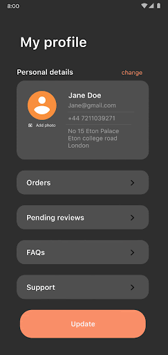

- [写真選択ツール](#写真選択ツール)
  - [Jetpack Activity コントラクトを使用する](#jetpack-activity-コントラクトを使用する)
    - [メディアアイテムを 1 つ選択する](#メディアアイテムを-1-つ選択する)
    - [複数のメディアファイルを選択する](#複数のメディアファイルを選択する)
  - [利用可能なデバイス](#利用可能なデバイス)
    - [対応していないデバイスで機能をインストールして使用する](#対応していないデバイスで機能をインストールして使用する)
  - [メディアファイルへのアクセス権を持続させる](#メディアファイルへのアクセス権を持続させる)
  - [引用元資料](#引用元資料)


# 写真選択ツール

写真選択ツールは、ユーザーが写真 or 動画を選択する UI を提供し、選択された写真 or 動画の URI を返すツールとなっています。

写真選択ツールは、メディアファイルを日付が新しい順に表示するブラウズ可能なインターフェースです。 [プライバシーに関するおすすめの方法についての Codelab](https://developer.android.com/codelabs/android-privacy-codelab?hl=ja&_gl=1*1rsu9ma*_up*MQ..*_ga*MjI0NTM2NDk1LjE3MjI3NDg4Mzc.*_ga_6HH9YJMN9M*MTcyMjc0ODgzNy4xLjAuMTcyMjc0ODgzNy4wLjAuMA..#0) で説明されているように、写真選択ツールを使用することで、メディアライブラリ全体へアクセスするのではなく、選択した画像と動画にのみアクセスを許可するという安全な方法が提供されます。

デバイスで対象のクラウドメディアプロバイダを登録しているユーザーは、リモートに保存されている写真や動画から選択することもできます。詳しくは、 [クラウドメディアプロバイダについての説明](../12.コンテンツプロバイダ/6.クラウドメディアプロバイダを作成する.md) をご覧ください。

このツールは自動的に更新されるため、コードを変更しなくても、ツールが自動的に更新されるにつれて、アプリは最新の機能を利用できるようになります。




## Jetpack Activity コントラクトを使用する

写真選択ツールの統合を容易にするには、 [androidx.activity](https://developer.android.com/jetpack/androidx/releases/activity?hl=ja&_gl=1*1l8dbdh*_up*MQ..*_ga*MjI0NTM2NDk1LjE3MjI3NDg4Mzc.*_ga_6HH9YJMN9M*MTcyMjc0ODgzNy4xLjAuMTcyMjc0ODgzNy4wLjAuMA..#1.7.0) ライブラリのバージョン 1.7.0 以降を組み込みます。

次の [ActivityResultContracts](https://developer.android.com/reference/androidx/activity/result/contract/ActivityResultContracts) を使用して、写真選択ツールを起動します。

- [PickVisualMedia](https://developer.android.com/reference/kotlin/androidx/activity/result/contract/ActivityResultContracts.PickVisualMedia?hl=ja&_gl=1*1j3yp7i*_up*MQ..*_ga*MjI0NTM2NDk1LjE3MjI3NDg4Mzc.*_ga_6HH9YJMN9M*MTcyMjc0ODgzNy4xLjAuMTcyMjc0ODgzNy4wLjAuMA..): [1 つの画像、または、動画を選択](#メディアアイテムを-1-つ選択する) します。

- [PickMultipleVisualMedia](https://developer.android.com/reference/kotlin/androidx/activity/result/contract/ActivityResultContracts.PickMultipleVisualMedia?hl=ja&_gl=1*1j3yp7i*_up*MQ..*_ga*MjI0NTM2NDk1LjE3MjI3NDg4Mzc.*_ga_6HH9YJMN9M*MTcyMjc0ODgzNy4xLjAuMTcyMjc0ODgzNy4wLjAuMA..): [複数の画像、または、動画を選択](#複数のメディアファイルを選択する) します。

デバイスで写真選択ツールを使用できない場合、ライブラリは代わりに [ACTION_OPEN_DOCUMENT](https://developer.android.com/reference/kotlin/android/content/Intent?hl=ja&_gl=1*1aelqzd*_up*MQ..*_ga*MjI0NTM2NDk1LjE3MjI3NDg4Mzc.*_ga_6HH9YJMN9M*MTcyMjc0ODgzNy4xLjAuMTcyMjc0ODgzNy4wLjAuMA..#action_open_document) インテントのアクションを自動的に呼び出します。このインテントは、Android 4.4（API レベル 19）以降を搭載しているデバイスでサポートされています。特定のデバイスで写真選択ツールが使用可能かどうかを確認するには、 [isPhotoPickerAvailable()](https://developer.android.com/reference/kotlin/androidx/activity/result/contract/ActivityResultContracts.PickVisualMedia?hl=ja&_gl=1*1aelqzd*_up*MQ..*_ga*MjI0NTM2NDk1LjE3MjI3NDg4Mzc.*_ga_6HH9YJMN9M*MTcyMjc0ODgzNy4xLjAuMTcyMjc0ODgzNy4wLjAuMA..#isPhotoPickerAvailable(android.content.Context)) を呼び出します。


### メディアアイテムを 1 つ選択する

1 つのメディアアイテムを選択するには、次のコードスニペットに示すように、 [ActivityResultContracts.PickVisualMedia](https://developer.android.com/reference/androidx/activity/result/contract/ActivityResultContracts.PickVisualMedia) を使用します。

```kotlin
// 一つの写真を選択する Activity のランチャーを登録する。
val pickMedia = registerForActivityResult(PickVisualMedia()) { uri ->
    // コールバックは、ユーザーが写真を選択するか、フォトピッカーを閉じると呼ばれます。
    if (uri != null) {
        Log.d("PhotoPicker", "Selected URI: $uri")
    } else {
        Log.d("PhotoPicker", "No media selected")
    }
}

// 以下のどれかの lauch() 呼び出しを使用してください。
// ユーザーに選択してほしいメディアのタイプに応じて選択してください。

// フォトピッカーを起動します。
// ユーザーは画像と動画から選択できます。
pickMedia.launch(PickVisualMediaRequest(PickVisualMedia.ImageAndVideo))

// フォトピッカーを起動します。
// ユーザーは画像から選択できます。
pickMedia.launch(PickVisualMediaRequest(PickVisualMedia.ImageOnly))

// フォトピッカーを起動します。
// ユーザーは動画から選択できます。
pickMedia.launch(PickVisualMediaRequest(PickVisualMedia.VideoOnly))

// フォトピッカーを起動します。
// ユーザーは指定した MIME タイプの画像 or 動画から選択できます。
// 以下の例では、 GIF ファイルから選択できます。
val mimeType = "image/gif"
pickMedia.launch(PickVisualMediaRequest(PickVisualMedia.SingleMimeType(mimeType)))
```

**注**: PickVisualMedia を使用すると、写真選択ツールはハーフスクリーンモードで開かれます。


### 複数のメディアファイルを選択する

複数のメディアアイテムを選択するには、次のコードスニペットに示すように、選択可能なメディアファイルの最大数を設定します。

```kotlin
// 複数の写真を選択する Activity のランチャーを登録する。
// この例では、 5 つまでファイルを選択できます。
val pickMultipleMedia =
        registerForActivityResult(PickMultipleVisualMedia(5)) { uris ->
    // コールバックは、ユーザーが写真を選択するか、フォトピッカーを閉じると呼ばれます。
    if (uris.isNotEmpty()) {
        Log.d("PhotoPicker", "Number of items selected: ${uris.size}")
    } else {
        Log.d("PhotoPicker", "No media selected")
    }
}

// 指定した MIME タイプからのみ選択可能にしたい場合や、
// 写真のみを選択可能にしたい場合などは、
// 一つ前のセクション「メディアアイテムを 1 つ選択する」
// を参照してください。
pickMultipleMedia.launch(PickVisualMediaRequest(PickVisualMedia.ImageAndVideo))
```

写真選択ツールでユーザーに選択を求めることができるファイルの数は、プラットフォームによって上限が設定されています。この制限を参照するには、 [getPickImagesMaxLimit()](https://developer.android.com/reference/android/provider/MediaStore?hl=ja&_gl=1*f61xyj*_up*MQ..*_ga*MjI0NTM2NDk1LjE3MjI3NDg4Mzc.*_ga_6HH9YJMN9M*MTcyMjc0ODgzNy4xLjAuMTcyMjc0ODgzNy4wLjAuMA..#getPickImagesMaxLimit()) を呼び出します。この制限は、写真選択ツールに対応していないデバイスでは無視されます。

**注**: 写真選択ツールが使用できず、サポートライブラリが ACTION_OPEN_DOCUMENT インテントのアクションを呼び出した場合、システムは選択可能なメディアファイルの最大数の指定値を無視します。


## 利用可能なデバイス

写真選択ツールは、以下の条件を満たしているデバイスで利用できます。

- Android 11（API レベル 30）以降を実行している
- [モジュラーシステムコンポーネント](https://source.android.com/devices/architecture/modular-system?hl=ja) の変更を [Google システムアップデート](https://support.google.com/product-documentation/answer/11412553?hl=ja) から受け取っている


### 対応していないデバイスで機能をインストールして使用する

Android 4.4（API レベル 19）～Android 10（API レベル 29）を搭載した以前のデバイスと、 Google Play 開発者サービスをサポートする Android 11 、または、 12 を搭載した Android Go デバイスには、バックポートバージョン (古いバージョンの Android でも使えるようにしたバージョン) の写真選択ツールをインストールできます。 Google Play 開発者サービスを介してバックポートバージョンの写真選択ツールモジュールの自動インストールを有効にするには、アプリのマニフェストファイルで `<application>` タグに次のエントリを追加してください。

```xml
<!-- バックポートされたフォトピッカーモジュールをインストールする Google Play Service を開始します -->
<service 
    android:name="com.google.android.gms.metadata.ModuleDependencies"
    android:enabled="false"
    android:exported="false"
    tools:ignore="MissingClass">
    
    <intent-filter>
        <action android:name="com.google.android.gms.metadata.MODULE_DEPENDENCIES" />
    </intent-filter>
    
    <meta-data android:name="photopicker_activity:0:required" android:value="" />
</service>
```


## メディアファイルへのアクセス権を持続させる

メディアファイルへのアクセス権がアプリに付与した場合、その権限が維持されるのは、デフォルトで、デバイスが再起動されるか、アプリが停止するまでです。バックグラウンドで大きなファイルをアップロードするなど、長い時間がかかる作業を実行する場合、このアクセス権が持続する時間を延長する必要があります。そのためには、次のように [takePersistableUriPermission()](https://developer.android.com/reference/android/content/ContentResolver#takePersistableUriPermission(android.net.Uri,%20int)) メソッドを呼び出します。

```kotlin
val flag = Intent.FLAG_GRANT_READ_URI_PERMISSION
context.contentResolver.takePersistableUriPermission(uri, flag)
```

`contentResolver.takePersistableUriPermission()` メソッドを使うと、アプリが明示的にそのアクセス権を放棄するか、アプリがアンインストールされるまで、対象の URI へのアクセス権を **永続的** に保持できます。

明示的にアクセス権を放棄する場合は、 `releasePersistableUriPermission()` メソッドを呼び出します。


## 引用元資料

- [写真選択ツール](https://developer.android.com/training/data-storage/shared/photopicker)


