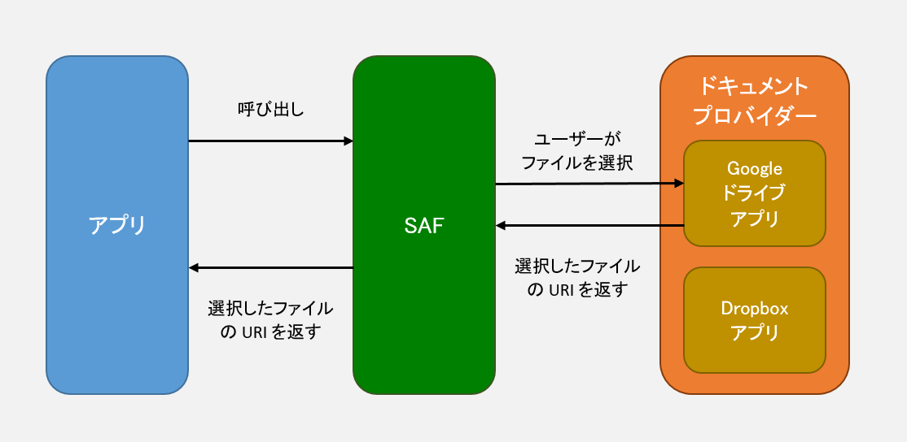

- [共有ストレージのドキュメントやファイルにアクセスする](#共有ストレージのドキュメントやファイルにアクセスする)
  - [権限について](#権限について)
  - [Storage Access Framework でアクセスできる範囲（ChatGPTから引用）](#storage-access-framework-でアクセスできる範囲chatgptから引用)
    - [アクセス可能な場所](#アクセス可能な場所)
      - [ユーザーが選択した特定のファイル](#ユーザーが選択した特定のファイル)
      - [ユーザーが選択したディレクトリとその中のファイル](#ユーザーが選択したディレクトリとその中のファイル)
      - [クラウドストレージや他のストレージプロバイダーのデータ](#クラウドストレージや他のストレージプロバイダーのデータ)
    - [アクセス不可能な場所](#アクセス不可能な場所)
    - [補足](#補足)
  - [ドキュメントやファイルにアクセスするユースケース（ファイルを選択し、そのファイルの URI を取得し、そのファイルへの一時的なアクセス権を取得する）](#ドキュメントやファイルにアクセスするユースケースファイルを選択しそのファイルの-uri-を取得しそのファイルへの一時的なアクセス権を取得する)
    - [新しいファイルを作成するために URI を取得する](#新しいファイルを作成するために-uri-を取得する)
    - [ファイルを開くために URI を取得する](#ファイルを開くために-uri-を取得する)
      - [アクセス制限](#アクセス制限)
    - [特定のディレクトリ配下（サブディレクトリを含む）への読み書きを許可するために URI を取得する。](#特定のディレクトリ配下サブディレクトリを含むへの読み書きを許可するために-uri-を取得する)
      - [アクセス制限](#アクセス制限-1)
  - [選択した場所に関する操作を行う（取得した URI のファイル（の場所）に対して、ファイルの作成、更新、削除等の操作を行う）](#選択した場所に関する操作を行う取得した-uri-のファイルの場所に対してファイルの作成更新削除等の操作を行う)
    - [プロバイダがサポートする操作を確認する](#プロバイダがサポートする操作を確認する)
    - [権限を保持する](#権限を保持する)
    - [ドキュメントのメタデータを調べる](#ドキュメントのメタデータを調べる)
    - [ドキュメントを開く（読み込む）](#ドキュメントを開く読み込む)
      - [ビットマップ](#ビットマップ)
      - [入力ストリーム](#入力ストリーム)
    - [ドキュメントを編集する](#ドキュメントを編集する)
    - [ドキュメントを削除する](#ドキュメントを削除する)
    - [同等のメディア URI を取得する](#同等のメディア-uri-を取得する)
    - [仮想ファイルを開く](#仮想ファイルを開く)
      - [コンテンツプロバイダ側の getStreamTypes() の実装例](#コンテンツプロバイダ側の-getstreamtypes-の実装例)


# 共有ストレージのドキュメントやファイルにアクセスする

Android 4.4（API レベル 19）以降を搭載するデバイスでは、 **ストレージアクセスフレームワーク ( SAF )** を使用して、 [ドキュメントプロバイダ](../12.コンテンツプロバイダ/5.カスタムドキュメントプロバイダを作成する.md) (外部ストレージボリュームや、 Google ドライブ等のクラウドベースのストレージアプリのこと) を使用できます。このフレームワークでは、システムの選択ツールを使用して、ドキュメントプロバイダとその中のファイルを選択し、そのファイルを開いたり、変更したり、新しいファイルを作成することができます。



SAF のメカニズムでアクセスするファイルは、アプリ固有のディレクトリの外に保持されるため、アプリがアンインストールされた後もデバイスに残ります。

**参考** : メディアストア内に保存されたファイルも、アプリがアンインストールされた後に、ファイルはデバイスに残ります。ただし、アプリとメディアストア内ファイルの紐づけが解除されます。

このフレームワークを使用する手順は次のとおりです。

1. アプリは、 Intent を用いて、 Activity を開始します。 Intent には、特定のアクションを含める必要があります。どのアクションを含めるかは、 [ユースケース](#ドキュメントやファイルにアクセスするユースケースファイルを選択しそのファイルの-uri-を取得しそのファイルへの一時的なアクセス権を取得する) を参照して決定してください。
2. システムが提供する選択ツールが表示され、ディレクトリやファイルを選択できるようになります。選択ツールに表示される対象は、 Google ドライブアプリなど、ドキュメントプロバイダを実装しているアプリになります。
3. アプリは、ユーザーが選択した場所やドキュメントを表す URI に対する読み書きのアクセス権を取得します。この URI を使用して、 [アプリは選択した場所に関する操作を行う](#選択した場所に関する操作を行う取得した-uri-のファイルの場所に対してファイルの作成更新削除等の操作を行う) ことができます。

**注**: アプリがメディアファイルにアクセスする場合は、 [写真選択ツール](./3.写真選択ツール.md) の使用を検討してください。写真や動画へのアクセスに便利なインターフェースが提供されます。 (おそらく、写真や動画のサムネイルが表示されるということだと思います。)

このガイドでは、フレームワークを使用して、ディレクトリやファイルを選択し、その場所に対して操作を行う方法について説明します。


## 権限について

ユーザー自身が、アプリがアクセスできる対象を選択するため、 SAF を使用する際に、 **アプリに権限を付与する必要ありません。** システムは、ユーザーが選択したファイルやフォルダに対してのみ、一時的、または、永続的なアクセス権限を自動的に付与します。

Android 9（API レベル 28）以前を搭載しているデバイスで、メディアファイルへのアクセスをサポートするには、 [READ_EXTERNAL_STORAGE](https://developer.android.com/reference/android/Manifest.permission?hl=ja&_gl=1*82ab7v*_up*MQ..*_ga*MjI0NTM2NDk1LjE3MjI3NDg4Mzc.*_ga_6HH9YJMN9M*MTcyMjc0ODgzNy4xLjAuMTcyMjc0ODgzNy4wLjAuMA..#READ_EXTERNAL_STORAGE) 権限を宣言し、 maxSdkVersion を 28 に設定します。この minSdkVersion は、 build.gradle に設定するものではなく、以下のように、マニフェストのパーミッションに設定するものです。

これにより、 API レベル 28（ Android 9 ）以下のデバイスでのみで、以下の権限が有効となります。 API レベル 29（ Android 10 ）以上のデバイスでは、権限をリクエストしません。

```xml
<uses-permission android:name="android.permission.READ_EXTERNAL_STORAGE"
    android:maxSdkVersion="28"/>
```


## Storage Access Framework でアクセスできる範囲（ChatGPTから引用）

### アクセス可能な場所

#### ユーザーが選択した特定のファイル

- `ACTION_OPEN_DOCUMENT` を使用すると、ユーザーが選択したファイルにアクセスできる。
- アプリは、そのファイルの URI ( content:// スキーム) を取得し、永続的なアクセス権をリクエストできる。


#### ユーザーが選択したディレクトリとその中のファイル

- `ACTION_OPEN_DOCUMENT_TREE` を使用すると、ユーザーが選択したフォルダとその配下のファイルにアクセスできる。
- フォルダ内のファイルをリストアップしたり、作成・変更・削除が可能（許可されている場合）。


#### クラウドストレージや他のストレージプロバイダーのデータ

- SAF は Google Drive、OneDrive、Dropbox などの クラウドストレージ にも対応。
- これにより、外部アプリやサービスのデータにもアクセス可能。


### アクセス不可能な場所

- 他のアプリの内部ストレージ ( `/data/data/<package_name>/` )
- システムディレクトリ ( `/system` , `/proc` , `/dev` など)
- 外部ストレージのルートディレクトリ ( `/storage/emulated/0/` など)


### 補足

- SAF を使うと、READ_EXTERNAL_STORAGE や WRITE_EXTERNAL_STORAGE 権限が不要（Android 10 以降では非推奨）。
- Android 10 以降では、Scoped Storage の影響で Environment.getExternalStorageDirectory() の使用が制限されているため、SAF が推奨される。


## ドキュメントやファイルにアクセスするユースケース（ファイルを選択し、そのファイルの URI を取得し、そのファイルへの一時的なアクセス権を取得する）

ストレージアクセスフレームワークは、次のようなファイルやドキュメントにアクセスするユースケースをサポートしています。

- 新しいファイルを作成する
  - [ACTION_CREATE_DOCUMENT](https://developer.android.com/reference/android/content/Intent?hl=ja#ACTION_CREATE_DOCUMENT) インテントのアクションを使用すると、ユーザーは特定の場所にファイルを保存できます。

- ドキュメントやファイルを開く
  - [ACTION_OPEN_DOCUMENT](https://developer.android.com/reference/android/content/Intent?hl=ja#ACTION_OPEN_DOCUMENT) インテントのアクションを使用すると、ユーザーは特定のドキュメントやファイルを選択して開くことができます。

- ディレクトリの内容へのアクセス権を付与する
  - Android 5.0（API レベル 21）以降で利用可能な [ACTION_OPEN_DOCUMENT_TREE](https://developer.android.com/reference/android/content/Intent?hl=ja#ACTION_OPEN_DOCUMENT_TREE) インテントのアクションを使用すると、ユーザーが特定のディレクトリを選択して、そのディレクトリ内のすべてのファイルとサブディレクトリへのアクセス権をアプリに付与できます。

- ドキュメントを編集したり削除したりする
  - ドキュメントを編集したり、削除するには、対象のドキュメントプロバイダが、その操作に対応している必要があります。

以降のセクションでは、各ユースケースの設定方法について説明します。


### 新しいファイルを作成するために URI を取得する

[ACTION_CREATE_DOCUMENT](https://developer.android.com/reference/android/content/Intent?hl=ja&_gl=1*1vzg5w2*_up*MQ..*_ga*MjI0NTM2NDk1LjE3MjI3NDg4Mzc.*_ga_6HH9YJMN9M*MTcyMjc0ODgzNy4xLjAuMTcyMjc0ODgzNy4wLjAuMA..#ACTION_CREATE_DOCUMENT) インテントのアクションを使用して、システムのファイル選択ツールを呼び出し、ファイルの内容を書き込む場所をユーザーが選択できるようにします。この手順は、他のオペレーティングシステムで使用されている「名前を付けて保存」ダイアログで使用されている手順と似ています。

**注**: ACTION_CREATE_DOCUMENT では、 **既存のファイルを上書きできません。** アプリが同じ名前のファイルを保存しようとすると、ファイル名の末尾にかっこで囲まれた数字が追加されます。たとえば、既に confirmation.pdf という名前のファイルが存在しているディレクトリ内で、同じ名前のファイルを保存しようとすると、 confirmation(1).pdf という名前の新しいファイル名で保存されます。

インテントを設定するときは、ファイルの名前と MIME タイプを指定します。必要に応じ、 EXTRA_INITIAL_URI インテントエクストラを使用して、ファイル選択ツールが最初に読み込まれたときに表示するファイル、または、ディレクトリの URI も指定できます。

以下は、ファイルを作成するインテントを作成して、呼び出す例です。

```kotlin
// 後でリクエストを識別できるように、リクエストコードを指定する。
const val CREATE_FILE = 1

private fun createFile(pickerInitialUri: Uri) {
    val intent = Intent(Intent.ACTION_CREATE_DOCUMENT).apply {

        addCategory(Intent.CATEGORY_OPENABLE)

        // 保存するファイルの MIME タイプを指定する。
        type = "application/pdf"

        // 保存するファイルのファイル名を指定する。
        putExtra(Intent.EXTRA_TITLE, "invoice.pdf")

        // ファイルピッカーで、ファイルの保存先を選択します。
        // 必要に応じて、ファイルピッカーがデフォルトで開くディレクトリ (URI) を指定できます。
        putExtra(DocumentsContract.EXTRA_INITIAL_URI, pickerInitialUri)
    }
    startActivityForResult(intent, CREATE_FILE)
}
```

上記のコードは、ファイル選択ツールを通じて、ユーザーにファイルを保存する場所を選択してもらい、ファイルを作成することを目的としたコードです。


### ファイルを開くために URI を取得する

システムのファイル選択アプリを開く [ACTION_OPEN_DOCUMENT](https://developer.android.com/reference/android/content/Intent?hl=ja#ACTION_OPEN_DOCUMENT) インテントを呼び出して、ユーザーが対象ファイルを選択して、開くことができるようにします。アプリがサポートするファイルタイプだけを表示させるには、 MIME タイプを指定します。また、必要に応じ、 [EXTRA_INITIAL_URI](https://developer.android.com/reference/android/provider/DocumentsContract?hl=ja#EXTRA_INITIAL_URI) インテントエクストラを使用して、ファイル選択ツールが最初に読み込まれたときに表示するファイルの URI も指定できます。

次のコードスニペットは、 PDF ドキュメントを開くインテントを作成して呼び出す方法を示しています。

```kotlin
// リクエストコード
const val PICK_PDF_FILE = 2

fun openFile(pickerInitialUri: Uri) {
    val intent = Intent(Intent.ACTION_OPEN_DOCUMENT).apply {

        addCategory(Intent.CATEGORY_OPENABLE)

        // 表示するファイルを MIME タイプで絞りたい場合に指定します。
        type = "application/pdf"

        // ファイルピッカーがデフォルトで開くディレクトりを URI で指定できます。
        putExtra(DocumentsContract.EXTRA_INITIAL_URI, pickerInitialUri)
    }

    startActivityForResult(intent, PICK_PDF_FILE)
}
```

上記のコードは、ファイル選択ツールを通じて、ユーザーにファイルを選択してもらうことを目的としたコードです。


#### アクセス制限

Android 11（API レベル 30）以降では、 ACTION_OPEN_DOCUMENT インテントのアクションを使用して、次のディレクトリ (外部ストレージ上のアプリ固有のディレクトリ) から個々のファイルを選択するようユーザーにリクエストすることはできません。

- /storage/emulated/0/Android/data/ ディレクトリとすべてのサブディレクトリ。
- /storage/emulated/0/Android/obb/ ディレクトリとすべてのサブディレクトリ。


### 特定のディレクトリ配下（サブディレクトリを含む）への読み書きを許可するために URI を取得する。

**注**: このセクションで説明するインテントのアクションは、 Android 5.0（API レベル 21）以降で使用できます。

ファイル管理アプリやメディア作成アプリは、通常、ディレクトリ階層内のファイルのグループを管理します。アプリでこの機能を使用するには、 [ACTION_OPEN_DOCUMENT_TREE](https://developer.android.com/reference/android/content/Intent?hl=ja&_gl=1*1uyhvul*_up*MQ..*_ga*MjI0NTM2NDk1LjE3MjI3NDg4Mzc.*_ga_6HH9YJMN9M*MTcyMjc0ODgzNy4xLjAuMTcyMjc0ODgzNy4wLjAuMA..#ACTION_OPEN_DOCUMENT_TREE) インテントのアクションを使用します。これにより、Android 11（API レベル 30）以降の一部の例外を除き、ユーザーはディレクトリツリー全体へのアクセス権を付与できます。こうして、アプリは選択されたディレクトリとそのサブディレクトリ内のすべてのファイルにアクセスできる (参照も更新も可) ようになります。

[ファイルの作成](#新しいファイルを作成するために-uri-を取得する) や [ファイルのオープン](#ファイルを開くために-uri-を取得する) セクションでは、ファイルの参照用のアクション ( ACTION_OPEN_DOCUMENT ) と更新用のアクション ( ACTION_CREATE_DOCUMENT ) が、別々に定義されていましたが、このディレクトリ単位のアクション ( ACTION_OPEN_DOCUMENT_TREE ) では、参照と更新の両方が可能です。これは、ディレクトリ単位でユーザーに権限をコントロールしてもらうという設計思想に基づくもので、この思想のほうが、ユーザービリティなどの面で、利便性が高いようです。

ACTION_OPEN_DOCUMENT_TREE を使用している場合、アプリがアクセスできるのは、ユーザーが選択したディレクトリ内のファイルに限られます。ユーザーが選択したディレクトリの外部にある別アプリのファイルにはアクセスできません。このようなユーザー制御に基づくアクセス権限により、ユーザーは、アプリで共有するコンテンツを、自分の想定どおりに選択できます。

必要に応じ、 [EXTRA_INITIAL_URI](https://developer.android.com/reference/android/provider/DocumentsContract?hl=ja&_gl=1*1uyhvul*_up*MQ..*_ga*MjI0NTM2NDk1LjE3MjI3NDg4Mzc.*_ga_6HH9YJMN9M*MTcyMjc0ODgzNy4xLjAuMTcyMjc0ODgzNy4wLjAuMA..#EXTRA_INITIAL_URI) インテントエクストラを使用して、ファイル選択ツールが最初に読み込まれたときに表示するディレクトリの URI を指定します。

以下は、指定したディレクトリを開くインテントを作成して、呼び出す例です。

```kotlin
fun openDirectory(pickerInitialUri: Uri) {
    // システムのファイルピッカーを使用して、ディレクトリを選択します。
    val intent = Intent(Intent.ACTION_OPEN_DOCUMENT_TREE).apply {
        // デフォルトで開くディレクトリを URI で指定できます。
        putExtra(DocumentsContract.EXTRA_INITIAL_URI, pickerInitialUri)
    }

    startActivityForResult(intent, your-request-code)
}
```

上記のコードでは、ユーザーにディレクトリを選択してもらい、そのディレクトリの URI を取得することが可能です。

**注意**: ACTION_OPEN_DOCUMENT_TREE を使用してアクセスするディレクトリ内で、多数のファイルを反復処理すると、アプリのパフォーマンスが低下する可能性があります。


#### アクセス制限

Android 11（API レベル 30）以降では、 ACTION_OPEN_DOCUMENT_TREE インテントのアクションを使用して、次のディレクトリへのアクセスをリクエストすることはできません。

- 内部ストレージボリュームのルートディレクトリ。
- エミューレートされているカードか、リムーバブルカードかによらず、デバイスメーカーが信頼できるとみなす各 SD カードボリュームのルートディレクトリ。信頼できるボリュームとは、ほとんどの場合にアプリが正常にアクセスできるボリュームです。
- Download ディレクトリ。
  - Download ディレクトリにアクセスしたい場合は、 ACTION_CREATE_DOCUMENT や ACTION_OPEN_DOCUMENT を使用して、ファイル単位のアクセスを行うようにしましょう。

さらに Android 11（API レベル 30）以降では、 ACTION_OPEN_DOCUMENT_TREE インテントのアクションを使用して、次のディレクトリ (外部ストレージ上のアプリ固有のディレクトリ) から個々のファイルを選択するよう、ユーザーにリクエストすることはできません。

- /storage/emulated/0/Android/data/ ディレクトリとすべてのサブディレクトリ。
- /storage/emulated/0/Android/obb/ ディレクトリとすべてのサブディレクトリ。

つまり、アクセスできるのは、以下のディレクトリです。

- 外部ストレージ内の特定のフォルダ
  - Documents/
  - Pictures/
  - Movies/
  - Music/
  - DCIM/（カメラフォルダ）
  - アプリ固有のディレクトリ（/storage/emulated/0/Android/media/your.package.name/）
- SDカード（リムーバブルストレージ）の特定フォルダ
  - SDカード内の Documents/ や Pictures/ などのフォルダ
- アプリのストレージ領域
  - /data/data/your.package.name/files/（ただし、通常ACTION_OPEN_DOCUMENT_TREEではなくgetFilesDir()などを使用）
  - /storage/emulated/0/Android/media/your.package.name/（アプリが作成・管理できるメディア専用フォルダ）

`/storage/emulated/0/Android/media/your.package.name/` ディレクトリを使用するメリットは、 MediaStore を介さずに、メディアファイルを共有できることです。 MediaStore を介さないと、主に以下の違いが発生します。

- 自動でギャラリーアプリに表示されない。(明示的にスキャンすれば表示される)
  - `MediaScannerConnection.scanFile()` を実行すると、ギャラリーアプリに表示されるようですが、 MediaStore にファイルのメタデータが登録されるようです。
- MediaStore のデータベースにファイルのメタデータが表示されない。 ( MediaStore の管理対象外であるため。)


## 選択した場所に関する操作を行う（取得した URI のファイル（の場所）に対して、ファイルの作成、更新、削除等の操作を行う）

ユーザーがシステムのファイル選択ツールで、ファイル、または、ディレクトリを選択した後、 onActivityResult() の次のコードを使用して、選択したアイテムの URI を取得できます。

```kotlin
override fun onActivityResult(
        requestCode: Int, resultCode: Int, resultData: Intent?) {
    if (requestCode == your-request-code
            && resultCode == Activity.RESULT_OK) {
        // resultData にはユーザーが選択したドキュメントやディレクトリの URI が含まれます。
        resultData?.data?.also { uri ->
            // 取得した URI を使用して、操作を行います。
        }
    }
}
```

選択したアイテムの URI への参照を取得することで、アイテムに対する操作を行えます。たとえば、アイテムのメタデータにアクセスして、その場でアイテムを更新したり、削除できます。

次のセクションでは、ユーザーが選択したファイルに対する操作を完了する方法を説明します。


### プロバイダがサポートする操作を確認する

行える操作は、コンテンツプロバイダによって異なります（ドキュメントのコピーやサムネイルの表示など）。プロバイダがサポートする操作を確認するには、 [Document.COLUMN_FLAGS](https://developer.android.com/reference/android/provider/DocumentsContract.Document?hl=ja&_gl=1*1w1ee6z*_up*MQ..*_ga*MjI0NTM2NDk1LjE3MjI3NDg4Mzc.*_ga_6HH9YJMN9M*MTcyMjc0ODgzNy4xLjAuMTcyMjc0ODgzNy4wLjAuMA..#COLUMN_FLAGS) の値を確認します。これによって、プロバイダがサポートする選択肢のみを UI に表示できます。

ドキュメントプロバイダは、 URI を指定された際に、そのファイルのメタデータを返す責任があります。コンテンツリゾルバで、特定の URI をクエリすることによって、 FLAG を含む、ファイルのメタデータが取得でき、そのファイルに対して実行可能な操作がわかるという仕組みです。

以下の例は、ドキュメントが削除可能かどうかをチェックし、可能な場合に削除する例です。

```java
// 【注意】このサンプルは Java で書かれています。

import android.content.ContentResolver;
import android.database.Cursor;
import android.net.Uri;
import android.provider.DocumentsContract;
import android.provider.DocumentsContract.Document;

public void checkAndDeleteDocument(ContentResolver contentResolver, Uri documentUri) {
    // フラグを含むドキュメントのメタデータを取得します。
    String[] projection = new String[] {
        Document.COLUMN_DOCUMENT_ID,
        Document.COLUMN_FLAGS
    };

    try (Cursor cursor = contentResolver.query(documentUri, projection, null, null, null)) {
        if (cursor != null && cursor.moveToFirst()) {
            int flags = cursor.getInt(cursor.getColumnIndexOrThrow(Document.COLUMN_FLAGS));

            // ドキュメントの削除をサポートしているかを確認します。
            if ((flags & Document.FLAG_SUPPORTS_DELETE) != 0) {
                // ドキュメントは削除可能なので、削除します。
                try {
                    boolean deleted = DocumentsContract.deleteDocument(contentResolver, documentUri);
                    if (deleted) {
                        // 削除に成功した場合
                    } else {
                        // 削除に失敗した場合
                    }
                } catch (Exception e) {
                    // 削除に失敗した場合
                }
            } else {
                // このドキュメントは削除がサポートされていない
            }
        }
    } catch (Exception e) {
        // ドキュメントのクエリに失敗した場合
    }
}
```

Java の `try () {}` の丸カッコ `()` は 「リソースの自動解放」(try-with-resources) のための構文です。

通常の try {} では、catch {} や finally {} を組み合わせて例外処理をしますが、try (リソース宣言) {} を使うと、 AutoCloseable インターフェースを実装したオブジェクトを自動的に閉じることができます。 Kotlin の `use{}` と同様の機能です。


### 権限を保持する

アプリが読み取り、または、書き込みのためにファイルを開くとき、システムからそのファイルに対する URI 権限を付与されます。この権限は、デバイスが再起動するまで保持されます。デバイスが再起動した場合は、再度、権限を取得するために、ユーザーをシステムの選択ツールに戻す必要があります。

デバイスの再起動後もファイルへのアクセス権を維持して、ユーザーエクスペリエンスを向上させるために、システムで提供される永続的 URI 権限 ( [FLAG_GRANT_READ_URI_PERMISSION](https://developer.android.com/reference/android/content/Intent#FLAG_GRANT_READ_URI_PERMISSION) / [FLAG_GRANT_WRITE_URI_PERMISSION](https://developer.android.com/reference/android/content/Intent#FLAG_GRANT_WRITE_URI_PERMISSION) ) を付与できます。次のコードスニペットをご覧ください。

**注意** : 公式ドキュメントには記載されていませんが、 ChatGPT によると、アプリのプロセスが破棄されたタイミングでも、ファイルへの一時的なアクセス権は、破棄されるそうです。そのため、それを回避するのにも、以下のコードを使用するそうです。

ユーザーにファイルを選択してもらった直後など、 URI を取得した直後に、以下の 「権限の永続化」 の処理を実行すると良いと思われます。

```kotlin
val contentResolver = applicationContext.contentResolver

val takeFlags: Int = Intent.FLAG_GRANT_READ_URI_PERMISSION or
        Intent.FLAG_GRANT_WRITE_URI_PERMISSION
contentResolver.takePersistableUriPermission(uri, takeFlags)
```

**注意**: [takePersistableUriPermission()](https://developer.android.com/reference/android/content/ContentResolver#takePersistableUriPermission(android.net.Uri,%20int)) を呼び出した後でも、関連付けられたドキュメントが移動、または、削除された場合は、 URI へのアクセス権は維持されません。その場合は、再度、権限を要求して、 URI へのアクセス権を得る必要があります。


### ドキュメントのメタデータを調べる

ドキュメントの URI がわかっていれば、そのメタデータへのアクセス権を取得できます。次のスニペットは、 URI で指定されたファイルのサイズを取得し、ログに記録します。

```kotlin
val contentResolver = applicationContext.contentResolver

fun dumpImageMetaData(uri: Uri) {

    // クエリは 1 件のデータを取得するだけであるため、フィルダーやソートは必要ありません。
    // 1 つのファイルの全てのフィールドが必要であるため、列の選択も不要です。
    val cursor: Cursor? = contentResolver.query(
            uri, null, null, null, null, null)

    cursor?.use {
        // カーソルが 0 行の場合、 moveToFirst() は false を返します。
        // これは「データがあればそれを見る」という if 文が構成されるため、非常に便利です。
        if (it.moveToFirst()) {

            // "Display Name" はプロバイダー固有のものであり、必ずしもファイル名であるとは限りません。
            val displayName: String =
                    it.getString(it.getColumnIndex(OpenableColumns.DISPLAY_NAME))
            Log.i(TAG, "Display Name: $displayName")

            val sizeIndex: Int = it.getColumnIndex(OpenableColumns.SIZE)
            // サイズが null かどうかのチェックを行います。
            // サイズが不明な場合、保存される値は null です。ただし、 Int に null は格納できないため、
            // Int に割り当てる前に null かどうかを確認してください。
            // ストレージ API では、サイズがローカルでは不明なリモートファイルが許可されるため、
            // null は頻繁に発生します。
            val size: String = if (!it.isNull(sizeIndex)) {
                // 列には Int 型のデータが保持されていますが、
                // cursor.getString() は自動的に変換してくれます。
                it.getString(sizeIndex)
            } else {
                "Unknown"
            }
            Log.i(TAG, "Size: $size")
        }
    }
}
```


### ドキュメントを開く（読み込む）

ドキュメントの URI への参照があれば、あとで処理するためにドキュメントを開くことができます。次のセクションでは、ビットマップと入力ストリームを開く例を示します。


#### ビットマップ

次のコードスニペットは、指定された URI の [Bitmap](https://developer.android.com/reference/android/graphics/Bitmap?hl=ja&_gl=1*18vs8pv*_up*MQ..*_ga*MjI0NTM2NDk1LjE3MjI3NDg4Mzc.*_ga_6HH9YJMN9M*MTcyMjc0ODgzNy4xLjAuMTcyMjc0ODgzNy4wLjAuMA..) ファイルを開く方法を示しています。

```kotlin
val contentResolver = applicationContext.contentResolver

@Throws(IOException::class)
private fun getBitmapFromUri(uri: Uri): Bitmap {
    val parcelFileDescriptor: ParcelFileDescriptor =
            contentResolver.openFileDescriptor(uri, "r")
    val fileDescriptor: FileDescriptor = parcelFileDescriptor.fileDescriptor
    val image: Bitmap = BitmapFactory.decodeFileDescriptor(fileDescriptor)
    parcelFileDescriptor.close()
    return image
}
```

**注**: この処理は、 UI スレッドではなく、バックグラウンドスレッドで実行してください。

開いたビットマップは ImageView に表示できます。


#### 入力ストリーム

次のコードスニペットは、指定された URI の InputStream オブジェクトを開く方法を示しています。このスニペットでは、ファイルが 1 行ずつ文字列に読み込まれます。

```kotlin
val contentResolver = applicationContext.contentResolver

@Throws(IOException::class)
private fun readTextFromUri(uri: Uri): String {
    val stringBuilder = StringBuilder()
    contentResolver.openInputStream(uri)?.use { inputStream ->
        BufferedReader(InputStreamReader(inputStream)).use { reader ->
            var line: String? = reader.readLine()
            while (line != null) {
                stringBuilder.append(line)
                line = reader.readLine()
            }
        }
    }
    return stringBuilder.toString()
}
```


### ドキュメントを編集する

ストレージアクセスフレームワークを使用して、テキストドキュメントをその場で編集できます。

**注**: DocumentFile クラスの [canWrite()](https://developer.android.com/reference/androidx/documentfile/provider/DocumentFile?hl=ja&_gl=1*18a3htp*_up*MQ..*_ga*MjI0NTM2NDk1LjE3MjI3NDg4Mzc.*_ga_6HH9YJMN9M*MTcyMjc0ODgzNy4xLjAuMTcyMjc0ODgzNy4wLjAuMA..#canWrite()) メソッドは、必ずしもアプリがドキュメントを編集できることを示すものではありません。これは、このメソッドが [Document.COLUMN_FLAGS](https://developer.android.com/reference/android/provider/DocumentsContract.Document#COLUMN_FLAGS) に [Document.FLAG_SUPPORTS_DELETE](https://developer.android.com/reference/android/provider/DocumentsContract.Document#FLAG_SUPPORTS_DELETE) と [Document.FLAG_SUPPORTS_WRITE](https://developer.android.com/reference/android/provider/DocumentsContract.Document#FLAG_SUPPORTS_WRITE) の「どちらか」が含まれている場合に true を返すためです。指定されたドキュメントを編集できるかどうかを判断するには、 FLAG_SUPPORTS_WRITE の値を直接調べてください。

```kotlin
import android.content.Context
import android.net.Uri
import android.provider.DocumentsContract
import android.provider.DocumentsContract.Document
import android.database.Cursor

fun isDocumentWritable(context: Context, uri: Uri): Boolean {
    val projection = arrayOf(Document.COLUMN_FLAGS)
    context.contentResolver.query(uri, projection, null, null, null)?.use { cursor ->
        if (cursor.moveToFirst()) {
            val flags = cursor.getInt(cursor.getColumnIndexOrThrow(Document.COLUMN_FLAGS))
            return flags and Document.FLAG_SUPPORTS_WRITE != 0
        }
    }
    return false
}

val uri: Uri = // 変更したいドキュメントの URI を取得
val isWritable = isDocumentWritable(context, uri)
if (isWritable) {
    println("このドキュメントは書き込み可能です。")
} else {
    println("このドキュメントは書き込み不可です。")
}
```

次のコードスニペットは、指定された URI のドキュメントの内容を上書きします。

```kotlin
val contentResolver = applicationContext.contentResolver

private fun alterDocument(uri: Uri) {
    try {
        contentResolver.openFileDescriptor(uri, "w")?.use {
            FileOutputStream(it.fileDescriptor).use {
                it.write(
                    ("Overwritten at ${System.currentTimeMillis()}\n")
                        .toByteArray()
                )
            }
        }
    } catch (e: FileNotFoundException) {
        e.printStackTrace()
    } catch (e: IOException) {
        e.printStackTrace()
    }
}
```


### ドキュメントを削除する

ドキュメントの URI がわかっていて、その [Document.COLUMN_FLAGS](https://developer.android.com/reference/android/provider/DocumentsContract.Document?hl=ja&_gl=1*15zb1h2*_up*MQ..*_ga*MjI0NTM2NDk1LjE3MjI3NDg4Mzc.*_ga_6HH9YJMN9M*MTcyMjc0ODgzNy4xLjAuMTcyMjc0ODgzNy4wLjAuMA..#COLUMN_FLAGS) に [Document.FLAG_SUPPORTS_DELETE](https://developer.android.com/reference/android/provider/DocumentsContract.Document?hl=ja&_gl=1*1tczr4v*_up*MQ..*_ga*MjI0NTM2NDk1LjE3MjI3NDg4Mzc.*_ga_6HH9YJMN9M*MTcyMjc0ODgzNy4xLjAuMTcyMjc0ODgzNy4wLjAuMA..#FLAG_SUPPORTS_DELETE) が含まれていれば、そのドキュメントを削除できます。次に例を示します。

```kotlin
DocumentsContract.deleteDocument(applicationContext.contentResolver, uri)
```


### 同等のメディア URI を取得する

SAF を使用して、ドキュメントプロバイダから取得した URI は、以下のような形式となっています。

```
// ExternalStorageProvider URI 形式
content://com.android.providers.media.documents/document/1234
```

一方で、写真選択ツールを使用して取得した URI は、以下のような形式となっています。この形式の URI を使用すると、 MediaStore を介して、メディアファイルにアクセスします。

```
// Android 10 以降 ( MediaDocumentsProvider URI 形式)
content://com.android.providers.media.documents/document/image%3A5678

// Android 10 未満
content://media/external/images/media/5678
```

これらは、形式が異なるだけで、同じメディアファイルを示していることがあります。メディアファイルにアクセスする際には、 MediaStore API を使用したほうが、様々な面でメリットがあるため、できるだけ MediaStore API を使用するべきです。そのような場合に、 SAF で取得したファイルの URI を MediaStore 形式の URI に変換するメソッドが [getMediaUri()](https://developer.android.com/reference/android/provider/MediaStore#getMediaUri(android.content.Context,%20android.net.Uri)) です。

**注**: getMediaUri() メソッドでは、新しい権限が付与されるわけではありません。そのため、対象のファイルにアクセスするのに必要な権限が、既にアプリに付与されている必要があります。

getMediaUri() メソッドは、 ExternalStorageProvider URI ( SAF から返される URI の形式) をサポートしています。 Android 12（API レベル 31）以降では、 MediaDocumentsProvider URI もサポートしています。 Android 9 以前のデバイスでは、このメソッドは、上記の古い形式の URI を返すそうです。そのため、このメソッドを使用する場合は、様々なバージョンの OS でテストをしましょう。


### 仮想ファイルを開く

**考察** : おそらく、このセクションの仮想ファイルとは、クラウドストレージ上に実ファイルが存在しており、 SAF が、その URI を返してきた場合に役に立つ情報だと思われます。

仮想ファイルとは、物理的に存在するファイルではなく、データベースや他のソースから動的に生成されるファイルを指します。これにより、アプリケーションは実際のファイルを直接操作することなく、仮想的に生成されるコンテンツを扱うことができます。

Android 7.0（API レベル 25）以降では、ストレージアクセスフレームワークで提供される仮想ファイルを使用できます。仮想ファイルにはバイナリ表現がありませんが、別のファイル形式に自動変換したり、 [ACTION_VIEW](https://developer.android.com/reference/android/content/Intent?hl=ja&_gl=1*19xalfv*_up*MQ..*_ga*MjI0NTM2NDk1LjE3MjI3NDg4Mzc.*_ga_6HH9YJMN9M*MTcyMjc0ODgzNy4xLjAuMTcyMjc0ODgzNy4wLjAuMA..#ACTION_VIEW) インテントのアクションを使用して表示したりして、コンテンツを開くことができます。

仮想ファイルを開くには、クライアントアプリに特別なロジックを入れる必要があります。プレビューするためなど、ファイルのバイト表現を取得する場合は、ドキュメントプロバイダに、別の MIME タイプをリクエストする必要があります。

**注** : [openInputStream()](https://developer.android.com/reference/android/content/ContentResolver?hl=ja&_gl=1*1c3sjpc*_up*MQ..*_ga*MjI0NTM2NDk1LjE3MjI3NDg4Mzc.*_ga_6HH9YJMN9M*MTcyMjc0ODgzNy4xLjAuMTcyMjc0ODgzNy4wLjAuMA..#openInputStream(android.net.Uri)) メソッドで仮想ファイルを直接開くことはできないため、 ACTION_OPEN_DOCUMENT 、または、 ACTION_OPEN_DOCUMENT_TREE アクションを含むインテントを作成するときに、 [CATEGORY_OPENABLE](https://developer.android.com/reference/android/content/Intent?hl=ja&_gl=1*1c3sjpc*_up*MQ..*_ga*MjI0NTM2NDk1LjE3MjI3NDg4Mzc.*_ga_6HH9YJMN9M*MTcyMjc0ODgzNy4xLjAuMTcyMjc0ODgzNy4wLjAuMA..#CATEGORY_OPENABLE) カテゴリを使用しないでください。

次のコードスニペットに示すように、ユーザーがファイルを選択した後に、結果データの URI を使用して、ファイルが仮想かどうかを確認してください。

```kotlin
private fun isVirtualFile(uri: Uri): Boolean {
    if (!DocumentsContract.isDocumentUri(context, uri)) {
        return false
    }

    val cursor: Cursor? = contentResolver.query(
            uri,
            arrayOf(DocumentsContract.Document.COLUMN_FLAGS),
            null,
            null,
            null
    )

    val flags: Int = cursor?.use { cursor ->
        if (cursor.moveToFirst()) {
            val columnIndex = cursor.getColumnIndexOrThrow(DocumentsContract.Document.COLUMN_FLAGS)
            cursor.getInt(columnIndex)
        } else {
            0
        }
    } ?: 0

    return flags and DocumentsContract.Document.FLAG_VIRTUAL_DOCUMENT != 0
}
```

ドキュメントが仮想ファイルであることを確認したら、ファイルを "image/png" のような MIME タイプに自動変換できます。次のコードスニペットは、仮想ファイルが画像として表現できるかどうかを確認し、可能な場合は仮想ファイルから入力ストリームを取得する方法を示しています。

```kotlin
//仮想ファイル（例: content:// スキームのデータ）から InputStream を取得します。

@Throws(IOException::class)
private fun getInputStreamForVirtualFile(
        uri: Uri, mimeTypeFilter: String): InputStream {

    val openableMimeTypes: Array<String>? =
            contentResolver.getStreamTypes(uri, mimeTypeFilter)

    return if (openableMimeTypes?.isNotEmpty() == true) {
        contentResolver
                .openTypedAssetFileDescriptor(uri, openableMimeTypes[0], null)
                .createInputStream()
    } else {
        throw FileNotFoundException()
    }
}
```

- contentResolver.getStreamTypes(uri, mimeTypeFilter)
  - 仮想ファイルのストリームとして開ける MIME タイプを問い合わせる関数です。
  - 例えば、 mimeTypeFilter に "image/*" を指定した場合、コンテンツプロバイダが "image/png" や "image/jpeg" 等の MIME タイプの仮想ファイルのストリームを提供していれば、 getStreamTypes 関数は、それらの MIME タイプを返します。
  - 指定した mimeTypeFilter に、コンテンツプロバイダが対応していなければ、 null が返ってきます。
  - コンテンツプロバイダ側で getStreamTypes() 関数をオーバーライドして実装している必要があります。 (例)

上記の関数の使用例は、以下です。

```kotlin
val uri: Uri = /* 何らかのコンテンツ URI */
val inputStream = getInputStreamForVirtualFile(uri, "image/*")

// 読み込み処理
val byteArray = inputStream.readBytes()
inputStream.close()
```

#### コンテンツプロバイダ側の getStreamTypes() の実装例

```kotlin
override fun getStreamTypes(uri: Uri, mimeTypeFilter: String): Array<String>? {
    return when {
        mimeTypeFilter.startsWith("image/") -> arrayOf("image/png", "image/jpeg")
        mimeTypeFilter == "application/pdf" -> arrayOf("application/pdf")
        else -> null
    }
}
```


