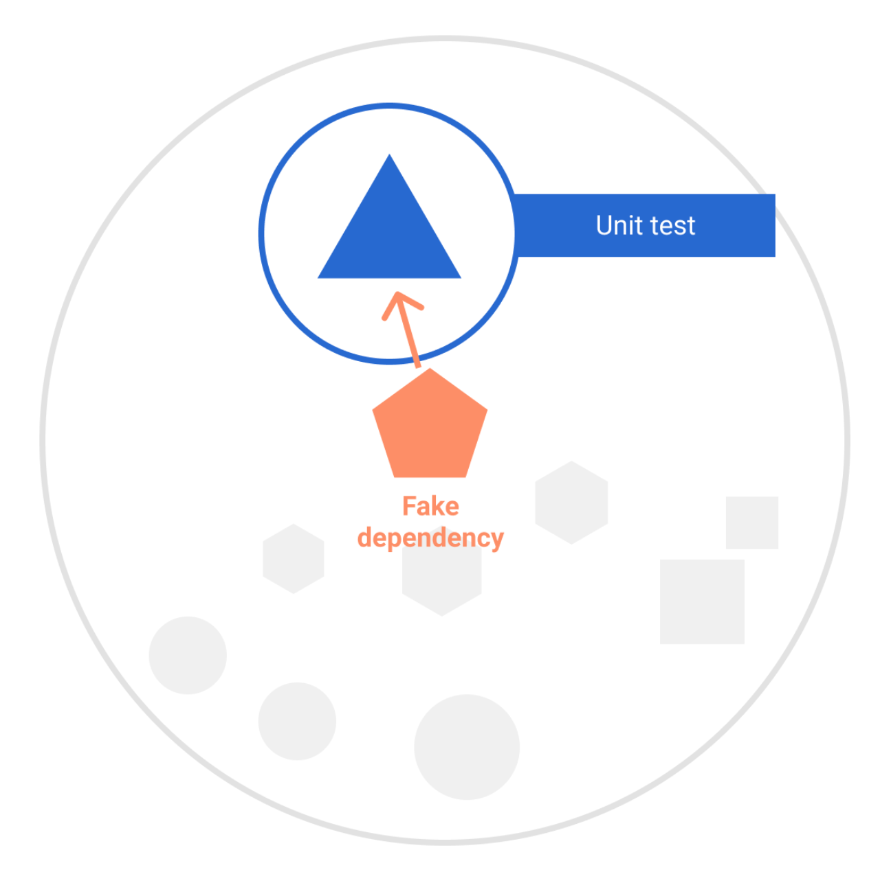
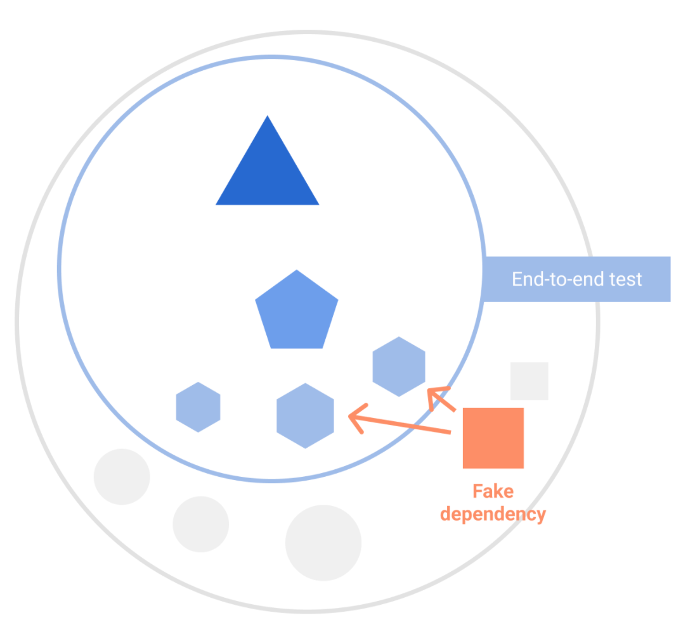

- [Android でテストダブルを使用する](#android-でテストダブルを使用する)
  - [テストダブルの種類](#テストダブルの種類)
    - [フェイク（疑似）](#フェイク疑似)
    - [モック](#モック)
    - [スタブ](#スタブ)
    - [ダミー](#ダミー)
    - [スパイ](#スパイ)
    - [シャドウ](#シャドウ)
    - [スタブとスパイの違い](#スタブとスパイの違い)
  - [フェイクの使用例](#フェイクの使用例)
  - [コンポーネントと依存関係インジェクションの置き換え](#コンポーネントと依存関係インジェクションの置き換え)
  - [Robolectric](#robolectric)


# Android でテストダブルを使用する

1 つの要素または要素のシステムをテストする場合は、独立して行います。たとえば、ViewModel をテストする場合、Android フレームワークに依存しない（または依存するべきではない）ため、エミュレータを起動して UI を起動する必要はありません。

ただし、テスト対象が他のテスト対象に依存する場合もあります。たとえば、 **ViewModel はデータリポジトリに依存して動作することがあります。**

**テスト対象に依存関係を提供する必要がある場合は、一般的にテストダブル（テストオブジェクト）を作成します。** テストダブルは、アプリのコンポーネントとして表示され、特定の動作やデータを提供するためにテストで作成されるオブジェクトです。主なメリットは、テストをより迅速かつシンプルにできることです。


## テストダブルの種類

テストダブルにはさまざまな種類があります。


### フェイク（疑似）

- **概要** : フェイクは、実際の機能をある程度持つが、軽量で簡略化されたテスト用の実装です。フェイクはモックフレームワークを必要とせず、軽量です。

- **使用例** : 例えば、本番環境ではデータベースを使用するが、テストではメモリを使用する場合など。


### モック

- **概要** : モックは、スタブに似ていますが、特定の呼び出しに対して返す値だけでなく、呼び出しがあったかどうかや、呼び出し回数、パラメータの検証なども行えるテストダブルです。多くの場合、モックオブジェクトは専用のフレームワークを使って生成します（例: Mockito など）

- **使用例** : データベース内のメソッドが 1 回だけ呼び出されたことを確認する場合など。


### スタブ

- **概要** : スタブは、特定のメソッド呼び出しに対して、あらかじめ設定された値を返すテストダブルです。外部システムとの依存関係を除去したい場合に使用されます。通常は、モックフレームワークを使用して作成されます。軽量化のために、スタブよりもフェイクが推奨されます。

- **使用例** : テスト中のシステムに外部APIの呼び出しがあり、そのAPIが特定の値を返すことを想定している場合、その部分をスタブで置き換えます。


### ダミー

- **概要** : ダミーオブジェクトは、テストがコンパイル、または、実行するために必要なだけの最低限の機能を持つオブジェクトです。通常は、メソッドに渡されますが、実際にそれが使われることはありません。

- **使用例** : クリックコールバックとして渡される中身が空の関数。


### スパイ

- **概要** : スパイは、実際の動作をするオブジェクトです。実際のオブジェクトをラップし、メソッドの呼び出しやパラメータを記録して、後から検証することを可能にします。通常、スパイは複雑さを増大させるため、スパイよりもフェイクやモックが好まれます。

- **使用例** : 例えば、特定のメソッドが正しい引数で何回呼ばれたかを確認したい場合に使用されます。


### シャドウ

- **概要** : Robolectric で使用されるフェイク。


### スタブとスパイの違い

- **戻り値の操作** : スタブは特定のメソッド呼び出しに対して定義された戻り値を返すのに対し、スパイはオブジェクトの動作をそのまま維持しつつ、呼び出しの追跡や検証を行います。
- **呼び出しの追跡** : スタブはメソッド呼び出しを追跡しませんが、スパイは呼び出しが行われたかどうかを追跡します。
- **用途** : スタブは外部依存の代替として使われ、スパイはメソッド呼び出しの監視と検証に使われます。

**注意** : **ソースによって定義は若干異なります。** 包括的な情報源として、Martin Fowler による [Mocks isn't Stubs（モックはスタブではない）](https://martinfowler.com/articles/mocksArentStubs.html) があります。

注: ライブラリやフレームワークを使用する際は、確実に信頼できるテストインフラストラクチャ（フェイクなど）が公式にサポートされているかどうかを作成者に確認してください。


## フェイクの使用例

UserRepository というインターフェースに依存し、最初のユーザーの名前を UI に公開する ViewModel の単体テストを行うとします。インターフェースを実装し、既知のデータを返すことで、架空のテストダブルを作成できます。

```kotlin
object FakeUserRepository : UserRepository {
    fun getUsers() = listOf(UserAlice, UserBob)
}

val const UserAlice = User("Alice")
val const UserBob = User("Bob")
```

この架空の UserRepository は、本番環境バージョンが使用するローカルデータソースとリモートデータソースに依存する必要はありません。このファイルはテストソースセットに格納され、製品版アプリには付属しません。



次のテストでは、ViewModel が最初のユーザー名をビューに正しく公開することを確認します。

```kotlin
@Test
fun viewModelA_loadsUsers_showsFirstUser() {
    // フェイクデータを使用して ViewModel を提供します。
    // データのロードは init ブロックで開始します。
    val viewModel = ViewModelA(FakeUserRepository)

    // データが正しいことを検証します。
    assertEquals(viewModel.firstUserName, UserAlice.name)
}
```

ViewModel はテスターによって作成されるため、単体テストでは UserRepository をフェイクに置き換えるのは簡単です。ただし、大規模なテストでは、任意の要素を置き換えるのは困難です。


## コンポーネントと依存関係インジェクションの置き換え

テスト対象システムの作成を管理できない場合、テストダブル用のコンポーネントの置き換えはさらに複雑になるため、アプリのアーキテクチャは、テスト可能な設計に従う必要があります。

アプリのユーザーフロー全体をナビゲートするインストルメンテーション UI テストなど、大規模なエンドツーエンドテストで、テストダブルを使用するメリットもあります。この場合は、テストを密閉型にすることをおすすめします。密閉型テストでは、インターネットからのデータの取得など、すべての外部依存関係が回避されます。これにより、信頼性とパフォーマンスが向上します。



この柔軟性を実現するようにアプリを手動で設計できますが、Hilt などの依存関係インジェクション フレームワークを使用して、テスト時にアプリ内のコンポーネントを置き換えることをおすすめします。 [Hilt テストガイド](https://developer.android.com/training/dependency-injection/hilt-testing?hl=ja) をご覧ください。


## Robolectric

Android では、特殊なタイプのテストダブルを提供する [Robolectric](http://robolectric.org/) フレームワークを使用できます。Robolectric を使用すると、ワークステーション、または、継続的インテグレーション環境でテストを実行できます。エミュレータやデバイスなしで、通常の JVM を使用します。シャドウと呼ばれるテストダブルを使用して、ビューのインフレーションやリソース読み込みなど、Android フレームワークの他の部分をシミュレートします。

Robolectric はシミュレータであるため、単純な単体テストを置き換えることや、互換性テストに使用することは認められません。速度が向上し、コストが削減されますが、場合によっては忠実度が低下します。UI テストには、Robolectric テストとインストルメンテーション テストの両方との互換性を確保し、機能のテストや互換性の必要性に応じて、テストを実行するタイミングを決定するのがおすすめです。Robolectric では Espresso テストと Compose テストの両方を実行できます。


