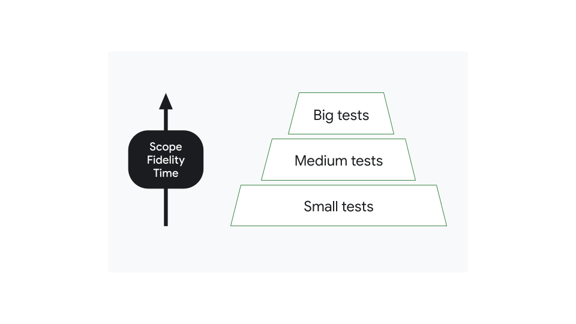
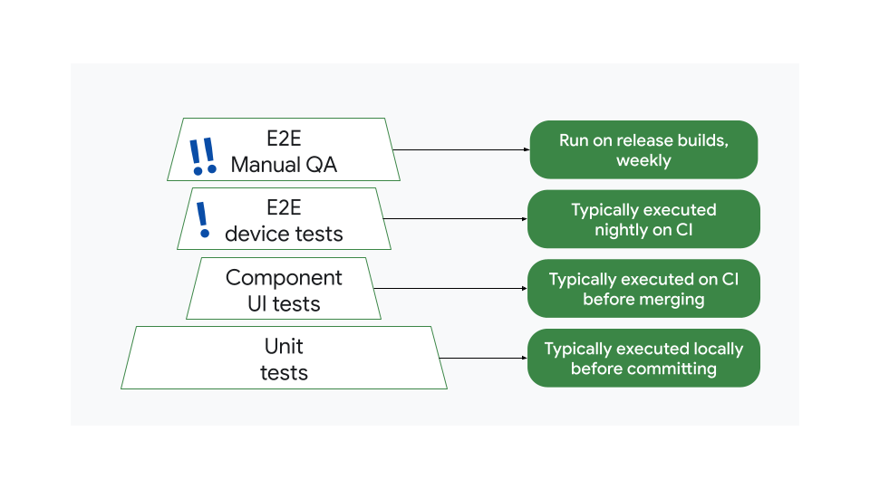
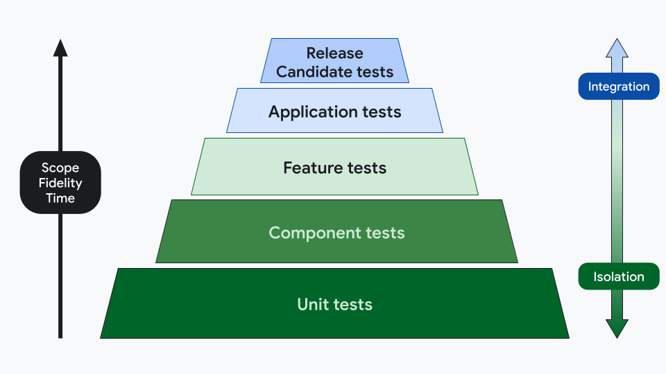

- [テスト戦略](#テスト戦略)
  - [テスト ピラミッド](#テスト-ピラミッド)
  - [バグのコストを最小限に抑える](#バグのコストを最小限に抑える)
  - [スケーラブルなテスト戦略](#スケーラブルなテスト戦略)
  - [テストカテゴリを決定する](#テストカテゴリを決定する)
  - [テストインフラストラクチャ](#テストインフラストラクチャ)
  - [引用元資料](#引用元資料)

# テスト戦略

自動テストは、さまざまな方法でアプリの品質を向上させるのに役立ちます。たとえば、検証の実行、リグレッションの検出、互換性の検証に役立ちます。優れたテスト戦略では、自動テストを活用して、重要なメリットである **デベロッパーの生産性** に集中できます。

テストに体系的なアプローチを採用し、インフラストラクチャを強化すると、チームの生産性が向上します。これにより、コードの動作に関するフィードバックがタイムリーに提供されます。優れたテスト戦略は次のようになります。

- 問題をできるだけ早い段階で検出します。
- 迅速に実行されます。
- 修正が必要な場合に明確な指示を表示します。

このページでは、実装するテストの種類、テストを実行する場所、テストを実行する頻度を決定する際に役立つ情報を紹介します。

**注**: これらのガイドラインは、Android アプリケーションのベースライン テスト戦略として使用することを目的としており、厳密に従う必要はありません。

## テスト ピラミッド

最新のアプリケーションでは、テストをサイズ別に分類できます。小規模なテストはコードのごく一部に絞り込まれるため、高速で信頼性に優れています。大規模なテストは範囲が広く、より複雑な設定が必要で、保守が困難です。ただし、大規模なテストは忠実度 (※ 1 ) が高く、一度に多くの問題を発見できます。

(※ 1 ) 忠実度 ( Fidelity ) とは、テストランタイム環境と本番環境の類似度を指します。

上記の図は、 「テストの規模が大きくなるにつれて、忠実度とテストにかかる時間が大きくなる」 という意味の図です。

ほとんどのアプリでは、小さなテストを多く、大きなテストを比較的少なくする必要があります。各カテゴリのテストの分布はピラミッド状に形成され、小規模なテストが多いほどベースを形成し、大きなテストの数がチップを形成しなくなります。

注: 一部のモバイルアプリには、特定のハードウェア機能に依存している可能性があるため、このピラミッド形状を変える独自のテスト要件がある場合があります（メディア プレーヤーやカメラアプリなど）。

## バグのコストを最小限に抑える

優れたテスト戦略では、バグの検出コストを最小限に抑えながら、デベロッパーの生産性を最大化します。

非効率的な戦略の例を検討しましょう。ここでは、サイズ別のテスト数がピラミッド状に整理されていません。大規模なエンドツーエンド テストが多すぎる、コンポーネント UI テストが少なすぎる:

つまり、マージする前に実行されるテストが少なすぎるということです。バグがある場合、毎晩または毎週のエンドツーエンド テストが実行されるまで、テストで検出されないことがあります。

バグの特定と修正にかかる費用への影響と、テストの規模を小さくして頻度を高めることが重要である理由を検討することが重要です。

- バグが単体テストで検出されると、通常は数分で修正されるため、費用は低くなります。
- エンドツーエンド テストでも、同じバグを検出するまでに数日かかることがあります。複数のチームメンバーが集まり、全体的な生産性が低下し、リリースが遅れる可能性があります。このバグのコストは高くなります。

ただし、戦略がないよりは、非効率的なテスト戦略のほうがましです。バグが本番環境に到達すると、修正がユーザーのデバイスに反映されるまでに時間がかかります（数週間かかることもあります）。そのため、フィードバックループ (※ 1 ) が最も長く、最も費用がかかります。

(※ 1 ) 何かの作業を行った後に、その作業に対してのフィードバックを得られるまでの待機時間のこと。

キーポイント: 一般に、テストは開発サイクルのできるだけ早く追加するようにしてください。通常は、小規模なテストから始めることを意味します。ただし、単体テストですべてをテストするわけではありません。

## スケーラブルなテスト戦略

テストのピラミッドは従来、次の 3 つのカテゴリに分かれています。

- 単体テスト
- 統合テスト
- エンド to エンドテスト

ただし、これらのコンセプトには明確な定義がないため、チームは 5 つのレイヤなど、異なる方法でカテゴリを定義することもできます。

- **単体テスト** は、ホストマシンで実行され、Android フレームワークに依存しない単一の機能単位のロジックを検証します。
  - 例: 数学関数でオフバイワンエラーを確認する。
    - オブバイワンは、直訳すると 「一つずれている」 という意味で、境界値テストの一種です。
- **コンポーネントテスト** は、システム内の他のコンポーネントとは別に、モジュールやコンポーネントの機能または外観を検証します。単体テストとは異なり、コンポーネント テストの表領域は、個々のメソッドやクラスより上位の抽象化にまで広がっています。
  - 例: カスタム ボタンの [スクリーンショットテスト](https://developer.android.com/training/testing/ui-tests/screenshot?hl=ja)
- **機能テスト** では、2 つ以上の独立したコンポーネント、または、モジュールの相互作用を検証します。機能テストは規模が大きく複雑で、通常は機能レベルで実行されます。
  - 例: 画面の状態管理を確認する [UI 動作テスト](https://developer.android.com/training/testing/ui-tests/behavior?hl=ja)
- **アプリケーションテスト** では、デプロイ可能なバイナリの形式で、アプリケーション全体の機能を検証します。テスト対象システムとして、テストフックを含むことができるデバッグ可能なバイナリ（デベロッパー ビルドなど）を使用する大規模な統合テストです。
  - 例: 折りたたみ式デバイスの構成変更を確認する UI 動作テスト、ローカライズ テスト、アクセシビリティ テスト
- リリース候補版テスト は、リリースビルドの機能を検証します。アプリケーション バイナリが圧縮されて最適化されていることを除けば、アプリケーション テストと同様です。これらは、アプリを一般ユーザー アカウントや一般公開バックエンドに公開することなく、できるだけ本番環境に近い環境で実行される大規模なエンドツーエンドの統合テストです。
  - 例: クリティカルユーザージャーニー、 [パフォーマンステスト](https://developer.android.com/training/testing/instrumented-tests/performance?hl=ja)
    - クリティカルユーザージャーニー ( CUJ ) とは、ユーザーが目的を達成する上で、最も重要なパスやプロセスを意味します。
    - 例えば、 EC サイトでは、 「商品検索 -> 商品の詳細確認 -> カートへ追加 -> 購入手続き」 が、 CUJ と考えられます。

この分類では、忠実度、時間、範囲、分離レベルが考慮されます。複数のレイヤにわたってさまざまなタイプのテストを行うことができます。たとえば、アプリケーション テストレイヤには、動作テスト、スクリーンショット テスト、パフォーマンス テストを含めることができます。

| テストの層       | 範囲                                                               | ネットワーク アクセス                        | 実行                                       | ビルドの種類               | ライフサイクル        |
| ---------------- | ------------------------------------------------------------------ | -------------------------------------------- | ------------------------------------------ | -------------------------- | --------------------- |
| 単体             | 依存関係が最小限の単一のメソッドまたはクラス。                     | ×                                            | ローカル                                   | デバッグ可能               | 統合前                |
| コンポーネント   | モジュールまたはコンポーネントレベル。複数のクラスを組み合わせる。 | ×                                            | ローカル,Robolectric,エミュレータ          | デバッグ可能               | 統合前                |
| 機能             | 機能レベル。他のチームが所有するコンポーネントとの統合。           | モック版                                     | ローカル,Robolectric,エミュレータ,デバイス | デバッグ可能               | 統合前                |
| アプリケーション | アプリレベル。他のチームが所有する機能やサービスとの統合。         | モック,ステージングサーバー,本番環境サーバー | エミュレータ,デバイス                      | デバッグ可能               | 統合前,統合後         |
| リリース候補版   | アプリレベル。他のチームが所有する機能やサービスとの統合。         | 本番環境サーバー                             | エミュレータ,デバイス                      | 最小化されたリリースビルド | 統合後,プレリリース版 |

キーポイント: テスト戦略ドキュメントを作成してチームと共有し、さまざまなレイヤと独自の要件を客観的に定義します。優れたテスト戦略ドキュメントでは、テストの目標と優先度を明確に定義し、さまざまなテストカテゴリに責任を割り当てます。

## テストカテゴリを決定する

経験則として、チームに適切なレベルのフィードバックを提供できるピラミッドの最下層を検討する必要があります。

たとえば、ログインフローの UI という機能の実装をテストする方法を考えてみましょう。テストする内容に応じて、次のカテゴリを選択します。

| テスト対象                                 | テスト対象の説明                                                                                                              | テストカテゴリ          | テストのタイプの例                                           |
| ------------------------------------------ | ----------------------------------------------------------------------------------------------------------------------------- | ----------------------- | ------------------------------------------------------------ |
| フォーム バリデータ ロジック               | メールアドレスを正規表現に照らし合わせて検証し、パスワード フィールドが入力されたことを確認するクラス。依存関係はありません。 | 単体テスト              | ローカル JVM ユニットテスト                                  |
| ログイン フォームの UI の動作              | フォームが検証されたときにのみ有効になるボタンがあるフォーム                                                                  | コンポーネント テスト   | Robolectric で実行される UI 動作テスト                       |
| ログイン フォームの UI の外観              | UX 仕様に準拠したフォーム                                                                                                     | コンポーネント テスト   | Compose プレビューのスクリーンショットのテスト               |
| 認証マネージャーとの統合                   | 認証情報を認証マネージャーに送信し、さまざまなエラーを含むレスポンスを受信する UI。                                           | 機能テスト              | フェイクを使用した JVM テスト                                |
| ログイン ダイアログ                        | ログインボタンが押されたときにログイン フォームを表示する画面。                                                               | アプリケーション テスト | Robolectric で実行される UI 動作テスト                       |
| クリティカル ユーザー ジャーニー: ログイン | ステージング サーバーでテスト アカウントを使用する完全なログインフロー                                                        | リリース候補版          | デバイスで実行されるエンドツーエンドの Compose UI 動作テスト |

あるものがどのカテゴリに属するかは、主観的な場合もあります。テストが優先度を上げたり下げたりする場合、インフラストラクチャの費用、不安定性、テスト時間の長さなど、その他の理由が考えられます。

テストカテゴリによってテストの種類が決定されるわけではなく、すべてのカテゴリですべての機能をテストする必要があるわけではありません。

手動テストもテスト戦略の一部に含めることができます。通常、QA チームはリリース候補版テストを実行しますが、他のステージに関与することもできます。たとえば、スクリプト (※ 1 ) のない機能のバグに関する探索的テストなどです。

(※ 1 ) ここでいう 「スクリプト」 は、テスト仕様書のことを示します。

キーポイント: 内部ドキュメントの一部としてアプリのテスト戦略を記述し、時間の経過とともに変更できるようにしておきます。一貫性が高まり、新しいチームメンバーの助けになります。

## テストインフラストラクチャ

テスト戦略は、デベロッパーがテストを継続的に実行し、すべてのテストが合格することを保証するルールを適用できるように、インフラストラクチャとツールによって、サポートされている必要があります。

テストをスコープ別に分類して、どのテストをいつ、どこで実行するかを定義できます。たとえば、次の 5 階層モデルがあるとします。

| カテゴリ         | 環境（場所）                                                             | トリガー（タイミング）                 |
| ---------------- | ------------------------------------------------------------------------ | -------------------------------------- |
| 単体             | [ローカル][4]                                                            | すべての commit                        |
| コンポーネント   | ローカル                                                                 | すべての commit                        |
| 機能             | ローカルとエミュレータ                                                   | マージ前、変更をマージまたは送信する前 |
| アプリケーション | ローカル、エミュレータ、スマートフォン 1 台、折りたたみ式デバイス 1 台   | マージ後、変更のマージまたは送信後     |
| リリース候補版   | 8 種類のスマートフォン、1 種類の折りたたみ式デバイス、1 種類のタブレット | リリース前                             |

- **単体テスト** と **コンポーネントテスト** は、新しい commit ごとに [継続的インテグレーションシステム](https://developer.android.com/training/testing/continuous-integration?hl=ja) で実行されますが、影響を受けるモジュールに対してのみ実行されます。
- 変更をマージまたは送信する前に、すべての **単体テスト、コンポーネントテスト、機能テスト** が実行されます。
- **アプリケーションテスト** はマージ後に実行されます。
- **リリース候補版テスト** は、スマートフォン、折りたたみ式デバイス、タブレットで夜間に実施されます。
- リリース前に、多数のデバイスで **リリース候補版テスト** が実行されます。

テストの数によって生産性が影響を受ける場合は、これらのルールが変更されることがあります。たとえば、テストを毎晩の頻度で移動すると、CI のビルドとテストの時間が短縮される可能性がありますが、フィードバック ループが長くなることがあります。

注: ビルドとテストを自動化する方法の詳細については、 [継続的インテグレーションの基本](https://developer.android.com/training/testing/continuous-integration?hl=ja) をご覧ください。

## 引用元資料

- [テスト戦略](https://developer.android.com/training/testing/fundamentals/strategies?hl=ja)

