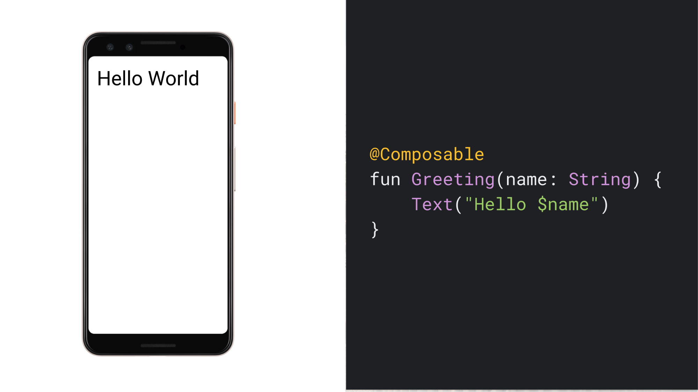
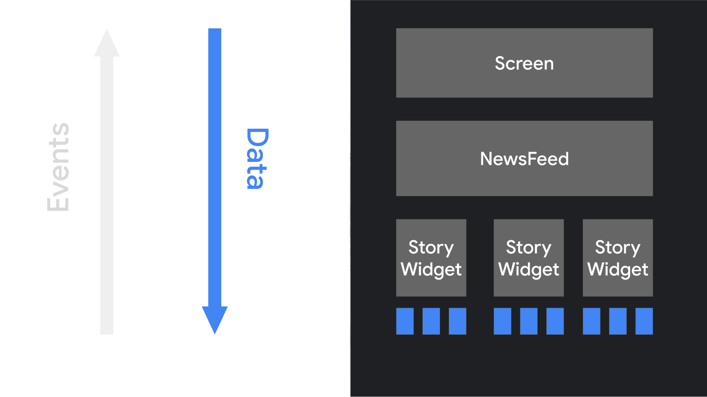

- [Compose における考え方](#compose-における考え方)
  - [宣言型プログラミング パラダイム](#宣言型プログラミング-パラダイム)
  - [シンプルでコンポーズ可能な関数](#シンプルでコンポーズ可能な関数)
  - [宣言型パラダイム シフト](#宣言型パラダイム-シフト)
  - [動的コンテンツ](#動的コンテンツ)
  - [再コンポーズ](#再コンポーズ)
    - [再コンポーズとは](#再コンポーズとは)
      - [ここでいうラムダとはどこのこと？](#ここでいうラムダとはどこのこと)
    - [副作用のリスク](#副作用のリスク)
    - [コンポーザブル関数では、時間のかかる処理を避ける](#コンポーザブル関数では時間のかかる処理を避ける)
  - [コンポーザブル関数を作成する際の注意点](#コンポーザブル関数を作成する際の注意点)
    - [再コンポーズは（状態が変更されていないと確信できるコンポーザブル関数を）可能な限りスキップする](#再コンポーズは状態が変更されていないと確信できるコンポーザブル関数を可能な限りスキップする)
    - [再コンポーズは厳密なものではない](#再コンポーズは厳密なものではない)
    - [コンポーズ可能な関数は何度も実行されることがある](#コンポーズ可能な関数は何度も実行されることがある)
    - [コンポーズ可能な関数は並行して実行できる](#コンポーズ可能な関数は並行して実行できる)
    - [コンポーズ可能な関数は任意の順序で実行できる（実行順序が入れ替わる可能性がある）](#コンポーズ可能な関数は任意の順序で実行できる実行順序が入れ替わる可能性がある)
  - [引用元資料](#引用元資料)


# Compose における考え方

Jetpack Compose は、Android 用の最新の宣言型 UI ツールキットです。Compose では、フロントエンド ビューを命令的に変更することなく、アプリ UI をレンダリングできる宣言型 API が提供されるため、アプリ UI の作成とメンテナンスが容易になります。この用語については説明が必要ですが、この影響はアプリの設計にとって重要です。


## 宣言型プログラミング パラダイム

これまで、Android のビュー階層は UI ウィジェットのツリーとして表現できていました。ユーザー操作などによってアプリの状態が変わると、現在のデータを表示するために UI 階層を更新する必要があります。UI を更新する方法としては、findViewById() などの関数を使用してツリーをたどってから、button.setText(String)、container.addChild(View)、img.setImageBitmap(Bitmap) などのメソッドを呼び出してノードを変更する方法が最も一般的です。こうしたメソッドは、ウィジェットの内部状態を変更します。

ビューを手動で操作すると、エラーが発生する可能性が高くなります。データの一部が複数の場所でレンダリングされている場合、それを示すビューのうちいずれかの更新を忘れがちです。また、2 つの更新が予期せず競合すると、不正な状態が作成されやすくなります。たとえば、UI から削除されたばかりのノードの値を設定しようとすることがあります。一般に、更新が必要なビューの数が増えると、ソフトウェア メンテナンスの複雑さが増大します。

ここ数年、業界全体が宣言型 UI モデルに移行し始め、ユーザー インターフェースの構築や更新に関連するエンジニアリングは大幅に簡素化されています。この手法は、概念的に画面全体をゼロから再生成し、必要な変更のみを適用することで機能します。このアプローチでは、ステートフルなビュー階層を手動で更新する複雑さを回避できます。Compose は宣言型 UI フレームワークです。

画面全体を再生成する際の課題は、時間、コンピューティング能力、電池使用量という点で、コストが高くなる可能性があることです。このコストを軽減するために、Compose は常に、UI のうち再描画する必要がある部分をインテリジェントに選択します。これは、 [再コンポーズ](#再コンポーズ) で説明するように、UI コンポーネントの設計の良し悪しによって、パフォーマンスが変わってきます。


## シンプルでコンポーズ可能な関数

Compose では、データを取り込み UI 要素を出力するコンポーズ可能な関数のセットを定義することで、ユーザー インターフェースを作成できます。簡単な例としては、Greeting ウィジェットがあります。これは String を受け取り、挨拶メッセージを表示する Text ウィジェットを出力します。



この関数で注目すべき点は次のとおりです。

- **この関数には @Composable アノテーションが付けられています。**
  - コンポーズ可能な関数はすべて、このアノテーションが必要です。このアノテーションは、この関数がデータを UI に変換するためのものであることを Compose コンパイラに伝えます。

- **この関数はデータを取り込みます。**
  - コンポーズ可能な関数は、アプリのロジックで、パラメータを受け取って、 UI を記述できます。この場合、ウィジェットは String を受け入れるため、名前を呼んでユーザーに挨拶できます。

- **他のコンポーズ可能な関数を呼び出すことで UI 階層を生成します**
  - この関数は UI にテキストを表示します。そのために、コンポーズ可能な関数 Text() を呼び出します。この関数は、実際にテキスト UI 要素を作成します。

- **この関数は何も返しません。**
  - UI を出力する **Compose 関数は、UI ウィジェットを作成するのではなく、目的の画面状態を記述するため、何も返す必要はありません。**

- **この関数は参照透過であり、副作用はありません。**
  - この関数は、同じ引数で複数回呼び出されても同じように動作します。グローバル変数などの他の値の参照、または random() への呼び出しは使用しません。
  - この関数は、プロパティやグローバル変数の更新などの副作用なしで UI を記述します。
  - [冪等](../../../../../../../プログラミング全般/冪等性.md) と [参照透過](../../../../../../../プログラミング全般/参照透過性.md) の違いについては、 [こちら](../../../../../../../プログラミング全般/参照透過性と冪等性の違い.md) を参照してください。

一般に、コンポーズ可能な関数はすべて、 [再コンポーズ](#再コンポーズ) で説明している理由から、こうしたプロパティを持たせて作成する必要があります。


## 宣言型パラダイム シフト

命令型オブジェクト指向 UI ツールキットの多くは、ウィジェットのツリーをインスタンス化することで UI を初期化します。そのためには通常、XML レイアウト ファイルをインフレートします。各ウィジェットは自身の内部状態を維持し、アプリのロジックでウィジェットを操作できるようにするゲッター メソッドとセッター メソッドを公開します。

Compose の宣言型アプローチでは、ウィジェットは比較的ステートレスであり、setter または getter 関数は公開されません。実際、ウィジェットはオブジェクトとして公開されません。同一のコンポーズ可能な関数を異なる引数で呼び出すことにより、UI を更新します。これにより、アプリ アーキテクチャ ガイドで説明されているように、ViewModel などのアーキテクチャ パターンに状態を簡単に提供できます。その後、コンポーザブルは、監視可能なデータが更新されるたびに現在のアプリ状態を UI に変換する役割を担います。

アプリロジック (主に ViewModel ) は、最上位のコンポーズ可能な関数にデータを提供します。この関数はデータを使用して、他のコンポーザブルを呼び出すことで UI を記述し、そのコンポーザブルに適切なデータを渡して、階層を下ります。



ユーザーが UI を操作すると、UI で onClick などのイベントが発生します。こうしたイベントはアプリロジック (主に ViewModel ) に伝えられ、これによりアプリの状態を変更できます。状態が変更されると、コンポーズ可能な関数が新しいデータで再度呼び出されます。これにより、UI 要素が再描画されます（このプロセスを再コンポーズといいます）。


## 動的コンテンツ

コンポーズ可能な関数は XML ではなく Kotlin で記述されているため、他の Kotlin コードと同様に、動的なものにできます。たとえば、ユーザーのリストに対し挨拶をする UI を作成するとします。

```kotlin
@Composable
fun Greeting(names: List<String>) {
    for (name in names) {
        Text("Hello $name")
    }
}
```

この関数は名前のリストを受け取り、各ユーザーに対する挨拶を生成します。コンポーズ可能な関数は、非常に高度なものにもできます。if ステートメントを使用して、特定の UI 要素を表示するかどうかを決定できます。ループを使用したり、ヘルパー関数を呼び出したりすることもできます。基となる言語に対して高い柔軟性があり、この充実した機能と柔軟性が、Jetpack Compose の主な利点です。


## 再コンポーズ

### 再コンポーズとは

命令型 UI モデルでウィジェットを変更するには、ウィジェットでセッターを呼び出して内部状態を変更します。一方で、 Compose は、コンポーズ可能な関数を新しいデータで再度呼び出します。すると、関数が再コンポーズされます。関数によって出力されるウィジェットは、必要に応じて新しいデータで再描画されます。Compose フレームワークでは、変更されたコンポーネントのみをインテリジェントに再コンポーズできます。

たとえば、ボタンを表示するコンポーズ可能な関数について考えてみます。

```kotlin
@Composable
fun ClickCounter(clicks: Int, onClick: () -> Unit) {
    Button(onClick = onClick) {
        Text("I've been clicked $clicks times")
    }
}
```

ボタンがクリックされるたびに、呼び出し元は clicks の値を更新します。Compose は Text 関数が含まれるラムダを再度呼び出し、新しい値を表示します。このプロセスを再コンポーズといいます。値に依存しない他の関数は再コンポーズされません。

すでに説明したように、UI ツリー全体を再コンポーズすると、コンピューティングのコストがかかり、コンピューティング能力と電池寿命が消費されます。Compose は、このインテリジェントな再コンポーズによってこの問題を解決します。

**再コンポーズとは、入力が変更されたときに、コンポーズ可能な関数を再度呼び出すプロセスです。** これは、関数の入力が変更された場合に発生します。新しい入力に基づいて再コンポーズされると、 Compose は、変更された可能性のある関数、または、ラムダ ( [ここでいうラムダとはどこのこと？](#ここでいうラムダとはどこのこと) ) のみを呼び出し、残りはスキップします。パラメータを変更しない関数またはラムダをすべてスキップすることで、Compose で効率的に再コンポーズできます。


#### ここでいうラムダとはどこのこと？

再コンポーズの説明に関するドキュメントでは、再コンポーズ時に、 「関数、または、ラムダを再実行する」 という記述が頻繁に見受けられます。ここで言う 「関数」 や 「ラムダ」 が、どこのことなのか、よく混乱するため、解説していきます。

```kotlin
@Composable
fun ClickCounter(clicks: Int, onClick: () -> Unit) { // ラムダ 1
    Button(onClick = onClick) { // ラムダ 2
        Text("I've been clicked $clicks times")
    }
}
```

まず、上記の ClickCounter() 関数や、 Button() 関数の後ろにくっついている中カッコは、 「ラムダ」 になります。 「関数」 ではありません。なぜなら、これらの中カッコ内は、関数の本体ではなく、関数の引数だからです。 Button() 関数の本体は、別の場所に定義されており、以下のようになっています。

```kotlin
@Composable
fun Button(
    onClick: () -> Unit,
    /* 中略 */
    content: @Composable RowScope.() -> Unit
) {
    // 略
}
```

この Button 関数の定義に記述されている中カッコは、関数の本体なので、これは、公式ドキュメントでは、 「関数」 と呼ばれている部分だと考えられます。

このように、関数の本体なのか？あるいは、関数の引数なのか？で、公式ドキュメントでは、 「関数」 と 「ラムダ」 という言葉を使い分けていると思われます。


### 副作用のリスク

関数の再コンポーズはスキップされる可能性があるため、副作用の伴う処理は、基本的には避けるべきです。例えば、次のようなアクションはすべて危険な副作用です。

- 共有オブジェクトのプロパティへの書き込み
- ViewModel で監視可能なデータの更新
- SharedPreferences の更新

再コンポーズのスキップには、 2 種類あります。

- 状態に変更がなかったため、関数やラムダの実行が全く行われないスキップ
- 再コンポーズ中に、次の状態変化が発生し、現在の再コンポーズをキャンセルして、最新の値で再コンポーズを開始するスキップ


### コンポーザブル関数では、時間のかかる処理を避ける

コンポーズ可能な関数は、アニメーションをレンダリングするときなど、フレームごとに何度も再実行されることがあります。 **アニメーション中にジャンクが発生しないように、コンポーズ可能な関数は高速にする必要があります。** コストの高い操作 ( SharedPreferences からの読み取りなど) が必要な場合は、バックグラウンドコルーチンで行い、その値をパラメータとしてコンポーズ可能な関数に渡します。

たとえば、 SharedPreferences の値を更新するコンポーザブルを作成するとします。このコンポーザブル内では、 SharedPreferences からの読み取りや書き込みを行いません。代わりに、このコードはバックグラウンドコルーチンの ViewModel に対して読み取りと書き込みを行います。アプリロジック ( ViewModel ) は、取得した値をコールバックで渡し、コンポーズを更新します。

```kotlin
// Composable 関数内からは、 SharedPreferences へアクセスせず、
// ViewModel 経由で SharedPreferences へアクセスします。

@Composable
fun XxxScreen() {
    SharedPrefsToggle(
        text = /* テキスト */,
        value = /* ViewModel 経由で、データソースから取得したトグルの状態 */,
        onValueChanged = /* ViewModel 経由で、データソースを更新するアクション */,
    )
}

@Composable
fun SharedPrefsToggle(
    text: String,
    value: Boolean,
    onValueChanged: (Boolean) -> Unit
) {
    Row {
        Text(text)
        Checkbox(checked = value, onCheckedChange = onValueChanged)
    }
}
```


## コンポーザブル関数を作成する際の注意点

ここでは、コンポーザブル関数を作成する際に知っておくべきことをいくつか説明します。

- 再コンポーズは、可能な限り多くのコンポーズ可能な関数とラムダをスキップする。
- 再コンポーズは厳密なものではなく、キャンセルされる場合がある。
- コンポーズ可能な関数は、アニメーションのフレームごとに何度も実行される場合がある。
- コンポーズ可能な関数は並行して実行できる。
- コンポーズ可能な関数は任意の順序で実行できる。

それぞれのポイントについて、以下で詳しく説明していきます。いずれの場合でも、コンポーズ可能な関数は、高速、かつ、参照透過なものにすることをおすすめします。


### 再コンポーズは（状態が変更されていないと確信できるコンポーザブル関数を）可能な限りスキップする

Compose は、更新が必要な部分のみを再コンポーズしようとします。更新が必要かどうかがわからない場合は、再コンポーズの対象となります。

UI の一部が無効な場合、Compose は、更新が必要な部分のみを再コンポーズしようとします。つまり、1 つのボタンのコンポーザブルを再実行するために、UI ツリー内で上、または、下にあるコンポーザブルを実行せず、スキップすることがあります。

コンポーズ可能な関数とラムダはすべて、それ自体で再コンポーズすることがあります。 (関数とラムダは、再コンポーズのエントリーポイントになり、また、実行単位 (スコープ) にもなります。)

次の例は、リストのレンダリング時に、再コンポーズによって一部の要素をスキップする方法を示しています。

次の例は、ヘッダーが一つあり、その下に、名前のリストがある UI を生成します。名前はそれぞれがタップ可能になっています。

```kotlin
@Composable
fun NamePicker(
    header: String,
    names: List<String>,
    onNameClicked: (String) -> Unit
) {
    Column {
        // Text は、 header が変更された場合には再コンポーズされます。
        // header が変更されず、 names のみが変更されている場合には、再コンポーズされません。
        Text(header, style = MaterialTheme.typography.bodyLarge)

        Divider()

        LazyColumn {
            items(names) { name ->
                // NamePickerItem は、 names が変更された場合には再コンポーズされますが、
                // names が変更されず、 header のみが変更されている場合には、再コンポーズされません。
                NamePickerItem(name, onNameClicked)
            }
        }
    }
}

@Composable
private fun NamePickerItem(name: String, onClicked: (String) -> Unit) {
    Text(name, Modifier.clickable(onClick = { onClicked(name) }))
}
```

周辺のスコープがスキップされる可能性があるため、それぞれの関数やラムダのスコープは、再コンポーズ時に実行される唯一のブロックになる可能性があります。上記の例では、 header が変更された際には、 Column ラムダを再実行しますが、その親はスキップされて、 Column ラムダのみが実行される可能性があります。 Column を実行する際には、 names が変更されていなければ、 LazyColumn の items の実行をスキップする可能性があります。

コンポーズ可能な関数、または、ラムダの実行はすべて、副作用がないようにしてください。副作用が必要な場合は、コールバックからトリガーします。コールバックからトリガーする理由は 2 つあります。

- [onClick などのコールバックは、常にメインスレッドで実行される](#コンポーズ可能な関数は並行して実行できる) ため、スレッド間の同期による不具合が発生しません。
- コールバックを行って、処理を ViewModel に移譲することで、長時間実行される処理を ViewModel に移し、 [コンポーザブル関数は短時間で完了できるように](#コンポーザブル関数では時間のかかる処理を避ける) します。


### 再コンポーズは厳密なものではない

コンポーザブルのパラメータが変更された可能性があることを Compose が認識するたびに、再コンポーズが開始されます。ある再コンポーズが開始されてから、それが終わるより前にパラメータが変更された場合、 Compose は実行中の **再コンポーズをキャンセルし、新しいパラメータで再コンポーズを開始することがあります。**

再コンポーズをキャンセルした場合、キャンセルされた UI ツリーは破棄されます。

コンポーザブル関数に副作用が含まれている場合は、再コンポーズのキャンセルによって、想定外の状態になる可能性があります。そうならないためにも、コンポーザブル関数は、参照透過で副作用がないようにしてください。あるいは、副作用を適切に実行してください。


### コンポーズ可能な関数は何度も実行されることがある

場合によっては、コンポーズ可能な関数が UI アニメーションのフレームごとに実行されることがあります。関数がコストの高いオペレーション (デバイスストレージからの読み取りなど) を行う場合、関数によって UI ジャンクが発生することがあります。

たとえば、ウィジェットがデバイスの設定を読み取ろうとすると、その設定を 1 秒に数百回読み取って、アプリのパフォーマンスに深刻な影響を及ぼす可能性があります。

コンポーザブル関数でデータが必要な場合は、関数の引数にそのデータ用のパラメータを定義してください。すると、コストの高い処理をコンポーザブル関数外の別のスレッドに移動できます。そして、外部で取得したデータを mutableStateOf 、または、 LiveData を使用して、コンポーザブル関数に渡せます。

具体的なコードのイメージは、 [コンポーザブル関数では、時間のかかる処理を避ける](#コンポーザブル関数では時間のかかる処理を避ける) を参照してください。


### コンポーズ可能な関数は並行して実行できる

**注**: コンポーズ可能な関数は現在並行して実行できませんが、Compose コードはマルチスレッドで実行されることを意識して、記述する必要があります。将来的には、Compose がマルチスレッド化される可能性があります。

Compose は、コンポーズ可能な関数を並行して実行することで、再コンポーズを最適化できます。これにより Compose は複数のコアを活用し、画面上にないコンポーズ可能な関数を、より低い優先度で実行します。

この最適化は、コンポーズ可能な関数がバックグラウンド スレッドで実行される可能性があることを意味します。つまり、コンポーズ可能な関数が ViewModel の関数を呼び出す際に、 ViewModel の関数が、複数のスレッドから同時に呼び出される可能性があります。

アプリを正しく動作させるには、コンポーザブル関数では、副作用をなくす必要があります。もしくは、 onClick などの常に UI スレッドで実行されるコールバックから副作用をトリガーしてください。 UI スレッドから ViewModel の関数を呼び出すことで、 ViewModel 内のプロパティの更新において、スレッド間の同期が不要になり、それに起因する不具合を回避することができます。

(将来的に) コンポーザブル関数の呼び出しがマルチスレッド化されると、 **呼び出し元とは異なるスレッドで呼び出しが行われる可能性があります。** つまり、コンポーザブル関数内や、ラムダブロック内で、異なる関数のローカル変数を変更するコードは、避ける必要があります（そのようなコードはスレッドセーフではなく、また、コンポーザブル関数やラムダの許容されない副作用であるためです）。

リストとそのカウントを表示するコンポーザブルの例を次に示します。

```kotlin
@Composable
fun ListComposable(myList: List<String>) {
    Row(horizontalArrangement = Arrangement.SpaceBetween) {
        Column {
            for (item in myList) {
                Text("Item: $item")
            }
        }
        Text("Count: ${myList.size}")
    }
}
```

このコードは副作用がなく、入力リストを UI に変換します。これは小さなリストを表示する場合に適したコードです。ただし、関数がローカル変数に書き込む場合、このコードはスレッドセーフではなく、正しくありません。

```kotlin
@Composable
@Deprecated("Example with bug")
fun ListWithBug(myList: List<String>) {
    var items = 0

    Row(horizontalArrangement = Arrangement.SpaceBetween) {
        Column {
            for (item in myList) {
                Text("Item: $item")
                // items 変数は、 ListWithBug 関数のローカル変数です。
                // Column 関数が、 ListWithBug 関数とは、別のスレッドで実行された場合、
                // スレッド間の変数の同期がとれずに、想定外の動作になる可能性があります。
                //
                // 関数やラムダ内のローカル変数を更新したい場合は、
                // 同一関数内や、同一ラムダ内で定義されたローカル変数のみを
                // 更新するようにしてください。
                // これらは、意図的にスレッドを変更しない限り、
                // 同じスレッドで処理されるため、スレッドセーフです。
                items++
            }
        }
        Text("Count: $items")
    }
}
```

この例で、items は再コンポーズのたびに変更されます。アニメーションのフレームごとに、またはリストの更新時に発生する可能性があります。どちらの場合も、UI に誤ったカウントが表示されます。このため、Compose ではこのような書き込みはサポートされていません。このような書き込みを禁止することにより、フレームワークがスレッドを変更してコンポーズ可能なラムダを実行できるようになります。

「では、どのような実装にすれば、ローカル変数の更新がスレッドセーフになるのか？」 についての記述がここにはないため、その方法については、調査中です。


### コンポーズ可能な関数は任意の順序で実行できる（実行順序が入れ替わる可能性がある）

注: Compose はメインスレッドで動作しますが、マルチスレッドを念頭に置いて最初から設計されているため、今後もシングルスレッド モデルが維持されるとは限りません。そのため、コンポーザブルは常に、複数のスレッドで実行できるものとして記述する必要があります。

コンポーズ可能な関数のコードを見ると、コードが書かれているとおりの順序で実行されるように思われるかもしれません。ただし、必ずしもそうであるとは限りません。あるコンポーズ可能な関数に、他のコンポーズ可能な関数の呼び出しが含まれている場合、これらの関数は任意の順序で実行されます。Compose には、一部の UI 要素の優先順位が他よりも高いことを認識し、先に描画するというオプションがあります。

たとえば、3 つの画面を 1 つのタブレイアウトに描画する次のようなコードがあるとします。

```kotlin
@Composable
fun ButtonRow() {
    MyFancyNavigation {
        StartScreen()
        MiddleScreen()
        EndScreen()
    }
}
```

StartScreen、MiddleScreen、EndScreen の呼び出しは、任意の順序で発生します。つまり、たとえば StartScreen() でグローバル変数を設定し（副作用）、その変更を MiddleScreen() で活用することはできません。代わりに、 **各関数を自己完結させる必要があります。**


## 引用元資料

- [Compose における考え方](https://developer.android.com/develop/ui/compose/mental-model?hl=ja&_gl=1*z7xh91*_up*MQ..*_ga*NzU5NjYwOTAuMTczMTkwMDk4Ng..*_ga_6HH9YJMN9M*MTczMTkwNzQ1MS4yLjAuMTczMTkwNzQ1MS4wLjAuMjk2NDQwNDk3)


