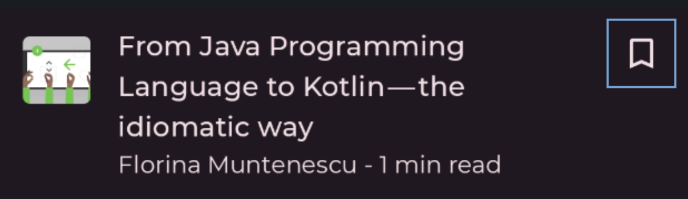

- [操作について理解する](#操作について理解する)
  - [言葉の定義](#言葉の定義)
  - [さまざまなレベルの抽象化](#さまざまなレベルの抽象化)
    - [コンポーネントに含まれているサポートを優先的に使用する](#コンポーネントに含まれているサポートを優先的に使用する)
    - [修飾子を使用して任意のコンポーザブルに特定の操作を追加する](#修飾子を使用して任意のコンポーザブルに特定の操作を追加する)
    - [pointerInput 修飾子を使用して任意のコンポーザブルにカスタム ジェスチャーを追加する](#pointerinput-修飾子を使用して任意のコンポーザブルにカスタム-ジェスチャーを追加する)
      - [pointerInput で使用可能な便利なユーティリティ](#pointerinput-で使用可能な便利なユーティリティ)
      - [ジェスチャーごとにイベントを処理する](#ジェスチャーごとにイベントを処理する)
      - [特定のアクティビティやサブジェスチャーを待つ](#特定のアクティビティやサブジェスチャーを待つ)
      - [マルチタッチ イベントの計算を適用する](#マルチタッチ-イベントの計算を適用する)
  - [イベントのディスパッチとヒットテスト](#イベントのディスパッチとヒットテスト)
  - [イベントの消費](#イベントの消費)
  - [イベントの伝播](#イベントの伝播)
  - [ジェスチャーをテストする](#ジェスチャーをテストする)
  - [さらに学ぶ](#さらに学ぶ)


# 操作について理解する

アプリケーションでジェスチャ処理に取り組む際に理解しておくべき重要な用語と概念がいくつかあります。このページでは、ポインター、ポインター イベント、ジェスチャという用語について説明し、ジェスチャのさまざまな抽象化レベルを紹介します。また、イベントの消費と伝播についても詳しく説明します。


## 言葉の定義

このページのさまざまな概念を理解するには、使用されている用語の一部を理解する必要があります。

- **ポインター** : アプリケーションと対話するために使用できる物理オブジェクト。 **モバイル デバイスの場合、最も一般的なポインターは、タッチスクリーンと対話する指です。** または、指の代わりにスタイラスを使用することもできます。大画面の場合は、マウスまたはトラックパッドを使用して間接的にディスプレイと対話できます。入力デバイスがポインターと見なされるには、座標を「指す」ことができる必要があるため、たとえばキーボードはポインターと見なされません。Compose では、ポインター タイプは [PointerType](https://developer.android.com/reference/kotlin/androidx/compose/ui/input/pointer/PointerType?_gl=1*mobex2*_up*MQ..*_ga*MjA3NTExNzk4Ny4xNzI3MTczOTI5*_ga_6HH9YJMN9M*MTcyNzIxNTIxOS4zLjAuMTcyNzIxNTY5MS4wLjAuODA4NjM0MTQz) を使用してポインターの変更に含まれます。

- **ポインター イベント** : 特定の時点での 1 つ以上のポインターとアプリケーションの低レベルのインタラクションを表します。画面に指を置く、マウスをドラッグするなどのポインターのアクションは、イベントをトリガーします。Compose では、このようなイベントに関連するすべての情報は、 [PointerEvent](https://developer.android.com/reference/kotlin/androidx/compose/ui/input/pointer/PointerEvent?_gl=1*gao309*_up*MQ..*_ga*MjA3NTExNzk4Ny4xNzI3MTczOTI5*_ga_6HH9YJMN9M*MTcyNzIxNTIxOS4zLjAuMTcyNzIxNTY5MS4wLjAuODA4NjM0MTQz) クラスに含まれています。

- **ジェスチャー** : **単一のアクションとして解釈できるポインター イベントの一つのまとまり (シーケンス) 。** たとえば、タップ ジェスチャは、ダウン イベントの後にアップ イベントが続くシーケンスと考えることができます。タップ、ドラッグ、変形など、多くのアプリで使用される一般的なジェスチャがありますが、必要に応じて独自のカスタム ジェスチャを作成することもできます。


## さまざまなレベルの抽象化

Jetpack Compose は、ジェスチャを処理するためのさまざまなレベルの抽象化を提供します。最上位レベルはコンポーネントによるサポートです。 [Button](https://developer.android.com/reference/kotlin/androidx/compose/material3/package-summary?_gl=1*g8mk4b*_up*MQ..*_ga*MjA3NTExNzk4Ny4xNzI3MTczOTI5*_ga_6HH9YJMN9M*MTcyNzIxNTIxOS4zLjAuMTcyNzIxNTY5MS4wLjAuODA4NjM0MTQz#Button(kotlin.Function0,androidx.compose.ui.Modifier,kotlin.Boolean,androidx.compose.ui.graphics.Shape,androidx.compose.material3.ButtonColors,androidx.compose.material3.ButtonElevation,androidx.compose.foundation.BorderStroke,androidx.compose.foundation.layout.PaddingValues,androidx.compose.foundation.interaction.MutableInteractionSource,kotlin.Function1)) などのコンポーザブルには、ジェスチャ サポートが自動的に含まれます。

カスタム コンポーネントにジェスチャ サポートを追加するには、任意のコンポーザブルに [clickable](https://developer.android.com/reference/kotlin/androidx/compose/foundation/package-summary?_gl=1*g8mk4b*_up*MQ..*_ga*MjA3NTExNzk4Ny4xNzI3MTczOTI5*_ga_6HH9YJMN9M*MTcyNzIxNTIxOS4zLjAuMTcyNzIxNTY5MS4wLjAuODA4NjM0MTQz#(androidx.compose.ui.Modifier).clickable(androidx.compose.foundation.interaction.MutableInteractionSource,androidx.compose.foundation.Indication,kotlin.Boolean,kotlin.String,androidx.compose.ui.semantics.Role,kotlin.Function0)) などのジェスチャ修飾子を追加できます。

カスタム ジェスチャが必要な場合は、 [pointerInput](https://developer.android.com/reference/kotlin/androidx/compose/ui/input/pointer/package-summary?_gl=1*g8mk4b*_up*MQ..*_ga*MjA3NTExNzk4Ny4xNzI3MTczOTI5*_ga_6HH9YJMN9M*MTcyNzIxNTIxOS4zLjAuMTcyNzIxNTY5MS4wLjAuODA4NjM0MTQz#(androidx.compose.ui.Modifier).pointerInput(kotlin.Any,kotlin.Any,kotlin.coroutines.SuspendFunction1)) 修飾子を使用できます。

原則として、必要な機能を提供する最高レベルの抽象化に基づいて構築します。この方法では、レイヤーに含まれるベスト プラクティスのメリットを活用できます。たとえば、Button には、アクセシビリティに使用されるセマンティック情報が clickable よりも多く含まれますが、 clickable には、 pointerInput よりも多くの情報が含まれます。

注: 適切なレベルの抽象化を選択することは、Compose の共通のテーマです。 [アーキテクチャのレイヤー化に関するドキュメント](../../2.UIアーキテクチャ/6.アーキテクチャのレイヤリング.md) で詳細をご覧ください。


### コンポーネントに含まれているサポートを優先的に使用する

Compose の多くのすぐに使用できるコンポーネントには、何らかの内部ジェスチャ処理が含まれています。たとえば、LazyColumn はドラッグ ジェスチャに応答してコンテンツをスクロールし、Button は押すと波紋を表示し、SwipeToDismiss コンポーネントには要素を閉じるためのスワイプ ロジックが含まれています。このタイプのジェスチャ処理は自動的に機能します。

内部ジェスチャ処理の他に、多くのコンポーネントでは呼び出し元がジェスチャを処理する必要があります。たとえば、Button は自動的にタップを検出し、クリック イベントをトリガーします。ジェスチャに反応するには、Button に onClick ラムダを渡します。

ユース ケースに合う場合は、コンポーネントに含まれるジェスチャを優先してください。コンポーネントには、フォーカスとアクセシビリティのすぐに使用できるサポートが含まれており、十分にテストされています。たとえば、Button は特別な方法でマークされているため、アクセシビリティ サービスでは、クリック可能な要素としてではなく、ボタンとして正しく説明されます。

```kotlin
// Talkback では次のように読み上げられます。(ボタンとして認識されています)
// "Click me!, Button, double tap to activate"
Button(onClick = { /* TODO */ }) { Text("Click me!") }
// Talkback では次のように読み上げられます。(ボタンとして認識されていません。)
// "Click me!, double tap to activate"
Box(Modifier.clickable { /* TODO */ }) { Text("Click me!") }
```

Compose のアクセシビリティの詳細については、 [Compose のアクセシビリティ](../../9.ユーザー補助) を参照してください。


### 修飾子を使用して任意のコンポーザブルに特定の操作を追加する

任意のコンポーザブルに既存のジェスチャ修飾子 ( clickable 等、以下の一覧の総称のこと) を適用して、コンポーザブルがジェスチャをリッスンするようにすることができます。たとえば、汎用の Box をクリック可能にしてタップ ジェスチャを処理させたり、verticalScroll を適用して Column に垂直スクロールを処理させたりすることができます。

さまざまな種類のジェスチャを処理するための修飾子は多数あります。

- タップとプレスを処理する修飾子
  - clickable
  - combinedClickable
  - selectable
  - toggleable
  - triStateToggleable

- スクロールを処理する修飾子
  - horizo​​ntalScroll
  - verticalScroll
  - その他の汎用的な scrollable

- ドラッグを処理する修飾子
  - draggable
  - swipeable

- パン、回転、ズームなどのマルチタッチ ジェスチャを処理する修飾子
  - transformable

原則として、 [自分でカスタムジェスチャ処理を定義する](#pointerinput-修飾子を使用して任意のコンポーザブルにカスタム-ジェスチャーを追加する) よりも、すぐに使用できる上記のようなジェスチャ修飾子を優先するのが良いです。修飾子は、純粋なポインタ イベント処理に加えて、より多くの機能を追加します。たとえば、クリック可能な修飾子は、押下やタップの検出を追加するだけでなく、意味情報、インタラクションの視覚的な表示、ホバー、フォーカス、キーボード サポートも追加します。 [clickable のソース コード](https://cs.android.com/android/platform/frameworks/support/+/androidx-main:compose/foundation/foundation/src/commonMain/kotlin/androidx/compose/foundation/Clickable.kt) をチェックして、機能がどのように追加されているかを確認できます。


### pointerInput 修飾子を使用して任意のコンポーザブルにカスタム ジェスチャーを追加する

すべてのジェスチャがすぐに使用できるジェスチャ修飾子で実装されているわけではありません。たとえば、長押しに反応する修飾子は存在していません。代わりに、これらのカスタム ジェスチャを識別するために独自のジェスチャ ハンドラーを作成できます。実際のポインター イベントに直接的にアクセスできる、 [pointerInput](https://developer.android.com/reference/kotlin/androidx/compose/ui/input/pointer/package-summary?_gl=1*vfuyn9*_up*MQ..*_ga*MjA3NTExNzk4Ny4xNzI3MTczOTI5*_ga_6HH9YJMN9M*MTcyNzIxNTIxOS4zLjAuMTcyNzIxNTY5MS4wLjAuODA4NjM0MTQz#(androidx.compose.ui.Modifier).pointerInput(kotlin.Any,kotlin.Any,kotlin.coroutines.SuspendFunction1)) 修飾子を使用してジェスチャ ハンドラーを作成できます。 ( pointerInput を使用すると長押しに関する便利な関数が利用できます。)

次のコードは、ポインター イベントを直接的にリッスンします。

```kotlin
@Composable
private fun LogPointerEvents(filter: PointerEventType? = null) {
    var log by remember { mutableStateOf("") }
    Column {
        Text(log)
        Box(
            Modifier
                .size(100.dp)
                .background(Color.Red)
                .pointerInput(filter) {
                    awaitPointerEventScope {
                        while (true) {
                            val event = awaitPointerEvent()
                            // handle pointer event
                            if (filter == null || event.type == filter) {
                                log = "${event.type}, ${event.changes.first().position}"
                            }
                        }
                    }
                }
        )
    }
}
```

このスニペットを分解すると、コア コンポーネントは次のようになります。

- [pointerInput](https://developer.android.com/reference/kotlin/androidx/compose/ui/input/pointer/package-summary?_gl=1*6ydd1z*_up*MQ..*_ga*MjA3NTExNzk4Ny4xNzI3MTczOTI5*_ga_6HH9YJMN9M*MTcyNzIxNTIxOS4zLjAuMTcyNzIxNTY5MS4wLjAuODA4NjM0MTQz#(androidx.compose.ui.Modifier).pointerInput(kotlin.Any,kotlin.Any,kotlin.coroutines.SuspendFunction1)) 修飾子
  - 1 つ以上のキーを渡します。これらのキーのいずれかの値が変更されると、 pointerInput 修飾子コンテンツ ラムダが再実行されます。
  - サンプルでは、​​オプションのフィルターをコンポーザブルに渡します。
  - そのフィルターの値が変更された場合は、ポインター イベント ハンドラーを再実行して、適切なイベントがログに記録されるようにしています。

- [awaitPointerEventScope](https://developer.android.com/reference/kotlin/androidx/compose/ui/input/pointer/AwaitPointerEventScope?_gl=1*6ydd1z*_up*MQ..*_ga*MjA3NTExNzk4Ny4xNzI3MTczOTI5*_ga_6HH9YJMN9M*MTcyNzIxNTIxOS4zLjAuMTcyNzIxNTY5MS4wLjAuODA4NjM0MTQz) は、ポインター イベントを待機するために使用できるコルーチン スコープを作成します。

- [awaitPointerEvent](https://developer.android.com/reference/kotlin/androidx/compose/ui/input/pointer/AwaitPointerEventScope?_gl=1*6ydd1z*_up*MQ..*_ga*MjA3NTExNzk4Ny4xNzI3MTczOTI5*_ga_6HH9YJMN9M*MTcyNzIxNTIxOS4zLjAuMTcyNzIxNTY5MS4wLjAuODA4NjM0MTQz#awaitPointerEvent(androidx.compose.ui.input.pointer.PointerEventPass)) は、次のポインター イベントが発生するまでコルーチンを一時停止します。

生の入力イベントをリッスンすることは強力ですが、この生のデータを基にカスタム ジェスチャーを記述することも複雑です。カスタム ジェスチャーの作成を簡素化するために、多くのユーティリティ メソッドが用意されています。 (次のセクション参照)


#### pointerInput で使用可能な便利なユーティリティ

生のポインター イベントを処理する代わりに、特定のジェスチャーの発生をリッスンして適切に応答することができます。 [AwaitPointerEventScope](https://developer.android.com/reference/kotlin/androidx/compose/ui/input/pointer/AwaitPointerEventScope?_gl=1*1neh08k*_up*MQ..*_ga*MjA3NTExNzk4Ny4xNzI3MTczOTI5*_ga_6HH9YJMN9M*MTcyNzIxNTIxOS4zLjAuMTcyNzIxNTY5MS4wLjAuODA4NjM0MTQz) は、次のものをリッスンするためのメソッドを提供します:

- 押す、タップする、ダブル タップする、長押しする
  - [detectTapGestures](https://developer.android.com/reference/kotlin/androidx/compose/foundation/gestures/package-summary?_gl=1*12fa5ps*_up*MQ..*_ga*MjA3NTExNzk4Ny4xNzI3MTczOTI5*_ga_6HH9YJMN9M*MTcyNzIxNTIxOS4zLjAuMTcyNzIxNTY5MS4wLjAuODA4NjM0MTQz#(androidx.compose.ui.input.pointer.PointerInputScope).detectTapGestures(kotlin.Function1,kotlin.Function1,kotlin.coroutines.SuspendFunction2,kotlin.Function1))

- ドラッグ
  - [detectHorizo​​ntalDragGestures](https://developer.android.com/reference/kotlin/androidx/compose/foundation/gestures/package-summary?_gl=1*12fa5ps*_up*MQ..*_ga*MjA3NTExNzk4Ny4xNzI3MTczOTI5*_ga_6HH9YJMN9M*MTcyNzIxNTIxOS4zLjAuMTcyNzIxNTY5MS4wLjAuODA4NjM0MTQz#(androidx.compose.ui.input.pointer.PointerInputScope).detectHorizontalDragGestures(kotlin.Function1,kotlin.Function0,kotlin.Function0,kotlin.Function2))
  - [detectVerticalDragGestures](https://developer.android.com/reference/kotlin/androidx/compose/foundation/gestures/package-summary?_gl=1*12fa5ps*_up*MQ..*_ga*MjA3NTExNzk4Ny4xNzI3MTczOTI5*_ga_6HH9YJMN9M*MTcyNzIxNTIxOS4zLjAuMTcyNzIxNTY5MS4wLjAuODA4NjM0MTQz#(androidx.compose.ui.input.pointer.PointerInputScope).detectVerticalDragGestures(kotlin.Function1,kotlin.Function0,kotlin.Function0,kotlin.Function2))
  - [detectDragGestures](https://developer.android.com/reference/kotlin/androidx/compose/foundation/gestures/package-summary?_gl=1*12fa5ps*_up*MQ..*_ga*MjA3NTExNzk4Ny4xNzI3MTczOTI5*_ga_6HH9YJMN9M*MTcyNzIxNTIxOS4zLjAuMTcyNzIxNTY5MS4wLjAuODA4NjM0MTQz#(androidx.compose.ui.input.pointer.PointerInputScope).detectDragGestures(kotlin.Function1,kotlin.Function0,kotlin.Function0,kotlin.Function2))
  - [detectDragGesturesAfterLongPress](https://developer.android.com/reference/kotlin/androidx/compose/foundation/gestures/package-summary?_gl=1*1phzs1k*_up*MQ..*_ga*MjA3NTExNzk4Ny4xNzI3MTczOTI5*_ga_6HH9YJMN9M*MTcyNzIxNTIxOS4zLjAuMTcyNzIxNTY5MS4wLjAuODA4NjM0MTQz#(androidx.compose.ui.input.pointer.PointerInputScope).detectDragGesturesAfterLongPress(kotlin.Function1,kotlin.Function0,kotlin.Function0,kotlin.Function2))

- 変換
  - [detectTransformGestures](https://developer.android.com/reference/kotlin/androidx/compose/foundation/gestures/package-summary?_gl=1*1phzs1k*_up*MQ..*_ga*MjA3NTExNzk4Ny4xNzI3MTczOTI5*_ga_6HH9YJMN9M*MTcyNzIxNTIxOS4zLjAuMTcyNzIxNTY5MS4wLjAuODA4NjM0MTQz#(androidx.compose.ui.input.pointer.PointerInputScope).detectTransformGestures(kotlin.Boolean,kotlin.Function4))

これらはトップレベルの detector であるため、1 つのポインター入力修飾子内に複数の detector を追加することはできません。次のスニペットはタップのみを検出し、ドラッグは検出しません。

```kotlin
var log by remember { mutableStateOf("") }
Column {
    Text(log)
    Box(
        Modifier
            .size(100.dp)
            .background(Color.Red)
            .pointerInput(Unit) {
                detectTapGestures { log = "Tap!" }
                // 以下は到達しないコードです。
                detectDragGestures { _, _ -> log = "Dragging" }
            }
    )
}
```

内部的には、detectTapGestures メソッドがコルーチンをブロックし、2 番目の detecter に到達することはありません。コンポーザブルに複数のジェスチャ リスナーを追加する必要がある場合は、代わりに個別の pointInput 修飾子インスタンスを使用します。

```kotlin
var log by remember { mutableStateOf("") }
Column {
    Text(log)
    Box(
        Modifier
            .size(100.dp)
            .background(Color.Red)
            .pointerInput(Unit) {
                detectTapGestures { log = "Tap!" }
            }
            .pointerInput(Unit) {
                // ドラッグイベントは正しくトリガーされます。
                detectDragGestures { _, _ -> log = "Dragging" }
            }
    )
}
```


#### ジェスチャーごとにイベントを処理する

定義上、ジェスチャはポインター ダウン イベントで始まります。各生のイベントを通過する while(true) ループの代わりに、 [awaitEachGesture](https://developer.android.com/reference/kotlin/androidx/compose/foundation/gestures/package-summary?_gl=1*we4umm*_up*MQ..*_ga*MjA3NTExNzk4Ny4xNzI3MTczOTI5*_ga_6HH9YJMN9M*MTcyNzIxNTIxOS4zLjAuMTcyNzIxNTY5MS4wLjAuODA4NjM0MTQz#(androidx.compose.ui.input.pointer.PointerInputScope).awaitEachGesture(kotlin.coroutines.SuspendFunction1)) ヘルパー メソッドを使用できます。awaitEachGesture メソッドは、すべてのポインターが持ち上げられたときに包含ブロックを再起動し、ジェスチャが完了したことを示します。

```kotlin
@Composable
private fun SimpleClickable(onClick: () -> Unit) {
    Box(
        Modifier
            .size(100.dp)
            .pointerInput(onClick) {
                // いろいろなジェスチャーを待機します。
                awaitEachGesture {
                    // タッチダウンジェスチャーを待機します。
                    awaitFirstDown().also {
                        // イベントを消費し、他のジェスチャーやリスナーに渡されないようにします。
                        it.consume()
                    }
                    // タッチアップやキャンセル (枠外へのドラッグ) イベントを待機します。
                    val up = waitForUpOrCancellation()
                    // キャンセルされた場合は null になります。
                    if (up != null) {
                        up.consume()
                        onClick()
                    }
                }
            }
    )
}
```

実際には、ジェスチャを識別せずにポインター イベントに応答する場合を除き、ほとんどの場合、awaitEachGesture を使用します。この例としては、ポインターのダウン イベントやアップ イベントに応答しない [hoverable](https://developer.android.com/reference/kotlin/androidx/compose/ui/Modifier?_gl=1*we4umm*_up*MQ..*_ga*MjA3NTExNzk4Ny4xNzI3MTczOTI5*_ga_6HH9YJMN9M*MTcyNzIxNTIxOS4zLjAuMTcyNzIxNTY5MS4wLjAuODA4NjM0MTQz#(androidx.compose.ui.Modifier).hoverable(androidx.compose.foundation.interaction.MutableInteractionSource,kotlin.Boolean)) があります。ポインターが境界内に入るか境界外に入るかを知るだけで済みます。


#### 特定のアクティビティやサブジェスチャーを待つ

ジェスチャの共通部分を識別するのに役立つ一連のメソッドがあります:

- [awaitFirstDown](https://developer.android.com/reference/kotlin/androidx/compose/foundation/gestures/package-summary?_gl=1*1eu7233*_up*MQ..*_ga*MjA3NTExNzk4Ny4xNzI3MTczOTI5*_ga_6HH9YJMN9M*MTcyNzIxNTIxOS4zLjAuMTcyNzIxNTY5MS4wLjAuODA4NjM0MTQz#(androidx.compose.ui.input.pointer.AwaitPointerEventScope).awaitFirstDown(kotlin.Boolean,androidx.compose.ui.input.pointer.PointerEventPass))
  - ポインターが下がるまで一時停止します。
- [waitForUpOrCancellation](https://developer.android.com/reference/kotlin/androidx/compose/foundation/gestures/package-summary?_gl=1*1eu7233*_up*MQ..*_ga*MjA3NTExNzk4Ny4xNzI3MTczOTI5*_ga_6HH9YJMN9M*MTcyNzIxNTIxOS4zLjAuMTcyNzIxNTY5MS4wLjAuODA4NjM0MTQz#(androidx.compose.ui.input.pointer.AwaitPointerEventScope).waitForUpOrCancellation(androidx.compose.ui.input.pointer.PointerEventPass))
  - すべてのポインターが上がるまで待機します。

- [awaitTouchSlopOrCancellation](https://developer.android.com/reference/kotlin/androidx/compose/foundation/gestures/package-summary?_gl=1*1eu7233*_up*MQ..*_ga*MjA3NTExNzk4Ny4xNzI3MTczOTI5*_ga_6HH9YJMN9M*MTcyNzIxNTIxOS4zLjAuMTcyNzIxNTY5MS4wLjAuODA4NjM0MTQz#(androidx.compose.ui.input.pointer.AwaitPointerEventScope).awaitTouchSlopOrCancellation(androidx.compose.ui.input.pointer.PointerId,kotlin.Function2)) と [awaitDragOrCancellation](https://developer.android.com/reference/kotlin/androidx/compose/foundation/gestures/package-summary?_gl=1*1eu7233*_up*MQ..*_ga*MjA3NTExNzk4Ny4xNzI3MTczOTI5*_ga_6HH9YJMN9M*MTcyNzIxNTIxOS4zLjAuMTcyNzIxNTY5MS4wLjAuODA4NjM0MTQz#(androidx.compose.ui.input.pointer.AwaitPointerEventScope).awaitDragOrCancellation(androidx.compose.ui.input.pointer.PointerId)) を使用して、低レベルのドラッグ リスナーを作成します。
  - touch slop とは、タップなのかスクロールなのかの閾値のことです。画面上で、指が少し横に動いたとき、それが touch slop 未満の動きならタッチとみなされ、それ以上ならスクロールとみなされます。
  - awaitTouchSlopOrCancellation は、最初にポインターがタッチ スロップに到達するまで一時停止します。
  - awaitDragOrCancellation は、最初のドラッグ イベントが来るまで一時停止します。
  - 単一の軸に沿ったドラッグのみに関心がある場合は、代わりに以下の関数が用意されています。
    -  [awaitHorizo​​ntalTouchSlopOrCancellation](https://developer.android.com/reference/kotlin/androidx/compose/foundation/gestures/package-summary?_gl=1*1eu7233*_up*MQ..*_ga*MjA3NTExNzk4Ny4xNzI3MTczOTI5*_ga_6HH9YJMN9M*MTcyNzIxNTIxOS4zLjAuMTcyNzIxNTY5MS4wLjAuODA4NjM0MTQz#(androidx.compose.ui.input.pointer.AwaitPointerEventScope).awaitHorizontalTouchSlopOrCancellation(androidx.compose.ui.input.pointer.PointerId,kotlin.Function2))
    -  [awaitHorizo​​ntalDragOrCancellation](https://developer.android.com/reference/kotlin/androidx/compose/foundation/gestures/package-summary?_gl=1*1eu7233*_up*MQ..*_ga*MjA3NTExNzk4Ny4xNzI3MTczOTI5*_ga_6HH9YJMN9M*MTcyNzIxNTIxOS4zLjAuMTcyNzIxNTY5MS4wLjAuODA4NjM0MTQz#(androidx.compose.ui.input.pointer.AwaitPointerEventScope).awaitHorizontalDragOrCancellation(androidx.compose.ui.input.pointer.PointerId))
    -  [awaitVerticalTouchSlopOrCancellation](https://developer.android.com/reference/kotlin/androidx/compose/foundation/gestures/package-summary?_gl=1*1eu7233*_up*MQ..*_ga*MjA3NTExNzk4Ny4xNzI3MTczOTI5*_ga_6HH9YJMN9M*MTcyNzIxNTIxOS4zLjAuMTcyNzIxNTY5MS4wLjAuODA4NjM0MTQz#(androidx.compose.ui.input.pointer.AwaitPointerEventScope).awaitVerticalTouchSlopOrCancellation(androidx.compose.ui.input.pointer.PointerId,kotlin.Function2))
    -  [awaitVerticalDragOrCancellation](https://developer.android.com/reference/kotlin/androidx/compose/foundation/gestures/package-summary?_gl=1*1eu7233*_up*MQ..*_ga*MjA3NTExNzk4Ny4xNzI3MTczOTI5*_ga_6HH9YJMN9M*MTcyNzIxNTIxOS4zLjAuMTcyNzIxNTY5MS4wLjAuODA4NjM0MTQz#(androidx.compose.ui.input.pointer.AwaitPointerEventScope).awaitVerticalDragOrCancellation(androidx.compose.ui.input.pointer.PointerId))

- [awaitLongPressOrCancellation](https://developer.android.com/reference/kotlin/androidx/compose/foundation/gestures/package-summary?_gl=1*z5fig8*_up*MQ..*_ga*MjA3NTExNzk4Ny4xNzI3MTczOTI5*_ga_6HH9YJMN9M*MTcyNzIxNTIxOS4zLjAuMTcyNzIxNTY5MS4wLjAuODA4NjM0MTQz#(androidx.compose.ui.input.pointer.AwaitPointerEventScope).awaitLongPressOrCancellation(androidx.compose.ui.input.pointer.PointerId)) を使用して長押しが発生するまで一時停止します。

- [drag](https://developer.android.com/reference/kotlin/androidx/compose/foundation/gestures/package-summary?_gl=1*z5fig8*_up*MQ..*_ga*MjA3NTExNzk4Ny4xNzI3MTczOTI5*_ga_6HH9YJMN9M*MTcyNzIxNTIxOS4zLjAuMTcyNzIxNTY5MS4wLjAuODA4NjM0MTQz#(androidx.compose.ui.input.pointer.AwaitPointerEventScope).drag(androidx.compose.ui.input.pointer.PointerId,kotlin.Function1)) 関数を使用してドラッグ イベントを継続的にリッスンするか、 [horizo​​ntalDrag](https://developer.android.com/reference/kotlin/androidx/compose/foundation/gestures/package-summary?_gl=1*z5fig8*_up*MQ..*_ga*MjA3NTExNzk4Ny4xNzI3MTczOTI5*_ga_6HH9YJMN9M*MTcyNzIxNTIxOS4zLjAuMTcyNzIxNTY5MS4wLjAuODA4NjM0MTQz#(androidx.compose.ui.input.pointer.AwaitPointerEventScope).horizontalDrag(androidx.compose.ui.input.pointer.PointerId,kotlin.Function1)) または [verticalDrag](https://developer.android.com/reference/kotlin/androidx/compose/foundation/gestures/package-summary?_gl=1*z5fig8*_up*MQ..*_ga*MjA3NTExNzk4Ny4xNzI3MTczOTI5*_ga_6HH9YJMN9M*MTcyNzIxNTIxOS4zLjAuMTcyNzIxNTY5MS4wLjAuODA4NjM0MTQz#(androidx.compose.ui.input.pointer.AwaitPointerEventScope).verticalDrag(androidx.compose.ui.input.pointer.PointerId,kotlin.Function1)) を使用して 1 つの軸上のドラッグ イベントをリッスンします。


#### マルチタッチ イベントの計算を適用する

ユーザーが複数のポインターを使用してマルチタッチ ジェスチャを実行している場合、生の値に基づいて必要な変換を理解するのは複雑です。 [transformable](https://developer.android.com/reference/kotlin/androidx/compose/foundation/gestures/package-summary?_gl=1*11wu2b9*_up*MQ..*_ga*MjA3NTExNzk4Ny4xNzI3MTczOTI5*_ga_6HH9YJMN9M*MTcyNzIxNTIxOS4zLjAuMTcyNzIxNTY5MS4wLjAuODA4NjM0MTQz#(androidx.compose.ui.Modifier).transformable(androidx.compose.foundation.gestures.TransformableState,kotlin.Boolean,kotlin.Boolean)) 修飾子または [detectTransformGestures](https://developer.android.com/reference/kotlin/androidx/compose/foundation/gestures/package-summary?_gl=1*11wu2b9*_up*MQ..*_ga*MjA3NTExNzk4Ny4xNzI3MTczOTI5*_ga_6HH9YJMN9M*MTcyNzIxNTIxOS4zLjAuMTcyNzIxNTY5MS4wLjAuODA4NjM0MTQz#(androidx.compose.ui.input.pointer.PointerInputScope).detectTransformGestures(kotlin.Boolean,kotlin.Function4)) メソッドでユースケースに対して十分なきめ細かな制御ができない場合は、生のイベントをリッスンして、それらに計算を適用できます。これらのヘルパー メソッドは、 [calculateCentroid](https://developer.android.com/reference/kotlin/androidx/compose/foundation/gestures/package-summary?_gl=1*11wu2b9*_up*MQ..*_ga*MjA3NTExNzk4Ny4xNzI3MTczOTI5*_ga_6HH9YJMN9M*MTcyNzIxNTIxOS4zLjAuMTcyNzIxNTY5MS4wLjAuODA4NjM0MTQz#(androidx.compose.ui.input.pointer.PointerEvent).calculateCentroid(kotlin.Boolean)) 、 [calculateCentroidSize](https://developer.android.com/reference/kotlin/androidx/compose/foundation/gestures/package-summary?_gl=1*8ctuhn*_up*MQ..*_ga*MjA3NTExNzk4Ny4xNzI3MTczOTI5*_ga_6HH9YJMN9M*MTcyNzIxNTIxOS4zLjAuMTcyNzIxNTY5MS4wLjAuODA4NjM0MTQz#(androidx.compose.ui.input.pointer.PointerEvent).calculateCentroidSize(kotlin.Boolean)) 、 [calculatePan](https://developer.android.com/reference/kotlin/androidx/compose/foundation/gestures/package-summary?_gl=1*8ctuhn*_up*MQ..*_ga*MjA3NTExNzk4Ny4xNzI3MTczOTI5*_ga_6HH9YJMN9M*MTcyNzIxNTIxOS4zLjAuMTcyNzIxNTY5MS4wLjAuODA4NjM0MTQz#(androidx.compose.ui.input.pointer.PointerEvent).calculatePan()) 、 [calculateRotation](https://developer.android.com/reference/kotlin/androidx/compose/foundation/gestures/package-summary?_gl=1*8ctuhn*_up*MQ..*_ga*MjA3NTExNzk4Ny4xNzI3MTczOTI5*_ga_6HH9YJMN9M*MTcyNzIxNTIxOS4zLjAuMTcyNzIxNTY5MS4wLjAuODA4NjM0MTQz#(androidx.compose.ui.input.pointer.PointerEvent).calculateRotation()) 、 [calculateZoom](https://developer.android.com/reference/kotlin/androidx/compose/foundation/gestures/package-summary?_gl=1*8ctuhn*_up*MQ..*_ga*MjA3NTExNzk4Ny4xNzI3MTczOTI5*_ga_6HH9YJMN9M*MTcyNzIxNTIxOS4zLjAuMTcyNzIxNTY5MS4wLjAuODA4NjM0MTQz#(androidx.compose.ui.input.pointer.PointerEvent).calculateZoom()) です。


## イベントのディスパッチとヒットテスト

すべてのポインター イベントがすべての pointerInput 修飾子に送信されるわけではありません。イベントのディスパッチ (イベントに対応する適切なハンドラを呼び出す方法) は次のように機能します:

- ポインター イベントはコンポーザブル階層にディスパッチされます。
  - ポインター イベントをトリガーした瞬間に、システムはコンポーザブルに対して、「適格かどうか(ハンドラーを持っているかどうか)」のヒットテストを開始します。
  - コンポーザブルは、 pointerInput 処理機能がある場合にヒットテストで 「適格」 と判定されます。
  - ヒット テストは、UI ツリーの上から下へ (画面レイヤーの上層から下層へ) と流れます。
  - コンポーザブルは、そのコンポーザブルの境界内でポインター イベントが発生したときに「ヒット」します。
  - このプロセスの結果、ヒット テストが肯定的に行われるコンポーザブルのチェーンが作成されます。

- デフォルトでは、ツリーの同じレベルに複数の適格なコンポーザブルがある場合、最も高い 「 Z インデックス」 を持つコンポーザブルのみが「ヒット」します。たとえば、2 つの重なり合う Button コンポーザブルを Box に追加すると、上に描画されたコンポーザブルのみがポインター イベントを受け取ります。理論的には、独自の [PointerInputModifierNode](https://developer.android.com/reference/kotlin/androidx/compose/ui/node/PointerInputModifierNode?_gl=1*1jobpz8*_up*MQ..*_ga*MjA3NTExNzk4Ny4xNzI3MTczOTI5*_ga_6HH9YJMN9M*MTcyNzIxNTIxOS4zLjAuMTcyNzIxNTY5MS4wLjAuODA4NjM0MTQz#sharePointerInputWithSiblings()) 実装を作成し、 [sharePointerInputWithSiblings](https://developer.android.com/reference/kotlin/androidx/compose/ui/node/PointerInputModifierNode?_gl=1*1jobpz8*_up*MQ..*_ga*MjA3NTExNzk4Ny4xNzI3MTczOTI5*_ga_6HH9YJMN9M*MTcyNzIxNTIxOS4zLjAuMTcyNzIxNTY5MS4wLjAuODA4NjM0MTQz#sharePointerInputWithSiblings()) を true に設定することで、この動作をオーバーライドできます。

- 同じポインターのそれ以降のイベントは、同じコンポーザブルのチェーンにディスパッチされ、 [イベント伝播ロジック](#イベントの伝播) に従って流れます。システムは、このポインターに対してこれ以上のヒット テストを実行しません。つまり、チェーン内の各コンポーザブルは、そのコンポーザブルの境界外で発生したイベントであっても、そのポインターのすべてのイベントを受け取ります。チェーン内にないコンポーザブルは、ポインターが境界内にある場合でも、ポインター イベントを受け取りません。

マウスまたはスタイラスのホバーによってトリガーされるホバー イベントは、ここで定義されるルールの例外です。ホバー イベントは、ヒットしたすべてのコンポーザブルに送信されます。そのため、ユーザーが 1 つのコンポーザブルの境界から次のコンポーザブルにポインターをホバーすると、イベントは最初のコンポーザブルに送信されるのではなく、新しいコンポーザブルに送信されます。


## イベントの消費

複数のコンポーザブルにジェスチャー ハンドラーが割り当てられている場合、それらのハンドラーは競合しません。たとえば、次の UI をご覧ください。



上記のアプリでは、ユーザーがブックマーク ボタンをタップすると、ボタンの onClick ラムダがそのジェスチャを処理するとします。また、ユーザーがリスト項目のその他の部分をタップすると、ListItem がそのジェスチャを処理して記事に移動するとします。

pointerInput に関しては、ブックマークボタンがこのイベントを消費して、親 ( ListItem 等) が、ブックマークボタンのタップに反応しないようにする必要があります。

コンポーネントに含まれており、すぐに使用できるジェスチャと、一般的なジェスチャ修飾子には、この消費動作が含まれていますが、独自のカスタム ジェスチャを作成する場合は、イベントを手動で消費する必要があります。これを行うには、PointerInputChange.consume メソッドを使用します。

```kotlin
Modifier.pointerInput(Unit) {

    awaitEachGesture {
        while (true) {
            val event = awaitPointerEvent()
            // consume all changes
            event.changes.forEach { it.consume() }
        }
    }
}
```

イベントを消費しても、他のコンポーザブルへのイベントの伝播は停止しません。代わりに、コンポーザブルは消費されたイベントを明示的に無視する必要があります。カスタム ジェスチャを作成するときは、イベントがすでに別の要素によって消費されているかどうかを確認する必要があります。

```kotlin
Modifier.pointerInput(Unit) {
    awaitEachGesture {
        while (true) {
            val event = awaitPointerEvent()
            if (event.changes.any { it.isConsumed }) {
                // A pointer is consumed by another gesture handler
            } else {
                // Handle unconsumed event
            }
        }
    }
}
```


## イベントの伝播

前述のように、ポインターの変更は、それがヒットする各コンポーザブルに渡されます。しかし、そのようなコンポーザブルが複数存在する場合、イベントはどのような順序で伝播するのでしょうか。前のセクションの例を見ると、この UI は次の UI ツリーに変換され、ListItem と Button のみがポインター イベントに応答します。


ポインター イベントは、3 つの「パス」の間に、これらの各コンポーザブルを 3 回通過します。

- 最初のパスでは、イベントは UI ツリーの上から下に流れます。このフローにより、子がイベントを消費する前に親がイベントをインターセプトできます。この例では、 Button の前に ListItem がイベントを受け取ります。

- メイン パスでは、イベントは UI ツリーのリーフ ノードから UI ツリーのルートまで流れます。このフェーズでは通常、ジェスチャを消費し、イベントをリッスンするときのデフォルトのパスです。このパスでジェスチャを処理すると、リーフ ノードが親よりも優先されます。これは、ほとんどのジェスチャで最も論理的な動作です。この例では、Button が ListItem の前にイベントを受け取ります。

- 最終パスでは、イベントは UI ツリーの上からリーフ ノードにもう一度流れます。このフローにより、スタック内の上位の要素が親によるイベントの消費に応答できます。たとえば、ボタンの押下がスクロール可能な親のドラッグに変わると、ボタンの波紋表示が削除されます。

視覚的には、イベント フローは次のように表すことができます。

https://youtu.be/104zraEtWeQ

input change が消費されると、この情報はフローのその時点以降に渡されます。

https://youtu.be/ZxTN6aKAsmc

コードでは、関心のあるパスを指定できます。

```kotlin
Modifier.pointerInput(Unit) {
    awaitPointerEventScope {
        val eventOnInitialPass = awaitPointerEvent(PointerEventPass.Initial)
        val eventOnMainPass = awaitPointerEvent(PointerEventPass.Main) // default
        val eventOnFinalPass = awaitPointerEvent(PointerEventPass.Final)
    }
}
```

このコード スニペットでは、消費に関するデータは変更されている可能性がありますが、各 await メソッド呼び出しによって同じ同一のイベントが返されます。


## ジェスチャーをテストする

テスト メソッドでは、 [performTouchInput](https://developer.android.com/reference/kotlin/androidx/compose/ui/test/package-summary?_gl=1*6ikhr0*_up*MQ..*_ga*MjA3NTExNzk4Ny4xNzI3MTczOTI5*_ga_6HH9YJMN9M*MTcyNzMxNjg0OC40LjAuMTcyNzMxNjg0OC4wLjAuMTQ3OTE3MjcwMg..#(androidx.compose.ui.test.SemanticsNodeInteraction).performTouchInput(kotlin.Function1)) メソッドを使用してポインター イベントを手動で送信できます。これにより、高レベルの完全なジェスチャ (ピンチや長押しなど) または低レベルのジェスチャ (カーソルを特定のピクセル数だけ移動するなど) を実行できます。

```kotlin
composeTestRule.onNodeWithTag("MyList").performTouchInput {
    swipeUp()
    swipeDown()
    click()
}
```

その他の例については、 [performTouchInput](https://developer.android.com/reference/kotlin/androidx/compose/ui/test/package-summary?_gl=1*6ikhr0*_up*MQ..*_ga*MjA3NTExNzk4Ny4xNzI3MTczOTI5*_ga_6HH9YJMN9M*MTcyNzMxNjg0OC40LjAuMTcyNzMxNjg0OC4wLjAuMTQ3OTE3MjcwMg..#(androidx.compose.ui.test.SemanticsNodeInteraction).performTouchInput(kotlin.Function1)) のドキュメントを参照してください。


## さらに学ぶ

Jetpack Compose のジェスチャーの詳細については、次のリソースを参照してください:

- [ジェスチャーの種類](https://developer.android.com/develop/ui/compose/touch-input/pointer-input/multi-touch?_gl=1*nf9uot*_up*MQ..*_ga*MjA3NTExNzk4Ny4xNzI3MTczOTI5*_ga_6HH9YJMN9M*MTcyNzMxNjg0OC40LjAuMTcyNzMxNjg0OC4wLjAuMTQ3OTE3MjcwMg..)

- [PointerInputChange](https://developer.android.com/reference/kotlin/androidx/compose/ui/input/pointer/PointerInputChange?_gl=1*nf9uot*_up*MQ..*_ga*MjA3NTExNzk4Ny4xNzI3MTczOTI5*_ga_6HH9YJMN9M*MTcyNzMxNjg0OC40LjAuMTcyNzMxNjg0OC4wLjAuMTQ3OTE3MjcwMg..)
