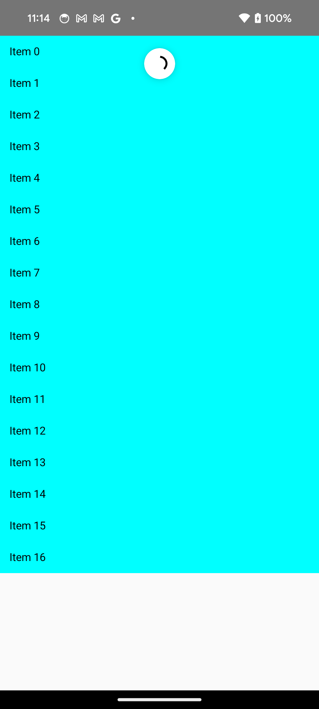

- [プルリフレッシュ](#プルリフレッシュ)
  - [使用する API](#使用する-api)
  - [サンプルコード](#サンプルコード)
  - [実行結果](#実行結果)


# プルリフレッシュ

## 使用する API

- `rememberPullRefreshState()`
  - プルした後に実行する処理を記述します。
  - プルした後に表示するインジケーターの表示/非表示状態をコントロールします。
- `Modifier.pullRefresh(pullRefreshState)`
  - この修飾子を指定したコンポーザブルをプルリフレッシュ可能にします。ただし、その前提として、プルイベントを受け取れる必要があります。
  - LazyColumn などは、プルイベントが最初から受け取れますが、 Box などは、デフォルトでは受け取れません。


## サンプルコード

```kotlin
@OptIn(ExperimentalMaterialApi::class)
@Composable
fun MyScreen() {

    val list = remember { mutableStateListOf("pull to refresh.") }
    // インジケーター表示/非表示の制御用
    var refreshing by remember { mutableStateOf(false) }
    val scope = rememberCoroutineScope()

    val pullRefreshState = rememberPullRefreshState(refreshing = refreshing,
        onRefresh = {
            // ネットワークからデータを取得してリストを更新
            Log.v("test", "start")
            refreshing = true
            scope.launch {
                val newList = fetch()
                list.clear()
                list.addAll(newList)
                Log.v("test", "end")
                refreshing = false
            }
        })

    Box(modifier = Modifier.fillMaxSize()) {
        LazyColumn(
            // pullRefresh() 修飾子は Box に付与してもプルできません。
            // LazyColumn などのプルイベントに対応しているコンポーザブルに付与する必要があります。
            modifier = Modifier.pullRefresh(pullRefreshState)
        ) {
            items(list) { item ->
                Text(
                    text = item,
                    modifier = Modifier
                        .fillMaxWidth()
                        .background(Color.Cyan)
                        .padding(12.dp)
                )
            }
        }

        // PullRefreshIndicatorはプル時にインジケーターを表示する
        PullRefreshIndicator(
            refreshing = refreshing,
            state = pullRefreshState,
            modifier = Modifier.align(Alignment.TopCenter)
        )
    }

}

private suspend fun fetch(): List<String> {

    // 疑似遅延
    delay(2000)

    val random = (1..20).random()
    val list = mutableListOf<String>()
    repeat(random) {
        list.add("Item $it")
    }
    return list
}
```


## 実行結果

次の画像は、指を引っ張っている最中の画面です。


次の画像は、指を離した後、ローディング中の画面です。



