- [コンポーザブルのプレビューで UI をプレビューする](#コンポーザブルのプレビューで-ui-をプレビューする)
  - [@Preview を定義する](#preview-を定義する)
    - [サイズ](#サイズ)
    - [ダイナミックカラーのプレビュー](#ダイナミックカラーのプレビュー)
    - [さまざまなデバイスで使用](#さまざまなデバイスで使用)
    - [言語 / 地域](#言語--地域)
    - [背景色の設定](#背景色の設定)
    - [システム UI](#システム-ui)
    - [UI モード](#ui-モード)
    - [LocalInspectionMode（プレビュー時のみ実行されるコードを書く）](#localinspectionmodeプレビュー時のみ実行されるコードを書く)
  - [@Preview を操作する](#preview-を操作する)
    - [インタラクティブ モード（プレビューを操作する）](#インタラクティブ-モードプレビューを操作する)
    - [プレビューからコードにジャンプする](#プレビューからコードにジャンプする)
    - [特定の @Preview のみをデバイスで直接実行する](#特定の-preview-のみをデバイスで直接実行する)
    - [@Preview を画像としてコピーする](#preview-を画像としてコピーする)
  - [同じ @Preview アノテーションの複数のプレビュー](#同じ-preview-アノテーションの複数のプレビュー)
    - [マルチプレビュー テンプレート](#マルチプレビュー-テンプレート)
    - [カスタム マルチプレビュー アノテーションを作成する](#カスタム-マルチプレビュー-アノテーションを作成する)
    - [たくさんのサンプルデータを使用してプレビューする](#たくさんのサンプルデータを使用してプレビューする)
  - [制限事項とベスト プラクティス](#制限事項とベスト-プラクティス)
    - [プレビューの制限事項](#プレビューの制限事項)
    - [プレビューと ViewModels](#プレビューと-viewmodels)
  - [アノテーション クラス @Preview](#アノテーション-クラス-preview)
  - [参考情報](#参考情報)


# コンポーザブルのプレビューで UI をプレビューする

コンポーザブルは関数によって定義され、@Composable アノテーションが付けられます。

```kotlin
@Composable
fun SimpleComposable() {
    Text("Hello World")
}
```

このコンポーザブルのプレビューを有効にするには、アノテーション付きの別のコンポーザブルを作成します。 @Composable と @Preview を使用します。この新しいアノテーション付きコンポーザブルには、 最初に作成したコンポーザブル SimpleComposable は次のとおりです。

```kotlin
@Preview
@Composable
fun SimpleComposablePreview() {
    SimpleComposable()
}
```

@Preview アノテーションは、これが Android Studio に このファイルのデザインビューにコンポーザブルを表示する必要があります。ライブ ストリームは コンポーザブルのプレビューも 更新されます

注: Android Wear ではプレビューに異なるアノテーションが使用されます。 （@WearPreviewDevices と @WearPreviewFontScales）詳細については [プレビューを使用して画面とフォントサイズの組み合わせをテストする](https://developer.android.com/training/wearables/compose/screen-size?hl=ja&_gl=1*6yt7gp*_up*MQ..*_ga*MjExMDE2NTk5NS4xNzI3MzM1MzI5*_ga_6HH9YJMN9M*MTcyNzQxNTU3Mi40LjAuMTcyNzQxNTU3Mi4wLjAuMTg3MDIxNjI5OA..#previews) をご覧ください。

コードに手動でパラメータを追加して、Android Studio の動作をカスタマイズできます。 @Preview をレンダリングする。@Preview アノテーションを同じ構成ファイルに追加することもできます。 複数回使用して、異なるプロパティを持つコンポーザブルをプレビューできます。

注: コンポーザブルのプレビューが複数あるものの、1 つのプレビューにフォーカスする場合 レンダリング リソースを節約するために、ギャラリー モードを使用することをおすすめします。グリッドモードまたはリストモードに切り替えることもできます。Google Chat では モードを切り替えるには、[Design] タブの上部にあるメニューを使用します。

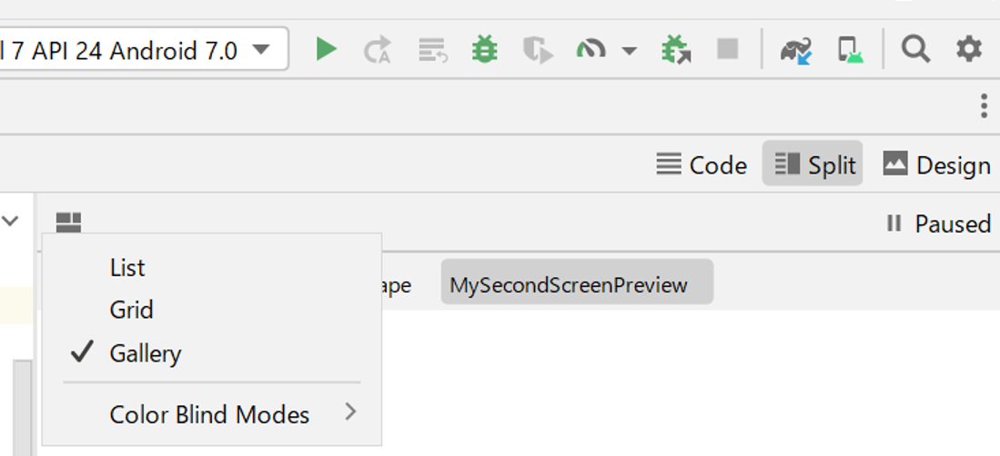

@Preview コンポーザブルを使用する主なメリットの 1 つは、Android Studio のエミュレータへの依存を回避できることです。エミュレータのメモリを大量に消費する起動を、最終的なルック アンド フィールの変更に充てることができます。また、@Preview では小さなコード変更を簡単に実行してテストできます。

@Preview アノテーションを最も効果的に活用するには、入力として受け取る状態と出力するイベントに基づいて画面を定義するようにしてください。


## @Preview を定義する

Android Studio には、コンポーザブル プレビューを拡張する機能がいくつかあります。コンテナのデザインを変更したり、プレビューを操作したり、エミュレータやデバイスに直接デプロイしたりできます。


### サイズ

デフォルトでは、@Preview の寸法はコンテンツをラップするために自動的に選択されます。寸法を手動で設定するには、heightDp および widthDp パラメータを追加します。これらの値はすでに dp として解釈されているため、.dp を追加する必要はありません。

```kotlin
@Preview(widthDp = 50, heightDp = 50)
@Composable
fun SquareComposablePreview() {
    Box(Modifier.background(Color.Yellow)) {
        Text("Hello World")
    }
}
```


### ダイナミックカラーのプレビュー

アプリで [動的な色](https://m3.material.io/styles/color/dynamic-color/overview) を有効にしている場合は、壁紙属性を使用して壁紙を切り替え、さまざまなユーザーが選択した壁紙に対して UI がどのように反応するかを確認します。 [Wallpaper](https://developer.android.com/reference/kotlin/androidx/compose/ui/tooling/preview/Wallpapers?_gl=1*1udmo7y*_up*MQ..*_ga*MTg0NTA4MTYzMy4xNzI3NDE4ODI1*_ga_6HH9YJMN9M*MTcyNzQxODgyNS4xLjAuMTcyNzQxODg0Mi4wLjAuMjA1MDkxMTQ3Mg..) クラスで提供されるさまざまな壁紙テーマから選択します。この機能には Compose 1.4.0 以降が必要です。

https://youtu.be/J9ibCP56-kg


### さまざまなデバイスで使用

Android Studio Flamingo では、プレビュー アノテーションの device パラメータを編集して、さまざまなデバイスのコンポーザブルの構成を定義できます。

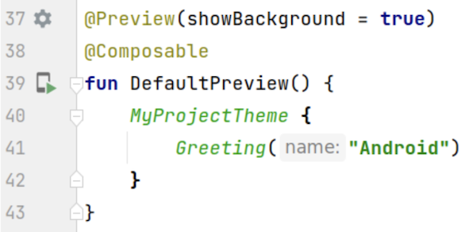

device パラメータに空の文字列 (@Preview(device = "")) がある場合、 Ctrl + Space を押すとオートコンプリートを呼び出すことができます。その後、各パラメータの値を設定できます。

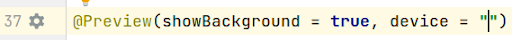

オートコンプリートでは、リストから任意のデバイス オプションを選択できます (例: @Preview(device = "id:pixel_4"))。または、spec:width=px,height=px,dpi=int… を選択してカスタム デバイスを入力し、各パラメーターの個別の値を設定することもできます。

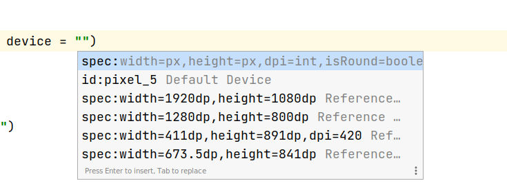

適用するには、Enter キーを押すか、Esc キーでキャンセルします。

無効な値を設定すると、宣言に赤い下線が引かれ、修正が利用できる場合があります (Alt + Enter (macOS の場合は ⌥ + ⏎) > Replace with ...)。検査では、入力内容に最も近い修正が提供されます。

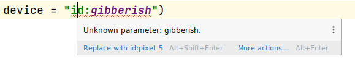


### 言語 / 地域

さまざまなユーザー ロケールをテストするには、 locale パラメータを追加します。

```kotlin
@Preview(locale = "fr-rFR")
@Composable
fun DifferentLocaleComposablePreview() {
    Text(text = stringResource(R.string.greeting))
}
```


### 背景色の設定

デフォルトでは、コンポーザブルは透明な背景で表示されます。背景を追加するには、showBackground および backgroundColor パラメータを追加します。backgroundColor は Color 値ではなく、ARGB Long であることに注意してください。

```kotlin
@Preview(showBackground = true, backgroundColor = 0xFF00FF00)
@Composable
fun WithGreenBackground() {
    Text("Hello World")
}
```


### システム UI

プレビュー内にステータス バーとアクション バーを表示する必要がある場合は、showSystemUi パラメータを追加します。

```kotlin
@Preview(showSystemUi = true)
@Composable
fun DecoratedComposablePreview() {
    Text("Hello World")
}
```

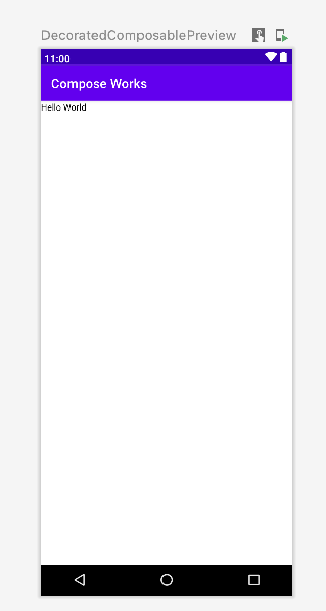


### UI モード

パラメータ uiMode は、 [Configuration.UI_*](https://developer.android.com/reference/android/content/res/Configuration?_gl=1*1jj8lvm*_up*MQ..*_ga*MTg0NTA4MTYzMy4xNzI3NDE4ODI1*_ga_6HH9YJMN9M*MTcyNzQxODgyNS4xLjAuMTcyNzQxODg0Mi4wLjAuMjA1MDkxMTQ3Mg..#UI_MODE_NIGHT_MASK) 定数のいずれかを取ることができ、それに応じてプレビューの動作を変更できます。たとえば、プレビューを夜間モードに設定して、テーマがどのように反応するかを確認できます。

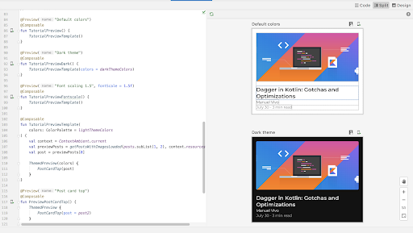


### LocalInspectionMode（プレビュー時のみ実行されるコードを書く）

[LocalInspectionMode](https://developer.android.com/reference/kotlin/androidx/compose/ui/platform/package-summary?_gl=1*2azyi9*_up*MQ..*_ga*MTg0NTA4MTYzMy4xNzI3NDE4ODI1*_ga_6HH9YJMN9M*MTcyNzQxODgyNS4xLjAuMTcyNzQxODg0Mi4wLjAuMjA1MDkxMTQ3Mg..#LocalInspectionMode()) CompositionLocal を参照すると、コンポーザブルがプレビューでレンダリングされているか、実際のデバイスでレンダリングされているかを確認できます。

```kotlin
@Composable
fun GreetingScreen(name: String) {
    if (LocalInspectionMode.current) {
        // プレビューに表示される内容
        Text("Hello preview user!")
    } else {
        // 実際のデバイスで表示される内容
        Text("Hello $name!")
    }
}
```

この情報を使用すると、プレビューをカスタマイズできます。たとえば、プレビュー ウィンドウに実際のデータを表示する代わりにプレースホルダー画像を表示できます。

この方法では、 [制限](#プレビューの制限事項) を回避することもできます。たとえば、ネットワーク リクエストを呼び出す代わりにサンプル データを表示します。


## @Preview を操作する

Android Studio には、定義したプレビューを操作できる機能が用意されています。この操作により、プレビューのランタイム動作を理解し、プレビューを使用して UI をより適切に操作できるようになります。


### インタラクティブ モード（プレビューを操作する）

インタラクティブ モードでは、スマートフォンやタブレットなど、プログラムを実行しているデバイスの場合と同様にプレビューを操作できます。インタラクティブ モードはサンドボックス環境で分離されており (つまり、他のプレビューから分離されています)、要素をクリックしてプレビューにユーザー入力を入力できます。

これは、コンポーザブルのさまざまな状態、ジェスチャー、さらにはアニメーションをテストする簡単な方法です。

以下のボタンでインタラクティブモードを開始します。

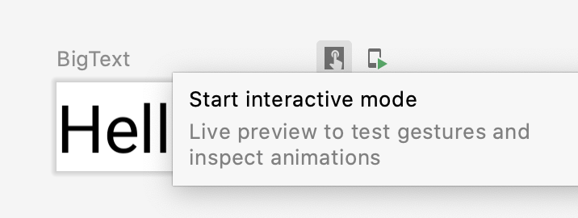

インタラクティブモードの使用感は以下のようになります。

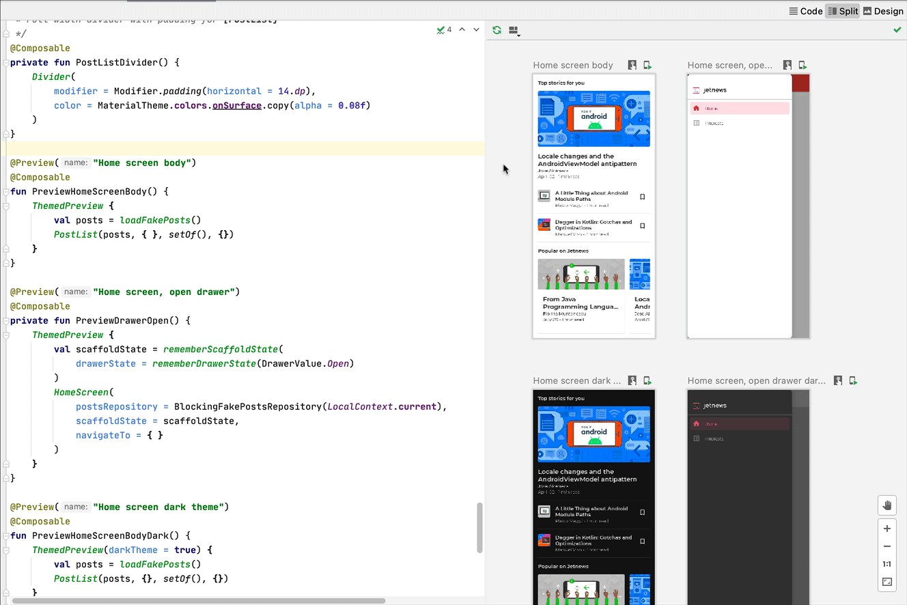


### プレビューからコードにジャンプする

プレビューにマウスを合わせると、そこに含まれるコンポーザブルのアウトラインが表示されます。コンポーザブルのアウトラインをクリックすると、エディター ビューがトリガーされ、その定義に移動します。

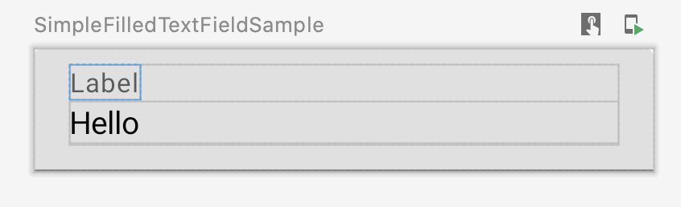


### 特定の @Preview のみをデバイスで直接実行する

特定の @Preview をエミュレータまたは物理デバイスで実行できます。プレビューは新しいアクティビティと同じプロジェクト アプリ内にデプロイされるため、同じコンテキストと権限を共有します。権限がすでに付与されている場合は、権限を要求する定型コードを記述する必要はありません。

注: @Preview アノテーションに適用された引数 (widthDp、locale など) は、実行およびデプロイされたプレビューには適用されません。

@Preview アノテーションの横またはプレビューの上部にある [プレビューの実行] アイコンをクリックすると、Android Studio によってその @Preview が接続されたデバイスまたはエミュレータにデプロイされます。

以下のアイコンをクリックすると、デバイス上でプレビューを実行できます。

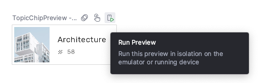

この機能の使用感は以下のようになります。


### @Preview を画像としてコピーする

レンダリングされたプレビューはすべて、右クリックすることで画像としてコピーできます。

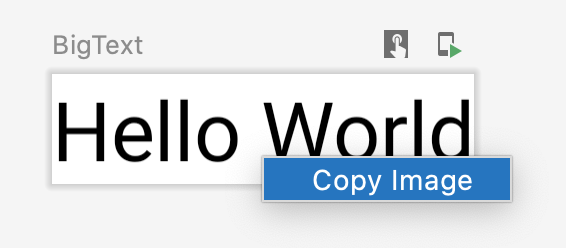


## 同じ @Preview アノテーションの複数のプレビュー

同じ @Preview コンポーザブルの複数のバージョンを、異なる仕様、またはコンポーザブルに渡される異なるパラメータで表示できます。こうすることで、他の方法で記述する必要のある定型コードを削減できます。


### マルチプレビュー テンプレート

androidx.compose.ui:ui-tooling-preview 1.6.0-alpha01+ では、マルチプレビュー API テンプレートが導入されました。

これは、 1 つのアノテーションで一般的な複数のシナリオのプレビューを生成してくれる機能です。例えば、 @PreviewScreenSizes アノテーションを付与するだけで、スマホの縦、スマホの横、タブレット、折畳スマホの展開した状態などを、プレビューしてくれます。

- @PreviewScreenSizes
- @PreviewFontScales
- @PreviewLightDark
- @PreviewDynamicColors

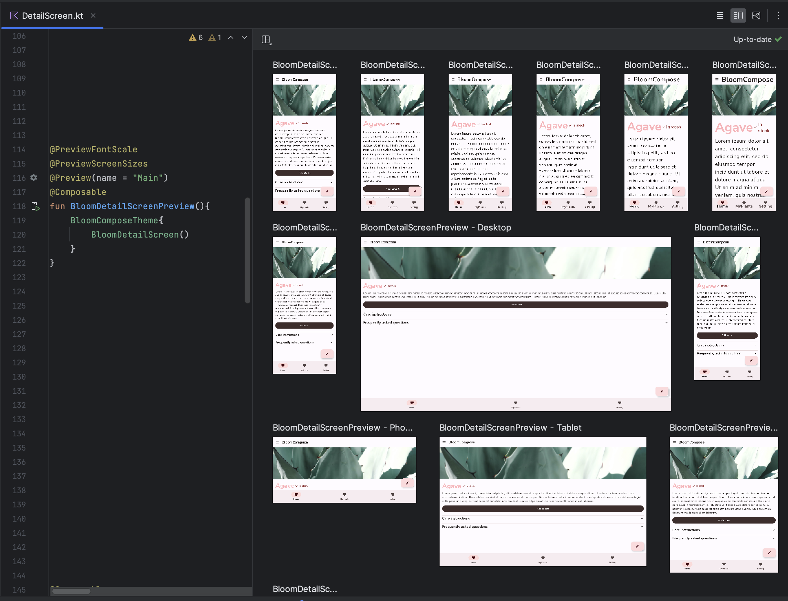


### カスタム マルチプレビュー アノテーションを作成する

マルチプレビュー機能を使用すると、異なる構成の複数の @Preview アノテーションを持つアノテーション クラスを定義できます。

このアノテーションをコンポーザブル関数に追加すると、さまざまなプレビューがすべて一度に自動的にレンダリングされます。

たとえば、このアノテーションを使用すると、コンポーザブルごとに定義を繰り返すことなく、複数のデバイス、フォント サイズ、テーマを同時にプレビューできます。

まず、独自のカスタム アノテーション クラスを作成します。

```kotlin
@Preview(
    name = "small font",
    group = "font scales",
    fontScale = 0.5f
)
@Preview(
    name = "large font",
    group = "font scales",
    fontScale = 1.5f
)
annotation class FontScalePreviews
```

通常の @Preview アノテーションの代わりに、自分で定義したカスタムアノテーションが使用できます。

```kotlin
@FontScalePreviews
@Composable
fun HelloWorldPreview() {
    Text("Hello World")
}
```

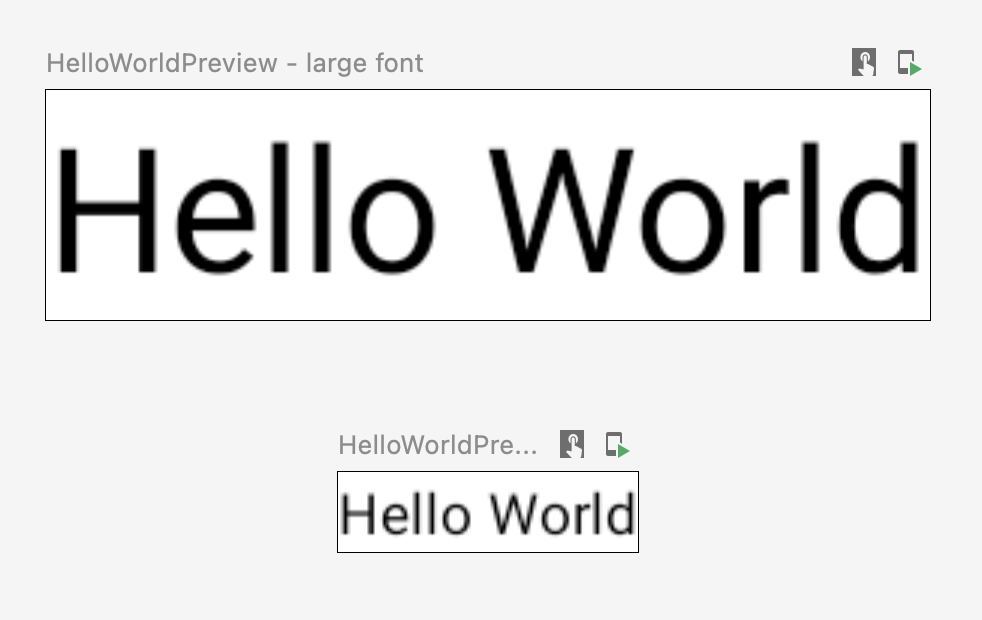

複数のマルチプレビューアノテーションと通常のプレビューアノテーションを組み合わせて、より完全なプレビュー セットを作成できます。

マルチプレビューアノテーションを組み合わせても、さまざまな組み合わせがすべて表示されるわけではありません。代わりに、各マルチプレビュー注釈は独立して動作し、独自のバリエーションのみをレンダリングします。

```kotlin
@Preview(
    name = "Spanish",
    group = "locale",
    locale = "es"
)
@FontScalePreviews
annotation class CombinedPreviews

@CombinedPreviews
@Composable
fun HelloWorldPreview2() {
    MaterialTheme { Surface { Text(stringResource(R.string.hello_world)) } }
}
```

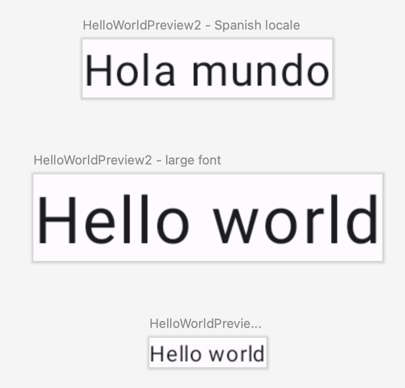

マルチプレビュー (および通常のプレビュー) の組み合わせにより、大規模プロジェクトの多くのプロパティをより包括的にテストできます。


### たくさんのサンプルデータを使用してプレビューする

多くの場合、大規模なデータセットをコンポーザブル プレビューに渡す必要が生じます。これを行うには、 [@PreviewParameter](https://developer.android.com/reference/kotlin/androidx/compose/ui/tooling/preview/PreviewParameter?_gl=1*1nb7qhg*_up*MQ..*_ga*MTg0NTA4MTYzMy4xNzI3NDE4ODI1*_ga_6HH9YJMN9M*MTcyNzQxODgyNS4xLjAuMTcyNzQxODg0Mi4wLjAuMjA1MDkxMTQ3Mg..) アノテーションを使用してパラメータを追加し、サンプル データをコンポーザブル プレビュー関数に渡すだけです。

```kotlin
@Preview
@Composable
fun UserProfilePreview(
    // サンプルデータは、 UserPreviewParameterProvider で定義します。
    @PreviewParameter(UserPreviewParameterProvider::class) user: User
) {
    UserProfile(user)
}
```

サンプル データを提供するには、 PreviewParameterProvider を実装し、サンプル データをシーケンスとして返すクラスを作成します。

```kotlin
class UserPreviewParameterProvider : PreviewParameterProvider<User> {
    override val values = sequenceOf(
        User("Elise"),
        User("Frank"),
        User("Julia")
    )
}
```

これにより、シーケンス内のデータ要素ごとに 1 つのプレビューがレンダリングされます。

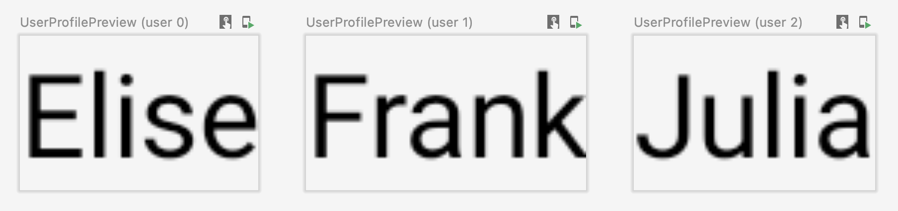

複数のプレビューに同じプロバイダー クラスを使用できます。必要に応じて、limit パラメータを設定してプレビューの数を制限します。

```kotlin
@Preview
@Composable
fun UserProfilePreview2(
    @PreviewParameter(UserPreviewParameterProvider::class, limit = 2) user: User
) {
    UserProfile(user)
}
```

ちなみに、サンプルデータが一つだけで良い場合は、以下のようにパラメータのデフォルト値に直接設定するなどしても OK です。

```kotlin
@Preview
@Composable
fun AuthorScreenPreview(
    name: String = sampleAuthor.name,
) {
    AuthorColumn(name = name)
}
```


## 制限事項とベスト プラクティス

Android Studio は、プレビュー コードをプレビュー領域で直接実行します。Android フレームワークの移植された部分である Layoutlib を活用するため、エミュレータや物理デバイスを実行する必要はありません。Layoutlib は、Android デバイスの外部で実行するように設計された Android フレームワークのカスタム バージョンです。このライブラリの目的は、デバイスでのレンダリングに非常に近いレイアウトのプレビューを Android Studio で提供することです。


### プレビューの制限事項

Android Studio 内でプレビューがレンダリングされる方法により、プレビューは軽量で、レンダリングに Android フレームワーク全体を必要としません。ただし、これには次の制限があります。

- ネットワーク アクセス不可
- ファイル アクセス不可
- 一部のコンテキスト API が完全に使用できない場合があります


### プレビューと ViewModels

コンポーザブル内で ViewModel を使用する場合、プレビューには制限があります。

プレビュー システムでは、リポジトリ、ユース ケース、マネージャーなど、ViewModel に渡されるすべてのパラメータを構築することはできません。

また、ViewModel が依存性注入 (Hilt など) に参加している場合、プレビュー システムは依存性グラフ全体を構築して ViewModel を構築できません。

ViewModel を使用してコンポーザブルをプレビューしようとすると、Android Studio は特定のコンポーザブルをレンダリングするときにエラーを表示します。

ViewModel のインスタンス化に失敗した場合は、次のエラーが表示されます。

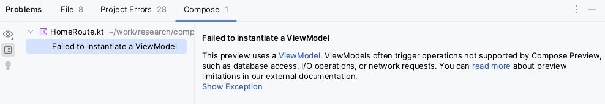

**警告: ViewModel インスタンスを他のコンポーザブル関数に渡さないでください。これを行うと、コンポーザブルが ViewModel 型と結合され、再利用性が低下し、テストが困難になり、プレビューできなくなります。**

ViewModel を使用するコンポーザブルをプレビューする場合は、コンポーザブルの引数として渡された ViewModel のパラメータを使用して別のコンポーザブルを作成する必要があります。この方法では、ViewModel を使用するコンポーザブルをプレビューする必要がありません。

```kotlin
@Composable
fun AuthorColumn(viewModel: AuthorViewModel = viewModel()) {
    AuthorColumn(
        name = viewModel.authorName,
        // ViewModelはネットワークリクエストを送信し、 posts を状態として利用可能にする
        posts = viewModel.posts
    )
}

@Preview
@Composable
fun AuthorScreenPreview(
    // ViewModel を構築する必要なく、サンプルデータをプレビューに使用できます。
    name: String = sampleAuthor.name,
    posts: List<Post> = samplePosts[sampleAuthor]
) {
    AuthorColumn(...) {
        name = NameLabel(name),
        posts = PostsList(posts)
    }
}
```


## アノテーション クラス @Preview

プレビューをカスタマイズするときに調整できるパラメータの完全なリストについては、Android Studio で @Preview アノテーションをいつでも Ctrl キーまたは ⌘ キーを押しながらクリックして表示できます。

```kotlin
annotation class Preview(
    val name: String = "",
    val group: String = "",
    @IntRange(from = 1) val apiLevel: Int = -1,
    val widthDp: Int = -1,
    val heightDp: Int = -1,
    val locale: String = "",
    @FloatRange(from = 0.01) val fontScale: Float = 1f,
    val showSystemUi: Boolean = false,
    val showBackground: Boolean = false,
    val backgroundColor: Long = 0,
    @UiMode val uiMode: Int = 0,
    @Device val device: String = Devices.DEFAULT,
    @Wallpaper val wallpaper: Int = Wallpapers.NONE,
)
```


## 参考情報

Android Studio が @Preview の使いやすさをどのように促進しているか、またツールに関するヒントをもっと知りたい場合は、ブログ [Compose Tooling](https://medium.com/androiddevelopers/compose-tooling-42621bd8719b) をご覧ください。


