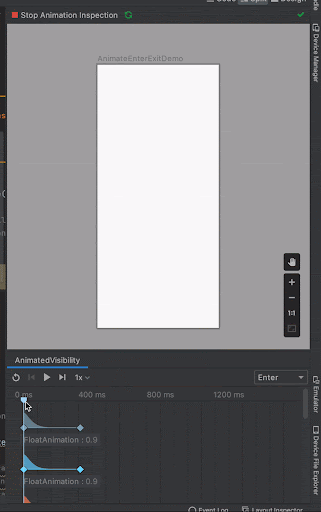
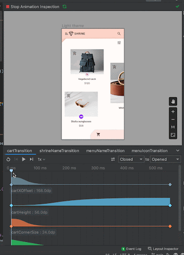
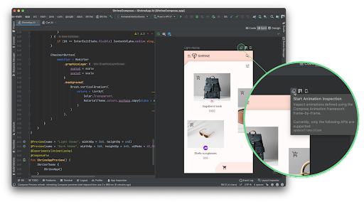
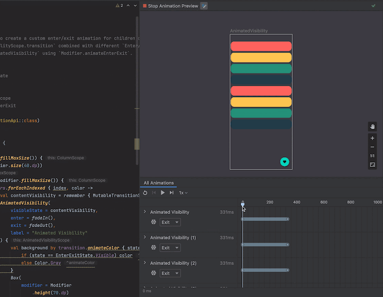
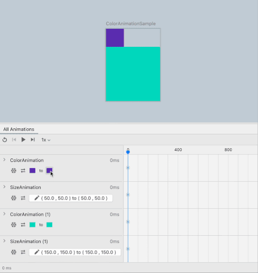

- [アニメーションのプレビュー](#アニメーションのプレビュー)

# アニメーションのプレビュー

Android Studio では、アニメーション プレビューからアニメーションを検査できます。アニメーションがコンポーザブル プレビューで記述されている場合は、特定の時間における各アニメーション値の正確な値を検査したり、アニメーションを一時停止、ループ、早送り、またはスローダウンしたりして、アニメーションの遷移全体にわたってデバッグすることができます。

アニメーション プレビューを使用してアニメーション カーブをグラフで視覚化することもできます。これは、アニメーション値が適切に振り付けられていることを確認するのに役立ちます。

アニメーション プレビューでは、検査可能なアニメーションが自動的に検出され、アニメーション プレビューの開始アイコン (円が三つ重なったアイコン) で示されます。

複数のアニメーションがある場合は、アニメーション プレビューを使用して、一度にすべてのアニメーションを検査して調整できます。特定のアニメーションをフリーズすることもできます。

ピッカーを使用して非列挙型またはブール型の状態を設定し、正確な入力を使用して Compose アニメーションをデバッグします。サポートされているすべての Compose Animation API で、再生、一時停止、スクラブ、速度制御、調整を行うことができます。

Animation Preview は現在、次の API をサポートしています。

- [updateTransition](https://developer.android.com/reference/kotlin/androidx/compose/animation/core/package-summary?_gl=1*n9njcu*_up*MQ..*_ga*MTk5MTYxMTA4Ni4xNzI3NDI1ODc0*_ga_6HH9YJMN9M*MTcyNzQyNTg3My4xLjAuMTcyNzQyNTg3My4wLjAuMTA1MTY5Njg3NA..#updateTransition(kotlin.Any,kotlin.String))

- [AnimatedVisibility](https://developer.android.com/reference/kotlin/androidx/compose/animation/package-summary?_gl=1*4nrr3z*_up*MQ..*_ga*MTk5MTYxMTA4Ni4xNzI3NDI1ODc0*_ga_6HH9YJMN9M*MTcyNzQyNTg3My4xLjAuMTcyNzQyNTg3My4wLjAuMTA1MTY5Njg3NA..#AnimatedVisibility(androidx.compose.animation.core.MutableTransitionState,androidx.compose.ui.Modifier,androidx.compose.animation.EnterTransition,androidx.compose.animation.ExitTransition,kotlin.String,kotlin.Function1))

- [animate*AsState](https://developer.android.com/develop/ui/compose/animation?_gl=1*4nrr3z*_up*MQ..*_ga*MTk5MTYxMTA4Ni4xNzI3NDI1ODc0*_ga_6HH9YJMN9M*MTcyNzQyNTg3My4xLjAuMTcyNzQyNTg3My4wLjAuMTA1MTY5Njg3NA..#animate-as-state)

- [CrossFade](https://developer.android.com/develop/ui/compose/animation?_gl=1*4nrr3z*_up*MQ..*_ga*MTk5MTYxMTA4Ni4xNzI3NDI1ODc0*_ga_6HH9YJMN9M*MTcyNzQyNTg3My4xLjAuMTcyNzQyNTg3My4wLjAuMTA1MTY5Njg3NA..#crossfade)

- [rememberInfiniteTransition](https://developer.android.com/develop/ui/compose/animation?_gl=1*4nrr3z*_up*MQ..*_ga*MTk5MTYxMTA4Ni4xNzI3NDI1ODc0*_ga_6HH9YJMN9M*MTcyNzQyNTg3My4xLjAuMTcyNzQyNTg3My4wLjAuMTA1MTY5Njg3NA..#rememberinfinitetransition)

- [AnimatedContent](https://developer.android.com/develop/ui/compose/animation?_gl=1*4nrr3z*_up*MQ..*_ga*MTk5MTYxMTA4Ni4xNzI3NDI1ODc0*_ga_6HH9YJMN9M*MTcyNzQyNTg3My4xLjAuMTcyNzQyNTg3My4wLjAuMTA1MTY5Njg3NA..#animatedcontent)

最新の機能にアクセスするには、Android Studio Koala Feature Drop および compose.animation 1.7.0 以降で Animation Preview を使用してください。
