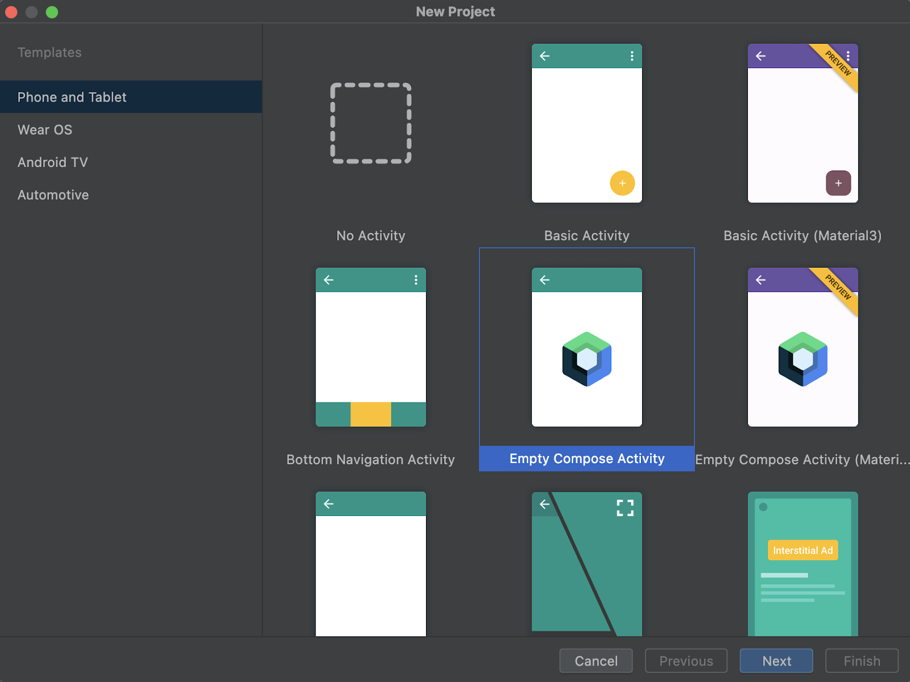
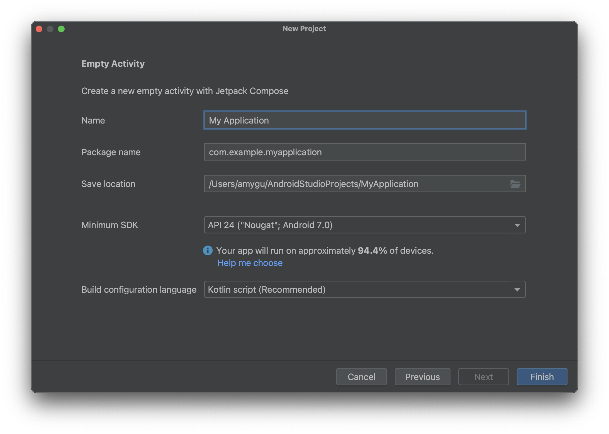
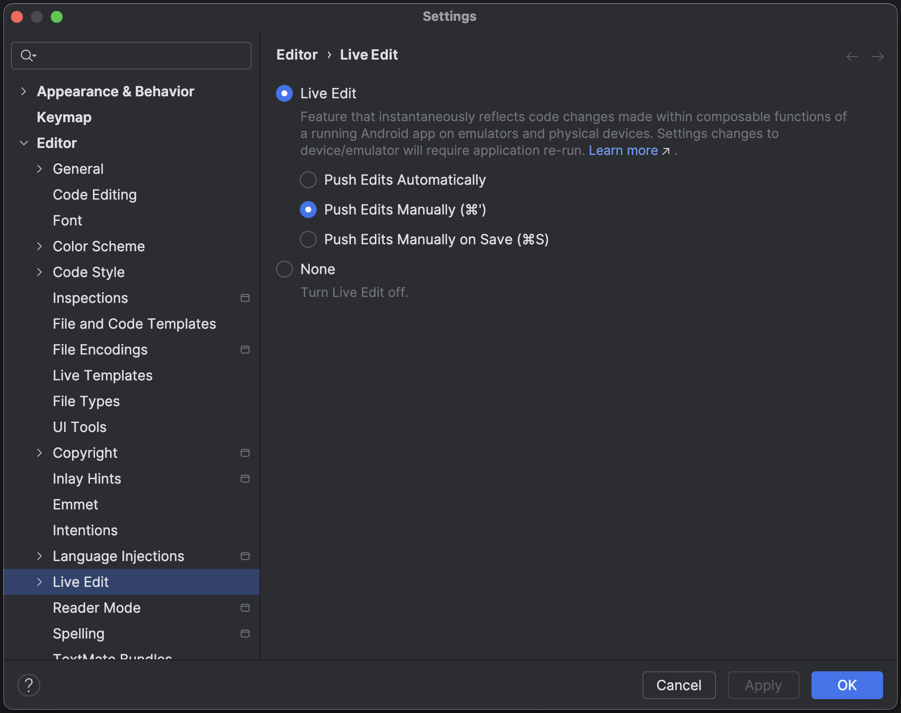
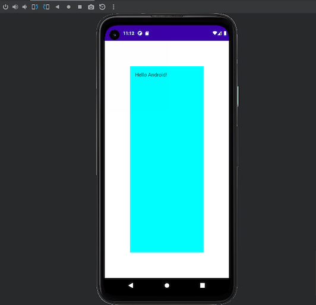
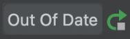
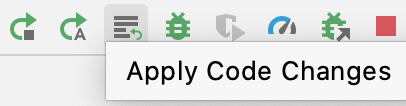

- [1.持続的な開発](#1持続的な開発)


# 反復型コード開発

モバイル デベロッパーは、すべてを一度に開発するのではなく、アプリの UI を段階的に開発することがよくあります。Android Studio は Jetpack Compose でこのアプローチを採用し、フルビルドを必要とせずに検査、値の変更、最終結果の検証を行えるツールを提供しています。


## ライブ編集

重要: この機能は開発中であるため、動作が不安定になる可能性があります。Android Studio Giraffe 以降では、Jetpack Compose Runtime 1.3.0 以降と AGP 8.1.0-alpha05 以降が必要です。Google はこの機能の改善に継続的に取り組んでおり、フィードバックをお待ちしています。問題が見つかった場合は、報告してください。Logcat の情報と、行ったコード変更の説明を含めてください。未解決の問題のリストを確認することもできます。

ライブ編集は、エミュレーターと物理デバイスでコンポーザブルをリアルタイムで更新できる機能です。この機能により、アプリの作成とビルドの間のコンテキスト切り替えが最小限に抑えられ、中断することなくコードの記述に長時間集中できます。

重要: 手動モードのショートカットは、Koala Feature Drop で Control+' ( macOS では Command+' ) に更新されました。以前のバージョンの Android Studio では、手動モードのショートカットとして Control+\ ( macOS では Command+\ ) を使用していました。

ライブ編集には 3 つのモードがあります:

- 手動: コードの変更は、Control+' (macOS では Command+') を使用して手動でプッシュされたときに適用されます

- 保存時に手動: コードの変更は、Control+S (macOS では Command+S) を使用して手動で保存されたときに適用されます

- 自動: コンポーズ可能な関数を更新すると、デバイスまたはエミュレータに変更が適用されます

ライブ編集は、UI および UX 関連のコード変更に重点を置いています。ライブ編集では、メソッド シグネチャの更新、新しいメソッドの追加、クラス階層の変更などの変更はサポートされていません。詳細については、 [ライブ編集の制限事項のリスト](#ライブ編集の制限事項) をご覧ください。

この機能は、アプリのビルドと実行、または変更の適用に代わるものではありません。ビルド、デプロイ、反復処理を行って Compose UI を開発する際のワークフローを最適化するように設計されています。

ベスト プラクティスのワークフローは次のとおりです。

1. アプリケーションを実行できるように設定します。

2. ライブ編集でサポートされていない変更 (アプリの実行中に新しいメソッドを追加するなど) が必要になるまで、できるだけライブ編集を行います。

3. サポートされていない変更を行ったら、実行アイコンをクリックしてアプリを再起動し、ライブ編集を再開します。


### ライブ編集を使ってみる

開始するには、次の手順に従って空の Compose Activity を作成し、プロジェクトの Live Edit を有効にして、Live Edit で変更を加えます。


#### 新しいプロジェクトをセットアップする

1. 開始する前に、Android Studio Giraffe 以降がインストールされており、物理デバイスまたはエミュレータの API レベルが 30 以上であることを確認してください。

2. Android Studio を開き、[Welcome to Android Studio] ダイアログで [New Project] を選択します。既にプロジェクトを開いている場合は、[File] > [New] > [New Project] に移動して新しいプロジェクトを作成できます。

3. 電話とタブレットの [Empty Compose Activity] テンプレートを選択し、[Next] をクリックします。



4. 名前、パッケージ名、保存場所、最小 SDK、ビルド構成言語などの必要な情報を入力して、[新しいプロジェクト] ダイアログを完了します。



5. Finish をクリックします。


#### ライブ編集を有効にする

1. ライブ編集を有効にするには、設定に移動します。

   - Windows または Linux では、[ファイル] > [設定] > [エディタ] > [ライブ編集] に移動します。

   - macOS では、[Android Studio] > [設定] > [エディタ] > [ライブ編集] に移動します。

2. 設定からライブ編集オプションと実行するモードを選択します。

   - 手動モードでは、Control+' (macOS では Command+') を押すたびにコードの変更がプッシュされます。
   - 保存時の手動モードでは、Control+S (macOS では Command+S) を使用して手動で保存するたびにコードの変更が適用されます。
   - 自動モードでは、変更を加えると、デバイスまたはエミュレータにコードの変更が適用されます。



3. エディターで、アプリのエントリ ポイントである MainActivity ファイルを開きます。

4. [実行] ボタンをクリックしてアプリをデプロイします。

5. ライブ編集をオンにすると、[実行中のデバイス] ツール ウィンドウの右上に [最新の状態] の緑色のチェックマークが表示されます。


#### 変更を加えて確認する

エディターでサポートされている変更を行うと、仮想または物理テスト デバイスが自動的に更新されます。

たとえば、MainActivity の既存の Greeting メソッドを次のように編集します。

```kotlin
@Composable
fun Greeting(name: String) {
    Text(
        text = "Hello $name!",
        Modifier
            .padding(80.dp) // Outer padding; outside background
            .background(color = Color.Cyan) // Solid element background color
            .padding(16.dp) // Inner padding; inside background, around text)
    )
}
```

次の図に示すように、変更内容はテスト デバイスに即座に表示されます。




### ライブ編集のトラブルシューティング

テスト デバイスに編集内容が表示されない場合は、Android Studio が編集内容の更新に失敗した可能性があります。次の図に示すように、ライブ編集インジケーターに「Out Of Date」と表示されていないか確認してください。これはコンパイル エラーを示しています。エラーの詳細と解決方法の提案については、インジケーターをクリックしてください。




### ライブ編集の制限事項

現在の制限事項の一覧を以下に示します。

- [Android Studio Giraffe 以降にのみ適用] ライブ編集には Compose Runtime 1.3.0 以上が必要です。プロジェクトでそれより低いバージョンの Compose を使用している場合、ライブ編集は無効になります。

- [Android Studio Giraffe 以降にのみ適用] ライブ編集には AGP 8.1.0-alpha05 以上が必要です。プロジェクトでそれより低いバージョンの AGP を使用している場合、ライブ編集は無効になります。

- ライブ編集には、API レベル 30 以上を実行している物理デバイスまたはエミュレータが必要です。

- ライブ編集では関数本体の編集のみがサポートされています。つまり、関数名やシグネチャを変更したり、関数を追加または削除したり、関数以外のフィールドを変更したりすることはできません。

- ライブ編集では、ファイル内の Compose 関数を初めて変更したときにアプリの状態がリセットされます。これは、最初のコード変更後にのみ行われます。そのファイル内の Compose 関数に対してその後コード変更を行っても、アプリの状態はリセットされません。

- ライブ編集で変更されたクラスでは、パフォーマンスが低下する可能性があります。アプリを実行し、パフォーマンスを評価する場合は、クリーン リリース ビルドを使用します。

- ライブ編集で変更したクラスをデバッガーで操作するには、完全な実行を実行する必要があります。

- ライブ編集で編集すると、実行中のアプリがクラッシュする場合があります。その場合は、[実行] ボタンを使用してアプリを再デプロイできます。

- ライブ編集では、プロジェクトのビルド ファイルで定義されているバイトコード操作は実行されません。たとえば、[ビルド] メニューのオプションを使用するか、[ビルド] ボタンまたは [実行] ボタンをクリックしてプロジェクトをビルドするときに適用されるバイトコード操作は実行されません。

- 非コンポーザブル関数はデバイスまたはエミュレーター上でライブで更新され、完全な再コンポジションがトリガーされます。完全な再コンポジションでは、更新された関数が呼び出されない場合があります。非コンポーザブル関数の場合は、新しく更新された関数をトリガーするか、アプリを再度実行する必要があります。

- ライブ編集は、アプリの再起動時に再開されません。アプリを再度実行する必要があります。

- ライブ編集は、デバッグ可能なプロセスのみをサポートします。

- ライブ編集は、ビルド構成の kotlinOptions の moduleName にカスタム値を使用するプロジェクトをサポートしていません。

- ライブ編集は、マルチデプロイのデプロイメントでは機能しません。つまり、1 つのデバイスにデプロイしてから別のデバイスにデプロイすることはできません。ライブ編集は、アプリがデプロイされた最後のデバイス セットでのみアクティブになります。

- ライブ編集は、マルチデバイス デプロイメント (ターゲット デバイスのドロップダウンで複数のデバイスを選択して作成された複数のデバイスへのデプロイメント) で機能します。ただし、正式にはサポートされておらず、問題が発生する可能性があります。問題が発生した場合は、報告してください。

- 変更の適用/コード変更の適用はライブ編集と互換性がなく、実行中のアプリを再起動する必要があります。

- ライブ編集は現在、Android Automotive プロジェクトをサポートしていません。


### ライブ編集に関するよくある質問

- ライブ編集の現在のステータスはどうなっていますか?

ライブ編集は Android Studio Giraffe で利用できます。オンにするには、[ファイル] > [設定] > [エディタ] > [ライブ編集] (macOS では [Android Studio] > [設定] > [エディタ] > [ライブ編集]) に移動します。

- ライブ編集はいつ使用すればよいですか?

ライブ編集は、UX 要素の更新 (修飾子の更新やアニメーションなど) がアプリ全体のエクスペリエンスに及ぼす影響をすばやく確認したい場合に使用します。

- ライブ編集の使用を避けるべきなのはいつですか?

ライブ編集は、UI および UX 関連のコード変更に重点を置いています。メソッド シグネチャの更新、新しいメソッドの追加、クラス階層の変更などの変更はサポートしていません。詳細については、ライブ編集の制限事項をご覧ください。

- Compose プレビューはいつ使用すればよいですか?

個々のコンポーザブルを開発している場合は、Compose プレビューを使用します。プレビューは Compose 要素を視覚化し、コード変更の影響を表示するために自動的に更新します。プレビューでは、ダーク テーマ、ロケール、フォント スケールなど、さまざまな構成や状態での UI 要素の表示もサポートされています。


## リテラルのライブ編集（非推奨）

非推奨: 「リテラルのライブ編集」 ( 「ライブ編集」 の以前のバージョン) は非推奨です。リテラルのライブ編集は、サポートされるタイプが少数に限られていました。代わりに、新しい 「ライブ編集」 を使用することをお勧めします。

Android Studio は、プレビュー、エミュレータ、物理デバイス内のコンポーザブルで使用される定数リテラルの一部をリアルタイムで更新できます。サポートされているタイプは次のとおりです:

- Int
- String
- Color
- Dp
- Boolean

リテラルのライブ編集 UI インジケーターを使用してリテラルの装飾を有効にすることで、コンパイル手順なしでリアルタイム更新をトリガーする定数リテラルを表示できます。


注: エミュレーターまたは物理デバイス上で実行中のアプリへのアクティブな接続がある限り、リテラルのライブ編集 UI インジケーターは、コード/分割/デザインの横に表示されます。


## 変更を適用する

[Apply Changes](https://developer.android.com/studio/run?_gl=1*jvvmvs*_up*MQ..*_ga*MTk5MTYxMTA4Ni4xNzI3NDI1ODc0*_ga_6HH9YJMN9M*MTcyNzQyNTg3My4xLjAuMTcyNzQyNTg3My4wLjAuMTA1MTY5Njg3NA..#use-apply-changes) を使用すると、アプリをエミュレーターや物理デバイスに再デプロイせずにコードとリソースを更新できます ( [一部制限](https://developer.android.com/studio/run?_gl=1*nsg07y*_up*MQ..*_ga*MTk5MTYxMTA4Ni4xNzI3NDI1ODc0*_ga_6HH9YJMN9M*MTcyNzQyNTg3My4xLjAuMTcyNzQyNTg3My4wLjAuMTA1MTY5Njg3NA..#apply-changes-limitations) あり)。

コンポーザブルを追加、変更、または削除するときはいつでも、[Apply Code Changes] ボタンをクリックすることで、再デプロイせずにアプリを更新できます。




