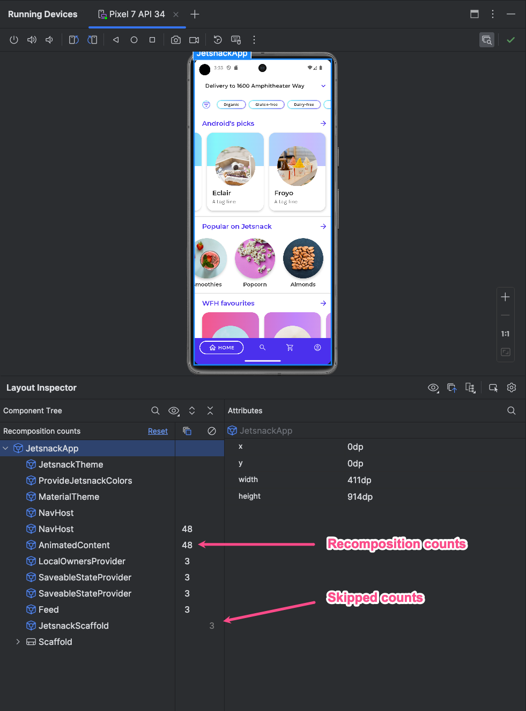
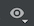
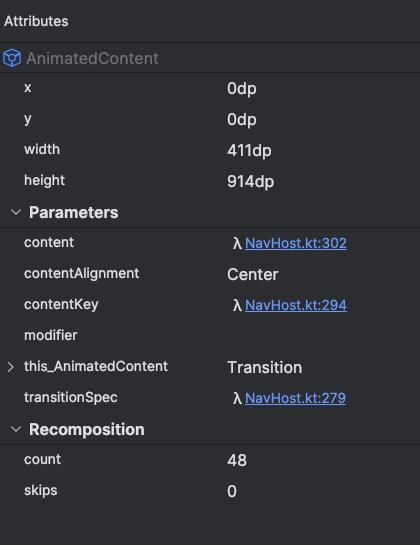

- [Layout Inspector](#layout-inspector)
  - [再コンポーズ数を取得する](#再コンポーズ数を取得する)
  - [Compose のセマンティクス](#compose-のセマンティクス)

# Layout Inspector

Layout Inspector を使用すると、エミュレータまたは実機で実行中のアプリ内の Compose レイアウトを検査できます。

Layout Inspector では、コンポーザブルが再コンポーズまたはスキップされる頻度を確認できるため、アプリに関する問題の特定に役立ちます。

たとえば、コーディング エラーによって UI が過度に再コンポーズされ、結果としてパフォーマンスの低下につながる場合があります。また、コーディング エラーによって UI が再コンポーズできなくなり、UI の変更が画面に表示されないことがあります。

Layout Inspector を初めて使用する場合は、 [操作方法を説明したガイダンス](../../../../../../Android%20Studio%20エディタ/5.アプリを実行してデバッグする/5.コードをデバッグする/5.レイアウトをデバッグする.md) をご覧ください。

https://youtu.be/M3fKe1IK5LE

注: Layout Inspector に Compose コンポーネントが表示されない場合は、APK から META-INF/androidx.compose.*.version ファイルを削除していないかご確認ください。このファイルは Layout Inspector が動作するうえで必要です。

## 再コンポーズ数を取得する

Compose レイアウトをデバッグするときは、UI が適切に実装されているかどうかを確認するため、コンポーザブルの再コンポーズのタイミングを把握することが重要です。たとえば、再コンポーズ回数が多すぎる場合は、アプリが必要以上の処理を行っている可能性があります。一方、コンポーネントが想定どおりに再コンポーズしていないと、予期しない動作が発生する可能性があります。

Layout Inspector では、アプリを操作したときに、レイアウト階層内の個別のコンポーザブルが再コンポーズまたはスキップされたタイミングが表示されます。Android Studio では、再コンポーズがハイライト表示されるので、UI 内のどこでコンポーザブルが再コンポーズするかを判断しやすくなります。

https://youtu.be/8VogFiBCGR8

ハイライト表示された部分では、Layout Inspector の画像セクションにコンポーザブルのグラデーション オーバーレイが表示されて徐々に消えます。これにより、再コンポーズ回数が最も多いコンポーザブルが UI 内のどこで見つかるかを把握できます。あるコンポーザブルの再コンポーズ回数が別のコンポーザブルより多い場合、そのコンポーザブルのグラデーション オーバーレイはより濃い色になります。Layout Inspector でコンポーザブルをダブルクリックすると、対応するコードに移動して分析できます。

注: 再コンポーズ回数を表示するには、アプリが API レベル 29 以上および Compose 1.2.0 以降を使用していることを確認します。確認できたら、通常どおりにアプリをデプロイします。

[Layout Inspector] ウィンドウを開き、アプリプロセスに接続します。[Component Tree] には、レイアウト階層の横に 2 つの列が表示されます。最初の列には各ノードのコンポーズ回数が表示され、2 番目の列には各ノードのスキップ回数が表示されます。

コンポーザブル ノードを選択すると、コンポーザブルのディメンションとパラメータが表示されます。ただし、インライン関数の場合、パラメータは表示されません。[Component Tree] または [Layout Display] からコンポーザブルを選択すると、[Attributes] ペインにも同様の情報が表示されます。

回数をリセットすると、アプリで特定の操作を行っているときの再コンポーズまたはスキップを把握しやすくなります。回数をリセットするには、[Component Tree] ペインの上部にある [Reset] をクリックします。

注: [Component Tree] ペインに新しい列が表示されない場合は、以下の画像のとおり、[Component Tree] ペインの上部にある [View Options] メニュー (※ 1 ) から [Show Recomposition Counts] を選択すると表示されます。

(※ 1 )  

## Compose のセマンティクス

Compose では、セマンティクスによって、ユーザー補助サービスとテスト フレームワークが認識しやすい別の方法で UI が記述されます。Layout Inspector を使用すると、Compose レイアウト内のセマンティック情報を検査できます。

以下に Layout Inspector を使用して表示したセマンティック情報の例を示します。

Compose ノードを選択するときに、[Attributes] ペインを使用して、ノードがセマンティック情報を直接宣言しているか、子のセマンティクスを結合しているか、その両方かを確認します。宣言しているか結合しているかにかかわらず、セマンティクスを含むノードをすばやく調べるには、[Component Tree] ペインで [View options] プルダウンを選択し、[Highlight Semantics Layers] を選択します。これにより、ツリー内のセマンティクスを含むノードのみがハイライト表示され、キーボードを使用してそれらのノード間をすばやく移動できるようになります。

