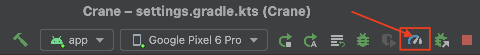
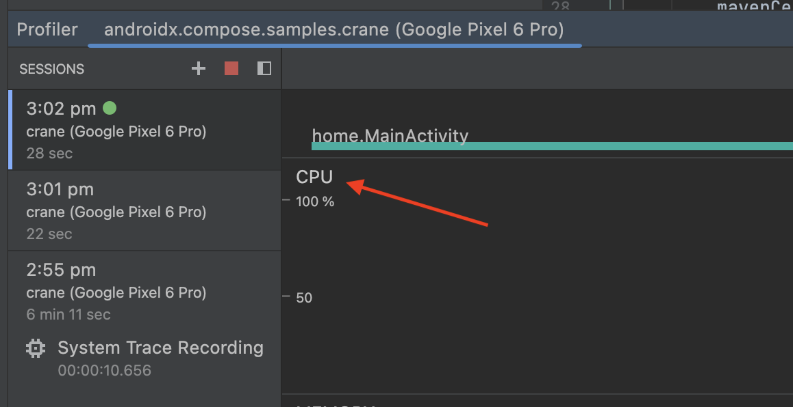
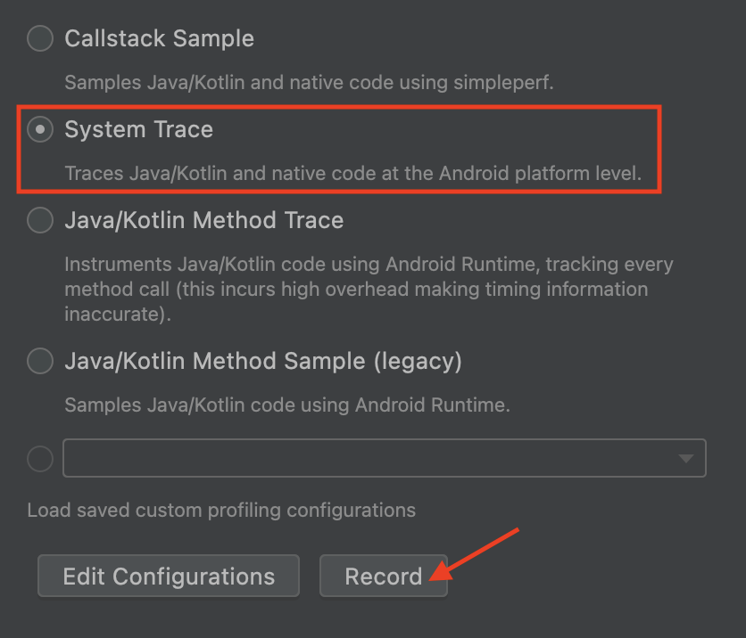
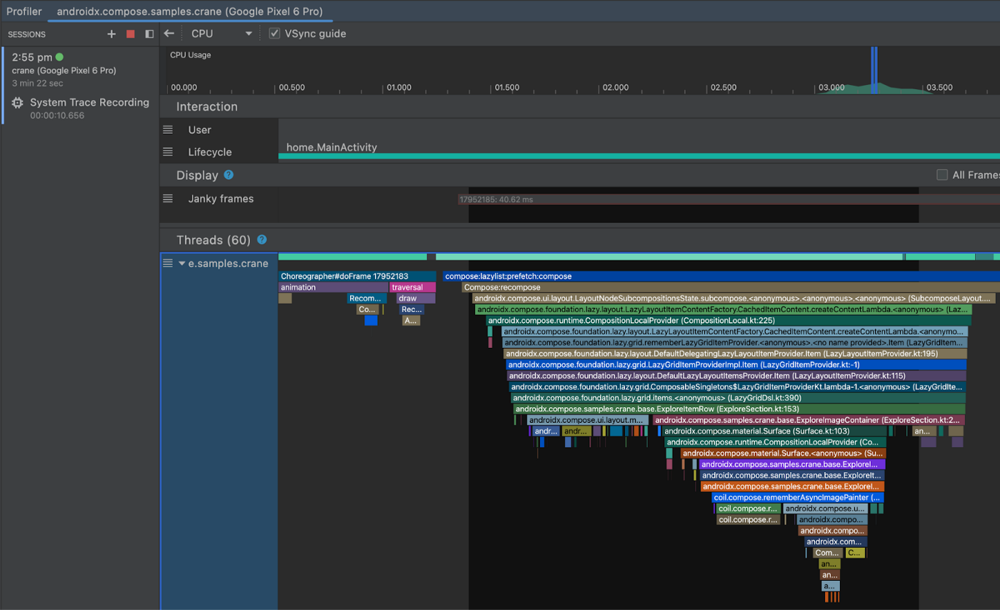
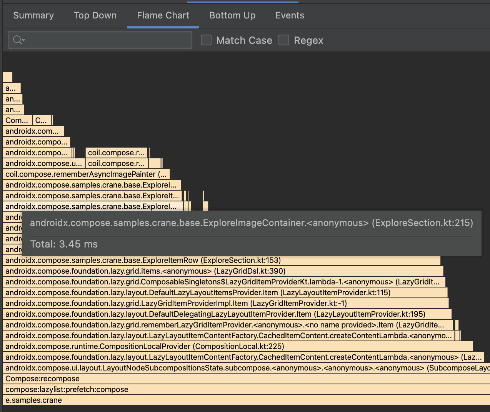

- [コンポジションのトレース](#コンポジションのトレース)
  - [コンポジションのトレースをセットアップする](#コンポジションのトレースをセットアップする)
  - [システム トレースを行う](#システム-トレースを行う)
  - [注意点](#注意点)
    - [APK サイズのオーバーヘッド](#apk-サイズのオーバーヘッド)
    - [正確なタイミング](#正確なタイミング)
  - [ターミナルからトレースをキャプチャする](#ターミナルからトレースをキャプチャする)
    - [依存関係を追加する](#依存関係を追加する)
    - [レコード コマンドを生成する](#レコード-コマンドを生成する)
    - [トレースをキャプチャする](#トレースをキャプチャする)
    - [トレースを開く](#トレースを開く)
  - [Jetpack Macrobenchmark を使用してトレースをキャプチャする](#jetpack-macrobenchmark-を使用してトレースをキャプチャする)
  - [フィードバック](#フィードバック)


# コンポジションのトレース

多くの場合、トレースはパフォーマンスの問題を初めて調査するときに最適な情報源です。これによって、何が問題であり、どこから調べ始めるべきかについて、仮説を立てることができます。

Android でサポートされているトレースには、システム トレースとメソッド トレースの 2 つのレベルがあります。

**システム トレース** は、トレース用に特別にマークされた領域のみを追跡するため、 オーバーヘッドが少なく、アプリのパフォーマンスに大きく影響することはありません。 **システム トレースは、コードの特定のセクションの実行にかかっている時間を確認するのに便利です。**

**メソッド トレース** は、アプリ内のすべての関数呼び出しを追跡します。これは非常に高額です アプリのパフォーマンスに大きく影響しますが **呼び出されている状況、呼び出されている関数、呼び出し頻度を 呼び出すことができます。**

デフォルトでは、システム トレースには個別のコンポーズ可能な関数は含まれません。メソッド トレースで使用できます。

現在、システム トレース内にコンポーズ可能な関数を表示するための新しいシステム トレース機能をテストしています。この機能により、システム トレースレベルの煩わしさの低さと、メソッド トレースレベルのコンポジションの詳細を実現できます。


## コンポジションのトレースをセットアップする

プロジェクトで再コンポジションのトレースを試すには、少なくとも次のバージョンに更新する必要があります。

Android Studio Flamingo
Compose UI: 1.3.0
Compose Compiler: 1.3.0
トレースを実行するデバイスまたはエミュレータも、API レベル 30 以上である必要があります。

さらに、Compose Runtime Tracing に対する新しい依存関係を追加する必要があります。

```
implementation("androidx.compose.runtime:runtime-tracing:1.0.0-beta01")
```

この依存関係により、再コンポーズを含むシステム トレースを取得すると、 コンポーズ可能な関数が自動的に表示されます。


## システム トレースを行う

システム トレースを行い、新しい再コンポジションのトレースの実際の動作を確認する手順は次のとおりです。

1. プロファイラを開きます。



2. [CPU タイムライン] をクリックします。



3. トレースする UI にアプリを移動し、[System Trace] と [Record] を選択します。



4. アプリを使用すると、再コンポーズが行われ、記録が停止されます。トレースが処理されて表示されると、再コンポジションのトレースでコンポーザブルを確認できるようになります。キーボードとマウスを使用して、トレースでズームおよびパンできます。トレースの操作に慣れていない場合は、 [トレースを記録する](https://developer.android.com/studio/profile/record-traces?hl=ja&_gl=1*isn9es*_up*MQ..*_ga*MTk5MTYxMTA4Ni4xNzI3NDI1ODc0*_ga_6HH9YJMN9M*MTcyNzU3MzUzNi41LjAuMTcyNzU3MzUzNi4wLjAuMjQ2MDIyNjMw#ui-shortcuts) のドキュメントをご覧ください。



グラフ内のコンポーザブルをダブルクリックすると、そのソースコードに移動します。

5. [Flame Chart] では、ファイルと行番号とともにコンポーザブルを確認することもできます。




## 注意点

### APK サイズのオーバーヘッド

この機能のオーバーヘッドを可能な限り最小限に抑えることを目指しましたが、Compose コンパイラによって APK に埋め込まれたトレース文字列によって、Compose アプリの APK サイズが増加します。

アプリで Compose をあまり使用していない場合は、サイズの増加は比較的小さく、完全な Compose アプリの場合は大きくなります。

これらのトレース文字列はさらに難読化されていないため、前述のようにトレース ツールに表示されます。

バージョン 1.3.0 以降、Compose コンパイラはすべてのアプリにこれらの文字列を挿入します。

次の proguard ルールを追加することで、本番ビルドでトレース文字列を削除できます。

```
-assumenosideeffects public class androidx.compose.runtime.ComposerKt {

   boolean isTraceInProgress();

   void traceEventStart(int,int,int,java.lang.String);

   void traceEventStart(int,java.lang.String);

   void traceEventEnd();

}
```

これらの関数は将来変更される可能性がありますが、変更については、Compose の [リリースノート](https://developer.android.com/jetpack/androidx/releases/compose-compiler?hl=ja&_gl=1*llufq9*_up*MQ..*_ga*MTk5MTYxMTA4Ni4xNzI3NDI1ODc0*_ga_6HH9YJMN9M*MTcyNzU3MzUzNi41LjAuMTcyNzU3MzUzNi4wLjAuMjQ2MDIyNjMw) に記載されます。

APK サイズのコストは発生しますが、これらを維持することにより、プロファイリングされる APK が、アプリユーザーによって実行される APK と同じであることが保証されます。


### 正確なタイミング

正確なプロファイリングを行うには、他のパフォーマンス テストと同様に、 [プロファイル可能なアプリケーション](https://developer.android.com/studio/profile?_gl=1*1mhug0l*_up*MQ..*_ga*MTk5MTYxMTA4Ni4xNzI3NDI1ODc0*_ga_6HH9YJMN9M*MTcyNzU3MzUzNi41LjAuMTcyNzU3NTAxMi4wLjAuMjQ2MDIyNjMw#profileable-apps) に従って、アプリを profileable かつ non-debuggable にする必要があります。


## ターミナルからトレースをキャプチャする

ターミナルからコンポジション トレースをキャプチャすることは可能です。そのためには、Android Studio が通常自動的に実行する手順を実行する必要があります。


### 依存関係を追加する

まず、アプリに依存関係を追加します。

```
implementation("androidx.tracing:tracing-perfetto:1.0.0")
implementation("androidx.tracing:tracing-perfetto-binary:1.0.0")
```

**警告: androidx.tracing:tracing-perfetto-binary を、 アプリのサイズに大きな影響を与えます。**


### レコード コマンドを生成する
### トレースをキャプチャする
### トレースを開く
## Jetpack Macrobenchmark を使用してトレースをキャプチャする
## フィードバック


