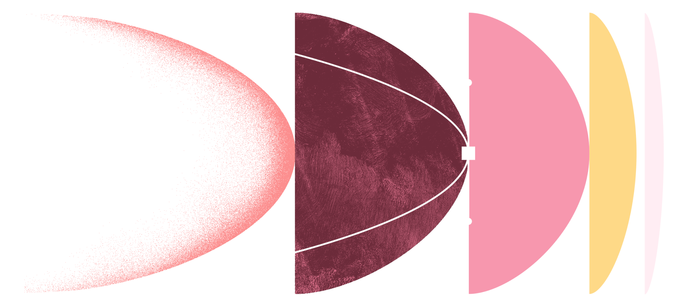
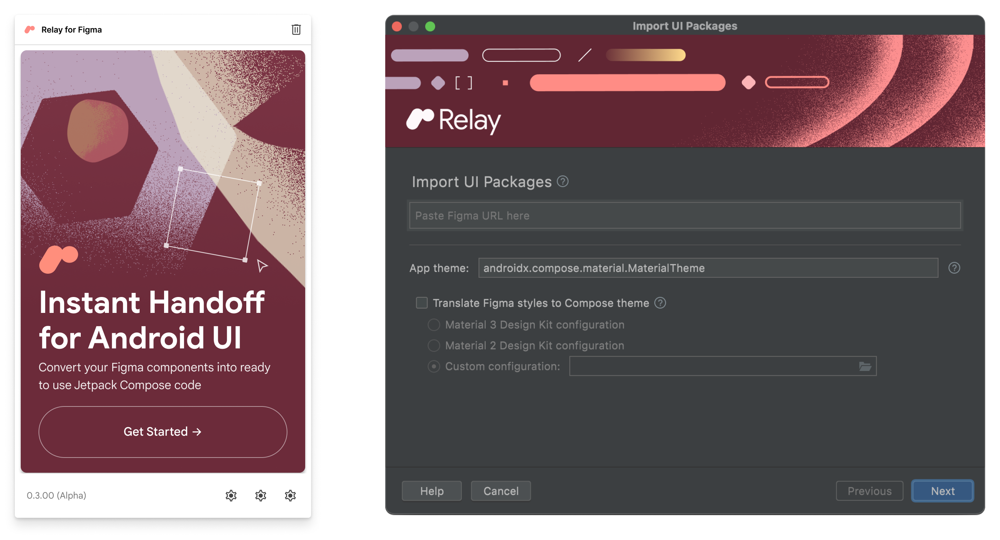

- [概要](#概要)

# 概要

Relay は、デザイナーと開発者の間で Android UI コンポーネントを即座に引き継ぐことができます。

デザイナーは Relay for Figma プラグインを使用して、レイアウト、スタイル、動的コンテンツ、インタラクション動作に関する情報など、開発者が使用できるように UI コンポーネントに注釈を付けてパッケージ化します。

開発者は Relay for Android Studio プラグインを使用して UI パッケージをインポートし、ピクセルパーフェクトな Jetpack Compose コードを生成します。このプロセスにより、レイアウトとスタイルが即座に実装され、データのバインディング プロセスが高速化されます。UI パッケージには、スタイルとテーマ、およびコード内に存在するリファレンス デザイン システム コンポーネントを含めることができます。

Relay を使用すると、細かい詳細のための面倒な設計仕様と通信ループが不要になります。製品の進化に合わせて、UI パッケージをコードベース全体で段階的に更新、拡張、および採用できます。

まず [Relay for Figma プラグイン](https://www.figma.com/community/plugin/1041056822461507786) を使用して UI パッケージを作成します。UI パッケージを作成したら、 [Relay for Android Studio プラグイン](https://plugins.jetbrains.com/plugin/19721) を使用して UI パッケージを Jetpack Compose コードに変換します。

