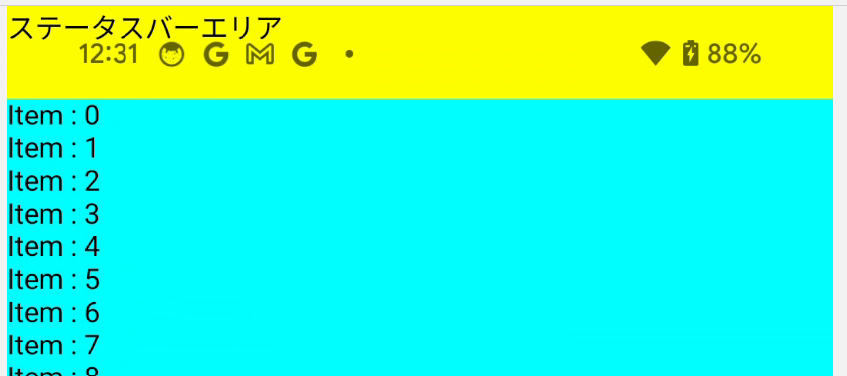
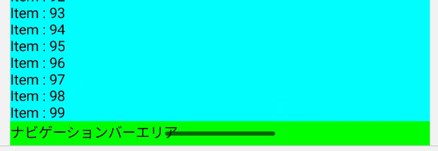
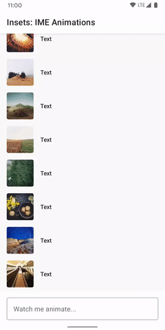

- [アプリでコンテンツをエッジ ツー エッジで表示し、Compose でウィンドウ インセットを処理する](#アプリでコンテンツをエッジ-ツー-エッジで表示しcompose-でウィンドウ-インセットを処理する)
  - [インセットの基礎](#インセットの基礎)
    - [個別のインセット](#個別のインセット)
    - [個別のインセットを一つのインセットにまとめたインセット](#個別のインセットを一つのインセットにまとめたインセット)
  - [インセットのセットアップ](#インセットのセットアップ)
  - [Compose API](#compose-api)
    - [インセット パディング修飾子](#インセット-パディング修飾子)
    - [インセット サイズ修飾子](#インセット-サイズ修飾子)
    - [インセットの消費](#インセットの消費)
      - [【注意点】インセットと Jetpack Compose のフェーズ](#注意点インセットと-jetpack-compose-のフェーズ)
  - [WindowInsets を使用したキーボード IME アニメーション](#windowinsets-を使用したキーボード-ime-アニメーション)
  - [マテリアル 3 コンポーネントのインセット サポート](#マテリアル-3-コンポーネントのインセット-サポート)
    - [コンポーザブルのインセット処理](#コンポーザブルのインセット処理)
      - [アプリバー](#アプリバー)
      - [コンテンツ コンテナ](#コンテンツ-コンテナ)
      - [Scaffold](#scaffold)
    - [デフォルトのインセットをオーバーライドする](#デフォルトのインセットをオーバーライドする)
      - [View システム インセットとの相互運用](#view-システム-インセットとの相互運用)
  - [リソース](#リソース)
  - [引用元資料](#引用元資料)


# アプリでコンテンツをエッジ ツー エッジで表示し、Compose でウィンドウ インセットを処理する

Android プラットフォームは、ステータス バーやナビゲーション バーなどのシステム UI を描画する役割を担っています。このシステム UI は、ユーザーがどのアプリを使用しているかに関係なく表示されます。

WindowInsets は、システム UI に関する情報を提供して、アプリが正しい領域に描画され、UI がシステム UI によって隠されないようにしています。


Android 14（API レベル 34）以下では、デフォルトではアプリの UI はシステムバーとディスプレイ カットアウトの下層には描画されません。

Android 15（API レベル 35）以上では、アプリが SDK 35 をターゲットにすると、アプリはシステムバーとディスプレイ カットアウトの下に描画されます。これにより、よりシームレスなユーザー エクスペリエンスが実現し、アプリは利用可能なウィンドウ スペースを最大限に活用できるようになります。

システム UI の背後にコンテンツを表示することを、 **エッジ to エッジ** と呼びます。このページでは、さまざまな種類のインセット、エッジ to エッジの方法、インセット API を使用して UI をアニメーション化し、アプリのコンテンツがシステム UI 要素によって隠されないようにする方法について説明します。

重要: アプリが SDK 35 をターゲットにすると、 [Android 15 以上でエッジ to エッジが強制](https://developer.android.com/about/versions/15/behavior-changes-15?_gl=1*bu3qc3*_up*MQ..*_ga*MTk5MTYxMTA4Ni4xNzI3NDI1ODc0*_ga_6HH9YJMN9M*MTcyNzU3MzUzNi41LjAuMTcyNzU3NTAxMi4wLjAuMjQ2MDIyNjMw#edge-to-edge) されます。アプリがまだエッジ to エッジでない場合は、アプリの一部が隠れる可能性があり、インセットを処理する必要があります。アプリによっては、この作業が重要になる場合と重要でない場合があります。Material 3 [Scaffold](https://developer.android.com/reference/kotlin/androidx/compose/material/package-summary?_gl=1*kk7qg0*_up*MQ..*_ga*MTk5MTYxMTA4Ni4xNzI3NDI1ODc0*_ga_6HH9YJMN9M*MTcyNzU3MzUzNi41LjAuMTcyNzU3NTAxMi4wLjAuMjQ2MDIyNjMw#Scaffold(androidx.compose.foundation.layout.WindowInsets,androidx.compose.ui.Modifier,androidx.compose.material.ScaffoldState,kotlin.Function0,kotlin.Function0,kotlin.Function1,kotlin.Function0,androidx.compose.material.FabPosition,kotlin.Boolean,kotlin.Function1,kotlin.Boolean,androidx.compose.ui.graphics.Shape,androidx.compose.ui.unit.Dp,androidx.compose.ui.graphics.Color,androidx.compose.ui.graphics.Color,androidx.compose.ui.graphics.Color,androidx.compose.ui.graphics.Color,androidx.compose.ui.graphics.Color,kotlin.Function1)) コンポーネントを使用すると、Android 15 のエッジ to エッジの適用と互換性を保つために必要な作業を減らすことができます。 [UI をまとめるための Scaffold コンポーネントを作成する](https://developer.android.com/quick-guides/content/create-scaffold?_gl=1*kk7qg0*_up*MQ..*_ga*MTk5MTYxMTA4Ni4xNzI3NDI1ODc0*_ga_6HH9YJMN9M*MTcyNzU3MzUzNi41LjAuMTcyNzU3NTAxMi4wLjAuMjQ2MDIyNjMw) をご覧ください。


## インセットの基礎

アプリが端から端まで表示される場合、重要なコンテンツやインタラクションが、システム UI によって見えにくくならないようにする必要があります。たとえば、ボタンがナビゲーション バーの背後に配置されている場合、ユーザーはそのボタンをクリックできない可能性があります。

システム UI のサイズと配置場所に関する情報は、インセットによって指定されます。

システム UI の各部分には、サイズと配置場所を表す各インセット タイプがあります。

たとえば、 WindowInsets.statusBars インセットは、ステータス バーのサイズと位置を提供し、 WindowInsets.navigationBars インセットは、ナビゲーション バーのサイズと位置を提供します。

各インセットは、 [WindowInsets](https://developer.android.com/reference/kotlin/androidx/compose/foundation/layout/WindowInsets) 型となっており、 top / left / right / bottom の 4 方向のインセットの距離を持っています。 WindowInsets.navigationBars の場合は、ナビゲーションバーは画面の下端に表示されるため、 WindowInsets の bottom にその高さを Int 型 (単位 : pixel ) で保持しています。


これらの寸法は、システム UI がアプリのウィンドウの対応する側からどれだけ離れているかを指定します。したがって、そのタイプのシステム UI と重ならないようにするには、アプリ UI をその量だけインセットする必要があります。


### 個別のインセット

このファイルと同じフォルダ内にある 「インセット一覧.xlsx 」 を先に参照してください。その方が全体像もわかって、良い気がします。

- [WindowInsets.statusBars](https://developer.android.com/reference/kotlin/androidx/compose/foundation/layout/package-summary?_gl=1*12pclvq*_up*MQ..*_ga*MTk5MTYxMTA4Ni4xNzI3NDI1ODc0*_ga_6HH9YJMN9M*MTcyNzU3MzUzNi41LjAuMTcyNzU3NTAxMi4wLjAuMjQ2MDIyNjMw#(androidx.compose.foundation.layout.WindowInsets.Companion).statusBars())

ステータス バーを説明するインセット。これらは、通知アイコンやその他のインジケーターを含む上部のシステム UI バーです。

- [WindowInsets.statusBarsIgnoringVisibility](https://developer.android.com/reference/kotlin/androidx/compose/foundation/layout/package-summary?_gl=1*12pclvq*_up*MQ..*_ga*MTk5MTYxMTA4Ni4xNzI3NDI1ODc0*_ga_6HH9YJMN9M*MTcyNzU3MzUzNi41LjAuMTcyNzU3NTAxMi4wLjAuMjQ2MDIyNjMw#(androidx.compose.foundation.layout.WindowInsets.Companion).statusBarsIgnoringVisibility())

ステータス バー インセットが表示されている場合。ステータス バーが現在非表示になっている場合 (没入型フル スクリーン モードに入っているため)、メインのステータス バー インセットは空になりますが、これらのインセットは空ではありません。

- [WindowInsets.navigationBars](https://developer.android.com/reference/kotlin/androidx/compose/foundation/layout/package-summary?_gl=1*12pclvq*_up*MQ..*_ga*MTk5MTYxMTA4Ni4xNzI3NDI1ODc0*_ga_6HH9YJMN9M*MTcyNzU3MzUzNi41LjAuMTcyNzU3NTAxMi4wLjAuMjQ2MDIyNjMw#(androidx.compose.foundation.layout.WindowInsets.Companion).navigationBars())

ナビゲーション バーを説明するインセット。これらは、デバイスの左側、右側、または下部にあるシステム UI バーで、タスク バーまたはナビゲーション アイコンを説明します。これらは、ユーザーの優先ナビゲーション方法とタスク バーの操作に基づいて、実行時に変更される可能性があります。

- [WindowInsets.navigationBarsIgnoringVisibility](https://developer.android.com/reference/kotlin/androidx/compose/foundation/layout/package-summary?_gl=1*12pclvq*_up*MQ..*_ga*MTk5MTYxMTA4Ni4xNzI3NDI1ODc0*_ga_6HH9YJMN9M*MTcyNzU3MzUzNi41LjAuMTcyNzU3NTAxMi4wLjAuMjQ2MDIyNjMw#(androidx.compose.foundation.layout.WindowInsets.Companion).navigationBarsIgnoringVisibility())

ナビゲーション バー インセットが表示されている場合。ナビゲーション バーが現在非表示になっている場合 (没入型フル スクリーン モードに入っているため)、メイン ナビゲーション バー インセットは空になりますが、これらのインセットは空になりません。

- [WindowInsets.captionBar](https://developer.android.com/reference/kotlin/androidx/compose/foundation/layout/package-summary?_gl=1*12pclvq*_up*MQ..*_ga*MTk5MTYxMTA4Ni4xNzI3NDI1ODc0*_ga_6HH9YJMN9M*MTcyNzU3MzUzNi41LjAuMTcyNzU3NTAxMi4wLjAuMjQ2MDIyNjMw#(androidx.compose.foundation.layout.WindowInsets.Companion).captionBar())

Android アプリにおいて、フリーフォームウィンドウ (例えば、デスクトップモードでアプリをウィンドウのように動かせる場合など) のタイトルバーなどのシステム UI の装飾部分を示すインセットです。

- [WindowInsets.captionBarIgnoringVisibility](https://developer.android.com/reference/kotlin/androidx/compose/foundation/layout/package-summary?_gl=1*1dijks8*_up*MQ..*_ga*MTk5MTYxMTA4Ni4xNzI3NDI1ODc0*_ga_6HH9YJMN9M*MTcyNzU3MzUzNi41LjAuMTcyNzU3NTAxMi4wLjAuMjQ2MDIyNjMw#(androidx.compose.foundation.layout.WindowInsets.Companion).captionBarIgnoringVisibility())

キャプション バーが表示されているときのインセット。キャプション バーが現在非表示になっている場合、メイン キャプション バー インセットは空になりますが、これらのインセットは空になりません。

- [WindowInsets.systemBars](https://developer.android.com/reference/kotlin/androidx/compose/foundation/layout/package-summary?_gl=1*1dijks8*_up*MQ..*_ga*MTk5MTYxMTA4Ni4xNzI3NDI1ODc0*_ga_6HH9YJMN9M*MTcyNzU3MzUzNi41LjAuMTcyNzU3NTAxMi4wLjAuMjQ2MDIyNjMw#(androidx.compose.foundation.layout.WindowInsets.Companion).systemBars())

ステータス バー、ナビゲーション バー、キャプション バーのすべてを含むインセット。

- [WindowInsets.systemBarsIgnoringVisibility](https://developer.android.com/reference/kotlin/androidx/compose/foundation/layout/package-summary?_gl=1*1dijks8*_up*MQ..*_ga*MTk5MTYxMTA4Ni4xNzI3NDI1ODc0*_ga_6HH9YJMN9M*MTcyNzU3MzUzNi41LjAuMTcyNzU3NTAxMi4wLjAuMjQ2MDIyNjMw#(androidx.compose.foundation.layout.WindowInsets.Companion).systemBarsIgnoringVisibility())

システム バーが表示されているときのインセット。システム バーが現在非表示になっている場合 (没入型フル スクリーン モードに入っているため)、メイン システム バー インセットは空になりますが、これらのインセットは空ではありません。

- [WindowInsets.ime](https://developer.android.com/reference/kotlin/androidx/compose/foundation/layout/package-summary?_gl=1*1dijks8*_up*MQ..*_ga*MTk5MTYxMTA4Ni4xNzI3NDI1ODc0*_ga_6HH9YJMN9M*MTcyNzU3MzUzNi41LjAuMTcyNzU3NTAxMi4wLjAuMjQ2MDIyNjMw#(androidx.compose.foundation.layout.WindowInsets.Companion).ime())

ソフトウェア キーボードが占める下部のスペースの量を表すインセット。

- [WindowInsets.imeAnimationSource](https://developer.android.com/reference/kotlin/androidx/compose/foundation/layout/package-summary?_gl=1*1dijks8*_up*MQ..*_ga*MTk5MTYxMTA4Ni4xNzI3NDI1ODc0*_ga_6HH9YJMN9M*MTcyNzU3MzUzNi41LjAuMTcyNzU3NTAxMi4wLjAuMjQ2MDIyNjMw#(androidx.compose.foundation.layout.WindowInsets.Companion).imeAnimationSource())

現在のキーボード アニメーションの前にソフトウェア キーボードが占めていたスペースの量を表すインセット。

- [WindowInsets.imeAnimationTarget](https://developer.android.com/reference/kotlin/androidx/compose/foundation/layout/package-summary?_gl=1*1dijks8*_up*MQ..*_ga*MTk5MTYxMTA4Ni4xNzI3NDI1ODc0*_ga_6HH9YJMN9M*MTcyNzU3MzUzNi41LjAuMTcyNzU3NTAxMi4wLjAuMjQ2MDIyNjMw#(androidx.compose.foundation.layout.WindowInsets.Companion).imeAnimationTarget())

現在のキーボード アニメーションの後にソフトウェア キーボードが占めるスペースの量を表すインセット。

- [WindowInsets.tappableElement](https://developer.android.com/reference/kotlin/androidx/compose/foundation/layout/package-summary?_gl=1*1dijks8*_up*MQ..*_ga*MTk5MTYxMTA4Ni4xNzI3NDI1ODc0*_ga_6HH9YJMN9M*MTcyNzU3MzUzNi41LjAuMTcyNzU3NTAxMi4wLjAuMjQ2MDIyNjMw#(androidx.compose.foundation.layout.WindowInsets.Companion).tappableElement())

ナビゲーション UI に関する、より詳細な情報を表すインセットのタイプ。アプリではなくシステムによって「タップ」が処理されるスペースの量を示します。ジェスチャー ナビゲーションを備えた透明なナビゲーション バーの場合、一部のアプリ要素はシステム ナビゲーション UI を通じてタップできます。

- [WindowInsets.tappableElementIgnoringVisibility](https://developer.android.com/reference/kotlin/androidx/compose/foundation/layout/package-summary?_gl=1*1dijks8*_up*MQ..*_ga*MTk5MTYxMTA4Ni4xNzI3NDI1ODc0*_ga_6HH9YJMN9M*MTcyNzU3MzUzNi41LjAuMTcyNzU3NTAxMi4wLjAuMjQ2MDIyNjMw#(androidx.compose.foundation.layout.WindowInsets.Companion).tappableElementIgnoringVisibility())

タップ可能な要素が表示されているときのインセット。タップ可能な要素が現在非表示になっている場合 (没入型フルスクリーン モードに入っているため)、メインのタップ可能な要素インセットは空になりますが、これらのインセットは空ではありません。

- [WindowInsets.systemGestures](https://developer.android.com/reference/kotlin/androidx/compose/foundation/layout/package-summary?_gl=1*1dijks8*_up*MQ..*_ga*MTk5MTYxMTA4Ni4xNzI3NDI1ODc0*_ga_6HH9YJMN9M*MTcyNzU3MzUzNi41LjAuMTcyNzU3NTAxMi4wLjAuMjQ2MDIyNjMw#(androidx.compose.foundation.layout.WindowInsets.Companion).systemGestures())

システムがナビゲーションのジェスチャをインターセプトするインセットの量を表すインセット。アプリは Modifier.systemGestureExclusion を介してこれらのジェスチャの限られた量を処理するように手動で指定できます。

- [WindowInsets.mandatorySystemGestures](https://developer.android.com/reference/kotlin/androidx/compose/foundation/layout/package-summary?_gl=1*1dijks8*_up*MQ..*_ga*MTk5MTYxMTA4Ni4xNzI3NDI1ODc0*_ga_6HH9YJMN9M*MTcyNzU3MzUzNi41LjAuMTcyNzU3NTAxMi4wLjAuMjQ2MDIyNjMw#(androidx.compose.foundation.layout.WindowInsets.Companion).mandatorySystemGestures())

システムによって常に処理され、Modifier.systemGestureExclusion を介してオプトアウトできないシステム ジェスチャのサブセット。

- [WindowInsets.displayCutout](https://developer.android.com/reference/kotlin/androidx/compose/foundation/layout/package-summary?_gl=1*a7hro6*_up*MQ..*_ga*MTk5MTYxMTA4Ni4xNzI3NDI1ODc0*_ga_6HH9YJMN9M*MTcyNzU3MzUzNi41LjAuMTcyNzU3NTAxMi4wLjAuMjQ2MDIyNjMw#(androidx.compose.foundation.layout.WindowInsets.Companion).displayCutout())

ディスプレイの切り欠き (ノッチまたはピンホール) との重なりを避けるために必要な間隔を表すインセット。

- [WindowInsets.waterfall](https://developer.android.com/reference/kotlin/androidx/compose/foundation/layout/package-summary?_gl=1*a7hro6*_up*MQ..*_ga*MTk5MTYxMTA4Ni4xNzI3NDI1ODc0*_ga_6HH9YJMN9M*MTcyNzU3MzUzNi41LjAuMTcyNzU3NTAxMi4wLjAuMjQ2MDIyNjMw#(androidx.compose.foundation.layout.WindowInsets.Companion).waterfall())

ウォーターフォール表示の湾曲した領域を表すインセット。ウォーターフォール表示には、画面がデバイスの側面に沿って折り返し始める部分の画面の端に沿って湾曲した領域があります。


### 個別のインセットを一つのインセットにまとめたインセット

これらのタイプは、コンテンツが隠れないようにする 3 つの「安全な」インセット タイプにまとめられます。これらの「安全な」インセット タイプは、基盤となるプラットフォーム インセットに基づいて、さまざまな方法でコンテンツを保護します:

- [WindowInsets.safeDrawing](https://developer.android.com/reference/kotlin/androidx/compose/foundation/layout/package-summary?_gl=1*ydgom7*_up*MQ..*_ga*MTk5MTYxMTA4Ni4xNzI3NDI1ODc0*_ga_6HH9YJMN9M*MTcyNzU3MzUzNi41LjAuMTcyNzU3NTAxMi4wLjAuMjQ2MDIyNjMw#(androidx.compose.foundation.layout.WindowInsets.Companion).safeDrawing())
  - 概要
    - システム UI の下に描画されるべきではないコンテンツを保護します。
    - これは、インセットの最も一般的な使用法です。
    - つまり、システム UI によって隠れている (部分的、または、完全に) コンテンツを描画しないようにすることです。
  - これに含まれる個別のインセット
    - このファイルと同じフォルダ内にある 「インセット一覧.xlsx 」 を参照してください。

- [WindowInsets.safeGestures](https://developer.android.com/reference/kotlin/androidx/compose/foundation/layout/package-summary?_gl=1*ydgom7*_up*MQ..*_ga*MTk5MTYxMTA4Ni4xNzI3NDI1ODc0*_ga_6HH9YJMN9M*MTcyNzU3MzUzNi41LjAuMTcyNzU3NTAxMi4wLjAuMjQ2MDIyNjMw#(androidx.compose.foundation.layout.WindowInsets.Companion).safeGestures())
  - 概要
    - ジェスチャを含むコンテンツを保護します。
    - これにより、システム ジェスチャがアプリ ジェスチャ (ボトム シート、カルーセル、ゲームなど) と衝突するのを回避できます。
  - これに含まれる個別のインセット
    - このファイルと同じフォルダ内にある 「インセット一覧.xlsx 」 を参照してください。

- [WindowInsets.safeContent](https://developer.android.com/reference/kotlin/androidx/compose/foundation/layout/package-summary?_gl=1*ydgom7*_up*MQ..*_ga*MTk5MTYxMTA4Ni4xNzI3NDI1ODc0*_ga_6HH9YJMN9M*MTcyNzU3MzUzNi41LjAuMTcyNzU3NTAxMi4wLjAuMjQ2MDIyNjMw#(androidx.compose.foundation.layout.WindowInsets.Companion).safeContent())
  - 概要
    - WindowInsets.safeDrawing と WindowInsets.safeGestures の組み合わせとして WindowInsets.safeContent を使用して、コンテンツに視覚的な重なりがなく、ジェスチャも重ならないようにします。


## インセットのセットアップ

アプリがコンテンツを描画する場所を完全に制御できるようにするには、次の設定手順に従ってください。これらの手順を実行しないと、アプリがシステム UI の背後に黒または単色を描画したり、ソフトウェア キーボードと同期してアニメーション化されなかったりする可能性があります。

1. Android 15 以降のデバイスで、エッジ to エッジを適用するには、Target SDK を 35 以降にします。アプリはシステム UI の背後に表示されます。インセットを処理することで、アプリの UI を調整できます。

2. オプションで、 Activity.onCreate() で [enableEdgeToEdge()](https://developer.android.com/reference/androidx/activity/ComponentActivity?_gl=1*bmos0u*_up*MQ..*_ga*MTk5MTYxMTA4Ni4xNzI3NDI1ODc0*_ga_6HH9YJMN9M*MTcyNzU3MzUzNi41LjAuMTcyNzU3NTAxMi4wLjAuMjQ2MDIyNjMw#(androidx.activity.ComponentActivity).enableEdgeToEdge(androidx.activity.SystemBarStyle,androidx.activity.SystemBarStyle)) を呼び出します。これにより、以前の Android 15 未満のデバイスでアプリをエッジ to エッジにすることができます。

```kotlin
override fun onCreate(savedInstanceState: Bundle?) {
    enableEdgeToEdge()
    super.onCreate(savedInstanceState)
    // ...
}
```

3. AndroidManifest.xml の Activity エントリ内で android:windowSoftInputMode="adjustResize" を設定します。この設定により、アプリはソフトウェア IME のサイズをインセットとして受け取ることができるため、アプリで IME が表示されたり消えたりするときに、コンテンツを適切にパディングしてレイアウトできます。


## Compose API

アクティビティがすべてのインセットの処理を制御できるようになったら、Compose API を使用して、コンテンツが隠れないようにし、操作可能な要素が、システム UI と重ならないようにすることができます。これらの API は、アプリのレイアウトをインセットの変更と同期します。

ウィンドウ全体を最大限に活用するには、画面ごと、または、コンポーネントごとに、インセットを適用する場所を微調整する必要があります。

これらのインセット タイプはすべて、 API 21 にバックポートされた IME アニメーションによって自動的にアニメーション化されます。さらに、これらのインセットを使用するすべてのレイアウトも、インセット値が変化すると自動的にアニメーション化されます。

これらのインセット タイプを使用して Composable レイアウトを調整するには、 **インセット パディング修飾子** と **インセット サイズ修飾子** という 2 つの主な方法があります。


### インセット パディング修飾子

パディング修飾子を使用してインセットを設定すると、画面上の 4 辺すべてに、そのインセットから取得した幅や高さのパディングを追加します。パディングで余白が作られるだけであるため、インセット部分に任意の塗りつぶしや文字を表示するなどのカスタマイズはできません。

パディング修飾子は、 Modifier.padding と同じように動作します。

例えば、以下のコードは、アプリ全体のコンテンツにインセットを適用する最も基本的な方法です。

```kotlin
override fun onCreate(savedInstanceState: Bundle?) {
    super.onCreate(savedInstanceState)

    enableEdgeToEdge()

    setContent {
        // safeDrawing オプションを指定
        Box(Modifier.safeDrawingPadding()) {
            // the rest of the app
        }
    }
}
```

このスニペットは、 `safeDrawing` ウィンドウ インセットを、アプリのコンテンツ全体のパディングとして適用します。これにより、インタラクション可能な要素がシステム UI と重ならなくなり、アプリがシステム UI の背後に描画されることはありません。

他のインセット タイプにも、同様の修飾子があります。 ( [statusBarsPadding](https://developer.android.com/reference/kotlin/androidx/compose/foundation/layout/package-summary?_gl=1*cblbng*_up*MQ..*_ga*MTEwMzE3MzY3My4xNzMwNDI4ODU0*_ga_6HH9YJMN9M*MTczMDQyODg1My4xLjAuMTczMDQyODg1My4wLjAuMTY5Mjc0NzMzOA..#(androidx.compose.ui.Modifier).statusBarsPadding()) や [navigationBarsPadding](https://developer.android.com/reference/kotlin/androidx/compose/foundation/layout/package-summary?_gl=1*cblbng*_up*MQ..*_ga*MTEwMzE3MzY3My4xNzMwNDI4ODU0*_ga_6HH9YJMN9M*MTczMDQyODg1My4xLjAuMTczMDQyODg1My4wLjAuMTY5Mjc0NzMzOA..#(androidx.compose.ui.Modifier).navigationBarsPadding()) など)

これらのパディング修飾子は、共通的な記述方法に置き換えることも可能です。例えば、 `Modifier.safeDrawingPadding()` は、 `Modifier.windowInsetsPadding(WindowInsets.safeDrawing)` に置き換えることも可能です。これらの方法では、インセットを消費します。


### インセット サイズ修飾子

インセット サイズの修飾子を使用すると、インセットの幅 or 高さを取得することができるため、その幅や高さを UI 要素に設定することで、インセット部分を自分で埋めます。多くの場合は Spacer コンポーザブルを使用しますが、他のコンポーザブルで埋めることもできるため、インセット部分に色を塗ったり、テキストを表示するなどのカスタマイズも可能です。

インセットサイズ修飾子には、以下の 4 種類があります。

- [Modifier.windowInsetsStartWidth(windowInsets: WindowInsets)](https://developer.android.com/reference/kotlin/androidx/compose/foundation/layout/package-summary?_gl=1*1oagq91*_up*MQ..*_ga*MTk5MTYxMTA4Ni4xNzI3NDI1ODc0*_ga_6HH9YJMN9M*MTcyNzU3MzUzNi41LjAuMTcyNzU3NTAxMi4wLjAuMjQ2MDIyNjMw#(androidx.compose.ui.Modifier).windowInsetsStartWidth(androidx.compose.foundation.layout.WindowInsets))
  - 引数で渡された windowInsets の start を取得し、この Modifier を適用した UI 要素の幅として適用します。
  - つまり `Modifier.width(windowInsets.getStart())` と同じです。

- [Modifier.windowInsetsEndWidth(windowInsets: WindowInsets)](https://developer.android.com/reference/kotlin/androidx/compose/foundation/layout/package-summary?_gl=1*1flmes6*_up*MQ..*_ga*MTk5MTYxMTA4Ni4xNzI3NDI1ODc0*_ga_6HH9YJMN9M*MTcyNzU3MzUzNi41LjAuMTcyNzU3NTAxMi4wLjAuMjQ2MDIyNjMw#(androidx.compose.ui.Modifier).windowInsetsEndWidth(androidx.compose.foundation.layout.WindowInsets))
  - 引数で渡された windowInsets の start を取得し、この Modifier を適用した UI 要素の幅として適用します。
  - つまり `Modifier.width(windowInsets.getEnd())` と同じです。

- [Modifier.windowInsetsTopHeight(windowInsets: WindowInsets)](https://developer.android.com/reference/kotlin/androidx/compose/foundation/layout/package-summary?_gl=1*1flmes6*_up*MQ..*_ga*MTk5MTYxMTA4Ni4xNzI3NDI1ODc0*_ga_6HH9YJMN9M*MTcyNzU3MzUzNi41LjAuMTcyNzU3NTAxMi4wLjAuMjQ2MDIyNjMw#(androidx.compose.ui.Modifier).windowInsetsTopHeight(androidx.compose.foundation.layout.WindowInsets))
  - 引数で渡された windowInsets の top を取得し、この Modifier を適用した UI 要素の高さとして適用します。
  - つまり `Modifier.height(windowInsets.getTop())` と同じです。

- [Modifier.windowInsetsBottomHeight(windowInsets: WindowInsets)](https://developer.android.com/reference/kotlin/androidx/compose/foundation/layout/package-summary?_gl=1*1flmes6*_up*MQ..*_ga*MTk5MTYxMTA4Ni4xNzI3NDI1ODc0*_ga_6HH9YJMN9M*MTcyNzU3MzUzNi41LjAuMTcyNzU3NTAxMi4wLjAuMjQ2MDIyNjMw#(androidx.compose.ui.Modifier).windowInsetsBottomHeight(androidx.compose.foundation.layout.WindowInsets))
  - 引数で渡された windowInsets の bottom を取得し、この Modifier を適用した UI 要素の高さとして適用します。
  - つまり `Modifier.height(windowInsets.getBottom())` と同じです。

これらの修飾子は、インセットのスペースを占める Spacer のサイズを設定する場合に特に便利です。

```kotlin
class MainActivity : ComponentActivity() {

    override fun onCreate(savedInstanceState: Bundle?) {
        super.onCreate(savedInstanceState)

        enableEdgeToEdge()

        setContent {
            MyScreen()
        }
    }
}


@Composable
fun MyScreen() {
    LazyColumn(
        // imePadding については、次のセクションを参照してください。
        Modifier.imePadding().fillMaxWidth().background(Color.Cyan)
    ) {
        // ステータスバーの高さの余白を設定します。
        item {
            // 一般的には Text コンポーザブルではなく、 Spacer コンポーザブルを使用します。
            // Spacer コンポーザブルには背景色が設定できないため、
            // ここでは、 Text コンポーザブルを使用しています。
            Text(text = "ステータスバーエリア",
                Modifier
                    .fillMaxWidth()
                    .background(Color.Yellow)
                    .windowInsetsTopHeight(
                        WindowInsets.systemBars
                    )
            )
        }

        items(100) { index ->
            Text(
                text = "Item : $index",
            )
        }

        // ナビゲーションバーの高さの余白を設定します。
        item {
            // 一般的には Text コンポーザブルではなく、 Spacer コンポーザブルを使用します。
            Text(text = "ナビゲーションバーエリア",
                Modifier
                    .fillMaxWidth()
                    .background(Color.Green)
                    .windowInsetsBottomHeight(
                        WindowInsets.systemBars
                    )
            )
        }
    }
}
```






### インセットの消費

インセット パディング修飾子は、適用されたインセットの幅や高さを自動的に認識 (消費) し、ネストされた UI コンポーザブルでは、その幅や高さ以下のインセットは、重複して適用されることはありません。 (インセット サイズ修飾子は、インセットが消費されたかどうかを認識することはできません。)

その結果、ネストされたパディング修飾子は、各コンポーザブルに適用されるパディングの量を自動的に変更します。

以下の例は、 bottom に IME インセットとナビゲーションインセットが存在する場合の例です。

```kotlin
LazyColumn(
    Modifier.imePadding()
) {
    // リストの最終行以外の行
    item {
        // コンテンツ
    }
    // リストの最終行
    item {
        Spacer(
            Modifier.windowInsetsBottomHeight(
                WindowInsets.systemBars
            )
        )
    }
}
```

https://youtube.com/shorts/yIr4L93um64?feature=share

IME が開いている状態では、 imePadding() がインセットを消費するため、ネストされた Spacer のナビゲーションインセットの高さは 0 になります。

IME が閉じている状態では、 imePadding() がインセットを消費しないため、ネストされた Spacer のナビゲーションインセットの高さは、ナビゲーションバーの高さになります。

IME が閉じたり開いたりするたびに、 Spacer の高さはアニメーションを行いながら、その高さを変更します。

**注意** : システム バーの上に LazyColumn の最後の TextField を描画するには、contentPadding ではなく Spacer を使用します。そうしないと、 IME によって TextField が非表示になる場合があります。 (なぜそうなるのか解説がないため、わからない...。)

この動作は、すべての windowInsetsPadding 修飾子間の通信によって実現され、他のいくつかの方法で影響を受ける可能性があります。

[Modifier.consumeWindowInsets(insets: WindowInsets)](https://developer.android.com/reference/kotlin/androidx/compose/foundation/layout/package-summary?_gl=1*z9bjhl*_up*MQ..*_ga*MTk5MTYxMTA4Ni4xNzI3NDI1ODc0*_ga_6HH9YJMN9M*MTcyNzU3MzUzNi41LjAuMTcyNzU3NTAxMi4wLjAuMjQ2MDIyNjMw#(androidx.compose.ui.Modifier).consumeWindowInsets(androidx.compose.foundation.layout.WindowInsets)) は [Modifier.windowInsetsPadding](https://developer.android.com/reference/kotlin/androidx/compose/foundation/layout/package-summary?_gl=1*z9bjhl*_up*MQ..*_ga*MTk5MTYxMTA4Ni4xNzI3NDI1ODc0*_ga_6HH9YJMN9M*MTcyNzU3MzUzNi41LjAuMTcyNzU3NTAxMi4wLjAuMjQ2MDIyNjMw#(androidx.compose.ui.Modifier).windowInsetsPadding(androidx.compose.foundation.layout.WindowInsets)) と同じ方法でインセットを消費します。ただし、消費はするものの、実際にパディングが確保されるわけではありません。これは、インセット サイズ修飾子と組み合わせて使用​​することで、兄弟に一定量のインセットが、すでに消費されていることを示すのに役立ちます。

```kotlin
Column(Modifier.verticalScroll(rememberScrollState())) {
    Spacer(Modifier.windowInsetsTopHeight(WindowInsets.systemBars))

    Column(
        // Top と Bottom のインセットは、既に外側で確保されているため、
        // この Column 内では、それらを除いたインセットを使用する必要があるため、
        // ここで、インセットを消費する。
        Modifier.consumeWindowInsets(
            WindowInsets.systemBars.only(WindowInsetsSides.Vertical)
        )
    ) {
        // コンテンツ

        // ナビゲーションバーの高さは、既に確保されているため、
        // この Spacer は、それを除く、純粋な IME 部分のみの高さとする必要がある。
        Spacer(Modifier.windowInsetsBottomHeight(WindowInsets.ime))
    }

    // パディング修飾子の中ではないため、
    // このインセットが自動調整されることはなく、
    // 常にナビゲーションバーの高さ分の Spacer が確保される。
    Spacer(Modifier.windowInsetsBottomHeight(WindowInsets.systemBars))
}
```

`consumeWindowInsets()` 関数は、引数に `PaddingValues` をとることも可能です。 ( `Modifier.consumeWindowInsets(paddingValues: PaddingValues)` )

WindowInsets オブジェクトは、システムから提供されるため、その高さや幅を任意に指定することはできません。しかし、 PaddingValues は、開発者が任意に指定できるため、消費する幅や高さを任意に決めることが可能になります。

これは、インセット パディング修飾子以外のメカニズム (通常の Modifier.padding や高さが固定されたスペーサーなど) によって、パディング、または、スペースが提供される場合に、子に通知するのに役立ちます。

```kotlin
Column(Modifier.padding(16.dp).consumeWindowInsets(PaddingValues(16.dp))) {

    // アプリコンテンツ

    // インセット
    Spacer(Modifier.windowInsetsBottomHeight(WindowInsets.ime))
}
```

消費されずに生のウィンドウ インセットが必要な場合は、WindowInsets 値を直接使用するか、 [WindowInsets.asPaddingValues()](https://developer.android.com/reference/kotlin/androidx/compose/foundation/layout/WindowInsets?_gl=1*uc21uu*_up*MQ..*_ga*MTk5MTYxMTA4Ni4xNzI3NDI1ODc0*_ga_6HH9YJMN9M*MTcyNzU3MzUzNi41LjAuMTcyNzU3NTAxMi4wLjAuMjQ2MDIyNjMw#(androidx.compose.foundation.layout.WindowInsets).asPaddingValues()) を使用して、消費の影響を受けないインセットの PaddingValues を返します。ただし、以下の注意事項があるため、可能な限り、パディング修飾子とサイズ修飾子を使用することをお勧めします。


#### 【注意点】インセットと Jetpack Compose のフェーズ

Compose は、基盤となる AndroidX コア API を使用してインセットを更新およびアニメーション化します。このコア API は、インセットを管理する基盤となるプラットフォーム API を使用します。このプラットフォームの動作のため、インセットは Jetpack Compose のフェーズと特別な関係があります。

インセットの値は、コンポジション フェーズの後、レイアウト フェーズの前に更新されます。つまり、コンポジションでインセットの値を読み取ると、通常、1 フレーム遅れのインセットの値が使用されます。このページで説明する組み込み修飾子は、レイアウト フェーズまでインセットの値の使用を遅らせるように構築されており、これにより、インセットの値が更新されるのと同じフレームで確実に使用されます。


## WindowInsets を使用したキーボード IME アニメーション

スクロール コンテナーに `Modifier.imeNestedScroll()` を適用すると、コンテナーの一番下までスクロールしたときに IME が自動的に開閉されます。

```kotlin
class WindowInsetsExampleActivity : AppCompatActivity() {
    override fun onCreate(savedInstanceState: Bundle?) {
        super.onCreate(savedInstanceState)

        WindowCompat.setDecorFitsSystemWindows(window, false)

        setContent {
            MaterialTheme {
                MyScreen()
            }
        }
    }
}

@OptIn(ExperimentalLayoutApi::class)
@Composable
fun MyScreen() {
    Box {
        LazyColumn(
            modifier = Modifier
                .fillMaxSize()
                .imePadding()
                .imeNestedScroll(), // scroll IME at the bottom
            content = { }
        )
        FloatingActionButton(
            modifier = Modifier
                .align(Alignment.BottomEnd)
                .padding(16.dp)
                .navigationBarsPadding()
                .imePadding(),
            onClick = { }
        ) {
            Icon(imageVector = Icons.Filled.Add, contentDescription = "Add")
        }
    }
}
```




## マテリアル 3 コンポーネントのインセット サポート

使いやすさを考慮して、組み込みのマテリアル 3 コンポーザブル ( [androidx.compose.material3](https://developer.android.com/reference/kotlin/androidx/compose/material3/package-summary?_gl=1*1vxi52v*_up*MQ..*_ga*MTEwMzE3MzY3My4xNzMwNDI4ODU0*_ga_6HH9YJMN9M*MTczMDQyODg1My4xLjAuMTczMDQyODg1My4wLjAuMTY5Mjc0NzMzOA..) ) の多くは、マテリアル仕様に従ってコンポーザブルがアプリ内に配置されている方法に基づいて、インセットを自ら処理します。

**注** : マテリアル 2 コンポーネント ( [androidx.compose.material](https://developer.android.com/reference/kotlin/androidx/compose/material/package-summary?_gl=1*1vxi52v*_up*MQ..*_ga*MTEwMzE3MzY3My4xNzMwNDI4ODU0*_ga_6HH9YJMN9M*MTczMDQyODg1My4xLjAuMTczMDQyODg1My4wLjAuMTY5Mjc0NzMzOA..) ) は、インセットを自動的には処理しません。ただし、インセットにアクセスして手動で適用することはできます。 [androidx.compose.material 1.6.0](https://developer.android.com/jetpack/androidx/releases/compose-material?_gl=1*1vxi52v*_up*MQ..*_ga*MTEwMzE3MzY3My4xNzMwNDI4ODU0*_ga_6HH9YJMN9M*MTczMDQyODg1My4xLjAuMTczMDQyODg1My4wLjAuMTY5Mjc0NzMzOA..#1.6.0-alpha03) 以降では、windowInsets パラメータを使用して、 [BottomAppBar](https://developer.android.com/reference/kotlin/androidx/compose/material/package-summary?_gl=1*1ezloc6*_up*MQ..*_ga*MTEwMzE3MzY3My4xNzMwNDI4ODU0*_ga_6HH9YJMN9M*MTczMDQyODg1My4xLjAuMTczMDQyODg1My4wLjAuMTY5Mjc0NzMzOA..#BottomAppBar(androidx.compose.foundation.layout.WindowInsets,androidx.compose.ui.Modifier,androidx.compose.ui.graphics.Color,androidx.compose.ui.graphics.Color,androidx.compose.ui.graphics.Shape,androidx.compose.ui.unit.Dp,androidx.compose.foundation.layout.PaddingValues,kotlin.Function1)) 、 [TopAppBar](https://developer.android.com/reference/kotlin/androidx/compose/material/package-summary?_gl=1*1ezloc6*_up*MQ..*_ga*MTEwMzE3MzY3My4xNzMwNDI4ODU0*_ga_6HH9YJMN9M*MTczMDQyODg1My4xLjAuMTczMDQyODg1My4wLjAuMTY5Mjc0NzMzOA..#TopAppBar(androidx.compose.foundation.layout.WindowInsets,androidx.compose.ui.Modifier,androidx.compose.ui.graphics.Color,androidx.compose.ui.graphics.Color,androidx.compose.ui.unit.Dp,androidx.compose.foundation.layout.PaddingValues,kotlin.Function1)) 、 [BottomNavigation](https://developer.android.com/reference/kotlin/androidx/compose/material/package-summary?_gl=1*1ezloc6*_up*MQ..*_ga*MTEwMzE3MzY3My4xNzMwNDI4ODU0*_ga_6HH9YJMN9M*MTczMDQyODg1My4xLjAuMTczMDQyODg1My4wLjAuMTY5Mjc0NzMzOA..#BottomNavigation(androidx.compose.foundation.layout.WindowInsets,androidx.compose.ui.Modifier,androidx.compose.ui.graphics.Color,androidx.compose.ui.graphics.Color,androidx.compose.ui.unit.Dp,kotlin.Function1)) 、 [NavigationRail](https://developer.android.com/reference/kotlin/androidx/compose/material/package-summary?_gl=1*1ezloc6*_up*MQ..*_ga*MTEwMzE3MzY3My4xNzMwNDI4ODU0*_ga_6HH9YJMN9M*MTczMDQyODg1My4xLjAuMTczMDQyODg1My4wLjAuMTY5Mjc0NzMzOA..#NavigationRail(androidx.compose.foundation.layout.WindowInsets,androidx.compose.ui.Modifier,androidx.compose.ui.graphics.Color,androidx.compose.ui.graphics.Color,androidx.compose.ui.unit.Dp,kotlin.Function1,kotlin.Function1)) にインセットを手動で適用します。同様に、 [Scaffold](https://developer.android.com/reference/kotlin/androidx/compose/material/package-summary?_gl=1*1ezloc6*_up*MQ..*_ga*MTEwMzE3MzY3My4xNzMwNDI4ODU0*_ga_6HH9YJMN9M*MTczMDQyODg1My4xLjAuMTczMDQyODg1My4wLjAuMTY5Mjc0NzMzOA..#Scaffold(androidx.compose.foundation.layout.WindowInsets,androidx.compose.ui.Modifier,androidx.compose.material.ScaffoldState,kotlin.Function0,kotlin.Function0,kotlin.Function1,kotlin.Function0,androidx.compose.material.FabPosition,kotlin.Boolean,kotlin.Function1,kotlin.Boolean,androidx.compose.ui.graphics.Shape,androidx.compose.ui.unit.Dp,androidx.compose.ui.graphics.Color,androidx.compose.ui.graphics.Color,androidx.compose.ui.graphics.Color,androidx.compose.ui.graphics.Color,androidx.compose.ui.graphics.Color,kotlin.Function1)) には contentWindowInsets パラメータを使用します。それ以外の場合は、パディングとしてインセットを手動で適用します。


### コンポーザブルのインセット処理

以下は、インセットを自動的に処理する [マテリアル コンポーネント](https://developer.android.com/reference/kotlin/androidx/compose/material3/package-summary?_gl=1*1s13h69*_up*MQ..*_ga*MTEwMzE3MzY3My4xNzMwNDI4ODU0*_ga_6HH9YJMN9M*MTczMDQyODg1My4xLjAuMTczMDQyODg1My4wLjAuMTY5Mjc0NzMzOA..) の一覧です。


#### アプリバー

- [TopAppBar](https://developer.android.com/reference/kotlin/androidx/compose/material3/package-summary?_gl=1*w0m0rh*_up*MQ..*_ga*MTEwMzE3MzY3My4xNzMwNDI4ODU0*_ga_6HH9YJMN9M*MTczMDQyODg1My4xLjAuMTczMDQyODg1My4wLjAuMTY5Mjc0NzMzOA..#TopAppBar(kotlin.Function0,androidx.compose.ui.Modifier,kotlin.Function0,kotlin.Function1,androidx.compose.foundation.layout.WindowInsets,androidx.compose.material3.TopAppBarColors,androidx.compose.material3.TopAppBarScrollBehavior)) / [SmallTopAppBar](https://developer.android.com/reference/kotlin/androidx/compose/material3/package-summary?_gl=1*w0m0rh*_up*MQ..*_ga*MTEwMzE3MzY3My4xNzMwNDI4ODU0*_ga_6HH9YJMN9M*MTczMDQyODg1My4xLjAuMTczMDQyODg1My4wLjAuMTY5Mjc0NzMzOA..#SmallTopAppBar(kotlin.Function0,androidx.compose.ui.Modifier,kotlin.Function0,kotlin.Function1,androidx.compose.foundation.layout.WindowInsets,androidx.compose.material3.TopAppBarColors,androidx.compose.material3.TopAppBarScrollBehavior)) / [CenterAlignedTopAppBar](https://developer.android.com/reference/kotlin/androidx/compose/material3/package-summary?_gl=1*w0m0rh*_up*MQ..*_ga*MTEwMzE3MzY3My4xNzMwNDI4ODU0*_ga_6HH9YJMN9M*MTczMDQyODg1My4xLjAuMTczMDQyODg1My4wLjAuMTY5Mjc0NzMzOA..#CenterAlignedTopAppBar(kotlin.Function0,androidx.compose.ui.Modifier,kotlin.Function0,kotlin.Function1,androidx.compose.foundation.layout.WindowInsets,androidx.compose.material3.TopAppBarColors,androidx.compose.material3.TopAppBarScrollBehavior)) / [MediumTopAppBar](https://developer.android.com/reference/kotlin/androidx/compose/material3/package-summary?_gl=1*w0m0rh*_up*MQ..*_ga*MTEwMzE3MzY3My4xNzMwNDI4ODU0*_ga_6HH9YJMN9M*MTczMDQyODg1My4xLjAuMTczMDQyODg1My4wLjAuMTY5Mjc0NzMzOA..#MediumTopAppBar(kotlin.Function0,androidx.compose.ui.Modifier,kotlin.Function0,kotlin.Function1,androidx.compose.foundation.layout.WindowInsets,androidx.compose.material3.TopAppBarColors,androidx.compose.material3.TopAppBarScrollBehavior)) / [LargeTopAppBar](https://developer.android.com/reference/kotlin/androidx/compose/material3/package-summary?_gl=1*w0m0rh*_up*MQ..*_ga*MTEwMzE3MzY3My4xNzMwNDI4ODU0*_ga_6HH9YJMN9M*MTczMDQyODg1My4xLjAuMTczMDQyODg1My4wLjAuMTY5Mjc0NzMzOA..#LargeTopAppBar(kotlin.Function0,androidx.compose.ui.Modifier,kotlin.Function0,kotlin.Function1,androidx.compose.foundation.layout.WindowInsets,androidx.compose.material3.TopAppBarColors,androidx.compose.material3.TopAppBarScrollBehavior)) : システム バーはウィンドウの上部で使用されるため、上側と横側をパディングとして適用します。
- [BottomAppBar](https://developer.android.com/reference/kotlin/androidx/compose/material3/package-summary?_gl=1*dfz47w*_up*MQ..*_ga*MTEwMzE3MzY3My4xNzMwNDI4ODU0*_ga_6HH9YJMN9M*MTczMDQyODg1My4xLjAuMTczMDQyODg1My4wLjAuMTY5Mjc0NzMzOA..#BottomAppBar(androidx.compose.ui.Modifier,androidx.compose.ui.graphics.Color,androidx.compose.ui.graphics.Color,androidx.compose.ui.unit.Dp,androidx.compose.foundation.layout.PaddingValues,androidx.compose.foundation.layout.WindowInsets,kotlin.Function1)) : システム バーの下側と横側をパディングとして適用します。


#### コンテンツ コンテナ

- [ModalDrawerSheet](https://developer.android.com/reference/kotlin/androidx/compose/material3/package-summary?_gl=1*9jkhwa*_up*MQ..*_ga*MTEwMzE3MzY3My4xNzMwNDI4ODU0*_ga_6HH9YJMN9M*MTczMDQyODg1My4xLjAuMTczMDQyODg1My4wLjAuMTY5Mjc0NzMzOA..#ModalDrawerSheet(androidx.compose.ui.Modifier,androidx.compose.ui.graphics.Shape,androidx.compose.ui.graphics.Color,androidx.compose.ui.graphics.Color,androidx.compose.ui.unit.Dp,androidx.compose.foundation.layout.WindowInsets,kotlin.Function1)) / [DismissibleDrawerSheet](https://developer.android.com/reference/kotlin/androidx/compose/material3/package-summary?_gl=1*9jkhwa*_up*MQ..*_ga*MTEwMzE3MzY3My4xNzMwNDI4ODU0*_ga_6HH9YJMN9M*MTczMDQyODg1My4xLjAuMTczMDQyODg1My4wLjAuMTY5Mjc0NzMzOA..#DismissibleDrawerSheet(androidx.compose.ui.Modifier,androidx.compose.ui.graphics.Shape,androidx.compose.ui.graphics.Color,androidx.compose.ui.graphics.Color,androidx.compose.ui.unit.Dp,androidx.compose.foundation.layout.WindowInsets,kotlin.Function1)) / [PermanentDrawerSheet](https://developer.android.com/reference/kotlin/androidx/compose/material3/package-summary?_gl=1*9jkhwa*_up*MQ..*_ga*MTEwMzE3MzY3My4xNzMwNDI4ODU0*_ga_6HH9YJMN9M*MTczMDQyODg1My4xLjAuMTczMDQyODg1My4wLjAuMTY5Mjc0NzMzOA..#PermanentDrawerSheet(androidx.compose.ui.Modifier,androidx.compose.ui.graphics.Shape,androidx.compose.ui.graphics.Color,androidx.compose.ui.graphics.Color,androidx.compose.ui.unit.Dp,androidx.compose.foundation.layout.WindowInsets,kotlin.Function1)) (モーダル ナビゲーション ドロワー内のコンテンツ) : コンテンツに垂直インセットと開始インセットを適用します。
- [ModalBottomSheet](https://developer.android.com/reference/kotlin/androidx/compose/material3/package-summary?_gl=1*9jkhwa*_up*MQ..*_ga*MTEwMzE3MzY3My4xNzMwNDI4ODU0*_ga_6HH9YJMN9M*MTczMDQyODg1My4xLjAuMTczMDQyODg1My4wLjAuMTY5Mjc0NzMzOA..#ModalBottomSheet(kotlin.Function0,androidx.compose.ui.Modifier,androidx.compose.material3.SheetState,androidx.compose.ui.graphics.Shape,androidx.compose.ui.graphics.Color,androidx.compose.ui.graphics.Color,androidx.compose.ui.unit.Dp,androidx.compose.ui.graphics.Color,kotlin.Function0,kotlin.Function1)) : 下部インセットを適用します。
- [NavigationBar](https://developer.android.com/reference/kotlin/androidx/compose/material3/package-summary?_gl=1*9jkhwa*_up*MQ..*_ga*MTEwMzE3MzY3My4xNzMwNDI4ODU0*_ga_6HH9YJMN9M*MTczMDQyODg1My4xLjAuMTczMDQyODg1My4wLjAuMTY5Mjc0NzMzOA..#NavigationBar(androidx.compose.ui.Modifier,androidx.compose.ui.graphics.Color,androidx.compose.ui.graphics.Color,androidx.compose.ui.unit.Dp,androidx.compose.foundation.layout.WindowInsets,kotlin.Function1)) : 下部インセットと水平インセットを適用します。
- [NavigationRail](https://developer.android.com/reference/kotlin/androidx/compose/material3/package-summary?_gl=1*19l25nc*_up*MQ..*_ga*MTEwMzE3MzY3My4xNzMwNDI4ODU0*_ga_6HH9YJMN9M*MTczMDQyODg1My4xLjAuMTczMDQyODg1My4wLjAuMTY5Mjc0NzMzOA..#NavigationRail(androidx.compose.ui.Modifier,androidx.compose.ui.graphics.Color,androidx.compose.ui.graphics.Color,kotlin.Function1,androidx.compose.foundation.layout.WindowInsets,kotlin.Function1)) : 垂直インセットと開始インセットを適用します。


#### Scaffold

デフォルトでは、 Scaffold は、開発者が使用しやすいように、インセットをパラメーター [paddingValues](https://developer.android.com/reference/kotlin/androidx/compose/foundation/layout/PaddingValues?_gl=1*vo4tw7*_up*MQ..*_ga*MTA5Njg0Njc0My4xNzMwNzMwMTU1*_ga_6HH9YJMN9M*MTczMDczMDE1NS4xLjAuMTczMDczMDE1NS4wLjAuMTIyNjc1OTAwNw..) として提供します。 Scaffold はコンテンツにインセットを適用しません。インセットを適用する責任は開発者にあります。たとえば、 Scaffold 内の LazyColumn を使用してこれらのインセットを使用するには、次のようにします。

```kotlin
Scaffold { innerPadding ->
    // innerPadding にはインセットの情報が格納されています。
    LazyColumn(
        // Scaffold は、デフォルトでは、インセットを適用したり
        // 消費したりしないため、開発者がそれを明示的に行う必要があります。
        //
        // インセットを消費
        modifier = Modifier.consumeWindowInsets(innerPadding),
        // インセットを適用
        contentPadding = innerPadding
    ) {
        items(count = 100) {
            Box(
                Modifier
                    .fillMaxWidth()
                    .height(50.dp)
                    .background(colors[it % colors.size])
            )
        }
    }
}
```


### デフォルトのインセットをオーバーライドする

コンポーザブルに渡される windowInsets パラメータを変更して、コンポーザブルの動作を設定できます。このパラメータは、代わりに適用する別のタイプのウィンドウ インセットにすることも、空のインスタンスを渡すことで無効にすることもできます: WindowInsets(0, 0, 0, 0)。

たとえば、 [LargeTopAppBar](https://developer.android.com/reference/kotlin/androidx/compose/material3/package-summary?_gl=1*16k03dm*_up*MQ..*_ga*MTEwMzE3MzY3My4xNzMwNDI4ODU0*_ga_6HH9YJMN9M*MTczMDQyODg1My4xLjAuMTczMDQyODg1My4wLjAuMTY5Mjc0NzMzOA..#LargeTopAppBar(kotlin.Function0,androidx.compose.ui.Modifier,kotlin.Function0,kotlin.Function1,androidx.compose.foundation.layout.WindowInsets,androidx.compose.material3.TopAppBarColors,androidx.compose.material3.TopAppBarScrollBehavior)) のインセット処理を無効にするには、 windowInsets パラメータに空のインスタンスを渡します。

```kotlin
LargeTopAppBar(
    // WindowInsets の引数は、 Int 型で、単位は pixel です。
    // 引数は、 left / top / right / bottom の順番です。
    windowInsets = WindowInsets(0, 0, 0, 0),
    title = {
        Text("Hi")
    }
)
```


#### View システム インセットとの相互運用

画面に Views と Compose コードの両方が同じ階層にある場合は、デフォルトのインセットをオーバーライドする必要がある場合があります。この場合、どちらがインセットを使用し、どちらが無視するかを明示的に指定する必要があります。

たとえば、最も外側のレイアウトが Android View レイアウトである場合は、View システムでインセットを使用し、Compose では無視する必要があります。または、最も外側のレイアウトがコンポーザブルである場合は、Compose でインセットを使用し、それに応じて AndroidView コンポーザブルをパディングする必要があります。

デフォルトでは、各 [ComposeView](https://developer.android.com/reference/kotlin/androidx/compose/ui/platform/ComposeView?_gl=1*by18pf*_up*MQ..*_ga*MTEwMzE3MzY3My4xNzMwNDI4ODU0*_ga_6HH9YJMN9M*MTczMDQyODg1My4xLjAuMTczMDQyODg1My4wLjAuMTY5Mjc0NzMzOA..#(androidx.compose.ui.platform.ComposeView).consumeWindowInsets()) (※ 1 ) は WindowInsetsCompat レベルの消費で、すべてのインセットを使用します。このデフォルトの動作を変更するには、 [ComposeView.consumeWindowInsets](https://developer.android.com/reference/kotlin/androidx/compose/ui/platform/ComposeView?_gl=1*1ymkhm6*_up*MQ..*_ga*MTEwMzE3MzY3My4xNzMwNDI4ODU0*_ga_6HH9YJMN9M*MTczMDQyODg1My4xLjAuMTczMDQyODg1My4wLjAuMTY5Mjc0NzMzOA..#(androidx.compose.ui.platform.ComposeView).consumeWindowInsets()) を false に設定します。

(※ 1 )  
ComposeView は、 Android View システムに Compose UI を埋め込む際に、 Compose UI の土台となる Android View です。


## リソース

- [Now in Android](https://github.com/android/nowinandroid) — Kotlin と Jetpack Compose のみを使用して構築された、完全に機能する Android アプリ。
- [Android 15 でのエッジツーエッジの適用の処理](https://developer.android.com/codelabs/edge-to-edge?_gl=1*1k2ocyk*_up*MQ..*_ga*MTEwMzE3MzY3My4xNzMwNDI4ODU0*_ga_6HH9YJMN9M*MTczMDQyODg1My4xLjAuMTczMDQyODg1My4wLjAuMTY5Mjc0NzMzOA..#0) — Android 15 のエッジツーエッジの適用について説明するコードラボ
- [Android 15 のエッジツーエッジの適用に関するインセットの処理のヒント](https://medium.com/androiddevelopers/insets-handling-tips-for-android-15s-edge-to-edge-enforcement-872774e8839b)
- [アプリのエッジツーエッジ UI をプレビューしてテストする](https://medium.com/androiddevelopers/preview-and-test-your-apps-edge-to-edge-ui-da645c905d78)
- [Android アプリのエクスペリエンスを向上させる 3 つの方法: エッジツーエッジ、予測バック、および Glance](https://www.youtube.com/watch?v=RimGfoOU67s) — Android 15 のエッジツーエッジの適用について説明する YouTube 動画
- [エッジツーエッジとインセット | Compose のヒント](https://www.youtube.com/watch?v=QRzepC9gHj4) — インセットを処理してエッジツーエッジを描画する方法を紹介する YouTube 動画


## 引用元資料

- [アプリでコンテンツをエッジ ツー エッジで表示し、Compose でウィンドウ インセットを処理する](https://developer.android.com/develop/ui/compose/layouts/insets?_gl=1*l77in7*_up*MQ..*_ga*MTEwMzE3MzY3My4xNzMwNDI4ODU0*_ga_6HH9YJMN9M*MTczMDQyODg1My4xLjAuMTczMDQyODg1My4wLjAuMTY5Mjc0NzMzOA..)

