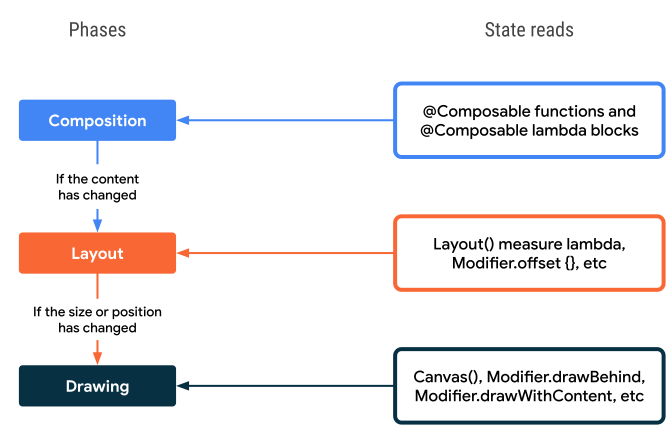

- [段階（フェーズ）](#段階フェーズ)
  - [三つのフェーズ](#三つのフェーズ)
    - [コンポジションフェーズ](#コンポジションフェーズ)
    - [レイアウトフェーズ](#レイアウトフェーズ)
    - [描画フェーズ](#描画フェーズ)
  - [状態の読み取り](#状態の読み取り)
  - [段階的な状態の読み取り](#段階的な状態の読み取り)
    - [コンポジションフェーズでの読み取り](#コンポジションフェーズでの読み取り)
    - [レイアウトフェーズでの読み取り](#レイアウトフェーズでの読み取り)
    - [描画フェーズでの読み取り](#描画フェーズでの読み取り)
  - [状態の読み取りの最適化](#状態の読み取りの最適化)


# 段階（フェーズ）

Android View システムには、測定、レイアウト、描画の 3 つの主要なフェーズがあります。 Compose はよく似ていますが、開始時にコンポジションという重要な追加のフェーズがあります。


## 三つのフェーズ

1. コンポジション
   - コンポジションフェーズでは、UIを構成するコンポーザブル関数が呼び出され、UIのツリー構造が生成されます。このプロセスでは、各コンポーザブル関数が必要に応じて再コンポーズされ、新しいUIツリーが作成されます。
2. レイアウト
   - UI を配置する場所。このフェーズは、測定と配置の 2 段階で構成されます。レイアウト要素は、レイアウト ツリー内の各ノードについて、自身と子要素を 2D 座標で測定して配置します。
3. 描画
   - レンダリングの方法。 UI 要素は、キャンバス（通常はデバイス画面）に描画されます。


このフェーズの順序は基本的に同じで、データはコンポジション、レイアウト、描画へと一方向に移行し、単方向データフローとしてフレームが生成されます。ただし、子のコンポジションが親のレイアウト フェーズに依存している場合、 (例えば BoxWithConstraints , LazyColumn , LazyRow など) は例外です。


### コンポジションフェーズ

コンポジションフェーズでは、 UI ツリーを構築します。この UI ツリーは、後続のフェーズで必要な全ての情報を保持しています。


### レイアウトフェーズ

UI ツリーの各ノードのサイズと配置する場所を決定するフェーズです。


### 描画フェーズ

前のフェーズまでで、表示する内容が確定しているため、それを画面に表示するフェーズです。

UI ツリーをトラバースして、子ノードのサイズを決定してから親ノードのサイズを決定するプロセスを再帰的に行います。場合によっては、親ノードのサイズを先に決定する必要がある場合もあります。


## 状態の読み取り

「状態の読み取り」 には、以下の二種類の方法が存在します。いずれの方法も同じ挙動をします。

```kotlin
// プロパティデリゲートを使用しない方法
val paddingState: MutableState<Dp> = remember { mutableStateOf(8.dp) }
Text(
    text = "Hello",
    modifier = Modifier.padding(paddingState.value)
)
```

```kotlin
// プロパティデリゲートを使用した方法
var padding: Dp by remember { mutableStateOf(8.dp) }
Text(
    text = "Hello",
    modifier = Modifier.padding(padding)
)
```

Compose は、値の変更を追跡するため、状態が変更された場合は、さまざまなフェーズで、コンポーザブルが再起動します。


## 段階的な状態の読み取り

何の状態が変更されたかによって、どのフェーズでその状態が読み取られるかが決定します。読み取りが行われるフェーズは、基本的には、最適化されており、読み取りが行われた後に、前のフェーズに戻ることがないようになっていると思われます。


### コンポジションフェーズでの読み取り

サイズや配置に関する状態の変更は、このフェーズで読み取られます。

```kotlin
var padding by remember { mutableStateOf(8.dp) }
Text(
    text = "Hello",
    // The `padding` state is read in the composition phase
    // when the modifier is constructed.
    // Changes in `padding` will invoke recomposition.
    modifier = Modifier.padding(padding)
)
```


### レイアウトフェーズでの読み取り

レイアウトフェーズで読み取られるものには、 offset などがあります。

```kotlin
var offsetX by remember { mutableStateOf(8.dp) }
Text(
    text = "Hello",
    modifier = Modifier.offset {
        // The `offsetX` state is read in the placement step
        // of the layout phase when the offset is calculated.
        // Changes in `offsetX` restart the layout.
        IntOffset(offsetX.roundToPx(), 0)
    }
)
```


### 描画フェーズでの読み取り

描画フェーズで読み取られるものには、 Canvas() , Modifier.drawBehind , Modifier.drawWithContent などがあります。

```kotlin
var color by remember { mutableStateOf(Color.Red) }
Canvas(modifier = modifier) {
    // The `color` state is read in the drawing phase
    // when the canvas is rendered.
    // Changes in `color` restart the drawing.
    drawRect(color)
}
```




## 状態の読み取りの最適化


