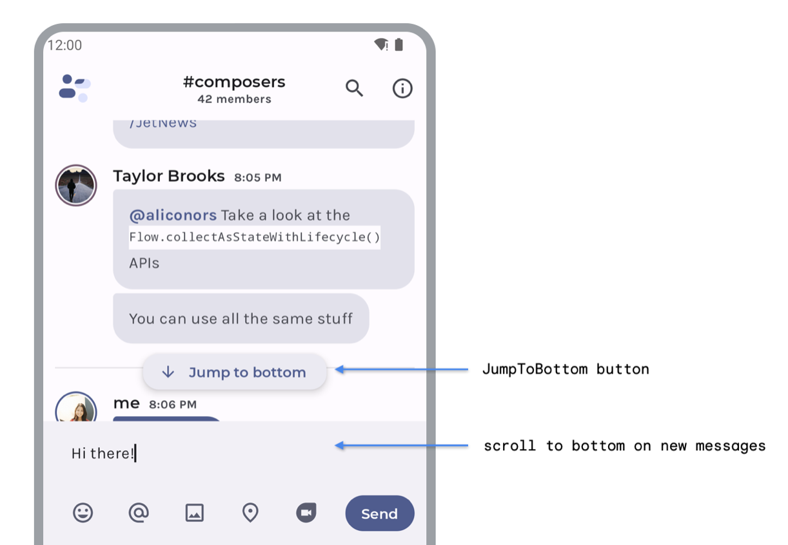
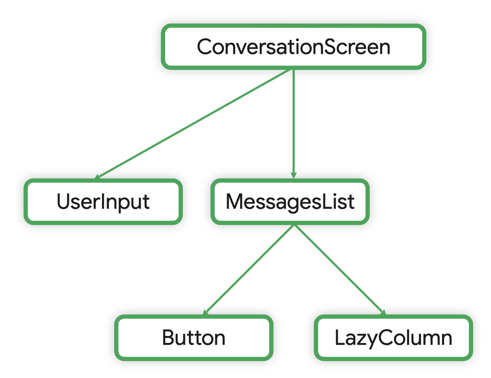
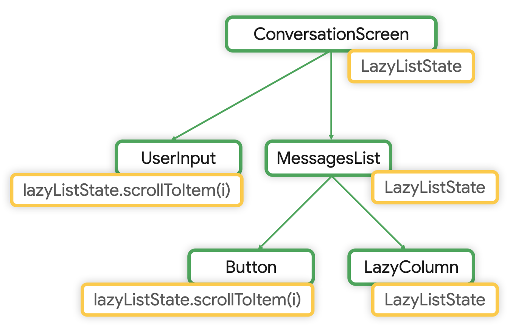
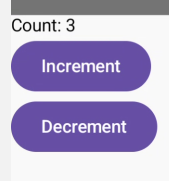
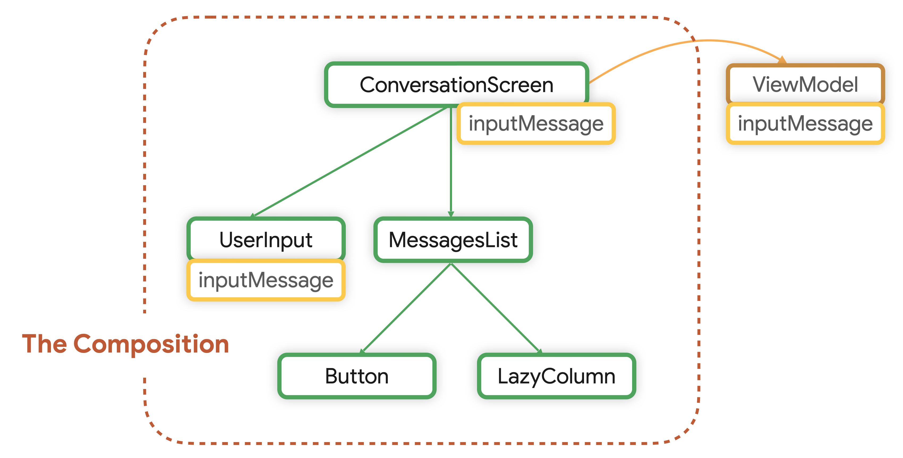

- [状態をホイスティングする場所](#状態をホイスティングする場所)
  - [ベストプラクティス](#ベストプラクティス)
  - [UI 状態の種類と UI ロジック](#ui-状態の種類と-ui-ロジック)
    - [UI 状態](#ui-状態)
    - [ロジック](#ロジック)
  - [UI ロジック](#ui-ロジック)
    - [コンポーザブルで状態を保持する](#コンポーザブルで状態を保持する)
    - [状態ホイスティングが不要なケース](#状態ホイスティングが不要なケース)
    - [状態ホイスティングが効果的なケース](#状態ホイスティングが効果的なケース)
    - [プレーン状態ホルダークラスに UI 要素状態と UI ロジックをデリゲートする](#プレーン状態ホルダークラスに-ui-要素状態と-ui-ロジックをデリゲートする)
  - [ビジネスロジック](#ビジネスロジック)
    - [ViewModel で状態を保持する](#viewmodel-で状態を保持する)
    - [画面 UI 状態](#画面-ui-状態)
    - [プロパティドリルダウン](#プロパティドリルダウン)
    - [UI 要素の状態](#ui-要素の状態)
  - [引用元資料](#引用元資料)


# 状態をホイスティングする場所

Compose アプリケーションでは、 UI の状態をホイスティングする場所は、 「 UI ロジック」 と 「ビジネスロジック」 のどちらがそれを必要としているかによって異なります。このドキュメントでは、この 2 つの主要なシナリオについて説明します。


## ベストプラクティス

ベストプラクティスとしては、 UI の状態を、読み取りと書き込みを行うすべてのコンポーザブル間で **共通の祖先のうち、自分たちに一番近い祖先 (最下位の共通の祖先)** にホイスティングします。 **つまり、使用される場所に最も近い場所に状態を維持します。** 状態のオーナーから、不変の状態とイベントをコンシューマーに公開して状態を変更します。

最下位の共通の祖先が、コンポジションの外部にあることもあります。たとえば、ビジネスロジックが関与するため、 ViewModel で状態をホイスティングする場合です。

このページでは、このベストプラクティスの詳細と注意点について説明します。


## UI 状態の種類と UI ロジック

### UI 状態

- 画面 UI 状態
  - ViewModel で管理される状態 ( StateFlow ) です。最終的には画面にも表示されるため、同時にコンポーザブル関数内でも管理されています。
  - ある画面の全体の状態を示します。
    - 一般的に XxxxScreen などの関数名で定義されるコンポーザブル関数内で管理される XxxxUiState 状態のことを示します。
  - ライフサイクルは、 ViewModel に連動します。
- UI 要素状態
  - ViewModel で管理されておらず、コンポーザブル関数内、もしくは、プレーンな状態クラス内でのみ管理されている状態 ( State ) のことを示します。
    - 間接的に ViewModel で管理されていることもあります。
  - 画面内の特定の要素の状態を示します。
    - XxxxScreen の内部で使用されるような、画面全体の UI よりも小さい単位のコンポーザブル関数を示します。
  - ライフサイクルは、コンポーズに連動します。
    - 間接的に ViewModel で管理されている場合は、 ViewModel に連動します。


### ロジック

- UI ロジック
  - 見た目を変更するだけで、データの変更を伴わないロジック
    - 例えば、アニメーションや表示/非表示の切り替え等
- ビジネスロジック
  - 見た目の変更ではなく、データを加工して保存したり、取得 (表示) するロジック
    - 例えば、サーバーや DB から取得してきて、画面に表示するデータのこと。


## UI ロジック

### コンポーザブルで状態を保持する

状態を保持する場所は 3 箇所あります。

- ViewModel 内
  - データレイヤーへのアクセスが必要な場合
  - ビジネスロジックの実装が必要な場合
  - 状態を保持する方法
    - StateFlow で保持する。
    - State で保持してはいけない。
      - 状態がコンポーザブルのライフサイクルで管理されるため、コンポーザブルよりもライフサイクルの長い ViewModel から参照することによって、メモリリークが発生するため。
    - remember や rememberSaveable を使用する必要はない。そもそも再コンポーズ時に状態が破棄されないため。
- コンポーザブル内
  - ViewModel 内の条件を両方とも必要としない場合
  - かつ
  - UI ロジックが単純な場合
  - 状態を保持する方法
    - State で保持する。
      -  状態がコンポーザブルのライフサイクルで管理されるため、メモリリークを起こす心配がないため。
      -  状態の変更で再コンポーズをトリガーするため。
    - 必要に応じて remember や rememberSaveable を使用する。
      - 再コンポーズ後も状態を保持するため。
- プレーンな状態ホルダークラス内
  - ViewModel 内の条件を両方とも必要としない場合
  - かつ
  - UI ロジックが複雑な場合
  - 状態を保持する方法
    - State で保持する。
      - 状態がコンポーザブルのライフサイクルで管理されるため、メモリリークを起こす心配がないため。
      -  状態の変更で再コンポーズをトリガーするため。
    - 必要に応じて remember や rememberSaveable を使用する。
      - 再コンポーズ後も状態を保持するため。

状態をホイスティングするかどうかは、その状態を複数のコンポーザブルで共有するかどうかによって、決まってきます。

- 共有するならば、ホイスティングする
- 共有しないならば、ホイスティングしない


### 状態ホイスティングが不要なケース

以下のコードは、タップで展開と折りたたみを行うコンポーザブルの実装です。

```kotlin
@Composable
fun ChatBubble(
    message: Message
) {
    // UI 要素状態
    var showDetails by rememberSaveable { mutableStateOf(false) }

    ClickableText(
        text = AnnotatedString(message.content),
        // UI ロジック
        onClick = { showDetails = !showDetails }
    )

    if (showDetails) {
        Text(message.timestamp)
    }
}
```

このケースの場合、 showDetails という状態を ChatBubble コンポーザブルの内部に保有しているため、状態ホイスティングは行っていません。こうすることによって、 showDetails を変更できる唯一の要素は、 ChatBubble コンポーザブルだけとなります。逆に言えば、 ChatBubble の外部のコンポーザブルが、 showDetails を変更できるようにするには、ホイスティングが必要になります。


### 状態ホイスティングが効果的なケース

UI 要素の状態を他のコンポーザブルと共有したい場合には、状態をより上位のコンポーザブルで保持する (状態ホイスティングを行う) と効果的です。

次の例は、 2 つの機能を実装するチャットアプリです。



- 「 Jump to bottom 」 ボタンを押すと、メッセージリストが一番下までスクロールします。このボタンは、リスト状態に対して UI ロジックを実行します。
- ユーザーが 「 send 」 ボタンでメッセージを送信すると、 MessagesList リストが一番下までスクロールします。 UserInput (メッセージを入力したり送信するボタンのエリア) は、リスト状態に対して UI ロジックを実行します。

このアプリのコンポーザブルツリーは以下の通りです。



LazyColumn のリスト状態を ConversationScreen にホイスティングすると、 ConversationScreen より下の階層で、リスト状態を参照できるようになります。



コードは一部抜粋ですが、以下のようになります。

```kotlin
@Composable
private fun ConversationScreen(/*...*/) {
    val scope = rememberCoroutineScope()

    // ConversationScreen にホイスティングされた状態
    val lazyListState = rememberLazyListState()

    // 同じ状態を使いまわす
    MessagesList(messages, lazyListState)

    UserInput(
        onMessageSent = {
            scope.launch {
                // lazyListState に対する UI ロジックの実行
                lazyListState.scrollToItem(0)
            }
        },
    )
}

@Composable
private fun MessagesList(
    messages: List<Message>,
    lazyListState: LazyListState = rememberLazyListState() // LazyListState has a default value
) {

    LazyColumn(
        // ホイスティングされた状態を LazyColumn に渡す
        state = lazyListState
    ) {
        items(messages, key = { message -> message.id }) { item ->
            Message(/*...*/)
        }
    }

    val scope = rememberCoroutineScope()

    JumpToBottom(onClicked = {
        scope.launch {
            // lazyListState に対する UI ロジックの実行
            lazyListState.scrollToItem(0)
        }
    })
}
```


### プレーン状態ホルダークラスに UI 要素状態と UI ロジックをデリゲートする

Composable な関数ではないプレーンな関数に対して、 UI 状態や UI ロジックをホイスティングする場合もあります。これは、コンポーザブル関数が肥大化するのを防ぐ効果があります。

```kotlin
@Composable
fun Counter() {
    val counterState = remember { CounterState() }

    Column {
        Text(text = "Count: ${counterState.count}")
        // インクリメント用のボタン
        Button(onClick = { counterState.increment() }) {
            Text("Increment")
        }
        // デクリメント用のボタン
        Button(onClick = { counterState.decrement() }) {
            Text("Decrement")
        }
    }
}

// 状態を保持し、その状態を更新する関数も公開すると、
// コードがより簡潔に記述できます。
class CounterState {
    // UI 状態
    var count by mutableStateOf(0)

    // UI ロジック
    fun increment() {
        count++
    }

    // UI ロジック
    fun decrement() {
        count--
    }
}
```




## ビジネスロジック

### ViewModel で状態を保持する

画面に表示するアプリデータを準備するのに、ビジネスロジックへのアクセスが必要であったり、データレイヤーへアクセスする必要がある場合は、 ViewModel で状態を保持するのが適しています。

ViewModel はコンポジションのライフサイクルとは連動していません。アクティビティ、フラグメント、ナビゲーショングラフ、あるいはナビゲーショングラフの宛先である ViewModelStoreOwner のライフサイクルに連動します。そのため、 ViewModel で UI の状態をホイスティングする場合、コンポジションの外部で保持されます。




### 画面 UI 状態

ビジネスロジックを実行することによって生成される 「画面 UI 状態 (アプリデータ) 」 は、通常、画面回転などの構成変更後も保持されることが想定されます。そのため、多くの場合、 ViewModel にホイスティングすることが適切なホイスティングになります。

```kotlin
class ConversationViewModel(
    channelId: String,
    messagesRepository: MessagesRepository
) : ViewModel() {

    val messages = messagesRepository
        .getLatestMessages(channelId)
        .stateIn(
            scope = viewModelScope,
            started = SharingStarted.WhileSubscribed(5_000),
            initialValue = emptyList()
        )

    // Business logic
    fun sendMessage(message: Message) { /* ... */ }
}

@Composable
private fun ConversationScreen(
    conversationViewModel: ConversationViewModel = viewModel()
) {

    val messages by conversationViewModel.messages.collectAsStateWithLifecycle()

    ConversationScreen(
        messages = messages,
        onSendMessage = { message: Message -> conversationViewModel.sendMessage(message) }
    )
}

@Composable
private fun ConversationScreen(
    messages: List<Message>,
    onSendMessage: (Message) -> Unit
) {

    MessagesList(messages, onSendMessage)
    /* ... */
}
```

画面 UI 状態には、以下の 2 種類の状態ホルダーを含めることができます。

- ViewModel
- プレーンな状態ホルダークラス


### プロパティドリルダウン

プロパティドリルダウンは、特定のデータを最終的に読み取るコンポーネントに渡すために、そのデータをネストされた複数の子コンポーネントを介して伝播させることを意味します。これは、通常、データの持続性とスコープ管理を考慮して行われます。

```kotlin
@Composable
fun ParentComponent(data: String) {
    ChildComponent1(data)
}

@Composable
fun ChildComponent1(data: String) {
    ChildComponent2(data)
}

@Composable
fun ChildComponent2(data: String) {
    Text(text = data)
}
```

この例では、 ParentComponent が data という文字列を受け取り、その data を ChildComponent1 に渡します。 ChildComponent1 はさらにその data を ChildComponent2 に渡し、最終的に ChildComponent2 が Text コンポーネントでその data を表示します。

このように、データが親コンポーネントから子コンポーネントへと次々に渡される過程が「プロパティドリルダウン」です。

プロパティドリルダウンが必要とされる理由は以下の通りです。

- データの一貫性
  - データが一箇所で管理され、そのデータが必要なコンポーネントにのみ渡されるため、データの一貫性が保たれます。
- 再利用性
  - 各コンポーネントは独立しているため、再利用が容易です。同じデータを異なるコンポーネント間で共有できます。
- テストの容易さ
  - 各コンポーネントが独立してデータを受け渡すため、テストがしやすくなります。
- UIの分離
  - データロジックとUIが分離されているため、UIの変更がデータロジックに影響を与えずに行えます。

Jetpack Compose では、 remember や State といった状態管理のためのツールも提供されていますが、プロパティドリルダウンは、それらと組み合わせて使われることが多いです。

```kotlin
@Composable
fun ParentComponent() {
    var data by remember { mutableStateOf("Hello, Jetpack Compose!") }
    ChildComponent1(data)
}

@Composable
fun ChildComponent1(data: String) {
    ChildComponent2(data)
}

@Composable
fun ChildComponent2(data: String) {
    Text(text = data)
}
```

このようにすることで、 ParentComponent が管理するデータが変更されるたびに、それが子コンポーネントに伝播され、 UI が更新されます。


### UI 要素の状態

読み取りや書き込みが必要なビジネスロジックがある場合は、 UI 要素の状態を画面レベルの状態ホルダーにホイスティングできます。つまり、 ViewModel やプレーンな状態ホルダークラスに保持することができます。


## 引用元資料

- [状態をホイスティングする場所](https://developer.android.com/develop/ui/compose/state-hoisting?hl=ja&_gl=1*1nx6vfy*_up*MQ..*_ga*MTIzMTgzMzc2Ni4xNzI4NTM2OTA0*_ga_6HH9YJMN9M*MTcyODUzNjkwNC4xLjAuMTcyODUzNjkwNC4wLjAuMTQ2MDc1MDk0)


