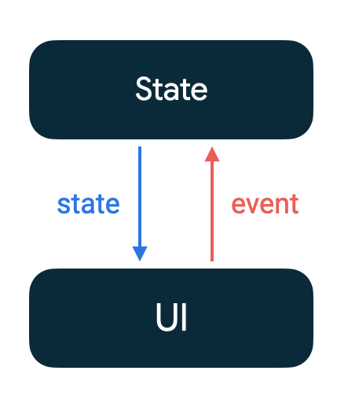

- [アーキテクチャ](#アーキテクチャ)


# Compose UI を設計する

Compose では UI は不変です。 UI を描画した後で更新する手段はありません。変更できるのは UI の状態のみです。 UI の状態が変化するたびに、 Compose は UI ツリーの変化した部分を再作成します。

コンポーザブルは、状態を受け取り、その状態を処理できるイベントリスナーを公開します。たとえば、 TextField は値を受け取って、コールバック ハンドラに値の変更をリクエストするコールバック onValueChange を公開します。

```kotlin
var name by remember { mutableStateOf("") }
OutlinedTextField(
    value = name,
    onValueChange = { name = it },
    label = { Text("Name") }
)
```

コンポーザブルは状態を受け取ってイベントリスナーを公開するので、 Jetpack Compose は、単方向データフローパターンに適しています。このガイドでは、 Compose で単方向データフローパターンを実装する方法、イベントリスナーと状態ホルダーを実装する方法、 Compose で ViewModel を操作する方法を説明します。


## 単方向データフロー（UDF）

単方向データフロー ( Unidirectional Data Flow ) は、状態が下方に流れ、イベントが上方に流れる設計パターンです。 State は、 UI 自身になることもありますが、 ViewModel など他のコンポーネントになることもあります。



単方向データフローに従うことで、 UI に状態を表示するコンポーザブルを、アプリ内で状態を保存および変更する部分から分離できます。

単方向データフローを使用するアプリの UI 更新ループは、次のようになります。

- イベント
  - 各種イベントを検出します。
- 状態の更新
  - イベントハンドラが状態を変更します。
- 状態の表示
  - 状態ホルダーが状態を下方に渡し、 UI が状態を表示します。

Jetpack Compose を使用する際にこのパターンに従うと、次のような利点があります。

- テストの容易性
  - 状態を表示する UI から状態を分離することで、両者を切り離して簡単にテストできます。
- 状態のカプセル化
  - 状態が 1 か所でのみ更新され、コンポーザブルの状態に関して信頼できる情報源が 1 つだけになるため、状態の不整合によるバグが生じる可能性が低くなります。
- UI の整合性
  - StateFlow や LiveData などのオブザーバブルな状態ホルダーを使用すると、すべての状態の更新が UI に即座に反映されます。


### Jetpack Compose の単方向データフロー

Compose ライブラリ (ランタイム) は、 `State` オブジェクトの値が変化すると、コンポジションの再コンポーズをトリガーします。値を記憶する期間に応じて、 `remember { mutableStateOf(value) }` または `rememberSaveable { mutableStateOf(value) }` で状態を保持できます。


### コンポーザブルのパラメータを定義する

コンポーザブルの状態パラメータを定義する際は、次の点に注意してください。

- コンポーザブルはどの程度再利用可能か（柔軟性があるか）
- 状態パラメータがコンポーザブルのパフォーマンスにどのように影響するか
  - 必要なパラメータのみを渡してください。不要なパラメータを渡すと必要以上に再コンポーズが発生してしまいます。

受け渡すパラメータの数は慎重に検討してください。関数に渡すパラメータが多すぎると可読性が低下するため、その場合はパラメータを 1 つのクラスにまとめることをおすすめします。


## Compose 内のイベント

特に重要な記載がないため、省略。


### ViewModel、状態、イベントの例

ViewModel で State 型のプロパティを定義して使用するには、以下のように実装します。

```kotlin
class MyViewModel : ViewModel() {
    private val _uiState = mutableStateOf<UiState>(UiState.SignedOut)
    val uiState: State<UiState>
        get() = _uiState

    // ...
}
```

LiveData を State に変換して、コンポーザブルで監視するには、以下のようにします。

```kotlin
class MyViewModel : ViewModel() {
    private val _uiState = MutableLiveData<UiState>(UiState.SignedOut)
    // UiState クラスは独自定義のクラスです。
    val uiState: LiveData<UiState>
        get() = _uiState

    // ...
}

@Composable
fun MyComposable(viewModel: MyViewModel) {
    val uiState = viewModel.uiState.observeAsState()
    // ...
}
```


