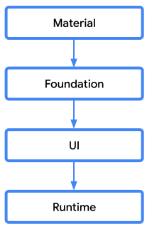

- [アーキテクチャのレイヤリング](#アーキテクチャのレイヤリング)
  - [レイヤ](#レイヤ)
    - [Runtime](#runtime)
    - [UI](#ui)
    - [Foundation](#foundation)
    - [Material](#material)
  - [デザインの原則](#デザインの原則)
    - [制御](#制御)
    - [カスタマイズ](#カスタマイズ)
    - [適切な抽象化の選択](#適切な抽象化の選択)
    - [さらに学習する](#さらに学習する)


# アーキテクチャのレイヤリング

このページでは、Jetpack Compose を構成するアーキテクチャ レイヤーの概要と、この設計の基盤となるコア原則について説明します。

Jetpack Compose は単一のモノリシック プロジェクトではありません。複数のモジュールが組み合わさって完全なスタックを形成します。Jetpack Compose を構成するさまざまなモジュールを理解することで、次のことが可能になります。

- 適切なレベルの抽象化を使用してアプリまたはライブラリを構築する
- より高度な制御やカスタマイズのために、いつ下位レベルに「ドロップ ダウン」できるかを理解する
- 依存関係を最小限に抑える


## レイヤ

Jetpack Compose の主要なレイヤは次のとおりです。



各レイヤーは下位レベルの上に構築され、機能を組み合わせて上位レベルのコンポーネントを作成します。各レイヤーは下位レイヤーのパブリック API に基づいて構築され、モジュールの境界を検証し、必要に応じて任意のレイヤーを置き換えることができます。これらのレイヤーを下から順に調べていきましょう。


### [Runtime](https://developer.android.com/reference/kotlin/androidx/compose/runtime/package-summary?_gl=1*s9gn9y*_up*MQ..*_ga*MjA3NTExNzk4Ny4xNzI3MTczOTI5*_ga_6HH9YJMN9M*MTcyNzIyNTE2NC40LjAuMTcyNzIyNTE2NC4wLjAuMjEwODk1NjY5MQ..)

このモジュールは、remember、mutableStateOf、@Composable アノテーション、SideEffect など、Compose ランタイムの基礎を提供します。Compose のツリー管理機能のみが必要で、UI は必要ない場合は、このレイヤーの上に直接構築することを検討してください。


### [UI](https://developer.android.com/reference/kotlin/androidx/compose/ui/package-summary?_gl=1*arikrb*_up*MQ..*_ga*MjA3NTExNzk4Ny4xNzI3MTczOTI5*_ga_6HH9YJMN9M*MTcyNzIyNTE2NC40LjAuMTcyNzIyNTE2NC4wLjAuMjEwODk1NjY5MQ..)

UI レイヤーは、複数のモジュール (ui-text、ui-graphics、ui-tooling など) で構成されています。これらのモジュールは、LayoutNode、Modifier、入力ハンドラー、カスタム レイアウト、描画など、UI ツールキットの基礎を実装します。UI ツールキットの基本的な概念のみが必要な場合は、このレイヤーの上に構築することを検討してください。


### [Foundation](https://developer.android.com/reference/kotlin/androidx/compose/foundation/package-summary?_gl=1*1r8y4b8*_up*MQ..*_ga*MjA3NTExNzk4Ny4xNzI3MTczOTI5*_ga_6HH9YJMN9M*MTcyNzIyNTE2NC40LjAuMTcyNzIyNTE2NC4wLjAuMjEwODk1NjY5MQ..)

このモジュールは、 Row と Column、LazyColumn、特定のジェスチャの認識など、Compose UI のデザイン システムに依存しないビルディング ブロックを提供します。基盤レイヤー上に構築して、独自のデザイン システムを作成することを検討してください。


### [Material](https://developer.android.com/reference/kotlin/androidx/compose/material/package-summary?_gl=1*18n3ndh*_up*MQ..*_ga*MjA3NTExNzk4Ny4xNzI3MTczOTI5*_ga_6HH9YJMN9M*MTcyNzIyNTE2NC40LjAuMTcyNzIyNTE2NC4wLjAuMjEwODk1NjY5MQ..)

このモジュールは、Compose UI 用のマテリアル デザイン システムの実装を提供し、テーマ システム、スタイル設定されたコンポーネント、リップル表示、アイコンを提供します。アプリでマテリアル デザインを使用する場合は、このレイヤー上に構築します。


## デザインの原則

Jetpack Compose の基本原則は、いくつかのモノリシックなコンポーネントではなく、一緒に組み立て (または構成) できる、小さくて焦点を絞った機能を提供することです。このアプローチには、多くの利点があります。


### 制御

上位レベルの API は、少しの実装でたくさんの動作が実現可能ですが、逆にカスタマイズ性に劣り、実現できないこともあります。一方で、下位レベルの API は、実装に少し時間がかかりますが、その分、カスタマイズ性に優れています。

例えば、アニメーションの実装において、 `animateColorAsState` は、上位レベルの API で、 `Animatable` は、下位レベルの API です。


### カスタマイズ

コンポーザブル関数を組み合わせることによって、複雑なコンポーザブルを作成することが可能です。例えば、マテリアルデザインの Button は、以下の要素で構成されています。

```kotlin
@Composable
fun Button(
    // …
    content: @Composable RowScope.() -> Unit
) {
    Surface(/* … */) {
        CompositionLocalProvider(/* … */) { // set LocalContentAlpha
            ProvideTextStyle(MaterialTheme.typography.button) {
                Row(
                    // …
                    content = content
                )
            }
        }
    }
}
```

ボタンは 4 つのコンポーネントから構成されます:

1. 背景、形状、クリック処理などを提供するマテリアル サーフェス

2. ボタンが有効または無効になったときにコンテンツのアルファを変更する CompositionLocalProvider

3. 使用するデフォルトのテキスト スタイルを設定する ProvideTextStyle

4. ボタンのコンテンツのデフォルトのレイアウト ポリシーを提供する Row

構造を明確にするために一部のパラメーターとコメントを省略しましたが、コンポーネント全体は、これらの 4 つのコンポーネントを単に組み立ててボタンを実装するだけなので、コードが約 40 行しかありません。Button などのコンポーネントは、公開するパラメーターについて独自の考えを持っており、一般的なカスタマイズを可能にすることと、コンポーネントを使いにくくする可能性のあるパラメーターの急増とのバランスをとっています。たとえば、マテリアル コンポーネントは、マテリアル デザイン システムで指定されたカスタマイズを提供するため、マテリアル デザインの原則に簡単に従うことができます。

ただし、コンポーネントのパラメーターを超えてカスタマイズを行う場合は、レベルを「下げて」コンポーネントを分岐することができます。たとえば、マテリアル デザインでは、ボタンの背景は単色にする必要があります。グラデーションの背景が必要な場合、このオプションはボタン パラメーターではサポートされていません。この場合、Material Button の実装を参照として使用し、独自のコンポーネントを構築できます。

```kotlin
@Composable
fun GradientButton(
    // …
    background: List<Color>,
    modifier: Modifier = Modifier,
    content: @Composable RowScope.() -> Unit
) {
    Row(
        // …
        modifier = modifier
            .clickable(onClick = {})
            .background(
                Brush.horizontalGradient(background)
            )
    ) {
        CompositionLocalProvider(/* … */) { // set material LocalContentAlpha
            ProvideTextStyle(MaterialTheme.typography.button) {
                content()
            }
        }
    }
}
```

上記の実装では、マテリアルの現在のコンテンツ アルファや現在のテキスト スタイルの概念など、マテリアル レイヤーのコンポーネントを引き続き使用します。ただし、マテリアル サーフェスを Row に置き換え、目的の外観を実現するためにスタイルを設定します。

注意: コンポーネントをカスタマイズするために下位レイヤーにドロップ ダウンする場合、アクセシビリティ サポートを無視するなど、機能が低下しないようにしてください。フォークするコンポーネントをガイドとして使用します。

マテリアルの概念をまったく使用しない場合 (独自のカスタム デザイン システムを構築する場合など) は、 Foundation レイヤー コンポーネントのみを使用するようにドロップ ダウンできます。

```kotlin
@Composable
fun BespokeButton(
    // …
    backgroundColor: Color,
    modifier: Modifier = Modifier,
    content: @Composable RowScope.() -> Unit
) {
    Row(
        // …
        modifier = modifier
            .clickable(onClick = {})
            .background(backgroundColor)
    ) {
        // No Material components used
        content()
    }
}
```

Jetpack Compose は、最上位レベルのコンポーネントに最もシンプルな名前を予約します。たとえば、androidx.compose.material.Text は androidx.compose.foundation.text.BasicText に基づいて構築されます。これにより、上位レベルを置き換える場合に、最も見つけやすい名前で独自の実装を提供できるようになります。

注意: コンポーネントをフォークすると、上流コンポーネントからの将来の追加やバグ修正の恩恵を受けられなくなります。


### 適切な抽象化の選択

なるべく、多重に階層化された高度なコンポーザブル関数で UI を構築するようにしましょう。そうすることで、画面ごとに UI の統一が図れたり、最適化された部品を再利用することで、全ての画面でベストプラクティスに従った画面にすることが可能です。

階層化された再利用可能なコンポーネントを構築するという Compose の哲学は、必ずしも下位レベルのビルディング ブロック ( API ) に手を伸ばすべきではないことを意味します。上位レベルのコンポーネントの多くは、より多くの機能を提供するだけでなく、アクセシビリティのサポートなどのベスト プラクティスを実装していることもよくあります。

たとえば、カスタム コンポーネントにジェスチャ サポートを追加したい場合、Modifier.pointerInput を使用してこれを最初から構築できますが、これに基づいて構築された他の上位レベルのコンポーネントの方が、より良い出発点となる可能性があります (Modifier.draggable、Modifier.scrollable、Modifier.swipeable など)。

原則として、ベスト プラクティスの恩恵を受けるには、必要な機能を提供する最上位レベルのコンポーネントに基づいて構築することをお勧めします。


### さらに学習する

カスタム デザイン システムの構築例については、 [Jetsnack サンプル](https://github.com/android/compose-samples/tree/main/Jetsnack) を参照してください。


