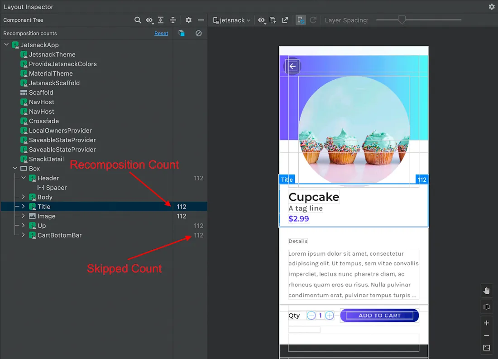

- [Jetpack Compose の安定性について](#jetpack-compose-の安定性について)
  - [要約](#要約)
  - [再コンポジションとは何ですか？](#再コンポジションとは何ですか)
  - [不変オブジェクトの使用](#不変オブジェクトの使用)
  - [可変オブジェクトの使用](#可変オブジェクトの使用)
  - [Compose コンパイラーでの実装](#compose-コンパイラーでの実装)
  - [安定性をデバッグして確認する](#安定性をデバッグして確認する)
  - [Compose コンパイラレポート](#compose-コンパイラレポート)
- [TODO : 続きはまた時間のある時に読んでまとめよう。](#todo--続きはまた時間のある時に読んでまとめよう)
  - [引用元資料](#引用元資料)


# Jetpack Compose の安定性について

コンポーザブルのパフォーマンスを測定して、予想以上に多くのコードが再コンポーズされていることに気づいたことはありませんか? 「Compose は、状態が変化していない場合にコンポーザブルをインテリジェントにスキップするものだと思っていたのですが?」と疑問に思うかもしれません。あるいは、Compose コードを読んでいるときに、 [@Stable](https://developer.android.com/reference/kotlin/androidx/compose/runtime/Stable) または [@Immutable](https://developer.android.com/reference/kotlin/androidx/compose/runtime/Immutable) でアノテーションされたクラスを見て、それが何を意味するのか疑問に思うかもしれません。これらの概念は、Compose の安定性によって説明できます。このブログ投稿では、Compose の安定性が実際に何を意味するのか、それをデバッグする方法、そしてそれを心配する必要があるのか​​どうかについて説明します。


## 要約

これは大きな投稿です! これが要約です。

- Compose は、コンポーザブルの各パラメーターの安定性を判定して、再コンポーズ中にスキップできるかどうかを判断します。

- コンポーザブルがスキップされず、 **パフォーマンスの問題を引き起こしている** ことに気付いた場合は、まず、不安定であることが明らかな部分 ( `var` パラメーターなど) を確認する必要があります。

- コンパイラ レポートを使用して、クラスについてどのような安定性が推測されているかを判断できます。

- List、Set、Map などのコレクション クラスは、不変であることが保証されていないため、常に不安定と判断されます。代わりに [Kotlinx の不変コレクション](https://github.com/Kotlin/kotlinx.collections.immutable) を使用するか、クラスに @Immutable または @Stable の注釈を付けることができます。

- Compose コンパイラが実行されていないモジュールのクラスは、常に不安定と判断されます。Compose ランタイムへの依存関係を追加し、モジュール内で安定としてマークするか、必要に応じてクラスを UI モデル クラスでラップします。

- すべての Composable をスキップ可能にする必要がありますか? いいえ。


## 再コンポジションとは何ですか？

安定性について説明する前に、再コンポジションの [定義](https://developer.android.com/jetpack/compose/mental-model#recomposition) を簡単に振り返ってみましょう。

```
再コンポジションとは、入力が変更されたときにコンポーザブル関数を再度呼び出すプロセスです。
これは、関数の入力が変更されたときに発生します。
Compose が新しい入力に基づいて再コンポジションする場合、
変更された可能性のある関数またはラムダのみが呼び出され、残りはスキップされます。
パラメータが変更されていないすべての関数、または、ラムダをスキップすることで、
Compose は効率的に再コンポジションできます。
```

ここで **「変更された可能性のある」** というキーワードに注意してください。Compose は、スナップショットの状態が変更されたときに、再コンポジションをトリガーし、変更されていないコンポーザブルをスキップします。ただし **重要なのは、コンポーザブルがスキップされるのは、コンポーザブルのパラメータが更新されていないことを Compose が確信できる場合のみであるということです。** そうでない場合、 **Compose が確信できない場合は、親コンポーザブルが再コンポーズされるときに常に再コンポーズされます。** Compose がこれを行わないと、再コンポジションがトリガーされないバグの診断が非常に難しくなります。少し速いけど正常に動作しない可能性があるより、パフォーマンスが少し落ちても正常に動作する方が、はるかに良いです。

連絡先の詳細を表示する `Row` を例にあげて、次のセクションから、このサンプルについて、詳しく見ていきましょう。

```kotlin
fun ContactRow(contact: Contact, modifier: Modifier = Modifier) {
    var selected by remember { mutableStateOf(false) }
    Row(modifier) {
        ContactDetails(contact)
        ToggleButton(selected, onToggled = { selected = !selected })
    }
}
```


## 不変オブジェクトの使用

まず、Contact クラスを不変 ( immutable ) データクラスとして定義し、新しいオブジェクトを作成しない限り変更できないとします。

```kotlin
// プロパティが val なので immutable となります。
data class Contact(val name: String, val number: String)
```

トグル ボタンがクリックされると、選択状態が変更されます。これにより、Compose がトリガーされ、ContactRow 内のコードを再コンポーズする必要があるかどうかが評価されます。ContactDetails コンポーザブルに関しては、Compose は再コンポーズをスキップします。これは、パラメーター (この場合は連絡先) が変更されていないことが確認できるためです。一方、ToggleButton は入力が変更されているため、正しく再コンポーズされます。


## 可変オブジェクトの使用

Contact クラスが次のように定義されている場合はどうなるでしょうか。

```kotlin
data class Contact(var name: String, var number: String)
```

これで、Contact クラスは不変ではなくなり、Compose が認識しないままプロパティが変更される可能性があります。このクラスは **「不安定」** と見なされるようになったため、Compose は ContactDetails コンポーザブルをスキップしなくなりました (この意味については以下で詳しく説明します)。そのため、selected が変更されるたびに、ContactRow も再コンポーズされます。


## Compose コンパイラーでの実装

これで、Compose が何を定義しようとしているかの理論がわかりました。では、実際にそれがどのように行われるかを見てみましょう。

まず、Compose ドキュメント ( [1](https://github.com/androidx/androidx/blob/androidx-main/compose/compiler/design/compiler-metrics.md#functions-that-are-restartable-but-not-skippable) , [2](https://github.com/androidx/androidx/blob/androidx-main/compose/docs/compose-api-guidelines.md#stable-types) ) の定義をいくつか紹介します。

関数はスキップ可能、または、再開可能です。

- **スキップ可能** — 関数が再コンポジション中に呼び出された場合、すべてのパラメーターが以前の値と等しい場合、Compose は関数をスキップできます。

- **再開可能** — 関数は、再コンポジションを開始できる「スコープ」として機能します (言い換えると、この関数は、状態の変化後に、 Compose が、再コンポジションによるコードの再実行を開始できる、エントリ ポイントとして使用できます)。

型は不変、または、安定です。

- **不変 ( Immutble )** — オブジェクトが構築された後に、プロパティの値が変わることがなく、かつ、すべてのメソッドが参照透過である型を示します。すべてのプリミティブ型 (String、Int、Float など) は不変と見なされます。

- **安定 ( Stable )** — 可変 ( Mutable ) 型を示しますが、パブリック プロパティ、または、メソッドの動作が以前の呼び出しとは、異なる結果をもたらす場合は、 Compose ランタイムに通知されます。 (状態は変わる可能性があるが、変わった場合はきちんとそれを通知してくれる型のこと)

コードで Compose コンパイラーが実行されると、すべての関数と型が調べられ、これらの定義に一致するものにタグが付けられます。Compose は、コンポーザブルに渡される型を調べて、そのコンポーザブルのスキップ可能性を判断します。

パラメーターは不変である必要はなく、Compose ランタイムにすべての変更が通知される限り、可変であってもかまわないことに注意してください。

ほとんどの型では、これは遵守するのが非現実的な契約ですが、Compose は、 [MutableState](https://developer.android.com/reference/kotlin/androidx/compose/runtime/MutableState) 、 [SnapshotStateMap](https://developer.android.com/reference/kotlin/androidx/compose/runtime/snapshots/SnapshotStateMap) / [List](https://kotlinlang.org/api/latest/jvm/stdlib/kotlin.collections/-list/) など、この契約を遵守する可変クラスを提供します。その結果、これらの型を可変プロパティに使用すると、クラスは @Stable の契約を遵守できます。実際には、次のようになります。 ( SnapshotStateMap については [こちら](../2.UIアーキテクチャ/4.状態の管理/状態の生成方法.md/#mutablestatemapof-関数) も参考にしてください。)

```kotlin
@Stable
class MyStateHolder {
    var isLoading by mutableStateOf(false)
}
```

Compose の状態が変化すると、Compose は、状態オブジェクトが読み込まれるツリーのすべてのポイントの上で、最も近い再開可能な関数を探します。理想的には、これは可能な限り最小のコードを再実行するための直接の祖先になります。そこから、再コンポジションが再開されます。コードを再実行すると、パラメータが変更されていない場合は、スキップ可能な関数はスキップされます。先ほどの例をもう一度見てみましょう。

```kotlin
data class Contact(val name: String, val number: String)

fun ContactRow(contact: Contact, modifier: Modifier = Modifier) {
    var selected by remember { mutableStateOf(false) }
    Row(modifier) {
        ContactDetails(contact)
        ToggleButton(selected, onToggled = { selected = !selected })
    }
}
```

ここで、 `selected` が変更されると、実際に状態が読み取られる場所に最も近い 「再開可能な」 関数 / コンポジション スコープは ContactRow です。 Row が最も近い再開可能なスコープとして選択されないのはなぜかと疑問に思うかもしれません。 Row (および Column や Box などの他の多くの foundation コンポーザブル) は [inline 関数](../../../../../../../Kotlin/関数/インライン関数.md) であり、 **インライン関数は、コンパイル後に関数にならないため、スコープが存在せず、再開可能な関数とは見なされません。)** そのため、ContactRow は次に高いスコープであり、ContactRow が再実行されます。

最初に認識されるコンポーザブルは Row です。すでに説明したように、これは、コンパイル後には、関数ではなくなります。つまり、スキップできず、再コンポジション時に常に再実行されます。

次のコンポーザブルは ContactDetails です。Contact クラスは不変であると推論されているため、ContactDetails はスキップ可能としてタグ付けされています。そのため、Compose コンパイラによって追加された生成コードは、コンポーザブル パラメーターのいずれかが変更されていないかどうかを確認します。 contact オブジェクトは以前と同じであるため、ContactDetails はスキップされます。

次は ToggleButton です。 ToggleButton はスキップ可能ですが、この場合はスキップされません。パラメータの 1 つである selected が変更されたため、再実行されます。これで、再開可能な関数 / スコープが終了し、再コンポジションが終了します。


この時点で、 **「これは本当に複雑だ！なぜこれを知る必要があるのか​​？」とお考えかもしれません。答えは、ほとんどの場合、知る必要はないということです。** 私たちの **目標は、自然に記述したコードをコンパイラが最適化して効率化すること** です。コンポーザブル関数のスキップは、それを実現するために重要な要素ですが、100% 安全でなければバグの診断が非常に難しくなります。このため、関数をスキップするための要件は厳格です。私たちはコンパイラのスキップ可能性の推論を改善するために取り組んでいますが、コンパイラが解決できない状況は常に存在します。このような状況で、 **関数のスキップが内部でどのように機能するかを理解することは、** パフォーマンスの向上に役立ちますが、 **安定性が原因で測定されたパフォーマンスの問題がある場合にのみ検討する必要があります。** コンポーザブルが軽量であるか、それ自体がスキップ可能なコンポーザブルのみを含む場合、コンポーザブルがスキップ可能でなくてもまったく影響がない可能性があります。


## 安定性をデバッグして確認する

コンポーザブルがスキップされているかどうかは、どうすればわかりますか? レイアウト インスペクターで確認できます。Android Studio Dolphin にはレイアウト インスペクターでの Compose のサポートが含まれており、コンポーザブルが再構成されスキップされた回数も表示されます。



では、パラメータが変更されていないにもかかわらず、再コンポーズ実行されていることがわかった場合はどうすればよいでしょうか。

最も簡単な方法は、その定義をチェックして、パラメータのいずれかが明らかに変更可能であるかどうかを確認することです。 var プロパティを持つ型を渡していますか？それとも val プロパティだけど既知の不安定な型を渡していますか？そうであれば、その composable は決してスキップされません。

それでも間違っている点が見つからない場合はどうすればよいでしょうか。


## Compose コンパイラレポート

Compose コンパイラは、検査用に安定性推論の結果を出力できます。この出力を使用して、どのコンポーザブルがスキップ可能で、どのコンポーザブルがスキップ不可能かを判断できます。この投稿では、これらのレポートの使用方法をまとめていますが、これらのレポートの詳細については、 [技術ドキュメント](https://github.com/androidx/androidx/blob/androidx-main/compose/compiler/design/compiler-metrics.md) を参照してください。

⚠️ 警告: この手法は、安定性に関連するパフォーマンスの問題が発生している場合にのみ使用してください。UI 全体をスキップ可能にしようとすると、時期尚早な最適化となり、将来的にメンテナンスが困難になる可能性があります。安定性を最適化する前に、 [Compose のパフォーマンスに関するベストプラクティス](https://developer.android.com/develop/ui/compose/performance) に従っていることを確認してください。

コンパイラ レポートはデフォルトでは有効になっていません。コンパイラ フラグによって有効になります。正確な設定はプロジェクトによって異なりますが、ほとんどのプロジェクトでは、次のスクリプトをルート build.gradle ファイルに貼り付けることができます。


# TODO : 続きはまた時間のある時に読んでまとめよう。


## 引用元資料

[Jetpack Compose Stability Explained](https://medium.com/androiddevelopers/jetpack-compose-stability-explained-79c10db270c8)
