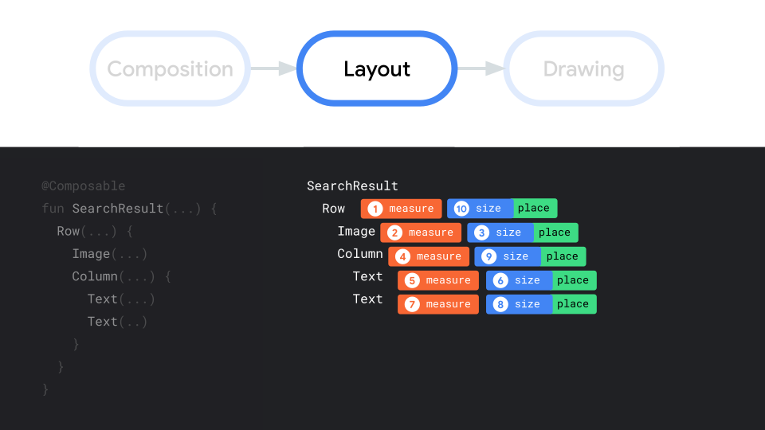
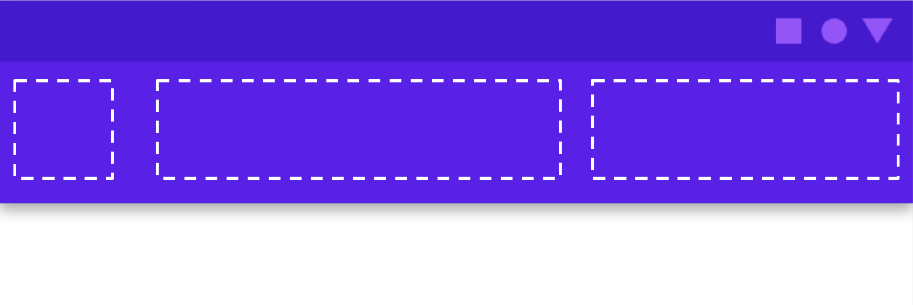

- [レイアウトの基本](#レイアウトの基本)
  - [コンポーズ可能な関数の基本](#コンポーズ可能な関数の基本)
  - [標準レイアウトコンポーネント](#標準レイアウトコンポーネント)
  - [レイアウトモデル（サイズと配置の決定順序）](#レイアウトモデルサイズと配置の決定順序)
  - [レイアウトでの修飾子の使用](#レイアウトでの修飾子の使用)
  - [レスポンシブレイアウト](#レスポンシブレイアウト)
    - [制約](#制約)
  - [スロットベースのレイアウト](#スロットベースのレイアウト)


# レイアウトの基本

## コンポーズ可能な関数の基本

コンポーズ可能な関数とは、 UI の一部を記述し、 Unit を出力する関数のことです。


## 標準レイアウトコンポーネント

Compose には [標準レイアウト要素](https://developer.android.com/reference/kotlin/androidx/compose/foundation/layout/package-summary?_gl=1*fhj5m2*_up*MQ..*_ga*MTk0MTI4MDI5NC4xNzE5OTgwMTIw*_ga_6HH9YJMN9M*MTcyMDA2NDA1MS4yLjAuMTcyMDA2NDA1MS4wLjAuMA..) が用意されています。

標準レイアウト要素には、 Column や Row や Box などがあります。


ほとんどの場合、これらのビルディングブロックだけで済みます。独自のコンポーズ可能な関数を作成することで、こうしたレイアウトを組み合わせ、アプリに適した、より手の込んだレイアウトにできます。


## レイアウトモデル（サイズと配置の決定順序）

次の UI ツリーについて、サイズと配置の決定順序を考えてみましょう。

```kotlin
@Composable
fun SearchResult() {
    Row {
        Image(
            // ...
        )
        Column {
            Text(
                // ...
            )
            Text(
                // ...
            )
        }
    }
}
```

サイズと配置を決定するには、その前に計測が必要となるため、 「計測・サイジング・配置」の三つのプロセスで考えます。

簡単に言うと、親は子より前に計測しますが、サイズと配置の設定は子より後になります。

親は、まず自分自身を計測することで、子に伝えるべき制約を明確にします。その制約の範囲内で、子は、自分自身のサイズを明確にし、サイズと配置指示を親に伝えます。

結果として、この例の場合は、以下の順番で、 「計測、サイジング、配置」 が行われます。




## レイアウトでの修飾子の使用

`Modifier` (修飾子) を使用して、レイアウトをカスタマイズすることが可能です。修飾子は、 Android View のレイアウトパラメータと同様の役割を果たします。

```kotlin
@Composable
fun ArtistCardModifiers(
    artist: Artist,
    onClick: () -> Unit
) {
    val padding = 16.dp
    Column(
        // 修飾子
        Modifier
            .clickable(onClick = onClick)
            .padding(padding)
            .fillMaxWidth()
    ) {
        Row(verticalAlignment = Alignment.CenterVertically) { /*...*/ }
        // 修飾子
        Spacer(Modifier.size(padding))
        Card(
            elevation = CardDefaults.cardElevation(defaultElevation = 4.dp),
        ) { /*...*/ }
    }
}
```

- clickable は、コンポーザブルをユーザー入力に反応させ、波紋を表示します。
- padding は、要素の周囲にスペースを挿入します。
- fillMaxWidth は、コンポーザブルを親から与えられた最大幅に合わせて調整します。
- size は、要素の優先的な幅と高さを指定します。

上記のコードの結果は、以下のようなイメージになります。


## レスポンシブレイアウト

### 制約

`BoxWithConstraints` を使用することで、レスポンシブレイアウトを作成することができます。特に、親のサイズに依存するレイアウトや、画面サイズに応じた動的なレイアウトを実装する際に役立ちます。

```kotlin
import androidx.compose.ui.graphics.Color

@Composable
fun ResponsiveBox() {
    BoxWithConstraints(
        modifier = Modifier
            .fillMaxSize()
            .background(Color.Gray)
    ) {
        if (maxWidth < 300.dp) {
            // 親の幅が狭い場合のレイアウト
            Column(
                modifier = Modifier
                    .fillMaxSize()
                    .background(Color.Red),
                horizontalAlignment = Alignment.CenterHorizontally,
                verticalArrangement = Arrangement.Center
            ) {
                Text("Narrow Width", color = Color.White)
            }
        } else {
            // 親の幅が広い場合のレイアウト
            Row(
                modifier = Modifier
                    .fillMaxSize()
                    .background(Color.Green),
                horizontalArrangement = Arrangement.Center,
                verticalAlignment = Alignment.CenterVertically
            ) {
                Text("Wide Width", color = Color.White)
            }
        }
    }
}

@Preview(showBackground = true, widthDp = 150)
@Composable
fun PreviewNarrowBox() {
    MyAppTheme {
        Surface {
            ResponsiveBox()
        }
    }
}

@Preview(showBackground = true, widthDp = 400)
@Composable
fun PreviewWideBox() {
    MyAppTheme {
        Surface {
            ResponsiveBox()
        }
    }
}
```

この例では、 BoxWithConstraints を使用して、親の幅が 300dp 未満の場合は縦方向のレイアウト ( Column ) を、 300dp 以上の場合は横方向のレイアウト ( Row ) を表示します。 maxWidth プロパティを使用して親の最大幅を取得し、それに応じたレイアウトを動的に切り替えることができます。


## スロットベースのレイアウト

スロットとは、レイアウト内に動的に UI を配置するための空き部分のことです。例えば、アプリバーには、アイコン部分、タイトル文字部分、アクション部分の三つのスロットが用意されていると考えることができます。



スロットベースのレイアウトは、柔軟で再利用可能な UI コンポーネントを作成できます。

以下の例は、ヘッダーとフッターエリアをスロットにしたレイアウトです。

```kotlin
@Composable
fun MyCustomLayout(
    headerContent: @Composable () -> Unit,
    footerContent: @Composable () -> Unit
) {
    Column {
        // ヘッダーのスロット
        headerContent()
        // メインコンテンツ
        Text(text = "This is the main content")
        // フッターのスロット
        footerContent()
    }
}

@Preview
@Composable
fun PreviewMyCustomLayout() {
    MyCustomLayout(
        headerContent = { Text(text = "Header") },
        footerContent = { Button(onClick = {}) { Text(text = "Footer Button") } }
    )
}
```

この例では、 MyCustomLayout は headerContent と footerContent の 2 つのスロットを受け入れます。 headerContent と footerContent はどちらも Composable 関数です。このようにして、MyCustomLayout を使用する際に、ヘッダーとフッターのコンテンツを自由にカスタマイズできます。

他にも、スロットベースのレイアウトの応用例として、ダイアログやカードコンポーネントなどがあります。スロットの数や配置も自由に設計できるため、さまざまな用途に対応できます。


