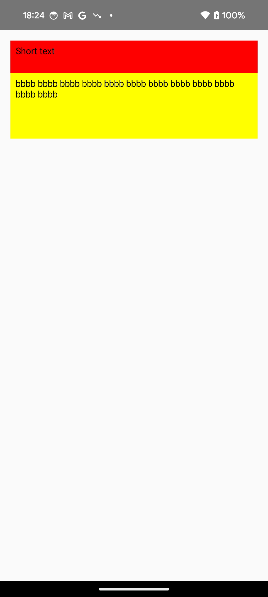
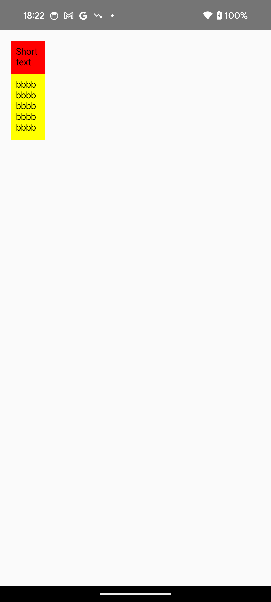

- [Compose レイアウトの Intrinsic な測定値](#compose-レイアウトの-intrinsic-な測定値)
  - [前提知識](#前提知識)
  - [概要](#概要)
  - [Intrinsic の使用例（ Row での使用例）](#intrinsic-の使用例-row-での使用例)
  - [Intrinsic の使用例（ Column の使用例）](#intrinsic-の使用例-column-の使用例)
  - [カスタムレイアウトでの Intrinsic](#カスタムレイアウトでの-intrinsic)


# Compose レイアウトの Intrinsic な測定値

## 前提知識

まず、 Intrinsic という馴染みのない単語がでてきましたが、この Intrinsic とは、 「本来の」 という意味を持っています。例えば、 intrinsicWidth とは、コンポーネントの「本来の幅」や「固有の幅」と訳され、コンポーネントが特定の制約なしで持つ幅のことを意味します。この幅は、そのコンポーネントが自然に持つ理想的なサイズであり、コンテンツやレイアウトの条件によって決まります。


## 概要

Compose のルールの 1 つは、 **子要素の測定は 1 回だけにすることです。** 子要素を 2 回測定すると、ランタイム例外がスローされます。ただし、子要素を測定する前に、子要素に関する情報が必要な場合があります。

このような場合は、 Intrinsics を使用することで、実際に測定する前に子要素を照会できます。

コンポーザブル要素に対して、 intrinsicWidth または intrinsicHeight をリクエストできます。

- `(min|max)IntrinsicWidth` : この幅の場合、コンテンツを適切に描画できる最小 / 最大幅はどれくらいですか?

- `(min|max)IntrinsicHeight` : この高さの場合、コンテンツを適切に描画できる最小 / 最大高さはどれくらいですか?

たとえば、高さが無限の Text の minIntrinsicHeight を要求すると、テキストが 1 行で描画されたかのように Text の高さが返されます。

注: intrinsics の測定を要求しても、子要素は 2 回測定されません。子は測定される前に固有の測定値を照会され、その後、その情報に基づいて親が子を測定するための制約を計算します。


## Intrinsic の使用例（ Row での使用例）

次のように、画面上に区切り線で区切られた 2 つのテキストを表示するコンポーザブルを作成するとします。


これを実現するには、Row 内に 2 つの Text を含めてテキストが可能な限り拡大するようにして、中央に Divider を含めます。Divider は次のようになります。 高さは最も背の高い Text と同じで、幅は細くするため `width = 1.dp` とします。

```kotlin
@Composable
fun TwoTexts(modifier: Modifier = Modifier, text1: String, text2: String) {
    Row(modifier = modifier) {
        Text(
            modifier = Modifier
                .weight(1f)
                .padding(start = 4.dp)
                .wrapContentWidth(Alignment.Start),
            text = text1
        )
        Divider(
            color = Color.Black,
            modifier = Modifier.fillMaxHeight().width(1.dp)
        )
        Text(
            modifier = Modifier
                .weight(1f)
                .padding(end = 4.dp)
                .wrapContentWidth(Alignment.End),

            text = text2
        )
    }
}
```

上記のコードをプレビューすると、 Divider が画面の高さいっぱいに展開され、意図したレイアウトにはなりません。


これは、 Row がそれぞれの子要素を順番に一度だけ測定するため、 `Divider` の高さを測定する際に、最も低い Text の高さを制約として使用できないためです。

Divider が指定された高さで空きスペースを埋めるように設定するには、 `height(IntrinsicSize.Min)` 修飾子を使用します。

height(IntrinsicSize.Min) は、子の高さが Intrinsic の最小の高さと同じになるように強制します。この修飾子は再帰的であるため、Row とその子の minIntrinsicHeight をクエリします。

これを次のようにコードに適用すると、想定どおりに動作します。 ( Row の修飾子だけ変更されています。)

**注意** : Android Studio のプレビュー機能で表示をプレビューした際、 `@Preview(widthDp = 300, heightDp = 700)` のようにプレビューサイズを指定している場合は、正しくプレビューされないことがあるため、実機にインストールして確認することをお勧めします。これは、 Android Studio が Intrinsic のプレビューにまだ対応していないためと思われます。例えば、今回のサンプルの場合、プレビューでは Divider が短くなりません。

```kotlin
@Composable
fun TwoTexts(modifier: Modifier = Modifier, text1: String, text2: String) {
    Row(modifier = modifier.height(IntrinsicSize.Min)) {
        Text(
            modifier = Modifier
                .weight(1f)
                .padding(start = 4.dp)
                .wrapContentWidth(Alignment.Start),
            text = text1
        )
        Divider(
            color = Color.Black,
            modifier = Modifier.fillMaxHeight().width(1.dp)
        )
        Text(
            modifier = Modifier
                .weight(1f)
                .padding(end = 4.dp)
                .wrapContentWidth(Alignment.End),

            text = text2
        )
    }
}

// @Preview
@Composable
fun TwoTextsPreview() {
    MaterialTheme {
        Surface {
            TwoTexts(text1 = "Hi", text2 = "there")
        }
    }
}
```

Row コンポーザブルの minIntrinsicHeight は、子要素に伝搬し、すべての子要素の minIntrinsicHeight の中で、最大の minIntrinsicHeight が Row コンポーザブルの高さになります。

Divider 自身はコンテンツを含んでいないため、その最小の高さについての制約はなく、最小の高さは 0 と考えることができます。

Text コンポーザブルは、テキストを含むため、最小の高さに関する制約があります。 Text コンポーザブルは、その幅が決まると、行数が決まり、その行数によって、最小限必要な高さに関する制約 ( minIntrinsicHeidht ) が決定します。

Text コンポーザブルの最低限必要な高さが決定すると、 Row の最小の高さに関する制約が決定し、それに合わせる形で Divider の高さが決定します。


## Intrinsic の使用例（ Column の使用例）



上記のような画面を生成するコードは以下です。

```kotlin
Column(
    modifier = Modifier
        .width(IntrinsicSize.Max)
        .padding(16.dp)
) {
    Box(
        modifier = Modifier
            .height(50.dp)
            .fillMaxWidth()
            .background(Color.Red)
    ) {
        Text(
            text = "Short text",
            modifier = Modifier.padding(8.dp)
        )
    }

    Box(
        modifier = Modifier
            .height(100.dp)
            .fillMaxWidth()
            .background(Color.Yellow)
    ) {
        Text(
            text = "bbbb bbbb bbbb bbbb bbbb bbbb bbbb bbbb bbbb bbbb bbbb bbbb",
            modifier = Modifier.padding(8.dp)
        )
    }
}
```

上記のコードの IntrinsicSize.Max の部分を IntrinsicSize.Min に変更すると以下のような結果になります。



IntrinsicSize.Max は、可能な限り最大化し、 IntrinsicSize.Min は、可能な限り最小化するというイメージなのかなと思います。


## カスタムレイアウトでの Intrinsic

[LayoutModifier](https://developer.android.com/reference/kotlin/androidx/compose/ui/layout/LayoutModifier) や Modifier.layout や Layout コンポーザブルでカスタムレイアウトを作成すると、独自のレイアウトのために、 minIntrinsicWidth などをオーバーライドする必要がある場合があります。

Layout コンポーザブルの場合は、以下のようにオーバーライドすることが可能です。

```kotlin
@Composable
fun MyCustomComposable(
    modifier: Modifier = Modifier,
    content: @Composable () -> Unit
) {
    Layout(
        content = content,
        modifier = modifier,
        measurePolicy = object : MeasurePolicy {
            override fun MeasureScope.measure(
                measurables: List<Measurable>,
                constraints: Constraints
            ): MeasureResult {
                // Measure and layout here
                // ...
            }

            override fun IntrinsicMeasureScope.minIntrinsicWidth(
                measurables: List<IntrinsicMeasurable>,
                height: Int
            ): Int {
                // Logic here
                // ...
            }

            // Other intrinsics related methods have a default value,
            // you can override only the methods that you need.
        }
    )
}
```

カスタムの修飾子を作成する場合は、以下のようにオーバーライドすることが可能です。

```kotlin
fun Modifier.myCustomModifier(/* ... */) = this then object : LayoutModifier {

    override fun MeasureScope.measure(
        measurable: Measurable,
        constraints: Constraints
    ): MeasureResult {
        // Measure and layout here
        // ...
    }

    override fun IntrinsicMeasureScope.minIntrinsicWidth(
        measurable: IntrinsicMeasurable,
        height: Int
    ): Int {
        // Logic here
        // ...
    }

    // Other intrinsics related methods have a default value,
    // you can override only the methods that you need.
}
```


