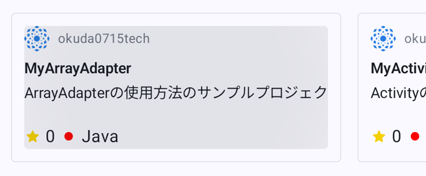
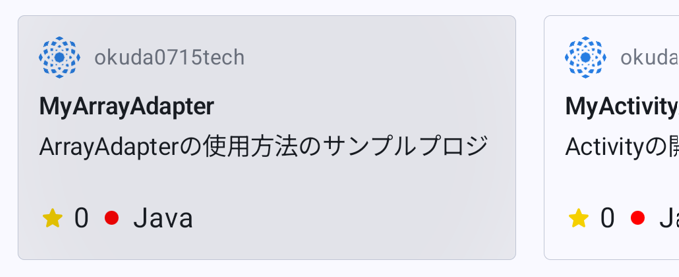
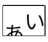
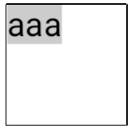
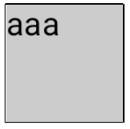

- [修飾子](#修飾子)
  - [連結](#連結)
  - [要素の順序の重要性](#要素の順序の重要性)
  - [組み込み修飾子](#組み込み修飾子)
    - [padding , size（サイズの基本は子をラップ）](#padding--sizeサイズの基本は子をラップ)
    - [requiredSize , requireWidth , requireHeight](#requiredsize--requirewidth--requireheight)
    - [fillMaxHeight , fillMaxWidth , fillMaxSize](#fillmaxheight--fillmaxwidth--fillmaxsize)
    - [padding](#padding)
      - [タップ可能エリアが小さくならないように padding を設定する](#タップ可能エリアが小さくならないように-padding-を設定する)
    - [オフセット](#オフセット)
  - [Compose でのスコープの安全性](#compose-でのスコープの安全性)
    - [Box の matchParentSize](#box-の-matchparentsize)
    - [matchParentSize と fillMaxSize の違い](#matchparentsize-と-fillmaxsize-の違い)
    - [Row と Column の weight 修飾子](#row-と-column-の-weight-修飾子)
  - [修飾子の抽出と再利用](#修飾子の抽出と再利用)
    - [修飾子の保持](#修飾子の保持)
    - [スクロールやアニメーションの状態は抽出が効果的](#スクロールやアニメーションの状態は抽出が効果的)
    - [繰り返し同じ修飾子を必要とする場合に効果的](#繰り返し同じ修飾子を必要とする場合に効果的)
    - [スコープ設定されていない修飾子とされている修飾子](#スコープ設定されていない修飾子とされている修飾子)
    - [修飾子に別の修飾子を連結する](#修飾子に別の修飾子を連結する)
      - [注意点](#注意点)


# 修飾子

## 連結

Modifier の要素は連結することが可能です。

```kotlin
@Composable
private fun Greeting(name: String) {
    Column(
        modifier = Modifier
            .padding(24.dp)
            .fillMaxWidth()
    ) {
        Text(text = "Hello,")
        Text(text = name)
    }
}
```


## 要素の順序の重要性

次のコードは、 clickable の次に padding があります。 clickable が先に適用されるため、 padding の余白部分もクリック可能になります。

```kotlin
@Composable
fun ArtistCard(/*...*/) {
    val padding = 16.dp
    Column(
        Modifier
            .clickable(onClick = onClick)
            .padding(padding)
            .fillMaxWidth()
    ) {
        // rest of the implementation
    }
}
```

次のコードは、 clickable の前に padding があります。 clickable が padding よりも後に適用されるため、 padding の余白部分はクリック不可になります。

```kotlin
@Composable
fun ArtistCard(/*...*/) {
    val padding = 16.dp
    Column(
        Modifier
            .padding(padding)
            .clickable(onClick = onClick)
            .fillMaxWidth()
    ) {
        // rest of the implementation
    }
}
```


## 組み込み修飾子

### padding , size（サイズの基本は子をラップ）

**コンポーザブル関数で生成される UI は、基本的には子要素をラップしたサイズになります。** サイズを変更したい場合には、 size や padding 修飾子を使用します。

```kotlin
@Composable
fun ArtistCard(/*...*/) {
    Row(
        modifier = Modifier.size(width = 400.dp, height = 100.dp)
    ) {
        Image(/*...*/)
        Column { /*...*/ }
    }
}
```


### requiredSize , requireWidth , requireHeight

指定したサイズがレイアウトの親の制約を満たさない場合、そのサイズが適用されないことがあります。親の制約に関係なくコンポーザブルのサイズを固定する必要がある場合は、 requiredSize 修飾子を使用します。

```kotlin
@Composable
fun ArtistCard(/*...*/) {
    Row(
        modifier = Modifier.size(width = 400.dp, height = 100.dp)
    ) {
        Image(
            /*...*/
            modifier = Modifier.requiredSize(150.dp)
        )
        Column { /*...*/ }
    }
}
```


この例では、親 height が 100.dp に設定されていても、requiredSize 修飾子が優先されるため、Image の高さは 150.dp になっています。ただし、これによって、親の height が 150.dp に拡大されることはありません。そのため、 Image が親の領域をはみ出した部分は表示されません。 (トリミングされたような見た目になります。)


### fillMaxHeight , fillMaxWidth , fillMaxSize

親によって許可されているすべての高さを子レイアウトで埋めるには、fillMaxHeight 修飾子を追加します（Compose では、 fillMaxSize と fillMaxWidth も提供されています）。

```kotlin
@Composable
fun ArtistCard(/*...*/) {
    Row(
        modifier = Modifier.size(width = 400.dp, height = 100.dp)
    ) {
        Image(
            /*...*/
            modifier = Modifier.fillMaxHeight()
        )
        Column { /*...*/ }
    }
}
```


### padding


```kotlin
@Composable
fun MyScreen() {
    Column {
        Text(
            text = "ああ",
            modifier = Modifier.padding(20.dp)
        )
        Text(text = "あ")
    }
}
```

`Modifier.paddingFrom` や `Modifier.paddingFromBaseline` などもあります。


#### タップ可能エリアが小さくならないように padding を設定する

例えば、 LazyRow を使用して、横スクロール可能な UI 要素があったとします。

LazyRow に直接 `modifire = Modifire.padding()` を指定すると、次のように、タップ可能エリアが小さくなってしまいます。



```kotlin
// LazyRow の直接の子要素
SurfaceButton(
    modifier = Modifier
        .border(
            border = BorderStroke(
                width = 0.1.dp,
                color = appColorScheme.outlineVariant
            ),
            shape = appShapes.extraSmall
        )
        // LazyRow の直接の子要素に padding を設定すると、
        // タップ可能エリアが小さくなる。
        .padding(12.dp)
        .width(300.dp),
) {
    // SurfaceButton の子要素
    Column(
        verticalArrangement = Arrangement.spacedBy(2.dp),
    ) {
        // コンテンツ
    }
}
```

これを回避するには、 LazyRow に padding を指定するのではなく、その子要素に padding を設定します。すると、以下のように、要素全体がタップ可能なエリアになります。



```kotlin
// LazyRow の直接の子要素
SurfaceButton(
    modifier = Modifier
        .border(
            border = BorderStroke(
                width = 0.1.dp,
                color = appColorScheme.outlineVariant
            ),
            shape = appShapes.extraSmall
        )
        .width(300.dp),
) {
    // SurfaceButton の子要素
    Column(
        verticalArrangement = Arrangement.spacedBy(2.dp),
        // LazyRow の直接の子要素のさらに子要素 (孫) に対して padding を設定すると
        // タップ可能エリアが、すきまなく広がります。
        modifier = Modifier.padding(12.dp),
    ) {
        // コンテンツ
    }
}
```


### オフセット

offset 修飾子は、要素の表示位置を変更します。 x 軸のオフセットは、要素を左右に移動させ、 y 軸のオフセットは、要素を上下に移動させます。

offset は padding とは異なり、 padding が要素のサイズ自体を変更するのに対して、 **offset は要素のサイズを変更せず、表示位置だけを変更します。そのため、コンテンツの見切れが発生する可能性があることに注意してください。** 以下の例では、 "あ" という文字が Y 軸のオフセットの影響で見切れてしまっています。

```kotlin
@Composable
fun MyScreen() {
    Row {
        Text("あ", modifier = Modifier.offset(y = 8.dp))
        Text(text = "い")
    }
}
```



**参考** : offset 修飾子は、文字が右から左に流れる言語と左から右へ流れる言語の左右の反転に適応しています。つまり、 X 軸に正の値のオフセットを設定した場合、右から左に流れる言語では、右方向へ要素を移動し、左から右へ流れる言語では、左方向へ要素を移動します。この仕様を無視して、正の値なら常に右方向へ移動させたい場合は、 absoluteOffset を使用します。

offset 修飾子には、オフセットをパラメータとして受け取る [offset](https://developer.android.com/reference/kotlin/androidx/compose/foundation/layout/package-summary?_gl=1*u7gxu4*_up*MQ..*_ga*MTk0MTI4MDI5NC4xNzE5OTgwMTIw*_ga_6HH9YJMN9M*MTcyMDA3ODMzOS4zLjAuMTcyMDA3ODMzOS4wLjAuMA..#(androidx.compose.ui.Modifier).offset(androidx.compose.ui.unit.Dp,androidx.compose.ui.unit.Dp)) と、ラムダで受け取る [offset](https://developer.android.com/reference/kotlin/androidx/compose/foundation/layout/package-summary?_gl=1*u7gxu4*_up*MQ..*_ga*MTk0MTI4MDI5NC4xNzE5OTgwMTIw*_ga_6HH9YJMN9M*MTcyMDA3ODMzOS4zLjAuMTcyMDA3ODMzOS4wLjAuMA..#(androidx.compose.ui.Modifier).offset(kotlin.Function1)) という 2 つのオーバーロードがあります。それぞれのオーバーロードを使用すべき状況と、パフォーマンスを最適化する方法について詳しくは、 [Compose のパフォーマンス - 可能な限り読み取りを延期する](https://developer.android.com/develop/ui/compose/performance/bestpractices?hl=ja&_gl=1*xolypt*_up*MQ..*_ga*MTk0MTI4MDI5NC4xNzE5OTgwMTIw*_ga_6HH9YJMN9M*MTcyMDE0NDEzMy40LjAuMTcyMDE0NDEzMy4wLjAuMA..#defer-reads) をご覧ください。


## Compose でのスコープの安全性

修飾子の中には、特定のコンポーザブルの直下でのみ使用可能なものがあります。そのような修飾子は、それ以外のコンポーザブルの直下で使用した場合は、コンパイルエラーとなります。

例えば、 Box 関数の matchParentSize 修飾子がそれにあたります。


### Box の matchParentSize

matchParentSize 修飾子は、親の Box と同じサイズの子の要素を生成します。

```kotlin
@Composable
fun MatchParentSizeComposable() {
    Box {
        Spacer(
            Modifier
                .matchParentSize()
                .background(Color.LightGray)
        )
        ArtistCard()
    }
}
```

上記のコードは、次のような UI を生成します。


親のサイズと同じサイズのグレーの背景が生成されています。

この例では、 Box は、最も大きなサイズの子 ( ArtistCard ) からサイズを取得し、 Spacer は、 Box のそのサイズを取得しています。


### matchParentSize と fillMaxSize の違い

matchParentSize は、親となる Box のサイズに影響を与えませんが、 fillMaxSize は親に影響を与えます。 fillMaxSize を指定した場合は、親は、拡大可能な限り拡大されます。

次の例を見てください。

```kotlin
@Composable
fun MyScreen() {
    Box(modifier = Modifier.size(50.dp)) {
        Box {
            Spacer(
                Modifier
                    .matchParentSize()
//                    .fillMaxSize()
                    .background(Color.LightGray)
            )
            Text("aaa")
        }
    }
}
```

上記のコードの通り matchParentSize を指定した場合は、次のようになります。



matchParentSize の部分を、 fillMaxSize に書き換えた場合は、以下のようになります。




### Row と Column の weight 修飾子

Row と Column の子要素に weight 修飾子を指定すると、 LinearLayout の weight と同様の効果を適用することができます。

```kotlin
@Composable
fun ArtistCard(/*...*/) {
    Row(
        modifier = Modifier.fillMaxWidth()
    ) {
        Image(
            /*...*/
            modifier = Modifier.weight(2f)
        )
        Column(
            modifier = Modifier.weight(1f)
        ) {
            /*...*/
        }
    }
}
```


Image の幅と Column の幅の比率が 1 : 2 の UI が生成されます。


## 修飾子の抽出と再利用

修飾子は、ホイスティングして、複数のコンポーザブルで再利用することが可能です。ホイスティングするメリットは次の通りです。

- 再コンポーズ時に、修飾子を再生成する必要がない
- コードベース全体でコードが減り、コードの整合性、保守性が向上します。


### 修飾子の保持

修飾子は、通常のデータと同様にプロパティに保持できます。

```kotlin
val reusableModifier = Modifier
    .fillMaxWidth()
    .background(Color.Red)
    .padding(12.dp)
```

最初に生成した Modifier を変数に保持し、下位のコンポーザブルに渡すことで、再コンポーズの度に何度も Modifier を生成することを避けることができます。


### スクロールやアニメーションの状態は抽出が効果的

アニメーションの状態や scrollState など、コンポーザブル内で頻繁に変化する状態を監視する場合、再コンポーズが頻繁に行われる可能性があります。この場合、修飾子は再コンポーズのたびに再生成され、場合によってはフレームごとに再生成されます。それを避けるために、修飾子をホイスティングすると効果的です。

次のコードは、修飾子をホイスティングする前のコードです。

```kotlin
@Composable
fun LoadingWheelAnimation() {
    val animatedState = animateFloatAsState(/*...*/)

    LoadingWheel(
        // アニメーションのフレームごとにこの修飾子は生成されます。
        modifier = Modifier
            .padding(12.dp)
            .background(Color.Gray),
        animatedState = animatedState
    )
}
```

修飾子をホイスティングすると以下のようになります。

```kotlin
// 修飾子を変数に保持します。
val reusableModifier = Modifier
    .padding(12.dp)
    .background(Color.Gray)

@Composable
fun LoadingWheelAnimation() {
    val animatedState = animateFloatAsState(/*...*/)

    LoadingWheel(
        // 同じ Modifier インスタンスを再利用するため、
        // アニメーションのフレーム毎に Modifier が生成されるこてとはありません。
        modifier = reusableModifier,
        animatedState = animatedState
    )
}
```


### 繰り返し同じ修飾子を必要とする場合に効果的

Lazy レイアウトの各アイテムなど、繰り返し同じ修飾子が必要とされる場面で、修飾子の抽出は効果的です。

```kotlin
val reusableItemModifier = Modifier
    .padding(bottom = 12.dp)
    .size(216.dp)
    .clip(CircleShape)

@Composable
private fun AuthorList(authors: List<Author>) {
    LazyColumn {
        items(authors) {
            AsyncImage(
                // ...
                modifier = reusableItemModifier,
            )
        }
    }
}
```


### スコープ設定されていない修飾子とされている修飾子

修飾子は、 **コンポーザブル関数内の変数で保持** すれば、そのコンポーザブルをスコープとする修飾子が定義できます。その一方で、 **コンポーザブル関数外の変数で保持** すれば、スコープ設定されていない修飾子を定義することが可能です。

次のコードは、スコープ設定されていない修飾子の例です。

```kotlin
val reusableModifier = Modifier
    .fillMaxWidth()
    .background(Color.Red)
    .padding(12.dp)

@Composable
fun AuthorField() {
    HeaderText(
        // ...
        modifier = reusableModifier
    )
    SubtitleText(
        // ...
        modifier = reusableModifier
    )
}
```

スコープ設定されていない修飾子は、複数のコンポーザブル関数内で再利用可能であるため、アプリ内の複数の画面で共通のレイアウトを作成したい場合などに有効です。

次のコードは、スコープ設定されている修飾子の例です。

```kotlin
Column(/*...*/) {
    val reusableItemModifier = Modifier
        .padding(bottom = 12.dp)
        // Align Modifier.Element requires a ColumnScope
        .align(Alignment.CenterHorizontally)
        .weight(1f)
    Text1(
        modifier = reusableItemModifier,
        // ...
    )
    Text2(
        modifier = reusableItemModifier
        // ...
    )
    // ...
}
```

修飾子は、特定のコンポーザブル関数を親に持つ要素に対してのみ有効なものがあります。例えば、 Box の子要素に対する matchParentSize や、 Row の子要素に対する weight などがあります。

次のコードは、 Box の子要素に対しては、 weight が無視される例です。

```kotlin
Column(modifier = Modifier.fillMaxWidth()) {
    // weight は Row や Column の直接の子要素に対してのみ有効
    val reusableItemModifier = Modifier.weight(1f)

    Text1(
        modifier = reusableItemModifier
    )

    Box {
        Text2(
            // weight は無視されます。
            modifier = reusableItemModifier
        )
    }
}
```

修飾子は直接の子要素だけではなく、孫要素に対しても有効であるため、ホイスティングする場合は、予期せず修飾子が適用される可能性があることに注意してください。具体的には、 **できる限り、孫要素での修飾子の再利用を避けてください。**

```kotlin
Column(modifier = Modifier.fillMaxWidth()) {
    val reusableItemModifier1 = Modifier.weight(1f)
    val reusableItemModifier2 = Modifier.weight(2f)
    Text(
        text = "あ",
        modifier = reusableItemModifier1
    )

    Row {
        Text(
            // 孫要素にも修飾子が適用されるため、
            // 予期せぬバグが発生する可能性がある。
            modifier = reusableItemModifier1
        )
        Text(
            modifier = reusableItemModifier2
        )
    }
}
```


### 修飾子に別の修飾子を連結する

Modifier に要素を追加する場合は、後からでもドットで連結することが可能です。

また、二つの Modifier インスタンス同士を連結する場合には、 `.then()` 関数を使用します。

```kotlin
val reusableModifier = Modifier
    .fillMaxWidth()
    .background(Color.Red)
    .padding(12.dp)

// 既存の Modifier インスタンスにドットで要素を追加する場合
reusableModifier.clickable { /*...*/ }

// Modifier 同士を連結するには then 関数を使用します。
otherModifier.then(reusableModifier)
```


#### 注意点

ドットで連結した場合も、 `then` 関数で連結した場合も、元の Modifier インスタンスではなく、新しいインスタンスが返される点に注意してください。

Modifier インスタンスは、 Immutable オブジェクトであるため、変更を加えた際に、既存のインスタンスが返されることはありません。


