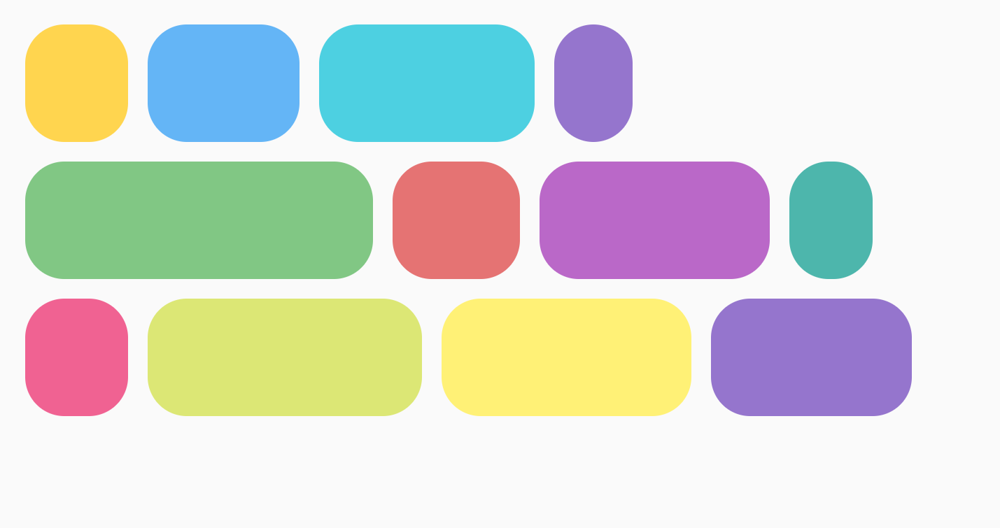
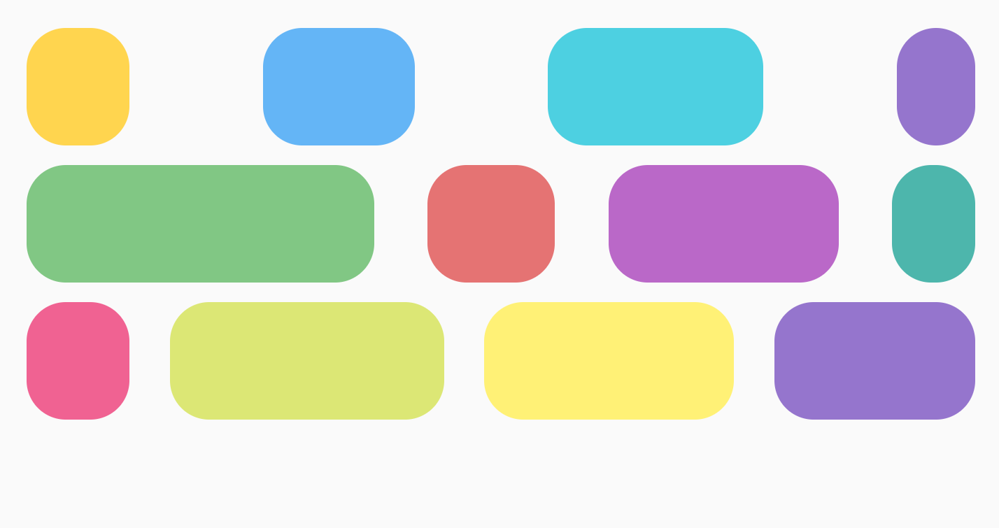
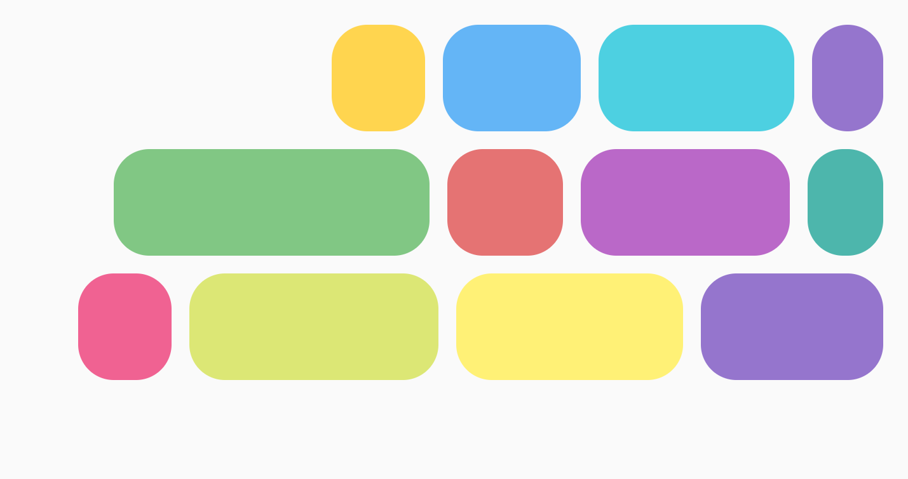
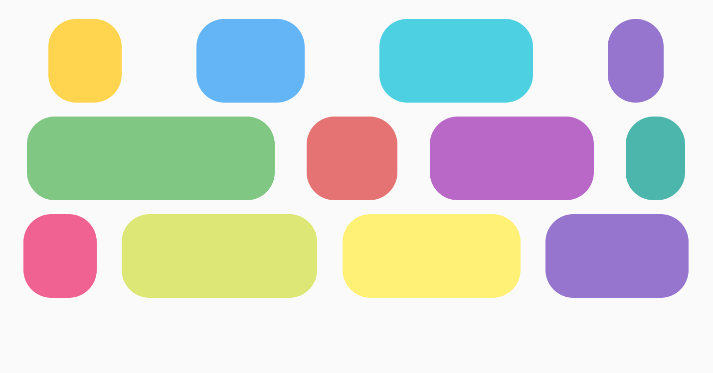
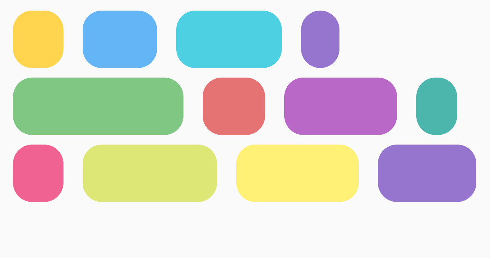
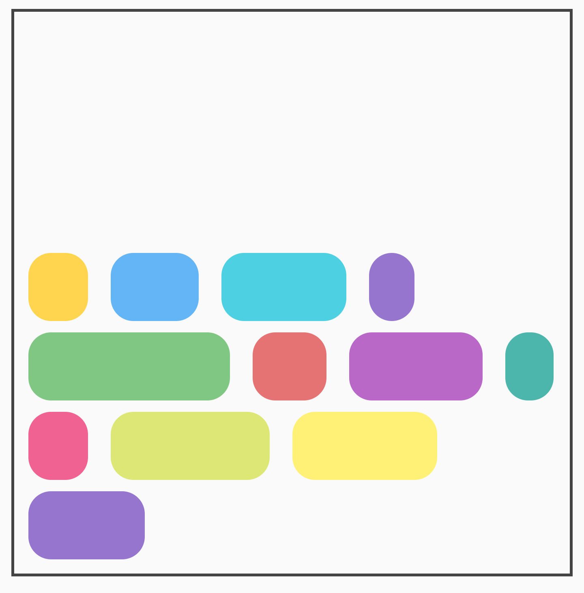
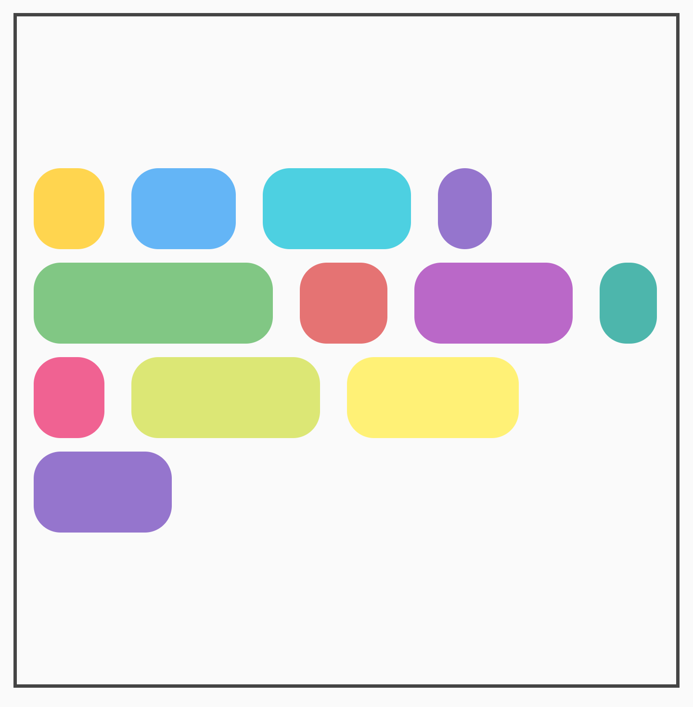
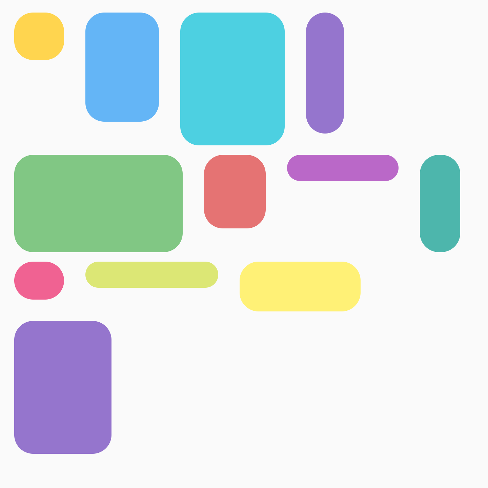
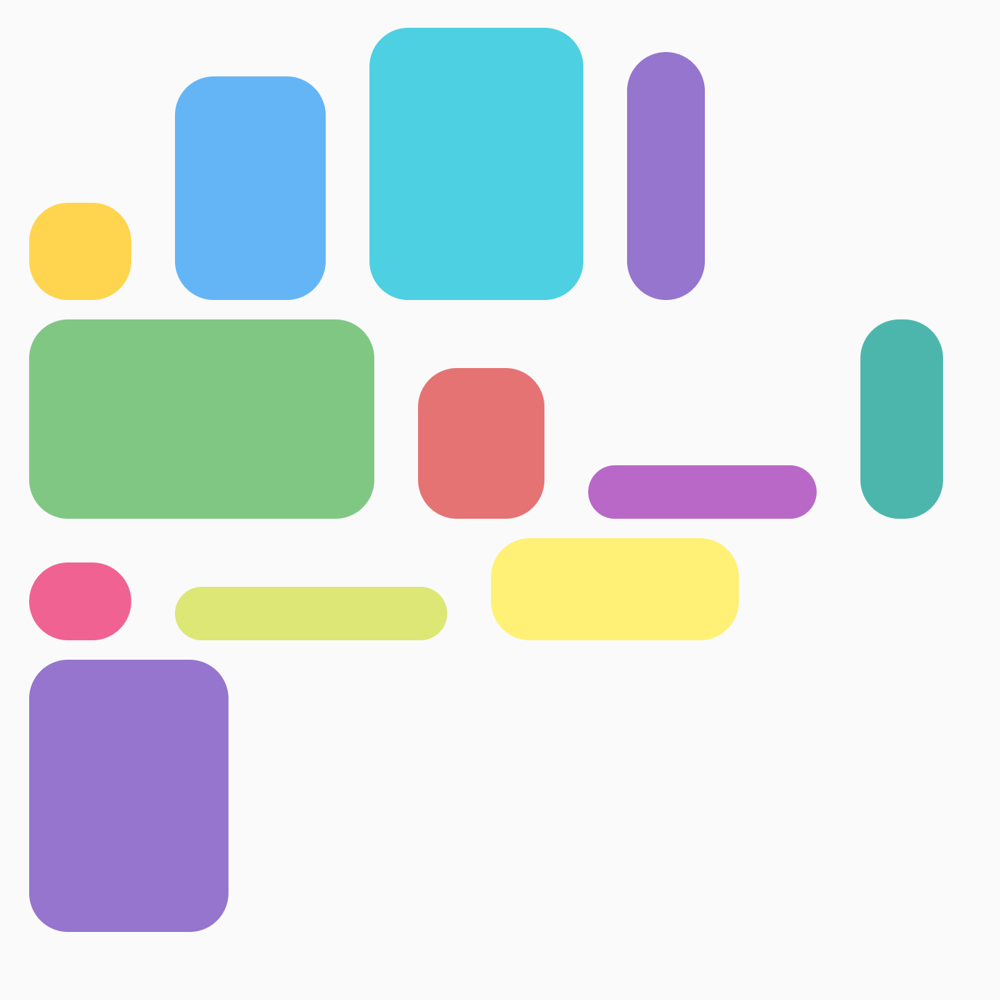
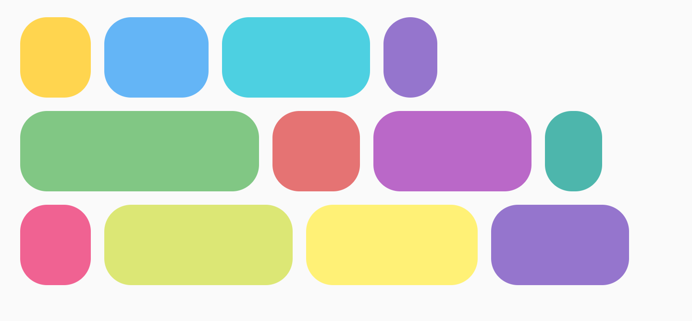

- [Compose の Flow レイアウト](#compose-の-flow-レイアウト)


# Compose の Flow レイアウト

**ベータ版**: FlowRow と FlowColumn は試験運用版です。

[FlowRow](https://developer.android.com/reference/kotlin/androidx/compose/foundation/layout/package-summary#FlowRow(androidx.compose.ui.Modifier,androidx.compose.foundation.layout.Arrangement.Horizontal,androidx.compose.foundation.layout.Arrangement.Vertical,kotlin.Int,kotlin.Int,androidx.compose.foundation.layout.FlowRowOverflow,kotlin.Function1)) と [FlowColumn](https://developer.android.com/reference/kotlin/androidx/compose/foundation/layout/package-summary#FlowColumn(androidx.compose.ui.Modifier,androidx.compose.foundation.layout.Arrangement.Vertical,androidx.compose.foundation.layout.Arrangement.Horizontal,kotlin.Int,kotlin.Int,androidx.compose.foundation.layout.FlowColumnOverflow,kotlin.Function1)) は、 Row と Column に類似していますが、異なるコンポーザブルです。 コンテナが容量を使い切ったら次の行に移ります。これにより、複数の行や列を構成できます。一行あたりのアイテム数も調整できます。一行 or 一列あたりのアイテム数の調整には、 maxItemsInEachRow または maxItemsInEachColumn を設定します。

FlowRow と FlowColumn は、レスポンシブレイアウトを作成するためによく使用されます。コンテンツは切り取られません。 1 つのディメンションに対してアイテムが大きすぎる場合にオフにするとともに、 maxItemsInEach* を Modifier.weight(weight) に置き換えると、 必要に応じて行や列の幅を塗りつぶしたり広げたりできます。

一般的な例は、チップやフィルタリングの UI です。


## 基本的な使用方法

FlowRow または FlowColumn を使用するには、これらのコンポーザブルを作成してアイテムを配置します。 その中の次の標準的なフローに沿って進めます。

```kotlin
@Composable
private fun FlowRowSimpleUsageExample() {
    FlowRow(modifier = Modifier.padding(8.dp)) {
        ChipItem("Price: High to Low")
        ChipItem("Avg rating: 4+")
        ChipItem("Free breakfast")
        ChipItem("Free cancellation")
        ChipItem("£50 pn")
    }
}
```

このスニペットにより、上記の UI が表示され、アイテムは自動的に スペースがなくなると次の行に移ります。


## フロー レイアウトの機能

フローレイアウトには、以下の様々な機能とプロパティがあります。 


### 主軸の配置: 水平または垂直の配置

主軸はアイテムが配置される軸です。

例えば FlowRow は、アイテムは横方向に並べます。 FlowRow の horizontalArrangement パラメータは、アイテム間の空き容量の配分を制御します。

以下に、 horizontalArrangement の設定例を示します。 

#### Arrangement.Start（Default）




#### Arrangement.SpaceBetween

SpaceAround = アイテムとアイテムの間にスペースを配置する。




#### Arrangement.Center


#### Arrangement.End




#### Arrangement.SpaceAround

SpaceAround = アイテムの周りにスペースを配置する。




#### Arrangement.spacedBy(8.dp)

アイテムとアイテムの間に指定したスペースを設ける。

マイナスの値を設定するとアイテム同士を重ねることが可能です。




FlowColumn の場合、 verticalArrangement で同様のオプションを使用できます。 デフォルトは Arrangement.Top です。


### 交差軸の配置

交差軸とは、主軸に対して直角方向の軸です。

たとえば、 FlowRow では verticalArrangement プロパティを使用して、アイテムの上下の寄せ方を指定します。

FlowColumn の場合は、 horizontalArrangement プロパティを使用します。デフォルトの交差軸の配置は Arrangement.Start です。

以下に、 FlowRow に対する verticalArrangement の設定例を示します。


#### Arrangement.Top（Default）


#### Arrangement.Bottom




#### Arrangement.Center




### 個々のアイテムの配置

FlowRow 内で、各アイテムの高さが異なる場合に、行内でアイテムの垂直方向の寄せ方を指定する際に、 Modifier.align() の verticalArrangement を指定します。

FlowColumn についても、同様のオプションを使用できます。デフォルトのアライメントは、 Alignment.Start です。

#### Alignment.Top（Default）




#### Alignment.Bottom




#### Alignment.CenterVertically


### 行または列の最大アイテム数

FlowRow のパラメータ maxItemsInEachRow は、 1 行に最大でアイテムをいくつ配置することができるかを指定します。デフォルトは Int.MAX_INT です。これにより、可能な限り多くのアイテムが配置されます。

FlowColumn の場合は maxItemsInEachColumn パラメータを使用します。

次に maxItemsInEachRow の設定例を示します。


#### 設定なし




#### maxItemsInEachRow = 3


### フローアイテムの遅延読み込み

ContextualFlowRow と ContextualFlowColumn は、FlowRow と FlowColumn の特殊バージョンで、コンテンツを遅延ロードできます。また、アイテムが最初の行にあるかどうかなど、アイテムの位置に関する情報 (インデックス、行番号、使用可能なサイズ) も提供します。これは、大規模なデータセットの場合や、アイテムに関するコンテキスト情報が必要な場合に役立ちます。

maxLines パラメータは表示される行数を制限し、overflow パラメータはアイテムのオーバーフローに達したときに何を表示するかを指定します。これにより、カスタム expandIndicator または collapseIndicator を指定できます。

**注**: maxLines は FlowRow と FlowColumn で使用できますが、ContextualFlowRow と ContextualFlowColumn ではレイアウト情報を決定するためにサブコンポーズを使用するため、shownItemCount などのレイアウト情報にはすべてのフェーズでアクセスできます。FlowRow で shownItemCount にアクセスできるのは、描画フェーズの場合のみです。この情報が必要な時期と必要でない場合を考慮して、2 つから選択してください。

たとえば、「+ (残りのアイテム数)」または「表示を減らす」ボタンを表示するには、次のようにします。

```kotlin
val totalCount = 40
var maxLines by remember {
    mutableStateOf(2)
}

val moreOrCollapseIndicator = @Composable { scope: ContextualFlowRowOverflowScope ->
    val remainingItems = totalCount - scope.shownItemCount
    ChipItem(if (remainingItems == 0) "Less" else "+$remainingItems", onClick = {
        if (remainingItems == 0) {
            maxLines = 2
        } else {
            maxLines += 5
        }
    })
}

ContextualFlowRow(
    modifier = Modifier
        .safeDrawingPadding()
        .fillMaxWidth(1f)
        .padding(16.dp)
        .wrapContentHeight(align = Alignment.Top)
        .verticalScroll(rememberScrollState()),
    verticalArrangement = Arrangement.spacedBy(4.dp),
    horizontalArrangement = Arrangement.spacedBy(8.dp),
    maxLines = maxLines,
    overflow = ContextualFlowRowOverflow.expandOrCollapseIndicator(
        minRowsToShowCollapse = 4,
        expandIndicator = moreOrCollapseIndicator,
        collapseIndicator = moreOrCollapseIndicator
    ),
    itemCount = totalCount
) { index ->
    ChipItem("Item $index")
}
```


### アイテムのウェイト

ウェイトは、アイテムの係数と、アイテムが配置された行の使用可能なスペースに基づいてアイテムを拡大します。重要なのは、FlowRow と Row では、アイテムの幅を計算するためにウェイトがどのように使用されるかが異なることです。Rows の場合、ウェイトは Row 内のすべてのアイテムに基づきます。FlowRow の場合、ウェイトは FlowRow コンテナー内のすべてのアイテムではなく、アイテムが配置されている行のアイテムに基づきます。

たとえば、すべてのアイテムが 1 行に収まり、それぞれ異なるウェイトが 1f、2f、1f、3f の場合、合計ウェイトは 7f です。行または列の残りのスペースは 7f で割られます。次に、各アイテムの幅は、weight * (remainingSpace / totalWeight) を使用して計算されます。

Modifier.weight と max items を FlowRow または FlowColumn と組み合わせて使用​​して、グリッドのようなレイアウトを作成できます。この方法は、デバイスのサイズに合わせて調整されるレスポンシブ レイアウトを作成する場合に便利です。

重みを使用して実現できるものには、いくつかの異なる例があります。 1 つの例は、次に示すように、アイテムのサイズが均等であるグリッドです。


等しいアイテム サイズのグリッドを作成するには、次の操作を実行します。

```kotlin
val rows = 3
val columns = 3
FlowRow(
    modifier = Modifier.padding(4.dp),
    horizontalArrangement = Arrangement.spacedBy(4.dp),
    maxItemsInEachRow = rows
) {
    val itemModifier = Modifier
        .padding(4.dp)
        .height(80.dp)
        .weight(1f)
        .clip(RoundedCornerShape(8.dp))
        .background(MaterialColors.Blue200)
    repeat(rows * columns) {
        Spacer(modifier = itemModifier)
    }
}
```

重要なのは、別の項目を追加して、それを 9 回ではなく 10 回繰り返すと、行全体の合計重みが 1f になるため、最後の項目が最後の列全体を占めるということです。


重みは、Modifier.width(exactDpAmount)、Modifier.aspectRatio(aspectRatio)、Modifier.fillMaxWidth(fraction) などの他の Modifier と組み合わせることができます。これらの Modifier はすべて連携して動作し、FlowRow (または FlowColumn) 内のアイテムのレスポンシブなサイズ設定を可能にします。

また、異なるアイテム サイズの交互グリッドを作成することもできます。この場合、2 つのアイテムがそれぞれ半分の幅を占め、1 つのアイテムが次の列の全幅を占めます。


これは次のコードで実現できます。

```kotlin
FlowRow(
    modifier = Modifier.padding(4.dp),
    horizontalArrangement = Arrangement.spacedBy(4.dp),
    maxItemsInEachRow = 2
) {
    val itemModifier = Modifier
        .padding(4.dp)
        .height(80.dp)
        .clip(RoundedCornerShape(8.dp))
        .background(Color.Blue)
    repeat(6) { item ->
        // アイテムが 3 番目なら、 weight を使用せず、
        // fillMaxWidth を使用する。
        if ((item + 1) % 3 == 0) {
            Spacer(modifier = itemModifier.fillMaxWidth())
        } else {
            Spacer(modifier = itemModifier.weight(0.5f))
        }
    }
}
```


### 小数点サイズ

Modifier.fillMaxWidth(fraction) を使用すると、アイテムが占めるコンテナのサイズを指定できます。これは、Modifier.fillMaxWidth(fraction) を Row または Column に適用した場合の動作とは異なります。 Row / Column アイテムは、コンテナ全体の幅ではなく、残りの幅の割合を占めます。

たとえば、次のコードは、FlowRow を使用した場合と Row を使用した場合に異なる結果になります。

```kotlin
FlowRow(
    modifier = Modifier.padding(4.dp),
    horizontalArrangement = Arrangement.spacedBy(4.dp),
    maxItemsInEachRow = 3
) {
    val itemModifier = Modifier
        .clip(RoundedCornerShape(8.dp))
    Box(modifier = itemModifier.height(200.dp).width(60.dp).background(Color.Red))
    Box(modifier = itemModifier.height(200.dp).fillMaxWidth(0.7f).background(Color.Yellow))
    Box(modifier = itemModifier.height(200.dp).weight(1f).background(Color.Magenta))
}
```

**FlowRow を使用した場合**

コンテナ ( FlowRow ) の幅全体を 1 として、中央のアイテムは、 0.7 となります。


**Row を使用した場合**

固定幅 60 dp を差し引いた後、残りの行幅を 1 として、中央のアイテムは、 0.7 となります。


FlowRow の場合も、 Row の場合も、紫色の部分の幅 ( weight ) は、赤色と黄色の部分の幅が決定して、残った領域に対しての割合指定となります。


### fillMaxColumnWidth()、fillMaxRowHeight()

Modifier.fillMaxColumnWidth() または Modifier.fillMaxRowHeight() のいずれかを FlowColumn または FlowRow 内のアイテムに適用すると、同じ列または行のアイテムが、列/行内の最大のアイテムと同じ幅または高さを占めることが保証されます。

たとえば、この例では、 FlowColumn を使用して Android デザートのリストを表示します。  Modifier.fillMaxColumnWidth() が適用されている場合と、適用されていない場合で、各アイテムの幅の違いを確認できます。

```kotlin
FlowColumn(
    Modifier
        .padding(20.dp)
        .fillMaxHeight()
        .fillMaxWidth(),
    horizontalArrangement = Arrangement.spacedBy(8.dp),
    verticalArrangement = Arrangement.spacedBy(8.dp),
    maxItemsInEachColumn = 5,
) {
    repeat(listDesserts.size) {
        Box(
            Modifier
                .fillMaxColumnWidth()
                .border(1.dp, Color.DarkGray, RoundedCornerShape(8.dp))
                .padding(8.dp)
        ) {

            Text(
                text = listDesserts[it],
                fontSize = 18.sp,
                modifier = Modifier.padding(3.dp)
            )
        }
    }
}
```

**Modifier.fillMaxColumnWidth() が適用されている場合**


**Modifier.fillMaxColumnWidth() が適用されている場合**


**注**: 各列の開始位置 (左端) がそろっているのは、 FlowColumn を使用しているためです。
