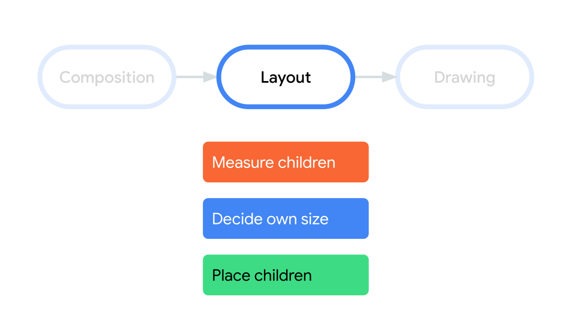
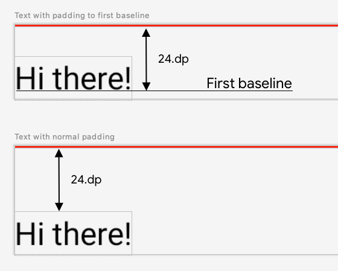
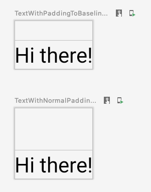

- [カスタムレイアウト](#カスタムレイアウト)
  - [Modifier.layout を使用する](#modifierlayout-を使用する)
  - [カスタムレイアウトを作成する](#カスタムレイアウトを作成する)
  - [レイアウト方向](#レイアウト方向)
  - [カスタムレイアウトの実例](#カスタムレイアウトの実例)
  - [詳細](#詳細)
    - [動画](#動画)


# カスタムレイアウト

Compose では、UI 要素は呼び出されたときに UI の一部を出力するコンポーズ可能な関数によって表され、画面上にレンダリングされる UI ツリーに追加されます。各 UI 要素には親が 1 つあり、場合によっては多くの子があります。各要素は、(x, y) 位置として指定された親内の場所に、width および height で指定されたサイズで配置されます。

親は子要素の制約を定義します。要素は、これらの制約内で自身のサイズを定義するように要求されます。制約により、要素の width と height の最小値と最大値が制限されます。要素に子要素がある場合、親の要素は、自身のサイズを判断しやすくするために、子のそれぞれを測定できます。要素が自身のサイズを決定して報告すると、カスタム レイアウトの作成で詳しく説明されているように、子要素を自身に対し相対的に配置する方法を定義できるようになります。

UI ツリー内の各ノードのレイアウトは、次の 3 つのステップで行います。各ノードは次のことを行う必要があります。

1. すべての子を測定する
2. ノード自体のサイズを決定する
3. 子を配置する



**注**: Compose UI では、マルチパス測定は許可されていません。つまり、さまざまな測定構成を試すために、レイアウト要素でその子要素を複数回測定することはできません。

スコープの使用により、子の測定と配置を行えるタイミングが決まります。レイアウトは測定パスとレイアウトパスの実行中のみ測定でき、子の配置はレイアウトパスの実行中に、測定した後でのみ行うことができます。 MeasureScope および PlacementScope により、 コンパイル時に適用されます。


## Modifier.layout を使用する

layout 修飾子 ( `Modifier.layout` ) を使用して、要素の測定方法と配置方法を変更できます。Layout はラムダです。パラメータには、 measurable として渡される測定可能な要素と、 constraints として渡されるそのコンポーザブルの定義された制約が含まれます。カスタムレイアウト修飾子は次のようになります。

```kotlin
fun Modifier.customLayoutModifier() =
    layout { measurable, constraints ->
        // ...
    }
```

画面に Text を表示し、上端からテキスト先頭行のベースラインまでの距離を制御してみましょう。これは paddingFromBaseline 修飾子の動作とまったく同じです。ここでは、これを例として実装します。そのためには、 layout 修飾子を使用して、コンポーザブルを画面に手動で配置します。 

以下の画像は、上の画像が今回実装したいカスタムレイアウトです。下の画像は、参考までに、通常の padding 修飾子でパディングを設定した場合のレイアウトです。



次のコードで、目的のレイアウトを生成することが可能です。

```kotlin
// ここで言う first baseline というのは、
// テキストが複数行になった場合の最初の行のベースラインを意味します。
//
// この関数は、独自の修飾子を定義する関数です。
// この修飾子が付与されたコンポーザブルは、その first baseline から、
// その親コンポーザブルの Top までの距離に
// 引数で指定したパディングを競ってします。
fun Modifier.firstBaselineToTop(
    firstBaselineToTop: Dp
    // layout 関数には二種類あるので注意。
    // ↓ この layout 関数は、 Modifier.layout 関数です。
) = layout { measurable, constraints ->
    // measurable : この修飾子 ( firstBaselineToTop ) が
    // 設定されたコンポーザブルのこと。
    // 子要素は測定可能であるため、このような名前になっています。
    // constraints : 親から渡されてきた制約のこと。

    // 制約に基づいて自分自身 (この修飾子が付与されたコンポーザブル) のサイズを計測します。
    //
    // placeable オブジェクトには、要素のサイズや位置情報が含まれます。
    val placeable = measurable.measure(constraints)

    // コンポーザブルが FirstBaseline (基準線) を持っているか確認します。
    //
    // check 関数は引数で与えられた値が true であるかどうかを
    // チェックします。 true の場合は処理を継続し、
    // false の場合は、例外を発生させます。
    //
    // placeable[FirstBaseline] は配列にアクセスしているように
    // 見えますが、そうではなく、これは、オペレーターオーバーロードです。
    // オペレーターオーバーロードは、
    // operator 修飾子を付与した get という名前の関数を定義すると、
    // その get という関数を '[]' で呼び出せる Kotlin の機能です。
    check(placeable[FirstBaseline] != AlignmentLine.Unspecified)
    // first baseline (基準線) を取得します。
    val firstBaseline = placeable[FirstBaseline]

    // 親の Top からコンポーザブルの Top までの距離を算出します。
    //
    // firstBaseline : 余白調整前の Y 軸に対するベースラインの値
    // firstBaselineToTop : 引数で指定された距離 (親の Top から自身のベースラインまでの距離)
    val placeableY = firstBaselineToTop.roundToPx() - firstBaseline
    // 自分自身を指定した位置に配置した場合の Bottom を算出する。
    val height = placeable.height + placeableY

    // layout 関数の width 引数と height 引数には、
    // このレイアウトの幅と高さを指定します。
    // 引数に渡す width と height は、親から受けとった制約や
    // 子のサイズを考慮して決定してください。
    //
    // layout 関数には二種類あるので注意。
    // ↓ この layout 関数は、 MeasureScope.layout 関数です。
    layout(placeable.width, height) {
        // この layout 関数は、引数に指定した width と height でレイアウト領域を確保します。
        // 引数に渡す幅と高さの単位は pixel です。
        // このレイアウト領域の中にコンポーザブルを配置するため、
        // レイアウト領域のサイズと、配置されるコンポーザブルのサイズは別物になります。

        // コンポーザブルを指定した位置に配置します。
        // placeRelative は、 left / right を start / end 
        // と記述するように、右から左へ文字を書き連ねる
        // レイアウトに対応しています。
        placeable.placeRelative(0, placeableY)
    }
}
```

上記の修飾子を実際に使用したコードを以下に記述します。

```kotlin
@Preview
@Composable
fun TextWithPaddingToBaselinePreview() {
    MyApplicationTheme {
        Text("Hi there!", Modifier.firstBaselineToTop(32.dp))
    }
}

@Preview
@Composable
fun TextWithNormalPaddingPreview() {
    MyApplicationTheme {
        Text("Hi there!", Modifier.padding(top = 32.dp))
    }
}
```

実行結果は以下のようになります。上側の画像がカスタマイズ後のパディングを設定した場合です。下側の画像が通常の padding 修飾子を設定した場合です。




## カスタムレイアウトを作成する

**レイアウト修飾子 ( `Modifier.layout` ) は、その修飾子を付与したコンポーザブルのみを変更します。複数のコンポーザブルを測定してレイアウトするには、代わりに `Layout` コンポーザブル を使用します。** このコンポーザブルを使用すると、子要素を自分で測定してレイアウトできます。例えば、 Column や Row などの複数のコンポーザブルを配置するレイアウトは、 Layout コンポーザブルを使用して構築されています。

**注**: View システムでは、カスタムレイアウトを作成するには、ViewGroup を拡張し、測定関数とレイアウト関数を実装する必要がありました。 Compose では、 Layout コンポーザブルを使用して関数を記述するだけです。

Column の非常に基本的なバージョンを構築してみましょう。ほとんどのカスタムレイアウトは次のパターンに従います。

```kotlin
@Composable
fun MyBasicColumn(
    modifier: Modifier = Modifier,
    content: @Composable () -> Unit
) {
    Layout(
        modifier = modifier,
        content = content
    ) { measurables, constraints ->
        // measure and position children given constraints logic here
        // ...
    }
}
```

layout 修飾子と同様に、 measurables は測定する必要がある子のリストです。ただし、 Layout コンポーザブルの measurables は、リストになっており、複数の子を渡すことができます。

constraints は親からの制約です。

Layout コンポーザブルの最後の引数に渡すラムダ式の実装方法は、 layout 修飾子の場合と同じです。 MyBasicColumn の場合は、次のように実装できます。

```kotlin
@Composable
fun MyBasicColumn(
    modifier: Modifier = Modifier,
    content: @Composable () -> Unit
) {
    Layout(
        modifier = modifier,
        content = content
    ) { measurables, constraints ->
        // 子ビューに対してさらに制限を行うことはせず、
        // 渡された制約で測定します。
        //
        // 測定された子のリスト
        val placeables = measurables.map { measurable ->
            // 子を一つずつ計測します。
            measurable.measure(constraints)
        }

        // 可能な限り大きいサイズでレイアウト領域をセットします。
        layout(constraints.maxWidth, constraints.maxHeight) {
            // 子要素たちを配置した y 座標を追跡する用
            var yPosition = 0

            // Place children in the parent layout
            // 親レイアウト領域に子要素を配置します。
            placeables.forEach { placeable ->
                // 画面上にアイテムを配置します。
                placeable.placeRelative(x = 0, y = yPosition)

                // 配置後の y 座標を記録する
                yPosition += placeable.height
            }
        }
    }
}
```

子コンポーザブルは Layout 制約によって制約され、前のコンポーザブルの yPosition に基づいて配置されます。ただし、子コンポーザブルに minHeight が設定されている場合は、前のコンポーザブルとの間に距離が空く場合があります。

上記で定義したカスタムコンポーザブルを使用するには、例えば、次のようにします。

```kotlin
@Composable
fun CallingComposable(modifier: Modifier = Modifier) {
    MyBasicColumn(modifier.padding(8.dp)) {
        Text("MyBasicColumn")
        Text("places items")
        Text("vertically.")
        Text("We've done it by hand!")
    }
}
```


## レイアウト方向

コンポーザブルのレイアウト方向を変更するには、LocalLayoutDirection コンポジション ローカルを変更します。

コンポーザブルを手動で画面に配置する場合、LayoutDirection は、layout 修飾子または Layout コンポーザブルの LayoutScope の一部になります。

layoutDirection を使用する場合は、place を使用してコンポーザブルを配置します。placeRelative メソッドと異なり、place はレイアウト方向（左から右 / 右から左）に基づいて変更されることはありません。


## カスタムレイアウトの実例

レイアウトと修飾子の詳細については、 [Jetpack Compose でのレイアウト](https://developer.android.com/codelabs/jetpack-compose-layouts?hl=ja&_gl=1*9omw9t*_up*MQ..*_ga*NTY3MDY5MDA1LjE3MjQ2NTg1MjY.*_ga_6HH9YJMN9M*MTcyNDY1ODUyNi4xLjAuMTcyNDY1ODUyNi4wLjAuMA..) をご覧ください。また、カスタムレイアウトの実例については、 [カスタムレイアウトを作成する Compose サンプル](https://github.com/android/compose-samples/search?q=androidx.compose.ui.layout.Layout) をご確認ください。


## 詳細

Compose のカスタム レイアウトについて詳しくは、以下の参考情報をご覧ください。


### 動画

- [Jetpack Compose でのレイアウトの詳細](https://www.youtube.com/watch?v=zMKMwh9gZuI&hl=ja)


