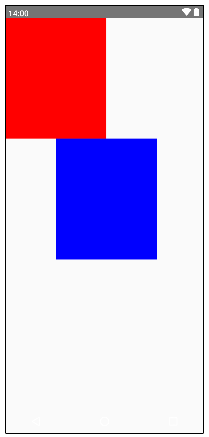

- [Jetpack Composeでよく使用するコンポーザブル関数の一覧](#jetpack-composeでよく使用するコンポーザブル関数の一覧)
  - [基本的なコンポーザブル関数](#基本的なコンポーザブル関数)
    - [Text](#text)
    - [Button](#button)
    - [IconButton](#iconbutton)
    - [Image](#image)
    - [Column](#column)
    - [Row](#row)
    - [Box](#box)
    - [BoxWithConstraints](#boxwithconstraints)
      - [レスポンシブレイアウトの作成](#レスポンシブレイアウトの作成)
      - [親のサイズの割合指定で子要素のサイズやオフセットを指定したい場合](#親のサイズの割合指定で子要素のサイズやオフセットを指定したい場合)
    - [HorizontalDivider](#horizontaldivider)
    - [VerticalDivider](#verticaldivider)
  - [インタラクティブなコンポーザブル関数](#インタラクティブなコンポーザブル関数)
    - [TextField](#textfield)
    - [Checkbox](#checkbox)
    - [Switch](#switch)
    - [Slider](#slider)
  - [その他の便利なコンポーザブル関数](#その他の便利なコンポーザブル関数)
    - [Card](#card)
    - [Scaffold](#scaffold)
    - [LazyColumn](#lazycolumn)
    - [LazyRow](#lazyrow)
    - [Surface](#surface)


# Jetpack Composeでよく使用するコンポーザブル関数の一覧

## 基本的なコンポーザブル関数

### Text

```kotlin
Text(text = "Hello, Jetpack Compose!")
```
テキストを表示するためのコンポーザブル。

### Button

```kotlin
Button(onClick = { /* Do something */ }) {
    Text("Click me")
}
```

ボタンを表示するためのコンポーザブル。

### IconButton

```kotlin
IconButton(onClick = { /* do something */ }) {
    Icon(
        Icons.Filled.Edit,
        contentDescription = "Localized description",
    )
}
```


### Image

```kotlin
Image(painter = painterResource(id = R.drawable.my_image), contentDescription = "My Image")
```
画像を表示するためのコンポーザブル。

### Column

```kotlin
Column {
    Text("First item")
    Text("Second item")
}
```
   垂直方向に子要素を配置するレイアウト。


### Row

```kotlin
Row {
    Text("First item")
    Text("Second item")
}
```

水平方向に子要素を配置するレイアウト。

### Box

```kotlin
Box {
    Text("Overlayed Text")
}
```
子要素を重ねて配置するレイアウト。


### BoxWithConstraints

基本的には Box コンポーザブルと同じで、子要素が重なって配置されます。


#### レスポンシブレイアウトの作成

```kotlin
BoxWithConstraints {
    val rectangleHeight = 100.dp
    if (maxHeight < rectangleHeight * 2) {
        // Box を縦に二つ並べるスペースがない場合は一つだけ配置する。
 
        Box(Modifier.size(50.dp, rectangleHeight).background(Color.Blue))
    } else {
        // Box を縦に二つ並べるスペースがある場合は二つ並べる。
 
        Column {
            Box(Modifier.size(50.dp, rectangleHeight).background(Color.Blue))
            Box(Modifier.size(50.dp, rectangleHeight).background(Color.Gray))
        }
    }
}
```

minWidth , maxWidth , minHeight , maxHeight といったパラメータを参照することが可能で、 BoxWithConstraints のサイズに応じて、子要素を動的に生成することが可能です。

BoxWithConstraints のサイズは、基本的には、その親のサイズにフィットするようになっているため、 Modifier の size , width , height ではサイズが変わりません。どうしてもサイズを変更したい場合は、 requiredSize や requiredWidth などで強制的にサイズを変更することが可能です。

BoxWithConstraints のブロック内で使用する minWidth と maxWidth プロパティは、どちらを使用しても同じ結果になることが多いですが、これは、 BoxWithConstraints に最小幅や最大幅の制約が指定されていないことが原因である可能性が高いです。最小値や最大値を指定するには、 Modifier.sizeIn(minWidth = 70.dp) や Modifier.sizeIn(maxWidth = 70.dp) を指定します。それらが指定されていないと、 minWidth プロパティや maxWidth プロパティは、 BoxWithConstraints の実際のサイズになると思われます。


#### 親のサイズの割合指定で子要素のサイズやオフセットを指定したい場合

```kotlin
@Composable
fun MyScreen() {
    BoxWithConstraints(
        modifier = Modifier.fillMaxSize()
    ) {
        val width = maxWidth
        val height = maxHeight

        Box(
            modifier = Modifier
                // 親の幅の 50% の幅、高さの 30% の高さのサイズ
                .size(width * 0.5f, height * 0.3f)
                .background(Color.Red)
        )
        Box(
            modifier = Modifier
                .size(width * 0.5f, height * 0.3f)
                // 親の左端から右へ 25% 、下へ 30% のオフセット
                .offset(x = width * 0.25f, y = height * 0.3f)
                .background(Color.Blue)
        )

    }
}
```




### HorizontalDivider

横線を引くには HorizontalDivider を使用します。

```kotlin
HorizontalDivider(
    modifier = Modifier
        .fillMaxWidth()
        .height(1.dp),
    color = Color.Black
)
```


### VerticalDivider

縦線を引くには VerticalDivider を使用します。

```kotlin
VerticalDivider(
    modifier = Modifier
        .fillMaxHeight()
        .width(1.dp),
    color = Color.Black
)
```


## インタラクティブなコンポーザブル関数

### TextField

```kotlin
var text by remember { mutableStateOf("") }
TextField(value = text, onValueChange = { text = it })
```
ユーザーがテキストを入力できるフィールド。


### Checkbox

```kotlin
var checked by remember { mutableStateOf(false) }
Checkbox(checked = checked, onCheckedChange = { checked = it })
```
チェックボックス。


### Switch

```kotlin
var checked by remember { mutableStateOf(false) }
Switch(checked = checked, onCheckedChange = { checked = it })
```
スイッチ。


### Slider

```kotlin
var sliderPosition by remember { mutableStateOf(0f) }
Slider(value = sliderPosition, onValueChange = { sliderPosition = it })
```
スライダー。


## その他の便利なコンポーザブル関数

### Card
```kotlin
Card {
    Text("This is a card")
}
```
カードのようなスタイルを持つコンポーネント。


### Scaffold

```kotlin
Scaffold(
    topBar = { TopAppBar(title = { Text("My App") }) },
    content = { /* Screen content */ }
)
```
マテリアルデザインの基本的な構造を提供。


### LazyColumn

```kotlin
LazyColumn {
    items(listOf("Item 1", "Item 2", "Item 3")) { item ->
        Text(item)
    }
}
```
パフォーマンスに優れた垂直方向のリスト表示。


### LazyRow

```kotlin
LazyRow {
    items(listOf("Item 1", "Item 2", "Item 3")) { item ->
        Text(item)
    }
}
```
パフォーマンスに優れた水平方向のリスト表示。


### Surface

```kotlin
Surface(color = MaterialTheme.colorScheme.background) {
    Text("Surface content")
}
```
マテリアルデザインのサーフェイス。
