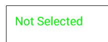
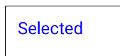

- [Jetpack Compose の Modifier 一覧](#jetpack-compose-の-modifier-一覧)
  - [padding](#padding)
  - [xxxPadding](#xxxpadding)
    - [使用方法](#使用方法)
    - [注意点](#注意点)
  - [background](#background)
  - [size](#size)
  - [sizeIn](#sizein)
  - [fillMaxWidth](#fillmaxwidth)
  - [fillMaxHeight](#fillmaxheight)
  - [fillMaxSize](#fillmaxsize)
  - [align](#align)
  - [weight](#weight)
  - [clickable](#clickable)
  - [border](#border)
  - [clip](#clip)
  - [offset](#offset)
  - [shadow](#shadow)
  - [aspectRatio](#aspectratio)
  - [wrapContentSize](#wrapcontentsize)
  - [toggleable](#toggleable)
  - [マージンはない](#マージンはない)
  - [公式ドキュメント](#公式ドキュメント)


# Jetpack Compose の Modifier 一覧

Jetpack ComposeのModifierは、UI要素の見た目や動作をカスタマイズするために使用されます。以下は、よく使われるModifierの一覧です：

## padding

コンポーネントの内側のスペースを設定します。

```kotlin
Modifier.padding(16.dp)
```

paddingFromBaseline と paddingFrom については、 [様々な padding](./様々な%20padding.md) を参照してください。


## xxxPadding

### 使用方法

`xxxPadding` は、パディングを設定する点では `padding` 修飾子と同じです。しかし、 `xxxPadding` は、システムが保持しているインセットを適用する場合に使用します。一方、 `padding` 修飾子は、自分で任意の大きさのパディングを設定する場合に使用します。

例えば、以下の 2 つのコードでは、どちらも同じ意味になります。ナビゲーションバーエリア (画面下部の一本線の部分) の高さを、システムから取得し、パディングとして設定するコードです。

```kotlin
// シュガーシンタックス
Box(modifier = Modifier.navigationBarsPadding()){

}

// 通常の記述方法
Box(modifier = Modifier.windowInsetsPadding(WindowInsets.navigationBars)){

}
```

これらは、インセットパディング修飾子と呼ばれます。詳しくは、 [こちら](../16.システム機能を利用する/1.ウィンドウインセット.md/#インセット-パディング修飾子) を参照して下さい。インセットパディング修飾子の一覧は、 [1.ウィンドウインセット](../16.システム機能を利用する) フォルダ内にある インセット一覧.xlsx を参照して下さい。


### 注意点

`xxxPadding` は、インセットを消費するのに対し、 `padding` は、インセットを消費しません。そのため、 Scaffold コンポーザブルのラムダブロック内など、インセットが消費されていない場所で `padding` を使用する場合は、 `consumeWindowInsets` と組み合わせて使用し、インセットを消費してあげる必要があります。

```kotlin
Scaffold { innerPadding ->
    Box(modifier = Modifier
        .padding(innerPadding)
        // インセットを明示的に消費する必要があります。
        // そうしないと、ネストされたコンポーザブルで、
        // インセットが重複して適用される場合があります。
        .consumeWindowInsets(innerPadding)
    ) {
    
    }
}
```


## background

コンポーネントの背景色や背景画像を設定します。

```kotlin
Modifier.background(Color.Blue)
```

## size

コンポーネントのサイズを設定します。

```kotlin
Modifier.size(100.dp)
```

`requireSize` 修飾子は、もし親のサイズより子のサイズの方が大きい場合でも子のサイズを無理やり適用させることのできる修飾子です。 (親の制約を無視します。)


## sizeIn

幅と高さの最小値と最大値を設定するのに使用します。


## fillMaxWidth

コンポーネントを親の幅いっぱいに広げます。

```kotlin
Modifier.fillMaxWidth()
```

## fillMaxHeight

コンポーネントを親の高さいっぱいに広げます。

```kotlin
Modifier.fillMaxHeight()
```

## fillMaxSize

コンポーネントを親のサイズいっぱいに広げます。

```kotlin
Modifier.fillMaxSize()
```

## align

コンポーネントの配置を設定します（例えば、親コンテナ内の位置）。

```kotlin
Modifier.align(Alignment.Center)
```

## weight

Row や Column の子要素に対して設定することで、幅や高さを空きスペースに対する比率で指定することが可能です。

```kotlin
Modifier.weight(1f)
```

LinearLayout の weight と同様の使い方です。

## clickable

コンポーネントをクリック可能にし、クリック時のアクションを設定します。

```kotlin
Modifier.clickable { /* Handle click */ }
```

## border

コンポーネントの境界線を設定します。

 ```kotlin
 Modifier.border(2.dp, Color.Black)
 ```

## clip

コンポーネントの形状を設定します（例えば、角を丸くする）。

 ```kotlin
 Modifier.clip(RoundedCornerShape(8.dp))
 ```

## offset

コンポーネントの位置を指定したピクセル数だけ移動します。

 ```kotlin
 Modifier.offset(10.dp, 20.dp)
 ```

要素のサイズ自体は変更されないため、要素が見切れる可能性があることに注意してください。

## shadow

コンポーネントに影を追加します。

 ```kotlin
 Modifier.shadow(4.dp)
 ```

## aspectRatio

コンポーネントのアスペクト比を設定します。

 ```kotlin
 Modifier.aspectRatio(1f)
 ```

## wrapContentSize

コンポーネントをコンテンツのサイズに合わせてラップします。

 ```kotlin
 Modifier.wrapContentSize()
 ```

これらのModifierを組み合わせることで、さまざまなデザイン要件に対応する柔軟なUIを作成できます。


## toggleable

Switch や Checkbox のようなトグル可能な UI コンポーネントを作成するのに使用すると便利です。

```kotlin
@Composable
fun ToggleableText() {
    var isSelected by remember { mutableStateOf(false) }

    Box(
        modifier = Modifier
            .padding(16.dp)
            .toggleable(
                value = isSelected,
                onValueChange = { isSelected = !isSelected },
                // role はセマンティクスに使用するらしい。
                // おそらく、読み上げ機能のことだと思われる。
                role = Role.Switch
            )
    ) {
        Text(
            text = if (isSelected) "Selected" else "Not Selected",
            fontSize = 24.sp,
            color = if (isSelected) Color.Blue else Color.Green
        )
    }
}
```





## マージンはない

Jetpack compose には、マージンを指定する要素は存在せず、パディングだけで余白を設定することになります。


## 公式ドキュメント

Modifier に指定できる既存の修飾子の一覧は以下にあります。

[修飾子の一覧](https://developer.android.com/develop/ui/compose/modifiers-list?hl=ja&_gl=1*jf45kl*_up*MQ..*_ga*MTE2MTIzOTExMy4xNzI0NjIxNDU1*_ga_6HH9YJMN9M*MTcyNDYzNzc1NC4zLjAuMTcyNDYzNzc1NC4wLjAuMA..)


