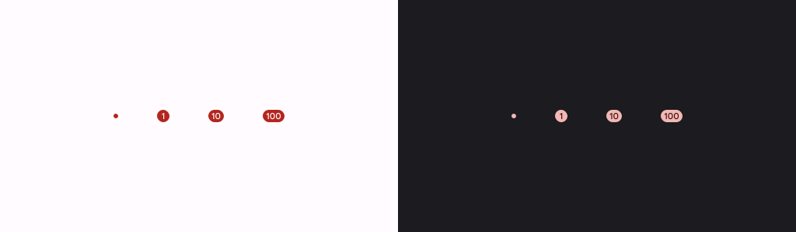

- [バッジ](#バッジ)
  - [注意](#注意)
  - [概要](#概要)
  - [API サーフェス](#api-サーフェス)
  - [基本的な例](#基本的な例)
  - [詳細な例](#詳細な例)
  - [参考情報](#参考情報)


# バッジ

## 注意

このドキュメントに記載されているバッジの実装では、バッジの表示位置を細かく指定することができない可能性があります。事前にその点をお客様に許容してもらえるようにお願いしましょう。

不具合も報告されており、怪しいコンポーザブルではあるが、使わないよりは使ったほうが便利なのかなとは思います。


## 概要

[バッジ](https://m3.material.io/components/badges/overview) を使用して、別のコンポーザブルのステータスまたは数値を示す小さな視覚要素を表示します。バッジを使用する一般的なシナリオをいくつか示します。

- **通知**: アプリ アイコンまたは通知ベルに未読通知の数を表示します。

- **メッセージ**: チャット アプリケーション内で新しいメッセージまたは未読メッセージを示します。

- **ステータス更新**: 「完了」、「進行中」、「失敗」などのタスクのステータスを表示します。

- **カート数量**: ユーザーのショッピング カート内のアイテム数を表示します。

- **新しいコンテンツ**: ユーザーが利用できる新しいコンテンツまたは機能を強調表示します。




## API サーフェス

アプリケーションにバッジを実装するには、 [BadgedBox](https://developer.android.com/reference/kotlin/androidx/compose/material3/package-summary?hl=ja&_gl=1*bh4wsu*_up*MQ..*_ga*NTY3MDY5MDA1LjE3MjQ2NTg1MjY.*_ga_6HH9YJMN9M*MTcyNTM2MzAyNi43LjAuMTcyNTM2MzAyNi4wLjAuMA..#BadgedBox(kotlin.Function1,androidx.compose.ui.Modifier,kotlin.Function1)) コンポーザブルを使用します。これは最終的にはコンテナです。次の 2 つの主なパラメータを使用して外観を制御します。

- `content`: バッジが付与される対象のオブジェクトを指定します。通常は何らかのアイコン ( Icon ) になります。
- `badge`: content の上にバッジとして表示されるコンポーザブル。通常は専用の Badge コンポーザブル。


## 基本的な例

次のコード スニペットは、BadgedBox の基本的な実装を示しています。

```kotlin
@Composable
fun BadgeExample() {
    BadgedBox(
        badge = {
            Badge()
        }
    ) {
        Icon(
            imageVector = Icons.Filled.Mail,
            contentDescription = "Email"
        )
    }
}
```

BadgedBox は、全体のコンテナーとして機能します。

BadgedBox の badge パラメーターの引数は Badge です。Badge には独自の引数がないため、アプリはデフォルトのバッジ (小さな赤い円) を表示します。

これを実行すると次のように表示されます。


重要: BadgedBox コンポーザブルの content スロットには、任意のコンポーザブルを渡すことができます。そのため、アイコン以外にも、任意のコンポーザブルにバッジを表示することが可能です。

**注意 : BadgedBox には、必ずサイズを数値で指定してください。** サイズを指定しなかった場合や、サイズに `modifier = Modifier.wrapContentSize()` を指定した場合は、以下の画像のようにバッジがクリップされてしまい、見切れが発生します。 (黒色の外枠はプレビュー時の枠なので気にしないでください。)


また、バッジは、 BadgedBox の右上の端に表示されます。そのため、 BadgedBox のサイズを大きくすれば、アイコンとバッジの距離が広がり、サイズを小さくすれば、アイコンとバッジの距離が狭まります。


## 詳細な例

次のスニペットは、ユーザーのアクションに応答する値をバッジに表示する方法を示しています。

```kotlin
@Composable
fun BadgeInteractiveExample() {
    var itemCount by remember { mutableStateOf(0) }

    Column(
        verticalArrangement = Arrangement.spacedBy(16.dp)
    ) {
        BadgedBox(
            badge = {
                if (itemCount > 0) {
                    Badge(
                        containerColor = Color.Red,
                        contentColor = Color.White
                    ) {
                        Text("$itemCount")
                    }
                }
            }
        ) {
            Icon(
                imageVector = Icons.Filled.ShoppingCart,
                contentDescription = "Shopping cart",
            )
        }
        Button(onClick = { itemCount++ }) {
            Text("Add item")
        }
    }
}
```

実行結果は以下のようになるとのことだが、 **実際にはバッジの赤丸の上部が少し見切れます。** BadgedBox に padding を設定すれば、この見切れを回避することはできるようです。


## 参考情報

- [資料 3 - バッジ](https://m3.material.io/components/badges/overview)
- [BadgedBox](https://developer.android.com/reference/kotlin/androidx/compose/material3/package-summary?hl=ja&_gl=1*1fp2gww*_up*MQ..*_ga*NTY3MDY5MDA1LjE3MjQ2NTg1MjY.*_ga_6HH9YJMN9M*MTcyNTM2MzAyNi43LjAuMTcyNTM2MzAyNi4wLjAuMA..#BadgedBox(kotlin.Function1,androidx.compose.ui.Modifier,kotlin.Function1))
- [Badge](https://developer.android.com/reference/kotlin/androidx/compose/material3/package-summary?hl=ja&_gl=1*1fp2gww*_up*MQ..*_ga*NTY3MDY5MDA1LjE3MjQ2NTg1MjY.*_ga_6HH9YJMN9M*MTcyNTM2MzAyNi43LjAuMTcyNTM2MzAyNi4wLjAuMA..#Badge(androidx.compose.ui.Modifier,androidx.compose.ui.graphics.Color,androidx.compose.ui.graphics.Color,kotlin.Function1))

