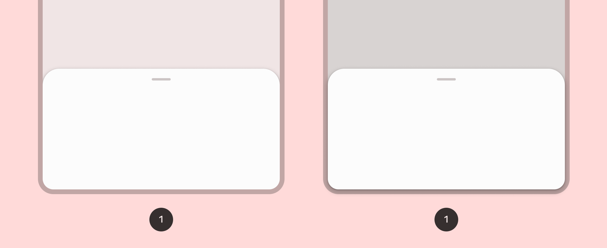

- [ボトムシート](#ボトムシート)


# ボトムシート



[ボトムシート](https://m3.material.io/components/bottom-sheets/overview) を実装する場合は、 [ModalBottomSheet](https://developer.android.com/reference/kotlin/androidx/compose/material3/package-summary?_gl=1*ig1emr*_up*MQ..*_ga*MTA0NTg2NTA1Mi4xNzI0NjU4NTI1*_ga_6HH9YJMN9M*MTcyNTE3OTU2Ni40LjAuMTcyNTE3OTU2Ni4wLjAuMA..#ModalBottomSheet(kotlin.Function0,androidx.compose.ui.Modifier,androidx.compose.material3.SheetState,androidx.compose.ui.unit.Dp,androidx.compose.ui.graphics.Shape,androidx.compose.ui.graphics.Color,androidx.compose.ui.graphics.Color,androidx.compose.ui.unit.Dp,androidx.compose.ui.graphics.Color,kotlin.Function0,androidx.compose.foundation.layout.WindowInsets,androidx.compose.material3.ModalBottomSheetProperties,kotlin.Function1)) コンポーザブルを使用できます。

`content` スロットは、 ColumnScope を持っています。 ColumnScope は、シートのコンテンツコンポーザブルを Column 内に配置してくれます。

```kotlin
ModalBottomSheet(onDismissRequest = { /* シートが非表示になる際に実行されます。 */ }) {
    // ボトムシートの content
}
```

プログラムによるシートの展開と折りたたみは、 [SheetState](https://developer.android.com/reference/kotlin/androidx/compose/material3/SheetState?_gl=1*b2mwx5*_up*MQ..*_ga*MTA0NTg2NTA1Mi4xNzI0NjU4NTI1*_ga_6HH9YJMN9M*MTcyNTE3OTU2Ni40LjAuMTcyNTE3OTU2Ni4wLjAuMA..) を使用して行われます。

[rememberModalBottomSheetState](https://developer.android.com/reference/kotlin/androidx/compose/material3/package-summary?_gl=1*8avbrs*_up*MQ..*_ga*MTA0NTg2NTA1Mi4xNzI0NjU4NTI1*_ga_6HH9YJMN9M*MTcyNTE3OTU2Ni40LjAuMTcyNTE3OTU2Ni4wLjAuMA..#rememberModalBottomSheetState(kotlin.Boolean,kotlin.Function1)) を使用すると、 ModalBottomSheet に渡す SheetState のインスタンスを作成できます。

SheetState は、 [show](https://developer.android.com/reference/kotlin/androidx/compose/material3/SheetState?_gl=1*3fgij2*_up*MQ..*_ga*MTA0NTg2NTA1Mi4xNzI0NjU4NTI1*_ga_6HH9YJMN9M*MTcyNTE3OTU2Ni40LjAuMTcyNTE3OTU2Ni4wLjAuMA..#show()) 関数、 [hide]() 関数、および現在のシート状態に関連するプロパティへのアクセスを提供します。
SheetState は、 [show](https://developer.android.com/reference/kotlin/androidx/compose/material3/SheetState?_gl=1*3fgij2*_up*MQ..*_ga*MTA0NTg2NTA1Mi4xNzI0NjU4NTI1*_ga_6HH9YJMN9M*MTcyNTE3OTU2Ni40LjAuMTcyNTE3OTU2Ni4wLjAuMA..#show()) 関数、 [hide](https://developer.android.com/reference/kotlin/androidx/compose/material3/SheetState?_gl=1*3fgij2*_up*MQ..*_ga*MTA0NTg2NTA1Mi4xNzI0NjU4NTI1*_ga_6HH9YJMN9M*MTcyNTE3OTU2Ni40LjAuMTcyNTE3OTU2Ni4wLjAuMA..#hide()) 関数、および現在のシート状態に関連するプロパティへのアクセスを提供します。

これらの suspend 関数には CoroutineScope (たとえば、rememberCoroutineScope を使用) が必要であり、UI イベントに応答して呼び出すことができます。

ボトムシートを非表示にするときは、必ず ModalBottomSheet をコンポジションから削除してください。

```kotlin
// この状態は、シートを現在表示中かどうかを確認するための状態。
// また、シートの開閉操作に必要なオブジェクト。
val sheetState = rememberModalBottomSheetState()
val scope = rememberCoroutineScope()
// この状態は、シートを表示するかどうかを決定するための状態
var showBottomSheet by remember { mutableStateOf(false) }
Scaffold(
    floatingActionButton = {
        ExtendedFloatingActionButton(
            text = { Text("Show bottom sheet") },
            icon = { Icon(Icons.Filled.Add, contentDescription = "") },
            onClick = {
                showBottomSheet = true
            }
        )
    }
) { contentPadding ->

    if (showBottomSheet) {
        ModalBottomSheet(
            onDismissRequest = {
                showBottomSheet = false
            },
            sheetState = sheetState
        ) {
            // ボトムシートのコンテンツ
            Button(onClick = {
                scope.launch { sheetState.hide() }.invokeOnCompletion {
                    if (!sheetState.isVisible) {
                        showBottomSheet = false
                    }
                }
            }) {
                Text("Hide bottom sheet")
            }
        }
    }
}
```

このコードは、ボトムシートの開閉状態に関する状態が二つ ( sheetState と showBottomSheet ) 存在するので、リファクタリングして、もっと簡潔なコードにできそうな気がするが、これ以上は簡潔にならないと思われる。

このコードでは、シート内にシートを閉じるボタンが存在する影響で、 sheetState の hide 関数や isVisible 関数が呼び出されてごちゃごちゃしているように感じる。ただし、シート内にシートを閉じるボタンが存在しなければ、 sheetState は、 ModalBottomSheet のパラメータに渡すだけで済むため、コードがすっきりします。 (なので、シート内には閉じるボタンを設置しないレイアウトの方が実装的には好ましい。)


