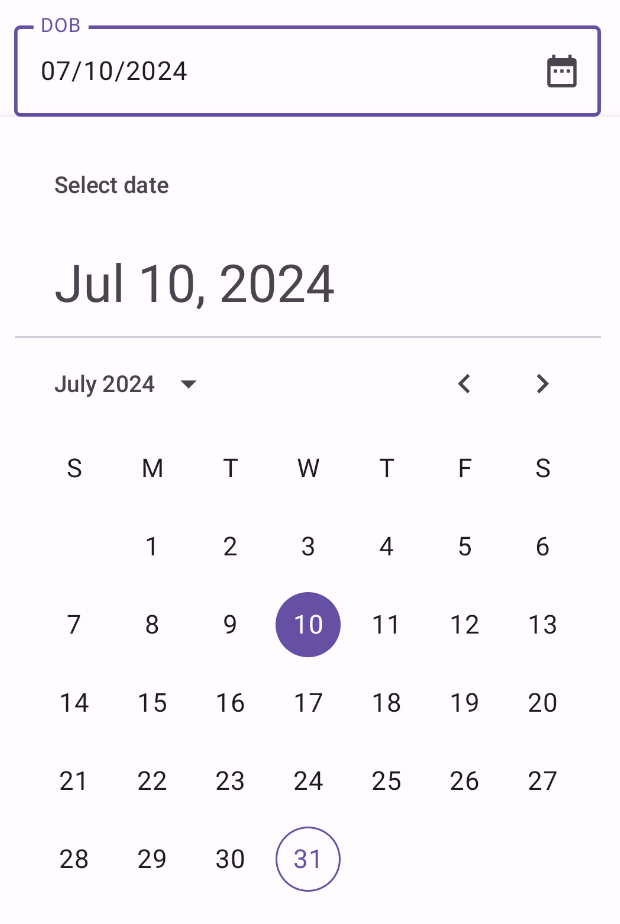
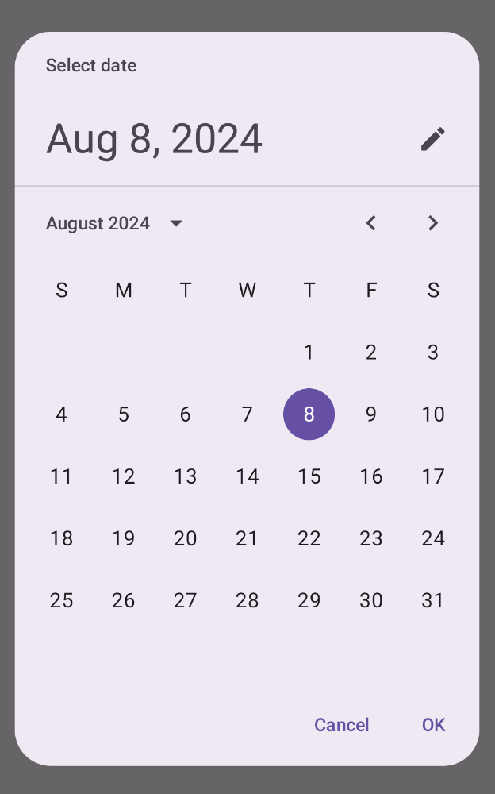
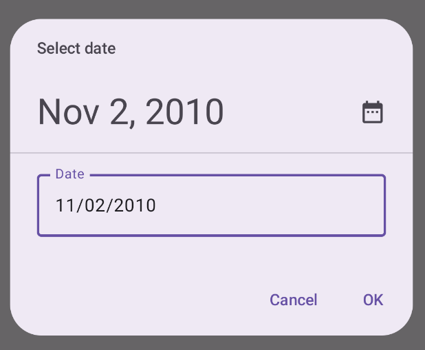
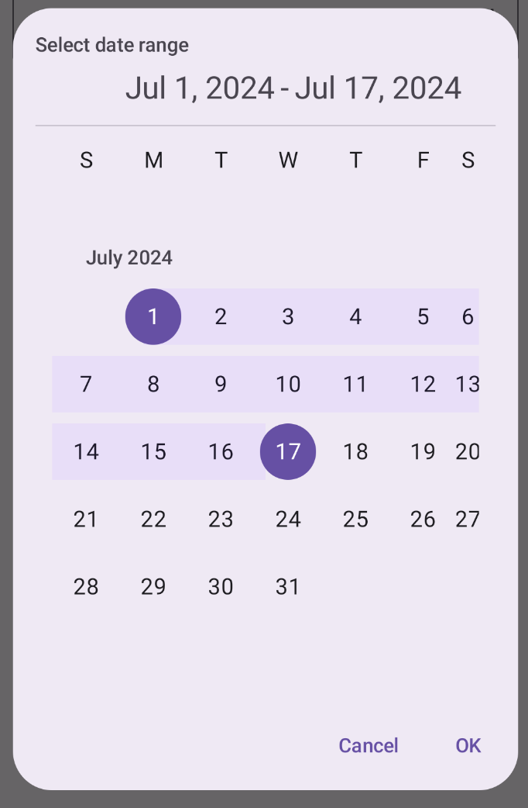

- [デートピッカー](#デートピッカー)
  - [型](#型)
  - [状態](#状態)
  - [ドッキングされたデートピッカー](#ドッキングされたデートピッカー)
    - [コードに関する主なポイント](#コードに関する主なポイント)
    - [結果](#結果)
  - [モーダル日付選択ツール](#モーダル日付選択ツール)
    - [コードに関する主なポイント](#コードに関する主なポイント-1)
    - [結果](#結果-1)
  - [入力モーダル日付選択ツール](#入力モーダル日付選択ツール)
    - [コードに関する主なポイント](#コードに関する主なポイント-2)
    - [結果](#結果-2)
  - [期間を選択する日付選択ツール](#期間を選択する日付選択ツール)
    - [コードに関する主なポイント](#コードに関する主なポイント-3)
    - [結果](#結果-3)
  - [選択した日付を使用する](#選択した日付を使用する)
  - [関連ドキュメント](#関連ドキュメント)


# デートピッカー

[日付ピッカー](https://m3.material.io/components/date-pickers/overview) を使用すると、ユーザーは日付、日付範囲、またはその両方を選択できます。カレンダー ダイアログまたはテキスト入力を使用して、ユーザーが日付を選択できるようにします。


## 型

日付ピッカーには 3 つの型があります。

- **ドッキング**: レイアウト内にインラインで表示されます。専用のダイアログが邪魔に感じるコンパクトなレイアウトに適しています。

- **モーダル**: ダイアログ形式で表示されるもののことです。これにより、日付の選択に明確な焦点が当てられます。

- **モーダル入力**: テキスト フィールドとモーダル日付ピッカーを組み合わせます。

次のコンポーザブルを使用して、これらの日付ピッカーをアプリに実装できます。

- [DatePicker](https://developer.android.com/reference/kotlin/androidx/compose/material3/package-summary?_gl=1*1dbfb9o*_up*MQ..*_ga*MTA0NTg2NTA1Mi4xNzI0NjU4NTI1*_ga_6HH9YJMN9M*MTcyNTE3OTU2Ni40LjAuMTcyNTE3OTU2Ni4wLjAuMA..#DatePicker(androidx.compose.material3.DatePickerState,androidx.compose.ui.Modifier,androidx.compose.material3.DatePickerFormatter,kotlin.Function0,kotlin.Function0,kotlin.Boolean,androidx.compose.material3.DatePickerColors)) : 日付ピッカーを生成するコンポーザブルです。ドッキング型、モーダル型、モーダル入力型のどの日付ピッカーの場合も、このコンポーザブルを使用します。どの型になるかは、使用するコンテナーによって決まります。

- [DatePickerDialog](https://developer.android.com/reference/kotlin/androidx/compose/material3/package-summary?_gl=1*1ffvzev*_up*MQ..*_ga*MTA0NTg2NTA1Mi4xNzI0NjU4NTI1*_ga_6HH9YJMN9M*MTcyNTE3OTU2Ni40LjAuMTcyNTE3OTU2Ni4wLjAuMA..#DatePickerDialog(kotlin.Function0,kotlin.Function0,androidx.compose.ui.Modifier,kotlin.Function0,androidx.compose.ui.graphics.Shape,androidx.compose.ui.unit.Dp,androidx.compose.material3.DatePickerColors,androidx.compose.ui.window.DialogProperties,kotlin.Function1)) : モーダル型とモーダル入力型の日付ピッカーを実装するために使用するコンテナです。

- [DateRangePicker](https://developer.android.com/reference/kotlin/androidx/compose/material3/package-summary?_gl=1*1ffvzev*_up*MQ..*_ga*MTA0NTg2NTA1Mi4xNzI0NjU4NTI1*_ga_6HH9YJMN9M*MTcyNTE3OTU2Ni40LjAuMTcyNTE3OTU2Ni4wLjAuMA..#DateRangePicker(androidx.compose.material3.DateRangePickerState,androidx.compose.ui.Modifier,androidx.compose.material3.DatePickerFormatter,kotlin.Function0,kotlin.Function0,kotlin.Boolean,androidx.compose.material3.DatePickerColors)) : ユーザーが開始日と終了日を含む範囲を選択できる日付ピッカーです。

**注: DatePicker、DatePickerDialog、および DateRangePicker は試験段階です。**問題がある場合は、問題追跡ツールに報告してください。


## 状態

さまざまな日付ピッカー コンポーザブルに共通する主要なパラメータは状態です。これは、 [DatePickerState](https://developer.android.com/reference/kotlin/androidx/compose/material3/package-summary?_gl=1*1aub6hd*_up*MQ..*_ga*MTA0NTg2NTA1Mi4xNzI0NjU4NTI1*_ga_6HH9YJMN9M*MTcyNTE3OTU2Ni40LjAuMTcyNTE3OTU2Ni4wLjAuMA..#DatePickerState(androidx.compose.material3.CalendarLocale,kotlin.Long,kotlin.Long,kotlin.ranges.IntRange,androidx.compose.material3.DisplayMode,androidx.compose.material3.SelectableDates)) オブジェクトまたは [DateRangePickerState](https://developer.android.com/reference/kotlin/androidx/compose/material3/DateRangePickerState?_gl=1*1aub6hd*_up*MQ..*_ga*MTA0NTg2NTA1Mi4xNzI0NjU4NTI1*_ga_6HH9YJMN9M*MTcyNTE3OTU2Ni40LjAuMTcyNTE3OTU2Ni4wLjAuMA..) オブジェクトのいずれかを取ります。これらのプロパティは、日付ピッカーを使用したユーザーの選択に関する情報 (現在選択されている日付など) を取得します。

選択した日付を活用する方法の詳細については、 [「選択した日付を使用する」](#選択した日付を使用する) セクションを参照してください。


## ドッキングされたデートピッカー

次の例では、ユーザーに生年月日の入力を求めるテキスト フィールドがあります。フィールド内のカレンダー アイコンをクリックすると、入力フィールドの下にドッキングされた日付ピッカーが開きます。

```kotlin
@Composable
fun DatePickerDocked() {
    var showDatePicker by remember { mutableStateOf(false) }
    val datePickerState = rememberDatePickerState()
    val selectedDate = datePickerState.selectedDateMillis?.let {
        convertMillisToDate(it)
    } ?: ""

    Box(
        modifier = Modifier.fillMaxWidth()
    ) {
        OutlinedTextField(
            value = selectedDate,
            onValueChange = { },
            label = { Text("DOB") },
            readOnly = true,
            trailingIcon = {
                IconButton(onClick = { showDatePicker = !showDatePicker }) {
                    Icon(
                        imageVector = Icons.Default.DateRange,
                        contentDescription = "Select date"
                    )
                }
            },
            modifier = Modifier
                .fillMaxWidth()
                .height(64.dp)
        )

        if (showDatePicker) {
            Popup(
                onDismissRequest = { showDatePicker = false },
                alignment = Alignment.TopStart
            ) {
                Box(
                    modifier = Modifier
                        .fillMaxWidth()
                        .offset(y = 64.dp)
                        .shadow(elevation = 4.dp)
                        .background(MaterialTheme.colorScheme.surface)
                        .padding(16.dp)
                ) {
                    DatePicker(
                        state = datePickerState,
                        showModeToggle = false
                    )
                }
            }
        }
    }
}

// ミリ秒で与えられた時刻を MM/dd/yyyy 形式に変換する。
fun convertMillisToDate(millis: Long): String {
    val formatter = SimpleDateFormat("MM/dd/yyyy", Locale.getDefault())
    return formatter.format(Date(millis))
}
```


### コードに関する主なポイント

- ユーザーが IconButton をクリックすると、日付ピッカーが表示されます。
  - アイコン ボタンは、OutlinedTextField の trailingIcon パラメータの引数として機能します。
  - showDatePicker 状態変数は、ドッキングされた日付ピッカーの表示を制御します。
- 日付ピッカーのコンテナーは Popup コンポーザブルで、他の要素のレイアウトに影響を与えずにコンテンツをオーバーレイします。
- selectedDate は、DatePickerState オブジェクトから選択された日付の値を取得し、convertMillisToDate 関数を使用して書式設定します。
- 選択された日付はテキスト フィールドに表示されます。
- 日付ピッカーは、オフセット修飾子を使用してテキスト フィールドの下に配置されます。
- テキスト フィールドと日付ピッカーを適切に重ね合わせるために、Box がルート コンテナーとして使用されます。
- ユーザーが日付ピッカーから日付を選択すると、その値はすぐに DatePickerState に設定されます。


### 結果

カレンダー アイコンをクリックすると、この実装は次のようになります。




## モーダル日付選択ツール

モーダル日付ピッカーは、画面上に浮かぶダイアログを表示します。これを実装するには、DatePickerDialog を作成し、それに DatePicker を渡します。

```kotlin
@Composable
fun DatePickerModal(
    onDateSelected: (Long?) -> Unit,
    onDismiss: () -> Unit
) {
    val datePickerState = rememberDatePickerState()

    DatePickerDialog(
        onDismissRequest = onDismiss,
        confirmButton = {
            TextButton(onClick = {
                onDateSelected(datePickerState.selectedDateMillis)
                onDismiss()
            }) {
                Text("OK")
            }
        },
        dismissButton = {
            TextButton(onClick = onDismiss) {
                Text("Cancel")
            }
        }
    ) {
        DatePicker(state = datePickerState)
    }
}
```

### コードに関する主なポイント

- DatePickerModal コンポーザブル関数は、モーダル日付ピッカーを表示します。
- onDateSelected ラムダ式は、ユーザーが日付を選択すると実行されます。
  - 選択された日付を親コンポーザブルに公開します。
- onDismiss ラムダ式は、ユーザーがダイアログを閉じると実行されます。


### 結果

この実装は次のようになります。




## 入力モーダル日付選択ツール

入力機能付きのモーダル日付ピッカーは、画面上に浮かぶダイアログを表示し、ユーザーが日付を入力できるようにします。

```kotlin
@Composable
fun DatePickerModalInput(
    onDateSelected: (Long?) -> Unit,
    onDismiss: () -> Unit
) {
    // モーダルデートピッカーとの違いはここだけ。
    // initialDisplayMode パラメータに DisplayMode.Input をセットしている点だけです。 
    val datePickerState = rememberDatePickerState(initialDisplayMode = DisplayMode.Input)

    DatePickerDialog(
        onDismissRequest = onDismiss,
        confirmButton = {
            TextButton(onClick = {
                onDateSelected(datePickerState.selectedDateMillis)
                onDismiss()
            }) {
                Text("OK")
            }
        },
        dismissButton = {
            TextButton(onClick = onDismiss) {
                Text("Cancel")
            }
        }
    ) {
        DatePicker(state = datePickerState)
    }
}
```


### コードに関する主なポイント

これは、モーダル日付ピッカーの例とほぼ同じです。主な違いは次のとおりです。

- initialDisplayMode パラメータは、初期表示モードを DisplayMode.Input に設定します。


### 結果




## 期間を選択する日付選択ツール

ユーザーが開始日と終了日の間の範囲を選択できる日付ピッカーを作成できます。そのためには、 [DateRangePicker](https://developer.android.com/reference/kotlin/androidx/compose/material3/package-summary?_gl=1*1cs3832*_up*MQ..*_ga*MTA0NTg2NTA1Mi4xNzI0NjU4NTI1*_ga_6HH9YJMN9M*MTcyNTE3OTU2Ni40LjAuMTcyNTE3OTU2Ni4wLjAuMA..#DateRangePicker(androidx.compose.material3.DateRangePickerState,androidx.compose.ui.Modifier,androidx.compose.material3.DatePickerFormatter,kotlin.Function0,kotlin.Function0,kotlin.Boolean,androidx.compose.material3.DatePickerColors)) を使用します。

DateRangePicker の使用方法は、基本的に DatePicker と同じです。PopUp の子に設定して、ドッキングされたピッカーとして使用することもできますし、 DatePickerDialog の子に設定して、モーダルピッカーとして使用することもできます。 **主な違いは、DatePickerState ではなく [DateRangePickerState](https://developer.android.com/reference/kotlin/androidx/compose/material3/DateRangePickerState?_gl=1*1tvw9u8*_up*MQ..*_ga*MTA0NTg2NTA1Mi4xNzI0NjU4NTI1*_ga_6HH9YJMN9M*MTcyNTE3OTU2Ni40LjAuMTcyNTE3OTU2Ni4wLjAuMA..) を使用することです。**

次のスニペットは、範囲を持つモーダル日付ピッカーを作成する方法を示しています。

```kotlin
@Composable
fun DateRangePickerModal(
    onDateRangeSelected: (Pair<Long?, Long?>) -> Unit,
    onDismiss: () -> Unit
) {
    val dateRangePickerState = rememberDateRangePickerState()

    DatePickerDialog(
        onDismissRequest = onDismiss,
        confirmButton = {
            TextButton(
                onClick = {
                    onDateRangeSelected(
                        Pair(
                            dateRangePickerState.selectedStartDateMillis,
                            dateRangePickerState.selectedEndDateMillis
                        )
                    )
                    onDismiss()
                }
            ) {
                Text("OK")
            }
        },
        dismissButton = {
            TextButton(onClick = onDismiss) {
                Text("Cancel")
            }
        }
    ) {
        DateRangePicker(
            state = dateRangePickerState,
            title = {
                Text(
                    text = "Select date range"
                )
            },
            showModeToggle = false,
            modifier = Modifier
                .fillMaxWidth()
                .height(500.dp)
                .padding(16.dp)
        )
    }
}
```


### コードに関する主なポイント

- onDateRangeSelected パラメータは、選択された開始日と終了日を表す `Pair<Long?, Long?>` を受け取るコールバックです。これにより、親コンポーザブルは選択された範囲にアクセスできるようになります。
- rememberDateRangePickerState() は、日付範囲ピッカーの状態を作成します。
- DatePickerDialog は、モーダル ダイアログ コンテナを作成します。
- OK ボタンの onClick ハンドラーでは、onDateRangeSelected を通じて、選択された範囲を親コンポーザブルに渡します。
- DateRangePicker コンポーザブルは、ダイアログ コンテンツとして機能します。
- DateRangePicker コンポーザブルの showModeToggle パラメータが false の場合は、カレンダーからの選択モードの一択となりますが、 true の場合は、右上に鉛筆のアイコンが表示され、それをタップすると、カレンダーからの選択モードとキーボードからの入力モードの切り替えが可能になります。


### 結果

この実装は次のようになります。



上記の画像を見てもわかる通り、土曜日の横幅が狭くなっていたり、モーダル上部の 「選択した日付をテキストで表示するエリア」 の左右の余白の大きさが違っていたりと、 **2024 年 9 月時点では、不具合が残っているようです。**


## 選択した日付を使用する

選択された日付を取得するには、親コンポーザブルで Long として追跡し、onDateSelected で DatePicker に値を渡します。次のスニペットはこれを示していますが、完全な実装は [公式スニペットアプリ](https://github.com/android/snippets/tree/main/compose/snippets/src/main/java/com/example/compose/snippets) で確認できます。

```kotlin
// ...
    var selectedDate by remember { mutableStateOf<Long?>(null) }
// ...
        if (selectedDate != null) {
            val date = Date(selectedDate!!)
            val formattedDate = SimpleDateFormat("MMM dd, yyyy", Locale.getDefault()).format(date)
            Text("Selected date: $formattedDate")
        } else {
            Text("No date selected")
        }
// ...
        DatePickerModal(
            onDateSelected = {
                // コールバックでは、値を状態に設定するだけです。
                // 状態が更新されると再コンポーズが実施されるため、画面を更新することができます。
                selectedDate = it
                showModal = false
            },
            onDismiss = { showModal = false }
        )
    }
// ...
```

範囲指定の日付ピッカーにも基本的に同じことが当てはまりますが、開始値と終了値を取得するには `Pair<Long?, Long?>` またはデータ クラスを使用する必要があります。

**重要**: 選択した日付に Long を使用する代わりに、親コンポーザブルから子に状態オブジェクト自体を渡すこともできます。そうすることで、親の完全な状態を取得できます。


## 関連ドキュメント

- [マテリアル デザインの日付選択ツール](https://m3.material.io/components/date-pickers/overview)
- [タイムピッカー](./15.時刻選択ツール/1.概要.md)


