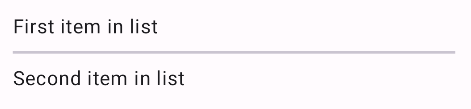

- [分割線](#分割線)
  - [API サーフェス](#api-サーフェス)
  - [水平分割線の例](#水平分割線の例)
  - [縦方向の分割線の例](#縦方向の分割線の例)
  - [参考情報](#参考情報)


# 分割線

[区切り線](https://m3.material.io/components/divider/overview) は、リストやその他のコンテナ内の項目を区切る細い線です。 Horizo​​ntalDivider および VerticalDivider コンポーザブルを使用して、アプリに区切り線を実装できます。

- [Horizo​​ntalDivider](https://developer.android.com/reference/kotlin/androidx/compose/material3/package-summary?_gl=1*1nq8ieg*_up*MQ..*_ga*MTA0NTg2NTA1Mi4xNzI0NjU4NTI1*_ga_6HH9YJMN9M*MTcyNTE3OTU2Ni40LjAuMTcyNTE3OTU2Ni4wLjAuMA..#HorizontalDivider(androidx.compose.ui.Modifier,androidx.compose.ui.unit.Dp,androidx.compose.ui.graphics.Color)) : 列内の項目を区切ります。
- [VerticalDivider](https://developer.android.com/reference/kotlin/androidx/compose/material3/package-summary?_gl=1*1nq8ieg*_up*MQ..*_ga*MTA0NTg2NTA1Mi4xNzI0NjU4NTI1*_ga_6HH9YJMN9M*MTcyNTE3OTU2Ni40LjAuMTcyNTE3OTU2Ni4wLjAuMA..#VerticalDivider(androidx.compose.ui.Modifier,androidx.compose.ui.unit.Dp,androidx.compose.ui.graphics.Color)) : 行内の項目を区切ります。


## API サーフェス

両方のコンポーネントには、外観を変更するためのパラメータが用意されています。

- `thickness` : このパラメータを使用して、区切り線の太さを指定します。
- `color` : このパラメータを使用して、区切り線の色を指定します。

参考 : 修飾子パラメータを使用してパディングを制御できます。


## 水平分割線の例

次の例は、Horizo​​ntalDivider コンポーネントの実装を示しています。thickness パラメータを使用して、線の高さを制御します。

```kotlin
@Composable
fun HorizontalDividerExample() {
    Column(
        verticalArrangement = Arrangement.spacedBy(8.dp),
    ) {
        Text("First item in list")
        HorizontalDivider(thickness = 2.dp)
        Text("Second item in list")
    }
}
```

この実装では、2 つのテキスト コンポーネント間に細い水平線がレンダリングされます。




## 縦方向の分割線の例

次の例は、VerticalDivider コンポーネントの実装を示しています。この例では、color パラメータを使用して、線のカスタム色を指定します。

```kotlin
@Composable
fun VerticalDividerExample() {
    Row(
        modifier = Modifier
            .fillMaxWidth()
            .height(IntrinsicSize.Min),
        horizontalArrangement = Arrangement.SpaceEvenly
    ) {
        Text("First item in row")
        VerticalDivider(color = MaterialTheme.colorScheme.secondary)
        Text("Second item in row")
    }
}
```

この実装では、2 つのテキスト コンポーネント間に細い垂直線がレンダリングされます。


## 参考情報

- [HorizontalDivider](https://developer.android.com/reference/kotlin/androidx/compose/material3/package-summary?_gl=1*15hpyo3*_up*MQ..*_ga*MTA0NTg2NTA1Mi4xNzI0NjU4NTI1*_ga_6HH9YJMN9M*MTcyNTE3OTU2Ni40LjAuMTcyNTE3OTU2Ni4wLjAuMA..#HorizontalDivider(androidx.compose.ui.Modifier,androidx.compose.ui.unit.Dp,androidx.compose.ui.graphics.Color))
- [VerticalDivider](https://developer.android.com/reference/kotlin/androidx/compose/material3/package-summary?_gl=1*15hpyo3*_up*MQ..*_ga*MTA0NTg2NTA1Mi4xNzI0NjU4NTI1*_ga_6HH9YJMN9M*MTcyNTE3OTU2Ni40LjAuMTcyNTE3OTU2Ni4wLjAuMA..#VerticalDivider(androidx.compose.ui.Modifier,androidx.compose.ui.unit.Dp,androidx.compose.ui.graphics.Color))
- [Material Design - Dividers](https://m3.material.io/components/divider)

