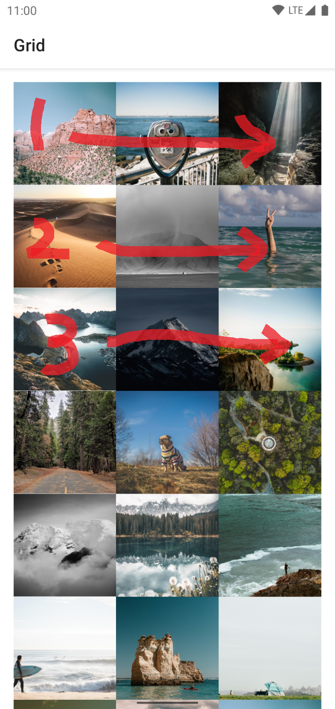
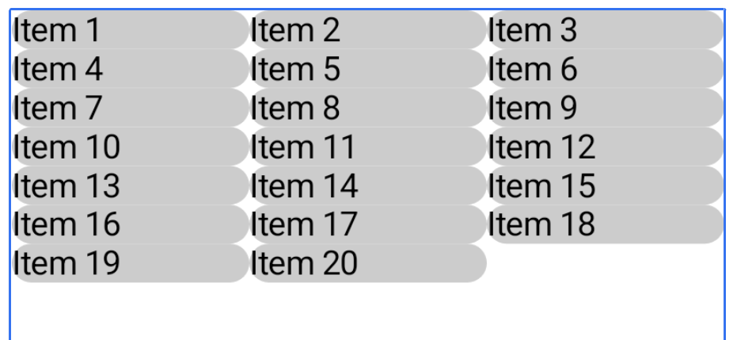
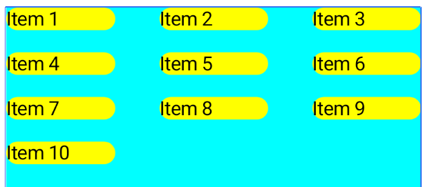
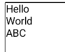
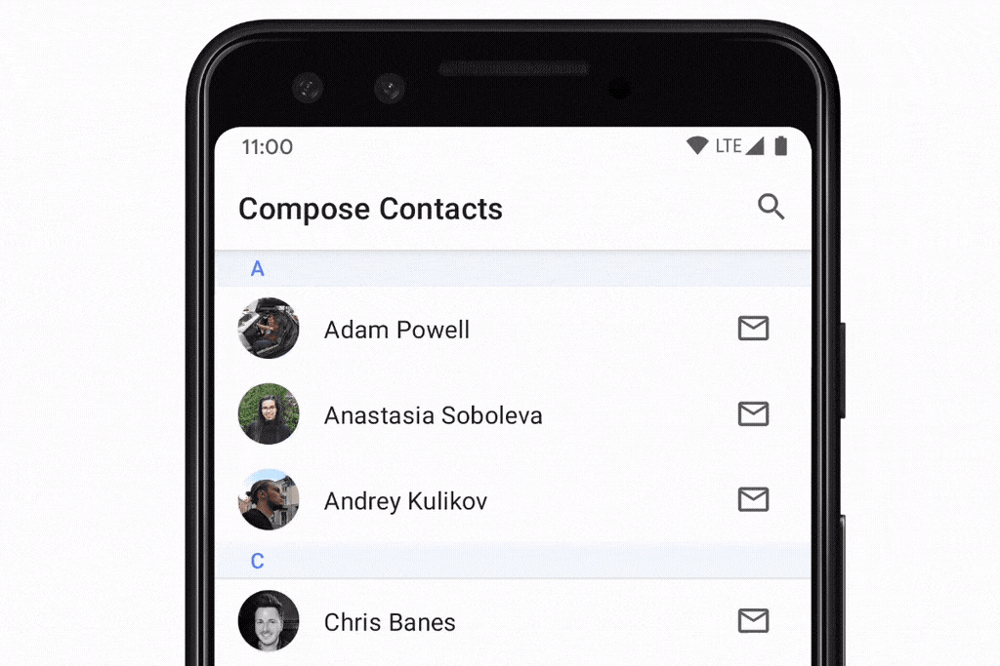
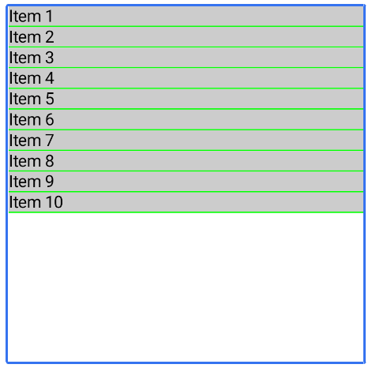
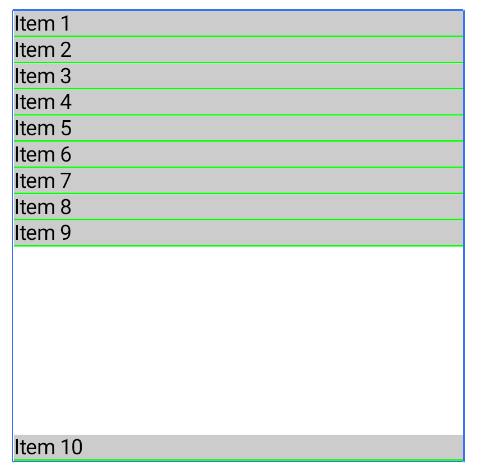

- [リストとグリッド](#リストとグリッド)
  - [Lazy リスト](#lazy-リスト)
  - [LazyListScope DSL](#lazylistscope-dsl)
  - [Lazy グリッド](#lazy-グリッド)
    - [アイテムの幅や高さの指定](#アイテムの幅や高さの指定)
    - [GridCells.Adaptive](#gridcellsadaptive)
    - [GridCells.Fixed](#gridcellsfixed)
    - [span（列の結合）](#span列の結合)
  - [Lazy スタッガードグリッド](#lazy-スタッガードグリッド)
  - [コンテンツのパディング](#コンテンツのパディング)
    - [【注意】Modifire.padding を使用した場合](#注意modifirepadding-を使用した場合)
  - [コンテンツの間隔](#コンテンツの間隔)
  - [アイテムのキー](#アイテムのキー)
  - [アイテム アニメーション](#アイテム-アニメーション)
  - [固定ヘッダー（試験運用版）](#固定ヘッダー試験運用版)
  - [スクロール位置への反応](#スクロール位置への反応)
    - [snapshotFlow の活用](#snapshotflow-の活用)
  - [スクロール位置の制御](#スクロール位置の制御)
  - [大規模なデータセット（ページング）](#大規模なデータセットページング)
  - [Lazy レイアウトを使用するためのヒント](#lazy-レイアウトを使用するためのヒント)
    - [0 ピクセルサイズのアイテムを使用しない](#0-ピクセルサイズのアイテムを使用しない)
    - [同じ方向にスクロールできるコンポーネントをネストしない](#同じ方向にスクロールできるコンポーネントをネストしない)
    - [1 つのアイテムに複数の要素を配置する場合は気をつける](#1-つのアイテムに複数の要素を配置する場合は気をつける)
    - [カスタム配置の使用を検討する](#カスタム配置の使用を検討する)
    - [contentType の追加を検討する](#contenttype-の追加を検討する)
    - [パフォーマンスの測定](#パフォーマンスの測定)
  - [LazyRow のコンテンツの幅を親に対する割合で指定する](#lazyrow-のコンテンツの幅を親に対する割合で指定する)


# リストとグリッド

多くのアプリでは、アイテムのコレクションを表示する必要があります。このドキュメントでは、Jetpack Compose でこれを効率的に行う方法について説明します。

スクロールが不要なユースケースの場合は、 シンプルな Column または Row（方向に応じて）を使用し、各アイテムのコンテンツを 次のようにリストを反復処理します。

```kotlin
@Composable
fun MessageList(messages: List<Message>) {
    Column {
        messages.forEach { message ->
            MessageRow(message)
        }
    }
}
```

`verticalScroll()` 修飾子を使用すると、Column をスクロール可能にすることができます。


## Lazy リスト

**多数のアイテム（または長さが不明なリスト）を表示する必要がある場合、Column などのレイアウトを使用するとパフォーマンスの問題が発生します。これは、表示されるかどうかにかかわらず、すべてのアイテムについてコンポーズと配置が行われるためです。**

Compose には、コンポーネントのビューポートに表示されるアイテムのみをコンポーズして配置するコンポーネントが複数用意されています。これらのコンポーネントには、 [LazyColumn](https://developer.android.com/reference/kotlin/androidx/compose/foundation/lazy/package-summary?hl=ja&_gl=1*1fg41ca*_up*MQ..*_ga*NTY3MDY5MDA1LjE3MjQ2NTg1MjY.*_ga_6HH9YJMN9M*MTcyNTQzNTQ0NC45LjAuMTcyNTQzNTQ0NC4wLjAuMA..#LazyColumn(androidx.compose.ui.Modifier,androidx.compose.foundation.lazy.LazyListState,androidx.compose.foundation.layout.PaddingValues,kotlin.Boolean,androidx.compose.foundation.layout.Arrangement.Vertical,androidx.compose.ui.Alignment.Horizontal,androidx.compose.foundation.gestures.FlingBehavior,kotlin.Boolean,kotlin.Function1)) や [LazyRow](https://developer.android.com/reference/kotlin/androidx/compose/foundation/lazy/package-summary?hl=ja&_gl=1*1iuvtgj*_up*MQ..*_ga*NTY3MDY5MDA1LjE3MjQ2NTg1MjY.*_ga_6HH9YJMN9M*MTcyNTQzNTQ0NC45LjAuMTcyNTQzNTQ0NC4wLjAuMA..#LazyRow(androidx.compose.ui.Modifier,androidx.compose.foundation.lazy.LazyListState,androidx.compose.foundation.layout.PaddingValues,kotlin.Boolean,androidx.compose.foundation.layout.Arrangement.Horizontal,androidx.compose.ui.Alignment.Vertical,androidx.compose.foundation.gestures.FlingBehavior,kotlin.Boolean,kotlin.Function1)) などがあります。

注: これらのコンポーネントは、RecyclerView ウィジェットと同じ原則に従います。

名前が示すように、 LazyColumn と LazyRow は、アイテムを配置してスクロールする方向が異なります。LazyColumn は縦方向にスクロールするリストを生成し、LazyRow は横方向にスクロールするリストを生成します。

Lazy コンポーネントは、ほとんどの Compose のレイアウトと異なります。 Lazy コンポーネントでは、アプリがコンポーザブルを直接出力できるようにするため、 @Composable コンテンツ ブロック パラメータを受け入れるのではなく、 LazyListScope.() ブロックを提供します。この LazyListScope ブロックは、アプリがアイテムのコンテンツを記述できるようにする DSL (詳細は次のセクション参照) を提供します。 Lazy コンポーネントはその後、レイアウトとスクロールの位置で必要とされる各アイテムのコンテンツを追加します。


## LazyListScope DSL

[LazyListScope](https://developer.android.com/reference/kotlin/androidx/compose/foundation/lazy/LazyListScope?hl=ja&_gl=1*1davs3l*_up*MQ..*_ga*NTY3MDY5MDA1LjE3MjQ2NTg1MjY.*_ga_6HH9YJMN9M*MTcyNTQzNTQ0NC45LjAuMTcyNTQzNTQ0NC4wLjAuMA..) の DSL には、レイアウト内のアイテムを記述するためのさまざまな関数が用意されています。基本的には、 [item()](https://developer.android.com/reference/kotlin/androidx/compose/foundation/lazy/LazyListScope?hl=ja&_gl=1*1fg41ca*_up*MQ..*_ga*NTY3MDY5MDA1LjE3MjQ2NTg1MjY.*_ga_6HH9YJMN9M*MTcyNTQzNTQ0NC45LjAuMTcyNTQzNTQ0NC4wLjAuMA..#item(kotlin.Any,kotlin.Any,kotlin.Function1)) では単一のアイテムを追加し、 [items(Int)](https://developer.android.com/reference/kotlin/androidx/compose/foundation/lazy/LazyListScope?hl=ja&_gl=1*1fg41ca*_up*MQ..*_ga*NTY3MDY5MDA1LjE3MjQ2NTg1MjY.*_ga_6HH9YJMN9M*MTcyNTQzNTQ0NC45LjAuMTcyNTQzNTQ0NC4wLjAuMA..#items(kotlin.Int,kotlin.Function1,kotlin.Function1,kotlin.Function2)) では複数のアイテムを追加します。

```kotlin
LazyColumn {
    // Add a single item
    item {
        Text(text = "First item")
    }

    // Add 5 items
    items(5) { index ->
        Text(text = "Item: $index")
    }

    // Add another single item
    item {
        Text(text = "Last item")
    }
}
```

また、List など、アイテムのコレクションを追加できる拡張関数も多数あります。この拡張関数を使用すると、以下の Column を使用したコードを LazyColumn を使用したコードに変更することが可能です。

```kotlin
@Composable
fun MessageList(messages: List<Message>) {
    Column {
        messages.forEach { message ->
            MessageRow(message)
        }
    }
}
```

LazyColumn を使用して書き換えたコードは以下です。

```kotlin
import androidx.compose.foundation.lazy.items

LazyColumn {
    // 引数に List 型の messages を受け取ることも可能です。
    // 【注意】この関数を使用するには、上記の import 文が必要です。
    items(messages) { message ->
        MessageRow(message)
    }
}
```

また、インデックスを提供する [itemsIndexed()](https://developer.android.com/reference/kotlin/androidx/compose/foundation/lazy/package-summary?hl=ja&_gl=1*13w68r5*_up*MQ..*_ga*NTY3MDY5MDA1LjE3MjQ2NTg1MjY.*_ga_6HH9YJMN9M*MTcyNTQzNTQ0NC45LjAuMTcyNTQzNTQ0NC4wLjAuMA..#(androidx.compose.foundation.lazy.LazyListScope).itemsIndexed(kotlin.collections.List,kotlin.Function2,kotlin.Function2,kotlin.Function3)) と呼ばれる items() 拡張関数のバリアントも用意されています。

```kotlin
import androidx.compose.foundation.layout.padding
import androidx.compose.foundation.lazy.itemsIndexed
import androidx.compose.ui.Modifier
import androidx.compose.ui.unit.dp

LazyColumn {
    itemsIndexed(messages) { index, message ->
        val modifier = when (index) {
            // 最初のアイテムは Bottom にのみパディング
            0 -> Modifier.padding(bottom = 8.dp)
            // 最後のアイテムは Top にのみパディング
            messages.size - 1 -> Modifier.padding(top = 8.dp)
            // それ以外のアイテムは Top と Bottom にパディング
            else -> Modifier.padding(vertical = 8.dp)
        }
        MessageRow(message, modifier)
    }
}
```

詳細については、 [LazyListScope](https://developer.android.com/reference/kotlin/androidx/compose/foundation/lazy/LazyListScope?hl=ja&_gl=1*13w68r5*_up*MQ..*_ga*NTY3MDY5MDA1LjE3MjQ2NTg1MjY.*_ga_6HH9YJMN9M*MTcyNTQzNTQ0NC45LjAuMTcyNTQzNTQ0NC4wLjAuMA..) のリファレンスをご覧ください。


## Lazy グリッド

[LazyVerticalGrid](https://developer.android.com/reference/kotlin/androidx/compose/foundation/lazy/grid/package-summary?hl=ja&_gl=1*12qryev*_up*MQ..*_ga*NTY3MDY5MDA1LjE3MjQ2NTg1MjY.*_ga_6HH9YJMN9M*MTcyNTQzNTQ0NC45LjAuMTcyNTQzNTQ0NC4wLjAuMA..#LazyVerticalGrid(androidx.compose.foundation.lazy.grid.GridCells,androidx.compose.ui.Modifier,androidx.compose.foundation.lazy.grid.LazyGridState,androidx.compose.foundation.layout.PaddingValues,kotlin.Boolean,androidx.compose.foundation.layout.Arrangement.Vertical,androidx.compose.foundation.layout.Arrangement.Horizontal,androidx.compose.foundation.gestures.FlingBehavior,kotlin.Boolean,kotlin.Function1)) コンポーザブルと [LazyHorizontalGrid](https://developer.android.com/reference/kotlin/androidx/compose/foundation/lazy/grid/package-summary?hl=ja&_gl=1*12qryev*_up*MQ..*_ga*NTY3MDY5MDA1LjE3MjQ2NTg1MjY.*_ga_6HH9YJMN9M*MTcyNTQzNTQ0NC45LjAuMTcyNTQzNTQ0NC4wLjAuMA..#LazyHorizontalGrid(androidx.compose.foundation.lazy.grid.GridCells,androidx.compose.ui.Modifier,androidx.compose.foundation.lazy.grid.LazyGridState,androidx.compose.foundation.layout.PaddingValues,kotlin.Boolean,androidx.compose.foundation.layout.Arrangement.Horizontal,androidx.compose.foundation.layout.Arrangement.Vertical,androidx.compose.foundation.gestures.FlingBehavior,kotlin.Boolean,kotlin.Function1)) コンポーザブルは、アイテムのグリッド表示に対するサポートを提供しています。 LazyVerticalGrid は、上下にスクロール可能なコンテナにアイテムをグリッド表示します。 LazyHorizontalGrid は、左右にスクロール可能なコンテナにアイテムをグリッド表示します。

グリッドはリストと同じ強力な API 機能を備えており、コンテンツの表示にも、ほぼ同じ DSL ( `LazyGridScope.()` ) を使用します。


### アイテムの幅や高さの指定

LazyVerticalGrid の場合は、アイテムは順番に横に並べられていき、一行がいっぱいになったら、次の行へのアイテムを配置を開始します。つまり、次の画像の順で、アイテムが並べられます。



その際、必ず、各アイテムの幅を指定する必要があります。幅の指定方法には 3 種類の方法が存在します。 ( LazyHorizontalGrid の場合は、柔軟に読み替えてください。)

- GridCells.Adaptive
  - 指定方法
    - 「最小幅」 を指定します。
  - 処理方法
    1. 「最小幅」 の制約を満たすように配置した場合に、一行要素が何個配置できるかを計算します。
    2. その要素数を配置します。
    3. 各要素の幅は、余白があれば均等に拡大されます。
- GridCells.Fixed
  - 指定方法
    - 列数を指定します。
  - 補足
    - span パラメータで要素が結合されることがありますが、 span パラメータは、 Fixed で指定した列数には影響がありません。 Fixed で指定した値は、常に、 span で結合される前の要素数を表します。
- GridCells.FixedSize
  - 指定方法
    - 要素の幅を指定します。
  - 補足
    - Adaptive に似た動作をしますが、余白ができても、要素の幅が拡大されることはありません。余白ができた場合は、画面の右端に余白が表示され、各要素は左詰めで表示されます。


### GridCells.Adaptive

LazyVerticalGrid の `columns` パラメータと LazyHorizontalGrid の `rows` パラメータは、セルを列または行に配置する方法を制御します。次の例では、 [GridCells.Adaptive](https://developer.android.com/reference/kotlin/androidx/compose/foundation/lazy/grid/GridCells.Adaptive?hl=ja&_gl=1*10h973w*_up*MQ..*_ga*NTY3MDY5MDA1LjE3MjQ2NTg1MjY.*_ga_6HH9YJMN9M*MTcyNTQzNTQ0NC45LjAuMTcyNTQzNTQ0NC4wLjAuMA..) を使用して各列の最小幅を 128.dp に指定し、グリッド形式でアイテムを表示しています。

```kotlin
LazyVerticalGrid(
    columns = GridCells.Adaptive(minSize = 128.dp)
) {
    items(photos) { photo ->
        PhotoItem(photo)
    }
}
```

**LazyVerticalGrid を使用するとアイテムの最小幅を指定でき、グリッドに可能な限り多くの列が収まるようになります。最小値で要素を並べた際に幅が余った場合は、列の数が計算された後、余白がなくなるように各列が均等に拡大されます。** このような適応型のサイズ調整方法は、さまざまな画面サイズでアイテムのセットを表示する場合に特に便利です。


### GridCells.Fixed

使用する列数が正確にわかっている場合は、 GridCells.Fixed を使用します。

```kotlin
@SuppressLint("UnusedMaterial3ScaffoldPaddingParameter")
@Composable
fun Exsample() {
    // データリスト
    val itemsList = (1..20).map { "Item $it" }

    LazyVerticalGrid(
        // 列数を 3 列に固定する
        columns = GridCells.Fixed(3), 
        modifier = Modifier.fillMaxSize()
    ) {
        // 各アイテムをグリッドに配置
        items(itemsList) { item ->
            Text(
                text = item,
                modifier = Modifier.background(
                    shape = RoundedCornerShape(20.dp),
                    color = Color.LightGray
                )
            )
        }
    }
}
```

実行結果は次の通りです。




### span（列の結合）

item または items メソッドの span パラメータを使用すると、列を結合することができます。 ( LazyHorizontalGrid の場合は、行を結合します。)

span パラメータには、固定値を設定することも可能ですが、動的なパラメータ maxLineSpan を指定することも可能です。 maxLineSpan は、列数が何列になろうと、常に一行を占有する最大幅になります。

```kotlin
@SuppressLint("UnusedMaterial3ScaffoldPaddingParameter")
@Composable
fun MyScreen() {
    // データリスト
    val itemsList = (1..7).map { "Item $it" }

    LazyVerticalGrid(
        columns = GridCells.Adaptive(minSize = 70.dp)
    ) {
        items(itemsList) { item ->
            // span を指定しない場合
            Text(
                text = item, modifier = Modifier.background(
                    color = Color.LightGray,
                    shape = RoundedCornerShape(20.dp)
                )
            )
        }

        item(span = { GridItemSpan(2) }) {
            // span に 固定値 2 を指定
            Text(
                text = "2列分を占めるアイテム", modifier = Modifier.background(
                    color = Color.LightGray,
                    shape = RoundedCornerShape(20.dp)
                )
            )
        }

        item(span = { GridItemSpan(maxLineSpan) }) {
            // span に maxLineSpan を指定
            Text(
                text = "maxLineSpan を指定", modifier = Modifier.background(
                    color = Color.LightGray,
                    shape = RoundedCornerShape(20.dp)
                )
            )
        }
    }
}
```


参考 : span には、ある地点とある地点を結ぶという源意があります。それを発展させて、両端をつなぐ橋などを意味することもあます。今回はこれを列同士をつなぐものという意味で使っているようです。


## Lazy スタッガードグリッド

注: LazyVerticalStaggeredGrid と LazyHorizo​​ntalStaggeredGrid は試験段階です。問題があれば、課題トラッカーに提出してください。

前提知識 : staggered には、 「ずらした」 という意味があります。

LazyVerticalStaggeredGrid と LazyHorizo​​ntalStaggeredGrid は、遅延読み込みされた、ずらしたアイテムのグリッドを作成できるコンポーザブルです。 LazyVerticalStaggeredGrid は、複数の列にまたがる垂直スクロール可能なコンテナーにアイテムを表示し、個々のアイテムの高さを変更することが可能です。 LazyHorizo​​ntalStaggeredGrid は、水平スクロール可能な遅延グリッドを作成し、各要素の幅を変更することが可能です。

次のスニペットは、アイテムごとに幅が 200.dp の LazyVerticalStaggeredGrid を使用する基本的な例です。

```kotlin
LazyVerticalStaggeredGrid(
    columns = StaggeredGridCells.Adaptive(minSize = 200.dp),
    verticalItemSpacing = 4.dp,
    horizontalArrangement = Arrangement.spacedBy(4.dp),
    content = {
        items(randomSizedPhotos) { photo ->
            // AsyncImage は Coil ライブラリの画像読み込み用のコンポーザブルです。
            AsyncImage(
                model = photo,
                contentScale = ContentScale.Crop,
                contentDescription = null,
                modifier = Modifier.fillMaxWidth().wrapContentHeight()
            )
        }
    },
    modifier = Modifier.fillMaxSize()
)
```

この例では、各要素の高さは次のように計算されます。

1. `fillMaxWidth()` によって、画像の幅は 200 dp になるよう拡縮されます。
2. `ContentScale.Crop` が指定されているため、拡縮された際、画像は元の縦横比を維持します。
3. 各要素の高さは `wrapContentHeight()` によって、画像の高さは、

https://youtube.com/shorts/MFArTT9VzyQ?feature=share

固定の列数を設定するには、StaggeredGridCells.Adaptive の代わりに `StaggeredGridCells.Fixed(列数)` を使用します。これにより、使用可能な幅が列数で分割され、各項目がその幅を占めるようになります。 ( LazyHorizo​​ntalStaggeredGrid の場合は、適宜読み替えて下さい)

```kotlin
LazyVerticalStaggeredGrid(
    columns = StaggeredGridCells.Fixed(3),
    verticalItemSpacing = 4.dp,
    horizontalArrangement = Arrangement.spacedBy(4.dp),
    content = {
        items(randomSizedPhotos) { photo ->
            AsyncImage(
                model = photo,
                contentScale = ContentScale.Crop,
                contentDescription = null,
                modifier = Modifier.fillMaxWidth().wrapContentHeight()
            )
        }
    },
    modifier = Modifier.fillMaxSize()
)
```


## コンテンツのパディング

場合によっては、コンテンツの端にパディングを追加する必要があります。Lazy コンポーネントを使用して [PaddingValues](https://developer.android.com/reference/kotlin/androidx/compose/foundation/layout/PaddingValues?hl=ja&_gl=1*18ugk43*_up*MQ..*_ga*NTY3MDY5MDA1LjE3MjQ2NTg1MjY.*_ga_6HH9YJMN9M*MTcyNTQzNTQ0NC45LjAuMTcyNTQzNTQ0NC4wLjAuMA..) を contentPadding パラメータに渡すことで、パディングをサポートできます。

```kotlin
@SuppressLint("UnusedMaterial3ScaffoldPaddingParameter")
@Composable
fun MyScreen() {

    val itemsList = (1..7).map { "Item $it" }

    LazyColumn(
        // パディングを設定します。
        contentPadding = PaddingValues(horizontal = 16.dp, vertical = 8.dp),
        modifier = Modifier
            .wrapContentSize()
            .background(color = Color.Cyan)
    ) {
        items(itemsList) {
            Text(
                text = it,
                modifier = Modifier
                    .background(
                        shape = RoundedCornerShape(20.dp),
                        color = Color.Yellow,
                    )
            )
        }
    }
}
```

この例では、コンテンツの左右に 16.dp、上下に 8.dp のパディングを追加しています。


### 【注意】Modifire.padding を使用した場合

コンテンツの四隅に `contentPadding = PaddingValues()` を使用せずに、 `modifire = Modifire.padding()` を使用した場合は、コンテンツが、画面の端までスクロールすることなく、見切れが発生します。

以下は、 modifire = Modifire.padding() を使用した場合の画面です。


以下は、 contentPadding = PaddingValues() を使用した場合の画面です。画面の端まで、見切れずにコンテンツが表示されていることがわかります。


## コンテンツの間隔

アイテム間の間隔を追加するには、Arrangement.spacedBy() を使用します。次の例では、各アイテムの間に 4.dp のスペースを追加しています。

```kotlin
@SuppressLint("UnusedMaterial3ScaffoldPaddingParameter")
@Composable
fun MyScreen() {
    // データリスト
    val itemsList = (1..7).map { "Item $it" }

    LazyColumn(
        contentPadding = PaddingValues(horizontal = 16.dp, vertical = 8.dp),
        modifier = Modifier
            .wrapContentSize()
            .background(color = Color.Cyan),
        // 要素間の間隔を設定します。
        verticalArrangement = Arrangement.spacedBy(4.dp),
    ) {
        items(itemsList) {
            Text(
                text = it,
                modifier = Modifier
                    .background(
                        shape = RoundedCornerShape(20.dp),
                        color = Color.Yellow,
                    )
            )
        }
    }
}
```


グリッドは、垂直方向と水平方向の両方の配置を受け入れます。

```kotlin
@SuppressLint("UnusedMaterial3ScaffoldPaddingParameter")
@Composable
fun MyScreen() {

    val itemsList = (1..10).map { "Item $it" }

    LazyVerticalGrid(
        // 列数を 3 列に固定する
        columns = GridCells.Fixed(3),
        modifier = Modifier.fillMaxSize().background(Color.Cyan),
        // 垂直方向の間隔
        verticalArrangement = Arrangement.spacedBy(16.dp),
        // 水平方向の間隔
        horizontalArrangement = Arrangement.spacedBy(32.dp)
    ) {
        // 各アイテムをグリッドに配置
        items(itemsList) { item ->
            Text(
                text = item,
                modifier = Modifier.background(
                    shape = RoundedCornerShape(20.dp),
                    color = Color.Yellow
                )
            )
        }
    }
}
```




## アイテムのキー

コンポーザブルでは、状態が変更されるたびに、再コンポーズが実施されます。 List のような、複数の要素を持ったオブジェクトの状態は、その要素の並び順が変わるだけの場合は、各要素の状態は保持したまま、並び順だけを再描画することで、リソースの消費を最小限にすることが可能です。そのために、コンポーザブルでは、キーを使用して、要素を識別することを可能にしています。

```kotlin
data class Message(val id: Int, val content: String)

@Composable
fun MySecondScreen() {

    val messages = remember {
        // 要素の更新を監視したいので、 mutableStateOf() 関数ではなく
        // mutableStateListOf() 関数を使用します。
        mutableStateListOf(
            Message(1, "Hello"),
            Message(2, "World"),
            Message(3, "ABC")
        )
    }

    LazyColumn {
        items(items = messages,
            // ラムダ式のパラメータ message は、 messages の各要素です。
            key = { message ->
                // id をキーとして指定します。
                // Bundle でサポートされている型のみ、キーとして設定できます。
                message.id
            }
        ) { message ->
            Text(text = message.content)
        }
    }
}
```

実行結果は以下の通りです。



アイテムのキーとして使用できる型については制限が 1 つあります。キーの型は、アクティビティの再作成時に状態を保持する Android のメカニズム Bundle でサポートされている必要があります。Bundle は、プリミティブ型、列挙型、Parcelable などをサポートしています。

アクティビティが再作成されるとき、またはアイテムからスクロールして離れてから戻るときに、アイテム コンポーザブル内の rememberSaveable を復元できるように、キーは Bundle でサポートされている必要があります。

```kotlin
LazyColumn {
    items(books, key = { it.id }) {
        val rememberedValue = rememberSaveable {
            // ...
        }
    }
}
```

もう少し実用的な例を以下に掲載します。 LazyColumn 内で rememberSaveable を使用することで、アイテムの状態を画面の回転やプロセス終了後にも保存できます。

```kotlin
class MainActivity : ComponentActivity() {
    override fun onCreate(savedInstanceState: Bundle?) {
        super.onCreate(savedInstanceState)
        setContent {
            MyApp()
        }
    }
}

@Composable
fun MyApp() {
    // Sample data for the LazyColumn
    val itemList = List(10) { "Item #$it" }

    LazyColumn(modifier = Modifier.fillMaxSize()) {
        items(itemList) { item ->
            // Use rememberSaveable to retain the state even after configuration changes
            var isChecked by rememberSaveable { mutableStateOf(false) }

            // Row with a checkbox and a label
            RowItem(item = item, isChecked = isChecked, onCheckedChange = { isChecked = it })
        }
    }
}

@Composable
fun RowItem(item: String, isChecked: Boolean, onCheckedChange: (Boolean) -> Unit) {
    Row(
        modifier = Modifier
            .fillMaxWidth()
            .padding(16.dp)
    ) {
        Checkbox(
            checked = isChecked,
            onCheckedChange = onCheckedChange
        )
        Text(
            text = item,
            modifier = Modifier.padding(start = 8.dp)
        )
    }
}

@Preview(showBackground = true)
@Composable
fun MyAppPreview() {
    MyApp()
}
```


## アイテム アニメーション

Lazy レイアウトで要素の並べ替えをアニメーションするには、アイテムのルートコンポーザブルに [animateItemPlacement](https://developer.android.com/reference/kotlin/androidx/compose/foundation/lazy/LazyItemScope?hl=ja&_gl=1*18n2n51*_up*MQ..*_ga*NTY3MDY5MDA1LjE3MjQ2NTg1MjY.*_ga_6HH9YJMN9M*MTcyNTQzNTQ0NC45LjAuMTcyNTQzNTQ0NC4wLjAuMA..#(androidx.compose.ui.Modifier).animateItemPlacement(androidx.compose.animation.core.FiniteAnimationSpec)) 修飾子を設定するだけです。

```kotlin
@OptIn(ExperimentalFoundationApi::class)
@Composable
fun AnimatedLazyColumn() {

    val itemsList = remember { mutableStateListOf(1, 2, 3, 4, 5) }

    Column {
        Row {
            Button(
                onClick = {
                    // 順序の入れ替え
                    itemsList.shuffle()
                }, modifier = Modifier.padding(16.dp)
            ) {
                Text("Shuffle")
            }
            Button(
                onClick = {
                    // 先頭に追加
                    itemsList.add(0, itemsList.max() + 1)
                }, modifier = Modifier.padding(16.dp)
            ) {
                Text("Add")
            }
            Button(
                onClick = {
                    // 先頭を削除
                    if (itemsList.isNotEmpty()) {
                        itemsList.removeAt(0)
                    }
                }, modifier = Modifier.padding(16.dp)
            ) {
                Text("Delete")
            }
        }

        LazyColumn(
            modifier = Modifier.fillMaxSize()
        ) {
            items(itemsList, key = { it }) { item ->
                // 各アイテムに animateItemPlacement を適用
                Card(
                    modifier = Modifier
                        .fillMaxWidth()
                        .padding(8.dp)
                        // アニメーションを有効化
                        .animateItemPlacement()
                ) {
                    Text(
                        text = "Item $item", modifier = Modifier.padding(16.dp)
                    )
                }
            }
        }
    }
}
```

実行結果は以下の通りです。

https://youtube.com/shorts/Dafxp6gK9E8?feature=share

参考 : デフォルトのアニメーションでは、リストの一番後ろに要素を追加したり、削除する場合は、アニメーションは行われません。

必要に応じて、カスタムのアニメーション仕様を指定することもできます。

```kotlin
LazyColumn {
    items(books, key = { it.id }) {
        Row(
            Modifier.animateItemPlacement(
                // アニメーションをカスタマイズ
                tween(durationMillis = 250)
            )
        ) {
            // ...
        }
    }
}
```

移動した要素の新しい位置を見つけられるように、アイテムにキーを指定するようにしてください。


## 固定ヘッダー（試験運用版）

注意: 試験運用版の API は将来変更、または完全に削除される可能性があります。
「固定ヘッダー」パターンは、グループ化されたデータのリストを表示する際に役立ちます。次の例では、「連絡先リスト」が、各連絡先のイニシャルごとにグループ化されています。



LazyColumn で固定ヘッダーを実現するには、試験運用版の [stickyHeader()](https://developer.android.com/reference/kotlin/androidx/compose/foundation/lazy/LazyListScope?hl=ja&_gl=1*1gp178e*_up*MQ..*_ga*NTY3MDY5MDA1LjE3MjQ2NTg1MjY.*_ga_6HH9YJMN9M*MTcyNTQzNTQ0NC45LjAuMTcyNTQzNTQ0NC4wLjAuMA..#stickyHeader(kotlin.Any,kotlin.Any,kotlin.Function1)) 関数を使用して、次のようにヘッダーのコンテンツを指定します。

```kotlin
@OptIn(ExperimentalFoundationApi::class)
@Composable
fun ListWithHeader(items: List<Item>) {
    LazyColumn {
        stickyHeader {
            Header()
        }

        items(items) { item ->
            ItemRow(item)
        }
    }
}
```

上記の「連絡先リスト」の例のように、複数のヘッダーを持つリストを作成するには、次のようにします。

```kotlin
// This ideally would be done in the ViewModel
val grouped = contacts.groupBy { it.firstName[0] }

@OptIn(ExperimentalFoundationApi::class)
@Composable
fun ContactsList(grouped: Map<Char, List<Contact>>) {
    LazyColumn {
        grouped.forEach { (initial, contactsForInitial) ->
            stickyHeader {
                CharacterHeader(initial)
            }

            items(contactsForInitial) { contact ->
                ContactListItem(contact)
            }
        }
    }
}
```

Map のキーに各グループの頭文字を保持し、 Map のバリューにその頭文字に紐づく List を保持するところがポイントです。


## スクロール位置への反応

多くのアプリでは、スクロール位置とアイテム レイアウトの変更に反応してリッスンする必要があります。Lazy コンポーネントは、 [LazyListState](https://developer.android.com/reference/kotlin/androidx/compose/foundation/lazy/LazyListState?hl=ja&_gl=1*1b2lbgf*_up*MQ..*_ga*NTY3MDY5MDA1LjE3MjQ2NTg1MjY.*_ga_6HH9YJMN9M*MTcyNTQzNTQ0NC45LjAuMTcyNTQzNTQ0NC4wLjAuMA..) をホイストすることで、このユースケースをサポートします。

`rememberLazyListState()` 関数は、内部で `rememberSaveable()` を使用して状態を保持しているため、メモリ不足によるプロセスの強制終了後の再起動時や、構成変更時にも状態を保持します。このように rememberXxxx() のような remember で始まるヘルパー関数は多くの場合、この仕様になっています。

```kotlin
@Composable
fun MessageList(messages: List<Message>) {

    val listState = rememberLazyListState()

    // LazyListState を LazyColumn に渡します。
    LazyColumn(state = listState) {
        // ...
    }
}
```

よくあるシンプルなユースケースでは、 「 LazyColumn の一番上」 or 「 LazyRow の一番左」 に表示されるアイテムに関する情報が必要になります。このため、LazyListState には、 [firstVisibleItemIndex](https://developer.android.com/reference/kotlin/androidx/compose/foundation/lazy/LazyListState?hl=ja&_gl=1*1b2lbgf*_up*MQ..*_ga*NTY3MDY5MDA1LjE3MjQ2NTg1MjY.*_ga_6HH9YJMN9M*MTcyNTQzNTQ0NC45LjAuMTcyNTQzNTQ0NC4wLjAuMA..#firstVisibleItemIndex()) プロパティと [firstVisibleItemScrollOffset](https://developer.android.com/reference/kotlin/androidx/compose/foundation/lazy/LazyListState?hl=ja&_gl=1*1b2lbgf*_up*MQ..*_ga*NTY3MDY5MDA1LjE3MjQ2NTg1MjY.*_ga_6HH9YJMN9M*MTcyNTQzNTQ0NC45LjAuMTcyNTQzNTQ0NC4wLjAuMA..#firstVisibleItemScrollOffset()) プロパティが用意されています。

次の例では、ユーザーが画面上のリストの先頭のアイテムより下にスクロールしたかどうかに基づいてボタンを表示または非表示にしています。

```kotlin
@OptIn(ExperimentalAnimationApi::class)
@Composable
fun MessageList(messages: List<Message>) {
    Box {
        val listState = rememberLazyListState()

        LazyColumn(state = listState) {
            // ...
        }

        // derivedStateOf を使用して、不必要なコンポジションを回避します。
        // listState は、少しスクロールしただけでも呼び出され、
        // 頻繁に状態が更新されるため、 derivedStateOf を用いて、
        // 本当に再描画が必要になった場合だけ、再コンポーズが行われるようにしています。
        // 
        // derivedStateOf ブロック内の状態が変更された場合のみ、
        // showButton の状態が更新されます。
        val showButton by remember {
            derivedStateOf {
                // firstVisibleItemIndex は、
                // 画面上の一番先頭に表示されているアイテムの
                // インデックスを保持しています。
                // つまり、以下の判定は、
                // 画面上の一番先頭に表示されているアイテムが、
                // リストの先頭の要素ではない場合は true を返します。
                listState.firstVisibleItemIndex > 0
            }
        }

        AnimatedVisibility(visible = showButton) {
            Button(onClick = { /* TODO */ }) {
                Text("Scroll to Top")
            }
        }
    }
}
```

firstVisibleItemScrollOffset プロパティは、画面上のリストの先頭のアイテムが、何ピクセルスクロールしたかを正の値で保持します。

```kotlin
@Composable
fun ScrollOffsetExample() {

    val listState = rememberLazyListState()

    val firstVisibleItemScrollOffset by remember {
        derivedStateOf { listState.firstVisibleItemScrollOffset }
    }

    Column {
        // 現在のスクロール位置を表示
        Text(text = "Scroll offset: $firstVisibleItemScrollOffset")

        // LazyColumnの作成
        LazyColumn(
            state = listState,
            modifier = Modifier
                .fillMaxSize()
        ) {
            items(100) { index ->
                Box(
                    modifier = Modifier
                        .fillMaxWidth()
                        .background(Color.LightGray, shape = RoundedCornerShape(16.dp))
                        .height(50.dp)
                        .padding(8.dp)
                ) {
                    Text(
                        text = "Item $index"
                    )
                }
            }
        }
    }
}
```

スクロールを全くしていない場合は以下のようになります。


少しスクロールをすると以下のようになります。


さらにスクロールをすると以下のようになります。


さらにスクロールをして、リストの二つ目の要素が画面の先頭に表示されると、オフセットは再び 0 から開始されます。


### snapshotFlow の活用

他の UI コンポーザブルを更新する必要があるときは、コンポジションで状態を直接読み取るのが便利ですが、イベントを同じコンポジションで処理する必要がない場合もあります。この一般的な例として、ユーザーが下にスクロールして、先頭の要素が切り替わるたびに、アナリティクス イベントを送信するコードを以下に示します。この場合 snapshotFlow() を使用すると効率的に実装が可能です。

```kotlin
val listState = rememberLazyListState()

LazyColumn(state = listState) {
    // ...
}

LaunchedEffect(listState) {
    snapshotFlow { listState.firstVisibleItemIndex }
        // index = 0 の要素が表示されている時はアナリティクスを送信しない。
        // map のラムダ式の結果は、後続の filter の引数に渡される。
        .map { index -> index > 0 }
        // 同一の値が流れてきたときは、それを後続の処理 ( filter ) に流さないようにする役割がある。
        .distinctUntilChanged()
        .filter { it == true }
        .collect {
            MyAnalyticsService.sendScrolledPastFirstItemEvent()
        }
}
```

また、LazyListState は、現在表示されているすべてのアイテムとそれらの画面上の境界に関する情報を、 [layoutInfo](https://developer.android.com/reference/kotlin/androidx/compose/foundation/lazy/LazyListState?hl=ja&_gl=1*f6kehb*_up*MQ..*_ga*NTY3MDY5MDA1LjE3MjQ2NTg1MjY.*_ga_6HH9YJMN9M*MTcyNTQzNTQ0NC45LjAuMTcyNTQzNTQ0NC4wLjAuMA..#layoutInfo()) プロパティを介して提供します。詳細については、 [LazyListLayoutInfo](https://developer.android.com/reference/kotlin/androidx/compose/foundation/lazy/LazyListLayoutInfo?hl=ja&_gl=1*f6kehb*_up*MQ..*_ga*NTY3MDY5MDA1LjE3MjQ2NTg1MjY.*_ga_6HH9YJMN9M*MTcyNTQzNTQ0NC45LjAuMTcyNTQzNTQ0NC4wLjAuMA..) クラスをご覧ください。


## スクロール位置の制御

アプリでスクロール位置に反応するだけでなく、その制御まで行えるとさらに便利です。LazyListState は、スクロール位置に即座にスナップする [scrollToItem()](https://developer.android.com/reference/kotlin/androidx/compose/foundation/lazy/LazyListState?hl=ja&_gl=1*s7htls*_up*MQ..*_ga*NTY3MDY5MDA1LjE3MjQ2NTg1MjY.*_ga_6HH9YJMN9M*MTcyNTQzNTQ0NC45LjAuMTcyNTQzNTQ0NC4wLjAuMA..#scrollToItem(kotlin.Int,kotlin.Int)) 関数と、アニメーションを使用したスクロール（スムーズ スクロールとも呼ばれます）を行う [animateScrollToItem()](https://developer.android.com/reference/kotlin/androidx/compose/foundation/lazy/LazyListState?hl=ja&_gl=1*ud7mjv*_up*MQ..*_ga*NTY3MDY5MDA1LjE3MjQ2NTg1MjY.*_ga_6HH9YJMN9M*MTcyNTQzNTQ0NC45LjAuMTcyNTQzNTQ0NC4wLjAuMA..#animateScrollToItem(kotlin.Int,kotlin.Int)) 関数によってこれをサポートします。

注: scrollToItem() と animateScrollToItem() はどちらも suspend 関数であるため、コルーチン内で呼び出す必要があります。詳しくは、 [Compose で Kotlin コルーチンを使用する方法](https://developer.android.com/develop/ui/compose/kotlin?hl=ja&_gl=1*hbiv7o*_up*MQ..*_ga*NTY3MDY5MDA1LjE3MjQ2NTg1MjY.*_ga_6HH9YJMN9M*MTcyNTQzNTQ0NC45LjAuMTcyNTQzNTQ0NC4wLjAuMA..#coroutines) をご確認ください。

```kotlin
@Composable
fun MessageList(messages: List<Message>) {
    val listState = rememberLazyListState()

    // コルーチンを起動可能のコルーチンスコープを保持します。
    val coroutineScope = rememberCoroutineScope()

    LazyColumn(state = listState) {
        // ...
    }

    ScrollToTopButton(
        onClick = {
            coroutineScope.launch {
                // リストの最初の要素までスクロールするアニメーションを実行します。
                listState.animateScrollToItem(index = 0)
            }
        }
    )
}
```

## 大規模なデータセット（ページング）

[Paging ライブラリ](https://developer.android.com/topic/libraries/architecture/paging/v3-overview?hl=ja&_gl=1*lob7bb*_up*MQ..*_ga*NTY3MDY5MDA1LjE3MjQ2NTg1MjY.*_ga_6HH9YJMN9M*MTcyNTQzNTQ0NC45LjAuMTcyNTQzNTQ0NC4wLjAuMA..) (画面を左右にスワイプして、別の画面に切り替える Pager とは別なので注意) を使用すると、アプリでアイテムの多数のリストをサポートし、必要に応じてリストの小さなチャンクを読み込んで表示できます。Paging 3.0 以降では、androidx.paging:paging-compose ライブラリにより Compose サポートを提供しています。

注: Compose サポートは、Paging 3.0 以降でのみ提供されています。以前のバージョンの Paging ライブラリを使用している場合は、最初に 3.0 に移行する必要があります。

ページングされたコンテンツのリストを表示するには、 [collectAsLazyPagingItems()](https://developer.android.com/reference/kotlin/androidx/paging/compose/package-summary?hl=ja&_gl=1*9u5nqw*_up*MQ..*_ga*NTY3MDY5MDA1LjE3MjQ2NTg1MjY.*_ga_6HH9YJMN9M*MTcyNTQzNTQ0NC45LjAuMTcyNTQzNTQ0NC4wLjAuMA..#collectaslazypagingitems) 拡張関数を使用してから、返される [LazyPagingItems](https://developer.android.com/reference/kotlin/androidx/paging/compose/LazyPagingItems?hl=ja&_gl=1*9u5nqw*_up*MQ..*_ga*NTY3MDY5MDA1LjE3MjQ2NTg1MjY.*_ga_6HH9YJMN9M*MTcyNTQzNTQ0NC45LjAuMTcyNTQzNTQ0NC4wLjAuMA..) を LazyColumn の items() に渡します。ビュー内の Paging サポートと同様に、item が null であるかどうかをチェックすることで、データの読み込み中にプレースホルダを表示できます。

```kotlin
@Composable
fun MessageList(pager: Pager<Int, Message>) {
    val lazyPagingItems = pager.flow.collectAsLazyPagingItems()

    LazyColumn {
        items(
            lazyPagingItems.itemCount,
            key = lazyPagingItems.itemKey { it.id }
        ) { index ->
            val message = lazyPagingItems[index]
            if (message != null) {
                MessageRow(message)
            } else {
                MessagePlaceholder()
            }
        }
    }
}
```

**警告** : ネットワーク サービスからデータを取得するために [RemoteMediator](https://developer.android.com/reference/kotlin/androidx/paging/RemoteMediator?hl=ja&_gl=1*r4zh8m*_up*MQ..*_ga*NTY3MDY5MDA1LjE3MjQ2NTg1MjY.*_ga_6HH9YJMN9M*MTcyNTQzNTQ0NC45LjAuMTcyNTQzNTQ0NC4wLjAuMA..) を使用する場合は、十分なサイズのプレースホルダ アイテムを指定してください。RemoteMediator は、コンテンツが画面いっぱいに表示されるまで、繰り返し呼び出されて新しいデータを取得します。小さいプレースホルダが指定されている場合（またはプレースホルダがまったく指定されていない場合）、コンテンツが画面いっぱいに表示されず、アプリは多数のページのデータを取得します。


## Lazy レイアウトを使用するためのヒント

Lazy レイアウトが意図したとおりに動作するようにするには、考慮すべきヒントがいくつかあります。


### 0 ピクセルサイズのアイテムを使用しない

たとえば、画像などのデータを非同期的に取得し、後からリストのアイテムを埋めるような場合です。アイテムの高さが 0 ピクセルであり、すべてをビューポートに収めることができるため、Lazy レイアウトでは最初の測定ですべてのアイテムがコンポーズされます。アイテムが読み込まれ、高さが拡張されると、 **実際にはビューポートに収まらないため、Lazy レイアウトでは最初に不必要にコンポーズされた他のアイテムがすべて破棄されます。** これを回避するには、アイテムにデフォルトのサイズを設定して、Lazy レイアウトでビューポートに実際に収まるアイテムの数を正しく計算できるようにする必要があります。

```kotlin
@Composable
fun Item(imageUrl: String) {
    AsyncImage(
        model = rememberAsyncImagePainter(model = imageUrl),
        modifier = Modifier.size(30.dp),
        contentDescription = null
        // ...
    )
}
```

データが非同期で読み込まれた後のアイテムのおおよそのサイズがわかっている場合は、プレースホルダを追加するなどして、読み込みの前後でアイテムのサイズが同じになるようにすることをおすすめします。これにより、正しいスクロール位置を維持できます。


### 同じ方向にスクロールできるコンポーネントをネストしない

事前定義されたサイズの指定がないスクロール可能な子を、同じ方向の別のスクロール可能な親内にネストする場合は、 IllegalStateException が発生します。たとえば、垂直方向にスクロールできる Column の親の内部に、固定の高さを持たない子 LazyColumn をネストしようとする場合などです。

```kotlin
// IllegalStateException が発生します

// 同一方向にスクロール可能な親
Column(
    modifier = Modifier.verticalScroll(state)
) {
    // 高さのサイズ指定がない子
    LazyColumn {
        // ...
    }
}
```

代わりに、すべてのコンポーザブルを 1 つの親 LazyColumn でラップし、その DSL を使用して異なるタイプのコンテンツを渡すことで、同じ結果を得ることができます。これにより、単一のアイテムと複数のリストアイテムをすべて 1 か所に出力できます。

```kotlin
LazyColumn {
    item {
        Header()
    }
    items(data) { item ->
        PhotoItem(item)
    }
    item {
        Footer()
    }
}
```

異なる方向のレイアウト（たとえば、スクロール可能な親 Row と子 LazyColumn）をネストするケースは許可されています。

```kotlin
Row(
    modifier = Modifier.horizontalScroll(scrollState)
) {
    LazyColumn {
        // ...
    }
}
```

また、同じ方向のレイアウトを使用していても、ネストされた子に固定のサイズを設定するケースも許可されています。

```kotlin
Column(
    modifier = Modifier.verticalScroll(scrollState)
) {
    LazyColumn(
        modifier = Modifier.height(200.dp)
    ) {
        // ...
    }
}
```


### 1 つのアイテムに複数の要素を配置する場合は気をつける

この例では、2 番目の item ラムダが 1 つのブロックで 2 つの Item を出力しています。

```kotlin
LazyVerticalGrid(
    columns = GridCells.Adaptive(100.dp)
) {
    item { Item(0) }
    item {
        Item(1)
        Item(2)
    }
    item { Item(3) }
    // ...
}
```

Lazy レイアウトはこれを期待どおりに処理し、異なるアイテムであるかのように要素を 1 つずつ順に配置します。ただし、この処理にはいくつか問題があります。

複数の要素が 1 つのアイテムの一部として出力されると、1 つのエンティティとして処理されます。つまり、個別にコンポーズすることはできなくなります。1 つの要素が画面に表示されたら、そのアイテムに対応するすべての要素をコンポーズして測定する必要があります。過剰に使用した場合は、これによりパフォーマンスが低下する可能性があります。すべての要素を 1 つのアイテムに配置する極端なケースでは、Lazy レイアウトを使用する意味がなくなります。パフォーマンスの問題があるだけでなく、1 つのアイテムにより多くの要素を追加すると、scrollToItem() と animateScrollToItem() にも影響が及びます。

ただし、リスト内に分割線を入れるなど、1 つのアイテムに複数の要素を配置する有効なユースケースがあります。分割線は独立した要素とはみなされないため、分割線でスクロール インデックスを変更することはありません。また、分割線は小さいため、パフォーマンスに影響はありません。分割線は、前のアイテムが表示されるときに表示される必要があるため、前のアイテムに含めることができます。

```kotlin
LazyVerticalGrid(
    columns = GridCells.Adaptive(100.dp)
) {
    item { Item(0) }
    item {
        Item(1)
        Divider()
    }
    item { Item(2) }
    // ...
}
```


### カスタム配置の使用を検討する

通常、Lazy リストには多数のアイテムが含まれ、スクロール コンテナのサイズに収まらないためにスクロールが可能になります。しかし、アイテムの数が少ない場合などには、コンテナの末尾に空白のスペースができることがあります。 (以下参照)



こような状況で、例えば、最後のアイテムがフッターだった場合には、最後の要素だけをコンテナエリアの一番下にくっつけるように配置するなど、配置をアレンジすることが可能です。



これを行うには、カスタムの垂直 Arrangement を使用して LazyColumn に渡します。以下の例では、TopWithFooter オブジェクトは arrange メソッドを実装するだけです。

```kotlin
@Composable
fun MyScreen() {
    val intList = remember { (1..10).toList() }

    LazyColumn(
        modifier = Modifier
            .fillMaxHeight(),
        // カスタムアレンジメントを指定
        verticalArrangement = TopWithFooter
    ) {
        items(intList) {
            Text(
                text = "Item $it", modifier = Modifier
                    .fillMaxWidth()
                    .background(Color.LightGray)
            )
            HorizontalDivider(color = Color.Green)
        }
    }
}

// これは、コンポーザブルではなく、 object です。
object TopWithFooter : Arrangement.Vertical {
    override fun Density.arrange(
        totalSize: Int,
        sizes: IntArray,
        outPositions: IntArray
    ) {
        var y = 0
        sizes.forEachIndexed { index, size ->
            outPositions[index] = y
            y += size
        }
        if (y < totalSize) {
            val lastIndex = outPositions.lastIndex
            outPositions[lastIndex] = totalSize - sizes.last()
        }
    }
}
```

上記のコードを細かく区切って解説していきます。

```kotlin
object TopWithFooter : Arrangement.Vertical {
```

TopWithFooter は Arrangement.Vertical を実装するオブジェクトです。Arrangement.Vertical は、Compose UI における垂直方向の配置戦略を定義するために使われます。このクラスを継承して、新しいレイアウトのルールを定義しています。

```kotlin
override fun Density.arrange(
    totalSize: Int,
    sizes: IntArray,
    outPositions: IntArray
)
```

- arrange 関数は、要素の配置を計算する関数です。
  - totalSize は、垂直方向の全体の利用可能なサイズ（高さ）を表します。
  - sizes は、各要素の高さを含む配列です。
  - outPositions は、各要素が実際に配置される位置（y 座標）を指定するための配列です。メソッド内で計算されて値が格納されます。

```kotlin
var y = 0
sizes.forEachIndexed { index, size ->
    outPositions[index] = y
    y += size
}
```

- y という変数が初期化され、最初は 0 に設定されています。これは最初の要素の配置位置を表します。
- sizes 配列をループで回して、それぞれの要素の高さに基づいて順に outPositions に配置位置を設定していきます。配置位置は、前の要素の高さを足していく形で次の要素の位置が決まります。

```kotlin
if (y < totalSize) {
    val lastIndex = outPositions.lastIndex
    outPositions[lastIndex] = totalSize - sizes.last()
}
```

- この部分では、すべての要素を順に配置した後に、もしまだ余白が残っている場合（y < totalSize）、最後の要素（通常フッターと見なされる要素）を下部に移動させます。
  - lastIndex は outPositions 配列の最後のインデックスを取得します。
  - `outPositions[lastIndex] = totalSize - sizes.last()` により、最後の要素がコンテナの一番下に配置されるように位置を調整します。


### contentType の追加を検討する

Compose 1.2 以降では、 **Lazy レイアウトのパフォーマンスを最大限に高めるため、** [contentType](https://developer.android.com/reference/kotlin/androidx/compose/foundation/lazy/package-summary?hl=ja&_gl=1*6g9t6a*_up*MQ..*_ga*NTY3MDY5MDA1LjE3MjQ2NTg1MjY.*_ga_6HH9YJMN9M*MTcyNTQzNTQ0NC45LjAuMTcyNTQzNTQ0NC4wLjAuMA..#extension-functions-summary) をリストまたはグリッドに追加することを検討してください。これを追加すると、複数の異なるタイプのアイテムからなるリストやグリッドをコンポーズする場合に、レイアウトのアイテムごとにコンテンツ タイプを指定できます。

```kotlin
LazyColumn {
    items(elements, contentType = { it.type }) {
        // ...
    }
}
```

contentType を指定した場合、Compose が Composition を再利用できるのは、同じタイプのアイテム間のみとなります。類似した構造のアイテムをコンポーズする場合に再利用すると効率性が高まるため、コンテンツ タイプを指定すると、Compose はタイプ A のアイテムをタイプ B のまったく異なるアイテムの上にコンポーズしようとしなくなります。このため、コンポジションの再利用のメリットと Lazy レイアウトのパフォーマンスを最大限に高めることができます。


### パフォーマンスの測定

リリースモードで実行され、R8 の最適化が有効になっている場合のみ、Lazy レイアウトのパフォーマンスを確実に測定できます。デバッグビルドでは、Lazy レイアウトのスクロールが遅く見えることがあります。詳細については、 [Compose のパフォーマンス](https://developer.android.com/develop/ui/compose/performance?hl=ja&_gl=1*8rpfll*_up*MQ..*_ga*NTY3MDY5MDA1LjE3MjQ2NTg1MjY.*_ga_6HH9YJMN9M*MTcyNTQzNTQ0NC45LjAuMTcyNTQzNTQ0NC4wLjAuMA..) をご覧ください。


## LazyRow のコンテンツの幅を親に対する割合で指定する

以下の例は、 LazyRow のコンテンツの幅を、画面幅の 7 割りの幅に設定するサンプルです。

```kotlin
@Composable
fun LazyRowWithMaxWidth() {
    // サンプルデータ
    val items = listOf("Item 1", "Item 2", "Item 3", "Item 4")

    // 画面幅を取得
    val screenWidth = LocalContext.current.resources.displayMetrics.widthPixels
    val density = LocalDensity.current.density
    // 画面幅の 70% の幅を計算
    val oneSevenWidth = remember {
        mutableFloatStateOf(
            (screenWidth / density) * 0.7f
        ).asFloatState()
    }

    LazyRow(
        modifier = Modifier.fillMaxWidth()
    ) {
        items(items) { item ->
            Box(
                modifier = Modifier
                    .width(oneSevenWidth.floatValue.dp)
                    .height(100.dp) // 任意の高さ
                    .padding(8.dp)
                    .background(Color.LightGray)
            ) {
                Text(text = item, modifier = Modifier.padding(16.dp))
            }
        }
    }
}
```


