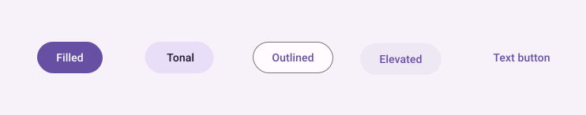
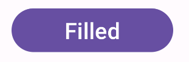
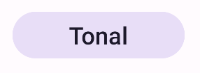
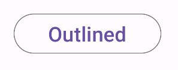
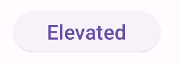
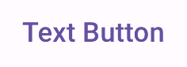

- [Button](#button)
  - [API サーフェス（各ボタンの共通パラメータ）](#api-サーフェス各ボタンの共通パラメータ)
    - [ボタンの色の変更方法](#ボタンの色の変更方法)
    - [内側の余白（ラベルテキストとボタンの外枠）の設定方法](#内側の余白ラベルテキストとボタンの外枠の設定方法)
  - [フィルドボタン (塗りつぶしボタン)](#フィルドボタン-塗りつぶしボタン)
  - [フィルドトーナルボタン (色調の異なる塗りつぶしボタン)](#フィルドトーナルボタン-色調の異なる塗りつぶしボタン)
  - [アウトラインドボタン](#アウトラインドボタン)
  - [エレベーティッドボタン (影付きの浮いたボタン)](#エレベーティッドボタン-影付きの浮いたボタン)
  - [テキストボタン](#テキストボタン)
  - [参考情報](#参考情報)


# Button

ボタンは、ユーザーが定義したアクションをトリガーできるようにする基本的なコンポーネントです。ボタンには 5 つの種類があります。次の表では、5 つのボタンの種類の外観と、それらを使用する場所について説明します。


**フィルドボタン (塗りつぶしボタン)**

- 見た目
  - 単色の背景
  - 背景に対してコントラストの高いテキスト色
- 目的
  - 強調度の高いボタン。これらは、「送信」や「保存」など、アプリケーションでの主要なアクション用です。影の効果により、ボタンの重要性が強調されます。


**フィルドトーナルボタン (色調の異なる塗りつぶしボタン)**

- 見た目
  - 背景色は Surface に合わせて変化する。
- 目的
  - 主要なアクションや重要なアクションにも使用できますが、背景色の濃い塗りつぶしボタンよりも重要性の低いアクションに向いています。
  - ボタンを押しても取り消すの効く操作に向いています。
  - 「カートに追加」や「サインイン」などの機能に適しています。


**アウトラインドボタン**

- 見た目
  - 塗りつぶしがなく、境界線があります。
- 目的
  - 中程度の強調度のボタン。重要ではあるりますが、主要なアクションではありません。
  - 他の主要なアクションを持ったボタンと対で使用することが適しています。
  - 「キャンセル」や「戻る」などのネガティブなアクションや第二の選択肢を示すのに適しています。


**エレベーティッドボタン (影付きの浮いたボタン)**

- 見た目
  - 影が付いており、目立ちます。
- 目的
  - 塗りつぶしボタンや色調の異なる塗りつぶしボタンに影をつけたものと考えて良いかと思います。
  - 影をつけることで、ボタンを強調し、目立たせることが目的です。


**テキストボタン**

- 見た目
  - 背景や境界線を持たないテキストのみのボタンです。
- 目的
  - 協調度は、 5 つのボタンの中で最も低いです。
  - 深い意味を持たない 「単なる画面遷移」 や 「詳細を表示」などの二次的な機能に最適です。




## API サーフェス（各ボタンの共通パラメータ）

- onClick: ユーザーがボタンを押したときに呼び出される関数。
- enabled: このパラメータが false の場合、ボタンは使用不可で非アクティブとして表示されます。
- colors: ボタンで使用される色を決定する ButtonColors のインスタンス。
- contentPadding: ボタン内のパディング。


### ボタンの色の変更方法

各ボタンコンポーザブルの colors パラメータを変更します。

```kotlin
Button(
    onClick = { /*TODO*/ },
    shape = MaterialTheme.shapes.extraSmall,
    modifier = Modifier.fillMaxWidth(),
    colors = ButtonDefaults.buttonColors(
        // ボタンの背景の色
        containerColor = MaterialTheme.colorScheme.surfaceContainer,
        // ボタン上に表示されるテキストやアイコンの色
        contentColor = MaterialTheme.colorScheme.onSurfaceVariant
        // 無効化時
        disabledContainerColor = /* ... */,
        disabledContentColor = /* ... */
    )
) {
    Text(text = "状態を設定する",)
}
```

4 つのパラメータ ( containerColor など) をすべて変更する場合は、 `ButtonColors` クラスのコンストラクタでインスタンスを生成し、それをボタンの colors パラメータに渡しても良さそう。


### 内側の余白（ラベルテキストとボタンの外枠）の設定方法

```kolin
Button(
    contentPadding = PaddingValues(8.dp),
) {
    Text(text = "ボタン")
}
```

ボタンには余白の最小値が設定されているためか、この方法では、ある程度小さくすると、それ以上余白が縮まらなくなります。デフォルトの最小値よりも小さい余白を設定したい場合は、 Button コンポーザブルではなく、 Surface コンポーザブルを使用することをお勧めします。


## フィルドボタン (塗りつぶしボタン)

塗りつぶされたボタン コンポーネントは、基本的な [Button](https://developer.android.com/reference/kotlin/androidx/compose/material3/package-summary?hl=ja&_gl=1*1ji7zf9*_up*MQ..*_ga*NTY3MDY5MDA1LjE3MjQ2NTg1MjY.*_ga_6HH9YJMN9M*MTcyNTAyODI3OS40LjAuMTcyNTAyODI3OS4wLjAuMA..#Button(kotlin.Function0,androidx.compose.ui.Modifier,kotlin.Boolean,androidx.compose.ui.graphics.Shape,androidx.compose.material3.ButtonColors,androidx.compose.material3.ButtonElevation,androidx.compose.foundation.BorderStroke,androidx.compose.foundation.layout.PaddingValues,androidx.compose.foundation.interaction.MutableInteractionSource,kotlin.Function1)) コンポーザブルを使用します。デフォルトでは単色で塗りつぶされます。次のスニペットは、コンポーネントを実装する方法を示しています。

```kotlin
@Composable
fun FilledButtonExample(onClick: () -> Unit) {
    Button(onClick = { onClick() }) {
        Text("Filled")
    }
}
```

**注** : カスタムボタンを作成する場合は、Button コンポーザブルを使用します。

この実装は次のようになります。




## フィルドトーナルボタン (色調の異なる塗りつぶしボタン)

塗りつぶされたトーン ボタン コンポーネントは、 [FilledTonalButton](https://developer.android.com/reference/kotlin/androidx/compose/material3/package-summary?hl=ja&_gl=1*1ji7zf9*_up*MQ..*_ga*NTY3MDY5MDA1LjE3MjQ2NTg1MjY.*_ga_6HH9YJMN9M*MTcyNTAyODI3OS40LjAuMTcyNTAyODI3OS4wLjAuMA..#FilledTonalButton(kotlin.Function0,androidx.compose.ui.Modifier,kotlin.Boolean,androidx.compose.ui.graphics.Shape,androidx.compose.material3.ButtonColors,androidx.compose.material3.ButtonElevation,androidx.compose.foundation.BorderStroke,androidx.compose.foundation.layout.PaddingValues,androidx.compose.foundation.interaction.MutableInteractionSource,kotlin.Function1)) コンポーザブルを使用します。デフォルトではトーンカラーで塗りつぶされます。

次のスニペットは、コンポーネントを実装する方法を示しています。

```kotlin
@Composable
fun FilledTonalButtonExample(onClick: () -> Unit) {
    FilledTonalButton(onClick = { onClick() }) {
        Text("Tonal")
    }
}
```

この実装は次のようになります。




## アウトラインドボタン

アウトラインドボタンコンポーネントは、 [OutlinedButton](https://developer.android.com/reference/kotlin/androidx/compose/material3/package-summary?hl=ja&_gl=1*1ji7zf9*_up*MQ..*_ga*NTY3MDY5MDA1LjE3MjQ2NTg1MjY.*_ga_6HH9YJMN9M*MTcyNTAyODI3OS40LjAuMTcyNTAyODI3OS4wLjAuMA..#OutlinedButton(kotlin.Function0,androidx.compose.ui.Modifier,kotlin.Boolean,androidx.compose.ui.graphics.Shape,androidx.compose.material3.ButtonColors,androidx.compose.material3.ButtonElevation,androidx.compose.foundation.BorderStroke,androidx.compose.foundation.layout.PaddingValues,androidx.compose.foundation.interaction.MutableInteractionSource,kotlin.Function1)) コンポーザブルを使用します。デフォルトではアウトライン付きで表示されます。

次のスニペットは、コンポーネントを実装する方法を示しています。

```kotlin
@Composable
fun OutlinedButtonExample(onClick: () -> Unit) {
    OutlinedButton(onClick = { onClick() }) {
        Text("Outlined")
    }
}
```

この実装は次のようになります。




## エレベーティッドボタン (影付きの浮いたボタン)

エレベーティッドボタンコンポーネントは、 [ElevatedButton](https://developer.android.com/reference/kotlin/androidx/compose/material3/package-summary?_gl=1*1iljyp9*_up*MQ..*_ga*NTY3MDY5MDA1LjE3MjQ2NTg1MjY.*_ga_6HH9YJMN9M*MTcyNTAyODI3OS40LjAuMTcyNTAyODI3OS4wLjAuMA..#ElevatedButton(kotlin.Function0,androidx.compose.ui.Modifier,kotlin.Boolean,androidx.compose.ui.graphics.Shape,androidx.compose.material3.ButtonColors,androidx.compose.material3.ButtonElevation,androidx.compose.foundation.BorderStroke,androidx.compose.foundation.layout.PaddingValues,androidx.compose.foundation.interaction.MutableInteractionSource,kotlin.Function1)) コンポーザブルを使用します。デフォルトでは、エレベート効果を表す影が付いています。基本的には影が付いたアウトラインドボタンであることに注意してください。

次のスニペットは、コンポーネントを実装する方法を示しています。

```kotlin
@Composable
fun ElevatedButtonExample(onClick: () -> Unit) {
    ElevatedButton(onClick = { onClick() }) {
        Text("Elevated")
    }
}
```

この実装は次のようになります。




## テキストボタン

テキストボタンコンポーネントは [TextButton](https://developer.android.com/reference/kotlin/androidx/compose/material3/package-summary?hl=ja&_gl=1*1oevdz7*_up*MQ..*_ga*NTY3MDY5MDA1LjE3MjQ2NTg1MjY.*_ga_6HH9YJMN9M*MTcyNTAyODI3OS40LjAuMTcyNTAyODI3OS4wLjAuMA..#TextButton(kotlin.Function0,androidx.compose.ui.Modifier,kotlin.Boolean,androidx.compose.ui.graphics.Shape,androidx.compose.material3.ButtonColors,androidx.compose.material3.ButtonElevation,androidx.compose.foundation.BorderStroke,androidx.compose.foundation.layout.PaddingValues,androidx.compose.foundation.interaction.MutableInteractionSource,kotlin.Function1)) コンポーザブルを使用します。押されるまではテキストのみで表示されます。デフォルトでは塗りつぶしやアウトラインはありません。

次のスニペットは、コンポーネントを実装する方法を示しています。

```kotlin
@Composable
fun TextButtonExample(onClick: () -> Unit) {
    TextButton(
        onClick = { onClick() }
    ) {
        Text("Text Button")
    }
}
```

この実装は次のようになります。




## 参考情報

- [フローティングアクションボタン](https://developer.android.com/develop/ui/compose/components/fab?hl=ja&_gl=1*1m3ecso*_up*MQ..*_ga*NTY3MDY5MDA1LjE3MjQ2NTg1MjY.*_ga_6HH9YJMN9M*MTcyNTAyODI3OS40LjAuMTcyNTAyODI3OS4wLjAuMA..)
- [マテリアル UI のドキュメント](https://m3.material.io/components/buttons/overview)


